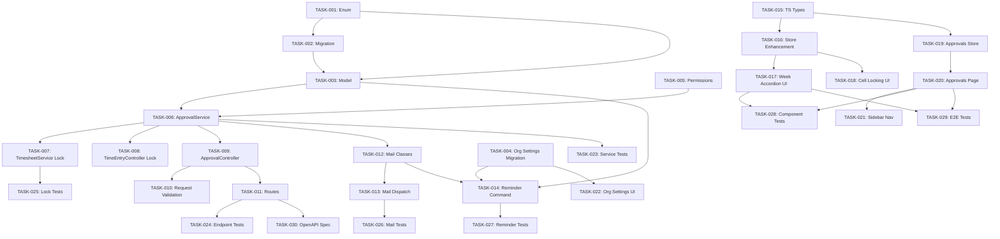

# PRD: Timesheet Approvals

Generated: 2026-02-06
Version: 1.0
Feature Branch: `feature/timesheet-approvals` (to be created from `feature/weekly-timesheet-grid`)

---

## Table of Contents

1. [Source & Context](#1-source--context)
2. [Technical Interpretation](#2-technical-interpretation)
3. [Functional Specifications](#3-functional-specifications)
4. [Technical Requirements & Constraints](#4-technical-requirements--constraints)
5. [User Stories with Acceptance Criteria](#5-user-stories-with-acceptance-criteria)
6. [Task Breakdown Structure](#6-task-breakdown-structure)
7. [Dependencies & Integration Points](#7-dependencies--integration-points)
8. [Risk Assessment & Mitigation](#8-risk-assessment--mitigation)
9. [Testing & Validation Requirements](#9-testing--validation-requirements)
10. [Monitoring & Observability](#10-monitoring--observability)
11. [Success Metrics & Definition of Done](#11-success-metrics--definition-of-done)
12. [Technical Debt & Future Considerations](#12-technical-debt--future-considerations)
13. [Appendices](#13-appendices)

---

## Amendments (2026-02-06 Review)

> These amendments supersede conflicting content in the original PRD sections below.
> Reference: `.features/SHARED-FOUNDATIONS.md` and `.features/PRD-REVIEW-REPORT.md`

### AMD-01: Task ID Prefix
All task IDs in this PRD are now prefixed with `APPR-`. E.g., TASK-001 becomes APPR-001.

### AMD-02: Permission Naming (SF-02)
Permissions updated to match shared convention `{entity}:{action}:{scope}`:
- `timesheets:view-approvals` → `timesheet-approvals:view`
- `timesheets:submit:own` → `timesheet-approvals:submit:own`
- `timesheets:approve` → `timesheet-approvals:approve`
- `timesheets:approve:all` → `timesheet-approvals:approve:all`
- `timesheets:reopen` → `timesheet-approvals:reopen`
- `timesheets:configure` → `timesheet-approvals:configure`

### AMD-03: Migration Timestamps (SF-03)
All migrations use date prefix `2026_03_01_` instead of `2026_02_07_`.

### AMD-04: Notification Infrastructure (SF-04)
Replaces ADR-4 ("no queue-based notification infrastructure"). This feature now uses the shared Laravel Notification system with `database` + `mail` channels. Mail-only classes are replaced with proper Notification classes extending `App\Notifications\BaseNotification`:
- `TimesheetSubmittedNotification`
- `TimesheetApprovedNotification`
- `TimesheetChangesRequestedNotification`
- `TimesheetReminderNotification`

**New dependency**: FOUND-001 through FOUND-005 (shared notification infrastructure) must be implemented before APPR-012 and APPR-013.

### AMD-05: Shared Approval Pattern (SF-05)
The `TimesheetApproval` model retains its dedicated model (since it wraps a member+date range, not a single entity), but now:
- Uses shared `App\Enums\ApprovalStatus` enum instead of a feature-specific enum
- Uses shared `HasApprovalWorkflow` trait for common methods
- Self-approval is NOT allowed (already correct in this PRD)

### AMD-06: Modular Permissions (SF-08)
Permissions are registered via `App\Permissions\TimesheetApprovalPermissions::register()` instead of directly modifying `JetstreamServiceProvider`. Reference: SF-08.

### AMD-07: Route Naming Fix
Route names must use `v1.` prefix per CLAUDE.md convention: `Route::name('v1.timesheet-approvals.')` not `Route::name('timesheet-approvals.')`.

### AMD-08: Critical Path Clarification
The critical path is 48 hours (per task assignments document). The PRD body's mention of "~60 hours" referred to the total backend serial path including APPR-008; the task assignments document's 48h represents the true critical path through the dependency graph.

### AMD-09: Sprint 2 Rebalancing
Sprint 2 (42 SP) should be rebalanced by moving APPR-008 (Enhance TimeEntryController, 4h/3SP) and APPR-010 (Request Validation, 4h/3SP) to Sprint 3. Revised loads:
- Sprint 1: 26 SP (unchanged)
- Sprint 2: 36 SP (was 42)
- Sprint 3: 44 SP (was 38) — acceptable since includes parallel frontend work
- Sprint 4: 21 SP (unchanged)

### AMD-10: State Machine Diagram Fix
The ASCII state diagram's `withdraw` arrow should show `submitted → draft` (not `submitted → submitted`). The text description is correct; the diagram has a rendering error.

---

## 1. Source & Context

### 1.1 Problem Statement

Solidtime currently has a functional weekly timesheet grid that allows members to track time across projects and tasks on a day-by-day basis. However, there is **no mechanism** for:

- Members to formally submit their weekly timesheets for review
- Managers/Admins to approve or reject submitted timesheets
- Locking time entries once a period is approved (preventing retroactive edits)
- Sending reminders for missing or unsubmitted time
- Maintaining an audit trail of submission and approval lifecycle events

Without an approval workflow, organizations cannot enforce compliance, guarantee data integrity for billing/payroll, or maintain accountability over reported hours.

### 1.2 Current System State

**Existing infrastructure (from `feature/weekly-timesheet-grid` branch):**

- **Weekly timesheet grid**: `TimesheetController` with `weeks`, `index`, `updateCell`, `recentTasks` endpoints
- **TimesheetService**: Business logic for week list, grid data, cell updates
- **Pinia store**: `useTimesheetStore` with lazy-loading week data, optimistic cell updates
- **UI components**: `TimesheetWeekAccordion`, `TimesheetGrid`, `TimesheetCell`, `TimesheetRowHeader`, `TimesheetAddTask`
- **Roles**: Owner, Admin, Manager, Employee, Placeholder (defined in `App\Enums\Role`)
- **Permissions**: Granular permission system via `JetstreamServiceProvider::configurePermissions()` and `PermissionStore`
- **Audit trail**: `OwenIt\Auditing` via `CustomAuditable` trait on models
- **No existing**: Notification system (only `Mail` classes exist for invitations, token expiry, still-running entries), no queue-based notification infrastructure

### 1.3 Stakeholders

| Role | Interest |
|------|----------|
| Employee | Submit timesheets, receive feedback on rejections, see submission status |
| Manager | Review team timesheets, approve/reject with comments, filter pending reviews |
| Admin/Owner | Configure approval policies, view compliance dashboards, override locks |
| System | Enforce locking, send reminders, maintain audit trail |

---

## 2. Technical Interpretation

### 2.1 Business-to-Technical Translation

| Business Requirement | Technical Implementation |
|---------------------|------------------------|
| Member marks week as "ready for review" | Create `TimesheetApproval` record with status `submitted`, set `submitted_at` timestamp |
| System locks editing on submitted week | Check `TimesheetApproval.status` before allowing `TimeEntry` create/update/delete within the period |
| Manager reviews and approves/rejects | Update `TimesheetApproval.status` to `approved`/`changes_requested`, store `reviewed_by`, `reviewed_at`, `rejection_reason` |
| Approved period is permanently locked | `TimesheetApproval.status === 'approved'` prevents all `TimeEntry` mutations in that date range for that member |
| Reminders for missing time | Laravel scheduled command queries members without `TimesheetApproval` records for the relevant period and dispatches mail notifications |
| Audit trail of approval actions | `CustomAuditable` trait on `TimesheetApproval` model, plus explicit event logging for state transitions |

### 2.2 Architectural Decisions

**ADR-1: Single `TimesheetApproval` model (not per-entry locking)**

We use a period-based approval model rather than per-entry locking. A `TimesheetApproval` record represents the state of an entire week for a given member. This is simpler to query, aligns with the weekly timesheet grid UI, and avoids the complexity of tracking approval state on individual time entries.

**ADR-2: State machine pattern for approval status**

Status transitions follow strict rules enforced in the service layer:
- `draft` -> `submitted` (by member)
- `submitted` -> `approved` (by manager/admin)
- `submitted` -> `changes_requested` (by manager/admin)
- `changes_requested` -> `submitted` (by member, after making changes)
- `approved` -> `reopened` (by admin only, exceptional case)

**ADR-3: Locking enforced at the service layer, not database triggers**

Locking checks are implemented in `TimesheetService::updateCell()` and `TimeEntryService` (for direct time entry mutations). This keeps the logic testable, consistent with existing patterns, and avoids database-vendor-specific features.

**ADR-4: Mail-based notifications (no real-time push)**

The application currently uses Mailable classes for notifications (e.g., `TimeEntryStillRunningMail`). We follow this pattern for approval notifications rather than introducing a new notification channel. Real-time UI updates use polling/Inertia visits.

---

## 3. Functional Specifications

### 3.1 Sub-feature 4.1: Timesheet Submission

#### REQ-001: Submit Timesheet for Review
- **Priority**: P0
- **Description**: A member can submit their weekly timesheet for a specific week, changing its state from `draft` to `submitted`.
- **Preconditions**:
  - The week must contain at least one completed time entry (with both `start` and `end`).
  - No running (open-ended) time entries exist in the period.
  - The period must not already be in `submitted` or `approved` state.
- **Post-conditions**:
  - A `TimesheetApproval` record is created/updated with `status = 'submitted'` and `submitted_at` set.
  - All time entries within the period become read-only for the member.
  - Managers/Admins with `timesheets:approve` permission are notified.
- **Edge Cases**:
  - Member tries to submit an empty week: return 422 with validation error.
  - Member has a running timer within the week: return 422 with error "Stop running time entries before submitting."
  - Member tries to submit an already-submitted week: return 409 Conflict.
  - Multiple submissions in quick succession: database unique constraint on (member_id, start_date, end_date) prevents duplicates.

#### REQ-002: Withdraw Submission
- **Priority**: P1
- **Description**: A member can withdraw a submitted (but not yet approved) timesheet, returning it to `draft` state.
- **Preconditions**: Status must be `submitted` (not `approved` or `changes_requested`).
- **Post-conditions**: Status returns to `draft`, entries become editable again.

#### REQ-003: Resubmit After Changes Requested
- **Priority**: P0
- **Description**: When a timesheet is in `changes_requested` state, the member can edit their entries and resubmit.
- **Post-conditions**: Status changes from `changes_requested` to `submitted`, `submitted_at` updated.

### 3.2 Sub-feature 4.2: Timesheet Approvals

#### REQ-004: View Pending Approvals
- **Priority**: P0
- **Description**: Managers/Admins can view a list of submitted timesheets awaiting review.
- **Filters**: By member, by date range, by status (submitted, changes_requested, approved).
- **Sort**: Most recent submission first by default.
- **Data shown**: Member name, week range, total hours, submission date, number of entries.

#### REQ-005: Approve Timesheet
- **Priority**: P0
- **Description**: A manager/admin approves a submitted timesheet, permanently locking the entries.
- **Preconditions**: Status must be `submitted`.
- **Post-conditions**:
  - Status changes to `approved`, `reviewed_by` and `reviewed_at` set.
  - All time entries in the period become permanently locked (no edits/deletes).
  - Member is notified of approval.

#### REQ-006: Request Changes
- **Priority**: P0
- **Description**: A manager/admin requests changes on a submitted timesheet, providing a reason.
- **Preconditions**: Status must be `submitted`.
- **Post-conditions**:
  - Status changes to `changes_requested`, `reviewed_by`, `reviewed_at`, and `rejection_reason` set.
  - Time entries become editable again for the member.
  - Member is notified with the rejection reason.

#### REQ-007: Bulk Approve
- **Priority**: P2
- **Description**: A manager/admin can approve multiple submitted timesheets at once.
- **Preconditions**: All selected timesheets must be in `submitted` state.

#### REQ-008: Reopen Approved Timesheet (Admin Only)
- **Priority**: P2
- **Description**: An admin can reopen an approved timesheet for corrections in exceptional cases.
- **Post-conditions**: Status changes to `reopened` (treated like `draft` for editing), audit log records the override.

### 3.3 Sub-feature 4.3: Reminders & Compliance

#### REQ-009: Missing Time Reminder
- **Priority**: P1
- **Description**: System sends email reminders to members who have logged fewer than a configurable threshold of hours for the current/previous week.
- **Configuration**: Organization-level setting for minimum expected hours per week (default: 40h) and reminder schedule (daily/weekly).
- **Implementation**: Laravel scheduled Artisan command running on configured schedule.

#### REQ-010: Unsubmitted Timesheet Reminder
- **Priority**: P1
- **Description**: System sends email reminders to members who have not submitted their timesheet for the previous week.
- **Timing**: Configurable (e.g., Monday morning for the previous week).
- **Exclusions**: Members with `Placeholder` role are excluded.

#### REQ-011: Compliance Dashboard Widget
- **Priority**: P2
- **Description**: Dashboard widget showing submission/approval status across the team for the current and recent weeks.

### 3.4 Sub-feature 4.4: Audit Trail Enhancement

#### REQ-012: Approval Lifecycle Auditing
- **Priority**: P0
- **Description**: All state transitions on `TimesheetApproval` records are logged via the existing `OwenIt\Auditing` infrastructure.
- **Events logged**: created, submitted, approved, changes_requested, withdrawn, reopened.
- **Data captured**: Old/new status, acting user, timestamp, rejection reason (if applicable).

#### REQ-013: Time Entry Lock Audit
- **Priority**: P1
- **Description**: When a time entry mutation is blocked due to an approved period, the blocked attempt is logged for compliance.

### 3.5 User Workflows

```
Member Submission Flow:
=======================
Member completes week
        |
        v
[Timesheet Page] -- Click "Submit Week" -->
        |
        v
System validates: entries exist, no running timers
        |
  [Valid?]---No---> Show validation errors
        |
       Yes
        |
        v
Create TimesheetApproval(status='submitted')
Lock entries for editing
Notify managers via email
        |
        v
[Submitted - Awaiting Review]
        |
  [Manager action?]
    |          |
 Approve    Request Changes
    |          |
    v          v
[Approved]  [Changes Requested]
 (Locked)    (Unlocked for member)
                |
                v
          Member edits entries
                |
                v
          Member clicks "Resubmit"
                |
                v
          [Submitted] (cycle repeats)
```

```
Manager Approval Flow:
======================
Manager opens "Approvals" page
        |
        v
View list of pending timesheets
(filter by member, date range, status)
        |
        v
Click on a timesheet to review
        |
        v
View weekly grid with hours per project/task
View total hours, compare to expected
        |
  [Decision?]
    |           |
 Approve     Request Changes
    |           |
    v           v
Set status   Set status='changes_requested'
='approved'  Add rejection reason
Notify       Notify member
member
```

### 3.6 State Machine

```
                    +-----------+
                    |   draft   |
                    +-----+-----+
                          |
                   submit |
                          v
                    +-----------+     withdraw
                    | submitted |<-----------------+
                    +-----+-----+                  |
                          |                        |
              +-----------+-----------+            |
              |                       |            |
       approve|              request  |            |
              |              changes  |            |
              v                       v            |
        +-----------+     +-------------------+    |
        | approved  |     | changes_requested |----+
        +-----+-----+     +-------------------+
              |                   resubmit
       reopen | (admin only)
              v
        +-----------+
        | reopened  |
        +-----+-----+
              |
       submit |
              v
        +-----------+
        | submitted |
        +-----------+
```

### 3.7 Business Rules

1. **One approval record per member per week**: Unique constraint on `(member_id, start_date, end_date)`.
2. **Locking hierarchy**: `approved` > `submitted` > `changes_requested` > `draft`. Entries in `submitted` state are locked for the member but visible for review. Entries in `approved` state are locked for everyone except admin reopen.
3. **Permission matrix**:

| Action | Employee | Manager | Admin | Owner |
|--------|----------|---------|-------|-------|
| Submit own timesheet | Yes | Yes | Yes | Yes |
| Withdraw own submission | Yes | Yes | Yes | Yes |
| View pending approvals | No | Yes (team) | Yes (all) | Yes (all) |
| Approve/reject | No | Yes (team) | Yes (all) | Yes (all) |
| Reopen approved | No | No | Yes | Yes |
| Configure reminders | No | No | Yes | Yes |

4. **"Team" scope for managers**: A manager can approve timesheets of members assigned to projects they manage. This leverages the existing `ProjectMember` relationship.
5. **Timezone handling**: Week boundaries are determined by the *submitting member's* timezone, consistent with the existing `TimesheetService` behavior.

---

## 4. Technical Requirements & Constraints

### 4.1 System Architecture

```
┌─────────────────────────────────────────────────────────────────┐
│                        Frontend (Vue 3)                         │
│                                                                 │
│  ┌──────────────┐  ┌──────────────────┐  ┌──────────────────┐  │
│  │ Timesheet.vue│  │ Approvals.vue    │  │ Dashboard widget │  │
│  │ (enhanced)   │  │ (new page)       │  │ (compliance)     │  │
│  └──────┬───────┘  └────────┬─────────┘  └────────┬─────────┘  │
│         │                   │                      │            │
│  ┌──────┴───────┐  ┌───────┴──────────┐           │            │
│  │useTimesheet  │  │useApprovals      │           │            │
│  │Store         │  │Store (new)       │           │            │
│  │(enhanced)    │  │                  │           │            │
│  └──────┬───────┘  └───────┬──────────┘           │            │
│         │                   │                      │            │
└─────────┼───────────────────┼──────────────────────┼────────────┘
          │                   │                      │
          │    API Layer (Laravel + Passport)         │
          │                   │                      │
┌─────────┼───────────────────┼──────────────────────┼────────────┐
│  ┌──────┴───────┐  ┌───────┴──────────┐  ┌───────┴─────────┐  │
│  │ Timesheet    │  │TimesheetApproval │  │ ChartController  │  │
│  │ Controller   │  │Controller (new)  │  │ (enhanced)       │  │
│  │ (enhanced)   │  │                  │  │                  │  │
│  └──────┬───────┘  └───────┬──────────┘  └───────┬──────────┘  │
│         │                   │                      │            │
│  ┌──────┴───────────────────┴──────────────────────┴─────────┐  │
│  │                    Service Layer                           │  │
│  │  ┌────────────────────┐  ┌─────────────────────────────┐  │  │
│  │  │  TimesheetService  │  │ TimesheetApprovalService    │  │  │
│  │  │  (enhanced: lock   │  │ (new: state machine,        │  │  │
│  │  │   checks)          │  │  notifications, validation) │  │  │
│  │  └────────────────────┘  └─────────────────────────────┘  │  │
│  └───────────────────────────────────────────────────────────┘  │
│                                                                 │
│  ┌───────────────────────────────────────────────────────────┐  │
│  │                    Data Layer                              │  │
│  │  ┌────────────────────┐  ┌──────────────────────────────┐ │  │
│  │  │  TimeEntry model   │  │ TimesheetApproval model      │ │  │
│  │  │  (unchanged)       │  │ (new: Auditable, HasUuids)   │ │  │
│  │  └────────────────────┘  └──────────────────────────────┘ │  │
│  └───────────────────────────────────────────────────────────┘  │
│                                                                 │
│  ┌───────────────────────────────────────────────────────────┐  │
│  │              Scheduled Commands                            │  │
│  │  ┌──────────────────────────────┐                         │  │
│  │  │ TimesheetReminderCommand     │                         │  │
│  │  │ (new: sends reminder mails)  │                         │  │
│  │  └──────────────────────────────┘                         │  │
│  └───────────────────────────────────────────────────────────┘  │
└─────────────────────────────────────────────────────────────────┘
```

### 4.2 Data Model

#### TimesheetApproval (new model)

```php
/**
 * @property string $id                    UUID primary key
 * @property string $member_id             FK -> members.id
 * @property string $organization_id       FK -> organizations.id
 * @property string $start_date            Week start (Y-m-d, in member's timezone)
 * @property string $end_date              Week end (Y-m-d, in member's timezone)
 * @property string $status                Enum: draft, submitted, approved, changes_requested, reopened
 * @property Carbon|null $submitted_at     When member submitted
 * @property string|null $reviewed_by      FK -> members.id (reviewer)
 * @property Carbon|null $reviewed_at      When review action was taken
 * @property string|null $rejection_reason Free-text reason for changes_requested
 * @property int $total_seconds            Snapshot of total tracked seconds at submission time
 * @property int $entry_count              Snapshot of number of time entries at submission time
 * @property Carbon $created_at
 * @property Carbon $updated_at
 */
```

**Database migration:**

```sql
CREATE TABLE timesheet_approvals (
    id UUID PRIMARY KEY DEFAULT gen_random_uuid(),
    member_id UUID NOT NULL REFERENCES members(id) ON DELETE CASCADE,
    organization_id UUID NOT NULL REFERENCES organizations(id) ON DELETE CASCADE,
    start_date DATE NOT NULL,
    end_date DATE NOT NULL,
    status VARCHAR(50) NOT NULL DEFAULT 'draft',
    submitted_at TIMESTAMP NULL,
    reviewed_by UUID NULL REFERENCES members(id) ON DELETE SET NULL,
    reviewed_at TIMESTAMP NULL,
    rejection_reason TEXT NULL,
    total_seconds INTEGER NOT NULL DEFAULT 0,
    entry_count INTEGER NOT NULL DEFAULT 0,
    created_at TIMESTAMP DEFAULT CURRENT_TIMESTAMP,
    updated_at TIMESTAMP DEFAULT CURRENT_TIMESTAMP,

    CONSTRAINT uq_timesheet_approval_member_period
        UNIQUE (member_id, start_date, end_date),
    CONSTRAINT chk_timesheet_approval_status
        CHECK (status IN ('draft', 'submitted', 'approved', 'changes_requested', 'reopened'))
);

CREATE INDEX idx_timesheet_approvals_org_status ON timesheet_approvals(organization_id, status);
CREATE INDEX idx_timesheet_approvals_member ON timesheet_approvals(member_id, start_date);
CREATE INDEX idx_timesheet_approvals_reviewed_by ON timesheet_approvals(reviewed_by);
```

#### TimesheetApprovalStatus (new enum)

```php
<?php
declare(strict_types=1);
namespace App\Enums;

enum TimesheetApprovalStatus: string
{
    case Draft = 'draft';
    case Submitted = 'submitted';
    case Approved = 'approved';
    case ChangesRequested = 'changes_requested';
    case Reopened = 'reopened';
}
```

#### Organization (enhanced)

New columns for reminder configuration:

```sql
ALTER TABLE organizations
    ADD COLUMN timesheet_reminder_enabled BOOLEAN NOT NULL DEFAULT FALSE,
    ADD COLUMN timesheet_reminder_day INTEGER NULL, -- 0=Sun, 1=Mon, ...6=Sat
    ADD COLUMN timesheet_expected_hours_per_week NUMERIC(5,2) NULL DEFAULT 40.00,
    ADD COLUMN timesheet_approval_required BOOLEAN NOT NULL DEFAULT FALSE;
```

### 4.3 API Contracts

#### 4.3.1 Timesheet Approval Endpoints

**POST** `/api/v1/organizations/{organization}/timesheet-approvals/submit`

Submit a weekly timesheet for review.

```yaml
Request:
  Content-Type: application/json
  Body:
    week_start: string (required, date format Y-m-d)
    week_end: string (required, date format Y-m-d)
Response:
  201 Created:
    data:
      id: string (UUID)
      member_id: string
      organization_id: string
      start_date: string
      end_date: string
      status: "submitted"
      submitted_at: string (ISO 8601)
      reviewed_by: null
      reviewed_at: null
      rejection_reason: null
      total_seconds: integer
      entry_count: integer
  409 Conflict:
    error:
      message: "Timesheet for this period is already submitted"
  422 Unprocessable Entity:
    error:
      message: "Cannot submit: running time entries exist in this period"
      | "Cannot submit: no time entries found in this period"
```

**POST** `/api/v1/organizations/{organization}/timesheet-approvals/{timesheetApproval}/withdraw`

Withdraw a submitted timesheet (return to draft).

```yaml
Request: (empty body)
Response:
  200 OK:
    data: TimesheetApproval (status: "draft")
  403 Forbidden:
    error: "Cannot withdraw: timesheet is not in submitted state"
```

**POST** `/api/v1/organizations/{organization}/timesheet-approvals/{timesheetApproval}/approve`

Approve a submitted timesheet.

```yaml
Request: (empty body)
Response:
  200 OK:
    data: TimesheetApproval (status: "approved")
  403 Forbidden:
    error: "Insufficient permissions"
  422 Unprocessable Entity:
    error: "Cannot approve: timesheet is not in submitted state"
```

**POST** `/api/v1/organizations/{organization}/timesheet-approvals/{timesheetApproval}/request-changes`

Request changes on a submitted timesheet.

```yaml
Request:
  Content-Type: application/json
  Body:
    rejection_reason: string (required, max: 2000)
Response:
  200 OK:
    data: TimesheetApproval (status: "changes_requested")
  422 Unprocessable Entity:
    error: "Cannot request changes: timesheet is not in submitted state"
```

**POST** `/api/v1/organizations/{organization}/timesheet-approvals/{timesheetApproval}/reopen`

Reopen an approved timesheet (admin/owner only).

```yaml
Request:
  Content-Type: application/json
  Body:
    reason: string (required, max: 2000)
Response:
  200 OK:
    data: TimesheetApproval (status: "reopened")
  403 Forbidden:
    error: "Only administrators can reopen approved timesheets"
```

**GET** `/api/v1/organizations/{organization}/timesheet-approvals`

List timesheet approvals with filters.

```yaml
Query Parameters:
  status: string (optional, comma-separated: "submitted,approved,changes_requested")
  member_id: string (optional, UUID)
  start_date_from: string (optional, Y-m-d)
  start_date_to: string (optional, Y-m-d)
  limit: integer (optional, default 20, max 100)
  offset: integer (optional, default 0)
Response:
  200 OK:
    data:
      - id: string
        member_id: string
        member:
          id: string
          name: string
          email: string
          profile_photo_url: string
        organization_id: string
        start_date: string
        end_date: string
        status: string
        submitted_at: string|null
        reviewed_by: string|null
        reviewer:
          id: string
          name: string
        reviewed_at: string|null
        rejection_reason: string|null
        total_seconds: integer
        entry_count: integer
    meta:
      total: integer
      limit: integer
      offset: integer
```

**GET** `/api/v1/organizations/{organization}/timesheet-approvals/my`

Get the current member's approval status for recent weeks.

```yaml
Query Parameters:
  limit: integer (optional, default 8)
Response:
  200 OK:
    data:
      - week_start: string
        week_end: string
        status: string|null (null if no approval record exists = draft)
        submitted_at: string|null
        reviewed_at: string|null
        rejection_reason: string|null
```

#### 4.3.2 Enhanced Existing Endpoints

**GET** `/api/v1/organizations/{organization}/timesheet/weeks` (enhanced response)

Add `approval_status` to each week entry:

```yaml
Response addition per week:
  approval_status: string|null  # "draft"|"submitted"|"approved"|"changes_requested"|"reopened"|null
  approval_id: string|null      # UUID of the TimesheetApproval record, if exists
```

**PUT** `/api/v1/organizations/{organization}/timesheet/cell` (enhanced validation)

Now returns 423 Locked when the period is submitted or approved:

```yaml
Response (new):
  423 Locked:
    error:
      message: "Cannot edit: timesheet period is submitted/approved"
      approval_status: "submitted"|"approved"
```

### 4.4 New Permissions

Added to `JetstreamServiceProvider::configurePermissions()`:

```php
// New permissions
'timesheets:submit:own'        // Submit own weekly timesheet
'timesheets:withdraw:own'      // Withdraw own submitted timesheet
'timesheets:approve'           // Approve/reject submitted timesheets (team scope for Manager)
'timesheets:approve:all'       // Approve/reject any submitted timesheet
'timesheets:reopen'            // Reopen approved timesheets
'timesheets:view-approvals'    // View approval queue
'timesheets:configure'         // Configure reminder/approval settings
```

**Permission assignment by role:**

| Permission | Owner | Admin | Manager | Employee |
|-----------|-------|-------|---------|----------|
| `timesheets:submit:own` | Yes | Yes | Yes | Yes |
| `timesheets:withdraw:own` | Yes | Yes | Yes | Yes |
| `timesheets:approve` | Yes | Yes | Yes | No |
| `timesheets:approve:all` | Yes | Yes | No | No |
| `timesheets:reopen` | Yes | Yes | No | No |
| `timesheets:view-approvals` | Yes | Yes | Yes | No |
| `timesheets:configure` | Yes | Yes | No | No |

### 4.5 Performance Requirements

- **Approval status lookup**: The lock-check query must execute in < 5ms (indexed lookup by `member_id + start_date`).
- **Approval list page**: Paginated query with filters must return in < 200ms for organizations with up to 500 members.
- **Bulk approve**: Up to 50 timesheets per request, complete in < 2s.
- **Reminder command**: Process 10,000 members in < 60s.

### 4.6 Security Requirements

- All approval state changes require authentication via Passport.
- Write endpoints use `check-organization-blocked` middleware.
- Members cannot approve their own timesheets (enforced in service layer).
- Managers can only approve timesheets for members on shared projects (team scope).
- Rate limiting on submission/approval endpoints: 30 requests/minute per user.
- `rejection_reason` is sanitized to prevent XSS (strip HTML tags).

---

## 5. User Stories with Acceptance Criteria

### USR-001: Submit Weekly Timesheet

**As an** Employee
**I want to** submit my completed weekly timesheet for review
**So that** my manager can verify and approve my logged hours

**Priority**: P0
**Effort**: 8 story points
**Sprint**: 1-2

**Acceptance Criteria**:
- [ ] A "Submit Week" button appears on the timesheet page for each week in `draft` or `reopened` state
- [ ] Button is disabled if the week has no completed time entries
- [ ] Button is disabled if there are running (no end time) entries in the period
- [ ] Clicking "Submit Week" shows a confirmation dialog with total hours summary
- [ ] After submission, all cells in the week grid become read-only (greyed out)
- [ ] The week accordion header shows a "Submitted" badge with timestamp
- [ ] A success notification appears after successful submission
- [ ] If submission fails (409, 422), an appropriate error message is shown
- [ ] The member receives no additional notification (they initiated the action)
- [ ] Managers with `timesheets:approve` permission receive an email notification

### USR-002: Withdraw Submitted Timesheet

**As an** Employee
**I want to** withdraw my submitted timesheet before it is reviewed
**So that** I can make corrections to my time entries

**Priority**: P1
**Effort**: 3 story points
**Sprint**: 2

**Acceptance Criteria**:
- [ ] A "Withdraw" button appears on weeks in `submitted` state
- [ ] Clicking "Withdraw" shows a confirmation dialog
- [ ] After withdrawal, time entries become editable again
- [ ] The week accordion header returns to its default (no badge or "Draft" badge)
- [ ] Cannot withdraw if status is `approved` or `changes_requested`

### USR-003: View Pending Approvals

**As a** Manager
**I want to** see a list of submitted timesheets awaiting my review
**So that** I can approve or request changes on team timesheets

**Priority**: P0
**Effort**: 8 story points
**Sprint**: 2-3

**Acceptance Criteria**:
- [ ] A new "Approvals" page is accessible from the sidebar navigation
- [ ] The page shows a filterable, paginated table of timesheet submissions
- [ ] Filters: member name, date range, status (submitted, approved, changes_requested)
- [ ] Each row shows: member name + avatar, week range, total hours, submission date, status badge
- [ ] Clicking a row opens the approval detail view
- [ ] Managers see only timesheets for members on their shared projects
- [ ] Admins/Owners see all organization timesheets
- [ ] Empty state shows helpful message when no approvals are pending

### USR-004: Approve Timesheet

**As a** Manager
**I want to** approve a submitted timesheet
**So that** the member's hours are finalized and the period is locked

**Priority**: P0
**Effort**: 5 story points
**Sprint**: 3

**Acceptance Criteria**:
- [ ] An "Approve" button appears on the approval detail view for `submitted` timesheets
- [ ] The detail view shows the member's weekly grid (read-only) with project/task hours
- [ ] Clicking "Approve" shows a confirmation dialog
- [ ] After approval, status changes to `approved`, the row shows an "Approved" badge
- [ ] The member receives an email notification of the approval
- [ ] The approver cannot approve their own timesheet
- [ ] After approval, time entries in the period cannot be edited or deleted by anyone

### USR-005: Request Changes on Timesheet

**As a** Manager
**I want to** request changes on a submitted timesheet with a comment
**So that** the member knows what needs to be corrected

**Priority**: P0
**Effort**: 5 story points
**Sprint**: 3

**Acceptance Criteria**:
- [ ] A "Request Changes" button appears alongside "Approve" on submitted timesheets
- [ ] Clicking "Request Changes" opens a dialog with a required comment field (max 2000 chars)
- [ ] After requesting changes, status changes to `changes_requested`
- [ ] The member receives an email notification with the rejection reason
- [ ] On the member's timesheet page, the week shows a "Changes Requested" badge with the comment
- [ ] The member can edit their time entries in the period again
- [ ] The member can resubmit after making changes

### USR-006: Reopen Approved Timesheet (Admin)

**As an** Admin
**I want to** reopen an approved timesheet in exceptional cases
**So that** corrections can be made to finalized periods

**Priority**: P2
**Effort**: 3 story points
**Sprint**: 4

**Acceptance Criteria**:
- [ ] A "Reopen" button appears only for Admin/Owner users on approved timesheets
- [ ] Clicking "Reopen" requires a reason (audit trail)
- [ ] After reopening, the member can edit entries and resubmit
- [ ] The reopen action is logged in the audit trail
- [ ] Managers cannot reopen approved timesheets

### USR-007: Receive Reminder for Missing Time

**As an** Employee
**I want to** receive a reminder when I have not logged enough time
**So that** I do not forget to track my hours

**Priority**: P1
**Effort**: 5 story points
**Sprint**: 4

**Acceptance Criteria**:
- [ ] Admin can enable/disable reminders in organization settings
- [ ] Admin can set expected hours per week (default 40)
- [ ] Admin can set reminder day (e.g., Friday for current week, Monday for previous week)
- [ ] Members receive an email if logged hours are below the threshold
- [ ] Placeholder members are excluded from reminders
- [ ] Reminder email includes: hours logged vs expected, link to timesheet page
- [ ] Members who have already submitted their timesheet are excluded

### USR-008: Receive Reminder for Unsubmitted Timesheet

**As an** Employee
**I want to** receive a reminder when I have not submitted my previous week's timesheet
**So that** I comply with the organization's approval workflow

**Priority**: P1
**Effort**: 3 story points
**Sprint**: 4

**Acceptance Criteria**:
- [ ] Reminder is only sent when `timesheet_approval_required` is enabled for the organization
- [ ] Sent on the configured day after the week ends
- [ ] Members with no time entries for the week are also reminded (to log time and submit)
- [ ] Email includes link to the timesheet page for the relevant week
- [ ] Members who have already submitted are excluded

---

## 6. Task Breakdown Structure

### Phase 1: Foundation (Sprint 1) -- Database, Models, Enum, Permissions

#### TASK-001: Create TimesheetApprovalStatus Enum
**Type**: Backend
**Effort**: 1 hour (1 SP)
**Dependencies**: None

**Description**: Create the `TimesheetApprovalStatus` enum following the existing pattern in `app/Enums/`.

**Files to create**:
- `app/Enums/TimesheetApprovalStatus.php`

**Implementation Details**:
```php
<?php
declare(strict_types=1);
namespace App\Enums;

enum TimesheetApprovalStatus: string
{
    case Draft = 'draft';
    case Submitted = 'submitted';
    case Approved = 'approved';
    case ChangesRequested = 'changes_requested';
    case Reopened = 'reopened';

    /**
     * Returns true if time entries should be locked (read-only for the member).
     */
    public function isLockedForMember(): bool
    {
        return match ($this) {
            self::Submitted, self::Approved => true,
            default => false,
        };
    }

    /**
     * Returns true if time entries are permanently locked (approved).
     */
    public function isPermanentlyLocked(): bool
    {
        return $this === self::Approved;
    }
}
```

**Acceptance Criteria**:
- [ ] Enum has all five status values
- [ ] `isLockedForMember()` returns correct results
- [ ] `isPermanentlyLocked()` returns correct results
- [ ] File follows `declare(strict_types=1)` convention

---

#### TASK-002: Create Database Migration for timesheet_approvals Table
**Type**: Backend / Database
**Effort**: 2 hours (2 SP)
**Dependencies**: [TASK-001]

**Description**: Create the migration for the `timesheet_approvals` table with all columns, indexes, foreign keys, and constraints.

**Files to create**:
- `database/migrations/2026_02_07_000001_create_timesheet_approvals_table.php`

**Implementation Details**:
Follow the existing migration patterns (UUID primary keys, `$table->uuid()` for IDs, foreign key references to `members` and `organizations`).

Key columns: `id`, `member_id`, `organization_id`, `start_date`, `end_date`, `status`, `submitted_at`, `reviewed_by`, `reviewed_at`, `rejection_reason`, `total_seconds`, `entry_count`, `created_at`, `updated_at`.

Indexes: unique on `(member_id, start_date, end_date)`, index on `(organization_id, status)`, index on `(member_id, start_date)`.

**Acceptance Criteria**:
- [ ] Migration creates table with all specified columns
- [ ] Unique constraint prevents duplicate periods per member
- [ ] Foreign keys reference correct tables with appropriate ON DELETE behavior
- [ ] Migration is reversible (down method drops table)
- [ ] `php artisan migrate` runs without errors

---

#### TASK-003: Create TimesheetApproval Model
**Type**: Backend
**Effort**: 4 hours (3 SP)
**Dependencies**: [TASK-001, TASK-002]

**Description**: Create the Eloquent model following the patterns established by `TimeEntry`, `Member`, and other existing models.

**Files to create**:
- `app/Models/TimesheetApproval.php`
- `database/factories/TimesheetApprovalFactory.php`

**Implementation Details**:

The model should:
- Use `HasUuids`, `CustomAuditable`, `HasFactory` traits (matching `TimeEntry` pattern)
- Define `$casts` for date fields and status enum
- Define relationships: `belongsTo` Member (submitter), `belongsTo` Member (reviewer), `belongsTo` Organization
- Include scope methods: `scopeForMember()`, `scopeForOrganization()`, `scopeWithStatus()`, `scopePending()`
- Include helper methods: `isEditable()`, `isLocked()`, `canTransitionTo()`

The factory should support states: `draft()`, `submitted()`, `approved()`, `changesRequested()`, `reopened()`.

**Acceptance Criteria**:
- [ ] Model uses `CustomAuditable` for audit trail
- [ ] Model uses `HasUuids` for UUID primary keys
- [ ] All relationships are defined with proper type hints
- [ ] Factory creates valid records in each state
- [ ] Status enum is properly cast
- [ ] Date columns are properly cast to Carbon

---

#### TASK-004: Add Organization Reminder Settings Migration
**Type**: Backend / Database
**Effort**: 1 hour (1 SP)
**Dependencies**: None

**Description**: Add reminder configuration columns to the `organizations` table.

**Files to create**:
- `database/migrations/2026_02_07_000002_add_timesheet_approval_settings_to_organizations_table.php`

**Columns to add**:
- `timesheet_reminder_enabled` (boolean, default false)
- `timesheet_reminder_day` (integer, nullable, 0-6 for Sun-Sat)
- `timesheet_expected_hours_per_week` (numeric(5,2), nullable, default 40.00)
- `timesheet_approval_required` (boolean, default false)

**Acceptance Criteria**:
- [ ] Migration adds all four columns
- [ ] Default values are set correctly
- [ ] Migration is reversible
- [ ] Organization model `$casts` updated to include new columns

---

#### TASK-005: Register New Permissions in JetstreamServiceProvider
**Type**: Backend
**Effort**: 2 hours (2 SP)
**Dependencies**: None

**Description**: Add all new timesheet approval permissions to the existing role definitions in `JetstreamServiceProvider::configurePermissions()`.

**Files to modify**:
- `app/Providers/JetstreamServiceProvider.php`

**Permissions to add per role**:
- Owner: `timesheets:submit:own`, `timesheets:withdraw:own`, `timesheets:approve`, `timesheets:approve:all`, `timesheets:reopen`, `timesheets:view-approvals`, `timesheets:configure`
- Admin: same as Owner
- Manager: `timesheets:submit:own`, `timesheets:withdraw:own`, `timesheets:approve`, `timesheets:view-approvals`
- Employee: `timesheets:submit:own`, `timesheets:withdraw:own`

**Acceptance Criteria**:
- [ ] All seven new permissions are registered
- [ ] Each role receives the correct set of permissions
- [ ] Existing permissions are not modified
- [ ] PermissionStore correctly resolves the new permissions

---

### Phase 2: Core Service Layer (Sprint 1-2)

#### TASK-006: Create TimesheetApprovalService
**Type**: Backend
**Effort**: 16 hours (8 SP)
**Dependencies**: [TASK-001, TASK-002, TASK-003, TASK-005]

**Description**: Create the stateless service class that implements all business logic for the approval workflow.

**Files to create**:
- `app/Service/TimesheetApprovalService.php`

**Methods to implement**:
```php
class TimesheetApprovalService
{
    /**
     * Submit a weekly timesheet for review.
     * Validates: entries exist, no running timers, not already submitted.
     * Creates/updates TimesheetApproval record with status 'submitted'.
     */
    public function submit(Organization $organization, Member $member, string $startDate, string $endDate, string $timezone): TimesheetApproval;

    /**
     * Withdraw a submitted timesheet back to draft.
     * Validates: current status is 'submitted'.
     */
    public function withdraw(TimesheetApproval $approval, Member $actingMember): TimesheetApproval;

    /**
     * Approve a submitted timesheet.
     * Validates: current status is 'submitted', reviewer is not the submitter.
     */
    public function approve(TimesheetApproval $approval, Member $reviewer): TimesheetApproval;

    /**
     * Request changes on a submitted timesheet.
     * Validates: current status is 'submitted'.
     */
    public function requestChanges(TimesheetApproval $approval, Member $reviewer, string $reason): TimesheetApproval;

    /**
     * Reopen an approved timesheet (admin action).
     * Validates: current status is 'approved'.
     */
    public function reopen(TimesheetApproval $approval, Member $adminMember, string $reason): TimesheetApproval;

    /**
     * Check if a time entry can be modified given the approval state of its period.
     * Returns the blocking approval if locked, null if editable.
     */
    public function getBlockingApproval(Organization $organization, Member $member, Carbon $date): ?TimesheetApproval;

    /**
     * Get approval statuses for a list of week periods.
     */
    public function getApprovalStatuses(Organization $organization, Member $member, array $weekPeriods): array;

    /**
     * List approvals with filters for the approval queue.
     */
    public function listPendingApprovals(Organization $organization, ?Member $filterMember, ?string $status, ?string $startDateFrom, ?string $startDateTo, int $limit, int $offset): LengthAwarePaginator;

    /**
     * Bulk approve multiple submitted timesheets.
     */
    public function bulkApprove(array $approvalIds, Member $reviewer): array;
}
```

**State transition validation rules:**
- `draft` -> `submitted`: only by the member themselves
- `submitted` -> `draft` (withdraw): only by the member themselves
- `submitted` -> `approved`: only by reviewer with `timesheets:approve` permission, reviewer != submitter
- `submitted` -> `changes_requested`: only by reviewer with `timesheets:approve` permission
- `changes_requested` -> `submitted`: only by the member themselves
- `approved` -> `reopened`: only by member with `timesheets:reopen` permission
- `reopened` -> `submitted`: only by the member themselves

**Acceptance Criteria**:
- [ ] All state transitions enforce correct preconditions
- [ ] Invalid transitions throw `TimesheetApprovalException`
- [ ] `getBlockingApproval()` correctly identifies locked periods
- [ ] Total seconds and entry count are snapshotted on submission
- [ ] Self-approval is prevented
- [ ] All methods are stateless (no class-level state)

---

#### TASK-007: Enhance TimesheetService with Lock Checks
**Type**: Backend
**Effort**: 6 hours (5 SP)
**Dependencies**: [TASK-006]

**Description**: Modify `TimesheetService::updateCell()` to check for approval locks before allowing mutations. Also enhance `getWeekList()` and `getWeekGrid()` to include approval status.

**Files to modify**:
- `app/Service/TimesheetService.php`

**Changes**:

1. In `updateCell()`, before modifying time entries, call `TimesheetApprovalService::getBlockingApproval()`. If blocked, throw a new `TimesheetPeriodLockedException`.

2. In `getWeekList()`, join with `timesheet_approvals` to include `approval_status` and `approval_id` in the response.

3. In `getWeekGrid()`, include `is_locked` boolean and `approval_status` in the response.

**Files to create**:
- `app/Exceptions/Api/TimesheetPeriodLockedException.php`

**Acceptance Criteria**:
- [ ] `updateCell()` returns 423 when period is locked
- [ ] `getWeekList()` response includes `approval_status` per week
- [ ] `getWeekGrid()` response includes `is_locked` flag
- [ ] Existing tests continue to pass (no lock checks when no approval exists)
- [ ] Exception follows existing pattern (see `OverlappingTimeEntryApiException`)

---

#### TASK-008: Enhance TimeEntryController with Lock Checks
**Type**: Backend
**Effort**: 4 hours (3 SP)
**Dependencies**: [TASK-006, TASK-007]

**Description**: Add approval lock checks to the direct time entry mutation endpoints (`store`, `update`, `updateMultiple`, `destroy`, `destroyMultiple`) in `TimeEntryController`.

**Files to modify**:
- `app/Http/Controllers/Api/V1/TimeEntryController.php`

**Implementation approach**: Inject `TimesheetApprovalService` and call `getBlockingApproval()` before any create/update/delete operation. For updates that change the date, check both old and new date ranges.

**Acceptance Criteria**:
- [ ] `POST /time-entries` is blocked if the entry's date falls in a locked period
- [ ] `PUT /time-entries/{id}` is blocked if current or new date falls in a locked period
- [ ] `PATCH /time-entries` (bulk update) checks all affected entries
- [ ] `DELETE /time-entries/{id}` is blocked if entry date is in a locked period
- [ ] `DELETE /time-entries` (bulk delete) checks all affected entries
- [ ] Error response is 423 with clear message

---

#### TASK-009: Create TimesheetApprovalController
**Type**: Backend
**Effort**: 8 hours (5 SP)
**Dependencies**: [TASK-005, TASK-006]

**Description**: Create the API controller for all approval workflow endpoints.

**Files to create**:
- `app/Http/Controllers/Api/V1/TimesheetApprovalController.php`

**Endpoints**:
- `POST /timesheet-approvals/submit` -> `submit()`
- `POST /timesheet-approvals/{timesheetApproval}/withdraw` -> `withdraw()`
- `POST /timesheet-approvals/{timesheetApproval}/approve` -> `approve()`
- `POST /timesheet-approvals/{timesheetApproval}/request-changes` -> `requestChanges()`
- `POST /timesheet-approvals/{timesheetApproval}/reopen` -> `reopen()`
- `GET /timesheet-approvals` -> `index()`
- `GET /timesheet-approvals/my` -> `my()`
- `POST /timesheet-approvals/bulk-approve` -> `bulkApprove()`

**Pattern**: Follows existing controller pattern (extends `Controller`, uses `$this->checkPermission()`, injects service via method parameter).

**Acceptance Criteria**:
- [ ] All endpoints enforce correct permissions
- [ ] Route model binding resolves `TimesheetApproval` within organization scope
- [ ] JSON responses follow existing conventions
- [ ] Error responses use appropriate HTTP status codes

---

#### TASK-010: Create Request Validation Classes
**Type**: Backend
**Effort**: 4 hours (3 SP)
**Dependencies**: [TASK-003]

**Description**: Create form request classes for all approval endpoints.

**Files to create**:
- `app/Http/Requests/V1/TimesheetApproval/TimesheetApprovalSubmitRequest.php`
- `app/Http/Requests/V1/TimesheetApproval/TimesheetApprovalRequestChangesRequest.php`
- `app/Http/Requests/V1/TimesheetApproval/TimesheetApprovalReopenRequest.php`
- `app/Http/Requests/V1/TimesheetApproval/TimesheetApprovalIndexRequest.php`
- `app/Http/Requests/V1/TimesheetApproval/TimesheetApprovalMyRequest.php`
- `app/Http/Requests/V1/TimesheetApproval/TimesheetApprovalBulkApproveRequest.php`

**Pattern**: Extend `BaseFormRequest`, use `ExistsEloquent` for relationship validation, access `$this->organization` via route model binding.

**Acceptance Criteria**:
- [ ] Submit request validates `week_start` and `week_end` as date format `Y-m-d`
- [ ] Request changes request requires `rejection_reason` (string, max 2000)
- [ ] Reopen request requires `reason` (string, max 2000)
- [ ] Index request validates optional filter params
- [ ] Bulk approve request validates `approval_ids` as array of UUIDs

---

#### TASK-011: Register API Routes
**Type**: Backend
**Effort**: 1 hour (1 SP)
**Dependencies**: [TASK-009]

**Description**: Add all timesheet approval routes to `routes/api.php`.

**Files to modify**:
- `routes/api.php`

**Routes to add**:
```php
Route::name('timesheet-approvals.')->prefix('/organizations/{organization}')->group(static function (): void {
    Route::get('/timesheet-approvals', [TimesheetApprovalController::class, 'index'])->name('index');
    Route::get('/timesheet-approvals/my', [TimesheetApprovalController::class, 'my'])->name('my');
    Route::post('/timesheet-approvals/submit', [TimesheetApprovalController::class, 'submit'])->name('submit')->middleware('check-organization-blocked');
    Route::post('/timesheet-approvals/bulk-approve', [TimesheetApprovalController::class, 'bulkApprove'])->name('bulk-approve')->middleware('check-organization-blocked');
    Route::post('/timesheet-approvals/{timesheetApproval}/withdraw', [TimesheetApprovalController::class, 'withdraw'])->name('withdraw')->middleware('check-organization-blocked');
    Route::post('/timesheet-approvals/{timesheetApproval}/approve', [TimesheetApprovalController::class, 'approve'])->name('approve')->middleware('check-organization-blocked');
    Route::post('/timesheet-approvals/{timesheetApproval}/request-changes', [TimesheetApprovalController::class, 'requestChanges'])->name('request-changes')->middleware('check-organization-blocked');
    Route::post('/timesheet-approvals/{timesheetApproval}/reopen', [TimesheetApprovalController::class, 'reopen'])->name('reopen')->middleware('check-organization-blocked');
});
```

**Acceptance Criteria**:
- [ ] All routes registered under `v1.timesheet-approvals.*` names
- [ ] Write endpoints have `check-organization-blocked` middleware
- [ ] Route model binding correctly scopes `TimesheetApproval` to organization

---

### Phase 3: Notifications & Reminders (Sprint 2-3)

#### TASK-012: Create Notification Mail Classes
**Type**: Backend
**Effort**: 6 hours (5 SP)
**Dependencies**: [TASK-006]

**Description**: Create Mailable classes for all approval workflow notifications.

**Files to create**:
- `app/Mail/TimesheetSubmittedMail.php` (sent to managers when a member submits)
- `app/Mail/TimesheetApprovedMail.php` (sent to member when their timesheet is approved)
- `app/Mail/TimesheetChangesRequestedMail.php` (sent to member when changes are requested)
- `app/Mail/TimesheetReopenedMail.php` (sent to member when admin reopens)
- `app/Mail/TimesheetReminderMail.php` (sent to member for missing time / unsubmitted)
- `resources/views/mail/timesheet-submitted.blade.php`
- `resources/views/mail/timesheet-approved.blade.php`
- `resources/views/mail/timesheet-changes-requested.blade.php`
- `resources/views/mail/timesheet-reopened.blade.php`
- `resources/views/mail/timesheet-reminder.blade.php`

**Pattern**: Follow existing `TimeEntryStillRunningMail` pattern.

**Acceptance Criteria**:
- [ ] All mail classes are queueable
- [ ] Email content includes relevant context (week range, hours, reason)
- [ ] Email includes a direct link to the relevant timesheet page
- [ ] Emails are translatable (use `__()` for strings)
- [ ] Unit tests verify mail content and recipients

---

#### TASK-013: Dispatch Notifications from TimesheetApprovalService
**Type**: Backend
**Effort**: 3 hours (2 SP)
**Dependencies**: [TASK-006, TASK-012]

**Description**: Add mail dispatch calls within `TimesheetApprovalService` state transition methods.

**Files to modify**:
- `app/Service/TimesheetApprovalService.php`

**Implementation**: After each successful state transition, dispatch the appropriate Mail class:
- `submit()` -> dispatch `TimesheetSubmittedMail` to managers
- `approve()` -> dispatch `TimesheetApprovedMail` to member
- `requestChanges()` -> dispatch `TimesheetChangesRequestedMail` to member
- `reopen()` -> dispatch `TimesheetReopenedMail` to member

Use `Mail::to()->queue()` for asynchronous delivery.

**Acceptance Criteria**:
- [ ] Notifications are dispatched on successful state transitions only
- [ ] Notifications are queued, not sent synchronously
- [ ] Manager notification targets all managers with `timesheets:approve` permission in the organization
- [ ] Failed mail dispatch does not roll back the state transition

---

#### TASK-014: Create TimesheetReminderCommand
**Type**: Backend
**Effort**: 8 hours (5 SP)
**Dependencies**: [TASK-003, TASK-004, TASK-012]

**Description**: Create a scheduled Artisan command that sends reminder emails for missing time and unsubmitted timesheets.

**Files to create**:
- `app/Console/Commands/Timesheet/TimesheetSendRemindersCommand.php`

**Files to modify**:
- `app/Console/Kernel.php` (or `routes/console.php` if using Laravel 11 style)

**Logic**:
1. Query all organizations with `timesheet_reminder_enabled = true`.
2. For each organization, determine if today matches `timesheet_reminder_day`.
3. For each non-placeholder member:
   a. Check if they have logged less than `timesheet_expected_hours_per_week` for the previous week.
   b. Check if they have submitted their timesheet for the previous week (if `timesheet_approval_required` is true).
4. Dispatch `TimesheetReminderMail` for members who need reminders.

**Acceptance Criteria**:
- [ ] Command is registered in the scheduler (daily check)
- [ ] Only sends on the configured `timesheet_reminder_day`
- [ ] Excludes Placeholder members
- [ ] Excludes members who have already submitted
- [ ] Handles timezone differences in week boundary calculation
- [ ] Processes in chunks to avoid memory issues with large organizations
- [ ] Logs summary of reminders sent

---

### Phase 4: Frontend -- Timesheet Page Enhancements (Sprint 2-3)

#### TASK-015: Add TypeScript Types for Approval
**Type**: Frontend
**Effort**: 2 hours (1 SP)
**Dependencies**: None

**Description**: Add TypeScript type definitions for the approval feature.

**Files to modify**:
- `resources/js/types/timesheet.d.ts`

**Types to add**:
```typescript
export type TimesheetApprovalStatus =
    | 'draft'
    | 'submitted'
    | 'approved'
    | 'changes_requested'
    | 'reopened';

export interface TimesheetApproval {
    id: string;
    member_id: string;
    member?: {
        id: string;
        name: string;
        email: string;
        profile_photo_url: string;
    };
    organization_id: string;
    start_date: string;
    end_date: string;
    status: TimesheetApprovalStatus;
    submitted_at: string | null;
    reviewed_by: string | null;
    reviewer?: {
        id: string;
        name: string;
    };
    reviewed_at: string | null;
    rejection_reason: string | null;
    total_seconds: number;
    entry_count: number;
}

// Enhanced WeekSummary with approval status
export interface WeekSummary {
    week_start: string;
    week_end: string;
    label: string;
    total_seconds: number;
    approval_status: TimesheetApprovalStatus | null;
    approval_id: string | null;
}

// Enhanced TimesheetWeekData with lock status
export interface TimesheetWeekData {
    week_start: string;
    week_end: string;
    rows: TimesheetRow[];
    day_totals: number[];
    week_total: number;
    is_locked: boolean;
    approval_status: TimesheetApprovalStatus | null;
}
```

**Acceptance Criteria**:
- [ ] All approval-related types are defined
- [ ] `WeekSummary` and `TimesheetWeekData` interfaces are extended with approval fields
- [ ] Types compile without errors

---

#### TASK-016: Enhance useTimesheetStore with Approval Actions
**Type**: Frontend
**Effort**: 8 hours (5 SP)
**Dependencies**: [TASK-015]

**Description**: Add approval-related actions to the existing Pinia store.

**Files to modify**:
- `resources/js/utils/useTimesheet.ts`

**Actions to add**:
```typescript
// Submit a week for review
async function submitWeek(weekStart: string): Promise<void>;

// Withdraw a submitted week
async function withdrawWeek(weekStart: string): Promise<void>;

// Get whether a week is editable
function isWeekEditable(weekStart: string): boolean;

// Get the approval status for a week
function getApprovalStatus(weekStart: string): TimesheetApprovalStatus | null;

// Load approval statuses for current weeks (called on loadWeekList)
async function loadApprovalStatuses(): Promise<void>;
```

**State additions**:
```typescript
// Map of week_start -> approval data
const approvalMap = ref<Map<string, { id: string; status: TimesheetApprovalStatus; rejection_reason: string | null }>>(new Map());
```

**Behavior changes**:
- `updateCell()` should check `isWeekEditable()` before attempting the API call
- `loadWeekList()` response now includes `approval_status` per week, populating `approvalMap`

**Acceptance Criteria**:
- [ ] `submitWeek()` calls the submit API and updates local state
- [ ] `withdrawWeek()` calls the withdraw API and updates local state
- [ ] `isWeekEditable()` returns false for `submitted` and `approved` statuses
- [ ] `updateCell()` prevents edits on locked weeks with user-friendly error
- [ ] Error handling shows appropriate notifications

---

#### TASK-017: Add Submit/Withdraw UI to TimesheetWeekAccordion
**Type**: Frontend
**Effort**: 8 hours (5 SP)
**Dependencies**: [TASK-016]

**Description**: Enhance the week accordion component with submission UI elements.

**Files to modify**:
- `resources/js/packages/ui/src/Timesheet/TimesheetWeekAccordion.vue`

**UI Elements to add**:
1. **Status badge** in the accordion header showing current approval status (Draft/Submitted/Approved/Changes Requested)
2. **"Submit Week" button** in the accordion header or footer (visible when status is `draft` or `reopened` or `changes_requested`)
3. **"Withdraw" button** (visible when status is `submitted`)
4. **Rejection reason banner** (visible when status is `changes_requested`, showing the manager's comment)
5. **Confirmation dialog** for submit/withdraw actions

**Visual states**:
- `draft`: No badge (or subtle "Draft" text), cells editable, "Submit Week" button visible
- `submitted`: Yellow "Submitted" badge, cells greyed/read-only, "Withdraw" button visible
- `approved`: Green "Approved" badge with checkmark, cells greyed/read-only, no action buttons
- `changes_requested`: Orange "Changes Requested" badge, rejection reason shown, cells editable, "Resubmit" button visible
- `reopened`: Blue "Reopened" badge, cells editable, "Submit Week" button visible

**Acceptance Criteria**:
- [ ] Status badges render correctly for all states with appropriate colors
- [ ] Submit button is disabled when no time entries exist in the week
- [ ] Submit button is disabled when running timers exist in the week
- [ ] Confirmation dialog shows total hours summary before submission
- [ ] Withdrawal confirmation dialog warns about losing submission
- [ ] Rejection reason is displayed prominently when changes are requested
- [ ] Cells become visually read-only (greyed out) when week is locked
- [ ] All interactions use the store actions with proper error handling

---

#### TASK-018: Disable Cell Editing When Week is Locked
**Type**: Frontend
**Effort**: 4 hours (3 SP)
**Dependencies**: [TASK-016]

**Description**: Modify `TimesheetCell.vue` and `TimesheetGrid.vue` to respect the lock state.

**Files to modify**:
- `resources/js/packages/ui/src/Timesheet/TimesheetCell.vue`
- `resources/js/packages/ui/src/Timesheet/TimesheetGrid.vue`

**Changes**:
- `TimesheetCell`: Accept `isLocked` prop; when true, render as read-only (no click-to-edit, no input cursor, greyed background)
- `TimesheetGrid`: Pass `isLocked` from the week's approval status to each cell
- `TimesheetAddTask`: Hide the "Add Task" button when the week is locked

**Acceptance Criteria**:
- [ ] Locked cells do not respond to click/focus events
- [ ] Locked cells have a distinct visual style (reduced opacity, no hover effect)
- [ ] "Add Task" row/button is hidden when week is locked
- [ ] Keyboard navigation skips locked cells
- [ ] Screen reader announces that the cell is read-only

---

### Phase 5: Frontend -- Approvals Page (Sprint 3-4)

#### TASK-019: Create useApprovalsStore Pinia Store
**Type**: Frontend
**Effort**: 6 hours (5 SP)
**Dependencies**: [TASK-015]

**Description**: Create a new Pinia store for the approvals management page.

**Files to create**:
- `resources/js/utils/useApprovals.ts`

**Store state and actions**:
```typescript
export const useApprovalsStore = defineStore('approvals', () => {
    const approvals = ref<TimesheetApproval[]>([]);
    const isLoading = ref(false);
    const filters = ref<ApprovalFilters>({ status: 'submitted', member_id: null, start_date_from: null, start_date_to: null });
    const pagination = ref({ total: 0, limit: 20, offset: 0 });
    const selectedApproval = ref<TimesheetApproval | null>(null);

    async function loadApprovals(): Promise<void>;
    async function approveTimesheet(approvalId: string): Promise<void>;
    async function requestChanges(approvalId: string, reason: string): Promise<void>;
    async function reopenTimesheet(approvalId: string, reason: string): Promise<void>;
    async function bulkApprove(approvalIds: string[]): Promise<void>;
    function setFilters(newFilters: Partial<ApprovalFilters>): void;
    function setPage(offset: number): void;
});
```

**Acceptance Criteria**:
- [ ] Store fetches paginated approval data from the API
- [ ] Filters are reactive and trigger re-fetch
- [ ] Approve/reject actions update local state optimistically
- [ ] Bulk approve handles partial failures gracefully
- [ ] Error states are properly managed

---

#### TASK-020: Create Approvals Vue Page
**Type**: Frontend
**Effort**: 12 hours (8 SP)
**Dependencies**: [TASK-019]

**Description**: Create the new Approvals page accessible from the sidebar.

**Files to create**:
- `resources/js/Pages/Approvals.vue`
- `resources/js/packages/ui/src/Approvals/ApprovalsTable.vue`
- `resources/js/packages/ui/src/Approvals/ApprovalDetailPanel.vue`
- `resources/js/packages/ui/src/Approvals/ApprovalStatusBadge.vue`
- `resources/js/packages/ui/src/Approvals/ApprovalFilters.vue`
- `resources/js/packages/ui/src/Approvals/ApprovalActions.vue`
- `resources/js/packages/ui/src/Approvals/RequestChangesDialog.vue`
- `resources/js/packages/ui/src/Approvals/ReopenDialog.vue`

**Files to modify**:
- `routes/web.php` (add `/approvals` route)
- `resources/js/Layouts/AppLayout.vue` (add sidebar item)

**Page layout**:
```
┌─────────────────────────────────────────────────────────────────┐
│  Approvals                                          [Bulk Approve] │
│                                                                     │
│  Filters: [Status v] [Member v] [Date Range] [Apply] [Reset]       │
│                                                                     │
│  ┌─────────────────────────────────────────────────────────────┐   │
│  │ [ ] │ Member      │ Week         │ Hours │ Submitted │ Status│   │
│  │─────│─────────────│──────────────│───────│───────────│───────│   │
│  │ [ ] │ John Doe    │ Jan 27-Feb 2 │ 40.0h │ Feb 3     │ ● Sub│   │
│  │ [ ] │ Jane Smith  │ Jan 27-Feb 2 │ 38.5h │ Feb 2     │ ● Sub│   │
│  │ [ ] │ Bob Wilson  │ Jan 20-Jan 26│ 42.0h │ Jan 28    │ ● App│   │
│  └─────────────────────────────────────────────────────────────┘   │
│                                                                     │
│  Showing 1-20 of 45               [< Prev] [1] [2] [3] [Next >]    │
│                                                                     │
│  ─── Detail Panel (slide-over or inline) ──────────────────────     │
│  │ John Doe - Jan 27 - Feb 2, 2026                             │   │
│  │ Status: Submitted on Feb 3, 2026                            │   │
│  │                                                              │   │
│  │ ┌── Weekly Grid (read-only) ─────────────────────────┐      │   │
│  │ │ Project A / Task 1    │ 8 │ 8 │ 8 │ 8 │ 8 │ 0 │ 0 │ 40  │   │
│  │ └──────────────────────────────────────────────────────┘     │   │
│  │                                                              │   │
│  │ [Approve]  [Request Changes]                                │   │
│  └──────────────────────────────────────────────────────────────┘   │
└─────────────────────────────────────────────────────────────────────┘
```

**Acceptance Criteria**:
- [ ] Page is accessible from sidebar (only for users with `timesheets:view-approvals` permission)
- [ ] Table shows all relevant columns with proper formatting
- [ ] Status badges use consistent colors across the application
- [ ] Filters work correctly and persist across page navigation
- [ ] Pagination works correctly
- [ ] Detail panel shows the member's weekly grid (using existing TimesheetGrid component in read-only mode)
- [ ] Approve button triggers approval with confirmation
- [ ] Request Changes button opens dialog with required reason field
- [ ] Reopen button (admin only) opens dialog with required reason field
- [ ] Bulk approve with checkboxes works for multiple selections
- [ ] Empty state message when no approvals match filters
- [ ] Loading states for all async operations

---

#### TASK-021: Add Sidebar Navigation Item for Approvals
**Type**: Frontend
**Effort**: 1 hour (1 SP)
**Dependencies**: [TASK-020]

**Description**: Add "Approvals" to the sidebar navigation, visible only to users with approval permissions.

**Files to modify**:
- `resources/js/Layouts/AppLayout.vue`
- `resources/js/utils/permissions.ts` (add `canViewApprovals` helper)

**Implementation**: Add a `NavigationSidebarItem` for "Approvals" using `ClipboardDocumentCheckIcon` from `@heroicons/vue/20/solid`, conditionally rendered based on `canViewApprovals()`.

**Acceptance Criteria**:
- [ ] "Approvals" nav item appears for Manager/Admin/Owner
- [ ] Nav item does not appear for Employee
- [ ] Nav item highlights when on the Approvals page
- [ ] Icon is visually consistent with other sidebar items

---

### Phase 6: Organization Settings (Sprint 3)

#### TASK-022: Add Approval Settings to Organization Settings Page
**Type**: Full-stack
**Effort**: 6 hours (5 SP)
**Dependencies**: [TASK-004]

**Description**: Add configuration options for timesheet approvals and reminders to the organization settings page.

**Files to modify**:
- Organization settings Vue component (identify existing component)
- `app/Http/Controllers/Api/V1/OrganizationController.php` (update method)
- `app/Http/Requests/V1/Organization/OrganizationUpdateRequest.php`

**Settings to add**:
- Toggle: "Require timesheet approval" (`timesheet_approval_required`)
- Toggle: "Enable timesheet reminders" (`timesheet_reminder_enabled`)
- Select: "Send reminders on" (`timesheet_reminder_day`) -- dropdown with days of week
- Number input: "Expected hours per week" (`timesheet_expected_hours_per_week`)

**Acceptance Criteria**:
- [ ] Settings are visible only to Admin/Owner
- [ ] Settings save correctly via the organization update API
- [ ] Settings are validated (day 0-6, hours 0-168)
- [ ] Changes take effect immediately for new weeks
- [ ] Sensible defaults: approval not required, reminders disabled, 40 hours/week

---

### Phase 7: Testing (Sprints 2-4, continuous)

#### TASK-023: TimesheetApprovalService Unit Tests
**Type**: Testing
**Effort**: 12 hours (8 SP)
**Dependencies**: [TASK-006]

**Description**: Comprehensive unit tests for the approval service.

**Files to create**:
- `tests/Unit/Service/TimesheetApprovalServiceTest.php`

**Test scenarios**:
- Submit: success, no entries, running timer, already submitted, already approved
- Withdraw: success, not submitted, already approved
- Approve: success, not submitted, self-approval prevented, wrong permissions
- Request changes: success, not submitted, reason required
- Reopen: success, not approved, non-admin prevented
- Lock check: draft period not locked, submitted period locked for member, approved period locked for all
- Bulk approve: all succeed, partial failure, empty list
- Approval statuses: correct mapping for multiple weeks

**Acceptance Criteria**:
- [ ] All state transitions have positive and negative test cases
- [ ] Permission checks are tested
- [ ] Edge cases (timezone boundaries, concurrent submissions) are tested
- [ ] Tests follow existing patterns (`TestCaseWithDatabase`, factory setup)

---

#### TASK-024: TimesheetApprovalController API Endpoint Tests
**Type**: Testing
**Effort**: 16 hours (8 SP)
**Dependencies**: [TASK-009, TASK-011]

**Description**: API endpoint tests for all approval routes.

**Files to create**:
- `tests/Unit/Endpoint/Api/V1/TimesheetApprovalEndpointTest.php`

**Test scenarios per endpoint**:
- Permission checks (forbidden without permission)
- Successful operations with correct response structure
- Validation errors (missing required fields, invalid data)
- Conflict scenarios (duplicate submission, invalid state transition)
- Scope restrictions (manager sees only team, admin sees all)
- Bulk operations

**Acceptance Criteria**:
- [ ] Extends `ApiEndpointTestAbstract`
- [ ] Uses `Passport::actingAs()` for authentication
- [ ] Uses `createUserWithPermission()` for setup
- [ ] All endpoints tested for both happy path and error cases
- [ ] Response structure validated with `assertJsonStructure()`

---

#### TASK-025: Enhanced TimesheetEndpointTest (Lock Checks)
**Type**: Testing
**Effort**: 6 hours (5 SP)
**Dependencies**: [TASK-007, TASK-008]

**Description**: Add tests to the existing `TimesheetEndpointTest` for lock behavior.

**Files to modify**:
- `tests/Unit/Endpoint/Api/V1/TimesheetEndpointTest.php`

**New test cases**:
- `test_update_cell_returns_423_when_period_is_submitted`
- `test_update_cell_returns_423_when_period_is_approved`
- `test_update_cell_succeeds_when_period_is_draft`
- `test_update_cell_succeeds_when_period_is_changes_requested`
- `test_weeks_endpoint_includes_approval_status`
- `test_index_endpoint_includes_is_locked_flag`

**Acceptance Criteria**:
- [ ] Lock checks are tested for submitted, approved, and draft states
- [ ] Response includes 423 status code with appropriate error message
- [ ] Existing tests continue to pass unchanged

---

#### TASK-026: Notification Mail Tests
**Type**: Testing
**Effort**: 4 hours (3 SP)
**Dependencies**: [TASK-012, TASK-013]

**Description**: Unit tests for all notification mail classes and their dispatch triggers.

**Files to create**:
- `tests/Unit/Mail/TimesheetSubmittedMailTest.php`
- `tests/Unit/Mail/TimesheetApprovedMailTest.php`
- `tests/Unit/Mail/TimesheetChangesRequestedMailTest.php`
- `tests/Unit/Mail/TimesheetReminderMailTest.php`

**Acceptance Criteria**:
- [ ] Each mail class renders without errors
- [ ] Mail content includes expected data (member name, week range, etc.)
- [ ] Mail is sent to correct recipients
- [ ] Follow existing pattern (`tests/Unit/Mail/TimeEntryStillRunningMailTest.php`)

---

#### TASK-027: Reminder Command Test
**Type**: Testing
**Effort**: 4 hours (3 SP)
**Dependencies**: [TASK-014]

**Description**: Unit test for the reminder command.

**Files to create**:
- `tests/Unit/Console/Commands/Timesheet/TimesheetSendRemindersCommandTest.php`

**Test scenarios**:
- Sends reminders on configured day
- Does not send on non-configured day
- Excludes submitted members
- Excludes placeholder members
- Respects enabled/disabled setting
- Handles organizations with no members

**Acceptance Criteria**:
- [ ] All scenarios tested with `Mail::fake()`
- [ ] Follows existing command test patterns

---

#### TASK-028: Frontend Component Tests
**Type**: Testing
**Effort**: 8 hours (5 SP)
**Dependencies**: [TASK-017, TASK-018, TASK-020]

**Description**: Vitest component tests for new and modified UI components.

**Files to create**:
- `resources/js/packages/ui/src/Timesheet/__tests__/TimesheetWeekAccordionApproval.test.ts`
- `resources/js/packages/ui/src/Approvals/__tests__/ApprovalsTable.test.ts`
- `resources/js/packages/ui/src/Approvals/__tests__/ApprovalDetailPanel.test.ts`
- `resources/js/packages/ui/src/Approvals/__tests__/ApprovalStatusBadge.test.ts`

**Test scenarios**:
- Status badges render correct colors and labels
- Submit button disabled when no entries exist
- Cells are read-only when week is locked
- Approval table renders data correctly
- Filter changes trigger data reload
- Confirmation dialogs work correctly

**Acceptance Criteria**:
- [ ] All new components have corresponding test files
- [ ] Tests cover rendering, interaction, and state changes
- [ ] Tests use Vitest and Vue Test Utils (matching existing setup)

---

#### TASK-029: E2E Playwright Tests
**Type**: Testing
**Effort**: 12 hours (8 SP)
**Dependencies**: [TASK-017, TASK-020]

**Description**: End-to-end tests for the complete approval workflow.

**Files to create**:
- `e2e/timesheet-approval.spec.ts`

**Test flows**:
1. Employee submits timesheet -> entries locked -> Manager approves -> permanently locked
2. Employee submits -> Manager requests changes -> Employee edits -> Employee resubmits
3. Employee submits -> Employee withdraws -> entries editable again
4. Admin reopens approved timesheet
5. Manager views approval queue with filters
6. Bulk approval flow

**Acceptance Criteria**:
- [ ] All critical user flows are covered
- [ ] Tests use proper selectors (`data-testid`)
- [ ] Tests run in CI pipeline
- [ ] Tests handle async operations with proper waits

---

### Phase 8: API Spec & Documentation (Sprint 4)

#### TASK-030: Update OpenAPI Specification
**Type**: Backend / Documentation
**Effort**: 4 hours (3 SP)
**Dependencies**: [TASK-009, TASK-011]

**Description**: Add all new endpoints to the OpenAPI specification and regenerate the TypeScript client.

**Files to modify**:
- `openapi.json`
- Regenerate TypeScript API client (run existing code generation script)

**Acceptance Criteria**:
- [ ] All new endpoints documented in OpenAPI spec
- [ ] Request/response schemas match implementation
- [ ] TypeScript client regenerated and compiles
- [ ] Existing endpoint docs not broken

---

### Complete Task Summary

```
Total Tasks: 30
Total Story Points: ~117 SP
Estimated Duration: 4 sprints (8 weeks)
Team Size Required: 2-3 developers

Backend Tasks: TASK-001 through TASK-014, TASK-022 (partial), TASK-030
Frontend Tasks: TASK-015 through TASK-022 (partial)
Testing Tasks: TASK-023 through TASK-029

Sprint 1 (Weeks 1-2): TASK-001 through TASK-008, TASK-015 (Foundation + Core Service Layer)
Sprint 2 (Weeks 3-4): TASK-009 through TASK-014, TASK-016 through TASK-018, TASK-023, TASK-025 (API + Notifications + Timesheet UI)
Sprint 3 (Weeks 5-6): TASK-019 through TASK-022, TASK-024, TASK-026, TASK-027 (Approvals Page + Settings + Tests)
Sprint 4 (Weeks 7-8): TASK-028, TASK-029, TASK-030, bug fixes, polish (Frontend Tests + E2E + Docs)
```

---

## 7. Dependencies & Integration Points

### 7.1 Internal Dependencies

| Dependency | Impact | Notes |
|-----------|--------|-------|
| `TimeEntry` model | Lock checks added to all mutation paths | No schema changes; logic-only changes |
| `TimesheetService` | Enhanced with lock checks and approval status | Backward-compatible; no approval = no locks |
| `TimeEntryController` | Lock checks on store/update/delete | Returns 423 when locked; existing behavior unchanged when no approvals exist |
| `PermissionStore` | New permissions resolved through existing mechanism | No changes to PermissionStore itself |
| `JetstreamServiceProvider` | New permissions registered | Additive change only |
| `Organization` model | New settings columns | Migration adds columns with defaults |
| Audit system (`OwenIt\Auditing`) | `CustomAuditable` trait on new model | No changes to audit infrastructure |

### 7.2 External Dependencies

| Dependency | Version | Purpose |
|-----------|---------|---------|
| `owen-it/laravel-auditing` | existing | Audit trail for TimesheetApproval model |
| `korridor/laravel-model-validation-rules` | existing | `ExistsEloquent` in request validation |
| `@heroicons/vue` | existing | Icons for approval status badges and sidebar item |
| Laravel Mail | existing | Notification delivery |
| Laravel Scheduler | existing | Reminder command scheduling |

### 7.3 Dependency Graph



### 7.4 Critical Path

```
TASK-001 -> TASK-002 -> TASK-003 -> TASK-006 -> TASK-009 -> TASK-011 -> TASK-024
                                       |
                                       +-> TASK-007 -> TASK-025
                                       +-> TASK-008
                                       +-> TASK-012 -> TASK-013

(Frontend parallel track):
TASK-015 -> TASK-016 -> TASK-017 -> TASK-029
                   +-> TASK-018
TASK-015 -> TASK-019 -> TASK-020 -> TASK-029
```

**Minimum critical path duration**: ~60 hours (backend) / ~46 hours (frontend, parallel)

### 7.5 Parallelization Opportunities

| Parallel Stream | Tasks |
|----------------|-------|
| Backend Foundation | TASK-001, TASK-002, TASK-003, TASK-004, TASK-005 (most can run in parallel) |
| Frontend Types | TASK-015 (can start immediately, no backend dependency) |
| Org Settings Migration | TASK-004 (independent of approval model) |
| Permissions | TASK-005 (independent of model/migration) |

---

## 8. Risk Assessment & Mitigation

| # | Risk | Probability | Impact | Mitigation |
|---|------|------------|--------|------------|
| R1 | Lock check adds latency to every time entry mutation | Medium | Medium | Index on `(member_id, start_date)` ensures O(1) lookup; cache approval status per request lifecycle |
| R2 | Race condition: two managers approve the same timesheet simultaneously | Low | Medium | Database-level status check in UPDATE with WHERE clause; optimistic locking via `updated_at` |
| R3 | Timezone edge cases: time entries spanning week boundaries | Medium | High | Use the submitter's timezone consistently (matching existing `TimesheetService` behavior); document clearly |
| R4 | Manager scope ("team") is complex with ProjectMember relationships | Medium | Medium | Start with `timesheets:approve:all` for managers; add team-scoping as a follow-up or make it configurable |
| R5 | Breaking change: existing API consumers not expecting 423 responses | Low | High | Only return 423 when an approval record exists; no approvals = no behavior change. Document in API changelog |
| R6 | Email notification overload for organizations with many members | Medium | Low | Batch notifications per manager; aggregate into a single digest email for pending approvals |
| R7 | Members forget to submit, approval queue grows unbounded | Medium | Low | Reminder system (TASK-014) mitigates this; add pagination to approval queue |
| R8 | Retroactive approval: member has entries across multiple weeks | Low | Medium | Each week is approved independently; a single time entry cannot span multiple approval periods |

---

## 9. Testing & Validation Requirements

### 9.1 Test Strategy

| Level | Coverage Target | Tools | Location |
|-------|----------------|-------|----------|
| Unit (Service) | 90%+ | PHPUnit | `tests/Unit/Service/` |
| API Endpoints | 100% of endpoints | PHPUnit | `tests/Unit/Endpoint/Api/V1/` |
| Mail | 100% of mail classes | PHPUnit | `tests/Unit/Mail/` |
| Command | All scenarios | PHPUnit | `tests/Unit/Console/Commands/` |
| Frontend Components | Key interactions | Vitest + Vue Test Utils | `__tests__/` dirs |
| E2E | Critical user flows | Playwright | `e2e/` |

### 9.2 Critical Test Scenarios

**State Machine Integrity**:
```
For each valid transition (draft->submitted, submitted->approved, etc.):
  - Verify transition succeeds with correct preconditions
  - Verify timestamps are set
  - Verify audit record is created

For each invalid transition (draft->approved, approved->submitted, etc.):
  - Verify transition is rejected with appropriate error
  - Verify state is unchanged
```

**Lock Enforcement**:
```
For each time entry mutation (create, update, delete, bulk update, bulk delete):
  For each approval state (draft, submitted, approved, changes_requested, reopened):
    - Verify mutation is allowed/blocked correctly
    - Verify error response includes approval status
    - Verify the time entry is unchanged when blocked
```

**Permission Matrix**:
```
For each endpoint:
  For each role (Owner, Admin, Manager, Employee):
    - Verify access is granted/denied correctly
    - For Manager: verify team scoping (can only see/approve team timesheets)
```

**Concurrency**:
```
- Two managers approve the same timesheet: one succeeds, one gets 409
- Member edits while manager is approving: edit blocked after approval completes
- Member submits while running timer: submission rejected
```

### 9.3 Test Data Requirements

- Organizations with members in all roles
- Time entries across multiple weeks with various project/task combinations
- TimesheetApproval records in all states
- Members with and without shared project relationships (for team scoping)

---

## 10. Monitoring & Observability

### 10.1 Metrics to Track

| Metric | Type | Purpose |
|--------|------|---------|
| `timesheet.submitted.count` | Counter | Track submission volume |
| `timesheet.approved.count` | Counter | Track approval volume |
| `timesheet.changes_requested.count` | Counter | Track rejection rate |
| `timesheet.approval.latency_hours` | Histogram | Time from submission to review |
| `timesheet.lock_check.duration_ms` | Histogram | Performance of lock check queries |
| `timesheet.reminder.sent.count` | Counter | Track reminder email volume |
| `timesheet.lock_blocked.count` | Counter | Track how often edits are blocked by locks |

### 10.2 Logging

All state transitions should be logged with structured data:

```php
Log::info('Timesheet approval state transition', [
    'approval_id' => $approval->id,
    'member_id' => $approval->member_id,
    'organization_id' => $approval->organization_id,
    'from_status' => $previousStatus,
    'to_status' => $approval->status,
    'actor_id' => $actingMember->id,
    'week' => $approval->start_date . ' - ' . $approval->end_date,
]);
```

### 10.3 Alerting Rules

| Condition | Severity | Action |
|-----------|----------|--------|
| Lock check query > 100ms | Warning | Investigate index usage |
| Approval state transition failure rate > 5% | Warning | Check for bugs in validation logic |
| Reminder command runtime > 5 minutes | Warning | Optimize query or add chunking |
| Reminder command fails | Error | Investigate and fix; members miss reminders |

---

## 11. Success Metrics & Definition of Done

### 11.1 Success Metrics

| Metric | Target | Measurement |
|--------|--------|-------------|
| Feature adoption | 60% of org members submit timesheets within 4 weeks of enabling | Database query on TimesheetApproval records |
| Approval turnaround | Median time from submission to review < 24 hours | Histogram of `reviewed_at - submitted_at` |
| Edit blocking | < 0.1% of lock-blocked edits result in support tickets | Support ticket tracking |
| Reminder effectiveness | 30% reduction in late/missing submissions after enabling reminders | Before/after comparison |
| Performance | Lock check adds < 5ms to time entry mutations | APM monitoring |

### 11.2 Definition of Done

- [ ] All 30 tasks completed and merged
- [ ] All tests passing (PHPUnit, Vitest, Playwright)
- [ ] `composer fix && composer analyse` passes
- [ ] `npm run lint:fix && npm run format` passes
- [ ] OpenAPI spec updated and TypeScript client regenerated
- [ ] No regressions in existing timesheet or time entry functionality
- [ ] Feature is gated behind `timesheet_approval_required` organization setting (off by default)
- [ ] All mail templates render correctly
- [ ] Accessibility: all new UI elements keyboard-navigable and screen-reader-compatible
- [ ] Code reviewed by at least one other developer
- [ ] Deployment runbook created (migration, feature flag, rollback plan)

---

## 12. Technical Debt & Future Considerations

### 12.1 Known Technical Debt

| Item | Description | Priority |
|------|-------------|----------|
| Team scoping for managers | Initial implementation may use `timesheets:approve:all` for managers; proper team-scoping via `ProjectMember` is more complex and can be a follow-up | P1 follow-up |
| Notification aggregation | First version sends individual emails; should be aggregated into digest for managers with many direct reports | P2 follow-up |
| Real-time updates | Approval status changes require page refresh; WebSocket/SSE integration would improve UX | P3 future |

### 12.2 Future Enhancements

| Enhancement | Description | Estimated Effort |
|-------------|-------------|-----------------|
| Mobile approval | Approve/reject from mobile notification or responsive UI | 5 SP |
| Approval delegation | Manager delegates approval authority when on leave | 8 SP |
| Auto-approval rules | Configure rules for automatic approval (e.g., if hours match expected) | 8 SP |
| Approval history timeline | Visual timeline showing all state transitions for an approval | 5 SP |
| Export approved timesheets | Export approved periods for payroll/billing systems | 5 SP |
| Slack/Teams integration | Send approval notifications to team chat | 8 SP |
| Per-project approval | Different approval workflows per project | 13 SP |
| Multi-level approval | Require multiple approvers (e.g., manager + finance) | 13 SP |
| Compliance reporting | Dashboard showing submission/approval rates, late submissions | 8 SP |

### 12.3 Migration / Rollback Plan

**Feature flag**: The entire approval workflow is gated behind `organization.timesheet_approval_required`. When disabled (default), the system behaves exactly as before -- no locks, no submission UI, no approval queue.

**Rollback procedure**:
1. Set `timesheet_approval_required = false` for all organizations
2. Deploy previous version (if needed)
3. The `timesheet_approvals` table can remain; it is not referenced when the feature is disabled

**Data migration**: No data migration required. The feature creates new data; it does not modify existing data.

---

## 13. Appendices

### 13.1 Glossary

| Term | Definition |
|------|-----------|
| **TimesheetApproval** | A record representing the approval state of a member's time entries for a specific week |
| **Period** | A week (7 consecutive days) bounded by `start_date` and `end_date` |
| **Lock** | The state where time entries within a period cannot be created, updated, or deleted |
| **Soft lock** | Entries locked for the submitting member but visible for review (status: `submitted`) |
| **Hard lock** | Entries locked for everyone (status: `approved`); only admin can reopen |
| **Team scope** | The set of members a manager can approve, determined by shared `ProjectMember` relationships |

### 13.2 File Index

**New files to create:**

```
Backend:
  app/Enums/TimesheetApprovalStatus.php
  app/Models/TimesheetApproval.php
  app/Service/TimesheetApprovalService.php
  app/Http/Controllers/Api/V1/TimesheetApprovalController.php
  app/Http/Requests/V1/TimesheetApproval/TimesheetApprovalSubmitRequest.php
  app/Http/Requests/V1/TimesheetApproval/TimesheetApprovalRequestChangesRequest.php
  app/Http/Requests/V1/TimesheetApproval/TimesheetApprovalReopenRequest.php
  app/Http/Requests/V1/TimesheetApproval/TimesheetApprovalIndexRequest.php
  app/Http/Requests/V1/TimesheetApproval/TimesheetApprovalMyRequest.php
  app/Http/Requests/V1/TimesheetApproval/TimesheetApprovalBulkApproveRequest.php
  app/Exceptions/Api/TimesheetPeriodLockedException.php
  app/Mail/TimesheetSubmittedMail.php
  app/Mail/TimesheetApprovedMail.php
  app/Mail/TimesheetChangesRequestedMail.php
  app/Mail/TimesheetReopenedMail.php
  app/Mail/TimesheetReminderMail.php
  app/Console/Commands/Timesheet/TimesheetSendRemindersCommand.php
  database/migrations/2026_02_07_000001_create_timesheet_approvals_table.php
  database/migrations/2026_02_07_000002_add_timesheet_approval_settings_to_organizations_table.php
  database/factories/TimesheetApprovalFactory.php
  resources/views/mail/timesheet-submitted.blade.php
  resources/views/mail/timesheet-approved.blade.php
  resources/views/mail/timesheet-changes-requested.blade.php
  resources/views/mail/timesheet-reopened.blade.php
  resources/views/mail/timesheet-reminder.blade.php

Frontend:
  resources/js/Pages/Approvals.vue
  resources/js/utils/useApprovals.ts
  resources/js/packages/ui/src/Approvals/ApprovalsTable.vue
  resources/js/packages/ui/src/Approvals/ApprovalDetailPanel.vue
  resources/js/packages/ui/src/Approvals/ApprovalStatusBadge.vue
  resources/js/packages/ui/src/Approvals/ApprovalFilters.vue
  resources/js/packages/ui/src/Approvals/ApprovalActions.vue
  resources/js/packages/ui/src/Approvals/RequestChangesDialog.vue
  resources/js/packages/ui/src/Approvals/ReopenDialog.vue

Tests:
  tests/Unit/Service/TimesheetApprovalServiceTest.php
  tests/Unit/Endpoint/Api/V1/TimesheetApprovalEndpointTest.php
  tests/Unit/Mail/TimesheetSubmittedMailTest.php
  tests/Unit/Mail/TimesheetApprovedMailTest.php
  tests/Unit/Mail/TimesheetChangesRequestedMailTest.php
  tests/Unit/Mail/TimesheetReminderMailTest.php
  tests/Unit/Console/Commands/Timesheet/TimesheetSendRemindersCommandTest.php
  resources/js/packages/ui/src/Timesheet/__tests__/TimesheetWeekAccordionApproval.test.ts
  resources/js/packages/ui/src/Approvals/__tests__/ApprovalsTable.test.ts
  resources/js/packages/ui/src/Approvals/__tests__/ApprovalDetailPanel.test.ts
  resources/js/packages/ui/src/Approvals/__tests__/ApprovalStatusBadge.test.ts
  e2e/timesheet-approval.spec.ts
```

**Existing files to modify:**

```
Backend:
  app/Providers/JetstreamServiceProvider.php (add permissions)
  app/Service/TimesheetService.php (lock checks, approval status in responses)
  app/Http/Controllers/Api/V1/TimeEntryController.php (lock checks)
  app/Models/Organization.php ($casts for new columns)
  routes/api.php (new routes)

Frontend:
  resources/js/types/timesheet.d.ts (add approval types)
  resources/js/utils/useTimesheet.ts (approval actions)
  resources/js/packages/ui/src/Timesheet/TimesheetWeekAccordion.vue (submit/status UI)
  resources/js/packages/ui/src/Timesheet/TimesheetCell.vue (lock state)
  resources/js/packages/ui/src/Timesheet/TimesheetGrid.vue (lock state propagation)
  resources/js/Layouts/AppLayout.vue (sidebar nav item)
  resources/js/utils/permissions.ts (canViewApprovals helper)
  routes/web.php (approvals page route)
  openapi.json (new endpoints)

Tests:
  tests/Unit/Endpoint/Api/V1/TimesheetEndpointTest.php (lock check tests)
```

### 13.3 References

- Existing codebase patterns: `app/Http/Controllers/Api/V1/TimesheetController.php`, `app/Service/TimesheetService.php`
- Permission model: `app/Providers/JetstreamServiceProvider.php`
- Audit trail: `app/Models/Concerns/CustomAuditable.php`, `owen-it/laravel-auditing`
- Request validation: `app/Http/Requests/V1/Timesheet/TimesheetCellUpdateRequest.php`
- Test patterns: `tests/Unit/Endpoint/Api/V1/TimesheetEndpointTest.php`, `tests/TestCaseWithDatabase.php`
- Mail patterns: `app/Mail/TimeEntryStillRunningMail.php`

### 13.4 Sprint Plan

**Sprint 1 (Weeks 1-2): Foundation + Core Backend**

| Task | SP | Assignee Type | Dependencies |
|------|----|---------------|-------------|
| TASK-001: Enum | 1 | Backend | None |
| TASK-002: Migration | 2 | Backend | TASK-001 |
| TASK-003: Model + Factory | 3 | Backend | TASK-001, TASK-002 |
| TASK-004: Org Settings Migration | 1 | Backend | None |
| TASK-005: Permissions | 2 | Backend | None |
| TASK-006: ApprovalService | 8 | Backend | TASK-001-003, TASK-005 |
| TASK-007: TimesheetService Lock Checks | 5 | Backend | TASK-006 |
| TASK-008: TimeEntryController Lock Checks | 3 | Backend | TASK-006 |
| TASK-015: TypeScript Types | 1 | Frontend | None |
| **Sprint 1 Total** | **26** | | |

**Sprint 2 (Weeks 3-4): API Layer + Notifications + Timesheet UI**

| Task | SP | Assignee Type | Dependencies |
|------|----|---------------|-------------|
| TASK-009: ApprovalController | 5 | Backend | TASK-005, TASK-006 |
| TASK-010: Request Validation | 3 | Backend | TASK-003 |
| TASK-011: Routes | 1 | Backend | TASK-009 |
| TASK-012: Mail Classes | 5 | Backend | TASK-006 |
| TASK-013: Mail Dispatch | 2 | Backend | TASK-006, TASK-012 |
| TASK-016: Store Enhancement | 5 | Frontend | TASK-015 |
| TASK-017: Week Accordion UI | 5 | Frontend | TASK-016 |
| TASK-018: Cell Locking UI | 3 | Frontend | TASK-016 |
| TASK-023: Service Tests | 8 | Backend/QA | TASK-006 |
| TASK-025: Lock Tests | 5 | Backend/QA | TASK-007, TASK-008 |
| **Sprint 2 Total** | **42** | | |

**Sprint 3 (Weeks 5-6): Approvals Page + Settings + API Tests**

| Task | SP | Assignee Type | Dependencies |
|------|----|---------------|-------------|
| TASK-014: Reminder Command | 5 | Backend | TASK-003, TASK-004, TASK-012 |
| TASK-019: Approvals Store | 5 | Frontend | TASK-015 |
| TASK-020: Approvals Page | 8 | Frontend | TASK-019 |
| TASK-021: Sidebar Nav | 1 | Frontend | TASK-020 |
| TASK-022: Org Settings UI | 5 | Full-stack | TASK-004 |
| TASK-024: Endpoint Tests | 8 | Backend/QA | TASK-009, TASK-011 |
| TASK-026: Mail Tests | 3 | Backend/QA | TASK-012, TASK-013 |
| TASK-027: Reminder Tests | 3 | Backend/QA | TASK-014 |
| **Sprint 3 Total** | **38** | | |

**Sprint 4 (Weeks 7-8): Frontend Tests + E2E + Docs + Polish**

| Task | SP | Assignee Type | Dependencies |
|------|----|---------------|-------------|
| TASK-028: Component Tests | 5 | Frontend/QA | TASK-017, TASK-020 |
| TASK-029: E2E Tests | 8 | QA | TASK-017, TASK-020 |
| TASK-030: OpenAPI Spec | 3 | Backend | TASK-009, TASK-011 |
| Bug fixes + polish | ~5 | All | All |
| **Sprint 4 Total** | **~21** | | |

### 13.5 Change Log

| Version | Date | Author | Changes |
|---------|------|--------|---------|
| 1.0 | 2026-02-06 | Tech Planning Agent (Claude Opus 4.6) | Initial PRD |
