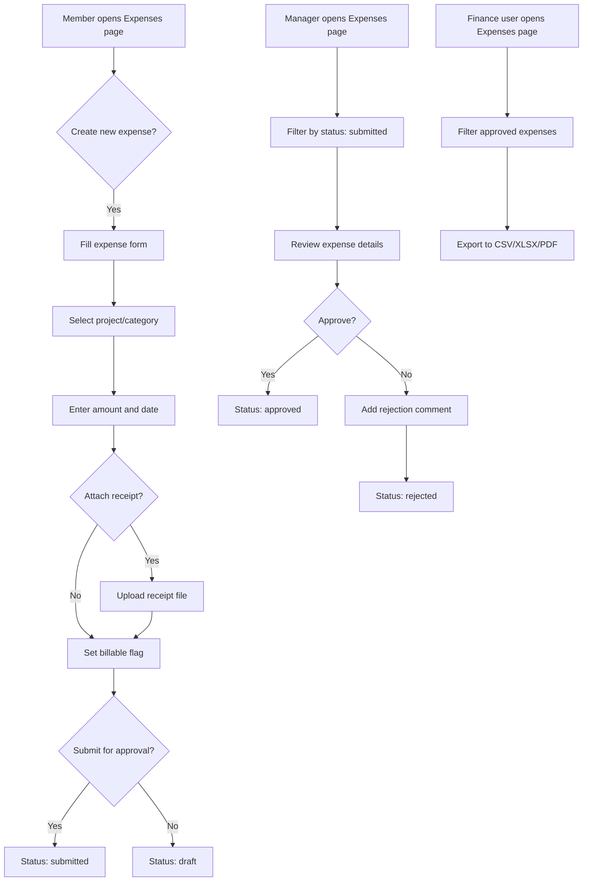
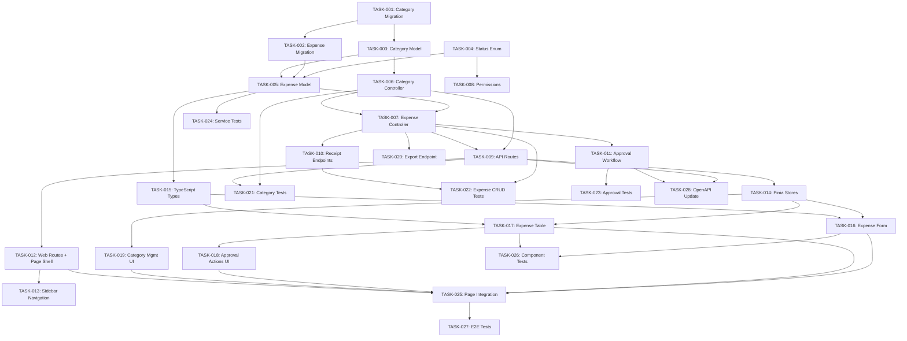

# PRD: Expense Management Feature for Solidtime

Generated: 2026-02-06
Version: 1.0

---

## Table of Contents

1. [Source Ticket Reference](#1-source-ticket-reference)
2. [Technical Interpretation](#2-technical-interpretation)
3. [Functional Specifications](#3-functional-specifications)
4. [Technical Requirements and Constraints](#4-technical-requirements-and-constraints)
5. [User Stories with Acceptance Criteria](#5-user-stories-with-acceptance-criteria)
6. [Task Breakdown Structure](#6-task-breakdown-structure)
7. [Dependencies and Integration Points](#7-dependencies-and-integration-points)
8. [Risk Assessment and Mitigation](#8-risk-assessment-and-mitigation)
9. [Testing and Validation Requirements](#9-testing-and-validation-requirements)
10. [Monitoring and Observability](#10-monitoring-and-observability)
11. [Success Metrics and Definition of Done](#11-success-metrics-and-definition-of-done)
12. [Technical Debt and Future Considerations](#12-technical-debt-and-future-considerations)
13. [Appendices](#13-appendices)

---

## Amendments (2026-02-06 Review)

> These amendments supersede conflicting content in the original PRD sections below.
> Reference: `.features/SHARED-FOUNDATIONS.md` and `.features/PRD-REVIEW-REPORT.md`

### AMD-01: Task ID Prefix
All task IDs in this PRD are now prefixed with `EXP-`. E.g., TASK-001 becomes EXP-001.

### AMD-02: Permission Naming (SF-02)
Permissions already conform to the shared convention. No changes needed.

### AMD-03: Migration Timestamps (SF-03)
All migrations use date prefix `2026_03_02_` instead of any previously specified dates.

### AMD-04: Shared Approval Pattern (SF-05) — CRITICAL CHANGE
The inline approval workflow is updated to align with the shared pattern:
- Replace inline status strings with shared `App\Enums\ApprovalStatus` enum
- Add `HasApprovalWorkflow` trait to the `Expense` model
- **Self-approval is NO LONGER allowed**. The `reviewer_id` must differ from the expense creator's `member_id`. This reverses the original PRD statement "Manager tries to approve their own expense (allowed)".
- Status vocabulary aligned: `rejected` is retained (not `changes_requested`) since expense approval is binary approve/reject, not iterative review.

### AMD-05: Notification Infrastructure (SF-04) — CRITICAL ADDITION
The original PRD had NO notifications for approval status changes. This is now required:
- `ExpenseSubmittedNotification` — sent to approvers when an expense is submitted
- `ExpenseApprovedNotification` — sent to submitter when approved
- `ExpenseRejectedNotification` — sent to submitter when rejected

**New task: EXP-029 — Create Expense Notification Classes**
- Effort: 4 hours / 2 SP
- Dependencies: EXP-007, FOUND-001 through FOUND-005
- Sprint: 2

**New task: EXP-030 — Dispatch Notifications from ExpenseService**
- Effort: 2 hours / 1 SP
- Dependencies: EXP-029
- Sprint: 2

### AMD-06: Modular Permissions (SF-08)
Permissions are registered via `App\Permissions\ExpensePermissions::register()` instead of directly modifying `JetstreamServiceProvider`.

### AMD-07: Receipt Upload Two-Step UX
Clarification: Expense creation and receipt upload are a two-step process. The expense must exist before a receipt can be attached via `POST .../expenses/{expense}/receipt`. The frontend (EXP-016) must handle this as a create-then-upload flow, showing a loading state between steps.

### AMD-08: Missing Problem Statement
A dedicated Problem Statement should be added to Section 1. Summary: "Solidtime has no mechanism for tracking reimbursable or billable costs beyond time entries. Organizations cannot record expenses, attach receipts, apply markups for client billing, or include non-time costs in project profitability analysis."

### AMD-09: Sprint 1 Rebalancing
Sprint 1 at 70 hours is overloaded for a 2-week sprint. Move EXP-005 (ExpenseFilter, 4h) and EXP-006 (ExpenseResource, 2h) to Sprint 2. Revised loads:
- Sprint 1: ~64 hours (still heavy but more achievable with parallel BE+FE work)
- Sprint 2: adjusted accordingly

### AMD-10: ON DELETE RESTRICT Documentation
The `ON DELETE RESTRICT` for expenses → projects/tasks is intentional and correct. Add a UX note: when a user attempts to delete a project that has expenses, the UI should show a clear error message explaining that expenses must be reassigned or deleted first.

---

## 1. Source Ticket Reference

- **Feature ID**: 02-expense-management
- **Sub-features**: 6.1 (Expense Entry), 6.2 (Markups and Selling Price)
- **Status**: PRD Development
- **Original Requirement**: Implement expense tracking and management for solidtime, complementing the existing time tracking capabilities. Members log expenses against projects with receipt attachments, categories, markup rules, approval workflows, and export functionality.

---

## 2. Technical Interpretation

### Business to Technical Translation

| Business Requirement | Technical Implementation |
|---|---|
| Member logs an expense with amount, category, project, date | New `Expense` model with `ExpenseController::store()` endpoint, `ExpenseStoreRequest` validation |
| Admin defines expense categories | New `ExpenseCategory` model with CRUD controller, hierarchical `parent_id` for subcategories |
| Attach receipt photos/PDFs | Laravel filesystem storage via private disk, `receipt_path` on `Expense` model, dedicated upload endpoint |
| Markup percentages on billable expenses | `markup_percentage` and computed `selling_price` (amount * (1 + markup/100)), cascading defaults from category |
| Manager approves/rejects expenses | `status` enum field on `Expense` (draft/submitted/approved/rejected), `ExpenseApprovalController`, `reviewer_id` and `reviewed_at` fields |
| Export expenses for invoicing | `ExpenseExportService` with CSV/XLSX/PDF output, reusing existing `ExportFormat` enum and Gotenberg PDF pipeline |

### Existing Codebase Patterns Applied

The expense management feature follows the same architectural patterns already established in solidtime:

- **Models**: UUID primary keys via `HasUuids`, `CustomAuditable` for audit trails, `BelongsTo` relationships to `Organization`, `Project`, `Member`, `User` (identical pattern to `TimeEntry`)
- **Controllers**: Extend `App\Http\Controllers\Api\V1\Controller`, use `$this->checkPermission()` for authorization, organization injected via route model binding
- **Requests**: Extend `BaseFormRequest`, use `ExistsEloquent` for relationship validation scoped to organization
- **Routes**: Registered under `v1.` prefix with `/organizations/{organization}` scoping, `check-organization-blocked` middleware on write endpoints
- **Permissions**: Follow existing `{feature}:{action}:{scope}` naming convention (e.g., `expenses:view:own`, `expenses:approve`)
- **Roles**: Owner/Admin/Manager get full expense permissions, Employee gets own-expense permissions
- **Frontend**: Pinia store in `resources/js/utils/useExpenses.ts`, Vue page in `resources/js/Pages/Expenses.vue`, UI components in `resources/js/packages/ui/src/Expense/`
- **Testing**: Endpoint tests extending `ApiEndpointTestAbstract`, factories for seeding test data

---

## 3. Functional Specifications

### 3.1 Core Requirements

#### REQ-001: Expense Entry (Priority: P0)
- Members can create expenses with: amount (integer, in cents), currency, date, description, billable flag, project association, task association (optional), category association, and tags
- Amount stored in cents (matching existing `billable_rate` pattern on `TimeEntry`)
- Currency defaults to organization currency but can be overridden per expense
- Date is a required date field (not datetime -- expenses are day-level granularity)
- Description is optional, max 5000 characters (matching `TimeEntry` pattern)

**Edge Cases**:
- Expense with zero amount (allowed for non-monetary tracked items like mileage)
- Expense without a project (allowed -- general organizational expenses)
- Expense in a different currency than the organization default
- Member tries to edit an already-approved expense (rejected unless admin)

**Error Scenarios**:
- Amount exceeds integer max (validation error)
- Referenced project/category does not belong to organization (422 validation error)
- File upload exceeds size limit (413 error)
- Unsupported file type for receipt (422 validation error)

#### REQ-002: Expense Categories (Priority: P0)
- Admin-defined categories scoped to organization
- Support one level of nesting (parent/child categories)
- Each category has: name, optional description, optional default markup percentage, optional color
- Categories can be archived (soft-disable, not deleted, matching `Project.archived_at` pattern)

**Edge Cases**:
- Deleting a category that has expenses associated (restrict delete, return 422)
- Creating a subcategory under a subcategory (rejected -- max one level of nesting)
- Category with same name already exists in organization (allowed, but UI warns)

#### REQ-003: Receipt Uploads (Priority: P1)
- Receipts stored on the private filesystem disk (matching existing export storage pattern)
- Supported file types: JPEG, PNG, PDF, HEIC, WebP
- Maximum file size: 10MB per receipt
- One receipt per expense (can be replaced by uploading a new one)
- Receipts accessible via signed temporary URLs (matching existing export download pattern)

**Edge Cases**:
- Upload fails midway (transaction rollback, no orphan files)
- Receipt file is corrupt or zero bytes (validation error)
- User requests download of receipt from expense in different organization (403)

#### REQ-004: Markup and Selling Price (Priority: P1)
- Billable expenses can have a markup percentage applied
- Markup cascading priority: expense-level override > category default > 0%
- Selling price computed as: `amount * (1 + markup_percentage / 100)`, rounded to nearest cent
- Selling price is a computed attribute (stored for query performance, recomputed when amount or markup changes)

**Business Rules**:
- Markup only applies to billable expenses; non-billable expenses have NULL selling price
- Markup percentage range: 0-999% (integer)
- When category default markup changes, existing approved expenses are NOT retroactively updated
- When category default markup changes, draft/submitted expenses ARE updated

#### REQ-005: Expense Approval Workflow (Priority: P1)
- Status transitions: `draft` -> `submitted` -> `approved` / `rejected`
- Rejected expenses can be edited and resubmitted
- Approved expenses cannot be edited (except by admin who can force-edit or revert to draft)
- Approval records who approved/rejected and when, with optional comment

**State Machine**:
```
draft ---[submit]--> submitted ---[approve]--> approved
                           |
                           +---[reject]---> rejected ---[resubmit]--> submitted

approved ---[revert (admin only)]--> draft
```

**Edge Cases**:
- Manager tries to approve their own expense (allowed -- no self-approval restriction in v1)
- Bulk approval of multiple expenses (supported)
- Expense submitted for a project the approver cannot see (approver needs `expenses:approve` permission, which implies project visibility)

#### REQ-006: Expense Reporting and Export (Priority: P2)
- Filter expenses by: date range, project, member, category, status, billable
- Aggregate expenses by: project, member, category, date (week/month)
- Export formats: CSV, XLSX, PDF (matching existing `ExportFormat` enum)
- Export includes: date, member name, project name, category, description, amount, markup, selling price, status, receipt indicator

### 3.2 User Workflows



### 3.3 Business Rules

- All monetary amounts stored in cents as integers (matching `billable_rate` pattern)
- Organization currency serves as the default; per-expense currency override is optional
- Only users with `expenses:approve` permission can change status from `submitted` to `approved`/`rejected`
- Deleting an expense with status `approved` requires `expenses:delete:all` permission
- Expenses are always scoped to an organization via `organization_id`
- Receipt files are stored under `receipts/{organization_id}/{expense_id}.{ext}`

---

## 4. Technical Requirements and Constraints

### 4.1 System Architecture

```
Frontend (Vue 3 + Pinia)                   Backend (Laravel 11)
+---------------------------+              +---------------------------+
| Expenses.vue (Page)       |   Inertia    | ExpenseController         |
| useExpenses.ts (Store)    |<------------>| ExpenseCategoryController |
| ExpenseForm.vue           |   REST API   | ExpenseApprovalController |
| ExpenseTable.vue          |              |                           |
| ExpenseCategoryManager.vue|              | ExpenseService            |
+---------------------------+              | ExpenseExportService      |
                                           | ExpenseCategoryService    |
                                           +---------------------------+
                                                       |
                                           +---------------------------+
                                           | PostgreSQL                |
                                           | expenses table            |
                                           | expense_categories table  |
                                           +---------------------------+
                                                       |
                                           +---------------------------+
                                           | File Storage (S3/local)   |
                                           | receipts/{org_id}/        |
                                           +---------------------------+
```

### 4.2 Data Models

#### Expense Model

```php
/**
 * @property string $id                     UUID primary key
 * @property int $amount                    Amount in cents (organization currency)
 * @property string $currency               ISO 4217 currency code
 * @property string $date                   Date of expense (Y-m-d)
 * @property string $description            Optional description (max 5000)
 * @property bool $billable                 Whether expense is billable to client
 * @property int|null $markup_percentage    Markup percentage (0-999)
 * @property int|null $selling_price        Computed: amount * (1 + markup/100), in cents
 * @property string $status                 draft|submitted|approved|rejected
 * @property string|null $receipt_path      Path to receipt file on storage disk
 * @property string|null $receipt_filename  Original filename of receipt
 * @property string|null $reviewer_comment  Comment from approver/rejector
 * @property string|null $reviewer_id       Member ID of approver/rejector
 * @property Carbon|null $reviewed_at       When the review action occurred
 * @property string $user_id               Owner user ID
 * @property string $member_id             Owner member ID
 * @property string $organization_id       Organization scope
 * @property string|null $project_id       Optional project association
 * @property string|null $task_id          Optional task association
 * @property string|null $client_id        Computed from project (matching TimeEntry pattern)
 * @property string|null $expense_category_id  Category association
 * @property Carbon|null $created_at
 * @property Carbon|null $updated_at
 */
```

#### ExpenseCategory Model

```php
/**
 * @property string $id                     UUID primary key
 * @property string $name                   Category name
 * @property string|null $description       Optional description
 * @property string|null $color             Hex color code
 * @property int|null $default_markup       Default markup percentage for expenses in this category
 * @property string|null $parent_id         Parent category ID (one level of nesting)
 * @property string $organization_id        Organization scope
 * @property Carbon|null $archived_at       Soft archive timestamp
 * @property bool $is_archived              Computed accessor (matching Project pattern)
 * @property Carbon|null $created_at
 * @property Carbon|null $updated_at
 */
```

#### ExpenseStatus Enum

```php
enum ExpenseStatus: string
{
    case Draft = 'draft';
    case Submitted = 'submitted';
    case Approved = 'approved';
    case Rejected = 'rejected';
}
```

### 4.3 Database Migrations

#### expenses table

```sql
CREATE TABLE expenses (
    id UUID PRIMARY KEY DEFAULT gen_random_uuid(),
    amount INTEGER NOT NULL,
    currency VARCHAR(3) NOT NULL,
    date DATE NOT NULL,
    description VARCHAR(5000) DEFAULT '',
    billable BOOLEAN NOT NULL DEFAULT false,
    markup_percentage INTEGER UNSIGNED DEFAULT NULL,
    selling_price INTEGER UNSIGNED DEFAULT NULL,
    status VARCHAR(20) NOT NULL DEFAULT 'draft',
    receipt_path VARCHAR(500) DEFAULT NULL,
    receipt_filename VARCHAR(255) DEFAULT NULL,
    reviewer_comment VARCHAR(5000) DEFAULT NULL,
    reviewer_id UUID DEFAULT NULL REFERENCES members(id)
        ON UPDATE CASCADE ON DELETE SET NULL,
    reviewed_at TIMESTAMP DEFAULT NULL,
    user_id UUID NOT NULL REFERENCES users(id)
        ON UPDATE CASCADE ON DELETE RESTRICT,
    member_id UUID NOT NULL REFERENCES members(id)
        ON UPDATE CASCADE ON DELETE RESTRICT,
    organization_id UUID NOT NULL REFERENCES organizations(id)
        ON UPDATE CASCADE ON DELETE RESTRICT,
    project_id UUID DEFAULT NULL REFERENCES projects(id)
        ON UPDATE CASCADE ON DELETE RESTRICT,
    task_id UUID DEFAULT NULL REFERENCES tasks(id)
        ON UPDATE CASCADE ON DELETE RESTRICT,
    client_id UUID DEFAULT NULL REFERENCES clients(id)
        ON UPDATE CASCADE ON DELETE SET NULL,
    expense_category_id UUID DEFAULT NULL REFERENCES expense_categories(id)
        ON UPDATE CASCADE ON DELETE SET NULL,
    created_at TIMESTAMP DEFAULT CURRENT_TIMESTAMP,
    updated_at TIMESTAMP DEFAULT CURRENT_TIMESTAMP
);

CREATE INDEX idx_expenses_organization_id ON expenses(organization_id);
CREATE INDEX idx_expenses_member_id ON expenses(member_id);
CREATE INDEX idx_expenses_project_id ON expenses(project_id);
CREATE INDEX idx_expenses_status ON expenses(status);
CREATE INDEX idx_expenses_date ON expenses(date);
CREATE INDEX idx_expenses_billable ON expenses(billable);
CREATE INDEX idx_expenses_category_id ON expenses(expense_category_id);
```

#### expense_categories table

```sql
CREATE TABLE expense_categories (
    id UUID PRIMARY KEY DEFAULT gen_random_uuid(),
    name VARCHAR(255) NOT NULL,
    description VARCHAR(1000) DEFAULT NULL,
    color VARCHAR(7) DEFAULT NULL,
    default_markup INTEGER UNSIGNED DEFAULT NULL,
    parent_id UUID DEFAULT NULL REFERENCES expense_categories(id)
        ON UPDATE CASCADE ON DELETE CASCADE,
    organization_id UUID NOT NULL REFERENCES organizations(id)
        ON UPDATE CASCADE ON DELETE RESTRICT,
    archived_at TIMESTAMP DEFAULT NULL,
    created_at TIMESTAMP DEFAULT CURRENT_TIMESTAMP,
    updated_at TIMESTAMP DEFAULT CURRENT_TIMESTAMP
);

CREATE INDEX idx_expense_categories_organization_id ON expense_categories(organization_id);
CREATE INDEX idx_expense_categories_parent_id ON expense_categories(parent_id);
```

### 4.4 API Contracts

#### Expense Endpoints

```yaml
# List expenses
GET /api/v1/organizations/{organization}/expenses
  Query Parameters:
    member_id: string (optional, filter by member)
    project_ids: string[] (optional)
    expense_category_id: string (optional)
    status: string (optional, draft|submitted|approved|rejected)
    billable: string (optional, true|false)
    start: string (optional, Y-m-d, filter date >= start)
    end: string (optional, Y-m-d, filter date <= end)
    limit: integer (optional, default 50, max 500)
    offset: integer (optional, default 0)
  Response 200:
    data: Expense[]
    meta: { total: integer }
  Permissions: expenses:view:own (own only) | expenses:view:all

# Create expense
POST /api/v1/organizations/{organization}/expenses
  Request Body:
    member_id: string (required)
    amount: integer (required, >= 0)
    currency: string (optional, defaults to org currency)
    date: string (required, Y-m-d)
    description: string (optional, max 5000)
    billable: boolean (required)
    markup_percentage: integer (optional, 0-999)
    project_id: string (optional, must belong to org)
    task_id: string (optional, must belong to project)
    expense_category_id: string (optional, must belong to org)
  Response 201:
    data: Expense
  Permissions: expenses:create:own | expenses:create:all
  Middleware: check-organization-blocked

# Update expense
PUT /api/v1/organizations/{organization}/expenses/{expense}
  Request Body: (same as create, all optional)
  Response 200:
    data: Expense
  Permissions: expenses:update:own | expenses:update:all
  Middleware: check-organization-blocked
  Rules:
    - Cannot update approved expenses unless admin (force-edit)
    - Cannot change status via this endpoint (use approval endpoints)

# Delete expense
DELETE /api/v1/organizations/{organization}/expenses/{expense}
  Response 204: null
  Permissions: expenses:delete:own | expenses:delete:all
  Rules:
    - Deleting approved expenses requires expenses:delete:all

# Upload receipt
POST /api/v1/organizations/{organization}/expenses/{expense}/receipt
  Request Body: multipart/form-data
    receipt: file (required, jpeg|png|pdf|heic|webp, max 10MB)
  Response 200:
    data: Expense (with receipt_path populated)
  Permissions: expenses:update:own | expenses:update:all
  Middleware: check-organization-blocked

# Download receipt
GET /api/v1/organizations/{organization}/expenses/{expense}/receipt
  Response 200:
    download_url: string (signed temporary URL, 5 min expiry)
  Permissions: expenses:view:own | expenses:view:all

# Delete receipt
DELETE /api/v1/organizations/{organization}/expenses/{expense}/receipt
  Response 200:
    data: Expense (with receipt_path = null)
  Permissions: expenses:update:own | expenses:update:all

# Submit expense for approval
POST /api/v1/organizations/{organization}/expenses/{expense}/submit
  Response 200:
    data: Expense (status: submitted)
  Permissions: expenses:update:own | expenses:update:all
  Rules: Only from draft or rejected status

# Approve expense
POST /api/v1/organizations/{organization}/expenses/{expense}/approve
  Request Body:
    comment: string (optional)
  Response 200:
    data: Expense (status: approved)
  Permissions: expenses:approve

# Reject expense
POST /api/v1/organizations/{organization}/expenses/{expense}/reject
  Request Body:
    comment: string (required, max 5000)
  Response 200:
    data: Expense (status: rejected)
  Permissions: expenses:approve

# Bulk approve expenses
POST /api/v1/organizations/{organization}/expenses/bulk-approve
  Request Body:
    ids: string[] (required)
    comment: string (optional)
  Response 200:
    success: string[]
    error: string[]
  Permissions: expenses:approve

# Revert approved expense to draft (admin only)
POST /api/v1/organizations/{organization}/expenses/{expense}/revert
  Response 200:
    data: Expense (status: draft)
  Permissions: expenses:approve + (Owner|Admin role)

# Export expenses
GET /api/v1/organizations/{organization}/expenses/export
  Query Parameters: (same filters as list + format)
    format: string (csv|xlsx|pdf)
  Response 200:
    download_url: string
  Permissions: expenses:view:all + export
```

#### Expense Category Endpoints

```yaml
# List expense categories
GET /api/v1/organizations/{organization}/expense-categories
  Response 200:
    data: ExpenseCategory[]
  Permissions: expense-categories:view

# Create expense category
POST /api/v1/organizations/{organization}/expense-categories
  Request Body:
    name: string (required, max 255)
    description: string (optional, max 1000)
    color: string (optional, hex color)
    default_markup: integer (optional, 0-999)
    parent_id: string (optional, must be a root category in same org)
  Response 201:
    data: ExpenseCategory
  Permissions: expense-categories:create
  Middleware: check-organization-blocked

# Update expense category
PUT /api/v1/organizations/{organization}/expense-categories/{expenseCategory}
  Request Body: (same as create, all optional)
  Response 200:
    data: ExpenseCategory
  Permissions: expense-categories:update
  Middleware: check-organization-blocked

# Delete expense category
DELETE /api/v1/organizations/{organization}/expense-categories/{expenseCategory}
  Response 204: null
  Permissions: expense-categories:delete
  Rules: Cannot delete if expenses exist referencing this category (return 422)
```

### 4.5 API Resources

#### ExpenseResource

```php
class ExpenseResource extends BaseResource
{
    public function toArray(Request $request): array
    {
        return [
            'id' => $this->resource->id,
            'amount' => $this->resource->amount,
            'currency' => $this->resource->currency,
            'date' => $this->resource->date->format('Y-m-d'),
            'description' => $this->resource->description,
            'billable' => $this->resource->billable,
            'markup_percentage' => $this->resource->markup_percentage,
            'selling_price' => $this->resource->selling_price,
            'status' => $this->resource->status,
            'has_receipt' => $this->resource->receipt_path !== null,
            'receipt_filename' => $this->resource->receipt_filename,
            'reviewer_comment' => $this->resource->reviewer_comment,
            'reviewer_id' => $this->resource->reviewer_id,
            'reviewed_at' => $this->formatDateTime($this->resource->reviewed_at),
            'user_id' => $this->resource->user_id,
            'member_id' => $this->resource->member_id,
            'organization_id' => $this->resource->organization_id,
            'project_id' => $this->resource->project_id,
            'task_id' => $this->resource->task_id,
            'client_id' => $this->resource->client_id,
            'expense_category_id' => $this->resource->expense_category_id,
        ];
    }
}
```

#### ExpenseCategoryResource

```php
class ExpenseCategoryResource extends BaseResource
{
    public function toArray(Request $request): array
    {
        return [
            'id' => $this->resource->id,
            'name' => $this->resource->name,
            'description' => $this->resource->description,
            'color' => $this->resource->color,
            'default_markup' => $this->resource->default_markup,
            'parent_id' => $this->resource->parent_id,
            'is_archived' => $this->resource->is_archived,
        ];
    }
}
```

### 4.6 Permissions Matrix

| Permission | Owner | Admin | Manager | Employee |
|---|:---:|:---:|:---:|:---:|
| `expenses:view:all` | Y | Y | Y | - |
| `expenses:view:own` | Y | Y | Y | Y |
| `expenses:create:all` | Y | Y | Y | - |
| `expenses:create:own` | Y | Y | Y | Y |
| `expenses:update:all` | Y | Y | Y | - |
| `expenses:update:own` | Y | Y | Y | Y |
| `expenses:delete:all` | Y | Y | Y | - |
| `expenses:delete:own` | Y | Y | Y | Y |
| `expenses:approve` | Y | Y | Y | - |
| `expense-categories:view` | Y | Y | Y | Y |
| `expense-categories:create` | Y | Y | - | - |
| `expense-categories:update` | Y | Y | - | - |
| `expense-categories:delete` | Y | Y | - | - |

### 4.7 Performance Requirements

- **List endpoint**: 95th percentile < 200ms for up to 10,000 expenses per organization
- **Export**: Support exporting up to 50,000 expenses in CSV (< 30s), XLSX (< 60s), PDF (< 120s)
- **Receipt upload**: Accept up to 10MB files with < 2s response time
- **Receipt download**: Signed URL generation < 100ms
- **Database**: Proper indexing on `organization_id`, `member_id`, `project_id`, `status`, `date`

### 4.8 Security Requirements

- Receipt files stored on private disk; access only via signed temporary URLs
- Receipt paths must not be guessable (UUID-based naming)
- File upload validation: check MIME type server-side (not just extension)
- Rate limiting: max 20 receipt uploads per minute per user
- Organization scoping enforced at query level (`whereBelongsTo($organization)`)
- Audit trail via `CustomAuditable` trait on both models

---

## 5. User Stories with Acceptance Criteria

### USR-001: Create an Expense

**As a** team member
**I want to** log an expense with amount, date, and project
**So that** the organization can track project costs beyond time

**Priority**: P0
**Effort**: 8 story points
**Sprint**: 1

**Acceptance Criteria**:
- [ ] User can create an expense with amount, currency, date, description
- [ ] User can optionally associate a project and task
- [ ] User can optionally select an expense category
- [ ] User can mark expense as billable or non-billable
- [ ] Amount is validated as a non-negative integer (cents)
- [ ] Date is validated as a valid date in Y-m-d format
- [ ] Project must belong to the same organization
- [ ] Task must belong to the selected project
- [ ] Category must belong to the same organization
- [ ] Employee can only create expenses for themselves
- [ ] Manager/Admin/Owner can create expenses for any member
- [ ] Response includes the full expense resource with computed fields

---

### USR-002: Upload a Receipt

**As a** team member
**I want to** attach a receipt photo or PDF to my expense
**So that** there is evidence to support the expense claim

**Priority**: P1
**Effort**: 5 story points
**Sprint**: 1

**Acceptance Criteria**:
- [ ] User can upload a JPEG, PNG, PDF, HEIC, or WebP file up to 10MB
- [ ] File is stored on the private filesystem disk
- [ ] File is stored under `receipts/{organization_id}/{expense_id}.{ext}`
- [ ] Uploading a new receipt replaces the existing one (old file deleted)
- [ ] User can download receipt via signed temporary URL (5 min expiry)
- [ ] User can delete receipt from an expense
- [ ] MIME type is validated server-side (not just file extension)
- [ ] Only the expense owner (or user with `:all` permission) can upload/delete

---

### USR-003: Manage Expense Categories

**As an** organization admin
**I want to** define expense categories with optional default markups
**So that** team members categorize expenses consistently

**Priority**: P0
**Effort**: 5 story points
**Sprint**: 1

**Acceptance Criteria**:
- [ ] Admin can create a category with name, description, color, default markup
- [ ] Admin can create a subcategory under an existing root category
- [ ] Subcategories cannot have their own subcategories (max one level)
- [ ] Admin can update category details
- [ ] Admin can archive a category (sets `archived_at`)
- [ ] Admin cannot delete a category that has associated expenses (422 error)
- [ ] All organization members can view the category list
- [ ] Archived categories are excluded from the creation form but visible in reports
- [ ] Employees can view categories but cannot create/update/delete them

---

### USR-004: Apply Markup to Billable Expenses

**As a** project manager
**I want to** apply a markup percentage to billable expenses
**So that** the selling price reflects the organization's pricing policy

**Priority**: P1
**Effort**: 3 story points
**Sprint**: 2

**Acceptance Criteria**:
- [ ] When creating/updating an expense, user can set a markup percentage (0-999%)
- [ ] If no markup is set on the expense, the category's default markup is used
- [ ] If no category markup exists, markup defaults to 0%
- [ ] Selling price is computed as `amount * (1 + markup_percentage / 100)`, rounded
- [ ] Selling price is only computed for billable expenses (null for non-billable)
- [ ] Selling price updates automatically when amount or markup changes
- [ ] When a category's default markup changes, draft/submitted expenses using that category's default are updated
- [ ] Approved expenses are never retroactively updated

---

### USR-005: Submit Expense for Approval

**As a** team member
**I want to** submit my expense for manager approval
**So that** expenses follow the organization's approval workflow

**Priority**: P1
**Effort**: 5 story points
**Sprint**: 2

**Acceptance Criteria**:
- [ ] User can submit a draft expense (status changes from `draft` to `submitted`)
- [ ] User can resubmit a rejected expense (status changes from `rejected` to `submitted`)
- [ ] Submitted expenses cannot be edited by the owner (unless reverted)
- [ ] Attempting to submit an already-submitted or approved expense returns 422
- [ ] The submission is recorded in the audit trail

---

### USR-006: Approve or Reject Expenses

**As a** manager
**I want to** approve or reject submitted expenses
**So that** only valid expenses proceed to invoicing

**Priority**: P1
**Effort**: 5 story points
**Sprint**: 2

**Acceptance Criteria**:
- [ ] Manager can approve a submitted expense
- [ ] Manager can reject a submitted expense with a required comment
- [ ] Approval/rejection records `reviewer_id`, `reviewed_at`, `reviewer_comment`
- [ ] Manager can bulk-approve multiple submitted expenses
- [ ] Only users with `expenses:approve` permission can approve/reject
- [ ] Approving/rejecting a non-submitted expense returns 422
- [ ] Admin can revert an approved expense back to draft status

---

### USR-007: View and Filter Expenses

**As a** team member or manager
**I want to** view expenses with filters for date, project, status, category, and member
**So that** I can find and review specific expenses

**Priority**: P0
**Effort**: 8 story points
**Sprint**: 2

**Acceptance Criteria**:
- [ ] Expenses are listed in reverse chronological order by date
- [ ] Employee sees only their own expenses (scoped by `expenses:view:own`)
- [ ] Manager/Admin sees all organization expenses (scoped by `expenses:view:all`)
- [ ] Filters: date range, project_ids, member_id, expense_category_id, status, billable
- [ ] Pagination with limit/offset (default 50, max 500)
- [ ] Response includes total count in meta
- [ ] Table shows: date, description, project, category, amount, selling price, status, receipt indicator

---

### USR-008: Export Expenses

**As a** finance team member
**I want to** export filtered expenses to CSV, XLSX, or PDF
**So that** I can process them for invoicing or reimbursement

**Priority**: P2
**Effort**: 8 story points
**Sprint**: 3

**Acceptance Criteria**:
- [ ] Export supports CSV, XLSX, and PDF formats (matching existing `ExportFormat` enum)
- [ ] Export respects the same filters as the list endpoint
- [ ] CSV/XLSX columns: date, member name, project name, client name, category, description, amount, currency, markup %, selling price, status, has receipt
- [ ] PDF uses Gotenberg renderer (matching existing time entry export pattern)
- [ ] Export generates a signed temporary download URL (5 min expiry)
- [ ] Only users with `expenses:view:all` AND `export` permissions can export
- [ ] PDF export is a premium feature (requires subscription, matching existing pattern)

---

## 6. Task Breakdown Structure

### Sprint 1: Foundation (Weeks 1-2)

---

#### TASK-001: Database Migrations for Expense Categories
**Type**: Backend / Database
**Effort**: 4 hours (2 story points)
**Dependencies**: None

**Description**: Create the `expense_categories` database migration.

**Files to create**:
- `database/migrations/YYYY_MM_DD_HHMMSS_create_expense_categories_table.php`

**Implementation Details**:
```php
Schema::create('expense_categories', function (Blueprint $table): void {
    $table->uuid('id')->primary();
    $table->string('name', 255);
    $table->string('description', 1000)->nullable();
    $table->string('color', 7)->nullable();
    $table->integer('default_markup')->unsigned()->nullable();
    $table->uuid('parent_id')->nullable();
    $table->foreign('parent_id')
        ->references('id')
        ->on('expense_categories')
        ->cascadeOnUpdate()
        ->cascadeOnDelete();
    $table->uuid('organization_id');
    $table->foreign('organization_id')
        ->references('id')
        ->on('organizations')
        ->cascadeOnUpdate()
        ->restrictOnDelete();
    $table->timestamp('archived_at')->nullable();
    $table->timestamps();

    $table->index('organization_id');
    $table->index('parent_id');
});
```

**Acceptance Criteria**:
- [ ] Migration runs successfully on a fresh database
- [ ] Rollback drops the table cleanly
- [ ] Foreign key constraints are properly defined
- [ ] Indexes are created on `organization_id` and `parent_id`

---

#### TASK-002: Database Migration for Expenses
**Type**: Backend / Database
**Effort**: 4 hours (2 story points)
**Dependencies**: [TASK-001]

**Description**: Create the `expenses` database migration.

**Files to create**:
- `database/migrations/YYYY_MM_DD_HHMMSS_create_expenses_table.php`

**Implementation Details**:
Follow the schema defined in Section 4.3 of this PRD. Use the same patterns as `create_time_entries_table.php`: UUID primary keys, foreign keys with `cascadeOnUpdate()->restrictOnDelete()`, and appropriate indexes.

**Acceptance Criteria**:
- [ ] Migration runs successfully after expense_categories migration
- [ ] All foreign key constraints properly reference existing tables
- [ ] Indexes created on: `organization_id`, `member_id`, `project_id`, `status`, `date`, `billable`, `expense_category_id`
- [ ] Rollback drops the table cleanly

---

#### TASK-003: ExpenseCategory Model, Factory, and Service
**Type**: Backend
**Effort**: 8 hours (3 story points)
**Dependencies**: [TASK-001]

**Description**: Create the `ExpenseCategory` Eloquent model, factory, and service.

**Files to create**:
- `app/Models/ExpenseCategory.php` -- Model with HasUuids, CustomAuditable, relationships (organization, parent, children, expenses), `isArchived` accessor
- `database/factories/ExpenseCategoryFactory.php` -- Factory with `forOrganization()`, `withParent()`, `archived()` states
- `app/Service/ExpenseCategoryService.php` -- Business logic for create/update/delete with nesting validation

**Key Implementation Notes**:
- Follow `Tag` model structure for the basic organization-scoped model
- Follow `Project` model's `isArchived` accessor pattern for the `archived_at` field
- Service must enforce: max one level of nesting (parent_id references a root category only)
- Service must prevent deletion when expenses reference the category

**Acceptance Criteria**:
- [ ] Model has correct relationships: `organization()`, `parent()`, `children()`, `expenses()`
- [ ] `isArchived` accessor works like `Project::isArchived`
- [ ] Factory produces valid categories with all states
- [ ] Service enforces single-level nesting constraint
- [ ] Service prevents deletion of categories with existing expenses

---

#### TASK-004: ExpenseStatus Enum
**Type**: Backend
**Effort**: 2 hours (1 story point)
**Dependencies**: None

**Description**: Create the `ExpenseStatus` enum.

**Files to create**:
- `app/Enums/ExpenseStatus.php`

**Implementation Details**:
```php
<?php
declare(strict_types=1);
namespace App\Enums;

enum ExpenseStatus: string
{
    case Draft = 'draft';
    case Submitted = 'submitted';
    case Approved = 'approved';
    case Rejected = 'rejected';
}
```

**Acceptance Criteria**:
- [ ] Enum follows the same pattern as existing enums in `app/Enums/`
- [ ] Has `declare(strict_types=1)` at top

---

#### TASK-005: Expense Model and Factory
**Type**: Backend
**Effort**: 10 hours (5 story points)
**Dependencies**: [TASK-002, TASK-003, TASK-004]

**Description**: Create the `Expense` Eloquent model and factory.

**Files to create**:
- `app/Models/Expense.php` -- Model with HasUuids, CustomAuditable, ComputedAttributes for `selling_price` and `client_id`, all relationships
- `database/factories/ExpenseFactory.php` -- Factory with states: `forOrganization()`, `forMember()`, `forProject()`, `forTask()`, `forCategory()`, `billable()`, `draft()`, `submitted()`, `approved()`, `rejected()`, `withReceipt()`

**Key Implementation Notes**:
- Follow `TimeEntry` model as the primary reference pattern
- `selling_price` is a computed attribute (like `billable_rate` on TimeEntry)
- `client_id` is a computed attribute derived from `project.client_id` (identical to TimeEntry)
- Casts: `date` as `date`, `billable` as `bool`, `amount` as `int`, `selling_price` as `int`, `markup_percentage` as `int`, `status` as `ExpenseStatus`
- `getSellingPriceComputed()` method: returns null if not billable, otherwise `(int) round($this->amount * (1 + ($this->getEffectiveMarkup() / 100)))`

**Acceptance Criteria**:
- [ ] Model has all relationships: `user()`, `member()`, `organization()`, `project()`, `task()`, `client()`, `category()`, `reviewer()`
- [ ] Computed `selling_price` recalculates correctly
- [ ] Computed `client_id` derives from project relationship
- [ ] Factory produces valid expenses with all states
- [ ] `SELECT_COLUMNS` constant defined (matching TimeEntry pattern)

---

#### TASK-006: Expense Category CRUD Controller and Requests
**Type**: Backend
**Effort**: 10 hours (5 story points)
**Dependencies**: [TASK-003]

**Description**: Create the ExpenseCategoryController with full CRUD, plus request validation classes.

**Files to create**:
- `app/Http/Controllers/Api/V1/ExpenseCategoryController.php`
- `app/Http/Requests/V1/ExpenseCategory/ExpenseCategoryStoreRequest.php`
- `app/Http/Requests/V1/ExpenseCategory/ExpenseCategoryUpdateRequest.php`
- `app/Http/Resources/V1/ExpenseCategory/ExpenseCategoryResource.php`
- `app/Http/Resources/V1/ExpenseCategory/ExpenseCategoryCollection.php`

**Key Implementation Notes**:
- Controller extends `App\Http\Controllers\Api\V1\Controller`
- Follow `TagController` as reference for the CRUD pattern
- `index()`: `expense-categories:view` permission, return all non-archived categories for org
- `store()`: `expense-categories:create` permission, validate via `ExpenseCategoryStoreRequest`
- `update()`: `expense-categories:update` permission
- `destroy()`: `expense-categories:delete` permission, check for associated expenses before deleting
- Store request validates `parent_id` via `ExistsEloquent` scoped to org, with additional check that parent is a root category

**Acceptance Criteria**:
- [ ] All four CRUD operations work correctly
- [ ] Permission checks match the permission matrix
- [ ] Validation prevents creating sub-subcategories
- [ ] Delete fails with 422 when expenses reference the category
- [ ] Resources return correct JSON structure

---

#### TASK-007: Expense CRUD Controller and Requests
**Type**: Backend
**Effort**: 16 hours (8 story points)
**Dependencies**: [TASK-005, TASK-006]

**Description**: Create the ExpenseController with CRUD operations, plus request validation classes and resources.

**Files to create**:
- `app/Http/Controllers/Api/V1/ExpenseController.php`
- `app/Http/Requests/V1/Expense/ExpenseIndexRequest.php`
- `app/Http/Requests/V1/Expense/ExpenseStoreRequest.php`
- `app/Http/Requests/V1/Expense/ExpenseUpdateRequest.php`
- `app/Http/Requests/V1/Expense/ExpenseDestroyRequest.php`
- `app/Http/Resources/V1/Expense/ExpenseResource.php`
- `app/Http/Resources/V1/Expense/ExpenseCollection.php`
- `app/Service/ExpenseService.php`
- `app/Service/ExpenseFilter.php`

**Key Implementation Notes**:
- Controller extends `App\Http\Controllers\Api\V1\Controller`
- Follow `TimeEntryController` as primary reference
- `index()`: Permission-based scoping (own vs all), filtering via `ExpenseFilter`, pagination
- `store()`: Validate all fields, compute selling_price, associate client from project
- `update()`: Prevent editing approved expenses (unless admin), recompute selling_price
- `destroy()`: Require `:delete:all` for approved expenses
- `ExpenseFilter` follows `TimeEntryFilter` pattern for query building
- `ExpenseService` handles business logic: selling price computation, markup cascading

**Acceptance Criteria**:
- [ ] List endpoint with filtering and pagination works correctly
- [ ] Create endpoint validates all fields and computes selling price
- [ ] Update endpoint enforces status-based edit restrictions
- [ ] Delete endpoint enforces permission-based restrictions for approved expenses
- [ ] Employee can only access own expenses; Manager/Admin can access all
- [ ] Filter supports: date range, project_ids, member_id, category_id, status, billable

---

#### TASK-008: Register Expense Permissions in JetstreamServiceProvider
**Type**: Backend
**Effort**: 4 hours (2 story points)
**Dependencies**: [TASK-004]

**Description**: Add expense-related permissions to all roles in `JetstreamServiceProvider::configurePermissions()`.

**Files to modify**:
- `app/Providers/JetstreamServiceProvider.php`

**Implementation Details**:
Add the following permissions according to the permissions matrix in Section 4.6:
- Owner/Admin: All expense and expense-category permissions
- Manager: All expense permissions (including approve), expense-categories:view
- Employee: `expenses:view:own`, `expenses:create:own`, `expenses:update:own`, `expenses:delete:own`, `expense-categories:view`

**Acceptance Criteria**:
- [ ] All roles have correct expense permissions per the matrix
- [ ] Existing permissions are not modified
- [ ] Permissions follow the naming convention: `{feature}:{action}:{scope}`

---

#### TASK-009: Register API Routes for Expenses and Categories
**Type**: Backend
**Effort**: 4 hours (2 story points)
**Dependencies**: [TASK-006, TASK-007]

**Description**: Register all expense and expense category routes in `routes/api.php`.

**Files to modify**:
- `routes/api.php`

**Implementation Details**:
```php
// Expense category routes
Route::name('expense-categories.')->prefix('/organizations/{organization}')->group(static function (): void {
    Route::get('/expense-categories', [ExpenseCategoryController::class, 'index'])->name('index');
    Route::post('/expense-categories', [ExpenseCategoryController::class, 'store'])->name('store')->middleware('check-organization-blocked');
    Route::put('/expense-categories/{expenseCategory}', [ExpenseCategoryController::class, 'update'])->name('update')->middleware('check-organization-blocked');
    Route::delete('/expense-categories/{expenseCategory}', [ExpenseCategoryController::class, 'destroy'])->name('destroy');
});

// Expense routes
Route::name('expenses.')->prefix('/organizations/{organization}')->group(static function (): void {
    Route::get('/expenses', [ExpenseController::class, 'index'])->name('index');
    Route::get('/expenses/export', [ExpenseController::class, 'export'])->name('export');
    Route::post('/expenses', [ExpenseController::class, 'store'])->name('store')->middleware('check-organization-blocked');
    Route::put('/expenses/{expense}', [ExpenseController::class, 'update'])->name('update')->middleware('check-organization-blocked');
    Route::delete('/expenses/{expense}', [ExpenseController::class, 'destroy'])->name('destroy');
    Route::post('/expenses/{expense}/receipt', [ExpenseController::class, 'uploadReceipt'])->name('upload-receipt')->middleware('check-organization-blocked');
    Route::get('/expenses/{expense}/receipt', [ExpenseController::class, 'downloadReceipt'])->name('download-receipt');
    Route::delete('/expenses/{expense}/receipt', [ExpenseController::class, 'deleteReceipt'])->name('delete-receipt');
    Route::post('/expenses/{expense}/submit', [ExpenseController::class, 'submit'])->name('submit')->middleware('check-organization-blocked');
    Route::post('/expenses/{expense}/approve', [ExpenseController::class, 'approve'])->name('approve')->middleware('check-organization-blocked');
    Route::post('/expenses/{expense}/reject', [ExpenseController::class, 'reject'])->name('reject')->middleware('check-organization-blocked');
    Route::post('/expenses/bulk-approve', [ExpenseController::class, 'bulkApprove'])->name('bulk-approve')->middleware('check-organization-blocked');
    Route::post('/expenses/{expense}/revert', [ExpenseController::class, 'revert'])->name('revert')->middleware('check-organization-blocked');
});
```

**Acceptance Criteria**:
- [ ] All routes are correctly registered with proper names
- [ ] Write endpoints have `check-organization-blocked` middleware
- [ ] Route names follow the `api.v1.{feature}.{action}` convention
- [ ] Organization route model binding is active

---

#### TASK-010: Receipt Upload, Download, and Delete Endpoints
**Type**: Backend
**Effort**: 8 hours (5 story points)
**Dependencies**: [TASK-007]

**Description**: Implement receipt file upload, download (via signed URL), and delete functionality on the `ExpenseController`.

**Files to create/modify**:
- `app/Http/Controllers/Api/V1/ExpenseController.php` (add `uploadReceipt()`, `downloadReceipt()`, `deleteReceipt()` methods)
- `app/Http/Requests/V1/Expense/ExpenseUploadReceiptRequest.php`

**Key Implementation Notes**:
- Store receipts on `config('filesystems.private')` disk (matching existing export storage)
- Path: `receipts/{organization_id}/{expense_id}.{ext}`
- Validate MIME type server-side: `mimes:jpeg,png,pdf,heic,webp`
- Max size: `max:10240` (10MB in KB)
- Download returns signed temporary URL with 5 min expiry (matching existing export pattern)
- When uploading a replacement, delete the old file first
- When deleting receipt, null out `receipt_path` and `receipt_filename` on the expense

**Acceptance Criteria**:
- [ ] Upload stores file correctly and updates expense record
- [ ] Replacement upload deletes previous file
- [ ] Download returns a working signed temporary URL
- [ ] Delete removes file and nulls expense fields
- [ ] MIME type validation rejects invalid file types
- [ ] File size validation rejects files over 10MB
- [ ] Permission checks enforce own/all scoping

---

### Sprint 2: Approval Workflow and Frontend (Weeks 3-4)

---

#### TASK-011: Approval Workflow Endpoints
**Type**: Backend
**Effort**: 12 hours (5 story points)
**Dependencies**: [TASK-007]

**Description**: Implement expense submission, approval, rejection, bulk approval, and revert endpoints.

**Files to modify**:
- `app/Http/Controllers/Api/V1/ExpenseController.php` (add `submit()`, `approve()`, `reject()`, `bulkApprove()`, `revert()`)
- `app/Service/ExpenseService.php` (add status transition logic)

**Key Implementation Notes**:
- `submit()`: Only from `draft` or `rejected` status, requires `expenses:update:own` or `:all`
- `approve()`: Only from `submitted`, requires `expenses:approve`, records reviewer info
- `reject()`: Only from `submitted`, requires `expenses:approve`, requires comment, records reviewer info
- `bulkApprove()`: Iterate over IDs, return success/error arrays (matching TimeEntry bulk update pattern)
- `revert()`: Only from `approved`, requires `expenses:approve` AND Owner/Admin role
- All transitions update `status`, relevant timestamps, and reviewer fields
- Invalid transitions return 422 with descriptive error

**Acceptance Criteria**:
- [ ] Each status transition enforces valid source status
- [ ] Invalid transitions return 422 error
- [ ] Approval records reviewer_id, reviewed_at, reviewer_comment
- [ ] Rejection requires a comment
- [ ] Bulk approve returns success/error arrays
- [ ] Revert is restricted to Owner/Admin roles
- [ ] Audit trail captures all status changes

---

#### TASK-012: Register Web Routes and Expenses Page Shell
**Type**: Full Stack
**Effort**: 4 hours (2 story points)
**Dependencies**: [TASK-009]

**Description**: Register the web route for the Expenses page and create the basic page component.

**Files to create/modify**:
- `routes/web.php` -- Add `/expenses` route rendering `Expenses` page
- `resources/js/Pages/Expenses.vue` -- Basic page shell using `AppLayout`

**Implementation Details**:
```php
// routes/web.php
Route::get('/expenses', function () {
    return Inertia::render('Expenses');
})->name('expenses');
```

```vue
<!-- resources/js/Pages/Expenses.vue - basic shell -->
<script setup lang="ts">
import AppLayout from '@/Layouts/AppLayout.vue';
import MainContainer from '@/packages/ui/src/MainContainer.vue';
</script>

<template>
    <AppLayout title="Expenses" data-testid="expenses_view">
        <MainContainer class="pt-5 lg:pt-8 pb-4 lg:pb-6">
            <!-- Expense content will be added in subsequent tasks -->
        </MainContainer>
    </AppLayout>
</template>
```

**Acceptance Criteria**:
- [ ] `/expenses` route renders the Expenses page
- [ ] Page uses `AppLayout` wrapper
- [ ] Route is protected by auth middleware

---

#### TASK-013: Add Expenses to Sidebar Navigation
**Type**: Frontend
**Effort**: 2 hours (1 story point)
**Dependencies**: [TASK-012]

**Description**: Add the Expenses navigation item to the sidebar in `AppLayout.vue`.

**Files to modify**:
- `resources/js/Layouts/AppLayout.vue`
- `resources/js/utils/permissions.ts` (add `canViewExpenses()`)

**Implementation Details**:
Add `NavigationSidebarItem` for Expenses in the "Manage" section of the sidebar, using `BanknotesIcon` from `@heroicons/vue/20/solid`. Show conditionally based on `canViewExpenses()` permission check. The Expenses item should appear after "Tags" and before "Invoices" in the sidebar order.

**Acceptance Criteria**:
- [ ] Expenses appears in the sidebar under "Manage" section
- [ ] Uses appropriate icon from heroicons
- [ ] Shows only when user has `expenses:view:own` or `expenses:view:all` permission
- [ ] Active state highlights correctly when on `/expenses` route

---

#### TASK-014: Pinia Store for Expenses
**Type**: Frontend
**Effort**: 10 hours (5 story points)
**Dependencies**: [TASK-009]

**Description**: Create the Pinia store for managing expense state and API interactions.

**Files to create**:
- `resources/js/utils/useExpenses.ts`
- `resources/js/utils/useExpenseCategories.ts`

**Key Implementation Notes**:
Follow `useTimeEntries.ts` as the primary reference pattern:
- `useExpensesStore`: CRUD operations, filtering, pagination, receipt upload/download, status transitions
- `useExpenseCategoriesStore`: CRUD for categories, list with hierarchy
- Use `api` client and `getCurrentOrganizationId()` for all API calls
- Use `handleApiRequestNotifications()` for error/success handling
- Export both stores using `defineStore`

**Acceptance Criteria**:
- [ ] `useExpensesStore` provides: `fetchExpenses()`, `createExpense()`, `updateExpense()`, `deleteExpense()`, `submitExpense()`, `approveExpense()`, `rejectExpense()`, `uploadReceipt()`, `downloadReceipt()`, `deleteReceipt()`
- [ ] `useExpenseCategoriesStore` provides: `fetchCategories()`, `createCategory()`, `updateCategory()`, `deleteCategory()`
- [ ] Stores follow existing naming and patterns
- [ ] Stores handle loading states and error notifications

---

#### TASK-015: TypeScript Types for Expense Models
**Type**: Frontend
**Effort**: 4 hours (2 story points)
**Dependencies**: [TASK-004, TASK-005]

**Description**: Define TypeScript interfaces/types for Expense and ExpenseCategory models.

**Files to create/modify**:
- `resources/js/types/expense.d.ts` (or extend existing type files based on project convention)

**Type Definitions**:
```typescript
export type ExpenseStatus = 'draft' | 'submitted' | 'approved' | 'rejected';

export interface Expense {
    id: string;
    amount: number;
    currency: string;
    date: string;
    description: string;
    billable: boolean;
    markup_percentage: number | null;
    selling_price: number | null;
    status: ExpenseStatus;
    has_receipt: boolean;
    receipt_filename: string | null;
    reviewer_comment: string | null;
    reviewer_id: string | null;
    reviewed_at: string | null;
    user_id: string;
    member_id: string;
    organization_id: string;
    project_id: string | null;
    task_id: string | null;
    client_id: string | null;
    expense_category_id: string | null;
}

export interface ExpenseCategory {
    id: string;
    name: string;
    description: string | null;
    color: string | null;
    default_markup: number | null;
    parent_id: string | null;
    is_archived: boolean;
}

export interface CreateExpenseBody {
    member_id: string;
    amount: number;
    currency?: string;
    date: string;
    description?: string;
    billable: boolean;
    markup_percentage?: number;
    project_id?: string;
    task_id?: string;
    expense_category_id?: string;
}

export interface UpdateExpenseBody {
    amount?: number;
    currency?: string;
    date?: string;
    description?: string;
    billable?: boolean;
    markup_percentage?: number;
    project_id?: string | null;
    task_id?: string | null;
    expense_category_id?: string | null;
}
```

**Acceptance Criteria**:
- [ ] Types match the API resource shape exactly
- [ ] Types are importable from the types directory
- [ ] Create and Update body types correctly represent required vs optional fields

---

#### TASK-016: Expense Form Component
**Type**: Frontend
**Effort**: 12 hours (5 story points)
**Dependencies**: [TASK-014, TASK-015]

**Description**: Create the expense creation/editing form component.

**Files to create**:
- `resources/js/packages/ui/src/Expense/ExpenseForm.vue`
- `resources/js/packages/ui/src/Expense/ExpenseForm.test.ts` (basic component test)

**Key Implementation Notes**:
- Form fields: amount (with currency symbol), date picker, project selector, task selector (filtered by project), category selector, description textarea, billable toggle, markup percentage (shown only when billable)
- Project and task selectors reuse existing patterns from TimeEntry components
- Amount input formats as currency on blur, stores in cents internally
- When category is selected and no explicit markup is set, show category's default markup as placeholder
- Validate required fields client-side before submission
- Support both create mode and edit mode (pre-populated fields)

**Acceptance Criteria**:
- [ ] Form renders all required fields
- [ ] Amount input converts to/from cents correctly
- [ ] Project selector filters tasks appropriately
- [ ] Category selector shows hierarchy (indented subcategories)
- [ ] Billable toggle shows/hides markup field
- [ ] Form validates required fields before submission
- [ ] Works in both create and edit modes
- [ ] Emits create/update events with properly formatted data

---

#### TASK-017: Expense Table Component
**Type**: Frontend
**Effort**: 12 hours (5 story points)
**Dependencies**: [TASK-014, TASK-015]

**Description**: Create the expense list/table component with filtering.

**Files to create**:
- `resources/js/packages/ui/src/Expense/ExpenseTable.vue`
- `resources/js/packages/ui/src/Expense/ExpenseRow.vue`
- `resources/js/packages/ui/src/Expense/ExpenseFilterBar.vue`
- `resources/js/packages/ui/src/Expense/ExpenseStatusBadge.vue`

**Key Implementation Notes**:
- Table columns: Date, Description, Project, Category, Amount, Selling Price (if billable), Status, Receipt icon, Actions
- Status badge uses color coding: draft (gray), submitted (blue), approved (green), rejected (red)
- Receipt column shows a paperclip icon if receipt is attached (clickable to download)
- Filter bar: date range picker, project dropdown, category dropdown, status dropdown, billable toggle, member dropdown (for managers)
- Row actions: Edit (if draft/rejected), Submit, Delete, View Receipt
- Support row selection for bulk actions (approve, reject)
- Amounts formatted using organization currency with `getOrganizationCurrencyString()` utility

**Acceptance Criteria**:
- [ ] Table displays all required columns
- [ ] Status badges render with correct colors
- [ ] Receipt icon is clickable and triggers download
- [ ] Filters correctly query the API
- [ ] Row actions respect permission and status constraints
- [ ] Supports selection for bulk operations
- [ ] Empty state shows helpful message

---

#### TASK-018: Expense Approval Actions Component
**Type**: Frontend
**Effort**: 8 hours (3 story points)
**Dependencies**: [TASK-017]

**Description**: Create the approval action components (approve/reject buttons, rejection comment dialog, bulk approve).

**Files to create**:
- `resources/js/packages/ui/src/Expense/ExpenseApprovalActions.vue`
- `resources/js/packages/ui/src/Expense/ExpenseRejectDialog.vue`
- `resources/js/packages/ui/src/Expense/ExpenseBulkActionBar.vue`

**Key Implementation Notes**:
- Approval actions shown only to users with `expenses:approve` permission
- Reject dialog is a modal requiring a comment before submission
- Bulk action bar appears when expenses are selected (similar to `TimeEntryMassActionRow`)
- Bulk actions: Approve Selected, Delete Selected
- Confirmation dialog before bulk operations

**Acceptance Criteria**:
- [ ] Approve button transitions expense to approved status
- [ ] Reject button opens dialog requiring comment
- [ ] Bulk action bar shows when items are selected
- [ ] Bulk approve processes multiple expenses
- [ ] Actions are permission-gated on the frontend
- [ ] Loading states during API calls

---

### Sprint 3: Export, Categories UI, and Testing (Weeks 5-6)

---

#### TASK-019: Expense Category Management UI
**Type**: Frontend
**Effort**: 10 hours (5 story points)
**Dependencies**: [TASK-014]

**Description**: Create the admin UI for managing expense categories.

**Files to create**:
- `resources/js/packages/ui/src/Expense/ExpenseCategoryManager.vue`
- `resources/js/packages/ui/src/Expense/ExpenseCategoryRow.vue`
- `resources/js/packages/ui/src/Expense/ExpenseCategoryForm.vue`

**Key Implementation Notes**:
- Accessible from the Expenses page (tab or section for admins)
- Tree view showing parent categories with nested children
- Inline or modal form for create/edit
- Color picker for category color
- Default markup percentage input with visual preview
- Archive/unarchive toggle
- Delete with confirmation (shows error if expenses exist)
- Employee role sees a read-only list (no create/edit/delete)

**Acceptance Criteria**:
- [ ] Admin can create, edit, archive, and delete categories
- [ ] Tree view correctly shows parent-child hierarchy
- [ ] Cannot nest subcategories more than one level deep
- [ ] Delete shows error when expenses reference the category
- [ ] Employee sees read-only list

---

#### TASK-020: Expense Export Endpoint
**Type**: Backend
**Effort**: 12 hours (5 story points)
**Dependencies**: [TASK-007]

**Description**: Implement the expense export endpoint supporting CSV, XLSX, and PDF formats.

**Files to create**:
- `app/Service/ExpenseExport/ExpensesDetailedCsvExport.php`
- `app/Service/ExpenseExport/ExpensesDetailedExport.php`
- `app/Service/ExpenseExport/ExpensesReportExport.php`

**Files to modify**:
- `app/Http/Controllers/Api/V1/ExpenseController.php` (add `export()` method)
- `app/Http/Requests/V1/Expense/ExpenseExportRequest.php`

**Key Implementation Notes**:
- Follow `TimeEntryController::indexExport()` as reference
- CSV export: Use chunked query processing (1000 per chunk)
- XLSX export: Use `Maatwebsite\Excel` package (already in dependencies)
- PDF export: Use Gotenberg renderer (premium feature, matching existing pattern)
- Export columns: date, member name, project name, client name, category name, description, amount, currency, markup %, selling price, status, has receipt
- Respect same filters as list endpoint
- Generate signed temporary download URL

**Acceptance Criteria**:
- [ ] CSV export works with proper column headers and data
- [ ] XLSX export works with formatting
- [ ] PDF export generates via Gotenberg (premium gated)
- [ ] Export respects all list filters
- [ ] Signed download URL returned with 5-minute expiry
- [ ] Large exports (50k records) complete within performance targets

---

#### TASK-021: Expense Category Endpoint Tests
**Type**: Testing
**Effort**: 8 hours (3 story points)
**Dependencies**: [TASK-006, TASK-009]

**Description**: Write comprehensive API endpoint tests for expense categories.

**Files to create**:
- `tests/Unit/Endpoint/Api/V1/ExpenseCategoryEndpointTest.php`

**Test Cases**:
- `test_index_endpoint_fails_if_user_has_no_permission`
- `test_index_endpoint_returns_categories_for_organization`
- `test_index_endpoint_does_not_return_categories_from_other_organizations`
- `test_store_endpoint_creates_category_successfully`
- `test_store_endpoint_creates_subcategory_successfully`
- `test_store_endpoint_fails_for_sub_subcategory`
- `test_store_endpoint_fails_for_employee_role`
- `test_update_endpoint_updates_category_successfully`
- `test_destroy_endpoint_deletes_category_successfully`
- `test_destroy_endpoint_fails_when_expenses_exist`
- `test_store_endpoint_validates_parent_belongs_to_organization`
- `test_store_endpoint_blocked_when_organization_blocked`

**Acceptance Criteria**:
- [ ] All test cases pass
- [ ] Tests follow existing `ApiEndpointTestAbstract` pattern
- [ ] Permission boundaries are tested for all roles
- [ ] Edge cases (sub-subcategory, delete with expenses) covered

---

#### TASK-022: Expense CRUD Endpoint Tests
**Type**: Testing
**Effort**: 16 hours (8 story points)
**Dependencies**: [TASK-007, TASK-009, TASK-010]

**Description**: Write comprehensive API endpoint tests for expense CRUD operations.

**Files to create**:
- `tests/Unit/Endpoint/Api/V1/ExpenseEndpointTest.php`

**Test Cases**:
- Index: permission tests (no permission, own only, all), filtering by project/member/status/date/category/billable, pagination
- Store: valid creation, validation errors (missing required, invalid project, invalid category, invalid task), permission tests (own vs all), computed selling price
- Update: valid update, cannot update approved expense, recompute selling price, permission tests
- Delete: valid delete, cannot delete approved without `:all` permission, permission tests
- Receipt: upload success, invalid file type, file too large, download URL generation, delete receipt, permission tests
- Cross-organization: cannot access expenses from different organization

**Acceptance Criteria**:
- [ ] All test cases pass
- [ ] Tests follow `TimeEntryEndpointTest` as reference pattern
- [ ] Coverage includes permission boundaries, validation, computed fields, and edge cases
- [ ] Factory states used for test data setup

---

#### TASK-023: Expense Approval Endpoint Tests
**Type**: Testing
**Effort**: 10 hours (5 story points)
**Dependencies**: [TASK-011]

**Description**: Write comprehensive API endpoint tests for expense approval workflow.

**Files to create**:
- `tests/Unit/Endpoint/Api/V1/ExpenseApprovalEndpointTest.php`

**Test Cases**:
- Submit: from draft, from rejected, invalid from submitted, invalid from approved, permission tests
- Approve: from submitted, invalid from draft, records reviewer info, permission tests
- Reject: from submitted, requires comment, records reviewer info, invalid from draft, permission tests
- Bulk approve: mix of valid and invalid expenses, partial success
- Revert: from approved, admin only, non-admin fails, invalid from non-approved

**Acceptance Criteria**:
- [ ] All test cases pass
- [ ] State machine transitions fully tested
- [ ] Reviewer info (id, timestamp, comment) correctly recorded
- [ ] Bulk approve returns correct success/error arrays

---

#### TASK-024: Expense Service Unit Tests
**Type**: Testing
**Effort**: 6 hours (3 story points)
**Dependencies**: [TASK-005, TASK-007]

**Description**: Write unit tests for `ExpenseService` business logic.

**Files to create**:
- `tests/Unit/Service/ExpenseServiceTest.php`

**Test Cases**:
- Selling price computation with various markup percentages
- Selling price null for non-billable expenses
- Markup cascading: expense-level > category default > 0%
- Category markup change propagation to draft/submitted expenses
- Category markup change does NOT affect approved expenses
- Edge case: zero amount with markup
- Edge case: very large amounts (integer overflow prevention)

**Acceptance Criteria**:
- [ ] All test cases pass
- [ ] Selling price computation is mathematically correct
- [ ] Markup cascading priority verified
- [ ] Approved expense immutability verified

---

#### TASK-025: Integrate Expenses Page with Store and Components
**Type**: Frontend
**Effort**: 10 hours (5 story points)
**Dependencies**: [TASK-012, TASK-014, TASK-016, TASK-017, TASK-018, TASK-019]

**Description**: Wire up the Expenses page with all components, stores, and full functionality.

**Files to modify**:
- `resources/js/Pages/Expenses.vue`

**Key Implementation Notes**:
- Page structure: ExpenseForm at top (for quick creation), ExpenseFilterBar, ExpenseTable, ExpenseBulkActionBar
- Tab or section for ExpenseCategoryManager (visible only to admins)
- Load initial data on mount via stores
- Handle all CRUD operations through store actions
- Show loading spinners during data fetching
- Empty state with helpful message and CTA
- Receipt upload integrated into the edit flow
- Follow `Time.vue` page as structural reference

**Acceptance Criteria**:
- [ ] Page loads expenses on mount
- [ ] Create expense form works end-to-end
- [ ] Edit expense works via row action
- [ ] Delete expense works with confirmation
- [ ] Filters apply correctly
- [ ] Approval actions work for managers
- [ ] Category management accessible to admins
- [ ] Receipt upload/download works
- [ ] Export button triggers download
- [ ] Loading and empty states render correctly

---

#### TASK-026: Frontend Component Tests
**Type**: Testing
**Effort**: 8 hours (3 story points)
**Dependencies**: [TASK-016, TASK-017, TASK-018, TASK-019]

**Description**: Write Vitest component tests for expense UI components.

**Files to create**:
- `resources/js/packages/ui/src/Expense/__tests__/ExpenseForm.test.ts`
- `resources/js/packages/ui/src/Expense/__tests__/ExpenseTable.test.ts`
- `resources/js/packages/ui/src/Expense/__tests__/ExpenseStatusBadge.test.ts`
- `resources/js/packages/ui/src/Expense/__tests__/ExpenseApprovalActions.test.ts`

**Test Cases**:
- Form: renders all fields, validates required fields, emits correct data, handles create/edit modes
- Table: renders rows, shows status badges, shows receipt icon, handles selection
- StatusBadge: renders correct color for each status
- ApprovalActions: shows/hides based on permissions, triggers approve/reject

**Acceptance Criteria**:
- [ ] All component tests pass
- [ ] Tests follow existing Vitest test patterns in the project
- [ ] Coverage of key user interactions

---

#### TASK-027: E2E Playwright Tests
**Type**: Testing
**Effort**: 8 hours (3 story points)
**Dependencies**: [TASK-025]

**Description**: Write Playwright E2E tests for the expense management feature.

**Files to create**:
- `e2e/expenses.spec.ts`

**Test Scenarios**:
- Navigate to expenses page
- Create a new expense with project and category
- Edit an expense
- Upload a receipt
- Submit expense for approval
- Approve an expense (as manager)
- Reject an expense with comment
- Filter expenses by status
- Export expenses to CSV

**Acceptance Criteria**:
- [ ] All E2E test scenarios pass
- [ ] Tests use proper selectors (data-testid attributes)
- [ ] Tests handle async loading states

---

#### TASK-028: OpenAPI Specification Update
**Type**: Backend / Documentation
**Effort**: 4 hours (2 story points)
**Dependencies**: [TASK-009, TASK-011]

**Description**: Update the OpenAPI specification (`openapi.json`) to include all expense and expense category endpoints.

**Files to modify**:
- `openapi.json`

**Key Implementation Notes**:
- Add all endpoints defined in Section 4.4
- Include request/response schemas matching the TypeScript types
- Follow existing naming conventions for operation IDs
- Regenerate TypeScript API client if auto-generation is configured

**Acceptance Criteria**:
- [ ] All expense endpoints documented in OpenAPI spec
- [ ] Request/response schemas match implementation
- [ ] TypeScript client types updated (if auto-generated)

---

### Complete Task Summary

```
Total Tasks: 28
Total Effort: 218 hours (~109 story points)
Duration: 6 weeks (3 sprints of 2 weeks)
Team Size Required: 2-3 developers

Sprint 1 (Weeks 1-2): Foundation - TASK-001 through TASK-010
  Backend: 54 hours (27 SP)
  Focus: Migrations, models, CRUD controllers, routes, permissions

Sprint 2 (Weeks 3-4): Approval Workflow + Frontend - TASK-011 through TASK-018
  Backend: 12 hours (5 SP), Frontend: 52 hours (24 SP)
  Focus: Approval endpoints, Pinia stores, Vue components

Sprint 3 (Weeks 5-6): Export, Categories UI, Testing - TASK-019 through TASK-028
  Frontend: 18 hours (8 SP), Testing: 56 hours (25 SP), Backend: 16 hours (7 SP)
  Focus: Export, admin UI, comprehensive testing
```

### Critical Path



**Critical Path**: TASK-001 -> TASK-002 -> TASK-005 -> TASK-007 -> TASK-009 -> TASK-014 -> TASK-017 -> TASK-025 -> TASK-027

**Minimum Duration on Critical Path**: 4 + 4 + 10 + 16 + 4 + 10 + 12 + 10 + 8 = 78 hours

**Parallelization Opportunities**:
- TASK-004 (Enum) and TASK-001 (Category Migration) can run in parallel
- TASK-008 (Permissions) can run in parallel with TASK-003 through TASK-007
- TASK-015 (TS Types) can run in parallel with backend controller work
- All testing tasks (TASK-021 through TASK-024) can run in parallel once their dependencies are met
- TASK-020 (Export) is independent of frontend work and can run parallel with Sprint 2 frontend tasks

---

## 7. Dependencies and Integration Points

### 7.1 Internal Dependencies

| Component | Dependency | Reason |
|---|---|---|
| Expense Model | Project Model | Optional project association; client computed from project |
| Expense Model | Task Model | Optional task association; task must belong to selected project |
| Expense Model | Member Model | Expense ownership; reviewer association |
| Expense Model | ExpenseCategory Model | Category association for organization and markup defaults |
| ExpenseController | BillingContract | PDF export is premium-gated |
| ExpenseExport | ExportFormat Enum | Reuses existing CSV/XLSX/PDF export infrastructure |
| ExpenseExport | Gotenberg | PDF rendering (existing integration) |
| ExpenseExport | Maatwebsite Excel | XLSX export (existing dependency) |
| Receipt Storage | Filesystem Config | Private disk for secure file storage |
| Permissions | JetstreamServiceProvider | Role-permission assignment |
| Frontend Stores | API Client | Auto-generated from OpenAPI spec |

### 7.2 External Dependencies

| Dependency | Purpose | Already Present? |
|---|---|---|
| PostgreSQL | Primary database | Yes |
| Laravel Storage (S3/local) | Receipt file storage | Yes |
| Gotenberg | PDF rendering for exports | Yes |
| Maatwebsite/Excel | XLSX export | Yes |
| Heroicons | UI icons | Yes |
| @tanstack/vue-query | Data fetching | Yes |
| Pinia | State management | Yes |

### 7.3 No New External Dependencies Required

This feature reuses all existing third-party integrations. No new composer or npm packages are needed.

---

## 8. Risk Assessment and Mitigation

| Risk | Probability | Impact | Mitigation Strategy |
|---|---|---|---|
| File upload reliability (large receipts, slow connections) | Medium | Medium | Implement chunked uploads for files >5MB, add retry logic on frontend, show upload progress indicator |
| Orphan receipt files (upload succeeds, DB save fails) | Low | Low | Wrap upload + DB update in a transaction; on DB failure, delete the uploaded file. Add periodic cleanup job. |
| Approval workflow edge cases (concurrent approvals) | Low | Medium | Use database-level optimistic locking (check status in WHERE clause of update); return 409 if status already changed |
| Performance with large expense datasets per org | Medium | Medium | Database indexes on all filter columns; paginated queries; chunked exports |
| Currency precision issues with markup computation | Medium | Medium | Use integer cents throughout; round only at the final selling_price computation; document rounding strategy |
| Migration conflicts with ongoing development | Low | High | Run migrations on a feature branch; coordinate with team on merge timing |
| Gotenberg service unavailable for PDF export | Low | Medium | Existing pattern already handles this with `PdfRendererIsNotConfiguredException`; expose debug mode for HTML preview |

---

## 9. Testing and Validation Requirements

### 9.1 Test Strategy

| Test Type | Coverage Target | Location |
|---|---|---|
| Unit Tests (Service) | 90%+ line coverage | `tests/Unit/Service/ExpenseServiceTest.php` |
| API Endpoint Tests | All endpoints, all roles | `tests/Unit/Endpoint/Api/V1/Expense*Test.php` |
| Component Tests (Vitest) | All UI components | `resources/js/packages/ui/src/Expense/__tests__/` |
| E2E Tests (Playwright) | Critical user journeys | `e2e/expenses.spec.ts` |

### 9.2 Key Test Scenarios

#### Backend: Selling Price Computation

```php
public function test_selling_price_computed_correctly_with_markup(): void
{
    // amount: 10000 (100.00), markup: 15%
    // expected selling_price: 11500 (115.00)
    $expense = Expense::factory()
        ->forOrganization($organization)
        ->forMember($member)
        ->billable()
        ->create([
            'amount' => 10000,
            'markup_percentage' => 15,
        ]);

    $this->assertEquals(11500, $expense->selling_price);
}

public function test_selling_price_null_for_non_billable(): void
{
    $expense = Expense::factory()
        ->forOrganization($organization)
        ->forMember($member)
        ->notBillable()
        ->create([
            'amount' => 10000,
            'markup_percentage' => 15,
        ]);

    $this->assertNull($expense->selling_price);
}

public function test_markup_cascades_from_category_when_not_set_on_expense(): void
{
    $category = ExpenseCategory::factory()
        ->forOrganization($organization)
        ->create(['default_markup' => 20]);

    $expense = Expense::factory()
        ->forOrganization($organization)
        ->forMember($member)
        ->forCategory($category)
        ->billable()
        ->create([
            'amount' => 10000,
            'markup_percentage' => null,
        ]);

    // Uses category default: 20%
    $this->assertEquals(12000, $expense->selling_price);
}
```

#### Backend: Approval State Machine

```php
public function test_cannot_approve_draft_expense(): void
{
    $expense = Expense::factory()->draft()->create();
    Passport::actingAs($manager);

    $response = $this->postJson(route('api.v1.expenses.approve', [
        $organization->getKey(),
        $expense->getKey(),
    ]));

    $response->assertStatus(422);
}

public function test_approve_records_reviewer_info(): void
{
    $expense = Expense::factory()->submitted()->create();
    Passport::actingAs($manager);

    $response = $this->postJson(route('api.v1.expenses.approve', [
        $organization->getKey(),
        $expense->getKey(),
    ]), ['comment' => 'Looks good']);

    $response->assertOk();
    $expense->refresh();
    $this->assertEquals('approved', $expense->status->value);
    $this->assertEquals($managerMember->getKey(), $expense->reviewer_id);
    $this->assertNotNull($expense->reviewed_at);
    $this->assertEquals('Looks good', $expense->reviewer_comment);
}
```

#### Frontend: ExpenseStatusBadge

```typescript
describe('ExpenseStatusBadge', () => {
    test('renders green badge for approved status', () => {
        const wrapper = mount(ExpenseStatusBadge, {
            props: { status: 'approved' },
        });
        expect(wrapper.find('[data-testid="status-badge"]').classes()).toContain('bg-green-100');
        expect(wrapper.text()).toBe('Approved');
    });

    test('renders red badge for rejected status', () => {
        const wrapper = mount(ExpenseStatusBadge, {
            props: { status: 'rejected' },
        });
        expect(wrapper.find('[data-testid="status-badge"]').classes()).toContain('bg-red-100');
        expect(wrapper.text()).toBe('Rejected');
    });
});
```

---

## 10. Monitoring and Observability

### 10.1 Metrics

| Metric | Type | Description |
|---|---|---|
| `expenses.created` | Counter | Number of expenses created |
| `expenses.approved` | Counter | Number of expenses approved |
| `expenses.rejected` | Counter | Number of expenses rejected |
| `expenses.receipt_uploads` | Counter | Number of receipt uploads |
| `expenses.receipt_upload_size` | Histogram | Size of uploaded receipt files |
| `expenses.export_duration` | Histogram | Time to generate expense exports |
| `expenses.total_amount` | Gauge | Total expense amount per organization |

### 10.2 Logging Strategy

```php
// Structured logging for expense operations
Log::info('Expense created', [
    'expense_id' => $expense->id,
    'organization_id' => $expense->organization_id,
    'member_id' => $expense->member_id,
    'amount' => $expense->amount,
    'billable' => $expense->billable,
]);

Log::info('Expense status changed', [
    'expense_id' => $expense->id,
    'old_status' => $oldStatus,
    'new_status' => $expense->status,
    'reviewer_id' => $expense->reviewer_id,
]);

Log::warning('Expense receipt upload failed', [
    'expense_id' => $expense->id,
    'error' => $exception->getMessage(),
    'file_size' => $request->file('receipt')->getSize(),
]);
```

### 10.3 Alerting Rules

- Receipt upload failure rate > 5% for 10 minutes
- Expense export endpoint response time > 60s for 5 minutes
- Orphan receipt files detected (file exists without corresponding expense)
- Unusual expense amount (> 10x organization average) -- logged for review, not blocked

### 10.4 Audit Trail

Both `Expense` and `ExpenseCategory` models use the `CustomAuditable` trait, which automatically records:
- Create, update, and delete operations
- Old and new attribute values
- User who performed the action
- Timestamp of the action

Sensitive fields excluded from audit: `receipt_path` (internal storage path).

---

## 11. Success Metrics and Definition of Done

### 11.1 Success Metrics

| Metric | Target |
|---|---|
| API response time (list) | 95th percentile < 200ms |
| API response time (export CSV) | < 30s for 50k records |
| Receipt upload success rate | > 99.5% |
| Test coverage (backend) | > 80% line coverage |
| Test coverage (frontend) | > 70% line coverage |
| Zero critical/high severity bugs | At release |
| All E2E tests passing | At release |

### 11.2 Definition of Done

- [ ] All 28 tasks completed and peer reviewed
- [ ] Database migrations run successfully on production-like environment
- [ ] All API endpoints implemented with proper validation and error handling
- [ ] Permissions properly configured and tested for all roles
- [ ] Receipt upload/download working with private filesystem
- [ ] Approval workflow fully functional with proper state transitions
- [ ] Export working for CSV, XLSX, and PDF formats
- [ ] Frontend page complete with form, table, filters, and approval actions
- [ ] Sidebar navigation updated with Expenses link
- [ ] Unit tests passing with >80% coverage
- [ ] Component tests passing
- [ ] E2E tests passing
- [ ] OpenAPI specification updated
- [ ] `composer fix && composer analyse` passes (PHP code style)
- [ ] `npm run lint:fix && npm run format` passes (JS/TS code style)
- [ ] No regressions in existing features
- [ ] Audit trail active for all expense operations
- [ ] Documentation updated in CLAUDE.md if new patterns introduced

---

## 12. Technical Debt and Future Considerations

### 12.1 Known Technical Debt from This Implementation

| Item | Description | Priority |
|---|---|---|
| Single receipt per expense | Future versions may need multiple attachments | Low |
| No receipt OCR | Could auto-extract amount/date from receipt images | Low |
| No multi-currency conversion | Expenses stored in their stated currency; no real-time conversion | Medium |
| No approval delegation | Cannot delegate approval authority to another user | Low |
| No expense policies/limits | No automated enforcement of spending limits per category/member | Medium |

### 12.2 Future Enhancements

1. **Multi-Currency Support (v2)**: Real-time currency conversion using exchange rates at expense date, consolidated reporting in organization currency
2. **Expense Policies (v2)**: Auto-flag or block expenses exceeding per-category or per-member limits
3. **Receipt OCR (v3)**: Optical character recognition to auto-populate amount, date, and vendor from receipt images
4. **Multiple Attachments (v2)**: Support attaching multiple files (receipts, invoices, contracts) per expense
5. **Recurring Expenses (v3)**: Templates for recurring expenses (e.g., monthly SaaS subscriptions)
6. **Mileage Tracking (v2)**: Specialized expense type with distance-based calculation and configurable per-mile rates
7. **Integration with Invoicing**: Auto-populate approved billable expenses into invoice line items
8. **Mobile Receipt Capture**: Camera integration for direct receipt capture from mobile device
9. **Approval Chains (v3)**: Multi-level approval with configurable thresholds (e.g., expenses > $500 require VP approval)
10. **Analytics Dashboard**: Expense trends, category breakdowns, budget vs actuals

---

## 13. Appendices

### 13.1 Glossary

| Term | Definition |
|---|---|
| **Amount** | The actual cost of the expense, stored in cents (integer) |
| **Selling Price** | The client-facing price: amount + markup, stored in cents |
| **Markup Percentage** | Percentage added to the cost to determine the selling price |
| **Receipt** | A photo or PDF document serving as proof of the expense |
| **Draft** | An expense that has been created but not yet submitted for approval |
| **Submitted** | An expense that is pending manager review |
| **Approved** | An expense that has been validated by a manager |
| **Rejected** | An expense that was denied by a manager with a comment |

### 13.2 File Structure Overview

```
app/
  Enums/
    ExpenseStatus.php                              # TASK-004
  Http/
    Controllers/Api/V1/
      ExpenseController.php                        # TASK-007, TASK-010, TASK-011, TASK-020
      ExpenseCategoryController.php                # TASK-006
    Requests/V1/
      Expense/
        ExpenseIndexRequest.php                    # TASK-007
        ExpenseStoreRequest.php                    # TASK-007
        ExpenseUpdateRequest.php                   # TASK-007
        ExpenseDestroyRequest.php                  # TASK-007
        ExpenseUploadReceiptRequest.php            # TASK-010
        ExpenseExportRequest.php                   # TASK-020
      ExpenseCategory/
        ExpenseCategoryStoreRequest.php            # TASK-006
        ExpenseCategoryUpdateRequest.php           # TASK-006
    Resources/V1/
      Expense/
        ExpenseResource.php                        # TASK-007
        ExpenseCollection.php                      # TASK-007
      ExpenseCategory/
        ExpenseCategoryResource.php                # TASK-006
        ExpenseCategoryCollection.php              # TASK-006
  Models/
    Expense.php                                    # TASK-005
    ExpenseCategory.php                            # TASK-003
  Providers/
    JetstreamServiceProvider.php                   # TASK-008 (modify)
  Service/
    ExpenseService.php                             # TASK-007
    ExpenseCategoryService.php                     # TASK-003
    ExpenseFilter.php                              # TASK-007
    ExpenseExport/
      ExpensesDetailedCsvExport.php                # TASK-020
      ExpensesDetailedExport.php                   # TASK-020
      ExpensesReportExport.php                     # TASK-020
database/
  factories/
    ExpenseFactory.php                             # TASK-005
    ExpenseCategoryFactory.php                     # TASK-003
  migrations/
    YYYY_MM_DD_create_expense_categories_table.php # TASK-001
    YYYY_MM_DD_create_expenses_table.php           # TASK-002
resources/js/
  Pages/
    Expenses.vue                                   # TASK-012, TASK-025
  Layouts/
    AppLayout.vue                                  # TASK-013 (modify)
  packages/ui/src/Expense/
    ExpenseForm.vue                                # TASK-016
    ExpenseTable.vue                               # TASK-017
    ExpenseRow.vue                                 # TASK-017
    ExpenseFilterBar.vue                           # TASK-017
    ExpenseStatusBadge.vue                         # TASK-017
    ExpenseApprovalActions.vue                     # TASK-018
    ExpenseRejectDialog.vue                        # TASK-018
    ExpenseBulkActionBar.vue                       # TASK-018
    ExpenseCategoryManager.vue                     # TASK-019
    ExpenseCategoryRow.vue                         # TASK-019
    ExpenseCategoryForm.vue                        # TASK-019
    __tests__/
      ExpenseForm.test.ts                          # TASK-026
      ExpenseTable.test.ts                         # TASK-026
      ExpenseStatusBadge.test.ts                   # TASK-026
      ExpenseApprovalActions.test.ts               # TASK-026
  types/
    expense.d.ts                                   # TASK-015
  utils/
    useExpenses.ts                                 # TASK-014
    useExpenseCategories.ts                        # TASK-014
    permissions.ts                                 # TASK-013 (modify)
routes/
  api.php                                          # TASK-009 (modify)
  web.php                                          # TASK-012 (modify)
tests/
  Unit/
    Endpoint/Api/V1/
      ExpenseCategoryEndpointTest.php              # TASK-021
      ExpenseEndpointTest.php                      # TASK-022
      ExpenseApprovalEndpointTest.php              # TASK-023
    Service/
      ExpenseServiceTest.php                       # TASK-024
e2e/
  expenses.spec.ts                                 # TASK-027
openapi.json                                       # TASK-028 (modify)
```

### 13.3 References

- Existing `TimeEntry` model and controller as primary architectural reference
- Existing `Tag` model as reference for simple organization-scoped CRUD
- Existing `Project` model `isArchived` accessor pattern
- Existing `BillableRateService` for computed attribute pattern
- Existing `ExportFormat` enum and export pipeline
- Laravel filesystem documentation: https://laravel.com/docs/11.x/filesystem
- OWASP File Upload Cheatsheet: https://cheatsheetseries.owasp.org/cheatsheets/File_Upload_Cheat_Sheet.html

### 13.4 Change Log

| Version | Date | Author | Changes |
|---|---|---|---|
| 1.0 | 2026-02-06 | Tech Planning Agent | Initial PRD |
