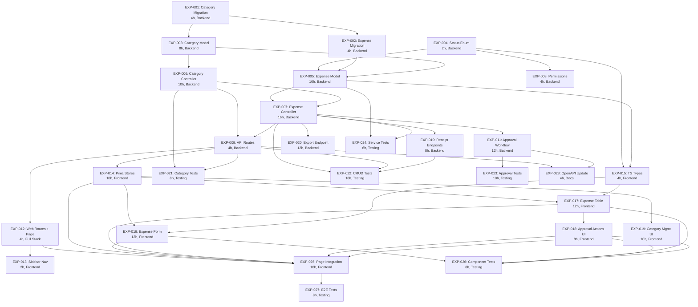

# Task Assignments: Expense Management Feature

Generated: 2026-02-06
PRD Reference: `/home/keven/Documents/solidtime-analysis/.features/02-expense-management/PRD.md`

---

## Sprint Plan Overview

| Sprint | Weeks | Focus | Total Effort |
|---|---|---|---|
| Sprint 1 | 1-2 | Foundation (migrations, models, controllers, routes, permissions) | 70 hours (34 SP) |
| Sprint 2 | 3-4 | Approval workflow + Frontend (stores, components, page) + Notifications | 70 hours (29 SP) |
| Sprint 3 | 5-6 | Export, category UI, comprehensive testing | 84 hours (30 SP) |
| **Total** | **6 weeks** | | **224 hours (112 SP)** |

---

## Task Assignment Table

| Task ID | Description | Type | Assigned Sub-Agent | Dependencies | Effort | Status |
|---|---|---|---|---|---|---|
| EXP-001 | Database migration for expense_categories table | Backend / Database | Backend Dev | None | 4 hours (2 SP) | To Do |
| EXP-002 | Database migration for expenses table | Backend / Database | Backend Dev | EXP-001 | 4 hours (2 SP) | To Do |
| EXP-003 | ExpenseCategory model, factory, and service | Backend | Backend Dev | EXP-001 | 8 hours (3 SP) | To Do |
| EXP-004 | ExpenseStatus enum | Backend | Backend Dev | None | 2 hours (1 SP) | To Do |
| EXP-005 | Expense model and factory | Backend | Backend Dev | EXP-002, EXP-003, EXP-004 | 10 hours (5 SP) | To Do |
| EXP-006 | ExpenseCategory CRUD controller and requests | Backend | Backend Dev | EXP-003 | 10 hours (5 SP) | To Do |
| EXP-007 | Expense CRUD controller, requests, service, and filter | Backend | Backend Dev | EXP-005, EXP-006 | 16 hours (8 SP) | To Do |
| EXP-008 | Register expense permissions in JetstreamServiceProvider | Backend | Backend Dev | EXP-004 | 4 hours (2 SP) | To Do |
| EXP-009 | Register API routes for expenses and categories | Backend | Backend Dev | EXP-006, EXP-007 | 4 hours (2 SP) | To Do |
| EXP-010 | Receipt upload, download, and delete endpoints | Backend | Backend Dev | EXP-007 | 8 hours (5 SP) | To Do |
| EXP-011 | Approval workflow endpoints (submit/approve/reject/bulk/revert) | Backend | Backend Dev | EXP-007 | 12 hours (5 SP) | To Do |
| EXP-012 | Register web routes and Expenses page shell | Full Stack | Frontend Dev | EXP-009 | 4 hours (2 SP) | To Do |
| EXP-013 | Add Expenses to sidebar navigation | Frontend | Frontend Dev | EXP-012 | 2 hours (1 SP) | To Do |
| EXP-014 | Pinia stores for expenses and expense categories | Frontend | Frontend Dev | EXP-009 | 10 hours (5 SP) | To Do |
| EXP-015 | TypeScript type definitions for expense models | Frontend | Frontend Dev | EXP-004, EXP-005 | 4 hours (2 SP) | To Do |
| EXP-016 | Expense form component (create/edit) | Frontend | Frontend Dev | EXP-014, EXP-015 | 12 hours (5 SP) | To Do |
| EXP-017 | Expense table, row, filter bar, and status badge components | Frontend | Frontend Dev | EXP-014, EXP-015 | 12 hours (5 SP) | To Do |
| EXP-018 | Expense approval actions, reject dialog, bulk action bar | Frontend | Frontend Dev | EXP-017 | 8 hours (3 SP) | To Do |
| EXP-019 | Expense category management UI (admin) | Frontend | Frontend Dev | EXP-014 | 10 hours (5 SP) | To Do |
| EXP-020 | Expense export endpoint (CSV/XLSX/PDF) | Backend | Backend Dev | EXP-007 | 12 hours (5 SP) | To Do |
| EXP-021 | Expense category API endpoint tests | Testing | QA / Backend Dev | EXP-006, EXP-009 | 8 hours (3 SP) | To Do |
| EXP-022 | Expense CRUD API endpoint tests | Testing | QA / Backend Dev | EXP-007, EXP-009, EXP-010 | 16 hours (8 SP) | To Do |
| EXP-023 | Expense approval workflow API endpoint tests | Testing | QA / Backend Dev | EXP-011 | 10 hours (5 SP) | To Do |
| EXP-024 | ExpenseService unit tests | Testing | QA / Backend Dev | EXP-005, EXP-007 | 6 hours (3 SP) | To Do |
| EXP-025 | Integrate Expenses page with all components and stores | Frontend | Frontend Dev | EXP-012, EXP-014, EXP-016, EXP-017, EXP-018, EXP-019 | 10 hours (5 SP) | To Do |
| EXP-026 | Frontend Vitest component tests | Testing | QA / Frontend Dev | EXP-016, EXP-017, EXP-018, EXP-019 | 8 hours (3 SP) | To Do |
| EXP-027 | E2E Playwright tests for expense feature | Testing | QA | EXP-025 | 8 hours (3 SP) | To Do |
| EXP-028 | OpenAPI specification update for expense endpoints | Backend / Docs | Backend Dev | EXP-009, EXP-011 | 4 hours (2 SP) | To Do |
| EXP-029 | Create expense notification classes (ExpenseSubmittedNotification, ExpenseApprovedNotification, ExpenseRejectedNotification) extending BaseNotification | Backend | Backend Dev | EXP-007, FOUND-001 through FOUND-005 | 4 hours (2 SP) | To Do |
| EXP-030 | Dispatch notifications from ExpenseService on submit/approve/reject status transitions | Backend | Backend Dev | EXP-029 | 2 hours (1 SP) | To Do |

---

## Dependency Graph

---

## Critical Path Analysis

**Critical Path**: EXP-001 -> EXP-002 -> EXP-005 -> EXP-007 -> EXP-009 -> EXP-014 -> EXP-017 -> EXP-025 -> EXP-027

**Critical Path Duration**: 78 hours

| Critical Path Task | Duration | Cumulative |
|---|---|---|
| EXP-001: Category Migration | 4h | 4h |
| EXP-002: Expense Migration | 4h | 8h |
| EXP-005: Expense Model | 10h | 18h |
| EXP-007: Expense Controller | 16h | 34h |
| EXP-009: API Routes | 4h | 38h |
| EXP-014: Pinia Stores | 10h | 48h |
| EXP-017: Expense Table | 12h | 60h |
| EXP-025: Page Integration | 10h | 70h |
| EXP-027: E2E Tests | 8h | 78h |

---

## Parallel Work Streams

### Stream A: Backend Foundation (Backend Dev)
EXP-001 -> EXP-002 -> EXP-005 -> EXP-007 -> EXP-009 -> EXP-010 -> EXP-011 -> EXP-020

### Stream B: Backend Support (Backend Dev, parallel with Stream A where possible)
EXP-004 (parallel with EXP-001)
EXP-003 (after EXP-001, parallel with EXP-002)
EXP-006 (after EXP-003, parallel with EXP-005)
EXP-008 (after EXP-004, parallel with backend model work)

### Stream C: Frontend (Frontend Dev, starts after EXP-009)
EXP-012 -> EXP-013 (parallel)
EXP-014 + EXP-015 (parallel) -> EXP-016 + EXP-017 (parallel) -> EXP-018 + EXP-019 (parallel) -> EXP-025

### Stream D: Testing (QA, starts after backend endpoints are ready)
EXP-021 (after EXP-006, EXP-009)
EXP-022 (after EXP-007, EXP-009, EXP-010)
EXP-023 (after EXP-011)
EXP-024 (after EXP-005, EXP-007)
EXP-026 (after frontend components)
EXP-027 (after EXP-025)

### Stream E: Documentation (Backend Dev, parallel with late Sprint 2)
EXP-028 (after EXP-009, EXP-011)

---

## Dependency Risk Assessment

### High-Risk Dependencies

1. **EXP-007 (Expense Controller)** is the highest-risk bottleneck:
   - Blocks: EXP-009, EXP-010, EXP-011, EXP-020, EXP-022, EXP-024
   - Mitigation: Prioritize this task; consider splitting into sub-tasks (index, store, update, destroy) if falling behind
   - Estimated impact of 1-day delay: 4+ downstream tasks blocked

2. **EXP-005 (Expense Model)** blocks multiple streams:
   - Blocks: EXP-007, EXP-015, EXP-024
   - Mitigation: Can be partially unblocked by creating TypeScript types from the PRD specification before the model is finalized

3. **EXP-009 (API Routes)** is the gateway between backend and frontend:
   - Blocks: EXP-012, EXP-014, EXP-021, EXP-022, EXP-028
   - Mitigation: Routes can be registered early with placeholder controller methods, allowing frontend work to begin

### Low-Risk Dependencies

- EXP-004 (Enum) and EXP-008 (Permissions): Small, quick tasks with no complex logic
- EXP-013 (Sidebar Nav): Simple UI addition, minimal risk
- EXP-028 (OpenAPI): Documentation task, can be deferred without blocking other work

---

## Sprint Breakdown

### Sprint 1: Foundation (Weeks 1-2)

| Task ID | Description | Agent | Effort | Sprint Day Target |
|---|---|---|---|---|
| EXP-001 | Category Migration | Backend Dev | 4h | Day 1 |
| EXP-004 | Status Enum | Backend Dev | 2h | Day 1 |
| EXP-002 | Expense Migration | Backend Dev | 4h | Day 2 |
| EXP-003 | Category Model + Factory + Service | Backend Dev | 8h | Day 2-3 |
| EXP-008 | Register Permissions | Backend Dev | 4h | Day 3 |
| EXP-005 | Expense Model + Factory | Backend Dev | 10h | Day 3-5 |
| EXP-006 | Category Controller + Requests | Backend Dev | 10h | Day 5-6 |
| EXP-007 | Expense Controller + Requests + Service | Backend Dev | 16h | Day 6-9 |
| EXP-009 | API Routes | Backend Dev | 4h | Day 9 |
| EXP-010 | Receipt Endpoints | Backend Dev | 8h | Day 9-10 |

**Sprint 1 Total**: 70 hours

### Sprint 2: Approval Workflow + Frontend (Weeks 3-4)

| Task ID | Description | Agent | Effort | Sprint Day Target |
|---|---|---|---|---|
| EXP-011 | Approval Workflow Endpoints | Backend Dev | 12h | Day 1-2 |
| EXP-012 | Web Routes + Page Shell | Frontend Dev | 4h | Day 1 |
| EXP-013 | Sidebar Navigation | Frontend Dev | 2h | Day 1 |
| EXP-015 | TypeScript Types | Frontend Dev | 4h | Day 1 |
| EXP-014 | Pinia Stores | Frontend Dev | 10h | Day 2-3 |
| EXP-016 | Expense Form Component | Frontend Dev | 12h | Day 4-5 |
| EXP-017 | Expense Table Component | Frontend Dev | 12h | Day 6-7 |
| EXP-018 | Approval Actions UI | Frontend Dev | 8h | Day 8-9 |
| EXP-029 | Expense Notification Classes | Backend Dev | 4h | Day 4 |
| EXP-030 | Dispatch Notifications from ExpenseService | Backend Dev | 2h | Day 5 |

**Sprint 2 Total**: 70 hours

### Sprint 3: Export, Categories UI, Testing (Weeks 5-6)

| Task ID | Description | Agent | Effort | Sprint Day Target |
|---|---|---|---|---|
| EXP-019 | Category Management UI | Frontend Dev | 10h | Day 1-2 |
| EXP-020 | Export Endpoint | Backend Dev | 12h | Day 1-2 |
| EXP-025 | Page Integration | Frontend Dev | 10h | Day 3-4 |
| EXP-021 | Category Endpoint Tests | QA / Backend | 8h | Day 1-2 |
| EXP-022 | Expense CRUD Endpoint Tests | QA / Backend | 16h | Day 2-4 |
| EXP-023 | Approval Endpoint Tests | QA / Backend | 10h | Day 3-4 |
| EXP-024 | Service Unit Tests | QA / Backend | 6h | Day 5 |
| EXP-026 | Frontend Component Tests | QA / Frontend | 8h | Day 5-6 |
| EXP-028 | OpenAPI Specification Update | Backend Dev | 4h | Day 5 |
| EXP-027 | E2E Playwright Tests | QA | 8h | Day 7-8 |

**Sprint 3 Total**: 84 hours (with some parallel execution)

---

## Status Assignment Logic

All tasks are initially set to **To Do** because:
- No tasks have been started yet
- No external constraints block any task from being picked up when its dependencies are met
- Dependencies are all internal (no third-party API availability issues)

Tasks will transition to:
- **In Progress**: When a developer begins work
- **Blocked**: Only if an external constraint prevents progress (e.g., a third-party service outage, team availability)
- **Completed**: When all acceptance criteria are met and code is peer-reviewed
