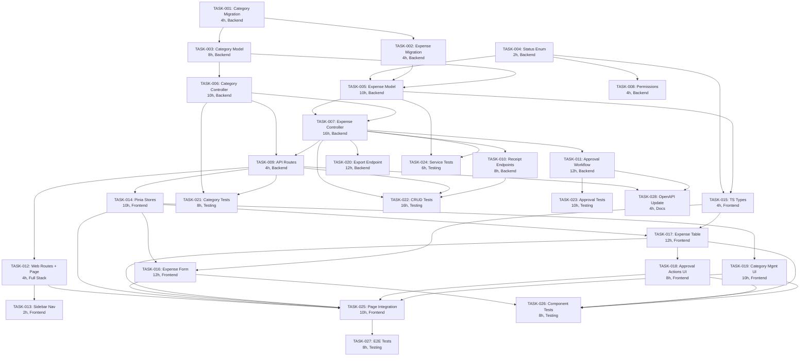

# Task Assignments: Expense Management Feature

Generated: 2026-02-06
PRD Reference: `/home/keven/Documents/solidtime-analysis/.features/02-expense-management/PRD.md`

---

## Sprint Plan Overview

| Sprint | Weeks | Focus | Total Effort |
|---|---|---|---|
| Sprint 1 | 1-2 | Foundation (migrations, models, controllers, routes, permissions) | 70 hours (34 SP) |
| Sprint 2 | 3-4 | Approval workflow + Frontend (stores, components, page) | 64 hours (26 SP) |
| Sprint 3 | 5-6 | Export, category UI, comprehensive testing | 84 hours (30 SP) |
| **Total** | **6 weeks** | | **218 hours (109 SP)** |

---

## Task Assignment Table

| Task ID | Description | Type | Assigned Sub-Agent | Dependencies | Effort | Status |
|---|---|---|---|---|---|---|
| TASK-001 | Database migration for expense_categories table | Backend / Database | Backend Dev | None | 4 hours (2 SP) | To Do |
| TASK-002 | Database migration for expenses table | Backend / Database | Backend Dev | TASK-001 | 4 hours (2 SP) | To Do |
| TASK-003 | ExpenseCategory model, factory, and service | Backend | Backend Dev | TASK-001 | 8 hours (3 SP) | To Do |
| TASK-004 | ExpenseStatus enum | Backend | Backend Dev | None | 2 hours (1 SP) | To Do |
| TASK-005 | Expense model and factory | Backend | Backend Dev | TASK-002, TASK-003, TASK-004 | 10 hours (5 SP) | To Do |
| TASK-006 | ExpenseCategory CRUD controller and requests | Backend | Backend Dev | TASK-003 | 10 hours (5 SP) | To Do |
| TASK-007 | Expense CRUD controller, requests, service, and filter | Backend | Backend Dev | TASK-005, TASK-006 | 16 hours (8 SP) | To Do |
| TASK-008 | Register expense permissions in JetstreamServiceProvider | Backend | Backend Dev | TASK-004 | 4 hours (2 SP) | To Do |
| TASK-009 | Register API routes for expenses and categories | Backend | Backend Dev | TASK-006, TASK-007 | 4 hours (2 SP) | To Do |
| TASK-010 | Receipt upload, download, and delete endpoints | Backend | Backend Dev | TASK-007 | 8 hours (5 SP) | To Do |
| TASK-011 | Approval workflow endpoints (submit/approve/reject/bulk/revert) | Backend | Backend Dev | TASK-007 | 12 hours (5 SP) | To Do |
| TASK-012 | Register web routes and Expenses page shell | Full Stack | Frontend Dev | TASK-009 | 4 hours (2 SP) | To Do |
| TASK-013 | Add Expenses to sidebar navigation | Frontend | Frontend Dev | TASK-012 | 2 hours (1 SP) | To Do |
| TASK-014 | Pinia stores for expenses and expense categories | Frontend | Frontend Dev | TASK-009 | 10 hours (5 SP) | To Do |
| TASK-015 | TypeScript type definitions for expense models | Frontend | Frontend Dev | TASK-004, TASK-005 | 4 hours (2 SP) | To Do |
| TASK-016 | Expense form component (create/edit) | Frontend | Frontend Dev | TASK-014, TASK-015 | 12 hours (5 SP) | To Do |
| TASK-017 | Expense table, row, filter bar, and status badge components | Frontend | Frontend Dev | TASK-014, TASK-015 | 12 hours (5 SP) | To Do |
| TASK-018 | Expense approval actions, reject dialog, bulk action bar | Frontend | Frontend Dev | TASK-017 | 8 hours (3 SP) | To Do |
| TASK-019 | Expense category management UI (admin) | Frontend | Frontend Dev | TASK-014 | 10 hours (5 SP) | To Do |
| TASK-020 | Expense export endpoint (CSV/XLSX/PDF) | Backend | Backend Dev | TASK-007 | 12 hours (5 SP) | To Do |
| TASK-021 | Expense category API endpoint tests | Testing | QA / Backend Dev | TASK-006, TASK-009 | 8 hours (3 SP) | To Do |
| TASK-022 | Expense CRUD API endpoint tests | Testing | QA / Backend Dev | TASK-007, TASK-009, TASK-010 | 16 hours (8 SP) | To Do |
| TASK-023 | Expense approval workflow API endpoint tests | Testing | QA / Backend Dev | TASK-011 | 10 hours (5 SP) | To Do |
| TASK-024 | ExpenseService unit tests | Testing | QA / Backend Dev | TASK-005, TASK-007 | 6 hours (3 SP) | To Do |
| TASK-025 | Integrate Expenses page with all components and stores | Frontend | Frontend Dev | TASK-012, TASK-014, TASK-016, TASK-017, TASK-018, TASK-019 | 10 hours (5 SP) | To Do |
| TASK-026 | Frontend Vitest component tests | Testing | QA / Frontend Dev | TASK-016, TASK-017, TASK-018, TASK-019 | 8 hours (3 SP) | To Do |
| TASK-027 | E2E Playwright tests for expense feature | Testing | QA | TASK-025 | 8 hours (3 SP) | To Do |
| TASK-028 | OpenAPI specification update for expense endpoints | Backend / Docs | Backend Dev | TASK-009, TASK-011 | 4 hours (2 SP) | To Do |

---

## Dependency Graph

---

## Critical Path Analysis

**Critical Path**: TASK-001 -> TASK-002 -> TASK-005 -> TASK-007 -> TASK-009 -> TASK-014 -> TASK-017 -> TASK-025 -> TASK-027

**Critical Path Duration**: 78 hours

| Critical Path Task | Duration | Cumulative |
|---|---|---|
| TASK-001: Category Migration | 4h | 4h |
| TASK-002: Expense Migration | 4h | 8h |
| TASK-005: Expense Model | 10h | 18h |
| TASK-007: Expense Controller | 16h | 34h |
| TASK-009: API Routes | 4h | 38h |
| TASK-014: Pinia Stores | 10h | 48h |
| TASK-017: Expense Table | 12h | 60h |
| TASK-025: Page Integration | 10h | 70h |
| TASK-027: E2E Tests | 8h | 78h |

---

## Parallel Work Streams

### Stream A: Backend Foundation (Backend Dev)
TASK-001 -> TASK-002 -> TASK-005 -> TASK-007 -> TASK-009 -> TASK-010 -> TASK-011 -> TASK-020

### Stream B: Backend Support (Backend Dev, parallel with Stream A where possible)
TASK-004 (parallel with TASK-001)
TASK-003 (after TASK-001, parallel with TASK-002)
TASK-006 (after TASK-003, parallel with TASK-005)
TASK-008 (after TASK-004, parallel with backend model work)

### Stream C: Frontend (Frontend Dev, starts after TASK-009)
TASK-012 -> TASK-013 (parallel)
TASK-014 + TASK-015 (parallel) -> TASK-016 + TASK-017 (parallel) -> TASK-018 + TASK-019 (parallel) -> TASK-025

### Stream D: Testing (QA, starts after backend endpoints are ready)
TASK-021 (after TASK-006, TASK-009)
TASK-022 (after TASK-007, TASK-009, TASK-010)
TASK-023 (after TASK-011)
TASK-024 (after TASK-005, TASK-007)
TASK-026 (after frontend components)
TASK-027 (after TASK-025)

### Stream E: Documentation (Backend Dev, parallel with late Sprint 2)
TASK-028 (after TASK-009, TASK-011)

---

## Dependency Risk Assessment

### High-Risk Dependencies

1. **TASK-007 (Expense Controller)** is the highest-risk bottleneck:
   - Blocks: TASK-009, TASK-010, TASK-011, TASK-020, TASK-022, TASK-024
   - Mitigation: Prioritize this task; consider splitting into sub-tasks (index, store, update, destroy) if falling behind
   - Estimated impact of 1-day delay: 4+ downstream tasks blocked

2. **TASK-005 (Expense Model)** blocks multiple streams:
   - Blocks: TASK-007, TASK-015, TASK-024
   - Mitigation: Can be partially unblocked by creating TypeScript types from the PRD specification before the model is finalized

3. **TASK-009 (API Routes)** is the gateway between backend and frontend:
   - Blocks: TASK-012, TASK-014, TASK-021, TASK-022, TASK-028
   - Mitigation: Routes can be registered early with placeholder controller methods, allowing frontend work to begin

### Low-Risk Dependencies

- TASK-004 (Enum) and TASK-008 (Permissions): Small, quick tasks with no complex logic
- TASK-013 (Sidebar Nav): Simple UI addition, minimal risk
- TASK-028 (OpenAPI): Documentation task, can be deferred without blocking other work

---

## Sprint Breakdown

### Sprint 1: Foundation (Weeks 1-2)

| Task ID | Description | Agent | Effort | Sprint Day Target |
|---|---|---|---|---|
| TASK-001 | Category Migration | Backend Dev | 4h | Day 1 |
| TASK-004 | Status Enum | Backend Dev | 2h | Day 1 |
| TASK-002 | Expense Migration | Backend Dev | 4h | Day 2 |
| TASK-003 | Category Model + Factory + Service | Backend Dev | 8h | Day 2-3 |
| TASK-008 | Register Permissions | Backend Dev | 4h | Day 3 |
| TASK-005 | Expense Model + Factory | Backend Dev | 10h | Day 3-5 |
| TASK-006 | Category Controller + Requests | Backend Dev | 10h | Day 5-6 |
| TASK-007 | Expense Controller + Requests + Service | Backend Dev | 16h | Day 6-9 |
| TASK-009 | API Routes | Backend Dev | 4h | Day 9 |
| TASK-010 | Receipt Endpoints | Backend Dev | 8h | Day 9-10 |

**Sprint 1 Total**: 70 hours

### Sprint 2: Approval Workflow + Frontend (Weeks 3-4)

| Task ID | Description | Agent | Effort | Sprint Day Target |
|---|---|---|---|---|
| TASK-011 | Approval Workflow Endpoints | Backend Dev | 12h | Day 1-2 |
| TASK-012 | Web Routes + Page Shell | Frontend Dev | 4h | Day 1 |
| TASK-013 | Sidebar Navigation | Frontend Dev | 2h | Day 1 |
| TASK-015 | TypeScript Types | Frontend Dev | 4h | Day 1 |
| TASK-014 | Pinia Stores | Frontend Dev | 10h | Day 2-3 |
| TASK-016 | Expense Form Component | Frontend Dev | 12h | Day 4-5 |
| TASK-017 | Expense Table Component | Frontend Dev | 12h | Day 6-7 |
| TASK-018 | Approval Actions UI | Frontend Dev | 8h | Day 8-9 |

**Sprint 2 Total**: 64 hours

### Sprint 3: Export, Categories UI, Testing (Weeks 5-6)

| Task ID | Description | Agent | Effort | Sprint Day Target |
|---|---|---|---|---|
| TASK-019 | Category Management UI | Frontend Dev | 10h | Day 1-2 |
| TASK-020 | Export Endpoint | Backend Dev | 12h | Day 1-2 |
| TASK-025 | Page Integration | Frontend Dev | 10h | Day 3-4 |
| TASK-021 | Category Endpoint Tests | QA / Backend | 8h | Day 1-2 |
| TASK-022 | Expense CRUD Endpoint Tests | QA / Backend | 16h | Day 2-4 |
| TASK-023 | Approval Endpoint Tests | QA / Backend | 10h | Day 3-4 |
| TASK-024 | Service Unit Tests | QA / Backend | 6h | Day 5 |
| TASK-026 | Frontend Component Tests | QA / Frontend | 8h | Day 5-6 |
| TASK-028 | OpenAPI Specification Update | Backend Dev | 4h | Day 5 |
| TASK-027 | E2E Playwright Tests | QA | 8h | Day 7-8 |

**Sprint 3 Total**: 84 hours (with some parallel execution)

---

## Status Assignment Logic

All tasks are initially set to **To Do** because:
- No tasks have been started yet
- No external constraints block any task from being picked up when its dependencies are met
- Dependencies are all internal (no third-party API availability issues)

Tasks will transition to:
- **In Progress**: When a developer begins work
- **Blocked**: Only if an external constraint prevents progress (e.g., a third-party service outage, team availability)
- **Completed**: When all acceptance criteria are met and code is peer-reviewed
