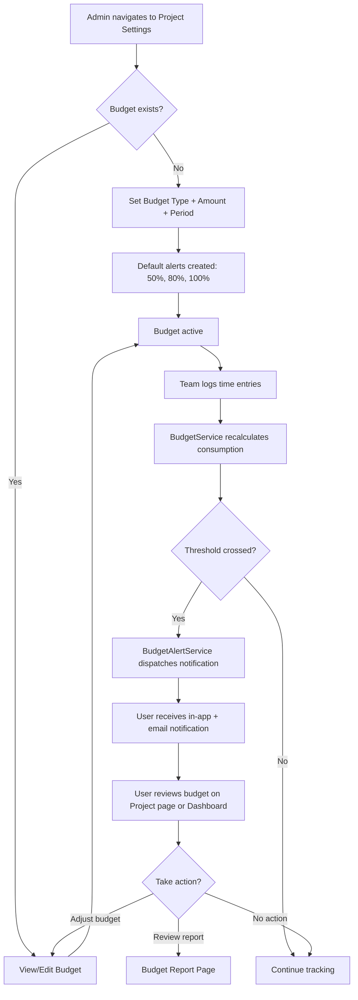
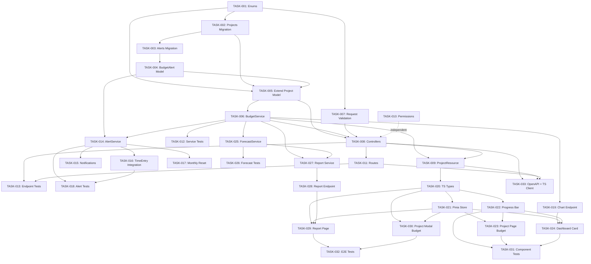

# PRD: Budgets & Alerts Feature for Solidtime

Generated: 2026-02-06
Version: 1.0

---

## Table of Contents

1. [Source Context & Problem Statement](#1-source-context--problem-statement)
2. [Technical Interpretation](#2-technical-interpretation)
3. [Functional Specifications](#3-functional-specifications)
4. [Technical Requirements & Constraints](#4-technical-requirements--constraints)
5. [User Stories with Acceptance Criteria](#5-user-stories-with-acceptance-criteria)
6. [Task Breakdown Structure](#6-task-breakdown-structure)
7. [Dependencies & Integration Points](#7-dependencies--integration-points)
8. [Risk Assessment & Mitigation](#8-risk-assessment--mitigation)
9. [Testing & Validation Requirements](#9-testing--validation-requirements)
10. [Monitoring & Observability](#10-monitoring--observability)
11. [Success Metrics & Definition of Done](#11-success-metrics--definition-of-done)
12. [Technical Debt & Future Considerations](#12-technical-debt--future-considerations)
13. [Sprint Plan](#13-sprint-plan)
14. [Appendices](#14-appendices)

---

## Amendments (2026-02-06 Review)

> These amendments supersede conflicting content in the original PRD sections below.
> Reference: `.features/SHARED-FOUNDATIONS.md` and `.features/PRD-REVIEW-REPORT.md`

### AMD-01: Task ID Prefix
All task IDs in this PRD are now prefixed with `BUD-`. E.g., TASK-001 becomes BUD-001.

### AMD-02: Permission Naming (SF-02)
One permission updated:
- `budgets:alerts:manage` → `budget-alerts:manage`

### AMD-03: Migration Timestamps (SF-03)
All migrations use date prefix `2026_03_03_` instead of `2026_02_07_`.

### AMD-04: Notification Infrastructure (SF-04)
This feature's use of Laravel Notifications with `database` + `mail` channels is **confirmed as the standard** and adopted across all features. However:
- The PRD must add a dependency on FOUND-001 through FOUND-005 (shared notification infrastructure)
- The in-app notification bell UI is provided by FOUND-003, not built within this feature
- `BudgetThresholdNotification` and `BudgetExceededNotification` extend `App\Notifications\BaseNotification`

### AMD-05: Modular Permissions (SF-08)
Permissions are registered via `App\Permissions\BudgetPermissions::register()` instead of directly modifying `JetstreamServiceProvider`.

### AMD-06: `organization_id` on `budget_alerts` Table
Add `organization_id` as a foreign key on the `budget_alerts` table for query efficiency. While derivable through `project.organization_id`, the monthly reset command (BUD-017) and org-scoped alert queries benefit from a direct foreign key. This avoids N+1 joins for org-scoped operations.

### AMD-07: `estimated_time` Coexistence Strategy
When a project has both `estimated_time` (legacy) and a `budget_type = 'hours'` budget:
- The `EstimatedTimeProgress` component displays the **budget** value, not `estimated_time`
- `estimated_time` becomes a secondary/internal field, not shown when a budget exists
- A future migration task (technical debt) will migrate `estimated_time` values to budget format and deprecate the field
- The Architecture phase must specify the exact UI behavior for this coexistence

### AMD-08: Alert Evaluation Sync vs. Async Clarification
The threshold check and `lockForUpdate()` execute **synchronously** within the HTTP request. Only the notification dispatch is asynchronous (queued). The "< 50ms added latency" target applies to the synchronous portion only. The `lockForUpdate()` acquires a row-level lock on the `budget_alerts` record; contention is low since alerts are per-project and concurrent time entry saves to the same project are rare.

### AMD-09: Dashboard Widget N+1 Fix
The `budgetOverview` endpoint (BUD-019) must use batch consumption calculation, not per-project map. The `BudgetService` should support a `getConsumptionBatch(Collection $projects)` method that executes a single aggregation query across all budgeted projects.

### AMD-10: Sprint SP Reconciliation
Sprint 1 is 33 SP (per task assignments), not 34 SP. The redundant TASK-010 listing has been removed. Corrected sprint allocation:
- Sprint 1: 33 SP
- Sprint 2: 28 SP
- Sprint 3: 27 SP

### AMD-11: Web Route for Budget Report Page
**New task: BUD-034 — Register Inertia web route for Budget Report page**
- Add route in `routes/web.php`: `Inertia::render('BudgetReport')` inside `auth:web` middleware group
- Add `NavigationSidebarItem` in `AppLayout.vue`
- Effort: 1 hour / 1 SP
- Dependencies: BUD-029
- Sprint: 3

### AMD-12: TASK-005 Dependency Relaxation
BUD-005 (extend Project model with budget fields) no longer depends on BUD-004 (BudgetAlert model). The budget columns on the Project table are independent of the alerts table. The `budgetAlerts()` relationship can be added to the model after BUD-004 completes, but the budget columns migration and accessors can proceed in parallel.

---

## 1. Source Context & Problem Statement

### Current State

Solidtime is an open-source time tracking application built with Laravel 11, Vue 3, TypeScript, Pinia, and Inertia.js. It currently provides:

- **Projects** with a basic `estimated_time` field (integer, seconds, nullable) and a computed `spent_time` field that aggregates time entry durations.
- **Multi-level billable rates**: Organization > Member > Project > ProjectMember hierarchy resolved by `BillableRateService`.
- **TimeEntryAggregationService** providing grouped rollups by project, client, user, task, day/week/month/year with cost calculations.
- **DashboardService** with weekly overview charts, daily tracked hours, and team activity widgets.
- **EstimatedTimeProgress** Vue component that renders a simple percentage bar comparing `spent_time` against `estimated_time`.

### What Is Missing

- No concept of budgets beyond a rudimentary hours estimate.
- No cost-based or fixed-fee budget tracking.
- No alerting when budgets approach or exceed thresholds.
- No burn-down or forecasting visualization.
- No budget-vs-actual reporting by project or client.
- The existing `estimated_time` field is limited to hours only and has no currency dimension.

### Business Justification

Budget tracking is a critical feature for freelancers and agencies using time tracking tools. Without it, users must export data and compute burn rates in spreadsheets. Adding budgets and alerts directly into solidtime will:

- Reduce revenue leakage from unnoticed budget overruns.
- Enable proactive project management through threshold alerts.
- Provide burn-rate forecasting so project managers can course-correct early.
- Deliver budget-vs-actual reporting for client billing transparency.

---

## 2. Technical Interpretation

### Business Requirement to Technical Translation

| Business Requirement | Technical Implementation |
|---|---|
| Set budgets per project (hours, cost, fixed-fee) | Extend `projects` table with `budget_type`, `budget_amount`, `budget_currency_code` columns. New `BudgetType` enum. |
| Track budget consumption in real time | New `BudgetService` computing consumed hours/cost from `TimeEntry` aggregations, leveraging existing `BillableRateService` for cost computation. |
| Alert at configurable thresholds (50%, 80%, 100%) | New `budget_alerts` table and `BudgetAlert` model. New `BudgetAlertService` evaluating thresholds. Laravel `BudgetThresholdNotification` via database + mail channels. |
| Dashboard widget for budget burn-down | New `BudgetDashboardWidget.vue` component. New `BudgetChartController` API endpoint. Budget data served alongside existing chart endpoints. |
| Linear forecast based on burn rate | `BudgetForecastService` computing daily burn rate from historical data and projecting exhaustion date. |
| Budget-vs-actual reports | Extend `TimeEntryAggregationService` or create dedicated `BudgetReportService` that groups spending by project/client and compares against budget. New API endpoint and report UI. |

### Architectural Decisions

1. **Budget lives on Project, not as a separate entity.** Budgets are inherently tied to projects. Extending the `projects` table avoids a join-heavy separate model while keeping the domain model simple. This mirrors how `estimated_time` already lives on Project.

2. **BudgetAlert is a separate model.** Alerts have their own lifecycle (created, triggered, snoozed, re-triggered). A separate `budget_alerts` table allows multiple threshold configurations per project and tracks trigger history.

3. **Alerts evaluated on time entry write operations.** Rather than polling, budget thresholds are evaluated synchronously when time entries are created, updated, or deleted. This is consistent with how `billable_rate` is recomputed on time entry changes. A queued job handles the actual notification dispatch to avoid blocking the HTTP response.

4. **Budget type enum approach.** A `BudgetType` PHP enum (`hours`, `cost`, `fixed_fee`) determines how consumption is calculated. Hours-based uses raw seconds; cost-based multiplies by billable rate; fixed-fee tracks against a fixed monetary amount.

5. **Currency for cost budgets.** Cost-based and fixed-fee budgets use the organization's `currency` field by default but allow per-project override via `budget_currency_code` for multi-currency organizations.

6. **Premium feature gating.** Budget features will be gated behind `canAccessPremiumFeatures()` (consistent with `estimated_time` gating in `ProjectController::store`).

---

## 3. Functional Specifications

### 3.1 Sub-feature: Budget Definition (SF-01)

**Requirement ID**: REQ-001
**Priority**: P0
**Description**: Allow organization admins/managers/owners to define a budget for any project. A budget consists of a type (hours, cost, or fixed-fee), an amount, and optionally a period (total or monthly recurring).

**Budget Types**:
- **Hours**: Budget amount is in seconds (stored as integer, displayed as hours). Consumption is the sum of time entry durations.
- **Cost**: Budget amount is in cents (stored as integer). Consumption is the sum of `(time_entry_duration_hours * billable_rate)` for all entries on the project.
- **Fixed Fee**: Budget amount is in cents (stored as integer). Consumption tracks the same as cost but semantically represents a fixed project fee where the goal is to stay under the fee amount.

**Budget Periods**:
- **Total**: The budget applies to the entire lifetime of the project.
- **Monthly**: The budget resets each calendar month. Consumption is calculated for the current month only.

**Edge Cases**:
- Changing budget type on a project with existing time entries: consumption is recalculated using the new type.
- Setting budget to null: removes the budget; existing alerts are soft-deactivated.
- Archived projects: budgets are read-only; no new alerts trigger.
- Projects with no billable rate: cost-based budgets show a warning that entries without rates are excluded from consumption.

**Error Scenarios**:
- Budget amount of 0: rejected by validation.
- Budget amount negative: rejected by validation.
- Non-owner/admin/manager attempting to set budget: 403 Forbidden.
- Setting cost budget on non-billable project: allowed but with warning in API response.

### 3.2 Sub-feature: Budget Burn Tracking (SF-02)

**Requirement ID**: REQ-002
**Priority**: P0
**Description**: Compute and expose budget consumption metrics in real time as time entries are logged, updated, or deleted.

**Consumption Calculation**:
```
For hours-based budget:
  consumed = SUM(duration_seconds) for all completed time entries on the project
  percentage = (consumed / budget_amount) * 100

For cost-based / fixed-fee budget:
  consumed = SUM(duration_hours * billable_rate_cents) for all completed time entries
  percentage = (consumed / budget_amount) * 100
```

**Monthly Period Handling**:
- When `budget_period = 'monthly'`, consumption is scoped to `start >= first_day_of_current_month AND start < first_day_of_next_month` in the organization's timezone context.

**Running Time Entries**:
- Running (no `end`) time entries contribute to a `consumed_including_running` figure using `NOW()` as the end timestamp, matching the existing `DashboardService` pattern of `coalesce("end", now())`.

**API Response Shape** (added to ProjectResource):
```json
{
  "budget": {
    "type": "hours|cost|fixed_fee",
    "amount": 360000,
    "currency_code": "USD",
    "period": "total|monthly",
    "consumed": 180000,
    "consumed_including_running": 183600,
    "percentage": 50.0,
    "remaining": 180000,
    "is_over_budget": false
  }
}
```

### 3.3 Sub-feature: Threshold Alerts (SF-03)

**Requirement ID**: REQ-003
**Priority**: P1
**Description**: Allow users to configure alert thresholds per project budget. When budget consumption crosses a threshold, a notification is dispatched.

**Default Thresholds**: When a budget is first set, three default alerts are created: 50%, 80%, 100%.

**Custom Thresholds**: Users can add, edit, or remove thresholds. Valid range: 1-200% (allowing over-budget alerts).

**Notification Channels**:
- **Database** (in-app notification bell): always.
- **Email**: configurable per alert (default: enabled for 80% and 100%).

**Trigger Logic**:
- On each time entry create/update/delete, the `BudgetAlertService` checks if the new consumption percentage has crossed any un-triggered threshold.
- A threshold is "triggered" when `new_percentage >= threshold_percentage AND previous_percentage < threshold_percentage`.
- For monthly budgets, thresholds reset on the first of each month.
- `triggered_at` timestamp is recorded. An alert can re-trigger only if it was previously reset (e.g., by editing time entries that bring consumption back below the threshold, or by monthly reset).

**Alert Notification Content**:
```
Subject: "Budget Alert: {project_name} has reached {threshold}%"
Body: "Project '{project_name}' has consumed {consumed_formatted} of its {budget_formatted} {budget_type} budget ({percentage}%).
       Remaining: {remaining_formatted}."
```

**Edge Cases**:
- Deleting a time entry that brings consumption below a triggered threshold: the alert's `triggered_at` is cleared so it can re-trigger.
- Bulk-updating time entries: alert evaluation runs once after all updates, not per entry.
- Concurrent time entry creation by multiple users: use database-level locking on alert check to prevent duplicate notifications.

### 3.4 Sub-feature: Budget Dashboard Widget (SF-04)

**Requirement ID**: REQ-004
**Priority**: P1
**Description**: Display budget status on the project detail page and as an optional dashboard card on the organization dashboard.

**Project Detail Page Widget**:
- Shows a progress bar (extending the existing `EstimatedTimeProgress` pattern).
- Color coding: green (0-49%), yellow (50-79%), orange (80-99%), red (100%+).
- Displays: consumed / total, percentage, remaining, estimated exhaustion date.
- For monthly budgets: shows current month consumption with a mini-chart of previous months.

**Organization Dashboard Card**:
- "Budget Overview" card showing projects closest to budget exhaustion.
- Lists top 5 projects sorted by consumption percentage (descending).
- Each row: project name, color dot, progress bar, percentage.
- Only visible to users with `projects:view:all` permission.

### 3.5 Sub-feature: Forecasting (SF-05)

**Requirement ID**: REQ-005
**Priority**: P2
**Description**: Provide a linear forecast of when the budget will be exhausted based on the current burn rate.

**Calculation**:
```
daily_burn_rate = consumed / days_with_activity
days_remaining = remaining / daily_burn_rate
estimated_exhaustion_date = today + days_remaining
```

- `days_with_activity` is the count of distinct days with at least one time entry on the project, starting from the earliest time entry or the start of the current month (for monthly budgets).
- If `daily_burn_rate` is 0 (no entries yet), forecast returns null.

**API Response** (added to budget object):
```json
{
  "forecast": {
    "daily_burn_rate": 14400,
    "estimated_exhaustion_date": "2026-03-15",
    "days_remaining": 37
  }
}
```

### 3.6 Sub-feature: Budget Reports (SF-06)

**Requirement ID**: REQ-006
**Priority**: P2
**Description**: Budget-vs-actual reporting grouped by project and/or client.

**Report Data**:
- List of projects with budget, consumed, remaining, percentage, forecast.
- Groupable by client (aggregate all project budgets under a client).
- Filterable by: date range, client, project, budget type, over-budget only.
- Exportable as CSV.

**Report Endpoint**: `GET /organizations/{organization}/budgets/report`

### 3.7 User Workflow



### 3.8 Business Rules

- Only users with `projects:update` permission can create/edit budgets.
- Only users with `projects:view` permission (or `projects:view:all`) can see budget data.
- Employees can see budget progress on projects they are members of (if the organization setting allows).
- Budget alerts are sent to all users with `projects:view:all` permission on the organization.
- Deleting a project deletes its budget alerts (cascade).
- Budget amounts are always stored as integers (seconds for hours, cents for cost/fixed-fee).

---

## 4. Technical Requirements & Constraints

### 4.1 System Architecture

```
                          +-----------------------+
                          |    Vue 3 Frontend     |
                          |  (Inertia + Pinia)    |
                          +----------+------------+
                                     |
                          +----------v------------+
                          |   Laravel API (V1)    |
                          |  BudgetController     |
                          |  BudgetChartController|
                          +----------+------------+
                                     |
                   +-----------------+-------------------+
                   |                 |                    |
          +--------v-------+ +------v--------+ +--------v--------+
          | BudgetService  | | BudgetAlert   | | BudgetForecast  |
          | (consumption)  | | Service       | | Service         |
          +--------+-------+ +------+--------+ +--------+--------+
                   |                 |                    |
          +--------v-------+ +------v--------+           |
          | TimeEntry      | | Notification  |           |
          | Aggregation    | | (DB + Mail)   |           |
          | Service        | +---------------+           |
          +--------+-------+                             |
                   |                                     |
          +--------v---------+                           |
          |   PostgreSQL     <---------------------------+
          |   (projects,     |
          |    budget_alerts)|
          +------------------+
```

### 4.2 Data Models

#### Extended Project Model

```php
/**
 * @property string|null $budget_type        'hours'|'cost'|'fixed_fee'|null
 * @property int|null    $budget_amount      Seconds (hours) or cents (cost/fixed_fee)
 * @property string|null $budget_currency_code  ISO 4217 currency code, nullable (falls back to org currency)
 * @property string|null $budget_period      'total'|'monthly'|null
 */
```

#### New BudgetAlert Model

```php
/**
 * @property string      $id
 * @property string      $project_id
 * @property int         $threshold_percentage   1-200
 * @property bool        $notify_email           Whether to send email notification
 * @property Carbon|null $triggered_at           When this threshold was last triggered
 * @property Carbon|null $reset_at               When this threshold was last reset
 * @property Carbon|null $created_at
 * @property Carbon|null $updated_at
 *
 * @property-read Project $project
 */
class BudgetAlert extends Model implements AuditableContract
{
    use CustomAuditable;
    use HasFactory;
    use HasUuids;

    protected $casts = [
        'threshold_percentage' => 'integer',
        'notify_email' => 'boolean',
        'triggered_at' => 'datetime',
        'reset_at' => 'datetime',
    ];
}
```

#### New BudgetType Enum

```php
<?php
declare(strict_types=1);

namespace App\Enums;

enum BudgetType: string
{
    case Hours = 'hours';
    case Cost = 'cost';
    case FixedFee = 'fixed_fee';
}
```

#### New BudgetPeriod Enum

```php
<?php
declare(strict_types=1);

namespace App\Enums;

enum BudgetPeriod: string
{
    case Total = 'total';
    case Monthly = 'monthly';
}
```

### 4.3 Database Schema

#### Migration: Add budget columns to projects table

```sql
ALTER TABLE projects
    ADD COLUMN budget_type VARCHAR(20) NULL,
    ADD COLUMN budget_amount BIGINT NULL,
    ADD COLUMN budget_currency_code VARCHAR(3) NULL,
    ADD COLUMN budget_period VARCHAR(10) NULL DEFAULT 'total';

-- Constraint: budget_amount must be > 0 when budget_type is set
ALTER TABLE projects
    ADD CONSTRAINT chk_budget_amount
    CHECK (budget_type IS NULL OR (budget_amount IS NOT NULL AND budget_amount > 0));

-- Constraint: budget_type values
ALTER TABLE projects
    ADD CONSTRAINT chk_budget_type
    CHECK (budget_type IS NULL OR budget_type IN ('hours', 'cost', 'fixed_fee'));

-- Constraint: budget_period values
ALTER TABLE projects
    ADD CONSTRAINT chk_budget_period
    CHECK (budget_period IS NULL OR budget_period IN ('total', 'monthly'));
```

#### Migration: Create budget_alerts table

```sql
CREATE TABLE budget_alerts (
    id UUID PRIMARY KEY DEFAULT gen_random_uuid(),
    project_id UUID NOT NULL,
    threshold_percentage INTEGER NOT NULL CHECK (threshold_percentage > 0 AND threshold_percentage <= 200),
    notify_email BOOLEAN NOT NULL DEFAULT TRUE,
    triggered_at TIMESTAMP NULL,
    reset_at TIMESTAMP NULL,
    created_at TIMESTAMP DEFAULT CURRENT_TIMESTAMP,
    updated_at TIMESTAMP DEFAULT CURRENT_TIMESTAMP,

    CONSTRAINT fk_budget_alerts_project
        FOREIGN KEY (project_id)
        REFERENCES projects(id)
        ON UPDATE CASCADE
        ON DELETE CASCADE,

    CONSTRAINT uq_budget_alerts_project_threshold
        UNIQUE (project_id, threshold_percentage)
);

CREATE INDEX idx_budget_alerts_project_id ON budget_alerts(project_id);
```

### 4.4 API Contracts

#### Update Project (Extended) - `PUT /api/v1/organizations/{organization}/projects/{project}`

Extended request body (existing fields omitted for brevity):

```yaml
Request Body (additional fields):
  budget_type: string|null (enum: hours, cost, fixed_fee)
  budget_amount: integer|null (> 0 when budget_type set)
  budget_currency_code: string|null (ISO 4217, 3 chars)
  budget_period: string|null (enum: total, monthly; default: total)

Response: ProjectResource (extended with budget object)
```

#### Get Project Budget Status - `GET /api/v1/organizations/{organization}/projects/{project}/budget`

```yaml
Response 200:
  data:
    type: string (hours|cost|fixed_fee)
    amount: integer
    currency_code: string
    period: string (total|monthly)
    consumed: integer
    consumed_including_running: integer
    percentage: float
    remaining: integer
    is_over_budget: boolean
    forecast:
      daily_burn_rate: integer|null
      estimated_exhaustion_date: string|null (YYYY-MM-DD)
      days_remaining: integer|null
    alerts:
      - id: string
        threshold_percentage: integer
        notify_email: boolean
        triggered_at: string|null
        reset_at: string|null

Response 404 (no budget set):
  error:
    message: "No budget configured for this project"
```

#### Manage Budget Alerts - `PUT /api/v1/organizations/{organization}/projects/{project}/budget/alerts`

```yaml
Request Body:
  alerts:
    - threshold_percentage: integer (1-200)
      notify_email: boolean

Response 200:
  data:
    - id: string
      threshold_percentage: integer
      notify_email: boolean
      triggered_at: string|null
      reset_at: string|null

Response 422:
  error:
    message: "Validation failed"
    errors:
      alerts.0.threshold_percentage: ["Duplicate threshold"]
```

#### Budget Report - `GET /api/v1/organizations/{organization}/budgets/report`

```yaml
Query Parameters:
  group_by: string (project|client; default: project)
  filter_client_id: string|null
  filter_project_id: string|null
  filter_budget_type: string|null (hours|cost|fixed_fee)
  filter_over_budget: boolean (default: false)
  start: string|null (YYYY-MM-DD)
  end: string|null (YYYY-MM-DD)

Response 200:
  data:
    - project_id: string
      project_name: string
      project_color: string
      client_id: string|null
      client_name: string|null
      budget_type: string
      budget_amount: integer
      consumed: integer
      remaining: integer
      percentage: float
      is_over_budget: boolean
      forecast_exhaustion_date: string|null
  meta:
    total_budget: integer
    total_consumed: integer
    total_remaining: integer
    projects_over_budget: integer
```

#### Budget Dashboard Chart - `GET /api/v1/organizations/{organization}/charts/budget-overview`

```yaml
Response 200:
  data:
    - project_id: string
      project_name: string
      project_color: string
      budget_type: string
      percentage: float
      consumed: integer
      budget_amount: integer
      is_over_budget: boolean
  meta:
    total_projects_with_budget: integer
    projects_over_budget: integer
```

### 4.5 Performance Requirements

- **Budget consumption calculation**: Must complete in < 100ms for projects with up to 100,000 time entries. Leverage existing `spent_time` computed attribute pattern or database-level aggregation.
- **Alert evaluation on time entry write**: Must add < 50ms to time entry create/update latency. Use asynchronous notification dispatch via queue.
- **Dashboard widget**: Must load in < 200ms (95th percentile).
- **Budget report**: Must complete in < 500ms for organizations with up to 500 projects.
- **Concurrency**: Alert evaluation must be idempotent under concurrent time entry writes. Use `SELECT ... FOR UPDATE` on the alert row during evaluation.

### 4.6 Security Requirements

- Budget data is scoped to organization via route model binding (existing pattern).
- Permission checks follow existing `$this->checkPermission()` pattern.
- New permissions: `budgets:view`, `budgets:update`, `budgets:alerts:manage`.
- Owner, Admin, and Manager roles get all budget permissions.
- Employee role gets `budgets:view` (for projects they are members of).
- Budget amounts are integers (no floating point precision issues).
- Email notifications do not include sensitive financial data beyond the budget/consumption figures.

---

## 5. User Stories with Acceptance Criteria

### USR-001: Set Project Budget

**As a** project manager (Owner/Admin/Manager)
**I want to** set a budget for a project
**So that** I can track spending against a defined limit

**Priority**: P0
**Effort**: 8 story points
**Sprint**: 1

**Acceptance Criteria**:
- [ ] User can set budget type (hours, cost, fixed-fee) when creating or editing a project
- [ ] User can set budget amount (displayed as hours for hours-type, as currency for cost/fixed-fee)
- [ ] User can set budget period (total or monthly)
- [ ] Budget type, amount, and period are persisted and returned in the project API response
- [ ] Setting budget to null removes the budget configuration
- [ ] Budget fields are gated behind premium features check
- [ ] Validation rejects budget_amount <= 0, invalid budget_type values
- [ ] When a budget is first created, default alerts at 50%, 80%, 100% are automatically created

### USR-002: View Budget Consumption

**As a** team member
**I want to** see how much of the project budget has been consumed
**So that** I can be aware of project spending status

**Priority**: P0
**Effort**: 5 story points
**Sprint**: 1

**Acceptance Criteria**:
- [ ] Project detail page shows a budget progress bar when a budget is set
- [ ] Progress bar shows consumed amount, total budget, percentage, and remaining
- [ ] Color coding: green (0-49%), yellow (50-79%), orange (80-99%), red (100%+)
- [ ] For monthly budgets, consumption shows current month only
- [ ] Running time entries are reflected in a secondary "including running" figure
- [ ] Projects without budgets show no budget section
- [ ] Employees can only see budgets on projects they are members of

### USR-003: Receive Budget Threshold Alerts

**As a** project manager
**I want to** receive notifications when a project budget reaches certain thresholds
**So that** I can take corrective action before the budget is exceeded

**Priority**: P1
**Effort**: 8 story points
**Sprint**: 2

**Acceptance Criteria**:
- [ ] In-app notification appears when a threshold is crossed
- [ ] Email notification is sent when configured for the threshold
- [ ] Default thresholds (50%, 80%, 100%) are created when budget is set
- [ ] User can customize thresholds (add, remove, change percentage)
- [ ] User can toggle email notification per threshold
- [ ] Threshold is triggered only once per crossing (not on every time entry)
- [ ] Threshold resets if consumption drops back below it
- [ ] For monthly budgets, thresholds reset on the first of each month
- [ ] No alerts trigger for archived projects

### USR-004: View Budget Overview on Dashboard

**As a** manager/admin
**I want to** see a summary of all project budgets on my dashboard
**So that** I can quickly identify projects at risk

**Priority**: P1
**Effort**: 5 story points
**Sprint**: 2

**Acceptance Criteria**:
- [ ] Dashboard shows a "Budget Overview" card
- [ ] Card lists top 5 projects sorted by consumption percentage (highest first)
- [ ] Each row shows: project color, name, progress bar, percentage
- [ ] Over-budget projects are highlighted in red
- [ ] Card is only visible to users with `projects:view:all` permission
- [ ] Card handles gracefully when no projects have budgets (shows empty state)
- [ ] Clicking a project row navigates to the project detail page

### USR-005: View Budget Forecast

**As a** project manager
**I want to** see a forecast of when the budget will be exhausted
**So that** I can plan resource allocation proactively

**Priority**: P2
**Effort**: 5 story points
**Sprint**: 3

**Acceptance Criteria**:
- [ ] Project budget section shows estimated exhaustion date
- [ ] Forecast is based on average daily burn rate
- [ ] If no time entries exist, forecast shows "Not enough data"
- [ ] Forecast is recalculated on each page load (not cached)
- [ ] API returns forecast data in the budget object
- [ ] Monthly budgets show forecast for remaining days in current month

### USR-006: Generate Budget Reports

**As a** project manager or admin
**I want to** generate reports comparing budget vs actual across projects and clients
**So that** I can analyze spending patterns and report to stakeholders

**Priority**: P2
**Effort**: 8 story points
**Sprint**: 3

**Acceptance Criteria**:
- [ ] Report page shows a table of all projects with budgets
- [ ] Table columns: project name, client, budget type, budget amount, consumed, remaining, percentage, forecast date
- [ ] Reports can be grouped by client (aggregating all projects under each client)
- [ ] Reports can be filtered by date range, client, project, budget type, over-budget only
- [ ] Reports are exportable as CSV
- [ ] Over-budget rows are highlighted
- [ ] Summary row shows totals

---

## 6. Task Breakdown Structure

### Phase 1: Foundation (Sprint 1 - Weeks 1-2)

---

#### TASK-001: Create BudgetType and BudgetPeriod Enums

**Type**: Backend
**Effort**: 2h (1 SP)
**Dependencies**: None

**Description**: Create PHP enums for budget type and budget period.

**Files to create**:
- `app/Enums/BudgetType.php`
- `app/Enums/BudgetPeriod.php`

**Implementation Details**:

```php
// app/Enums/BudgetType.php
<?php
declare(strict_types=1);

namespace App\Enums;

enum BudgetType: string
{
    case Hours = 'hours';
    case Cost = 'cost';
    case FixedFee = 'fixed_fee';
}
```

```php
// app/Enums/BudgetPeriod.php
<?php
declare(strict_types=1);

namespace App\Enums;

enum BudgetPeriod: string
{
    case Total = 'total';
    case Monthly = 'monthly';
}
```

**Acceptance Criteria**:
- [ ] Both enums exist with correct values
- [ ] Both enums use `declare(strict_types=1)`
- [ ] PHPStan passes

---

#### TASK-002: Database Migration - Add Budget Columns to Projects

**Type**: Database / Backend
**Effort**: 4h (2 SP)
**Dependencies**: [TASK-001]

**Description**: Create a Laravel migration to add budget-related columns to the `projects` table.

**Files to create**:
- `database/migrations/2026_02_07_000001_add_budget_columns_to_projects_table.php`

**Implementation Details**:

```php
Schema::table('projects', function (Blueprint $table): void {
    $table->string('budget_type', 20)->nullable()->after('estimated_time');
    $table->bigInteger('budget_amount')->unsigned()->nullable()->after('budget_type');
    $table->string('budget_currency_code', 3)->nullable()->after('budget_amount');
    $table->string('budget_period', 10)->nullable()->default(null)->after('budget_currency_code');
});

// Add CHECK constraints via raw SQL for PostgreSQL
DB::statement("ALTER TABLE projects ADD CONSTRAINT chk_budget_type CHECK (budget_type IS NULL OR budget_type IN ('hours', 'cost', 'fixed_fee'))");
DB::statement("ALTER TABLE projects ADD CONSTRAINT chk_budget_period CHECK (budget_period IS NULL OR budget_period IN ('total', 'monthly'))");
DB::statement("ALTER TABLE projects ADD CONSTRAINT chk_budget_amount CHECK (budget_type IS NULL OR (budget_amount IS NOT NULL AND budget_amount > 0))");
```

**Acceptance Criteria**:
- [ ] Migration runs successfully on PostgreSQL
- [ ] Migration rollback works (drops columns and constraints)
- [ ] Existing projects are unaffected (null budget fields)
- [ ] CHECK constraints prevent invalid data

---

#### TASK-003: Database Migration - Create Budget Alerts Table

**Type**: Database / Backend
**Effort**: 4h (2 SP)
**Dependencies**: [TASK-002]

**Description**: Create the `budget_alerts` table.

**Files to create**:
- `database/migrations/2026_02_07_000002_create_budget_alerts_table.php`

**Implementation Details**:

```php
Schema::create('budget_alerts', function (Blueprint $table): void {
    $table->uuid('id')->primary();
    $table->uuid('project_id');
    $table->integer('threshold_percentage')->unsigned();
    $table->boolean('notify_email')->default(true);
    $table->timestamp('triggered_at')->nullable();
    $table->timestamp('reset_at')->nullable();
    $table->timestamps();

    $table->foreign('project_id')
        ->references('id')
        ->on('projects')
        ->cascadeOnUpdate()
        ->cascadeOnDelete();

    $table->unique(['project_id', 'threshold_percentage']);
    $table->index('project_id');
});

DB::statement("ALTER TABLE budget_alerts ADD CONSTRAINT chk_threshold_percentage CHECK (threshold_percentage > 0 AND threshold_percentage <= 200)");
```

**Acceptance Criteria**:
- [ ] Migration runs successfully
- [ ] Rollback drops the table
- [ ] Unique constraint prevents duplicate thresholds per project
- [ ] Foreign key cascades on project deletion

---

#### TASK-004: Create BudgetAlert Model

**Type**: Backend
**Effort**: 3h (2 SP)
**Dependencies**: [TASK-003]

**Description**: Create the Eloquent model for budget alerts with relationships and factory.

**Files to create**:
- `app/Models/BudgetAlert.php`
- `database/factories/BudgetAlertFactory.php`

**Implementation Details**:

```php
// app/Models/BudgetAlert.php
class BudgetAlert extends Model implements AuditableContract
{
    use CustomAuditable;
    use HasFactory;
    use HasUuids;

    protected $casts = [
        'threshold_percentage' => 'integer',
        'notify_email' => 'boolean',
        'triggered_at' => 'datetime',
        'reset_at' => 'datetime',
    ];

    public function project(): BelongsTo
    {
        return $this->belongsTo(Project::class, 'project_id');
    }

    public function isTriggered(): bool
    {
        return $this->triggered_at !== null;
    }

    public function trigger(): void
    {
        $this->triggered_at = Carbon::now();
        $this->reset_at = null;
        $this->save();
    }

    public function reset(): void
    {
        $this->triggered_at = null;
        $this->reset_at = Carbon::now();
        $this->save();
    }
}
```

**Acceptance Criteria**:
- [ ] Model uses UUIDs, HasFactory, CustomAuditable
- [ ] Proper casts defined
- [ ] `project()` relationship works
- [ ] Factory creates valid instances
- [ ] `isTriggered()`, `trigger()`, `reset()` methods work correctly

---

#### TASK-005: Extend Project Model with Budget Fields

**Type**: Backend
**Effort**: 3h (2 SP)
**Dependencies**: [TASK-001, TASK-002, TASK-004]

**Description**: Add budget properties, casts, and relationships to the existing `Project` model.

**Files to modify**:
- `app/Models/Project.php`

**Implementation Details**:

Add to Project model:
- New `@property` docblock annotations for `budget_type`, `budget_amount`, `budget_currency_code`, `budget_period`
- Cast `budget_type` to `BudgetType::class` and `budget_period` to `BudgetPeriod::class`
- Add `budgetAlerts()` HasMany relationship
- Add `hasBudget(): bool` accessor method

```php
// In $casts array:
'budget_type' => BudgetType::class,
'budget_amount' => 'integer',
'budget_currency_code' => 'string',
'budget_period' => BudgetPeriod::class,

// New relationship:
public function budgetAlerts(): HasMany
{
    return $this->hasMany(BudgetAlert::class, 'project_id');
}

// New accessor:
public function hasBudget(): bool
{
    return $this->budget_type !== null && $this->budget_amount !== null;
}
```

**Acceptance Criteria**:
- [ ] Budget fields are properly cast
- [ ] `budgetAlerts()` relationship works
- [ ] `hasBudget()` returns correct boolean
- [ ] PHPStan passes
- [ ] Existing tests still pass

---

#### TASK-006: Create BudgetService

**Type**: Backend
**Effort**: 8h (5 SP)
**Dependencies**: [TASK-005]

**Description**: Create the core service for computing budget consumption. This is the central calculation engine.

**Files to create**:
- `app/Service/BudgetService.php`

**Implementation Details**:

```php
class BudgetService
{
    public function __construct(
        private TimezoneService $timezoneService,
    ) {}

    /**
     * Calculate budget consumption for a project.
     *
     * @return array{
     *     consumed: int,
     *     consumed_including_running: int,
     *     percentage: float,
     *     remaining: int,
     *     is_over_budget: bool
     * }
     */
    public function getConsumption(Project $project): array
    {
        // Implementation varies by budget_type:
        // - Hours: SUM(extract(epoch from (end - start))) from time_entries
        // - Cost/FixedFee: SUM(extract(epoch from (end - start)) * billable_rate / 3600) from time_entries
        // For monthly period: add WHERE clause scoping to current month
    }

    public function getConsumptionPercentage(Project $project): float
    {
        // consumed / budget_amount * 100
    }

    public function createDefaultAlerts(Project $project): void
    {
        // Create alerts at 50%, 80%, 100% if they don't exist
    }
}
```

Key implementation notes:
- For hours-based: reuse the same `extract(epoch from ("end" - start))` pattern from `TimeEntryAggregationService`.
- For cost-based: use `SUM(extract(epoch from ("end" - start)) * (coalesce(billable_rate, 0)::float/60/60))` pattern from existing aggregation.
- For monthly periods: use organization timezone (from `TimezoneService`) to determine month boundaries.
- Running entries: include `coalesce("end", now())` for `consumed_including_running`.

**Acceptance Criteria**:
- [ ] Hours-based consumption calculated correctly
- [ ] Cost-based consumption calculated correctly
- [ ] Fixed-fee consumption calculated correctly (same as cost)
- [ ] Monthly period scoping works correctly
- [ ] Running entries included in `consumed_including_running`
- [ ] Returns correct remaining and percentage values
- [ ] Handles edge case: no time entries (consumed = 0)
- [ ] Handles edge case: no budget set (throws exception or returns null)

---

#### TASK-007: Extend ProjectStoreRequest and ProjectUpdateRequest

**Type**: Backend
**Effort**: 4h (2 SP)
**Dependencies**: [TASK-001]

**Description**: Add budget field validation rules to the existing project request classes.

**Files to modify**:
- `app/Http/Requests/V1/Project/ProjectStoreRequest.php`
- `app/Http/Requests/V1/Project/ProjectUpdateRequest.php`

**Implementation Details**:

Add these rules to both request classes:

```php
'budget_type' => [
    'nullable',
    'string',
    Rule::in(array_column(BudgetType::cases(), 'value')),
],
'budget_amount' => [
    'nullable',
    'required_with:budget_type',
    'integer',
    'min:1',
    'max:9223372036854775807', // bigint max
],
'budget_currency_code' => [
    'nullable',
    'string',
    'size:3',
],
'budget_period' => [
    'nullable',
    'string',
    Rule::in(array_column(BudgetPeriod::cases(), 'value')),
],
```

Add accessor methods: `getBudgetType()`, `getBudgetAmount()`, `getBudgetCurrencyCode()`, `getBudgetPeriod()`.

**Acceptance Criteria**:
- [ ] Validation rejects invalid budget_type values
- [ ] Validation rejects budget_amount <= 0
- [ ] budget_amount is required when budget_type is set
- [ ] budget_currency_code must be exactly 3 characters
- [ ] Existing validation rules unaffected
- [ ] All accessor methods return typed values

---

#### TASK-008: Extend ProjectController for Budget CRUD

**Type**: Backend
**Effort**: 6h (3 SP)
**Dependencies**: [TASK-005, TASK-006, TASK-007]

**Description**: Update the `ProjectController` store and update methods to handle budget fields, and add budget-specific endpoints.

**Files to modify**:
- `app/Http/Controllers/Api/V1/ProjectController.php`

**Files to create**:
- `app/Http/Controllers/Api/V1/BudgetController.php`

**Implementation Details**:

In `ProjectController::store()` and `ProjectController::update()`:
```php
if ($this->canAccessPremiumFeatures($organization)) {
    if ($request->has('budget_type')) {
        $project->budget_type = $request->getBudgetType();
        $project->budget_amount = $request->getBudgetAmount();
        $project->budget_currency_code = $request->getBudgetCurrencyCode();
        $project->budget_period = $request->getBudgetPeriod();
    }
}
// After save, if budget was just created:
if ($project->wasChanged('budget_type') && $project->hasBudget()) {
    $budgetService->createDefaultAlerts($project);
}
```

`BudgetController` endpoints:
- `GET .../projects/{project}/budget` - returns budget status with consumption
- `PUT .../projects/{project}/budget/alerts` - update alert thresholds

**Acceptance Criteria**:
- [ ] Budget fields saved when creating a project
- [ ] Budget fields updated when editing a project
- [ ] Premium feature gating works
- [ ] Default alerts created on first budget set
- [ ] Budget detail endpoint returns consumption data
- [ ] Alert management endpoint works for create/update/delete

---

#### TASK-009: Extend ProjectResource with Budget Data

**Type**: Backend
**Effort**: 3h (2 SP)
**Dependencies**: [TASK-006, TASK-008]

**Description**: Add budget information to the project API response.

**Files to modify**:
- `app/Http/Resources/V1/Project/ProjectResource.php`

**Files to create**:
- `app/Http/Resources/V1/Budget/BudgetResource.php`
- `app/Http/Resources/V1/Budget/BudgetAlertResource.php`

**Implementation Details**:

Extend `ProjectResource::toArray()`:
```php
'budget' => $this->resource->hasBudget() ? new BudgetResource($this->resource, $this->showBillableRate) : null,
```

`BudgetResource` calls `BudgetService::getConsumption()` and formats the result.

**Acceptance Criteria**:
- [ ] Budget object included in project response when budget exists
- [ ] Budget object is null when no budget set
- [ ] Budget resource includes consumption, percentage, remaining
- [ ] Non-billable-rate users see hours but not cost data

---

#### TASK-010: Register Budget Permissions

**Type**: Backend
**Effort**: 2h (1 SP)
**Dependencies**: None

**Description**: Add budget-related permissions to the Jetstream role configuration.

**Files to modify**:
- `app/Providers/JetstreamServiceProvider.php`

**Implementation Details**:

Add to Owner, Admin, and Manager roles:
```php
'budgets:view',
'budgets:update',
'budgets:alerts:manage',
```

Add to Employee role:
```php
'budgets:view',
```

**Acceptance Criteria**:
- [ ] Owner, Admin, Manager have all budget permissions
- [ ] Employee has view-only budget permission
- [ ] Placeholder has no budget permissions
- [ ] Existing permissions unaffected

---

#### TASK-011: Add API Routes for Budget Endpoints

**Type**: Backend
**Effort**: 2h (1 SP)
**Dependencies**: [TASK-008]

**Description**: Register budget-related API routes.

**Files to modify**:
- `routes/api.php`

**Implementation Details**:

```php
// Budget routes
Route::name('budgets.')->prefix('/organizations/{organization}')->group(static function (): void {
    Route::get('/projects/{project}/budget', [BudgetController::class, 'show'])->name('show');
    Route::put('/projects/{project}/budget/alerts', [BudgetController::class, 'updateAlerts'])
        ->name('update-alerts')
        ->middleware('check-organization-blocked');
    Route::get('/budgets/report', [BudgetController::class, 'report'])->name('report');
});

// Budget chart route (in charts group)
Route::get('/budget-overview', [ChartController::class, 'budgetOverview'])->name('budget-overview');
```

**Acceptance Criteria**:
- [ ] Routes registered with correct names and middleware
- [ ] Write endpoints have `check-organization-blocked` middleware
- [ ] Routes follow existing naming conventions

---

#### TASK-012: BudgetService Unit Tests

**Type**: Testing
**Effort**: 8h (5 SP)
**Dependencies**: [TASK-006]

**Description**: Comprehensive unit tests for `BudgetService`.

**Files to create**:
- `tests/Unit/Service/BudgetServiceTest.php`

**Test Scenarios**:
- Hours-based budget: correct consumption from time entries
- Cost-based budget: correct consumption using billable rates
- Fixed-fee budget: same as cost calculation
- Monthly period: only counts current month entries
- Running entries: included in `consumed_including_running`
- No time entries: consumed = 0, percentage = 0
- Over budget: percentage > 100, `is_over_budget` = true
- Project with no budget: returns null or throws
- Multiple time entries across days
- Time entries with null billable rate (excluded from cost calculation)

**Acceptance Criteria**:
- [ ] All test scenarios pass
- [ ] Edge cases covered
- [ ] Tests follow existing `TestCaseWithDatabase` pattern

---

#### TASK-013: Budget Endpoint Tests

**Type**: Testing
**Effort**: 8h (5 SP)
**Dependencies**: [TASK-008, TASK-011]

**Description**: API endpoint tests for budget CRUD and budget status.

**Files to create**:
- `tests/Unit/Endpoint/Api/V1/BudgetEndpointTest.php`

**Test Scenarios**:
- Set budget on project creation
- Set budget on project update
- Remove budget (set to null)
- Get budget status
- Get budget status with no budget (404)
- Update budget alerts
- Permission checks (employee cannot update budget)
- Premium feature gating
- Budget report endpoint

**Acceptance Criteria**:
- [ ] All endpoints tested for success and error cases
- [ ] Permission checks verified
- [ ] Tests extend `ApiEndpointTestAbstract`
- [ ] Uses `Passport::actingAs()` pattern

---

### Phase 2: Alerts & Dashboard (Sprint 2 - Weeks 3-4)

---

#### TASK-014: Create BudgetAlertService

**Type**: Backend
**Effort**: 8h (5 SP)
**Dependencies**: [TASK-004, TASK-006]

**Description**: Service that evaluates budget thresholds when time entries change and dispatches notifications.

**Files to create**:
- `app/Service/BudgetAlertService.php`

**Implementation Details**:

```php
class BudgetAlertService
{
    public function __construct(
        private BudgetService $budgetService,
    ) {}

    /**
     * Evaluate all alerts for a project after a time entry change.
     * Called from TimeEntryService or TimeEntryObserver.
     */
    public function evaluateAlerts(Project $project): void
    {
        if (!$project->hasBudget()) {
            return;
        }
        if ($project->is_archived) {
            return;
        }

        $consumption = $this->budgetService->getConsumption($project);
        $currentPercentage = $consumption['percentage'];

        $alerts = $project->budgetAlerts()
            ->lockForUpdate()
            ->get();

        foreach ($alerts as $alert) {
            if ($currentPercentage >= $alert->threshold_percentage && !$alert->isTriggered()) {
                $alert->trigger();
                dispatch(new SendBudgetAlertNotification($project, $alert, $consumption));
            } elseif ($currentPercentage < $alert->threshold_percentage && $alert->isTriggered()) {
                $alert->reset();
            }
        }
    }

    /**
     * Reset all alerts for monthly budgets (called by scheduled command).
     */
    public function resetMonthlyAlerts(): void
    {
        // Find all projects with monthly budgets and reset their triggered alerts
    }
}
```

**Acceptance Criteria**:
- [ ] Correctly identifies when a threshold is newly crossed
- [ ] Does not re-trigger already triggered alerts
- [ ] Resets alerts when consumption drops below threshold
- [ ] Uses `lockForUpdate()` for concurrency safety
- [ ] Skips archived projects
- [ ] Dispatches notification job asynchronously

---

#### TASK-015: Create Budget Notification Classes

**Type**: Backend
**Effort**: 4h (2 SP)
**Dependencies**: [TASK-014]

**Description**: Create Laravel notification and job for budget alerts.

**Files to create**:
- `app/Notifications/BudgetThresholdNotification.php`
- `app/Jobs/SendBudgetAlertNotification.php`

**Implementation Details**:

```php
// app/Notifications/BudgetThresholdNotification.php
class BudgetThresholdNotification extends Notification
{
    use Queueable;

    public function __construct(
        private Project $project,
        private BudgetAlert $alert,
        private array $consumption,
    ) {}

    public function via(object $notifiable): array
    {
        $channels = ['database'];
        if ($this->alert->notify_email) {
            $channels[] = 'mail';
        }
        return $channels;
    }

    public function toMail(object $notifiable): MailMessage
    {
        return (new MailMessage)
            ->subject("Budget Alert: {$this->project->name} at {$this->alert->threshold_percentage}%")
            ->line("Project '{$this->project->name}' has consumed {$this->consumption['percentage']}% of its budget.")
            ->line("Remaining: " . $this->formatRemaining())
            ->action('View Project', url("/projects/{$this->project->id}"));
    }

    public function toArray(object $notifiable): array
    {
        return [
            'project_id' => $this->project->id,
            'project_name' => $this->project->name,
            'threshold_percentage' => $this->alert->threshold_percentage,
            'current_percentage' => $this->consumption['percentage'],
            'budget_type' => $this->project->budget_type->value,
        ];
    }
}
```

**Acceptance Criteria**:
- [ ] Notification supports database and mail channels
- [ ] Email is only sent when `notify_email` is true on the alert
- [ ] Notification content includes project name, threshold, current percentage
- [ ] Job is queued (does not block HTTP request)
- [ ] Notification is sent to all org users with `budgets:view` permission

---

#### TASK-016: Integrate Alert Evaluation with TimeEntryService

**Type**: Backend
**Effort**: 4h (2 SP)
**Dependencies**: [TASK-014]

**Description**: Hook budget alert evaluation into time entry create, update, and delete flows.

**Files to modify**:
- `app/Service/TimeEntryService.php`

**Implementation Details**:

After time entry is created, updated, or deleted, if the time entry has a `project_id`:
```php
if ($timeEntry->project_id !== null) {
    $project = $timeEntry->project;
    if ($project !== null && $project->hasBudget()) {
        app(BudgetAlertService::class)->evaluateAlerts($project);
    }
}
```

For bulk operations (`updateMultiple`, `destroyMultiple`), collect unique project IDs and evaluate once per project.

**Acceptance Criteria**:
- [ ] Alert evaluation runs after time entry create
- [ ] Alert evaluation runs after time entry update
- [ ] Alert evaluation runs after time entry delete
- [ ] Bulk operations evaluate once per affected project (not per entry)
- [ ] No performance regression on time entry operations (alert is async)

---

#### TASK-017: Monthly Alert Reset Scheduled Command

**Type**: Backend
**Effort**: 3h (2 SP)
**Dependencies**: [TASK-014]

**Description**: Create an Artisan command that resets budget alert triggers for monthly budgets at the start of each month.

**Files to create**:
- `app/Console/Commands/ResetMonthlyBudgetAlerts.php`

**Implementation Details**:

```php
class ResetMonthlyBudgetAlerts extends Command
{
    protected $signature = 'budget:reset-monthly-alerts';
    protected $description = 'Reset triggered budget alerts for projects with monthly budgets';

    public function handle(BudgetAlertService $service): int
    {
        $service->resetMonthlyAlerts();
        $this->info('Monthly budget alerts reset successfully.');
        return Command::SUCCESS;
    }
}
```

Register in scheduler:
```php
$schedule->command('budget:reset-monthly-alerts')->monthlyOn(1, '00:00');
```

**Acceptance Criteria**:
- [ ] Command resets all triggered alerts on projects with monthly budgets
- [ ] Command is registered in the scheduler
- [ ] Does not affect projects with total budgets
- [ ] Logs number of alerts reset

---

#### TASK-018: BudgetAlertService Unit Tests

**Type**: Testing
**Effort**: 6h (3 SP)
**Dependencies**: [TASK-014, TASK-016]

**Description**: Unit tests for alert evaluation and trigger logic.

**Files to create**:
- `tests/Unit/Service/BudgetAlertServiceTest.php`

**Test Scenarios**:
- Alert triggered when threshold crossed upward
- Alert not re-triggered when already triggered
- Alert reset when consumption drops below threshold
- Monthly alert reset command
- Archived project alerts skipped
- Concurrent evaluation safety
- Notification dispatched correctly
- Bulk time entry updates: evaluate once per project

**Acceptance Criteria**:
- [ ] All scenarios pass
- [ ] Uses `Bus::fake()` and `Notification::fake()` for assertion

---

#### TASK-019: Budget Dashboard Chart Endpoint

**Type**: Backend
**Effort**: 4h (2 SP)
**Dependencies**: [TASK-006]

**Description**: Add a budget overview chart endpoint to the existing `ChartController`.

**Files to modify**:
- `app/Http/Controllers/Api/V1/ChartController.php`

**Implementation Details**:

```php
public function budgetOverview(Organization $organization, BudgetService $budgetService): JsonResponse
{
    $this->checkPermission($organization, 'budgets:view');
    $this->checkPermission($organization, 'projects:view:all');

    $projects = Project::query()
        ->whereBelongsTo($organization, 'organization')
        ->whereNotNull('budget_type')
        ->whereNotNull('budget_amount')
        ->whereNull('archived_at')
        ->get();

    $data = $projects->map(function (Project $project) use ($budgetService) {
        $consumption = $budgetService->getConsumption($project);
        return [
            'project_id' => $project->id,
            'project_name' => $project->name,
            'project_color' => $project->color,
            'budget_type' => $project->budget_type->value,
            'percentage' => $consumption['percentage'],
            'consumed' => $consumption['consumed'],
            'budget_amount' => $project->budget_amount,
            'is_over_budget' => $consumption['is_over_budget'],
        ];
    })
    ->sortByDesc('percentage')
    ->take(5)
    ->values();

    return response()->json([
        'data' => $data,
        'meta' => [
            'total_projects_with_budget' => $projects->count(),
            'projects_over_budget' => $data->where('is_over_budget', true)->count(),
        ],
    ]);
}
```

**Acceptance Criteria**:
- [ ] Returns top 5 projects sorted by consumption percentage
- [ ] Includes meta with total counts
- [ ] Permission checks enforced
- [ ] Returns empty array when no projects have budgets

---

#### TASK-020: TypeScript Types for Budget API

**Type**: Frontend
**Effort**: 3h (2 SP)
**Dependencies**: [TASK-009]

**Description**: Add TypeScript type definitions for budget-related API responses.

**Files to create/modify**:
- `resources/js/types/budget.d.ts` (new)
- Update generated API client types if using OpenAPI spec generation

**Implementation Details**:

```typescript
// resources/js/types/budget.d.ts

export type BudgetType = 'hours' | 'cost' | 'fixed_fee';
export type BudgetPeriod = 'total' | 'monthly';

export interface BudgetForecast {
    daily_burn_rate: number | null;
    estimated_exhaustion_date: string | null;
    days_remaining: number | null;
}

export interface BudgetAlertConfig {
    id: string;
    threshold_percentage: number;
    notify_email: boolean;
    triggered_at: string | null;
    reset_at: string | null;
}

export interface Budget {
    type: BudgetType;
    amount: number;
    currency_code: string;
    period: BudgetPeriod;
    consumed: number;
    consumed_including_running: number;
    percentage: number;
    remaining: number;
    is_over_budget: boolean;
    forecast: BudgetForecast | null;
    alerts: BudgetAlertConfig[];
}

export interface ProjectWithBudget {
    id: string;
    name: string;
    color: string;
    budget: Budget | null;
}

export interface BudgetOverviewItem {
    project_id: string;
    project_name: string;
    project_color: string;
    budget_type: BudgetType;
    percentage: number;
    consumed: number;
    budget_amount: number;
    is_over_budget: boolean;
}

export interface BudgetReportItem {
    project_id: string;
    project_name: string;
    project_color: string;
    client_id: string | null;
    client_name: string | null;
    budget_type: BudgetType;
    budget_amount: number;
    consumed: number;
    remaining: number;
    percentage: number;
    is_over_budget: boolean;
    forecast_exhaustion_date: string | null;
}
```

**Acceptance Criteria**:
- [ ] All budget-related API response types defined
- [ ] Types match backend API contracts exactly
- [ ] No `any` types used

---

#### TASK-021: Budget Pinia Store

**Type**: Frontend
**Effort**: 6h (3 SP)
**Dependencies**: [TASK-020]

**Description**: Create a Pinia store for budget data fetching and state management.

**Files to create**:
- `resources/js/utils/useBudgets.ts`

**Implementation Details**:

```typescript
import { defineStore } from 'pinia';
import { api } from '@/packages/api/src';
import { ref, computed } from 'vue';
import type { Budget, BudgetOverviewItem, BudgetAlertConfig } from '@/types/budget';
import { getCurrentOrganizationId } from '@/utils/useUser';
import { useNotificationsStore } from '@/utils/notification';
import { useQueryClient } from '@tanstack/vue-query';

export const useBudgetStore = defineStore('budgets', () => {
    const { handleApiRequestNotifications } = useNotificationsStore();
    const queryClient = useQueryClient();

    async function fetchProjectBudget(projectId: string): Promise<Budget | null> {
        // GET /organizations/{org}/projects/{project}/budget
    }

    async function updateBudgetAlerts(projectId: string, alerts: Partial<BudgetAlertConfig>[]): Promise<void> {
        // PUT /organizations/{org}/projects/{project}/budget/alerts
    }

    async function fetchBudgetOverview(): Promise<BudgetOverviewItem[]> {
        // GET /organizations/{org}/charts/budget-overview
    }

    function invalidateBudgetQueries() {
        queryClient.invalidateQueries({ queryKey: ['budgets'] });
        queryClient.invalidateQueries({ queryKey: ['budgetOverview'] });
    }

    return {
        fetchProjectBudget,
        updateBudgetAlerts,
        fetchBudgetOverview,
        invalidateBudgetQueries,
    };
});
```

**Acceptance Criteria**:
- [ ] Store exports budget-related fetch and mutation functions
- [ ] Uses `@tanstack/vue-query` for caching
- [ ] Uses existing notification pattern
- [ ] Query invalidation works correctly

---

#### TASK-022: Budget Progress Bar Component

**Type**: Frontend
**Effort**: 4h (2 SP)
**Dependencies**: [TASK-020]

**Description**: Create a reusable budget progress bar component, extending the existing `EstimatedTimeProgress` pattern with color coding and additional data.

**Files to create**:
- `resources/js/packages/ui/src/Budget/BudgetProgressBar.vue`

**Implementation Details**:

```vue
<script setup lang="ts">
import { computed } from 'vue';
import type { Budget } from '@/types/budget';

const props = defineProps<{ budget: Budget }>();

const progressColor = computed(() => {
    if (props.budget.percentage >= 100) return 'bg-red-500';
    if (props.budget.percentage >= 80) return 'bg-orange-500';
    if (props.budget.percentage >= 50) return 'bg-yellow-500';
    return 'bg-accent-200';
});

const displayPercentage = computed(() => {
    return Math.min(props.budget.percentage, 100);
});
</script>

<template>
    <div class="w-full">
        <div class="bg-tertiary h-2 rounded relative overflow-hidden w-full">
            <div
                class="h-full rounded transition-all duration-300"
                :class="progressColor"
                :style="{ width: displayPercentage + '%' }"
            ></div>
        </div>
        <div class="flex justify-between text-xs font-semibold pt-1.5">
            <span>{{ budget.percentage.toFixed(1) }}%</span>
            <span :class="{ 'text-red-500': budget.is_over_budget }">
                {{ formatBudgetValue(budget.consumed, budget.type) }} /
                {{ formatBudgetValue(budget.amount, budget.type) }}
            </span>
        </div>
    </div>
</template>
```

**Acceptance Criteria**:
- [ ] Progress bar fills proportionally to consumption
- [ ] Color changes at 50%, 80%, 100% thresholds
- [ ] Over-budget state highlighted in red
- [ ] Formats hours and cost values appropriately
- [ ] Responsive design

---

#### TASK-023: Budget Section on Project Detail Page

**Type**: Frontend
**Effort**: 6h (3 SP)
**Dependencies**: [TASK-021, TASK-022]

**Description**: Add a budget section to the project detail page showing consumption, progress, and forecast.

**Files to modify**:
- `resources/js/Pages/ProjectShow.vue`

**Files to create**:
- `resources/js/packages/ui/src/Budget/BudgetDetailSection.vue`
- `resources/js/packages/ui/src/Budget/BudgetAlertSettings.vue`

**Implementation Details**:

`BudgetDetailSection.vue`:
- Fetches budget data on mount using `useBudgetStore`
- Shows `BudgetProgressBar` component
- Shows remaining budget and forecast exhaustion date
- For monthly budgets, shows current month context
- Shows "Set Budget" button if no budget and user has permission
- Shows alert configuration panel

`BudgetAlertSettings.vue`:
- Lists current thresholds with toggle for email notification
- Add/remove threshold buttons
- Saves via `useBudgetStore.updateBudgetAlerts()`

**Acceptance Criteria**:
- [ ] Budget section appears only when project has a budget
- [ ] Shows progress bar, consumed, remaining, forecast
- [ ] Alert settings editable by users with manage permission
- [ ] Responsive layout
- [ ] Empty state when no budget configured

---

#### TASK-024: Budget Overview Dashboard Card

**Type**: Frontend
**Effort**: 6h (3 SP)
**Dependencies**: [TASK-019, TASK-021, TASK-022]

**Description**: Create a dashboard card showing budget overview for the organization.

**Files to create**:
- `resources/js/Components/Dashboard/BudgetOverviewCard.vue`

**Files to modify**:
- `resources/js/Pages/Dashboard.vue`

**Implementation Details**:

```vue
<!-- BudgetOverviewCard.vue -->
<script setup lang="ts">
import { useQuery } from '@tanstack/vue-query';
import { useBudgetStore } from '@/utils/useBudgets';
import BudgetProgressBar from '@/packages/ui/src/Budget/BudgetProgressBar.vue';
import CardTitle from '@/packages/ui/src/CardTitle.vue';
import { CurrencyDollarIcon } from '@heroicons/vue/20/solid';

const { data: budgetOverview, isLoading } = useQuery({
    queryKey: ['budgetOverview'],
    queryFn: () => useBudgetStore().fetchBudgetOverview(),
});
</script>
```

Add to `Dashboard.vue` in the grid area, conditionally rendered for users with `projects:view:all` permission.

**Acceptance Criteria**:
- [ ] Card shows top 5 projects by budget consumption
- [ ] Each row has project color dot, name, mini progress bar, percentage
- [ ] Over-budget projects highlighted
- [ ] Loading state handled
- [ ] Empty state when no budgets exist
- [ ] Only visible to users with appropriate permissions
- [ ] Clicking a row navigates to the project

---

### Phase 3: Forecasting & Reports (Sprint 3 - Weeks 5-6)

---

#### TASK-025: Create BudgetForecastService

**Type**: Backend
**Effort**: 6h (3 SP)
**Dependencies**: [TASK-006]

**Description**: Service for calculating linear burn-rate forecasts.

**Files to create**:
- `app/Service/BudgetForecastService.php`

**Implementation Details**:

```php
class BudgetForecastService
{
    public function __construct(
        private BudgetService $budgetService,
        private TimezoneService $timezoneService,
    ) {}

    /**
     * @return array{
     *     daily_burn_rate: int|null,
     *     estimated_exhaustion_date: string|null,
     *     days_remaining: int|null
     * }
     */
    public function getForecast(Project $project): array
    {
        $consumption = $this->budgetService->getConsumption($project);

        if ($consumption['consumed'] === 0) {
            return ['daily_burn_rate' => null, 'estimated_exhaustion_date' => null, 'days_remaining' => null];
        }

        $activeDays = $this->getActiveDaysCount($project);
        if ($activeDays === 0) {
            return ['daily_burn_rate' => null, 'estimated_exhaustion_date' => null, 'days_remaining' => null];
        }

        $dailyBurnRate = (int) round($consumption['consumed'] / $activeDays);
        $remaining = $consumption['remaining'];

        if ($remaining <= 0 || $dailyBurnRate <= 0) {
            return [
                'daily_burn_rate' => $dailyBurnRate,
                'estimated_exhaustion_date' => null,
                'days_remaining' => 0,
            ];
        }

        $daysRemaining = (int) ceil($remaining / $dailyBurnRate);
        $exhaustionDate = Carbon::now()->addDays($daysRemaining)->format('Y-m-d');

        return [
            'daily_burn_rate' => $dailyBurnRate,
            'estimated_exhaustion_date' => $exhaustionDate,
            'days_remaining' => $daysRemaining,
        ];
    }

    private function getActiveDaysCount(Project $project): int
    {
        // Count distinct dates with time entries
        // For monthly budgets: scope to current month
    }
}
```

**Acceptance Criteria**:
- [ ] Returns null values when no data available
- [ ] Calculates daily burn rate from active days
- [ ] Projects exhaustion date correctly
- [ ] Handles over-budget projects (days_remaining = 0)
- [ ] Monthly budgets scope to current month

---

#### TASK-026: BudgetForecastService Unit Tests

**Type**: Testing
**Effort**: 4h (2 SP)
**Dependencies**: [TASK-025]

**Description**: Unit tests for forecast calculations.

**Files to create**:
- `tests/Unit/Service/BudgetForecastServiceTest.php`

**Test Scenarios**:
- No time entries: returns nulls
- Regular usage: correct daily rate and exhaustion date
- Over budget: days_remaining = 0
- Monthly budget: scoped to current month
- Single day of activity: uses 1 as active days
- Variable daily usage: average is correct

**Acceptance Criteria**:
- [ ] All scenarios pass
- [ ] Edge cases covered

---

#### TASK-027: Budget Report Service

**Type**: Backend
**Effort**: 8h (5 SP)
**Dependencies**: [TASK-006, TASK-025]

**Description**: Service for generating budget-vs-actual reports.

**Files to create**:
- `app/Service/BudgetReportService.php`

**Implementation Details**:

```php
class BudgetReportService
{
    public function __construct(
        private BudgetService $budgetService,
        private BudgetForecastService $forecastService,
    ) {}

    /**
     * @return array{
     *     data: array<array{
     *         project_id: string,
     *         project_name: string,
     *         project_color: string,
     *         client_id: string|null,
     *         client_name: string|null,
     *         budget_type: string,
     *         budget_amount: int,
     *         consumed: int,
     *         remaining: int,
     *         percentage: float,
     *         is_over_budget: bool,
     *         forecast_exhaustion_date: string|null
     *     }>,
     *     meta: array{
     *         total_budget: int,
     *         total_consumed: int,
     *         total_remaining: int,
     *         projects_over_budget: int
     *     }
     * }
     */
    public function generateReport(
        Organization $organization,
        ?string $groupBy = 'project',
        ?string $filterClientId = null,
        ?string $filterProjectId = null,
        ?string $filterBudgetType = null,
        bool $filterOverBudget = false,
        ?Carbon $start = null,
        ?Carbon $end = null,
    ): array {
        // Query projects with budgets, apply filters
        // For each project, compute consumption and forecast
        // If group_by='client', aggregate under client
    }
}
```

**Acceptance Criteria**:
- [ ] Returns correct budget-vs-actual data per project
- [ ] Client grouping aggregates correctly
- [ ] Filters work: client, project, budget_type, over_budget
- [ ] Date range filter scopes time entries
- [ ] Meta totals calculated correctly

---

#### TASK-028: Budget Report Endpoint

**Type**: Backend
**Effort**: 4h (2 SP)
**Dependencies**: [TASK-027]

**Description**: API endpoint for budget reports.

**Files to create**:
- `app/Http/Requests/V1/Budget/BudgetReportRequest.php`

**Files to modify**:
- `app/Http/Controllers/Api/V1/BudgetController.php`

**Implementation Details**:

```php
// BudgetReportRequest.php
public function rules(): array
{
    return [
        'group_by' => ['nullable', 'string', Rule::in(['project', 'client'])],
        'filter_client_id' => ['nullable', ExistsEloquent::make(Client::class)->uuid()],
        'filter_project_id' => ['nullable', ExistsEloquent::make(Project::class)->uuid()],
        'filter_budget_type' => ['nullable', Rule::in(array_column(BudgetType::cases(), 'value'))],
        'filter_over_budget' => ['nullable', 'boolean'],
        'start' => ['nullable', 'date', 'date_format:Y-m-d'],
        'end' => ['nullable', 'date', 'date_format:Y-m-d', 'after_or_equal:start'],
    ];
}
```

**Acceptance Criteria**:
- [ ] Endpoint returns report data
- [ ] Validation works for all filter parameters
- [ ] Permission check requires `budgets:view` and `projects:view:all`

---

#### TASK-029: Budget Report Frontend Page

**Type**: Frontend
**Effort**: 8h (5 SP)
**Dependencies**: [TASK-020, TASK-021, TASK-028]

**Description**: Create the budget report page with table, filters, and export.

**Files to create**:
- `resources/js/Pages/BudgetReport.vue`
- `resources/js/packages/ui/src/Budget/BudgetReportTable.vue`
- `resources/js/packages/ui/src/Budget/BudgetReportFilters.vue`

**Files to modify**:
- `resources/js/Layouts/AppLayout.vue` (add nav item)
- `routes/web.php` (add Inertia route)

**Implementation Details**:

- Table with columns: Project, Client, Budget Type, Budget, Consumed, Remaining, %, Forecast
- Filter bar: Client dropdown, Project dropdown, Budget Type select, Over-budget toggle, Date range
- Export CSV button
- Over-budget rows highlighted in red
- Summary row at bottom
- Responsive design with horizontal scroll on small screens

**Acceptance Criteria**:
- [ ] Table renders all budget data
- [ ] Filters work correctly
- [ ] CSV export downloads correct data
- [ ] Over-budget highlighting works
- [ ] Navigation item added to sidebar
- [ ] Responsive layout
- [ ] Empty state when no projects have budgets

---

#### TASK-030: Budget Settings in Project Create/Edit Modal

**Type**: Frontend
**Effort**: 6h (3 SP)
**Dependencies**: [TASK-020, TASK-021]

**Description**: Add budget configuration fields to the existing project create and edit modals.

**Files to modify**:
- `resources/js/packages/ui/src/Project/ProjectCreateModal.vue`
- `resources/js/Components/Common/Project/ProjectEditModal.vue`

**Files to create**:
- `resources/js/packages/ui/src/Budget/BudgetConfigSection.vue`

**Implementation Details**:

`BudgetConfigSection.vue`:
- Budget type dropdown (Hours / Cost / Fixed Fee / None)
- Budget amount input (DurationInput for hours, currency input for cost)
- Budget period toggle (Total / Monthly)
- Conditionally shown when premium features available
- Integrates into existing project form layout

**Acceptance Criteria**:
- [ ] Budget fields appear in project create modal (premium only)
- [ ] Budget fields appear in project edit modal (premium only)
- [ ] Hours type shows duration input
- [ ] Cost/fixed-fee types show currency input
- [ ] Period toggle between total and monthly
- [ ] Setting type to "None" clears budget
- [ ] Form validation matches backend rules

---

#### TASK-031: Frontend Component Tests

**Type**: Testing
**Effort**: 6h (3 SP)
**Dependencies**: [TASK-022, TASK-023, TASK-024]

**Description**: Vitest component tests for budget-related Vue components.

**Files to create**:
- `resources/js/packages/ui/src/Budget/__tests__/BudgetProgressBar.test.ts`
- `resources/js/packages/ui/src/Budget/__tests__/BudgetDetailSection.test.ts`
- `resources/js/Components/Dashboard/__tests__/BudgetOverviewCard.test.ts`

**Test Scenarios**:
- Progress bar renders correct percentage and color
- Budget detail section shows consumption data
- Dashboard card shows top projects
- Empty states render correctly
- Over-budget styling applied

**Acceptance Criteria**:
- [ ] All component tests pass
- [ ] Tests cover rendering, user interactions, and edge cases

---

#### TASK-032: E2E Tests for Budget Feature

**Type**: Testing
**Effort**: 8h (5 SP)
**Dependencies**: [TASK-029, TASK-030]

**Description**: Playwright end-to-end tests for budget workflows.

**Files to create**:
- `e2e/budgets.spec.ts`

**Test Scenarios**:
- Create project with hours budget
- Create project with cost budget
- Edit project budget
- Remove project budget
- View budget on project page
- View budget dashboard card
- Navigate to budget report
- Filter budget report
- Export budget report as CSV
- Budget progress bar color coding

**Acceptance Criteria**:
- [ ] All E2E scenarios pass
- [ ] Tests use page object pattern if established in e2e/
- [ ] Tests are stable (no flaky timing issues)

---

#### TASK-033: Update OpenAPI Spec and Regenerate TypeScript Client

**Type**: DevOps / Tooling
**Effort**: 3h (2 SP)
**Dependencies**: [TASK-008, TASK-009, TASK-011]

**Description**: Update the OpenAPI specification with new budget endpoints and regenerate the TypeScript API client.

**Files to modify**:
- OpenAPI spec file (if exists)
- Generated API client in `resources/js/packages/api/src/`

**Acceptance Criteria**:
- [ ] OpenAPI spec includes all new endpoints
- [ ] TypeScript client regenerated with budget types
- [ ] No compilation errors in frontend

---

### Complete Task List Summary

```
Total Tasks:       33
Total Effort:      ~170 hours / 88 SP
Duration:          6 weeks (3 sprints)
Team Size:         2-3 developers (1 backend, 1 frontend, 1 QA/fullstack)

Backend Tasks:     TASK-001 through TASK-019, TASK-025 through TASK-028 (22 tasks)
Frontend Tasks:    TASK-020 through TASK-024, TASK-029, TASK-030 (7 tasks)
Testing Tasks:     TASK-012, TASK-013, TASK-018, TASK-026, TASK-031, TASK-032 (6 tasks)
Tooling Tasks:     TASK-033 (1 task)

Note: Testing tasks overlap with backend/frontend categories.
Some tasks are listed under both backend and testing because the test files
accompany the service they validate.
```

---

## 7. Dependencies & Integration Points

### 7.1 Internal Dependencies

| Dependency | Description | Impact |
|---|---|---|
| `TimeEntryAggregationService` | Reuse aggregation SQL patterns for consumption calculation | Low risk: well-established patterns |
| `BillableRateService` | Rate hierarchy resolution for cost-based budgets | Low risk: stable service |
| `DashboardService` | Pattern reference for chart endpoints | Low risk: read-only reference |
| `TimezoneService` | Month boundary calculations for monthly budgets | Low risk: existing dependency |
| `ProjectController` | Extended with budget fields | Medium risk: core controller modification |
| `TimeEntryService` | Hook for alert evaluation on writes | Medium risk: performance-sensitive path |
| `PermissionStore` / `JetstreamServiceProvider` | New permissions registration | Low risk: additive change |

### 7.2 External Dependencies

| Dependency | Description | Risk |
|---|---|---|
| Laravel Notifications (database + mail) | Alert delivery | Low: built-in framework feature |
| Laravel Queue (database driver) | Async alert dispatch | Low: existing infrastructure |
| `@tanstack/vue-query` | Frontend data fetching | Low: already used throughout app |
| Heroicons | Icons for budget UI components | Low: already imported |

### 7.3 No New External Package Dependencies

All functionality is achievable with the existing technology stack. No new Composer or NPM packages are required.

---

## 8. Risk Assessment & Mitigation

| Risk | Probability | Impact | Mitigation Strategy |
|---|---|---|---|
| Performance degradation on time entry writes due to alert evaluation | Medium | High | Evaluate alerts asynchronously via queue. Add database index on `budget_alerts.project_id`. Benchmark with 10,000 entries per project. |
| Concurrent alert triggers (duplicate notifications) | Medium | Medium | Use `SELECT ... FOR UPDATE` on alert rows during evaluation. Idempotent notification dispatch. |
| Cost calculation inaccuracy due to missing billable rates | Low | Medium | Clearly document that entries without `billable_rate` contribute 0 to cost consumption. Show warning in UI. |
| Monthly budget timezone edge cases | Medium | Low | Use organization's primary timezone (fall back to UTC). Document timezone behavior. Test with UTC+13 and UTC-12. |
| Migration failure on large projects tables | Low | High | Migration adds nullable columns (fast ALTER TABLE). No data transformation needed. Test on production-sized database. |
| Feature scope creep (recurring budgets, per-task budgets) | Medium | Medium | Strictly scope to per-project budgets for v1. Document future enhancements in Technical Debt section. |

---

## 9. Testing & Validation Requirements

### 9.1 Test Strategy

| Test Level | Coverage Target | Tools |
|---|---|---|
| Unit Tests (PHP) | > 80% for new services | PHPUnit |
| Endpoint Tests (PHP) | 100% of new endpoints | PHPUnit, `ApiEndpointTestAbstract` |
| Component Tests (Vue) | All budget components | Vitest |
| E2E Tests | Critical user journeys | Playwright |
| Performance Tests | Budget calculation latency | Custom PHPUnit benchmarks |

### 9.2 Key Test Scenarios

#### Backend

```php
// Budget consumption calculation
public function test_hours_budget_consumption_correct(): void
{
    $project = Project::factory()->create([
        'budget_type' => 'hours',
        'budget_amount' => 360000, // 100 hours in seconds
    ]);
    TimeEntry::factory()
        ->forProject($project)
        ->startWithDuration(Carbon::now()->subHour(), 36000) // 10 hours
        ->create();

    $service = app(BudgetService::class);
    $consumption = $service->getConsumption($project);

    $this->assertEquals(36000, $consumption['consumed']);
    $this->assertEquals(10.0, $consumption['percentage']);
    $this->assertEquals(324000, $consumption['remaining']);
    $this->assertFalse($consumption['is_over_budget']);
}

// Alert threshold trigger
public function test_alert_triggers_when_threshold_crossed(): void
{
    Notification::fake();

    $project = Project::factory()->create([
        'budget_type' => 'hours',
        'budget_amount' => 36000, // 10 hours
    ]);
    BudgetAlert::factory()->create([
        'project_id' => $project->id,
        'threshold_percentage' => 50,
    ]);

    // Create entry that brings consumption to 60%
    TimeEntry::factory()
        ->forProject($project)
        ->startWithDuration(Carbon::now()->subHour(), 21600) // 6 hours
        ->create();

    app(BudgetAlertService::class)->evaluateAlerts($project);

    $alert = $project->budgetAlerts->first();
    $this->assertNotNull($alert->triggered_at);
    Notification::assertSent(BudgetThresholdNotification::class);
}
```

#### Frontend

```typescript
// BudgetProgressBar component test
describe('BudgetProgressBar', () => {
    it('renders green for under 50%', () => {
        const wrapper = mount(BudgetProgressBar, {
            props: {
                budget: {
                    percentage: 30,
                    consumed: 108000,
                    amount: 360000,
                    type: 'hours',
                    is_over_budget: false,
                },
            },
        });
        expect(wrapper.find('.bg-accent-200').exists()).toBe(true);
    });

    it('renders red for over 100%', () => {
        const wrapper = mount(BudgetProgressBar, {
            props: {
                budget: {
                    percentage: 120,
                    consumed: 432000,
                    amount: 360000,
                    type: 'hours',
                    is_over_budget: true,
                },
            },
        });
        expect(wrapper.find('.bg-red-500').exists()).toBe(true);
    });
});
```

---

## 10. Monitoring & Observability

### 10.1 Metrics

| Metric | Description | Alert Threshold |
|---|---|---|
| `budget.consumption.calculated` | Counter for consumption calculations | None (informational) |
| `budget.alert.triggered` | Counter for triggered alerts | > 50/hour (abnormal) |
| `budget.alert.notification.sent` | Counter for sent notifications | None (informational) |
| `budget.calculation.duration_ms` | Histogram of calculation latency | P95 > 200ms |
| `budget.monthly_reset.completed` | Monthly reset command execution | Did not run by 00:30 on 1st |

### 10.2 Logging

```php
// Structured logging for budget events
Log::info('Budget alert triggered', [
    'project_id' => $project->id,
    'alert_id' => $alert->id,
    'threshold' => $alert->threshold_percentage,
    'current_percentage' => $currentPercentage,
    'consumed' => $consumption['consumed'],
    'budget_amount' => $project->budget_amount,
]);

Log::info('Monthly budget alerts reset', [
    'alerts_reset' => $count,
    'timestamp' => Carbon::now()->toIso8601String(),
]);
```

### 10.3 Error Handling

- Budget calculation failure: log error, return null budget in API response (graceful degradation).
- Notification dispatch failure: retry via queue (3 attempts, exponential backoff).
- Monthly reset failure: log error, alert on next scheduled run.

---

## 11. Success Metrics & Definition of Done

### 11.1 Success Metrics

| Metric | Target |
|---|---|
| Budget consumption calculation P95 latency | < 100ms |
| Alert evaluation added latency to time entry writes | < 50ms |
| Dashboard budget widget load time | < 200ms |
| Budget report generation P95 latency | < 500ms |
| Code coverage for new services | > 80% |
| Zero duplicate alert notifications | 0 duplicates in testing |

### 11.2 Definition of Done

- [ ] All code complete and peer reviewed
- [ ] Unit tests written and passing (> 80% coverage for new code)
- [ ] Endpoint tests passing for all new API routes
- [ ] Frontend component tests passing
- [ ] E2E tests passing for critical workflows
- [ ] PHPStan / `composer analyse` passes
- [ ] ESLint / Prettier passes (`npm run lint:fix && npm run format`)
- [ ] Database migrations tested (up and down)
- [ ] API documentation updated (OpenAPI spec)
- [ ] Performance benchmarks met
- [ ] Permissions properly configured and tested
- [ ] Premium feature gating verified
- [ ] No regressions in existing test suite
- [ ] Feature flagged and ready for gradual rollout

---

## 12. Technical Debt & Future Considerations

### 12.1 Known Technical Debt Created

| Item | Description | Priority |
|---|---|---|
| `estimated_time` coexistence | The existing `estimated_time` field on Project overlaps with the new hours budget. Consider deprecating `estimated_time` in favor of a unified budget model. | Medium |
| Budget consumption not cached | Each API request recalculates consumption from time entries. For large projects, consider adding a `budget_consumed` computed attribute (like `spent_time`). | Medium |
| Alert evaluation synchronous path | While notification dispatch is async, the database query to check alerts is synchronous on time entry writes. Consider moving entire evaluation to queue for high-volume organizations. | Low |

### 12.2 Future Enhancements

| Enhancement | Description | Estimated Effort |
|---|---|---|
| Per-task budgets | Allow setting budgets on individual tasks within a project. | 3 sprints |
| Recurring budgets | Weekly, quarterly, and yearly budget periods. | 1 sprint |
| Budget approval workflow | Require manager approval for budget overruns. | 2 sprints |
| Client-level budgets | Aggregate budgets across all projects for a client. | 2 sprints |
| Budget history / audit trail | Show how budget was consumed over time with a timeline view. | 1 sprint |
| Burn-down chart visualization | Interactive chart showing consumption over time vs ideal burn line. | 1 sprint |
| Slack/Teams notification channel | Budget alerts via Slack or Microsoft Teams. | 1 sprint |
| Budget templates | Predefined budget configurations that can be applied to new projects. | 1 sprint |
| Multi-currency budget aggregation | Aggregate budgets across projects with different currencies using exchange rates. | 2 sprints |

---

## 13. Sprint Plan

### Sprint 1 (Weeks 1-2): Foundation

**Goal**: Budget data model, CRUD, consumption calculation, and basic API.

| Task ID | Description | Effort | Assignee Type |
|---|---|---|---|
| TASK-001 | BudgetType and BudgetPeriod Enums | 2h | Backend |
| TASK-002 | Migration: Budget columns on projects | 4h | Backend |
| TASK-003 | Migration: Budget alerts table | 4h | Backend |
| TASK-004 | BudgetAlert Model | 3h | Backend |
| TASK-005 | Extend Project Model | 3h | Backend |
| TASK-006 | BudgetService (consumption) | 8h | Backend |
| TASK-007 | Extend Project Requests (validation) | 4h | Backend |
| TASK-008 | Extend ProjectController + BudgetController | 6h | Backend |
| TASK-009 | Extend ProjectResource | 3h | Backend |
| TASK-010 | Register Permissions | 2h | Backend |
| TASK-011 | API Routes | 2h | Backend |
| TASK-012 | BudgetService Unit Tests | 8h | Backend/QA |
| TASK-013 | Budget Endpoint Tests | 8h | Backend/QA |

**Sprint 1 Total**: 57h / 33 SP

---

### Sprint 2 (Weeks 3-4): Alerts, Dashboard, and Frontend Core

**Goal**: Alert system, dashboard integration, and core frontend components.

| Task ID | Description | Effort | Assignee Type |
|---|---|---|---|
| TASK-014 | BudgetAlertService | 8h | Backend |
| TASK-015 | Budget Notification Classes | 4h | Backend |
| TASK-016 | Integrate alerts with TimeEntryService | 4h | Backend |
| TASK-017 | Monthly Alert Reset Command | 3h | Backend |
| TASK-018 | BudgetAlertService Tests | 6h | Backend/QA |
| TASK-019 | Budget Dashboard Chart Endpoint | 4h | Backend |
| TASK-020 | TypeScript Types | 3h | Frontend |
| TASK-021 | Budget Pinia Store | 6h | Frontend |
| TASK-022 | Budget Progress Bar Component | 4h | Frontend |
| TASK-023 | Budget Section on Project Page | 6h | Frontend |
| TASK-024 | Budget Dashboard Card | 6h | Frontend |
| TASK-033 | Update OpenAPI + Regen TS Client | 3h | Tooling |

**Sprint 2 Total**: 57h / 33 SP

---

### Sprint 3 (Weeks 5-6): Forecasting, Reports, and Polish

**Goal**: Forecasting engine, budget reports page, final testing, and polish.

| Task ID | Description | Effort | Assignee Type |
|---|---|---|---|
| TASK-025 | BudgetForecastService | 6h | Backend |
| TASK-026 | BudgetForecastService Tests | 4h | Backend/QA |
| TASK-027 | Budget Report Service | 8h | Backend |
| TASK-028 | Budget Report Endpoint | 4h | Backend |
| TASK-029 | Budget Report Frontend Page | 8h | Frontend |
| TASK-030 | Budget Config in Project Modals | 6h | Frontend |
| TASK-031 | Frontend Component Tests | 6h | Frontend/QA |
| TASK-032 | E2E Tests | 8h | QA |

**Sprint 3 Total**: 50h / 27 SP

---

## 14. Appendices

### 14.1 Dependency Graph



### 14.2 Critical Path

The critical path determines the minimum project duration:

```
TASK-001 (2h) -> TASK-002 (4h) -> TASK-003 (4h) -> TASK-004 (3h) ->
TASK-005 (3h) -> TASK-006 (8h) -> TASK-014 (8h) -> TASK-016 (4h) ->
TASK-018 (6h)

Total critical path: 42 hours
```

Secondary critical path (frontend):
```
TASK-006 (8h) -> TASK-009 (3h) -> TASK-020 (3h) -> TASK-021 (6h) ->
TASK-029 (8h) -> TASK-032 (8h)

Total: 36 hours
```

**Parallelization opportunities**:
- TASK-010 (Permissions) is independent and can run in parallel with all Phase 1 tasks.
- TASK-007 (Request Validation) depends only on TASK-001 and can start early.
- Frontend tasks (TASK-020 through TASK-024) can start as soon as TASK-009 is complete.
- Testing tasks can overlap with implementation when stubbing is used.

### 14.3 Glossary

| Term | Definition |
|---|---|
| Budget Type | Classification of how budget is measured: hours (time), cost (monetary based on rates), or fixed-fee (monetary lump sum) |
| Budget Period | Whether the budget applies to the project lifetime (total) or resets monthly |
| Consumption | The amount of budget that has been used, calculated from time entries |
| Threshold | A percentage of budget at which an alert is triggered |
| Burn Rate | Average daily consumption rate used for forecasting |
| Exhaustion Date | Projected date when the budget will be fully consumed at current burn rate |

### 14.4 References

- Solidtime codebase: `/home/keven/Documents/solidtime-analysis/`
- Existing `TimeEntryAggregationService`: `/home/keven/Documents/solidtime-analysis/app/Service/TimeEntryAggregationService.php`
- Existing `BillableRateService`: `/home/keven/Documents/solidtime-analysis/app/Service/BillableRateService.php`
- Existing `DashboardService`: `/home/keven/Documents/solidtime-analysis/app/Service/DashboardService.php`
- Project Model: `/home/keven/Documents/solidtime-analysis/app/Models/Project.php`
- Permission Configuration: `/home/keven/Documents/solidtime-analysis/app/Providers/JetstreamServiceProvider.php`
- API Routes: `/home/keven/Documents/solidtime-analysis/routes/api.php`

### 14.5 Change Log

| Version | Date | Author | Changes |
|---|---|---|---|
| 1.0 | 2026-02-06 | Technical Planning Agent | Initial PRD creation |
