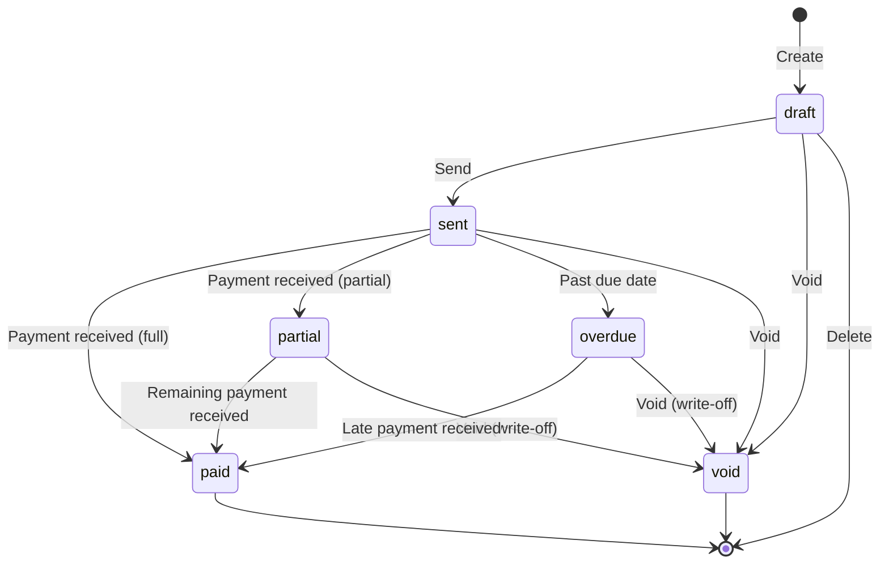
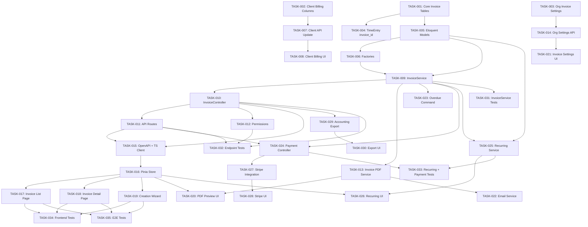

# PRD: Invoicing System for Solidtime

Generated: 2026-02-06
Version: 1.0

---

## Table of Contents

1. [Source Context & Problem Statement](#1-source-context--problem-statement)
2. [Technical Interpretation](#2-technical-interpretation)
3. [Functional Specifications](#3-functional-specifications)
4. [Technical Requirements & Constraints](#4-technical-requirements--constraints)
5. [User Stories with Acceptance Criteria](#5-user-stories-with-acceptance-criteria)
6. [Task Breakdown Structure](#6-task-breakdown-structure)
7. [Dependencies & Integration Points](#7-dependencies--integration-points)
8. [Risk Assessment & Mitigation](#8-risk-assessment--mitigation)
9. [Testing & Validation Requirements](#9-testing--validation-requirements)
10. [Monitoring & Observability](#10-monitoring--observability)
11. [Success Metrics & Definition of Done](#11-success-metrics--definition-of-done)
12. [Technical Debt & Future Considerations](#12-technical-debt--future-considerations)
13. [Appendices](#13-appendices)

---

## Amendments (2026-02-06 Review)

> These amendments supersede conflicting content in the original PRD sections below.
> Reference: `.features/SHARED-FOUNDATIONS.md` and `.features/PRD-REVIEW-REPORT.md`

### AMD-01: Task ID Prefix
All task IDs in this PRD are now prefixed with `INV-`. E.g., TASK-001 becomes INV-001.

### AMD-02: Migration Timestamps (SF-03)
All migrations use date prefix `2026_03_04_`.

### AMD-03: Modular Permissions (SF-08)
Permissions are registered via `App\Permissions\InvoicePermissions::register()` instead of directly modifying `JetstreamServiceProvider`.

### AMD-04: Critical Path Reconciliation
The critical path is **100 hours** (per task assignments document), not 84 hours (per PRD body). The task assignments document is authoritative. The difference accounts for INV-019 (Invoice Creation Wizard) as a dependency of INV-035.

### AMD-05: TASK-012 Dependency Correction
INV-012 (Register Permissions) dependency is corrected. Permissions must be registered **before** the controller that checks them. The dependency should be: INV-012 depends on nothing (or FOUND-007 for modular permissions infrastructure). INV-010 (Controller) depends on INV-012.

### AMD-06: Merge TASK-011 into TASK-010
INV-011 (Register API Routes) is merged into INV-010 (InvoiceController). Route registration is typically done alongside controller creation. This removes one dependency chain link. Revised INV-010 effort: 14h (was 12h + 2h).

### AMD-07: Frontend Effort Adjustment
INV-018 (Invoice Detail/Edit Page) and INV-019 (Invoice Creation Wizard) are likely underestimated at 16h each. Architecture phase should validate these estimates and consider splitting into sub-tasks:
- INV-018a: Invoice detail view (read-only render, PDF preview) — 8h
- INV-018b: Invoice edit mode (editable line items, recalculation) — 10h
- INV-019a: Wizard step 1-2 (client/period selection, entry selection) — 8h
- INV-019b: Wizard step 3-4 (line item editing, preview/confirm) — 10h

### AMD-08: Sprint 2 Rebalancing
Sprint 2 has 56h backend work for a single dev. Move INV-013 (InvoiceNumberGenerator, 4h) to Sprint 1 (it has no dependencies on Sprint 2 tasks). Move INV-015 (PDF with Gotenberg, 8h) to Sprint 3 start. Revised:
- Sprint 2: ~44h backend (achievable)
- Sprint 3: absorbs INV-015

### AMD-09: Tax Handling Limitation
Single flat tax rate per line item is the V1 scope. Multi-rate taxation (VAT categories, compound taxes) is explicitly noted as technical debt for V2. This should be documented in the Data Model section.

### AMD-10: Web Route Registration
**New task: INV-036 — Register Inertia web routes for invoice pages**
- Add routes in `routes/web.php` for Invoice list, detail, and creation pages
- Effort: 1h / 1 SP
- Dependencies: INV-017 (Invoice List Page)
- Sprint: 4

### AMD-11: `amount_due_cents` Clarification
`amount_due_cents` is a **model accessor** (computed property), NOT a database column. It is calculated as `total_amount_cents - amount_paid_cents`. This must be documented clearly in the data model section to avoid confusion during implementation.

### AMD-12: `HasFactory` on InvoiceTemplate
The `InvoiceTemplate` model must include the `HasFactory` trait (was omitted from the model code snippet).

---

## 1. Source Context & Problem Statement

### Current State

Solidtime is an open-source time tracking application built with Laravel 11 + Vue 3 + TypeScript + Pinia + Inertia.js. The existing system provides:

- **Clients** (`App\Models\Client`): `id`, `name`, `organization_id`, `archived_at` -- basic client records with no billing address, tax ID, or payment terms.
- **Projects** (`App\Models\Project`): `id`, `name`, `color`, `organization_id`, `client_id`, `billable_rate` (int, cents per hour), `is_billable`, `estimated_time`, `spent_time`.
- **Time Entries** (`App\Models\TimeEntry`): `id`, `description`, `start`, `end`, `billable_rate` (computed, int cents/hr), `billable` (boolean), `user_id`, `member_id`, `organization_id`, `project_id`, `task_id`, `client_id`, `tags`.
- **Billable Rate Hierarchy** (`App\Service\BillableRateService`): Rates cascade as ProjectMember -> Project -> Member -> Organization.
- **Export** (`App\Service\Export\ExportService`, `TimeEntryController::indexExport`): PDF via Gotenberg, Excel via Maatwebsite, CSV via League\Csv. Gotenberg is already configured with basic auth support.
- **Report System** (`App\Models\Report`, `ReportController`): Filterable, aggregatable reports with shareable public links.
- **Permissions** (`App\Service\PermissionStore`): Role-based (Owner, Admin, Manager, Employee, Placeholder). Frontend already has `canViewInvoices()` checking `invoices:view` permission, and `isInvoicingActivated()` checking `has_invoicing_extension` page prop.
- **Navigation**: The sidebar in `AppLayout.vue` already contains a conditional "Invoices" navigation item gated by `isInvoicingActivated() && canViewInvoices()`.
- **Billing Contract** (`App\Service\BillingContract`): Extension point for premium features via `hasSubscription()` / `hasTrial()`.
- **Organization** (`App\Models\Organization`): Has `currency` (string, e.g., "USD"), `billable_rate`, formatting preferences (`number_format`, `currency_format`, `date_format`, `interval_format`, `time_format`).

### What Is Missing

There is no Invoice model, no invoice generation workflow, no invoice customization, no recurring invoicing, no payment tracking, no online payment integration, and no accounting system sync. The Client model lacks billing-critical fields such as address, tax ID, and payment terms.

### Business Problem

Users who track billable time in solidtime must currently export time data and manually create invoices in a separate tool. This workflow gap leads to:
- Manual data entry errors between time tracking and invoicing
- Lost revenue from unbilled time entries
- Inability to track payment status within the same tool
- No visibility into accounts receivable or outstanding balances
- Context switching between solidtime and external invoicing tools

### Feature Scope

| Sub-feature | ID | Priority |
|---|---|---|
| Invoice Generation from Billable Time | 7.1 | P0 |
| Invoice Customization (templates, branding, numbering) | 7.2 | P0 |
| Recurring Invoices | 7.3 | P1 |
| Online Payments (Stripe / PayPal) | 7.4 | P2 |
| Accounting Sync (QuickBooks / Xero export) | 7.4b | P2 |
| Progressive Billing (milestone-based) | 7.5 | P2 |

---

## 2. Technical Interpretation

### Business to Technical Translation

| Business Requirement | Technical Implementation |
|---|---|
| "Generate invoices from tracked time" | Query `time_entries` where `billable=true`, `end IS NOT NULL`, and not yet linked to an invoice; group by client/project; create `Invoice` + `InvoiceLine` records |
| "Customize invoice appearance" | `InvoiceTemplate` model with Blade templates, organization branding (logo, colors), configurable number format |
| "Automatic recurring invoices" | `RecurringInvoiceSchedule` model + Laravel scheduler command that creates draft invoices on cadence |
| "Accept online payments" | `InvoicePayment` model + Stripe/PayPal SDK integration with webhook handlers |
| "Export to QuickBooks/Xero" | Service classes generating QBO/Xero-compatible data exports (CSV, API) |
| "Bill by milestone/phase" | `InvoiceLine` supports manual line items alongside time-based lines; `Project` extended with milestone tracking |

### Architecture Decision: Module or Core?

The existing codebase already anticipates invoicing as an extension (`has_invoicing_extension` in `billing.ts`). This PRD designs invoicing as a **core feature with extension hooks** -- the base Invoice CRUD and PDF generation live in the main app, while online payments and accounting sync are implemented behind the `BillingContract` extension pattern. This matches the existing pattern where `BillingContract::hasSubscription()` gates premium features.

### Reusable Components Identified

| Component | Location | Reuse in Invoicing |
|---|---|---|
| Gotenberg PDF rendering | `TimeEntryController::indexExport` | Invoice PDF generation uses the same Gotenberg flow |
| `BillableRateService` | `app/Service/BillableRateService.php` | Rate calculation for invoice line items |
| `TimeEntryFilter` | `app/Service/TimeEntryFilter.php` | Filtering billable time entries for invoice generation |
| `ExportService` pattern | `app/Service/Export/ExportService.php` | Invoice CSV/Excel export follows the same Storage pattern |
| `BaseFormRequest` + money rules | `app/Http/Requests/V1/BaseFormRequest.php` | Validation for monetary amounts on invoice fields |
| `BaseResource` + date formatting | `app/Http/Resources/V1/BaseResource.php` | Consistent ISO 8601 date serialization |
| `PermissionStore` | `app/Service/PermissionStore.php` | Permission checking for invoice operations |
| `LocalizationService` | `app/Service/LocalizationService.php` | Number/currency formatting on invoices |
| Pinia store pattern | `resources/js/utils/useClients.ts` | `useInvoices.ts` follows identical pattern |

---

## 3. Functional Specifications

### 3.1 Core Requirements

#### REQ-001: Invoice Lifecycle Management

- **Priority**: P0
- **Description**: Users can create, view, edit, send, void, and delete invoices. Invoices follow a state machine: `draft` -> `sent` -> `paid` / `overdue` / `void`. Deletion is only allowed in `draft` status.
- **Edge Cases**:
  - Voiding a partially paid invoice: remaining balance is written off; a credit note record is created.
  - Editing a `sent` invoice: create a new revision; the old version is archived.
  - Deleting a `draft` invoice: time entries are unlinked and become available for future invoicing.
- **Error Scenarios**:
  - Attempting to delete a non-draft invoice returns 422 with explanation.
  - Attempting to send an invoice with zero line items returns 422.
  - Attempting to create an invoice for a client with no billing address returns 422 with guidance.

#### REQ-002: Invoice Generation from Billable Time

- **Priority**: P0
- **Description**: Users can select billable, completed (has `end`), uninvoiced time entries filtered by client, project, date range, member, and tags. The system generates a draft invoice with line items computed from those time entries. Each line item references the source time entries. Time entries are marked as invoiced (`invoice_id` foreign key on `time_entries`).
- **Edge Cases**:
  - Time entries spanning midnight: billed to the date of `start`.
  - Time entries with zero duration: excluded from invoice generation.
  - Rounding: configurable rounding (up/down/nearest) to 5/6/10/15/30/60 minute increments per organization settings (reuses existing `TimeEntryRoundingType`).
  - Multiple currencies: invoice currency follows organization currency; time entries from projects with different effective rates are aggregated correctly.
- **Error Scenarios**:
  - No billable time entries match filters: return empty preview with message.
  - Time entries already on another invoice: excluded with warning.

#### REQ-003: Invoice Line Items

- **Priority**: P0
- **Description**: Invoice line items can be auto-generated from time entries or manually added. Each line item has: description, quantity (hours or units), unit price (cents), amount (computed), tax rate (percentage), tax amount (computed). Line items support grouping by project, task, member, or date.
- **Edge Cases**:
  - Manual line items with no time entry reference (e.g., expenses, fixed fees).
  - Negative line items for discounts or credits.
  - Zero-quantity line items (informational lines).

#### REQ-004: Invoice PDF Generation

- **Priority**: P0
- **Description**: Generate professional PDF invoices using Gotenberg (already configured). PDFs use customizable Blade templates with organization branding.
- **Edge Cases**:
  - Very long invoices (100+ line items): proper pagination with running totals.
  - Special characters in descriptions: HTML entity encoding in Blade template.
  - Missing Gotenberg: graceful fallback to HTML preview (same pattern as existing `$debug` mode in `TimeEntryController`).

#### REQ-005: Invoice Customization & Templates

- **Priority**: P0
- **Description**: Organizations can configure: invoice number format (prefix, suffix, auto-increment), default payment terms (net days), default notes/terms text, logo upload, brand colors, language/locale for invoice text, tax configuration (default tax rate, tax number display).
- **Edge Cases**:
  - Changing number format mid-stream: new format applies only to new invoices; existing numbers preserved.
  - Multiple tax rates on a single invoice: each line item can override the default rate.

#### REQ-006: Recurring Invoices

- **Priority**: P1
- **Description**: Users can create recurring invoice schedules that auto-generate draft invoices on a cadence (weekly, bi-weekly, monthly, quarterly, annually). Recurring invoices can pull in billable time from the billing period or use fixed line items.
- **Edge Cases**:
  - No billable time in the period: generate invoice with only fixed items, or skip and notify.
  - Schedule overlapping with existing draft: do not duplicate; log and alert.
  - Organization time zone vs UTC: schedule runs in organization timezone context.

#### REQ-007: Online Payment Integration

- **Priority**: P2
- **Description**: Integration with Stripe and PayPal for online invoice payments. Invoices include a payment link. Payment webhooks update invoice status automatically.
- **Edge Cases**:
  - Partial payments: invoice remains `sent` until full amount received; `InvoicePayment` records track each payment.
  - Payment disputes/chargebacks: invoice status reverts to `sent`; event logged.
  - Currency conversion: payment processor handles conversion; we record the received amount in org currency.

#### REQ-008: Accounting Export

- **Priority**: P2
- **Description**: Export invoices in formats compatible with QuickBooks (IIF/CSV), Xero (CSV), and generic accounting CSV. Export includes invoice header, line items, payments, and tax breakdown.

#### REQ-009: Progressive / Milestone Billing

- **Priority**: P2
- **Description**: Projects can define milestones with estimated amounts. Invoices can bill a percentage or fixed amount against milestones. Progress is tracked and displayed on the project view.

### 3.2 User Workflows

#### Invoice Creation Flow

```
User navigates to Invoices page
    |
    v
Clicks "New Invoice" -> selects Client
    |
    v
System shows billable time entries for that client
(filtered by date range, project, member, tags)
    |
    v
User reviews time entries, adjusts grouping/rounding
    |
    v
User clicks "Generate Draft" -> Draft invoice created
    |
    v
User reviews invoice, edits line items/notes/dates
    |
    v
User clicks "Preview PDF" -> Gotenberg renders PDF
    |
    v
User clicks "Send" -> Invoice emailed to client
    |                   Status changes to "sent"
    v
Client receives email with PDF + optional payment link
    |
    v
Payment received -> Status changes to "paid"
(manual or via Stripe/PayPal webhook)
```

#### Invoice State Machine



### 3.3 Business Rules

- **Billable Rate Hierarchy**: Invoice line item rates follow the existing cascade: ProjectMember -> Project -> Member -> Organization (reuse `BillableRateService`).
- **Currency**: Invoices use the organization's currency (`Organization::$currency`). All monetary values stored as integers in cents.
- **Tax Calculation**: `line_amount = quantity_seconds / 3600 * unit_rate_cents`. `tax_amount = line_amount * tax_rate / 100`. `total = sum(line_amounts) + sum(tax_amounts)`.
- **Invoice Numbering**: Auto-incremented per organization. Format configurable (e.g., `INV-{YYYY}-{####}`). Numbers are immutable once assigned.
- **Due Date**: Calculated from issue date + organization's default payment terms (net days). Overridable per invoice.
- **Overdue Detection**: A scheduled Laravel command runs daily, transitioning `sent` invoices past their `due_date` to `overdue` status.
- **Access Control Matrix**:

| Action | Owner | Admin | Manager | Employee |
|---|---|---|---|---|
| View invoices | Yes | Yes | Yes (own clients) | No |
| Create invoices | Yes | Yes | Yes | No |
| Edit draft invoices | Yes | Yes | Yes (own) | No |
| Send invoices | Yes | Yes | No | No |
| Record payments | Yes | Yes | No | No |
| Void invoices | Yes | Yes | No | No |
| Delete draft invoices | Yes | Yes | Yes (own) | No |
| Configure templates/settings | Yes | Yes | No | No |
| Manage recurring schedules | Yes | Yes | No | No |

---

## 4. Technical Requirements & Constraints

### 4.1 System Architecture

```
                                  [Gotenberg]
                                      ^
                                      | HTML -> PDF
                                      |
[Vue 3 SPA] <--Inertia--> [Laravel API Controllers]
     |                           |            |
     v                           v            v
[Pinia Store]            [InvoiceService]  [InvoicePaymentService]
[useInvoices.ts]         [InvoicePdfService]  [RecurringInvoiceService]
                                |            |
                                v            v
                         [PostgreSQL]  [Stripe/PayPal SDK]
                         [S3/Local Storage]
```

### 4.2 New Data Models

#### Invoice

```php
/**
 * @property string $id                    UUID primary key
 * @property string $invoice_number        Unique per organization (e.g., "INV-2026-0001")
 * @property string $status                Enum: draft, sent, paid, overdue, partial, void
 * @property string $organization_id       FK to organizations
 * @property string $client_id             FK to clients
 * @property Carbon $issue_date            Date invoice was issued
 * @property Carbon $due_date              Date payment is due
 * @property Carbon|null $sent_at          When invoice was sent to client
 * @property Carbon|null $paid_at          When invoice was fully paid
 * @property int $subtotal_cents           Sum of line item amounts (before tax)
 * @property int $tax_total_cents          Sum of tax amounts
 * @property int $total_cents              subtotal + tax
 * @property int $amount_paid_cents        Total payments received
 * @property int $amount_due_cents         total - amount_paid (computed)
 * @property string $currency              ISO 4217 currency code (from organization)
 * @property string|null $notes            Freeform notes shown on invoice
 * @property string|null $terms            Payment terms text
 * @property string|null $reference        PO number or external reference
 * @property string|null $template_id      FK to invoice_templates (nullable = use org default)
 * @property jsonb|null $client_snapshot   Snapshot of client billing info at creation time
 * @property jsonb|null $organization_snapshot  Snapshot of org billing info at creation time
 * @property string|null $recurring_schedule_id  FK to recurring_invoice_schedules
 * @property Carbon|null $created_at
 * @property Carbon|null $updated_at
 */
```

#### InvoiceLine

```php
/**
 * @property string $id                    UUID primary key
 * @property string $invoice_id            FK to invoices
 * @property string|null $description      Line item description
 * @property string $type                  Enum: time, manual, discount, expense
 * @property int $quantity_seconds         Duration in seconds (for time-based lines)
 * @property float $quantity_hours         Computed: quantity_seconds / 3600
 * @property int $unit_rate_cents          Rate per hour in cents
 * @property int $amount_cents             Computed: (quantity_seconds / 3600) * unit_rate_cents
 * @property float $tax_rate               Tax rate percentage (e.g., 19.0)
 * @property int $tax_amount_cents         Computed: amount_cents * tax_rate / 100
 * @property int $sort_order               Display order on invoice
 * @property string|null $project_id       FK to projects (for grouping/reference)
 * @property string|null $task_id          FK to tasks (for grouping/reference)
 * @property jsonb|null $time_entry_ids    Array of time entry UUIDs linked to this line
 * @property Carbon|null $created_at
 * @property Carbon|null $updated_at
 */
```

#### InvoiceTemplate

```php
/**
 * @property string $id                    UUID primary key
 * @property string $organization_id       FK to organizations
 * @property string $name                  Template name (e.g., "Default", "Minimal")
 * @property string $blade_template        Blade template content for PDF body
 * @property string|null $header_template  Optional header Blade content
 * @property string|null $footer_template  Optional footer Blade content
 * @property jsonb $settings               Template-specific settings (colors, fonts, layout)
 * @property bool $is_default              Whether this is the org's default template
 * @property Carbon|null $created_at
 * @property Carbon|null $updated_at
 */
```

#### InvoicePayment

```php
/**
 * @property string $id                    UUID primary key
 * @property string $invoice_id            FK to invoices
 * @property int $amount_cents             Payment amount in cents
 * @property string $currency              ISO 4217 currency code
 * @property string $method                Enum: manual, stripe, paypal, bank_transfer, other
 * @property string|null $transaction_id   External payment processor transaction ID
 * @property string|null $notes            Payment notes
 * @property Carbon $payment_date          Date payment was received
 * @property jsonb|null $metadata          Additional data from payment processor
 * @property Carbon|null $created_at
 * @property Carbon|null $updated_at
 */
```

#### RecurringInvoiceSchedule

```php
/**
 * @property string $id                    UUID primary key
 * @property string $organization_id       FK to organizations
 * @property string $client_id             FK to clients
 * @property string $frequency             Enum: weekly, biweekly, monthly, quarterly, annually
 * @property Carbon $next_run_at           Next scheduled generation date
 * @property Carbon|null $last_run_at      Last time an invoice was generated
 * @property Carbon|null $ends_at          Optional end date for the schedule
 * @property bool $is_active               Whether the schedule is active
 * @property bool $include_billable_time   Whether to pull in billable time for the period
 * @property jsonb|null $fixed_line_items  Fixed line items to include on every invoice
 * @property jsonb|null $filters           Time entry filters (project_ids, member_ids, tag_ids)
 * @property string|null $template_id      FK to invoice_templates
 * @property string|null $notes            Default notes for generated invoices
 * @property string|null $terms            Default terms for generated invoices
 * @property Carbon|null $created_at
 * @property Carbon|null $updated_at
 */
```

#### Client Model Extension (existing table, new columns)

```php
// New columns added to `clients` table:
// @property string|null $billing_address     Multi-line billing address
// @property string|null $billing_city
// @property string|null $billing_state
// @property string|null $billing_postal_code
// @property string|null $billing_country     ISO 3166-1 alpha-2 country code
// @property string|null $tax_id              VAT number / Tax ID
// @property string|null $billing_email       Email for sending invoices (separate from contact)
// @property int|null    $payment_terms_days  Default net days for this client (overrides org default)
```

#### Organization Model Extension (existing table, new columns)

```php
// New columns added to `organizations` table:
// @property string|null $invoice_number_prefix    e.g., "INV-"
// @property string|null $invoice_number_suffix
// @property int         $invoice_next_number      Auto-increment counter (default 1)
// @property int         $default_payment_terms    Default net days (default 30)
// @property float|null  $default_tax_rate         Default tax rate percentage
// @property string|null $tax_id                   Organization tax ID / VAT number
// @property string|null $billing_address
// @property string|null $billing_city
// @property string|null $billing_state
// @property string|null $billing_postal_code
// @property string|null $billing_country
// @property string|null $billing_email            Organization's billing email (from address)
// @property string|null $logo_path                Path to uploaded logo in storage
```

#### TimeEntry Model Extension (existing table, new column)

```php
// New column added to `time_entries` table:
// @property string|null $invoice_id    FK to invoices (null = not yet invoiced)
```

### 4.3 API Contracts

All endpoints follow the existing pattern: `Route::name('v1.{feature}.')->prefix('/organizations/{organization}')->group(...)` with `check-organization-blocked` middleware on write operations.

#### Invoice Endpoints

```yaml
# List invoices
GET /api/v1/organizations/{organization}/invoices
  Query Parameters:
    status: string (draft|sent|paid|overdue|partial|void) - optional filter
    client_id: uuid - optional filter
    start: datetime (ISO 8601) - issue_date >= start
    end: datetime (ISO 8601) - issue_date <= end
  Response: 200 OK
    { data: Invoice[], links: PaginationLinks, meta: PaginationMeta }
  Permissions: invoices:view

# Get single invoice
GET /api/v1/organizations/{organization}/invoices/{invoice}
  Response: 200 OK
    { data: InvoiceDetailed }  (includes line_items, payments, client)
  Permissions: invoices:view

# Preview invoice from time entries (before creation)
POST /api/v1/organizations/{organization}/invoices/preview
  Request Body:
    client_id: uuid (required)
    project_ids: uuid[] (optional)
    member_ids: uuid[] (optional)
    tag_ids: uuid[] (optional)
    start: datetime (required)
    end: datetime (required)
    group_by: string (project|task|member|date) (optional, default: project)
    rounding_type: string (optional)
    rounding_minutes: int (optional)
  Response: 200 OK
    { data: InvoicePreview }  (line items, totals, time entry count)
  Permissions: invoices:create

# Create invoice (from preview or manual)
POST /api/v1/organizations/{organization}/invoices
  Request Body:
    client_id: uuid (required)
    issue_date: date (required)
    due_date: date (required)
    notes: string (optional)
    terms: string (optional)
    reference: string (optional)
    template_id: uuid (optional)
    line_items: LineItemInput[] (required, min 1)
      - description: string
      - type: string (time|manual|discount|expense)
      - quantity_seconds: int (required for type=time)
      - unit_rate_cents: int
      - tax_rate: float
      - sort_order: int
      - project_id: uuid (optional)
      - task_id: uuid (optional)
      - time_entry_ids: uuid[] (optional, for type=time)
    time_entry_ids: uuid[] (optional - bulk link time entries)
  Response: 201 Created
    { data: InvoiceDetailed }
  Permissions: invoices:create
  Middleware: check-organization-blocked

# Update invoice (draft only for most fields)
PUT /api/v1/organizations/{organization}/invoices/{invoice}
  Request Body: (all optional)
    issue_date: date
    due_date: date
    notes: string
    terms: string
    reference: string
    template_id: uuid
    line_items: LineItemInput[] (full replacement)
  Response: 200 OK
    { data: InvoiceDetailed }
  Permissions: invoices:update
  Middleware: check-organization-blocked
  Constraint: Status must be "draft" for line_items changes

# Send invoice
POST /api/v1/organizations/{organization}/invoices/{invoice}/send
  Request Body:
    recipient_email: string (optional, defaults to client billing_email)
    message: string (optional, custom email message)
  Response: 200 OK
    { data: InvoiceDetailed }
  Permissions: invoices:send
  Middleware: check-organization-blocked
  Constraint: Status must be "draft"

# Download invoice PDF
GET /api/v1/organizations/{organization}/invoices/{invoice}/pdf
  Query Parameters:
    debug: boolean (optional, returns raw HTML instead of PDF)
  Response: 200 OK
    { download_url: string }
  Permissions: invoices:view

# Void invoice
POST /api/v1/organizations/{organization}/invoices/{invoice}/void
  Request Body:
    reason: string (optional)
  Response: 200 OK
    { data: InvoiceDetailed }
  Permissions: invoices:void
  Middleware: check-organization-blocked
  Constraint: Status must be "sent", "overdue", or "partial"

# Delete invoice
DELETE /api/v1/organizations/{organization}/invoices/{invoice}
  Response: 204 No Content
  Permissions: invoices:delete
  Constraint: Status must be "draft"

# Record payment
POST /api/v1/organizations/{organization}/invoices/{invoice}/payments
  Request Body:
    amount_cents: int (required)
    method: string (manual|bank_transfer|other) (required)
    payment_date: date (required)
    notes: string (optional)
  Response: 201 Created
    { data: InvoicePayment }
  Permissions: invoices:payments:create
  Middleware: check-organization-blocked

# List payments for an invoice
GET /api/v1/organizations/{organization}/invoices/{invoice}/payments
  Response: 200 OK
    { data: InvoicePayment[] }
  Permissions: invoices:view
```

#### Invoice Template Endpoints

```yaml
# List templates
GET /api/v1/organizations/{organization}/invoice-templates
  Response: 200 OK
    { data: InvoiceTemplate[] }
  Permissions: invoices:settings

# Create template
POST /api/v1/organizations/{organization}/invoice-templates
  Response: 201 Created
  Permissions: invoices:settings

# Update template
PUT /api/v1/organizations/{organization}/invoice-templates/{invoiceTemplate}
  Response: 200 OK
  Permissions: invoices:settings

# Delete template
DELETE /api/v1/organizations/{organization}/invoice-templates/{invoiceTemplate}
  Response: 204 No Content
  Permissions: invoices:settings
  Constraint: Cannot delete if it is the only template
```

#### Recurring Invoice Schedule Endpoints

```yaml
# List schedules
GET /api/v1/organizations/{organization}/recurring-invoice-schedules
  Response: 200 OK
  Permissions: invoices:recurring:view

# Create schedule
POST /api/v1/organizations/{organization}/recurring-invoice-schedules
  Response: 201 Created
  Permissions: invoices:recurring:create

# Update schedule
PUT /api/v1/organizations/{organization}/recurring-invoice-schedules/{schedule}
  Response: 200 OK
  Permissions: invoices:recurring:update

# Delete schedule
DELETE /api/v1/organizations/{organization}/recurring-invoice-schedules/{schedule}
  Response: 204 No Content
  Permissions: invoices:recurring:delete

# Pause/Resume schedule
POST /api/v1/organizations/{organization}/recurring-invoice-schedules/{schedule}/toggle
  Response: 200 OK
  Permissions: invoices:recurring:update
```

### 4.4 Performance Requirements

- **Invoice List**: 95th percentile response time < 300ms for organizations with up to 10,000 invoices
- **Invoice Preview** (time entry aggregation): < 2s for up to 50,000 time entries
- **PDF Generation**: < 5s per invoice (Gotenberg rendering)
- **Concurrent Users**: Support 100 simultaneous invoice operations per organization
- **Data Volume**: Support organizations with 100,000+ time entries and 10,000+ invoices

### 4.5 Security Requirements

- **Authentication**: Laravel Passport API tokens (existing)
- **Authorization**: Permission-based via `PermissionStore` (existing pattern)
- **Data Isolation**: All queries scoped to `organization_id` via route model binding (existing pattern)
- **Client Snapshots**: Invoice stores a JSON snapshot of client/org billing info at creation time to preserve historical accuracy
- **Payment Data**: No raw credit card data stored; delegated to Stripe/PayPal
- **Audit Trail**: All invoice state changes logged via existing `CustomAuditable` trait
- **PDF Storage**: Generated PDFs stored in private disk with temporary signed URLs (existing `Storage::temporaryUrl` pattern)

---

## 5. User Stories with Acceptance Criteria

### USR-001: View Invoice List

**As a** manager or admin
**I want to** see a list of all invoices for my organization
**So that** I can track billing status across clients

**Priority**: P0
**Effort**: 3 story points
**Sprint**: 1

**Acceptance Criteria**:
- [ ] Invoice list page displays at `/invoices` route
- [ ] Table shows: invoice number, client name, issue date, due date, total, status, amount paid, amount due
- [ ] Status shown with color-coded badges (draft=gray, sent=blue, paid=green, overdue=red, partial=yellow, void=strikethrough)
- [ ] Filterable by status, client, and date range
- [ ] Sortable by date, amount, status
- [ ] Paginated with default page size matching `config('app.pagination_per_page_default')`
- [ ] Clicking an invoice navigates to detail view
- [ ] "New Invoice" button visible for users with `invoices:create` permission

### USR-002: Create Invoice from Billable Time

**As an** admin or manager
**I want to** select billable time entries and generate a draft invoice
**So that** I can bill my clients for tracked work

**Priority**: P0
**Effort**: 8 story points
**Sprint**: 1-2

**Acceptance Criteria**:
- [ ] "New Invoice" flow starts with client selection
- [ ] After selecting client, shows filterable list of unbilled billable time entries for that client
- [ ] Filters available: date range, project, member, tags
- [ ] Grouping options: by project, by task, by member, by date
- [ ] Preview shows calculated line items with quantities (hours), rates, and amounts
- [ ] Rounding options available (matching existing `TimeEntryRoundingType` enum)
- [ ] User can add/remove/edit line items before finalizing
- [ ] User can add manual line items (expenses, fixed fees, discounts)
- [ ] "Create Draft" generates the invoice, links time entries, and redirects to invoice detail
- [ ] Time entries linked to the invoice are no longer shown as "unbilled"
- [ ] Invoice number auto-generated per organization's numbering settings

### USR-003: Edit Draft Invoice

**As an** admin or manager
**I want to** edit a draft invoice's details and line items
**So that** I can correct or adjust before sending

**Priority**: P0
**Effort**: 5 story points
**Sprint**: 2

**Acceptance Criteria**:
- [ ] Edit mode available only for invoices in `draft` status
- [ ] Can edit: issue date, due date, notes, terms, reference, template
- [ ] Can add, remove, and reorder line items
- [ ] Can modify line item description, quantity, rate, tax rate
- [ ] Subtotal, tax, and total recalculate in real-time
- [ ] Save persists all changes atomically
- [ ] Attempting to edit a non-draft invoice shows appropriate error message

### USR-004: Preview and Download Invoice PDF

**As a** user with invoice view permission
**I want to** preview and download a professional PDF of any invoice
**So that** I can review it or share it manually

**Priority**: P0
**Effort**: 5 story points
**Sprint**: 2

**Acceptance Criteria**:
- [ ] "Preview PDF" button available on invoice detail page
- [ ] PDF opens in a new tab or downloads
- [ ] PDF includes: organization logo, organization billing info, client billing info, invoice number, dates, line items with description/qty/rate/amount, subtotal, tax breakdown, total, notes, terms
- [ ] PDF uses the assigned template or organization default
- [ ] PDF renders correctly for invoices with 1-100+ line items
- [ ] If Gotenberg is not configured, show HTML preview with warning

### USR-005: Send Invoice to Client

**As an** admin
**I want to** send an invoice via email to the client
**So that** the client receives the invoice and can pay

**Priority**: P0
**Effort**: 5 story points
**Sprint**: 3

**Acceptance Criteria**:
- [ ] "Send" button available on draft invoices
- [ ] Sends email with PDF attachment to client's billing email
- [ ] Email includes customizable message body
- [ ] Invoice status changes from `draft` to `sent`
- [ ] `sent_at` timestamp recorded
- [ ] Confirmation notification shown to user
- [ ] Cannot send an invoice with no line items
- [ ] Cannot send an invoice to a client with no billing email

### USR-006: Record Manual Payment

**As an** admin
**I want to** record a payment received against an invoice
**So that** I can track payment status

**Priority**: P0
**Effort**: 3 story points
**Sprint**: 3

**Acceptance Criteria**:
- [ ] "Record Payment" button on sent/overdue/partial invoices
- [ ] Payment form: amount, date, method (manual/bank transfer/other), notes
- [ ] Amount defaults to amount due
- [ ] After recording full payment, invoice status changes to `paid` with `paid_at` set
- [ ] After recording partial payment, invoice status changes to `partial`
- [ ] Amount due updates correctly
- [ ] Payment history visible on invoice detail page
- [ ] Cannot record payment exceeding amount due (validation error)

### USR-007: Void Invoice

**As an** admin
**I want to** void a sent or overdue invoice
**So that** I can cancel it without deleting the record

**Priority**: P0
**Effort**: 2 story points
**Sprint**: 3

**Acceptance Criteria**:
- [ ] "Void" action available on sent, overdue, and partial invoices
- [ ] Requires confirmation dialog
- [ ] Optional reason text field
- [ ] Status changes to `void`
- [ ] Linked time entries are unlinked (available for re-invoicing)
- [ ] Voided invoice remains in list but is clearly marked
- [ ] Cannot void a draft invoice (use delete instead)

### USR-008: Configure Invoice Settings

**As an** organization owner or admin
**I want to** configure invoice numbering, default terms, and branding
**So that** generated invoices match my business requirements

**Priority**: P0
**Effort**: 5 story points
**Sprint**: 2

**Acceptance Criteria**:
- [ ] Settings page accessible from organization settings
- [ ] Configure: invoice number prefix, next number, default payment terms (net days)
- [ ] Configure: default tax rate, tax ID display
- [ ] Configure: organization billing address, city, state, postal code, country
- [ ] Configure: billing email (from address for invoice emails)
- [ ] Upload organization logo (stored in private storage)
- [ ] Configure: default invoice notes and terms text
- [ ] Preview shows how invoice number will look (e.g., "INV-2026-0042")
- [ ] Changes do not affect existing invoices

### USR-009: Client Billing Details

**As an** admin or manager
**I want to** add billing address and tax ID to client records
**So that** invoices contain correct billing information

**Priority**: P0
**Effort**: 3 story points
**Sprint**: 1

**Acceptance Criteria**:
- [ ] Client edit form extended with billing section
- [ ] Fields: billing address, city, state/province, postal code, country, tax ID, billing email, default payment terms
- [ ] Country is a dropdown with ISO 3166-1 alpha-2 codes
- [ ] Billing email is validated as email format
- [ ] Payment terms in days (integer, min 0)
- [ ] Existing client data is preserved (new fields default to null)

### USR-010: Create and Manage Recurring Invoice Schedules

**As an** admin
**I want to** set up automatic recurring invoices for clients
**So that** regular billing happens without manual work

**Priority**: P1
**Effort**: 8 story points
**Sprint**: 4

**Acceptance Criteria**:
- [ ] Recurring schedules page accessible from invoices section
- [ ] Create schedule: select client, frequency, start date, optional end date
- [ ] Option to include billable time from period or use fixed line items
- [ ] Can filter time entries by project, member, tags
- [ ] Scheduler generates draft invoices automatically at the cadence
- [ ] Generated invoices appear in invoice list with "recurring" badge
- [ ] Can pause/resume a schedule
- [ ] Can edit or delete a schedule
- [ ] Dashboard notification when a recurring invoice is generated

### USR-011: Online Payment via Stripe

**As a** client receiving an invoice
**I want to** click a payment link and pay online
**So that** I can pay quickly without manual bank transfers

**Priority**: P2
**Effort**: 13 story points
**Sprint**: 5-6

**Acceptance Criteria**:
- [ ] Invoice email includes "Pay Now" link (when Stripe is configured)
- [ ] Link opens a Stripe Checkout session for the invoice amount
- [ ] Successful payment triggers webhook that records `InvoicePayment` and updates invoice status
- [ ] Payment appears in invoice payment history
- [ ] Supports partial payments (customer can modify amount in checkout)
- [ ] Failed/expired payment sessions do not affect invoice status
- [ ] Stripe Connect configuration in organization settings

### USR-012: Accounting Export

**As an** admin
**I want to** export invoices in accounting-software-compatible formats
**So that** I can import them into QuickBooks or Xero

**Priority**: P2
**Effort**: 5 story points
**Sprint**: 6

**Acceptance Criteria**:
- [ ] Export button on invoices list page
- [ ] Format options: CSV (generic), QuickBooks IIF, Xero CSV
- [ ] Export includes: invoice header, line items, tax breakdown, payment records
- [ ] Date range filter for export
- [ ] Downloaded as a file via temporary signed URL (existing pattern)

---

## 6. Task Breakdown Structure

### Phase 1: Foundation (Sprint 1 -- Weeks 1-2)

---

#### TASK-001: Database Migrations -- Core Invoice Tables

**Type**: Backend
**Effort**: 8 hours (3 SP)
**Dependencies**: None

**Description**: Create database migrations for the core invoicing schema.

**Files to create**:
- `database/migrations/{timestamp}_create_invoices_table.php`
- `database/migrations/{timestamp}_create_invoice_lines_table.php`
- `database/migrations/{timestamp}_create_invoice_payments_table.php`
- `database/migrations/{timestamp}_create_invoice_templates_table.php`
- `database/migrations/{timestamp}_create_recurring_invoice_schedules_table.php`

**SQL Schema** (represented as Laravel migration):
```php
// invoices table
Schema::create('invoices', function (Blueprint $table): void {
    $table->uuid('id')->primary();
    $table->string('invoice_number', 50);
    $table->string('status', 20)->default('draft')->index();
    $table->uuid('organization_id');
    $table->uuid('client_id');
    $table->date('issue_date');
    $table->date('due_date');
    $table->dateTime('sent_at')->nullable();
    $table->dateTime('paid_at')->nullable();
    $table->bigInteger('subtotal_cents')->default(0);
    $table->bigInteger('tax_total_cents')->default(0);
    $table->bigInteger('total_cents')->default(0);
    $table->bigInteger('amount_paid_cents')->default(0);
    $table->string('currency', 3);
    $table->text('notes')->nullable();
    $table->text('terms')->nullable();
    $table->string('reference', 255)->nullable();
    $table->uuid('template_id')->nullable();
    $table->jsonb('client_snapshot')->nullable();
    $table->jsonb('organization_snapshot')->nullable();
    $table->uuid('recurring_schedule_id')->nullable();
    $table->string('void_reason')->nullable();
    $table->timestamps();

    $table->foreign('organization_id')->references('id')->on('organizations')->restrictOnDelete();
    $table->foreign('client_id')->references('id')->on('clients')->restrictOnDelete();
    $table->unique(['organization_id', 'invoice_number']);
    $table->index(['organization_id', 'status']);
    $table->index(['organization_id', 'client_id']);
    $table->index(['organization_id', 'issue_date']);
});
```

**Acceptance Criteria**:
- [ ] All five migrations run without errors on PostgreSQL
- [ ] Rollback (`down()`) drops all tables cleanly
- [ ] Foreign key constraints reference existing tables correctly
- [ ] Index strategy covers primary query patterns (list by org+status, list by org+client)

---

#### TASK-002: Database Migration -- Extend Clients Table

**Type**: Backend
**Effort**: 4 hours (2 SP)
**Dependencies**: None

**Description**: Add billing-related columns to the existing `clients` table.

**Files to create**:
- `database/migrations/{timestamp}_add_billing_columns_to_clients_table.php`

**Migration details**:
```php
Schema::table('clients', function (Blueprint $table): void {
    $table->text('billing_address')->nullable();
    $table->string('billing_city', 100)->nullable();
    $table->string('billing_state', 100)->nullable();
    $table->string('billing_postal_code', 20)->nullable();
    $table->string('billing_country', 2)->nullable();  // ISO 3166-1 alpha-2
    $table->string('tax_id', 50)->nullable();
    $table->string('billing_email', 255)->nullable();
    $table->integer('payment_terms_days')->nullable();
});
```

**Acceptance Criteria**:
- [ ] Migration runs without affecting existing client data
- [ ] All new columns are nullable
- [ ] Rollback drops the new columns

---

#### TASK-003: Database Migration -- Extend Organizations Table

**Type**: Backend
**Effort**: 4 hours (2 SP)
**Dependencies**: None

**Description**: Add invoice configuration columns to the existing `organizations` table.

**Files to create**:
- `database/migrations/{timestamp}_add_invoice_settings_to_organizations_table.php`

**Migration details**:
```php
Schema::table('organizations', function (Blueprint $table): void {
    $table->string('invoice_number_prefix', 20)->nullable();
    $table->string('invoice_number_suffix', 20)->nullable();
    $table->integer('invoice_next_number')->default(1);
    $table->integer('default_payment_terms')->default(30);
    $table->decimal('default_tax_rate', 5, 2)->nullable();
    $table->string('tax_id', 50)->nullable();
    $table->text('billing_address')->nullable();
    $table->string('billing_city', 100)->nullable();
    $table->string('billing_state', 100)->nullable();
    $table->string('billing_postal_code', 20)->nullable();
    $table->string('billing_country', 2)->nullable();
    $table->string('billing_email', 255)->nullable();
    $table->string('logo_path', 500)->nullable();
    $table->text('default_invoice_notes')->nullable();
    $table->text('default_invoice_terms')->nullable();
});
```

**Acceptance Criteria**:
- [ ] Migration runs without affecting existing organization data
- [ ] `invoice_next_number` defaults to 1
- [ ] `default_payment_terms` defaults to 30

---

#### TASK-004: Database Migration -- Add invoice_id to Time Entries

**Type**: Backend
**Effort**: 2 hours (1 SP)
**Dependencies**: [TASK-001]

**Description**: Add `invoice_id` nullable foreign key to the `time_entries` table.

**Files to create**:
- `database/migrations/{timestamp}_add_invoice_id_to_time_entries_table.php`

**Migration details**:
```php
Schema::table('time_entries', function (Blueprint $table): void {
    $table->uuid('invoice_id')->nullable()->index();
    $table->foreign('invoice_id')->references('id')->on('invoices')->nullOnDelete();
});
```

**Acceptance Criteria**:
- [ ] Existing time entries unaffected (all have `invoice_id = null`)
- [ ] Deleting an invoice sets linked time entries `invoice_id` to null (`nullOnDelete`)
- [ ] Index on `invoice_id` for efficient queries

---

#### TASK-005: Eloquent Models -- Invoice, InvoiceLine, InvoicePayment, InvoiceTemplate

**Type**: Backend
**Effort**: 8 hours (3 SP)
**Dependencies**: [TASK-001]

**Description**: Create Eloquent models with proper relationships, casts, and traits.

**Files to create**:
- `app/Models/Invoice.php`
- `app/Models/InvoiceLine.php`
- `app/Models/InvoicePayment.php`
- `app/Models/InvoiceTemplate.php`
- `app/Models/RecurringInvoiceSchedule.php`
- `app/Enums/InvoiceStatus.php`
- `app/Enums/InvoiceLineType.php`
- `app/Enums/PaymentMethod.php`
- `app/Enums/RecurringFrequency.php`

**Implementation pattern** (following existing model conventions):
```php
// app/Models/Invoice.php
declare(strict_types=1);

namespace App\Models;

use App\Enums\InvoiceStatus;
use App\Models\Concerns\CustomAuditable;
use App\Models\Concerns\HasUuids;
// ... (see data model in section 4.2)

class Invoice extends Model implements AuditableContract
{
    use CustomAuditable;
    use HasFactory;
    use HasUuids;

    protected $casts = [
        'issue_date' => 'date',
        'due_date' => 'date',
        'sent_at' => 'datetime',
        'paid_at' => 'datetime',
        'status' => InvoiceStatus::class,
        'subtotal_cents' => 'integer',
        'tax_total_cents' => 'integer',
        'total_cents' => 'integer',
        'amount_paid_cents' => 'integer',
        'client_snapshot' => 'array',
        'organization_snapshot' => 'array',
    ];

    // Relationships: organization(), client(), lines(), payments(), template(), recurringSchedule()
    // Scopes: scopeForOrganization(), scopeByStatus(), scopeOverdue()
    // Computed: getAmountDueCentsAttribute()
}
```

**Acceptance Criteria**:
- [ ] All models follow existing patterns (`declare(strict_types=1)`, `HasUuids`, `CustomAuditable`)
- [ ] Relationships defined with proper PHPDoc type hints
- [ ] Enums created for status, line type, payment method, frequency
- [ ] Model factories created for each model
- [ ] All models belong to organization (for data isolation)

---

#### TASK-006: Model Factories and Seeders

**Type**: Backend
**Effort**: 6 hours (2 SP)
**Dependencies**: [TASK-005]

**Description**: Create factories for all new models to support testing.

**Files to create**:
- `database/factories/InvoiceFactory.php`
- `database/factories/InvoiceLineFactory.php`
- `database/factories/InvoicePaymentFactory.php`
- `database/factories/InvoiceTemplateFactory.php`
- `database/factories/RecurringInvoiceScheduleFactory.php`

**Acceptance Criteria**:
- [ ] Factories create valid model instances with realistic data
- [ ] Support common states: `draft()`, `sent()`, `paid()`, `overdue()`, `void()`
- [ ] Support relationship chaining: `forOrganization()`, `forClient()`, `forInvoice()`
- [ ] Follow existing factory patterns (see `ReportFactory`, `ClientFactory`)

---

#### TASK-007: Client Billing Fields -- Backend API

**Type**: Backend
**Effort**: 4 hours (2 SP)
**Dependencies**: [TASK-002]

**Description**: Extend `ClientController` and request validation to support billing fields.

**Files to modify**:
- `app/Http/Controllers/Api/V1/ClientController.php` -- update `store()` and `update()` methods
- `app/Http/Requests/V1/Client/ClientStoreRequest.php` -- add billing field validation
- `app/Http/Requests/V1/Client/ClientUpdateRequest.php` -- add billing field validation
- `app/Http/Resources/V1/Client/ClientResource.php` -- include billing fields in response
- `app/Models/Client.php` -- add casts for new columns

**Acceptance Criteria**:
- [ ] Client create/update accepts billing fields
- [ ] Validation: `billing_country` is 2-char ISO code, `billing_email` is valid email, `payment_terms_days` is positive integer
- [ ] Client API response includes all billing fields
- [ ] Existing client tests still pass

---

#### TASK-008: Client Billing Fields -- Frontend UI

**Type**: Frontend
**Effort**: 6 hours (2 SP)
**Dependencies**: [TASK-007]

**Description**: Extend client create/edit forms with billing section.

**Files to modify**:
- Client create/edit dialog component (extend existing)
- `resources/js/packages/api/src` -- update generated TypeScript types

**Files to create**:
- `resources/js/packages/ui/src/Client/ClientBillingForm.vue`

**Acceptance Criteria**:
- [ ] Billing section visible in client create/edit dialog
- [ ] Country dropdown with ISO 3166-1 alpha-2 codes and country names
- [ ] Email validation on billing_email field
- [ ] All fields optional, save works with partial data
- [ ] TypeScript types updated to reflect new fields

---

### Phase 2: Core Invoice CRUD (Sprint 2 -- Weeks 3-4)

---

#### TASK-009: InvoiceService -- Core Business Logic

**Type**: Backend
**Effort**: 16 hours (5 SP)
**Dependencies**: [TASK-005, TASK-006]

**Description**: Create the central `InvoiceService` class handling invoice creation, line item calculation, status transitions, and number generation.

**Files to create**:
- `app/Service/InvoiceService.php`
- `app/Service/Dto/InvoicePreviewDto.php`
- `app/Service/Dto/InvoiceLineItemDto.php`

**Key methods**:
```php
class InvoiceService
{
    public function generateInvoiceNumber(Organization $organization): string;
    public function previewFromTimeEntries(Organization $org, Client $client, array $filters, string $groupBy): InvoicePreviewDto;
    public function createInvoice(Organization $org, array $data): Invoice;
    public function updateInvoice(Invoice $invoice, array $data): Invoice;
    public function recalculateTotals(Invoice $invoice): void;
    public function sendInvoice(Invoice $invoice, ?string $recipientEmail, ?string $message): void;
    public function voidInvoice(Invoice $invoice, ?string $reason): void;
    public function transitionToOverdue(): int; // Scheduled command
    public function linkTimeEntries(Invoice $invoice, array $timeEntryIds): void;
    public function unlinkTimeEntries(Invoice $invoice): void;
    public function snapshotClientInfo(Client $client): array;
    public function snapshotOrganizationInfo(Organization $organization): array;
}
```

**Acceptance Criteria**:
- [ ] Invoice number generation is atomic (uses DB lock to prevent duplicates)
- [ ] Number format: `{prefix}{padded_number}{suffix}` (e.g., "INV-0001")
- [ ] `previewFromTimeEntries` uses `TimeEntryFilter` to query and `BillableRateService` for rates
- [ ] `createInvoice` creates invoice + line items in a DB transaction
- [ ] `sendInvoice` validates status is `draft`, transitions to `sent`
- [ ] `voidInvoice` unlinks time entries (sets `time_entries.invoice_id = null`)
- [ ] `recalculateTotals` computes `subtotal_cents`, `tax_total_cents`, `total_cents` from line items
- [ ] All state transitions follow the state machine diagram
- [ ] Client and organization snapshots captured at invoice creation

---

#### TASK-010: InvoiceController -- API Endpoints

**Type**: Backend
**Effort**: 12 hours (5 SP)
**Dependencies**: [TASK-009]

**Description**: Create the REST API controller for invoice operations.

**Files to create**:
- `app/Http/Controllers/Api/V1/InvoiceController.php`
- `app/Http/Requests/V1/Invoice/InvoiceIndexRequest.php`
- `app/Http/Requests/V1/Invoice/InvoiceStoreRequest.php`
- `app/Http/Requests/V1/Invoice/InvoiceUpdateRequest.php`
- `app/Http/Requests/V1/Invoice/InvoicePreviewRequest.php`
- `app/Http/Requests/V1/Invoice/InvoiceSendRequest.php`
- `app/Http/Requests/V1/Invoice/InvoiceVoidRequest.php`
- `app/Http/Resources/V1/Invoice/InvoiceResource.php`
- `app/Http/Resources/V1/Invoice/InvoiceDetailedResource.php`
- `app/Http/Resources/V1/Invoice/InvoiceCollection.php`
- `app/Http/Resources/V1/Invoice/InvoiceLineResource.php`
- `app/Http/Resources/V1/Invoice/InvoicePreviewResource.php`

**Pattern** (following `ClientController` / `ReportController`):
```php
class InvoiceController extends Controller
{
    protected function checkPermission(Organization $organization, string $permission, ?Invoice $invoice = null): void
    {
        parent::checkPermission($organization, $permission);
        if ($invoice !== null && $invoice->organization_id !== $organization->getKey()) {
            throw new AuthorizationException('Invoice does not belong to organization');
        }
    }

    // index(), show(), preview(), store(), update(), send(), void(), destroy()
    // pdf() -- uses Gotenberg
}
```

**Acceptance Criteria**:
- [ ] All endpoints follow existing API conventions (route naming, JSON responses, error handling)
- [ ] Organization scoping enforced on all operations
- [ ] Permission checks match access control matrix from section 3.3
- [ ] Request validation classes extend `BaseFormRequest`, use `ExistsEloquent` for FK validation
- [ ] Resources extend `BaseResource`, use `formatDateTime()` / `formatDate()` helpers
- [ ] Status constraints enforced (e.g., cannot edit line items on sent invoice)

---

#### TASK-011: Invoice API Routes

**Type**: Backend
**Effort**: 2 hours (1 SP)
**Dependencies**: [TASK-010]

**Description**: Register invoice routes in `routes/api.php`.

**Files to modify**:
- `routes/api.php`

**Routes to add**:
```php
// Invoice routes
Route::name('invoices.')->prefix('/organizations/{organization}')->group(static function (): void {
    Route::get('/invoices', [InvoiceController::class, 'index'])->name('index');
    Route::get('/invoices/{invoice}', [InvoiceController::class, 'show'])->name('show');
    Route::post('/invoices/preview', [InvoiceController::class, 'preview'])->name('preview');
    Route::post('/invoices', [InvoiceController::class, 'store'])->name('store')->middleware('check-organization-blocked');
    Route::put('/invoices/{invoice}', [InvoiceController::class, 'update'])->name('update')->middleware('check-organization-blocked');
    Route::post('/invoices/{invoice}/send', [InvoiceController::class, 'send'])->name('send')->middleware('check-organization-blocked');
    Route::post('/invoices/{invoice}/void', [InvoiceController::class, 'void'])->name('void')->middleware('check-organization-blocked');
    Route::get('/invoices/{invoice}/pdf', [InvoiceController::class, 'pdf'])->name('pdf');
    Route::delete('/invoices/{invoice}', [InvoiceController::class, 'destroy'])->name('destroy');
});

// Invoice Payment routes
Route::name('invoice-payments.')->prefix('/organizations/{organization}')->group(static function (): void {
    Route::get('/invoices/{invoice}/payments', [InvoicePaymentController::class, 'index'])->name('index');
    Route::post('/invoices/{invoice}/payments', [InvoicePaymentController::class, 'store'])->name('store')->middleware('check-organization-blocked');
});
```

**Acceptance Criteria**:
- [ ] Route names follow `api.v1.invoices.{action}` convention
- [ ] Write endpoints have `check-organization-blocked` middleware
- [ ] All routes within `auth:api` + `verified` middleware group

---

#### TASK-012: Invoice Permissions Registration

**Type**: Backend
**Effort**: 4 hours (2 SP)
**Dependencies**: [TASK-010]

**Description**: Register invoice permissions in the Jetstream roles configuration.

**Files to modify**:
- `app/Providers/JetstreamServiceProvider.php` (or wherever roles are defined)
- `resources/js/utils/permissions.ts` -- add invoice permission helpers

**Permissions to register**:
```
invoices:view
invoices:create
invoices:update
invoices:send
invoices:void
invoices:delete
invoices:settings
invoices:payments:create
invoices:recurring:view
invoices:recurring:create
invoices:recurring:update
invoices:recurring:delete
```

**Role assignments**:
- Owner: all invoice permissions
- Admin: all invoice permissions
- Manager: `invoices:view`, `invoices:create`, `invoices:update`, `invoices:delete`
- Employee: none

**Acceptance Criteria**:
- [ ] Permissions registered and assigned to roles
- [ ] Frontend permission helpers updated
- [ ] `canViewInvoices()` (already exists) works correctly with new permissions

---

#### TASK-013: Invoice PDF Service (Gotenberg)

**Type**: Backend
**Effort**: 12 hours (5 SP)
**Dependencies**: [TASK-005, TASK-009]

**Description**: Create the PDF rendering service for invoices using Gotenberg, following the existing pattern in `TimeEntryController::indexExport`.

**Files to create**:
- `app/Service/InvoicePdfService.php`
- `resources/views/invoices/pdf.blade.php`
- `resources/views/invoices/pdf-footer.blade.php`

**Implementation pattern** (matching existing Gotenberg usage):
```php
class InvoicePdfService
{
    public function generatePdf(Invoice $invoice, bool $debug = false): string|array
    {
        $invoice->load(['lines', 'client', 'organization']);
        $template = $invoice->template ?? $this->getDefaultTemplate($invoice->organization);

        $html = Blade::render($template->blade_template ?? $this->getDefaultBladeContent(), [
            'invoice' => $invoice,
            'organization' => $invoice->organization,
            'client' => $invoice->client,
            'lines' => $invoice->lines()->orderBy('sort_order')->get(),
            'localization' => LocalizationService::forOrganization($invoice->organization),
            'snapshot' => $invoice->client_snapshot,
            'orgSnapshot' => $invoice->organization_snapshot,
        ]);

        if ($debug) {
            return ['html' => $html];
        }

        // Gotenberg rendering (same pattern as TimeEntryController)
        $client = new Client([...]);
        $request = Gotenberg::chromium(config('services.gotenberg.url'))
            ->pdf()
            ->assets(Stream::path(resource_path('pdf/Outfit-VariableFont_wght.ttf'), 'outfit.ttf'))
            ->margins(0.39, 0.78, 0.39, 0.39)
            ->paperSize('8.27', '11.7')
            ->footer(Stream::string('footer', $footerHtml))
            ->html(Stream::string('body', $html));

        // Save to private storage, return temporary URL
    }
}
```

**Blade template features**:
- Organization logo and billing address
- Client billing address
- Invoice number, dates, reference
- Line items table with description, qty (hours), rate, amount
- Subtotal, tax breakdown, total
- Notes and terms footer
- Professional typography using Outfit font (already available)

**Acceptance Criteria**:
- [ ] PDF matches professional invoice standards
- [ ] Renders correctly for 1-100+ line items with proper pagination
- [ ] Debug mode returns raw HTML (existing pattern)
- [ ] Falls back gracefully when Gotenberg is unavailable
- [ ] Uses organization's localization settings for number/currency formatting

---

#### TASK-014: Invoice Settings API & Organization Extension

**Type**: Backend
**Effort**: 6 hours (2 SP)
**Dependencies**: [TASK-003, TASK-005]

**Description**: Extend `OrganizationController` to expose invoice settings, or create a dedicated endpoint.

**Files to modify**:
- `app/Http/Controllers/Api/V1/OrganizationController.php` -- include invoice settings in org response
- `app/Http/Requests/V1/Organization/OrganizationUpdateRequest.php` -- add validation for new fields
- `app/Http/Resources/V1/Organization/OrganizationResource.php` -- include new fields
- `app/Models/Organization.php` -- add casts for new columns

**Acceptance Criteria**:
- [ ] Organization GET response includes all invoice settings
- [ ] Organization PUT accepts invoice settings updates
- [ ] Validation: `invoice_next_number` >= 1, `default_payment_terms` >= 0, `default_tax_rate` between 0-100
- [ ] Logo upload endpoint (or extend existing file upload if any)

---

#### TASK-015: OpenAPI Spec Update & TypeScript Client Regeneration

**Type**: Backend/Frontend
**Effort**: 4 hours (2 SP)
**Dependencies**: [TASK-010, TASK-011]

**Description**: Update OpenAPI specification to include all new invoice endpoints, and regenerate the TypeScript API client.

**Files to modify**:
- OpenAPI spec (auto-generated from controller annotations)
- `resources/js/packages/api/src` -- regenerated client

**Acceptance Criteria**:
- [ ] All invoice endpoints documented in OpenAPI spec
- [ ] TypeScript types generated for Invoice, InvoiceLine, InvoicePayment, etc.
- [ ] API client methods available for all CRUD operations

---

### Phase 3: Frontend Invoice UI (Sprint 3 -- Weeks 5-6)

---

#### TASK-016: Invoice Pinia Store

**Type**: Frontend
**Effort**: 8 hours (3 SP)
**Dependencies**: [TASK-015]

**Description**: Create the invoice Pinia store following the `useClients.ts` pattern.

**Files to create**:
- `resources/js/utils/useInvoices.ts`

**Implementation pattern**:
```typescript
export const useInvoicesStore = defineStore('invoices', () => {
    const invoiceResponse = ref<InvoiceIndexResponse | null>(null);
    const { handleApiRequestNotifications } = useNotificationsStore();

    async function fetchInvoices(filters?: InvoiceFilters) { ... }
    async function createInvoice(body: CreateInvoiceBody): Promise<Invoice | undefined> { ... }
    async function updateInvoice(id: string, body: UpdateInvoiceBody) { ... }
    async function deleteInvoice(id: string) { ... }
    async function sendInvoice(id: string, body?: SendInvoiceBody) { ... }
    async function voidInvoice(id: string, reason?: string) { ... }
    async function previewInvoice(body: PreviewInvoiceBody) { ... }
    async function downloadPdf(id: string) { ... }
    async function recordPayment(invoiceId: string, body: RecordPaymentBody) { ... }

    const invoices = computed<Invoice[]>(() => invoiceResponse.value?.data || []);

    return { invoices, fetchInvoices, createInvoice, ... };
});
```

**Acceptance Criteria**:
- [ ] Store follows existing Pinia patterns exactly
- [ ] Uses `handleApiRequestNotifications` for consistent error/success toasts
- [ ] Uses `getCurrentOrganizationId()` for org scoping
- [ ] All CRUD operations call regenerated API client methods

---

#### TASK-017: Invoices List Page

**Type**: Frontend
**Effort**: 12 hours (5 SP)
**Dependencies**: [TASK-016]

**Description**: Create the invoices list page as an Inertia-rendered Vue page.

**Files to create**:
- `resources/js/Pages/Invoices.vue`
- `resources/js/packages/ui/src/Invoice/InvoiceTable.vue`
- `resources/js/packages/ui/src/Invoice/InvoiceStatusBadge.vue`
- `resources/js/packages/ui/src/Invoice/InvoiceFilters.vue`

**Files to modify**:
- `routes/web.php` -- add `Route::get('/invoices', ...)->name('invoices')`
- `resources/js/Layouts/AppLayout.vue` -- update navigation href to use `route('invoices')`

**Implementation details**:
- Table columns: Invoice #, Client, Issue Date, Due Date, Total, Status, Amount Due, Actions
- Status badges with colors matching the state machine
- Filter bar: status dropdown, client dropdown, date range picker
- "New Invoice" button (gated by permission)
- Row click navigates to invoice detail
- Pagination using existing pagination component

**Acceptance Criteria**:
- [ ] Page renders at `/invoices` route
- [ ] Table displays all invoice fields with proper formatting
- [ ] Status badges are color-coded
- [ ] Filters work correctly
- [ ] Pagination works
- [ ] Navigation sidebar item links correctly
- [ ] "New Invoice" button respects `invoices:create` permission

---

#### TASK-018: Invoice Detail/Edit Page

**Type**: Frontend
**Effort**: 16 hours (5 SP)
**Dependencies**: [TASK-016]

**Description**: Create the invoice detail page showing full invoice information, line items, and action buttons.

**Files to create**:
- `resources/js/Pages/InvoiceShow.vue`
- `resources/js/packages/ui/src/Invoice/InvoiceHeader.vue`
- `resources/js/packages/ui/src/Invoice/InvoiceLineItems.vue`
- `resources/js/packages/ui/src/Invoice/InvoiceLineItemRow.vue`
- `resources/js/packages/ui/src/Invoice/InvoiceSummary.vue`
- `resources/js/packages/ui/src/Invoice/InvoiceActions.vue`
- `resources/js/packages/ui/src/Invoice/InvoicePaymentHistory.vue`

**Files to modify**:
- `routes/web.php` -- add `Route::get('/invoices/{invoice}', ...)->name('invoices.show')`

**Implementation details**:
- Header: invoice number, status badge, client name, dates
- Line items table: description, qty (hours:min), rate, tax, amount
- Editable fields when status is `draft`
- Add/remove/reorder line items in draft mode
- Summary section: subtotal, tax breakdown, total, amount paid, amount due
- Action buttons: Edit, Preview PDF, Send, Record Payment, Void, Delete (conditional on status and permissions)
- Payment history section with payment table

**Acceptance Criteria**:
- [ ] Shows complete invoice information
- [ ] Line items are editable in draft mode
- [ ] Real-time total recalculation on edit
- [ ] Action buttons respect status constraints and permissions
- [ ] Payment history displayed for sent/paid invoices

---

#### TASK-019: Invoice Creation Wizard

**Type**: Frontend
**Effort**: 16 hours (5 SP)
**Dependencies**: [TASK-016, TASK-018]

**Description**: Create the multi-step invoice creation flow: select client -> filter time entries -> preview -> create draft.

**Files to create**:
- `resources/js/packages/ui/src/Invoice/InvoiceCreateWizard.vue`
- `resources/js/packages/ui/src/Invoice/InvoiceClientSelector.vue`
- `resources/js/packages/ui/src/Invoice/InvoiceTimeEntrySelector.vue`
- `resources/js/packages/ui/src/Invoice/InvoicePreview.vue`
- `resources/js/packages/ui/src/Invoice/InvoiceManualLineItem.vue`

**Implementation details**:
- Step 1: Select client (dropdown with search)
- Step 2: Filter unbilled time entries (date range, project, member, tags)
- Step 3: Configure grouping (by project/task/member/date) and rounding
- Step 4: Preview generated line items, add/edit/remove manual items
- Step 5: Set issue date, due date, notes, terms, reference
- Final: Create draft and redirect to invoice detail page

**Acceptance Criteria**:
- [ ] Wizard navigates through all steps
- [ ] Time entry selector shows only unbilled, billable, completed entries for the selected client
- [ ] Grouping options work and preview updates dynamically
- [ ] Manual line items can be added alongside time-based items
- [ ] Draft creation links time entries and redirects to detail page
- [ ] Back/forward navigation preserves state

---

#### TASK-020: Invoice PDF Preview

**Type**: Frontend
**Effort**: 4 hours (2 SP)
**Dependencies**: [TASK-013, TASK-016]

**Description**: Add PDF preview/download functionality to the invoice detail page.

**Files to modify**:
- Invoice detail page (TASK-018 components)

**Implementation details**:
- "Preview PDF" button calls the PDF endpoint
- Opens PDF in new tab via temporary signed URL
- "Download PDF" button triggers browser download
- If Gotenberg unavailable, show HTML preview in a modal

**Acceptance Criteria**:
- [ ] PDF opens in new tab
- [ ] Download works correctly
- [ ] Error handling when Gotenberg is unavailable

---

### Phase 4: Invoice Settings & Email (Sprint 4 -- Weeks 7-8)

---

#### TASK-021: Invoice Settings UI

**Type**: Frontend
**Effort**: 8 hours (3 SP)
**Dependencies**: [TASK-014]

**Description**: Create invoice settings section in organization settings page.

**Files to create**:
- `resources/js/Pages/Teams/Partials/InvoiceSettings.vue`
- `resources/js/packages/ui/src/Invoice/InvoiceNumberPreview.vue`

**Files to modify**:
- `resources/js/Pages/Teams/Show.vue` -- include InvoiceSettings section

**Implementation details**:
- Invoice number configuration: prefix, next number, suffix with live preview
- Default payment terms (days)
- Default tax rate
- Organization billing info: address, city, state, postal code, country
- Tax ID
- Billing email (from address)
- Logo upload with preview
- Default notes and terms text areas

**Acceptance Criteria**:
- [ ] Settings section visible for users with `invoices:settings` permission
- [ ] Live preview of invoice number format
- [ ] Logo upload and preview works
- [ ] All settings persist correctly

---

#### TASK-022: Invoice Email Service

**Type**: Backend
**Effort**: 8 hours (3 SP)
**Dependencies**: [TASK-013]

**Description**: Create the email service for sending invoices to clients.

**Files to create**:
- `app/Mail/InvoiceMail.php`
- `resources/views/emails/invoice.blade.php`
- `app/Service/InvoiceEmailService.php`

**Implementation details**:
- Laravel Mailable with PDF attachment
- From address: organization's billing email or default
- To: client's billing email
- Subject: "Invoice {number} from {organization_name}"
- Body: customizable message + default template
- PDF attached from `InvoicePdfService`

**Acceptance Criteria**:
- [ ] Email sends with correct from/to addresses
- [ ] PDF attached correctly
- [ ] Custom message body supported
- [ ] Email renders correctly in major email clients
- [ ] Queue-able via Laravel jobs for async sending

---

#### TASK-023: Overdue Invoice Detection Command

**Type**: Backend
**Effort**: 4 hours (2 SP)
**Dependencies**: [TASK-009]

**Description**: Create an artisan command that runs daily to mark overdue invoices.

**Files to create**:
- `app/Console/Commands/MarkOverdueInvoicesCommand.php`

**Files to modify**:
- `app/Console/Kernel.php` -- schedule the command daily

**Implementation**:
```php
class MarkOverdueInvoicesCommand extends Command
{
    protected $signature = 'invoices:mark-overdue';

    public function handle(InvoiceService $invoiceService): int
    {
        $count = $invoiceService->transitionToOverdue();
        $this->info("Marked {$count} invoices as overdue.");
        return Command::SUCCESS;
    }
}
```

**Acceptance Criteria**:
- [ ] Command transitions `sent` invoices past `due_date` to `overdue`
- [ ] Does not affect `draft`, `paid`, `partial`, or `void` invoices
- [ ] Runs daily via Laravel scheduler
- [ ] Logs count of affected invoices

---

#### TASK-024: Invoice Payment Controller

**Type**: Backend
**Effort**: 6 hours (2 SP)
**Dependencies**: [TASK-009, TASK-011]

**Description**: Create the payment recording API controller.

**Files to create**:
- `app/Http/Controllers/Api/V1/InvoicePaymentController.php`
- `app/Http/Requests/V1/Invoice/InvoicePaymentStoreRequest.php`
- `app/Http/Resources/V1/Invoice/InvoicePaymentResource.php`
- `app/Http/Resources/V1/Invoice/InvoicePaymentCollection.php`

**Implementation details**:
- `store()`: Validates payment amount does not exceed amount due, creates `InvoicePayment`, updates `Invoice::amount_paid_cents`, transitions status to `paid` or `partial`
- `index()`: Lists payments for an invoice

**Acceptance Criteria**:
- [ ] Payment validation prevents overpayment
- [ ] Invoice status transitions correctly (sent->partial->paid)
- [ ] `paid_at` set when fully paid
- [ ] Payment history queryable

---

### Phase 5: Recurring Invoices (Sprint 5 -- Weeks 9-10)

---

#### TASK-025: Recurring Invoice Schedule Service

**Type**: Backend
**Effort**: 12 hours (5 SP)
**Dependencies**: [TASK-005, TASK-009]

**Description**: Create the service and scheduler command for recurring invoice generation.

**Files to create**:
- `app/Service/RecurringInvoiceService.php`
- `app/Console/Commands/GenerateRecurringInvoicesCommand.php`
- `app/Http/Controllers/Api/V1/RecurringInvoiceScheduleController.php`
- `app/Http/Requests/V1/Invoice/RecurringScheduleStoreRequest.php`
- `app/Http/Requests/V1/Invoice/RecurringScheduleUpdateRequest.php`
- `app/Http/Resources/V1/Invoice/RecurringScheduleResource.php`
- `app/Http/Resources/V1/Invoice/RecurringScheduleCollection.php`

**Key logic**:
```php
class RecurringInvoiceService
{
    public function processSchedules(): int
    {
        $schedules = RecurringInvoiceSchedule::query()
            ->where('is_active', true)
            ->where('next_run_at', '<=', now())
            ->where(fn($q) => $q->whereNull('ends_at')->orWhere('ends_at', '>', now()))
            ->get();

        $generated = 0;
        foreach ($schedules as $schedule) {
            $invoice = $this->generateInvoiceFromSchedule($schedule);
            if ($invoice !== null) {
                $generated++;
            }
            $schedule->last_run_at = now();
            $schedule->next_run_at = $this->calculateNextRunDate($schedule);
            $schedule->save();
        }
        return $generated;
    }
}
```

**Acceptance Criteria**:
- [ ] Scheduler command runs daily
- [ ] Generates draft invoices for due schedules
- [ ] Pulls in billable time from the billing period when configured
- [ ] Applies fixed line items when configured
- [ ] Calculates next run date correctly for all frequencies
- [ ] Skips generation when no billable time exists (configurable)
- [ ] Does not generate duplicate invoices
- [ ] CRUD API for schedule management

---

#### TASK-026: Recurring Invoices Frontend

**Type**: Frontend
**Effort**: 10 hours (3 SP)
**Dependencies**: [TASK-025, TASK-016]

**Description**: Create the recurring invoice schedules management UI.

**Files to create**:
- `resources/js/packages/ui/src/Invoice/RecurringScheduleList.vue`
- `resources/js/packages/ui/src/Invoice/RecurringScheduleForm.vue`
- `resources/js/packages/ui/src/Invoice/RecurringScheduleRow.vue`
- `resources/js/utils/useRecurringInvoiceSchedules.ts`

**Acceptance Criteria**:
- [ ] Schedule list visible from invoices page (tab or sub-section)
- [ ] Create/edit form with client selection, frequency, date config
- [ ] Toggle active/inactive status
- [ ] Shows next run date and last run date
- [ ] Delete with confirmation

---

### Phase 6: Payment Integration & Accounting Export (Sprint 6 -- Weeks 11-12)

---

#### TASK-027: Stripe Payment Integration

**Type**: Backend
**Effort**: 16 hours (5 SP)
**Dependencies**: [TASK-024]

**Description**: Integrate Stripe for online invoice payments.

**Files to create**:
- `app/Service/Payment/StripePaymentService.php`
- `app/Service/Payment/PaymentServiceInterface.php`
- `app/Http/Controllers/Api/V1/StripeWebhookController.php`
- `config/invoicing.php` -- payment provider configuration

**Implementation details**:
- Create Stripe Checkout Session when generating payment link
- Webhook handler for `checkout.session.completed` event
- Record payment via `InvoicePaymentController` logic
- Configuration stored per organization (Stripe API key, webhook secret)

**Acceptance Criteria**:
- [ ] Payment link generated for sent invoices
- [ ] Stripe Checkout session created with correct amount and currency
- [ ] Webhook validates signature and processes payment
- [ ] Invoice status updates automatically on successful payment
- [ ] Partial payment support
- [ ] Error handling for failed/expired sessions

---

#### TASK-028: Stripe Payment Frontend

**Type**: Frontend
**Effort**: 6 hours (2 SP)
**Dependencies**: [TASK-027]

**Description**: Add Stripe payment configuration and payment links to the invoice UI.

**Files to create/modify**:
- `resources/js/Pages/Teams/Partials/PaymentSettings.vue`
- Invoice detail page -- add "Payment Link" section for sent invoices

**Acceptance Criteria**:
- [ ] Payment settings section in organization settings (Stripe API key config)
- [ ] "Copy Payment Link" button on sent invoices
- [ ] Payment link included in invoice emails

---

#### TASK-029: Accounting Export Service

**Type**: Backend
**Effort**: 10 hours (3 SP)
**Dependencies**: [TASK-010]

**Description**: Create export services for accounting software compatibility.

**Files to create**:
- `app/Service/InvoiceExport/InvoiceExportService.php`
- `app/Service/InvoiceExport/GenericCsvExport.php`
- `app/Service/InvoiceExport/QuickBooksExport.php`
- `app/Service/InvoiceExport/XeroCsvExport.php`
- `app/Http/Controllers/Api/V1/InvoiceExportController.php`

**Export endpoint**:
```yaml
POST /api/v1/organizations/{organization}/invoices/export
  Request Body:
    format: string (csv|quickbooks|xero)
    start: date (optional)
    end: date (optional)
    status: string[] (optional)
  Response: 200 OK
    { download_url: string }
```

**Acceptance Criteria**:
- [ ] Generic CSV includes all invoice and line item data
- [ ] QuickBooks IIF format matches import spec
- [ ] Xero CSV format matches import spec
- [ ] Date range and status filters work
- [ ] File stored in private storage with temporary signed URL

---

#### TASK-030: Accounting Export Frontend

**Type**: Frontend
**Effort**: 4 hours (2 SP)
**Dependencies**: [TASK-029]

**Description**: Add accounting export button and format selector to invoice list.

**Files to modify**:
- Invoice list page (TASK-017) -- add export button
- Create export dialog component

**Acceptance Criteria**:
- [ ] Export button on invoice list page
- [ ] Dialog with format selection, date range, status filter
- [ ] Download triggered on export

---

### Phase 7: Testing & Polish (Sprint 7 -- Weeks 13-14)

---

#### TASK-031: Backend Unit Tests -- InvoiceService

**Type**: Testing
**Effort**: 12 hours (5 SP)
**Dependencies**: [TASK-009]

**Description**: Comprehensive unit tests for the InvoiceService.

**Files to create**:
- `tests/Unit/Service/InvoiceServiceTest.php`

**Test scenarios**:
- Invoice number generation (sequential, format, atomicity)
- Invoice creation from time entries (correct line items, totals, time entry linking)
- Invoice total recalculation (subtotal, tax, total)
- State transitions (draft->sent, sent->paid, sent->overdue, sent->void, partial->paid)
- Invalid state transitions (sent->draft, paid->draft)
- Void invoice (time entries unlinked)
- Client/organization snapshot capture

**Acceptance Criteria**:
- [ ] > 90% code coverage for InvoiceService
- [ ] All state transitions tested
- [ ] Edge cases covered (zero amounts, rounding, negative lines)

---

#### TASK-032: Backend Endpoint Tests -- InvoiceController

**Type**: Testing
**Effort**: 16 hours (5 SP)
**Dependencies**: [TASK-010, TASK-011, TASK-012]

**Description**: API endpoint tests following the existing `ClientEndpointTest` pattern.

**Files to create**:
- `tests/Unit/Endpoint/Api/V1/InvoiceEndpointTest.php`
- `tests/Unit/Endpoint/Api/V1/InvoicePaymentEndpointTest.php`

**Test scenarios**:
- Permission checks for all endpoints
- CRUD operations with valid data
- Validation error responses (missing required fields, invalid FK references)
- Status constraint enforcement (cannot delete sent invoice, cannot edit sent line items)
- Organization data isolation (cannot access invoice from another org)
- Pagination and filtering

**Pattern** (following existing tests):
```php
class InvoiceEndpointTest extends ApiEndpointTestAbstract
{
    public function test_index_endpoint_fails_if_user_has_no_permission(): void
    {
        $data = $this->createUserWithPermission();
        Passport::actingAs($data->user);
        $response = $this->getJson(route('api.v1.invoices.index', [$data->organization->getKey()]));
        $response->assertForbidden();
    }
    // ... etc
}
```

**Acceptance Criteria**:
- [ ] All endpoints tested for success and failure cases
- [ ] Permission tests for each role
- [ ] Validation tests for all request fields
- [ ] Organization isolation tests

---

#### TASK-033: Backend Tests -- RecurringInvoice and Payment

**Type**: Testing
**Effort**: 8 hours (3 SP)
**Dependencies**: [TASK-025, TASK-024]

**Description**: Tests for recurring invoice generation and payment recording.

**Files to create**:
- `tests/Unit/Service/RecurringInvoiceServiceTest.php`
- `tests/Unit/Endpoint/Api/V1/RecurringInvoiceScheduleEndpointTest.php`

**Acceptance Criteria**:
- [ ] Recurring schedule creation, update, delete tested
- [ ] Invoice generation from schedule tested
- [ ] Next run date calculation tested for all frequencies
- [ ] Payment recording tested (full, partial, overpayment rejection)
- [ ] Invoice status transitions on payment tested

---

#### TASK-034: Frontend Component Tests

**Type**: Testing
**Effort**: 10 hours (3 SP)
**Dependencies**: [TASK-017, TASK-018, TASK-019]

**Description**: Vitest component tests for invoice frontend components.

**Files to create**:
- `resources/js/packages/ui/src/Invoice/__tests__/InvoiceTable.test.ts`
- `resources/js/packages/ui/src/Invoice/__tests__/InvoiceStatusBadge.test.ts`
- `resources/js/packages/ui/src/Invoice/__tests__/InvoiceLineItems.test.ts`
- `resources/js/packages/ui/src/Invoice/__tests__/InvoiceCreateWizard.test.ts`

**Acceptance Criteria**:
- [ ] Table rendering with mock data
- [ ] Status badge shows correct colors for each status
- [ ] Line item add/edit/remove functionality
- [ ] Wizard step navigation

---

#### TASK-035: E2E Tests (Playwright)

**Type**: Testing
**Effort**: 12 hours (5 SP)
**Dependencies**: [TASK-017, TASK-018, TASK-019]

**Description**: End-to-end Playwright tests for critical invoice workflows.

**Files to create**:
- `e2e/invoice-crud.spec.ts`
- `e2e/invoice-creation-wizard.spec.ts`
- `e2e/invoice-payment.spec.ts`

**Test scenarios**:
- Navigate to invoices page, verify list loads
- Create invoice from billable time (full wizard flow)
- Edit draft invoice line items
- Preview PDF
- Send invoice, verify status change
- Record payment, verify status change
- Void invoice, verify time entries unlinked

**Acceptance Criteria**:
- [ ] All critical paths covered
- [ ] Tests run in CI/CD pipeline
- [ ] Tests use test database with seeded data

---

### Complete Task List Summary

```
Total Tasks: 35
Total Story Points: ~113 SP
Total Effort (estimated): ~310 hours
Duration: 7 sprints (14 weeks)
Team Size Required: 2-3 developers (1 backend, 1 frontend, 1 shared/testing)

Backend Tasks:  TASK-001 through TASK-007, TASK-009 through TASK-015, TASK-022 through TASK-025, TASK-027, TASK-029
Frontend Tasks: TASK-008, TASK-016 through TASK-021, TASK-026, TASK-028, TASK-030
Testing Tasks:  TASK-031 through TASK-035
```

---

## 7. Dependencies & Integration Points

### 7.1 Internal Dependencies

| Dependency | Description | Impact |
|---|---|---|
| `BillableRateService` | Rate hierarchy for invoice line item pricing | Core -- invoice amounts depend on this |
| `TimeEntryFilter` | Filtering billable time entries for invoice generation | Core -- reused directly in `InvoiceService::previewFromTimeEntries()` |
| `LocalizationService` | Number/currency formatting on PDF invoices | Core -- ensures consistent formatting |
| `ExportService` pattern | Storage and temporary URL pattern for PDF/export files | Pattern reuse -- same `Storage::temporaryUrl` approach |
| `PermissionStore` | Authorization for all invoice endpoints | Core -- existing infra |
| `BillingContract` | Feature gating for premium invoice features | Extension point -- recurring invoices and payments may be premium |
| Client model | Client billing information for invoices | Extended with billing fields |
| Organization model | Invoice settings, currency, formatting | Extended with invoice config |
| TimeEntry model | Billable time data, `invoice_id` link | Extended with FK to invoices |

### 7.2 External Dependencies

| Dependency | Description | Status |
|---|---|---|
| **Gotenberg** | HTML-to-PDF rendering for invoice PDFs | Already configured in `config/services.php`, used by `TimeEntryController` |
| **Stripe SDK** (`stripe/stripe-php`) | Online payment processing | New dependency, P2 priority |
| **PayPal SDK** (future) | Alternative payment processing | Future consideration |
| **Laravel Mail** | Sending invoice emails | Built-in, already configured |
| **Laravel Scheduler** | Recurring invoice generation, overdue detection | Built-in, already configured |
| **League\Csv** | CSV export for accounting formats | Already a dependency (`league/csv`) |
| **Maatwebsite\Excel** | Excel export for accounting formats | Already a dependency |

### 7.3 Integration Specifications

#### Gotenberg Integration (existing)

```php
// Reuse existing Gotenberg configuration from config/services.php:
// 'gotenberg' => [
//     'url' => env('GOTENBERG_URL'),
//     'basic_auth_username' => env('GOTENBERG_BASIC_AUTH_USERNAME'),
//     'basic_auth_password' => env('GOTENBERG_BASIC_AUTH_PASSWORD'),
// ]
//
// Pattern from TimeEntryController applies directly to InvoicePdfService.
```

#### Stripe Integration (new, P2)

```php
// config/invoicing.php
return [
    'stripe' => [
        'enabled' => env('STRIPE_ENABLED', false),
        'secret_key' => env('STRIPE_SECRET_KEY'),
        'publishable_key' => env('STRIPE_PUBLISHABLE_KEY'),
        'webhook_secret' => env('STRIPE_WEBHOOK_SECRET'),
    ],
];

// Per-organization Stripe Connect configuration stored in organizations table
// or a separate org_payment_settings table (future consideration).
```

---

## 8. Risk Assessment & Mitigation

| Risk | Probability | Impact | Mitigation Strategy |
|---|---|---|---|
| Invoice number race condition (duplicate numbers) | Medium | High | Use database-level `SELECT ... FOR UPDATE` lock when generating numbers; unique constraint on `(organization_id, invoice_number)` |
| Gotenberg unavailability | Low | Medium | HTML preview fallback (debug mode); clear error message; health check endpoint |
| Large invoice PDF rendering timeout | Low | Medium | Implement pagination in Blade template; set Gotenberg timeout to 30s; async generation for very large invoices |
| Time entry already invoiced (double billing) | Medium | High | `invoice_id` FK on time entries prevents double linking; preview endpoint checks for existing linkage; UI shows warnings |
| Currency formatting inconsistencies | Medium | Medium | Use `LocalizationService` consistently; store amounts in cents (integers); use `Brick\Money` for display formatting |
| Stripe webhook replay attacks | Low | High | Validate webhook signatures; idempotency keys on payment recording; unique constraint on `(invoice_id, transaction_id)` |
| Client billing info changes after invoice sent | Medium | Low | Snapshot client/org info at invoice creation time (stored in `client_snapshot` jsonb); sent invoices always display snapshot data |
| Migration breaks existing client/org data | Low | High | All new columns are nullable; migration does not modify existing data; rollback tested |
| Email deliverability for invoice sending | Medium | Medium | Use organization's configured SMTP; implement retry with exponential backoff; log send failures; allow resend |
| Permission misconfiguration | Low | Medium | Default permissions assigned per role in Jetstream provider; comprehensive permission tests |

---

## 9. Testing & Validation Requirements

### 9.1 Test Strategy

| Level | Coverage Target | Tools |
|---|---|---|
| Unit Tests (PHP) | 85% code coverage for new service classes | PHPUnit |
| Endpoint Tests (PHP) | All API endpoints, all status codes | PHPUnit + `ApiEndpointTestAbstract` |
| Component Tests (Vue) | Critical components (table, wizard, line items) | Vitest |
| E2E Tests | Critical user journeys (create, send, pay) | Playwright |
| Manual Testing | PDF rendering, email delivery, Stripe checkout | Manual QA |

### 9.2 Key Test Scenarios

#### InvoiceService Unit Tests

```php
// tests/Unit/Service/InvoiceServiceTest.php

public function test_generate_invoice_number_increments_correctly(): void
{
    $org = Organization::factory()->create(['invoice_number_prefix' => 'INV-', 'invoice_next_number' => 42]);
    $service = app(InvoiceService::class);
    $number = $service->generateInvoiceNumber($org);
    $this->assertEquals('INV-0042', $number);
    $org->refresh();
    $this->assertEquals(43, $org->invoice_next_number);
}

public function test_create_invoice_links_time_entries(): void
{
    $org = Organization::factory()->create();
    $client = Client::factory()->forOrganization($org)->create();
    $entries = TimeEntry::factory()->count(5)
        ->forOrganization($org)->billable()->completed()->create();

    $service = app(InvoiceService::class);
    $invoice = $service->createInvoice($org, [
        'client_id' => $client->id,
        'time_entry_ids' => $entries->pluck('id')->toArray(),
        // ...
    ]);

    foreach ($entries as $entry) {
        $entry->refresh();
        $this->assertEquals($invoice->id, $entry->invoice_id);
    }
}

public function test_void_invoice_unlinks_time_entries(): void
{
    // ...create invoice with linked time entries...
    $service->voidInvoice($invoice, 'Test void');
    foreach ($entries as $entry) {
        $entry->refresh();
        $this->assertNull($entry->invoice_id);
    }
    $this->assertEquals(InvoiceStatus::Void, $invoice->status);
}

public function test_cannot_transition_paid_to_draft(): void
{
    $invoice = Invoice::factory()->paid()->create();
    $this->expectException(InvalidInvoiceStatusTransitionException::class);
    $service->transitionStatus($invoice, InvoiceStatus::Draft);
}
```

#### Endpoint Tests

```php
// tests/Unit/Endpoint/Api/V1/InvoiceEndpointTest.php

public function test_store_creates_draft_invoice_with_line_items(): void
{
    $data = $this->createUserWithPermission(['invoices:create', 'invoices:view']);
    Passport::actingAs($data->user);
    $client = Client::factory()->forOrganization($data->organization)->create();

    $response = $this->postJson(
        route('api.v1.invoices.store', [$data->organization->getKey()]),
        [
            'client_id' => $client->id,
            'issue_date' => '2026-02-06',
            'due_date' => '2026-03-08',
            'line_items' => [
                [
                    'description' => 'Development work',
                    'type' => 'manual',
                    'quantity_seconds' => 28800, // 8 hours
                    'unit_rate_cents' => 15000,  // $150/hr
                    'tax_rate' => 0,
                    'sort_order' => 0,
                ],
            ],
        ]
    );

    $response->assertStatus(201);
    $response->assertJsonPath('data.status', 'draft');
    $response->assertJsonPath('data.total_cents', 120000); // 8h * $150
}

public function test_delete_fails_for_sent_invoice(): void
{
    $data = $this->createUserWithPermission(['invoices:delete']);
    $invoice = Invoice::factory()->sent()->forOrganization($data->organization)->create();
    Passport::actingAs($data->user);

    $response = $this->deleteJson(
        route('api.v1.invoices.destroy', [$data->organization->getKey(), $invoice->getKey()])
    );

    $response->assertStatus(422);
}
```

---

## 10. Monitoring & Observability

### 10.1 Metrics

| Category | Metric | Description |
|---|---|---|
| Business | `invoices.created` | Count of invoices created per organization |
| Business | `invoices.sent` | Count of invoices sent |
| Business | `invoices.paid` | Count of invoices paid + total amount |
| Business | `invoices.overdue` | Count of currently overdue invoices |
| Performance | `invoice.pdf.generation_time` | Time to generate PDF via Gotenberg |
| Performance | `invoice.preview.response_time` | Time to compute invoice preview from time entries |
| Error | `invoice.email.send_failures` | Count of failed invoice email sends |
| Error | `invoice.stripe.webhook_failures` | Count of failed Stripe webhook processing |
| Recurring | `recurring.invoices.generated` | Count of recurring invoices generated per day |

### 10.2 Logging Strategy

```php
// Structured logging following existing patterns
Log::info('Invoice created', [
    'invoice_id' => $invoice->id,
    'organization_id' => $invoice->organization_id,
    'client_id' => $invoice->client_id,
    'total_cents' => $invoice->total_cents,
    'line_items_count' => $invoice->lines()->count(),
]);

Log::info('Invoice status changed', [
    'invoice_id' => $invoice->id,
    'from_status' => $previousStatus->value,
    'to_status' => $invoice->status->value,
    'changed_by' => Auth::id(),
]);

Log::warning('Invoice email send failed', [
    'invoice_id' => $invoice->id,
    'recipient' => $recipientEmail,
    'error' => $exception->getMessage(),
]);

Log::debug('Recurring invoice generated', [
    'schedule_id' => $schedule->id,
    'invoice_id' => $invoice->id,
    'next_run_at' => $schedule->next_run_at->toIso8601ZuluString(),
]);
```

### 10.3 Alerting Rules

- Invoice email send failure rate > 5% for 1 hour
- Gotenberg PDF generation failure for 3 consecutive attempts
- Stripe webhook processing failure for any event
- Recurring invoice scheduler not running for > 25 hours
- Invoice `overdue` count exceeds 100 per organization (potential data issue)

---

## 11. Success Metrics & Definition of Done

### 11.1 Success Metrics

| Metric | Target | Measurement |
|---|---|---|
| **Feature Completeness** | All P0 user stories implemented and tested | Manual verification against acceptance criteria |
| **API Response Time** | 95th percentile < 300ms for list endpoints | Application performance monitoring |
| **PDF Generation Time** | 95th percentile < 5s per invoice | Logging metrics |
| **Test Coverage** | > 80% code coverage for new PHP code | PHPUnit coverage report |
| **Zero Data Loss** | No time entries incorrectly linked/unlinked | Audit trail verification |
| **Adoption** | 30% of organizations with billable projects use invoicing within 60 days | Analytics |

### 11.2 Definition of Done

- [ ] Code complete and peer reviewed
- [ ] Unit tests written and passing (> 80% coverage for new code)
- [ ] Endpoint tests for all API routes (success and error cases)
- [ ] Frontend component tests passing
- [ ] E2E tests for critical workflows passing
- [ ] Database migrations tested (up and down)
- [ ] API documentation updated (OpenAPI spec regenerated)
- [ ] Invoice PDF renders correctly with sample data
- [ ] Email sending tested with real SMTP
- [ ] Permissions tested for all roles
- [ ] Performance benchmarks met (response times, PDF generation)
- [ ] Security review: no SQL injection, proper authorization, data isolation
- [ ] `composer fix && composer analyse` passes
- [ ] `npm run lint:fix && npm run format` passes
- [ ] Feature flagged behind `has_invoicing_extension` (existing mechanism)

---

## 12. Technical Debt & Future Considerations

### 12.1 Known Technical Debt Created

| Item | Description | Mitigation Timeline |
|---|---|---|
| Client model overloaded | Billing fields added directly to clients table rather than a separate `client_billing_profiles` table | Acceptable for V1; extract if clients need multiple billing profiles |
| Organization model growing | Invoice settings added as columns rather than a JSON settings column or separate table | Consider `organization_settings` table if more features add columns |
| Invoice template stored as string | Blade template content in DB rather than file-based templates | Move to a proper template engine if customization grows complex |
| No invoice versioning | Editing a sent invoice is not supported in V1 | Add `invoice_revisions` table in V2 for credit notes and amendments |

### 12.2 Future Enhancements (Post-V1)

| Enhancement | Priority | Complexity |
|---|---|---|
| **Credit Notes / Refunds** | High | Medium -- new `CreditNote` model linked to voided invoices |
| **Multi-currency Support** | High | High -- requires exchange rate service, per-project currency |
| **PayPal Integration** | Medium | Medium -- similar to Stripe integration pattern |
| **Invoice Approval Workflow** | Medium | Medium -- add `pending_approval` status, approval actions |
| **Client Portal** | Medium | High -- public-facing invoice view with payment, no auth |
| **Automated Payment Reminders** | Medium | Low -- scheduled emails for overdue invoices |
| **Tax Jurisdiction Automation** | Low | High -- tax rate lookup by client country/state |
| **Batch Invoice Operations** | Low | Medium -- bulk send, bulk void, bulk export |
| **Invoice Analytics Dashboard** | Low | Medium -- revenue charts, aging reports, DSO metrics |
| **Xero/QuickBooks API Sync** | Low | High -- bidirectional API integration vs. CSV export |
| **Progressive / Milestone Billing** | Low | Medium -- `ProjectMilestone` model, percentage-based billing |

---

## 13. Appendices

### 13.1 Glossary

| Term | Definition |
|---|---|
| **Billable Rate** | Hourly rate in cents used to calculate invoice line items. Follows cascade: ProjectMember -> Project -> Member -> Organization. |
| **Draft** | Invoice status before sending. Fully editable, deletable. |
| **Sent** | Invoice status after sending to client. Line items locked. |
| **Overdue** | Automatically set by scheduler when a `sent` invoice passes its `due_date`. |
| **Partial** | Invoice with some but not all payment received. |
| **Void** | Cancelled invoice. Record preserved, time entries unlinked. |
| **Gotenberg** | Open-source HTML-to-PDF conversion service used by solidtime. |
| **Client Snapshot** | JSON copy of client billing info stored on the invoice at creation time. |
| **Net Days** | Number of days after issue date when payment is due (e.g., Net 30 = due in 30 days). |
| **Line Item** | Individual row on an invoice representing billable work, expense, or adjustment. |

### 13.2 References

- Solidtime codebase architecture: `/home/keven/Documents/solidtime-analysis/CLAUDE.md`
- Existing Gotenberg integration: `app/Http/Controllers/Api/V1/TimeEntryController.php` (lines 256-334)
- Existing billable rate cascade: `app/Service/BillableRateService.php`
- Existing permission system: `app/Service/PermissionStore.php`
- Existing export pattern: `app/Service/Export/ExportService.php`
- Existing Pinia store pattern: `resources/js/utils/useClients.ts`
- Existing frontend invoicing hooks: `resources/js/utils/permissions.ts` (line 125), `resources/js/utils/billing.ts` (line 12)
- Existing navigation item: `resources/js/Layouts/AppLayout.vue` (line 210-214)

### 13.3 Dependency Graph



### 13.4 Critical Path

The critical path determines the minimum project duration:

```
TASK-001 (8h) -> TASK-005 (8h) -> TASK-009 (16h) -> TASK-010 (12h) -> TASK-015 (4h) -> TASK-016 (8h) -> TASK-019 (16h) -> TASK-035 (12h)

Total Critical Path: 84 hours (~10.5 working days)
```

Parallel work streams can reduce calendar time significantly:
- **Stream A (Backend)**: TASK-001/002/003 -> TASK-004/005 -> TASK-009 -> TASK-010/011/012/013/014 -> TASK-022/023/024
- **Stream B (Frontend)**: TASK-007 -> TASK-008 (parallel with backend Stream A); then TASK-015 -> TASK-016 -> TASK-017/018/019/020/021
- **Stream C (Testing)**: Starts Sprint 4, runs parallel: TASK-031/032 -> TASK-033/034/035

### 13.5 Sprint Plan

| Sprint | Weeks | Tasks | Focus |
|---|---|---|---|
| Sprint 1 | 1-2 | TASK-001, 002, 003, 004, 005, 006, 007, 008 | Database schema, models, client billing fields |
| Sprint 2 | 3-4 | TASK-009, 010, 011, 012, 013, 014, 015 | Core InvoiceService, API, PDF, permissions |
| Sprint 3 | 5-6 | TASK-016, 017, 018, 019, 020 | Frontend: store, list, detail, wizard, PDF preview |
| Sprint 4 | 7-8 | TASK-021, 022, 023, 024, 031 | Settings UI, email, overdue command, payments, service tests |
| Sprint 5 | 9-10 | TASK-025, 026, 032 | Recurring invoices, endpoint tests |
| Sprint 6 | 11-12 | TASK-027, 028, 029, 030, 033 | Stripe, accounting export, recurring+payment tests |
| Sprint 7 | 13-14 | TASK-034, 035 + bug fixes + polish | Frontend tests, E2E tests, QA, documentation |

### 13.6 Change Log

| Version | Date | Author | Changes |
|---|---|---|---|
| 1.0 | 2026-02-06 | Tech Planning Agent | Initial PRD draft |
