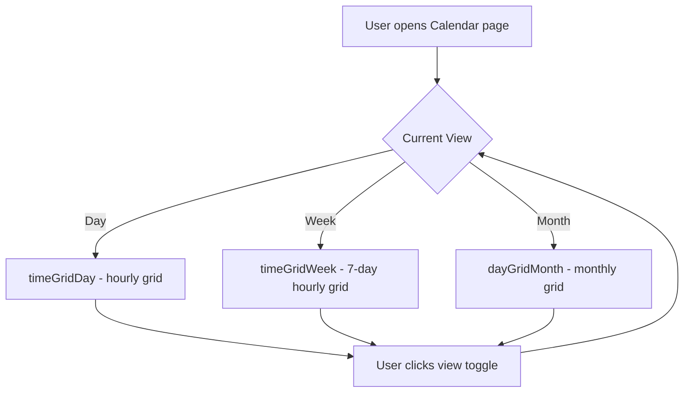
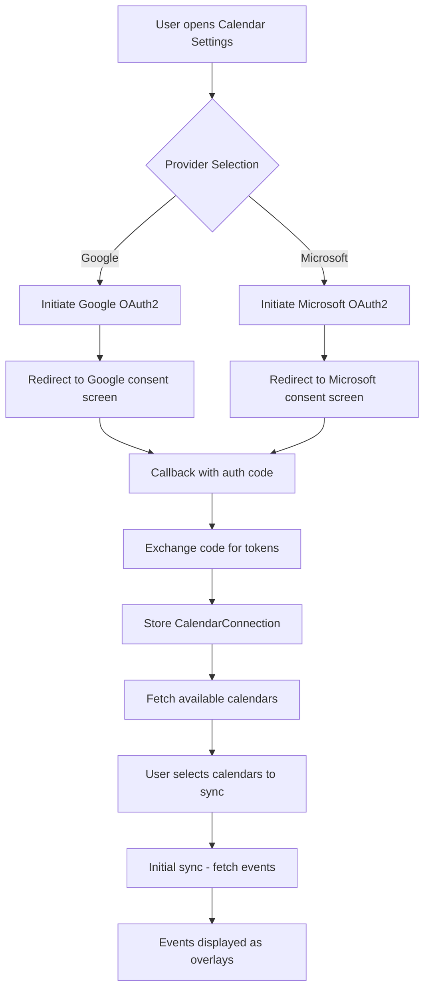
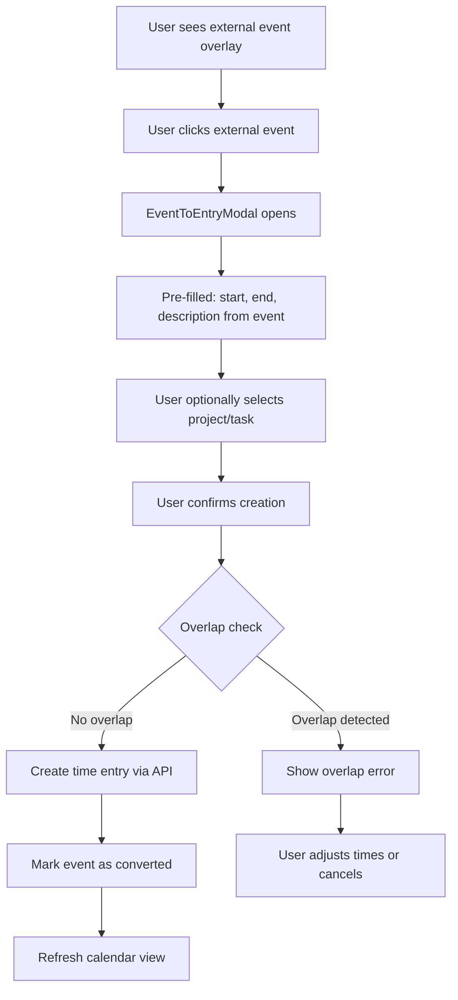
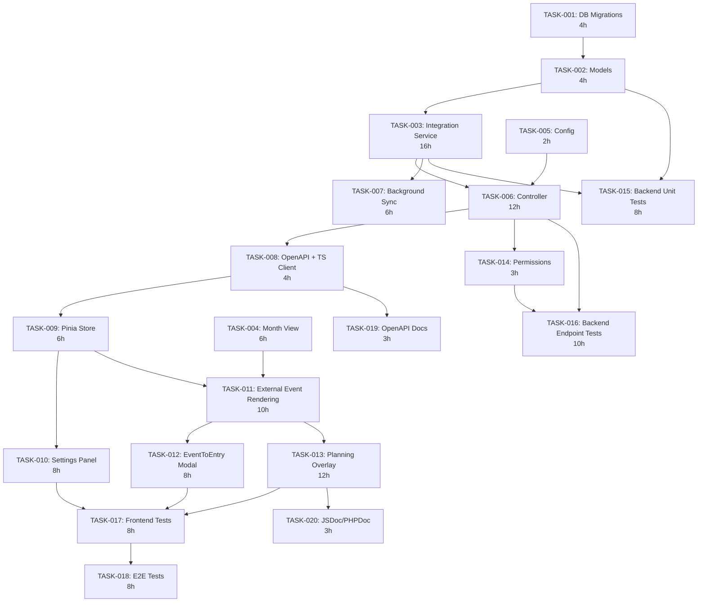

# PRD: Enhanced Calendar View for Solidtime

Generated: 2026-02-06
Version: 1.0

## Table of Contents

1. [Source Ticket Reference](#1-source-ticket-reference)
2. [Technical Interpretation](#2-technical-interpretation)
3. [Functional Specifications](#3-functional-specifications)
4. [Technical Requirements & Constraints](#4-technical-requirements--constraints)
5. [User Stories with Acceptance Criteria](#5-user-stories-with-acceptance-criteria)
6. [Task Breakdown Structure](#6-task-breakdown-structure)
7. [Dependencies & Integration Points](#7-dependencies--integration-points)
8. [Risk Assessment & Mitigation](#8-risk-assessment--mitigation)
9. [Testing & Validation Requirements](#9-testing--validation-requirements)
10. [Monitoring & Observability](#10-monitoring--observability)
11. [Success Metrics & Definition of Done](#11-success-metrics--definition-of-done)
12. [Technical Debt & Future Considerations](#12-technical-debt--future-considerations)
13. [Appendices](#13-appendices)

---

## Amendments (2026-02-06 Review)

> These amendments supersede conflicting content in the original PRD sections below.
> Reference: `.features/SHARED-FOUNDATIONS.md` and `.features/PRD-REVIEW-REPORT.md`

### AMD-01: Task ID Prefix
All task IDs in this PRD are now prefixed with `CAL-`. E.g., TASK-001 becomes CAL-001.

### AMD-02: Migration Timestamps (SF-03)
All migrations use date prefix `2026_03_05_`.

### AMD-03: Modular Permissions (SF-08)
Permissions are registered via `App\Permissions\CalendarPermissions::register()` instead of directly modifying `JetstreamServiceProvider`.

### AMD-04: OAuth Callback URL Fix — CRITICAL
The OAuth callback URL MUST NOT contain `{organization}` in the path. OAuth providers (Google, Microsoft) require exact redirect URI matches.

**Fix**: Use a static callback route:
```
GET /api/v1/calendar-integrations/callback
```

Pass `organization_id` in the OAuth `state` parameter during the authorization request. The callback handler extracts `organization_id` from the `state` parameter after verifying the OAuth response.

**Environment variable change**:
```
GOOGLE_CALENDAR_REDIRECT_URI=${APP_URL}/api/v1/calendar-integrations/callback
MICROSOFT_CALENDAR_REDIRECT_URI=${APP_URL}/api/v1/calendar-integrations/callback
```

The callback controller method:
1. Validates the `state` parameter contains a valid `organization_id`
2. Exchanges the auth code for tokens
3. Creates/updates the `CalendarConnection` for the user in that organization

### AMD-05: User-Scoped vs. Org-Scoped Route Resolution
Calendar connections are user-scoped data accessed via organization-scoped routes. Clarification:
- The connection is stored with both `user_id` and `organization_id`
- A user's Google Calendar connection in Org A is independent from their connection in Org B
- The `organization_id` in the route is used for permission checking and audit scoping
- The data query filters by both `user_id` AND `organization_id`

### AMD-06: Split TASK-003 (CalendarIntegrationService)
CAL-003 should be split:
- **CAL-003a**: Core CalendarIntegrationService + Google Calendar provider (10h / 5 SP)
- **CAL-003b**: Microsoft Outlook/Graph provider (6h / 3 SP)
CAL-003b can be developed in parallel with CAL-004 (month view) since it's a provider implementation, not a service interface change.

### AMD-07: Total Effort Reconciliation
The authoritative total effort is **156 hours** (per task assignments document), not 145h (per PRD body).

### AMD-08: Sprint 2 Rebalancing
Sprint 2 has 41h backend work. Move CAL-014 (Premium Feature Gate, 3h) to Sprint 1 (it only depends on CAL-003). Revised Sprint 2: ~38h.

### AMD-09: Data Retention Policy for calendar_events
Add a data retention strategy:
- Events older than **90 days in the past** are soft-deleted on each sync
- A scheduled command `calendar:cleanup` runs weekly to hard-delete soft-deleted events older than 30 additional days
- This prevents unbounded table growth while keeping recent historical context

**New task: CAL-021 — Calendar Events Cleanup Command**
- Create `app/Console/Commands/CleanupCalendarEventsCommand.php`
- Delete `calendar_events` where `end_time < now() - 90 days`
- Register in `Console/Kernel.php` as weekly cron
- Effort: 3h / 2 SP
- Sprint: 4

### AMD-10: CalendarEvent Audit Logging Decision
`CalendarEvent` intentionally omits `CustomAuditable` because these are cached external events that are frequently upserted during sync. Audit logging would create excessive noise. This is an explicit design decision, not an oversight.

### AMD-11: Premium Feature Gating
The premium gating uses the existing `BillingContract` pattern. The specific method is `$this->canAccessPremiumFeatures($organization)` which checks the organization's billing plan. This method exists in the base Controller via the `BillingContract` interface. A new page prop `has_calendar_sync` should be added (following the `has_invoicing_extension` pattern) to gate the frontend UI.

### AMD-12: Overlapping External Events
When multiple external calendar events overlap in time, they are displayed as stacked overlay blocks with reduced opacity. No automatic resolution is performed. The user decides which event to convert to a time entry.

---

## 1. Source Ticket Reference

### Feature Information

- **Feature ID**: FEAT-05
- **Title**: Enhanced Calendar View
- **Status**: PRD Development
- **Feature Branch**: `feature/calendar-enhanced`
- **Original Scope**: Enhance the existing FullCalendar-based calendar page with drag interactions, external calendar integration (Google/Outlook), event-to-entry conversion, multiple view modes, and planning vs actual overlays.

### Existing System Baseline

The current Calendar.vue page (`resources/js/Pages/Calendar.vue`) already provides:

- FullCalendar v6.1.18 integration with `@fullcalendar/vue3`, `@fullcalendar/daygrid`, `@fullcalendar/timegrid`, and `@fullcalendar/interaction` plugins.
- `TimeEntryCalendar` component (`resources/js/packages/ui/src/FullCalendar/TimeEntryCalendar.vue`) rendering time entries as calendar events.
- **Drag-to-create** (select time range to open create modal) -- already implemented via `selectable: true` and `handleDateSelect`.
- **Drag-to-move** (event drop) -- already implemented via `editable: true` and `handleEventDrop`.
- **Drag-to-resize** (event resize) -- already implemented via `eventDurationEditable: true`, `eventResizableFromStart: true`, and `handleEventResize`.
- Week and Day toggle (`timeGridWeek` / `timeGridDay`) in the header toolbar.
- Custom `FullCalendarDayHeader` showing daily totals.
- Custom `FullCalendarEventContent` showing description, project, task, client, and duration.
- Activity status plugin (`idleStatusPlugin.ts`) for idle/active period overlays.
- Running time entry support (auto-extending end time, disabled drag/resize).
- Theme integration using CSS custom properties.

**What is NOT yet implemented** (and is the scope of this PRD):

1. Month view (dayGridMonth)
2. External calendar synchronization (Google Calendar, Outlook/Microsoft 365)
3. External calendar events displayed as background/overlay events
4. Event-to-entry conversion (convert a calendar event into a solidtime time entry)
5. Planning vs Actual overlay mode (comparing scheduled entries against tracked actuals)
6. Calendar integration settings UI

---

## 2. Technical Interpretation

### Business to Technical Translation

| Business Requirement | Technical Implementation |
|---|---|
| Users want to see their calendar events alongside time entries | OAuth2 integration with Google Calendar API and Microsoft Graph API; backend sync service storing external events; frontend overlay rendering |
| Users want to quickly create time entries from calendar events | Conversion API endpoint; frontend UI flow on external event click |
| Users want day/week/month views | Enable `dayGridMonth` plugin in FullCalendar options; add view toggle button |
| Users want to see planned vs actual time | Dual-layer rendering in FullCalendar using background events for planned blocks and foreground events for actual entries |
| Users want external calendar management | Settings page for OAuth connections, sync toggle, calendar selection |

### Existing Components to Enhance

| Component | File Path | Enhancement |
|---|---|---|
| `Calendar.vue` | `resources/js/Pages/Calendar.vue` | Add external events fetching, month view support, planning overlay toggle |
| `TimeEntryCalendar.vue` | `resources/js/packages/ui/src/FullCalendar/TimeEntryCalendar.vue` | Add month view, external event rendering, event-to-entry conversion UI |
| `FullCalendarEventContent.vue` | `resources/js/packages/ui/src/FullCalendar/FullCalendarEventContent.vue` | Display external calendar event styling |
| `FullCalendarDayHeader.vue` | `resources/js/packages/ui/src/FullCalendar/FullCalendarDayHeader.vue` | Add planned vs actual totals |
| API routes (`routes/api.php`) | `routes/api.php` | Add calendar integration endpoints |

### New Components Required

| Component | File Path | Purpose |
|---|---|---|
| `CalendarIntegrationController` | `app/Http/Controllers/Api/V1/CalendarIntegrationController.php` | OAuth callbacks, sync operations, event listing |
| `CalendarIntegrationService` | `app/Service/CalendarIntegrationService.php` | Business logic for calendar sync |
| `CalendarConnection` model | `app/Models/CalendarConnection.php` | Stores OAuth tokens and connection metadata |
| `CalendarEvent` model | `app/Models/CalendarEvent.php` | Cached external calendar events |
| `CalendarSettingsPanel.vue` | `resources/js/packages/ui/src/Calendar/CalendarSettingsPanel.vue` | Connection management UI |
| `ExternalCalendarEvent.vue` | `resources/js/packages/ui/src/Calendar/ExternalCalendarEvent.vue` | Rendering external events |
| `EventToEntryModal.vue` | `resources/js/packages/ui/src/Calendar/EventToEntryModal.vue` | Convert event to time entry |
| `PlanningOverlayToggle.vue` | `resources/js/packages/ui/src/Calendar/PlanningOverlayToggle.vue` | Toggle planning vs actual view |
| `useCalendarIntegrations.ts` | `resources/js/utils/useCalendarIntegrations.ts` | Pinia store for calendar integrations |

---

## 3. Functional Specifications

### 3.1 Core Requirements

#### REQ-001: Month View Mode

- **Description**: Add a `dayGridMonth` view option to the calendar toolbar, allowing users to toggle between Day, Week, and Month views.
- **Priority**: P1
- **Edge Cases**:
  - Month view shows time entries as compact blocks (title + duration only, no time grid).
  - Days with more than 5 entries show "+N more" with a popover or expand-to-day on click.
  - Running time entries display with a pulsing indicator in month view.
- **Error Scenarios**:
  - Large date ranges in month view may return many time entries; enforce pagination limit of 1000 (existing API constraint).

#### REQ-002: External Calendar Connections (Google Calendar)

- **Description**: Users can connect their Google Calendar account via OAuth2, select which calendars to sync, and see external events as read-only overlays in the solidtime calendar.
- **Priority**: P1
- **Edge Cases**:
  - User has multiple Google accounts; each connection is stored separately.
  - OAuth token expires; background refresh handles token rotation.
  - User revokes access from Google side; sync gracefully degrades.
  - Calendar has all-day events; these display in an all-day row (requires enabling `allDaySlot` conditionally).
- **Error Scenarios**:
  - OAuth flow fails; user sees error notification and can retry.
  - Google API rate limit hit; exponential backoff with user-facing status message.
  - Network timeout during sync; stale cached events are shown with a "last synced" indicator.

#### REQ-003: External Calendar Connections (Microsoft Outlook/365)

- **Description**: Same as REQ-002 but using Microsoft Graph API for Outlook/Office 365 calendars.
- **Priority**: P1
- **Edge Cases**:
  - Microsoft requires admin consent for organizational accounts; detect and surface to user.
  - Shared calendars require additional permissions; initially only support primary calendar.
- **Error Scenarios**:
  - Microsoft token refresh fails; prompt user to re-authenticate.

#### REQ-004: Event-to-Entry Conversion

- **Description**: Users can click on an external calendar event overlay and convert it into a solidtime time entry, pre-filling start/end times, and using the event title as the description.
- **Priority**: P1
- **Edge Cases**:
  - All-day events: prompt user to enter specific start/end times.
  - Recurring events: only convert the specific occurrence, not the series.
  - Event already converted: show indicator and optionally skip duplicate creation.
  - Event spans midnight: split into two entries or allow single entry spanning midnight (match existing time entry behavior).
- **Error Scenarios**:
  - Overlapping time entry: honor `prevent_overlapping_time_entries` organization setting and surface the `OverlappingTimeEntryApiException` error.

#### REQ-005: Planning vs Actual Overlay

- **Description**: Users can toggle a "Planning" mode that shows scheduled/planned time blocks (from external calendars or manually created planned entries) as semi-transparent background events, while actual tracked time entries display as solid foreground events.
- **Priority**: P2
- **Edge Cases**:
  - External calendar event exactly matches a time entry; show visual "matched" indicator.
  - No external calendars connected; planning overlay only works with manually created planned entries (future scope).
  - Mismatch between planned and actual highlights gaps (untracked planned time) and overages.
- **Error Scenarios**:
  - Performance degradation with many overlay events; limit to 200 external events per visible range.

### 3.2 User Workflows

#### Calendar View Mode Switching



#### External Calendar OAuth Connection Flow



#### Event-to-Entry Conversion Flow



### 3.3 Business Rules

- External calendar connections are scoped per **user** (not per organization). A user's connections are accessible across all their organizations.
- External events are cached server-side with a TTL of 15 minutes. Manual refresh is available.
- OAuth tokens are encrypted at rest using Laravel's `Crypt` facade.
- The `calendar-integrations:manage` permission controls who can connect external calendars. By default, all roles have this permission.
- External calendar sync is a **premium feature** (requires active subscription or trial).
- Month view is available to all users (not premium-gated).
- Planning overlay is a **premium feature**.
- API rate limits for external calendar providers: max 1 sync per user per 5 minutes (background), on-demand sync resets this timer.

---

## 4. Technical Requirements & Constraints

### 4.1 System Architecture

```
+---------------------------+     +-----------------------------+     +------------------+
|   Vue 3 Frontend          |     |   Laravel 11 API            |     |   External APIs  |
|                           |     |                             |     |                  |
| Calendar.vue (Inertia)    |<--->| CalendarIntegrationController|<--->| Google Calendar  |
| TimeEntryCalendar.vue     |     | CalendarIntegrationService  |     | Microsoft Graph  |
| useCalendarIntegrations   |     | CalendarConnection (Model)  |     |                  |
| CalendarSettingsPanel     |     | CalendarEvent (Model)       |     |                  |
| EventToEntryModal         |     | SyncCalendarEventsJob       |     |                  |
+---------------------------+     +-----------------------------+     +------------------+
                                         |
                                         v
                                  +------------------+
                                  |   PostgreSQL     |
                                  |                  |
                                  | calendar_connections |
                                  | calendar_events      |
                                  +------------------+
```

### 4.2 Data Models

#### CalendarConnection

```php
/**
 * @property string $id                      UUID
 * @property string $user_id                 FK to users
 * @property string $provider                'google' | 'microsoft'
 * @property string $provider_account_id     External account identifier
 * @property string $provider_account_email  Email of connected account
 * @property string $access_token            Encrypted OAuth access token
 * @property string $refresh_token           Encrypted OAuth refresh token
 * @property Carbon $token_expires_at        Token expiration timestamp
 * @property array  $selected_calendars      JSON array of selected calendar IDs
 * @property bool   $is_active               Whether sync is enabled
 * @property Carbon|null $last_synced_at     Last successful sync timestamp
 * @property Carbon|null $created_at
 * @property Carbon|null $updated_at
 */
```

```sql
CREATE TABLE calendar_connections (
    id UUID PRIMARY KEY DEFAULT gen_random_uuid(),
    user_id UUID NOT NULL REFERENCES users(id) ON DELETE CASCADE,
    provider VARCHAR(20) NOT NULL,
    provider_account_id VARCHAR(255) NOT NULL,
    provider_account_email VARCHAR(255) NOT NULL,
    access_token TEXT NOT NULL,
    refresh_token TEXT NOT NULL,
    token_expires_at TIMESTAMP NOT NULL,
    selected_calendars JSONB NOT NULL DEFAULT '[]',
    is_active BOOLEAN NOT NULL DEFAULT true,
    last_synced_at TIMESTAMP NULL,
    created_at TIMESTAMP DEFAULT CURRENT_TIMESTAMP,
    updated_at TIMESTAMP DEFAULT CURRENT_TIMESTAMP,
    UNIQUE(user_id, provider, provider_account_id)
);

CREATE INDEX idx_calendar_connections_user_id ON calendar_connections(user_id);
CREATE INDEX idx_calendar_connections_provider ON calendar_connections(provider);
```

#### CalendarEvent

```php
/**
 * @property string $id                      UUID
 * @property string $calendar_connection_id  FK to calendar_connections
 * @property string $user_id                 FK to users (denormalized for query performance)
 * @property string $external_event_id       ID from external provider
 * @property string $calendar_id             External calendar ID
 * @property string $title                   Event title/summary
 * @property string|null $description        Event description
 * @property Carbon $start                   Event start time (UTC)
 * @property Carbon|null $end                Event end time (UTC), null for all-day
 * @property bool $is_all_day               Whether this is an all-day event
 * @property string|null $location           Event location
 * @property string $status                  'confirmed' | 'tentative' | 'cancelled'
 * @property string|null $color              Event color from external provider
 * @property string|null $converted_time_entry_id  FK to time_entries if converted
 * @property Carbon|null $created_at
 * @property Carbon|null $updated_at
 */
```

```sql
CREATE TABLE calendar_events (
    id UUID PRIMARY KEY DEFAULT gen_random_uuid(),
    calendar_connection_id UUID NOT NULL REFERENCES calendar_connections(id) ON DELETE CASCADE,
    user_id UUID NOT NULL REFERENCES users(id) ON DELETE CASCADE,
    external_event_id VARCHAR(500) NOT NULL,
    calendar_id VARCHAR(500) NOT NULL,
    title VARCHAR(1000) NOT NULL DEFAULT '',
    description TEXT NULL,
    start TIMESTAMP NOT NULL,
    "end" TIMESTAMP NULL,
    is_all_day BOOLEAN NOT NULL DEFAULT false,
    location VARCHAR(1000) NULL,
    status VARCHAR(20) NOT NULL DEFAULT 'confirmed',
    color VARCHAR(20) NULL,
    converted_time_entry_id UUID NULL REFERENCES time_entries(id) ON DELETE SET NULL,
    created_at TIMESTAMP DEFAULT CURRENT_TIMESTAMP,
    updated_at TIMESTAMP DEFAULT CURRENT_TIMESTAMP,
    UNIQUE(calendar_connection_id, external_event_id)
);

CREATE INDEX idx_calendar_events_user_id ON calendar_events(user_id);
CREATE INDEX idx_calendar_events_start_end ON calendar_events(user_id, start, "end");
CREATE INDEX idx_calendar_events_connection ON calendar_events(calendar_connection_id);
CREATE INDEX idx_calendar_events_converted ON calendar_events(converted_time_entry_id);
```

### 4.3 API Contracts

#### Calendar Integration Endpoints

All endpoints are scoped under `/organizations/{organization}` to match existing routing patterns, but the connections themselves are user-scoped.

```yaml
# List user's calendar connections
GET /api/v1/organizations/{organization}/calendar-integrations
Auth: Bearer token
Permission: calendar-integrations:manage
Response:
  200 OK:
    data:
      - id: string (UUID)
        provider: 'google' | 'microsoft'
        provider_account_email: string
        selected_calendars: CalendarInfo[]
        is_active: boolean
        last_synced_at: string | null

# Initiate OAuth connection
POST /api/v1/organizations/{organization}/calendar-integrations/connect
Auth: Bearer token
Permission: calendar-integrations:manage
Middleware: check-organization-blocked
Request:
  provider: 'google' | 'microsoft'
Response:
  200 OK:
    redirect_url: string (OAuth consent URL)

# OAuth callback (handles provider redirect)
GET /api/v1/organizations/{organization}/calendar-integrations/callback
Query:
  code: string
  state: string (contains provider + CSRF token)
Response:
  302 Redirect to calendar settings page

# List available calendars for a connection
GET /api/v1/organizations/{organization}/calendar-integrations/{connection}/calendars
Auth: Bearer token
Permission: calendar-integrations:manage
Response:
  200 OK:
    data:
      - id: string
        name: string
        color: string | null
        is_primary: boolean
        is_selected: boolean

# Update calendar selection
PUT /api/v1/organizations/{organization}/calendar-integrations/{connection}
Auth: Bearer token
Permission: calendar-integrations:manage
Middleware: check-organization-blocked
Request:
  selected_calendars: string[]  (calendar IDs)
  is_active: boolean
Response:
  200 OK:
    data: CalendarConnection

# Delete a calendar connection
DELETE /api/v1/organizations/{organization}/calendar-integrations/{connection}
Auth: Bearer token
Permission: calendar-integrations:manage
Response:
  204 No Content

# Trigger manual sync for a connection
POST /api/v1/organizations/{organization}/calendar-integrations/{connection}/sync
Auth: Bearer token
Permission: calendar-integrations:manage
Middleware: check-organization-blocked
Response:
  200 OK:
    data:
      events_synced: integer
      last_synced_at: string

# Get external calendar events for date range
GET /api/v1/organizations/{organization}/calendar-events
Auth: Bearer token
Permission: calendar-integrations:manage
Query:
  start: string (ISO 8601, required)
  end: string (ISO 8601, required)
Response:
  200 OK:
    data:
      - id: string (UUID)
        external_event_id: string
        calendar_id: string
        title: string
        description: string | null
        start: string (ISO 8601)
        end: string | null (ISO 8601)
        is_all_day: boolean
        location: string | null
        status: string
        color: string | null
        provider: 'google' | 'microsoft'
        provider_account_email: string
        converted_time_entry_id: string | null

# Convert external event to time entry
POST /api/v1/organizations/{organization}/calendar-events/{calendarEvent}/convert
Auth: Bearer token
Permission: time-entries:create:own
Middleware: check-organization-blocked
Request:
  project_id: string | null
  task_id: string | null
  billable: boolean
  tags: string[]
  description: string | null  (override event title if provided)
Response:
  201 Created:
    data: TimeEntryResource
  409 Conflict:
    error: OverlappingTimeEntryApiException
```

### 4.4 Performance Requirements

- **Calendar event fetch**: 95th percentile < 300ms for a 1-month range with up to 500 external events.
- **OAuth flow**: Complete OAuth redirect and token exchange within 5 seconds.
- **Background sync**: Process up to 1000 events per connection within 30 seconds.
- **External event overlay render**: No perceptible lag when toggling external events on/off (< 100ms re-render).
- **Month view render**: Support up to 200 time entries in a month without janky scrolling.
- **Concurrent users**: Calendar sync jobs are rate-limited to prevent external API quota exhaustion; max 10 concurrent sync jobs per instance.

### 4.5 Security Requirements

- **OAuth Token Storage**: Access and refresh tokens encrypted at rest using `Crypt::encryptString()` / `Crypt::decryptString()`.
- **OAuth State Parameter**: CSRF protection via signed, time-limited state parameter in OAuth flow.
- **Scopes**: Request minimal OAuth scopes:
  - Google: `https://www.googleapis.com/auth/calendar.readonly`
  - Microsoft: `Calendars.Read`
- **Token Refresh**: Automatic token refresh before expiration; invalidate connection if refresh fails 3 consecutive times.
- **Data Privacy**: External calendar event data (titles, descriptions, locations) stored server-side; users can delete all cached data by removing a connection.
- **Rate Limiting**: Per-user rate limit of 1 sync request per 5 minutes; API endpoint rate limiting via existing middleware.
- **Audit Logging**: Log connection creation, deletion, and sync events.

---

## 5. User Stories with Acceptance Criteria

### Story USR-001: Month View Toggle

**As a** time tracker user
**I want to** switch to a month view in the calendar
**So that** I can see a high-level overview of my tracked time across the entire month

**Priority**: P1
**Effort**: 3 story points
**Sprint**: 1

**Acceptance Criteria**:

- [ ] Calendar toolbar shows three view options: Day, Week, Month
- [ ] Month view renders using `dayGridMonth` plugin
- [ ] Time entries appear as compact colored blocks showing description and duration
- [ ] Days with > 5 entries show "+N more" indicator
- [ ] Clicking "+N more" navigates to the Day view for that date
- [ ] Daily totals are visible in the day header cells
- [ ] Running time entries show a pulsing/animated indicator
- [ ] View preference persists across page navigation (stored in localStorage)
- [ ] Create/edit modals work from month view (click on a day to create, click entry to edit)
- [ ] Navigation (prev/next/today) works correctly in month view

**Dependencies**: None (FullCalendar dayGridPlugin already installed)

---

### Story USR-002: Connect Google Calendar

**As a** user with a Google account
**I want to** connect my Google Calendar to solidtime
**So that** I can see my Google Calendar events alongside my time entries

**Priority**: P1
**Effort**: 13 story points
**Sprint**: 2

**Acceptance Criteria**:

- [ ] Calendar settings panel accessible from calendar page header
- [ ] "Connect Google Calendar" button initiates OAuth2 flow
- [ ] OAuth consent screen requests only `calendar.readonly` scope
- [ ] After authorization, user returns to solidtime with connection active
- [ ] User can view list of available Google calendars
- [ ] User can select/deselect which calendars to sync
- [ ] Selected calendar events appear as semi-transparent overlays on the calendar
- [ ] External events are visually distinct from time entries (different opacity, border style, provider icon)
- [ ] Connection can be deactivated (stops sync) without deleting
- [ ] Connection can be fully deleted (removes all cached events)
- [ ] Token refresh happens automatically; user is notified only if re-authentication is needed
- [ ] Feature is gated behind premium subscription

**Dependencies**: Database migrations (TASK-001), CalendarIntegrationService (TASK-003)

---

### Story USR-003: Connect Microsoft Outlook Calendar

**As a** user with a Microsoft account
**I want to** connect my Outlook/Office 365 calendar to solidtime
**So that** I can see my Outlook events alongside my time entries

**Priority**: P1
**Effort**: 8 story points (incremental over Google, shared service infrastructure)
**Sprint**: 2

**Acceptance Criteria**:

- [ ] "Connect Microsoft Calendar" button initiates Microsoft OAuth2 flow
- [ ] OAuth consent screen requests `Calendars.Read` scope
- [ ] All criteria from USR-002 apply identically for Microsoft provider
- [ ] Microsoft-specific error messages (e.g., admin consent required) are surfaced clearly

**Dependencies**: USR-002 infrastructure (shared CalendarIntegrationService)

---

### Story USR-004: View External Calendar Events

**As a** user with connected calendars
**I want to** see my external calendar events rendered on the solidtime calendar
**So that** I can understand how my tracked time relates to my schedule

**Priority**: P1
**Effort**: 8 story points
**Sprint**: 3

**Acceptance Criteria**:

- [ ] External events render as semi-transparent background blocks on the calendar
- [ ] Events show title, time range, and a small provider icon (Google/Microsoft)
- [ ] Events from different calendars use the calendar's color
- [ ] All-day events appear in an all-day row at the top of day/week views
- [ ] All-day events appear as full-width bars in month view
- [ ] Events are read-only (cannot be dragged, resized, or directly edited)
- [ ] External events load is triggered by the same `datesSet` callback as time entries
- [ ] Loading indicator shown while external events are being fetched
- [ ] "Last synced X minutes ago" indicator visible in calendar header
- [ ] Manual "Refresh" button triggers a sync and refetches events

**Dependencies**: USR-002, USR-003

---

### Story USR-005: Convert Calendar Event to Time Entry

**As a** user viewing an external calendar event
**I want to** convert it into a solidtime time entry
**So that** I can quickly log time for meetings and scheduled activities

**Priority**: P1
**Effort**: 5 story points
**Sprint**: 3

**Acceptance Criteria**:

- [ ] Clicking an external event opens the `EventToEntryModal`
- [ ] Modal pre-fills: start time, end time, description (from event title)
- [ ] User can select project, task, tags, and billable status before confirming
- [ ] For all-day events, user must manually set start and end times
- [ ] "Create Time Entry" button calls the conversion API
- [ ] After conversion, the external event shows a visual "converted" indicator (checkmark overlay)
- [ ] Converted events link to their time entry; clicking shows the time entry edit modal
- [ ] Overlap errors are shown inline with actionable messaging
- [ ] Multiple events can be converted in sequence without leaving the calendar

**Dependencies**: USR-004, Time entry creation API (existing)

---

### Story USR-006: Planning vs Actual Overlay

**As a** user planning my workday
**I want to** see a comparison of my planned schedule (calendar events) versus actual tracked time
**So that** I can identify gaps in time tracking and improve my workflow

**Priority**: P2
**Effort**: 8 story points
**Sprint**: 4

**Acceptance Criteria**:

- [ ] "Planning View" toggle button in calendar toolbar
- [ ] When active, external events render as background blocks with hatched/striped pattern
- [ ] Actual time entries render as solid foreground blocks (normal rendering)
- [ ] Visual indicators for: matched (event aligns with entry), untracked (event without matching entry), unplanned (entry without matching event)
- [ ] Day header shows both "Planned: Xh" and "Actual: Yh" totals
- [ ] Summary card shows weekly planned vs actual totals with a simple bar chart
- [ ] Toggle state persists in localStorage
- [ ] Feature is gated behind premium subscription

**Dependencies**: USR-004

---

## 6. Task Breakdown Structure

### Phase 1: Foundation (Week 1 -- Sprint 1)

---

#### TASK-001: Database Migrations for Calendar Integration

**Type**: Backend (Database)
**Effort**: 4 hours (2 story points)
**Dependencies**: None

**Description**: Create database migrations for `calendar_connections` and `calendar_events` tables following solidtime's existing migration patterns (UUID primary keys, timestamps, foreign keys to `users` and `time_entries`).

**Files to create**:

- `database/migrations/YYYY_MM_DD_HHMMSS_create_calendar_connections_table.php`
- `database/migrations/YYYY_MM_DD_HHMMSS_create_calendar_events_table.php`

**Implementation Notes**:

- Use `$table->uuid('id')->primary()` following the `HasUuids` pattern used by `TimeEntry`.
- Encrypted columns (`access_token`, `refresh_token`) stored as `TEXT`.
- `selected_calendars` uses `JSONB` column type.
- Compound unique index on `(user_id, provider, provider_account_id)` for connections.
- Compound unique index on `(calendar_connection_id, external_event_id)` for events.

**Acceptance Criteria**:

- [ ] Migrations run successfully on PostgreSQL
- [ ] Migrations can be rolled back cleanly
- [ ] Index performance validated with EXPLAIN ANALYZE on expected query patterns

---

#### TASK-002: Eloquent Models for CalendarConnection and CalendarEvent

**Type**: Backend (Models)
**Effort**: 4 hours (2 story points)
**Dependencies**: TASK-001

**Description**: Create Eloquent models following solidtime patterns: `HasUuids` trait, `CustomAuditable`, proper casts, and relationships.

**Files to create**:

- `app/Models/CalendarConnection.php`
- `app/Models/CalendarEvent.php`
- `database/factories/CalendarConnectionFactory.php`
- `database/factories/CalendarEventFactory.php`

**CalendarConnection model**:

```php
class CalendarConnection extends Model implements AuditableContract
{
    use HasUuids, HasFactory, CustomAuditable;

    protected $casts = [
        'selected_calendars' => 'array',
        'is_active' => 'bool',
        'token_expires_at' => 'datetime',
        'last_synced_at' => 'datetime',
    ];

    // Encrypt/decrypt tokens via accessors
    public function getAccessTokenAttribute($value): string
    {
        return Crypt::decryptString($value);
    }

    public function setAccessTokenAttribute($value): void
    {
        $this->attributes['access_token'] = Crypt::encryptString($value);
    }

    // Same for refresh_token...

    public function user(): BelongsTo { ... }
    public function calendarEvents(): HasMany { ... }
}
```

**CalendarEvent model**:

```php
class CalendarEvent extends Model
{
    use HasUuids, HasFactory;

    protected $casts = [
        'start' => 'datetime',
        'end' => 'datetime',
        'is_all_day' => 'bool',
    ];

    public function calendarConnection(): BelongsTo { ... }
    public function user(): BelongsTo { ... }
    public function convertedTimeEntry(): BelongsTo { ... }
}
```

**Acceptance Criteria**:

- [ ] Models correctly cast all attributes
- [ ] Token encryption/decryption works via model accessors
- [ ] Factory methods produce valid test data
- [ ] Relationships are properly defined and return expected types

---

#### TASK-003: CalendarIntegrationService -- Core Logic

**Type**: Backend (Service)
**Effort**: 16 hours (8 story points)
**Dependencies**: TASK-002

**Description**: Create the stateless business logic service handling OAuth token management, external API communication, and event synchronization. This is the largest backend task and the core of the calendar integration feature.

**Files to create**:

- `app/Service/CalendarIntegrationService.php`
- `app/Service/Calendar/GoogleCalendarProvider.php`
- `app/Service/Calendar/MicrosoftCalendarProvider.php`
- `app/Service/Calendar/CalendarProviderInterface.php`

**CalendarProviderInterface**:

```php
interface CalendarProviderInterface
{
    public function getAuthorizationUrl(string $state): string;
    public function exchangeCodeForTokens(string $code): array;
    public function refreshAccessToken(string $refreshToken): array;
    public function listCalendars(string $accessToken): array;
    public function listEvents(string $accessToken, string $calendarId, Carbon $start, Carbon $end): array;
}
```

**CalendarIntegrationService**:

```php
class CalendarIntegrationService
{
    public function initiateConnection(User $user, string $provider): string; // Returns redirect URL
    public function handleCallback(string $code, string $state): CalendarConnection;
    public function refreshTokenIfNeeded(CalendarConnection $connection): void;
    public function getAvailableCalendars(CalendarConnection $connection): array;
    public function syncEvents(CalendarConnection $connection, Carbon $start, Carbon $end): int;
    public function getEventsForDateRange(User $user, Carbon $start, Carbon $end): Collection;
    public function convertEventToTimeEntry(CalendarEvent $event, array $data): TimeEntry;
    public function deleteConnection(CalendarConnection $connection): void;
}
```

**Implementation Notes**:

- Use Laravel HTTP client (`Http::`) for API calls to Google and Microsoft.
- Google Calendar API v3: `https://www.googleapis.com/calendar/v3/`
- Microsoft Graph API: `https://graph.microsoft.com/v1.0/me/calendars` and `/events`
- Upsert events by `(calendar_connection_id, external_event_id)` unique constraint.
- Handle timezone conversion: external events may come in various timezones; normalize to UTC for storage.
- Token refresh: check `token_expires_at` before each API call; refresh if within 5 minutes of expiry.

**Acceptance Criteria**:

- [ ] Google OAuth flow completes successfully in test environment
- [ ] Microsoft OAuth flow completes successfully in test environment
- [ ] Token refresh works automatically
- [ ] Events are correctly fetched and stored in UTC
- [ ] Sync upserts events (no duplicates on re-sync)
- [ ] `convertEventToTimeEntry` creates a valid time entry and links it to the event
- [ ] All methods have proper error handling and logging

---

#### TASK-004: Month View Frontend Enhancement

**Type**: Frontend (Vue)
**Effort**: 6 hours (3 story points)
**Dependencies**: None

**Description**: Add `dayGridMonth` view to the existing `TimeEntryCalendar.vue` component. This requires adding the `dayGridMonth` plugin (already installed as `@fullcalendar/daygrid`), updating the toolbar, and handling month-view-specific rendering.

**Files to modify**:

- `resources/js/packages/ui/src/FullCalendar/TimeEntryCalendar.vue` -- add month view to toolbar and handle month-specific event rendering
- `resources/js/packages/ui/src/FullCalendar/FullCalendarEventContent.vue` -- add compact mode for month view rendering

**Files to create**:

- `resources/js/packages/ui/src/FullCalendar/FullCalendarMonthEventContent.vue` -- compact event display for month cells

**Key Changes in `TimeEntryCalendar.vue`**:

```typescript
// Update calendarOptions toolbar
headerToolbar: {
    left: 'prev,next today',
    center: 'title',
    right: 'dayGridMonth,timeGridWeek,timeGridDay',
},

// Add dayGridMonth-specific options
views: {
    dayGridMonth: {
        dayMaxEventRows: 5,
        moreLinkClick: 'day', // Navigate to day view on "+N more" click
    },
},

// Conditionally show all-day slot when external events are present
allDaySlot: hasAllDayEvents.value,
```

**Acceptance Criteria**:

- [ ] Month view button appears in toolbar and switches view
- [ ] Time entries render as compact bars in month cells
- [ ] "+N more" popover works for days with many entries
- [ ] Daily totals display in month view day headers
- [ ] Running entries show pulsing indicator
- [ ] View state persists in localStorage
- [ ] All existing drag/resize/create functionality remains working in day/week views

---

#### TASK-005: Calendar Integration Configuration

**Type**: Backend (Config/Environment)
**Effort**: 2 hours (1 story point)
**Dependencies**: None

**Description**: Add configuration entries for Google and Microsoft OAuth credentials and API settings.

**Files to modify**:

- `config/services.php` -- add `google_calendar` and `microsoft_calendar` entries

**Files to create**:

- None (use existing config pattern)

**Configuration entries**:

```php
// config/services.php
'google_calendar' => [
    'client_id' => env('GOOGLE_CALENDAR_CLIENT_ID'),
    'client_secret' => env('GOOGLE_CALENDAR_CLIENT_SECRET'),
    'redirect_uri' => env('GOOGLE_CALENDAR_REDIRECT_URI'),
],

'microsoft_calendar' => [
    'client_id' => env('MICROSOFT_CALENDAR_CLIENT_ID'),
    'client_secret' => env('MICROSOFT_CALENDAR_CLIENT_SECRET'),
    'redirect_uri' => env('MICROSOFT_CALENDAR_REDIRECT_URI'),
    'tenant_id' => env('MICROSOFT_CALENDAR_TENANT_ID', 'common'),
],
```

**Acceptance Criteria**:

- [ ] `.env.example` updated with placeholder values
- [ ] Config values accessible via `config('services.google_calendar.client_id')`
- [ ] Missing config values don't break the application (graceful null handling)

---

### Phase 2: API & Backend (Week 2-3 -- Sprint 2)

---

#### TASK-006: CalendarIntegrationController -- REST Endpoints

**Type**: Backend (Controller)
**Effort**: 12 hours (5 story points)
**Dependencies**: TASK-003, TASK-005

**Description**: Create the API controller following solidtime patterns: extends `App\Http\Controllers\Api\V1\Controller`, uses `checkPermission()`, organization injected via route model binding.

**Files to create**:

- `app/Http/Controllers/Api/V1/CalendarIntegrationController.php`
- `app/Http/Requests/V1/CalendarIntegration/ConnectRequest.php`
- `app/Http/Requests/V1/CalendarIntegration/UpdateConnectionRequest.php`
- `app/Http/Resources/V1/CalendarIntegration/CalendarConnectionResource.php`
- `app/Http/Resources/V1/CalendarIntegration/CalendarConnectionCollection.php`
- `app/Http/Resources/V1/CalendarEvent/CalendarEventResource.php`
- `app/Http/Resources/V1/CalendarEvent/CalendarEventCollection.php`

**Route Registration** (in `routes/api.php`):

```php
// Calendar integration routes
Route::name('calendar-integrations.')->prefix('/organizations/{organization}')->group(static function (): void {
    Route::get('/calendar-integrations', [CalendarIntegrationController::class, 'index'])->name('index');
    Route::post('/calendar-integrations/connect', [CalendarIntegrationController::class, 'connect'])->name('connect')->middleware('check-organization-blocked');
    Route::get('/calendar-integrations/callback', [CalendarIntegrationController::class, 'callback'])->name('callback');
    Route::get('/calendar-integrations/{connection}/calendars', [CalendarIntegrationController::class, 'calendars'])->name('calendars');
    Route::put('/calendar-integrations/{connection}', [CalendarIntegrationController::class, 'update'])->name('update')->middleware('check-organization-blocked');
    Route::delete('/calendar-integrations/{connection}', [CalendarIntegrationController::class, 'destroy'])->name('destroy');
    Route::post('/calendar-integrations/{connection}/sync', [CalendarIntegrationController::class, 'sync'])->name('sync')->middleware('check-organization-blocked');
});

// Calendar events routes
Route::name('calendar-events.')->prefix('/organizations/{organization}')->group(static function (): void {
    Route::get('/calendar-events', [CalendarIntegrationController::class, 'events'])->name('index');
    Route::post('/calendar-events/{calendarEvent}/convert', [CalendarIntegrationController::class, 'convert'])->name('convert')->middleware('check-organization-blocked');
});
```

**Implementation Notes**:

- `connect()` returns a JSON response with `redirect_url` for the frontend to handle (not a server-side redirect).
- `callback()` is the only endpoint that does a server-side redirect (back to the calendar settings page via Inertia).
- `convert()` reuses existing `TimeEntryController::store()` logic (overlapping check, billable rate computation, project/task recalculation).
- Premium feature gate: check `$this->canAccessPremiumFeatures($organization)` and throw `FeatureIsNotAvailableInFreePlanApiException` if not premium.

**Acceptance Criteria**:

- [ ] All endpoints return correct HTTP status codes
- [ ] Permission checks enforce `calendar-integrations:manage`
- [ ] Premium gating works correctly
- [ ] Request validation catches invalid inputs
- [ ] Connection routes resolve `{connection}` via route model binding scoped to user

---

#### TASK-007: Background Sync Job

**Type**: Backend (Job/Queue)
**Effort**: 6 hours (3 story points)
**Dependencies**: TASK-003

**Description**: Create a Laravel queued job for background calendar event synchronization, with a scheduled command to trigger periodic syncs.

**Files to create**:

- `app/Jobs/SyncCalendarEventsJob.php`
- `app/Console/Commands/SyncCalendarEventsCommand.php`

**SyncCalendarEventsJob**:

```php
class SyncCalendarEventsJob implements ShouldQueue
{
    use Dispatchable, InteractsWithQueue, Queueable, SerializesModels;

    public function __construct(
        private CalendarConnection $connection,
        private Carbon $start,
        private Carbon $end,
    ) {}

    public function handle(CalendarIntegrationService $service): void
    {
        $service->refreshTokenIfNeeded($this->connection);
        $service->syncEvents($this->connection, $this->start, $this->end);
    }

    public function failed(\Throwable $exception): void
    {
        Log::error('Calendar sync failed', [
            'connection_id' => $this->connection->id,
            'error' => $exception->getMessage(),
        ]);
    }
}
```

**Scheduled Command**: Runs every 15 minutes, dispatches sync jobs for all active connections.

```php
// app/Console/Kernel.php or route/console.php
Schedule::command('calendar:sync')->everyFifteenMinutes();
```

**Acceptance Criteria**:

- [ ] Job processes on the queue without blocking web requests
- [ ] Failed jobs are logged and retried up to 3 times
- [ ] Scheduled command correctly finds and dispatches for active connections
- [ ] Rate limiting prevents more than 1 sync per connection per 5 minutes

---

#### TASK-008: OpenAPI Spec Update and TypeScript Client Regeneration

**Type**: Backend/Frontend (API)
**Effort**: 4 hours (2 story points)
**Dependencies**: TASK-006

**Description**: Update the OpenAPI specification with the new calendar integration endpoints and regenerate the TypeScript client used by the frontend (`@zodios/core` based client in `resources/js/packages/api/src/`).

**Files to modify**:

- `openapi.json` or equivalent spec file
- `resources/js/packages/api/src/openapi.json.client.ts` (regenerated)
- `resources/js/packages/api/src/index.ts` (add new type exports)

**New type exports**:

```typescript
export type CalendarConnectionResponse = ZodiosResponseByAlias<SolidTimeApi, 'getCalendarIntegrations'>;
export type CalendarConnection = CalendarConnectionResponse['data'][0];
export type CalendarEventResponse = ZodiosResponseByAlias<SolidTimeApi, 'getCalendarEvents'>;
export type CalendarEvent = CalendarEventResponse['data'][0];
export type ConvertEventBody = ZodiosBodyByAlias<SolidTimeApi, 'convertCalendarEvent'>;
```

**Acceptance Criteria**:

- [ ] OpenAPI spec validates without errors
- [ ] TypeScript client regenerates without type errors
- [ ] All new endpoints are callable via the `api` client
- [ ] Existing endpoint types remain unchanged

---

### Phase 3: Frontend Integration (Week 3-4 -- Sprint 3)

---

#### TASK-009: Pinia Store for Calendar Integrations

**Type**: Frontend (Store)
**Effort**: 6 hours (3 story points)
**Dependencies**: TASK-008

**Description**: Create a Pinia store following the pattern of `useTimeEntries.ts` for managing calendar connections and external events.

**Files to create**:

- `resources/js/utils/useCalendarIntegrations.ts`

**Store API**:

```typescript
export const useCalendarIntegrationsStore = defineStore('calendarIntegrations', () => {
    const connections = ref<CalendarConnection[]>([]);
    const externalEvents = ref<CalendarEvent[]>([]);
    const isLoading = ref(false);
    const lastSyncedAt = ref<string | null>(null);

    async function fetchConnections(): Promise<void>;
    async function initiateConnection(provider: 'google' | 'microsoft'): Promise<string>; // returns redirect URL
    async function updateConnection(id: string, data: Partial<CalendarConnection>): Promise<void>;
    async function deleteConnection(id: string): Promise<void>;
    async function syncConnection(id: string): Promise<void>;
    async function fetchExternalEvents(start: string, end: string): Promise<void>;
    async function convertEvent(eventId: string, data: ConvertEventBody): Promise<void>;

    return {
        connections,
        externalEvents,
        isLoading,
        lastSyncedAt,
        fetchConnections,
        initiateConnection,
        updateConnection,
        deleteConnection,
        syncConnection,
        fetchExternalEvents,
        convertEvent,
    };
});
```

**Acceptance Criteria**:

- [ ] Store follows existing `defineStore` pattern from `useTimeEntries.ts`
- [ ] Uses `handleApiRequestNotifications` for success/error toasts
- [ ] Invalidates relevant `@tanstack/vue-query` caches on mutations
- [ ] `fetchExternalEvents` caches results and only refetches when date range changes

---

#### TASK-010: CalendarSettingsPanel Component

**Type**: Frontend (Vue Component)
**Effort**: 8 hours (5 story points)
**Dependencies**: TASK-009

**Description**: Create the settings panel for managing calendar connections, accessible from the calendar page header.

**Files to create**:

- `resources/js/packages/ui/src/Calendar/CalendarSettingsPanel.vue`
- `resources/js/packages/ui/src/Calendar/CalendarConnectionCard.vue`
- `resources/js/packages/ui/src/Calendar/CalendarSelector.vue`

**CalendarSettingsPanel** contains:

- List of existing connections with status indicators
- "Connect Google Calendar" and "Connect Microsoft Calendar" buttons
- For each connection: calendar selector, active toggle, sync button, delete button
- "Last synced" timestamp per connection

**Implementation Notes**:

- Use `Sheet` / `SlideOver` pattern if solidtime has one, otherwise a `Modal`.
- Google icon and Microsoft icon next to respective buttons.
- Calendar selector uses checkboxes for multi-select with calendar name and color swatch.
- Delete connection shows confirmation dialog.

**Acceptance Criteria**:

- [ ] Panel opens from a gear/settings icon in the calendar header
- [ ] Both Google and Microsoft connection buttons work
- [ ] OAuth redirect opens correctly and returns to settings panel
- [ ] Calendar selection persists via API update
- [ ] Active/inactive toggle works
- [ ] Manual sync triggers and shows loading state
- [ ] Delete connection shows confirmation and removes all data
- [ ] Premium gate shows upgrade prompt for free-plan users

---

#### TASK-011: External Event Rendering in FullCalendar

**Type**: Frontend (Vue Component)
**Effort**: 10 hours (5 story points)
**Dependencies**: TASK-009, TASK-004

**Description**: Integrate external calendar events into the `TimeEntryCalendar.vue` component as a separate event source rendered with distinct visual styling.

**Files to modify**:

- `resources/js/packages/ui/src/FullCalendar/TimeEntryCalendar.vue`
- `resources/js/Pages/Calendar.vue`

**Files to create**:

- `resources/js/packages/ui/src/FullCalendar/ExternalCalendarEventContent.vue`

**Key Implementation**:

```typescript
// In TimeEntryCalendar.vue - add external events as a separate event source
const externalCalendarEvents = computed(() => {
    return props.externalEvents?.map((event) => ({
        id: `ext-${event.id}`,
        start: event.start,
        end: event.end || undefined,
        title: event.title,
        allDay: event.is_all_day,
        display: 'background', // or 'auto' with reduced opacity
        backgroundColor: event.color || 'var(--muted)',
        borderColor: 'transparent',
        classNames: [
            'external-calendar-event',
            event.converted_time_entry_id ? 'converted' : '',
        ],
        editable: false,
        startEditable: false,
        durationEditable: false,
        extendedProps: {
            isExternal: true,
            calendarEvent: event,
            provider: event.provider,
            isConverted: !!event.converted_time_entry_id,
        },
    }));
});

// Merge event sources
const allEvents = computed(() => [
    ...events.value,
    ...(externalCalendarEvents.value || []),
]);
```

**Visual Styling**:

- External events: 40% opacity, dashed border, hatched background pattern
- Converted events: show a small checkmark icon in the corner
- Provider icon (Google "G" or Microsoft logo) in the top-right corner
- Click handler routes to `EventToEntryModal` instead of `TimeEntryEditModal`

**Acceptance Criteria**:

- [ ] External events render as visually distinct overlays
- [ ] All-day events show in the all-day row
- [ ] Events from different calendars use different colors
- [ ] Converted events show "converted" indicator
- [ ] External events are not draggable or resizable
- [ ] Clicking external event opens conversion modal (not edit modal)
- [ ] Performance: no jank with up to 200 external events in view

---

#### TASK-012: EventToEntryModal Component

**Type**: Frontend (Vue Component)
**Effort**: 8 hours (5 story points)
**Dependencies**: TASK-009, TASK-011

**Description**: Create the modal that appears when a user clicks an external calendar event, allowing them to convert it into a solidtime time entry.

**Files to create**:

- `resources/js/packages/ui/src/Calendar/EventToEntryModal.vue`

**Component Props**:

```typescript
interface EventToEntryModalProps {
    show: boolean;
    calendarEvent: CalendarEvent | null;
    projects: Project[];
    tasks: Task[];
    clients: Client[];
    tags: Tag[];
    currency: string;
    canCreateProject: boolean;
    enableEstimatedTime: boolean;
    convertEvent: (eventId: string, data: ConvertEventBody) => Promise<void>;
    createProject: (project: CreateProjectBody) => Promise<Project | undefined>;
    createClient: (client: CreateClientBody) => Promise<Client | undefined>;
    createTag: (name: string) => Promise<Tag | undefined>;
}
```

**Implementation Notes**:

- Reuse as much as possible from the existing `TimeEntryCreateModal` component.
- Pre-fill `description` with event title, `start` and `end` from event times.
- For all-day events, show time pickers for start/end with the event date pre-selected.
- Show event metadata (location, original calendar name, provider) as read-only context.
- After successful conversion, close modal and emit `refresh` event.
- Handle `409 Conflict` (overlapping time entry) with inline error message.

**Acceptance Criteria**:

- [ ] Modal displays event details (title, time, location, calendar)
- [ ] Start/end times are pre-filled and editable
- [ ] Project/task/tag selectors work identically to `TimeEntryCreateModal`
- [ ] All-day events require manual time entry
- [ ] Conversion creates a time entry and marks event as converted
- [ ] Overlap errors display actionable message
- [ ] Modal closes cleanly and triggers calendar refresh

---

### Phase 4: Planning Overlay & Polish (Week 5 -- Sprint 4)

---

#### TASK-013: Planning vs Actual Overlay Mode

**Type**: Frontend (Vue Component)
**Effort**: 12 hours (8 story points)
**Dependencies**: TASK-011

**Description**: Implement the planning overlay mode that visually compares external calendar events (planned) against actual time entries.

**Files to create**:

- `resources/js/packages/ui/src/Calendar/PlanningOverlayToggle.vue`
- `resources/js/packages/ui/src/Calendar/PlanningDayHeader.vue`

**Files to modify**:

- `resources/js/packages/ui/src/FullCalendar/TimeEntryCalendar.vue`
- `resources/js/packages/ui/src/FullCalendar/FullCalendarDayHeader.vue`

**Visual Design**:

```
+-------------------------------+
|  PLANNING MODE [ON/OFF]       |
|  Planned: 8h | Actual: 6.5h  |
+-------------------------------+
| 9:00  [////Meeting///]        |  <-- hatched = planned (external event)
|       [===Meeting===]         |  <-- solid = actual (time entry)
| 10:00 [///Code Review/]       |  <-- hatched, untracked (no matching entry)
|                               |
| 11:00 [===Bug Fix====]        |  <-- solid, unplanned (no matching event)
+-------------------------------+
```

**Matching Logic**:

- An event "matches" a time entry if their time ranges overlap by more than 50%.
- Matched pairs show a green indicator.
- Untracked events (planned but no matching entry) show an orange/yellow indicator.
- Unplanned entries (actual but no matching event) show a blue indicator.

**Implementation Notes**:

- Use FullCalendar background events for planned blocks.
- Foreground events remain standard time entry blocks.
- `PlanningDayHeader` replaces `FullCalendarDayHeader` when planning mode is active, showing both planned and actual totals.
- Planning mode state stored in `localStorage` via `useStorage` composable.

**Acceptance Criteria**:

- [ ] Toggle button activates/deactivates planning mode
- [ ] External events render with hatched/striped pattern
- [ ] Time entries render as solid blocks (unchanged)
- [ ] Matched/untracked/unplanned indicators are visible
- [ ] Day header shows planned and actual totals
- [ ] Weekly summary shows comparison
- [ ] Toggle state persists across navigation
- [ ] Premium feature gate enforced

---

#### TASK-014: Calendar Integration Permissions

**Type**: Backend (Permissions)
**Effort**: 3 hours (2 story points)
**Dependencies**: TASK-006

**Description**: Register the `calendar-integrations:manage` permission in solidtime's permission system and assign it to default roles.

**Files to modify**:

- Permission registration file (likely `app/Enums/Permission.php` or equivalent seeders)
- Role permission mappings

**Implementation Notes**:

- All roles (Admin, Manager, Employee) should have this permission by default.
- Follow the existing pattern used by `time-entries:view:own`, `time-entries:create:own`, etc.

**Acceptance Criteria**:

- [ ] Permission `calendar-integrations:manage` is registered
- [ ] All default roles have the permission
- [ ] Permission check works in controller via `$this->checkPermission()`

---

### Phase 5: Testing (Week 5-6 -- Sprint 4-5)

---

#### TASK-015: Backend Unit Tests -- Models and Service

**Type**: QA (Backend)
**Effort**: 8 hours (5 story points)
**Dependencies**: TASK-002, TASK-003

**Files to create**:

- `tests/Unit/Model/CalendarConnectionModelTest.php`
- `tests/Unit/Model/CalendarEventModelTest.php`
- `tests/Unit/Service/CalendarIntegrationServiceTest.php`

**Test Coverage**:

```php
// CalendarIntegrationServiceTest
public function test_token_encryption_and_decryption(): void;
public function test_token_refresh_when_expired(): void;
public function test_sync_events_creates_new_events(): void;
public function test_sync_events_updates_existing_events(): void;
public function test_sync_events_handles_deleted_events(): void;
public function test_convert_event_creates_time_entry(): void;
public function test_convert_event_links_to_calendar_event(): void;
public function test_convert_event_respects_overlap_check(): void;
public function test_delete_connection_removes_cached_events(): void;
```

**Acceptance Criteria**:

- [ ] All service methods have test coverage
- [ ] Token encryption/decryption verified
- [ ] External API calls are mocked (no real API calls in tests)
- [ ] Edge cases tested: expired tokens, deleted events, overlapping entries

---

#### TASK-016: Backend Endpoint Tests

**Type**: QA (Backend)
**Effort**: 10 hours (5 story points)
**Dependencies**: TASK-006, TASK-014

**Files to create**:

- `tests/Unit/Endpoint/Api/V1/CalendarIntegrationEndpointTest.php`
- `tests/Unit/Endpoint/Api/V1/CalendarEventEndpointTest.php`

**Test Coverage** (following `TimesheetEndpointTest` patterns):

```php
// CalendarIntegrationEndpointTest
public function test_index_fails_without_permission(): void;
public function test_index_returns_user_connections(): void;
public function test_connect_initiates_google_oauth(): void;
public function test_connect_initiates_microsoft_oauth(): void;
public function test_connect_fails_for_free_plan(): void;
public function test_callback_creates_connection(): void;
public function test_update_changes_calendar_selection(): void;
public function test_destroy_removes_connection_and_events(): void;
public function test_sync_triggers_event_fetch(): void;

// CalendarEventEndpointTest
public function test_events_index_returns_events_for_date_range(): void;
public function test_events_index_requires_start_and_end(): void;
public function test_convert_creates_time_entry_from_event(): void;
public function test_convert_fails_on_overlapping_entry(): void;
public function test_convert_marks_event_as_converted(): void;
public function test_convert_handles_all_day_event(): void;
```

**Acceptance Criteria**:

- [ ] Every endpoint has at least a happy-path and permission-denied test
- [ ] Uses `Passport::actingAs()` for authentication
- [ ] Uses `$this->createUserWithPermission()` for test setup
- [ ] External API calls mocked in test environment

---

#### TASK-017: Frontend Component Tests

**Type**: QA (Frontend)
**Effort**: 8 hours (5 story points)
**Dependencies**: TASK-010, TASK-011, TASK-012

**Files to create**:

- `resources/js/packages/ui/src/Calendar/__tests__/CalendarSettingsPanel.test.ts`
- `resources/js/packages/ui/src/Calendar/__tests__/EventToEntryModal.test.ts`
- `resources/js/packages/ui/src/Calendar/__tests__/ExternalCalendarEventContent.test.ts`
- `resources/js/packages/ui/src/Calendar/__tests__/PlanningOverlayToggle.test.ts`

**Test Coverage**:

```typescript
// CalendarSettingsPanel.test.ts
test('renders connection list');
test('shows connect buttons for both providers');
test('shows premium gate for free users');
test('triggers OAuth flow on connect click');
test('toggles connection active state');
test('shows confirmation on delete');

// EventToEntryModal.test.ts
test('pre-fills data from calendar event');
test('handles all-day event time entry');
test('submits conversion request');
test('shows overlap error');
test('closes and refreshes on success');
```

**Acceptance Criteria**:

- [ ] Vitest unit tests for all new components
- [ ] Test coverage for rendering, user interactions, and error states
- [ ] Uses existing test infrastructure from `resources/js/packages/ui/src/Timesheet/__tests__/`

---

#### TASK-018: E2E Tests

**Type**: QA (E2E)
**Effort**: 8 hours (5 story points)
**Dependencies**: All frontend tasks

**Files to create**:

- `e2e/calendar-month-view.spec.ts`
- `e2e/calendar-integration.spec.ts`
- `e2e/calendar-event-conversion.spec.ts`

**E2E Scenarios**:

```typescript
// calendar-month-view.spec.ts
test('can switch to month view and see entries');
test('can navigate months using prev/next');
test('clicking a day navigates to day view');
test('clicking an entry in month view opens edit modal');

// calendar-integration.spec.ts (mocked OAuth)
test('can open calendar settings panel');
test('can see connected calendars');
test('can toggle calendar active state');
test('can select/deselect calendars');

// calendar-event-conversion.spec.ts
test('can click external event to open conversion modal');
test('can convert external event to time entry');
test('converted event shows indicator');
```

**Acceptance Criteria**:

- [ ] E2E tests pass in CI environment
- [ ] OAuth flows are mocked (no real external API calls)
- [ ] Tests cover critical user journeys
- [ ] Tests follow existing Playwright patterns from `e2e/` directory

---

### Phase 6: Documentation & Polish (Week 6 -- Sprint 5)

---

#### TASK-019: Update OpenAPI Specification Documentation

**Type**: Documentation
**Effort**: 3 hours (2 story points)
**Dependencies**: TASK-008

**Description**: Ensure all new endpoints have proper `@operationId` annotations, request/response documentation, and error response documentation in the OpenAPI spec.

**Acceptance Criteria**:

- [ ] All new endpoints documented in OpenAPI spec
- [ ] Request validation rules documented
- [ ] Error responses (401, 403, 409, 422) documented
- [ ] Premium feature gating documented

---

#### TASK-020: JSDoc and Inline Documentation

**Type**: Documentation
**Effort**: 3 hours (2 story points)
**Dependencies**: All implementation tasks

**Description**: Add JSDoc comments to all new TypeScript functions, Vue component props, and Pinia store methods. Add PHPDoc to all new PHP classes and methods.

**Acceptance Criteria**:

- [ ] All public functions/methods have JSDoc/PHPDoc
- [ ] Complex business logic has inline explanatory comments
- [ ] Component props are documented with descriptions

---

### Complete Task Summary

```
Total Tasks:     20
Total Effort:    145 hours (~73 story points)
Duration:        6 weeks (5 sprints)
Team Size:       2-3 developers (1 backend, 1 frontend, 1 shared/QA)

Sprint 1 (Week 1):   TASK-001, TASK-002, TASK-004, TASK-005          (8 SP, 16h)
Sprint 2 (Week 2-3): TASK-003, TASK-006, TASK-007, TASK-008, TASK-014 (19 SP, 41h)
Sprint 3 (Week 3-4): TASK-009, TASK-010, TASK-011, TASK-012          (18 SP, 32h)
Sprint 4 (Week 5):   TASK-013, TASK-015, TASK-016                    (18 SP, 30h)
Sprint 5 (Week 6):   TASK-017, TASK-018, TASK-019, TASK-020          (14 SP, 22h)
```

### Critical Path



**Critical Path**: TASK-001 -> TASK-002 -> TASK-003 -> TASK-006 -> TASK-008 -> TASK-009 -> TASK-011 -> TASK-013 -> TASK-017 -> TASK-018

**Critical Path Duration**: 4h + 4h + 16h + 12h + 4h + 6h + 10h + 12h + 8h + 8h = **84 hours** (approximately 10.5 working days)

**Parallelizable Streams**:

- TASK-004 (Month View) can run in parallel with all of Phase 1-2 backend work
- TASK-005 (Config) can run in parallel with TASK-001/TASK-002
- TASK-007 (Background Sync) can run in parallel with TASK-006 after TASK-003
- TASK-010 (Settings Panel) and TASK-012 (EventToEntry Modal) can be parallelized
- TASK-014 (Permissions) can run in parallel with TASK-007
- TASK-015 (Backend Tests) and TASK-016 (Endpoint Tests) can run in parallel
- TASK-019, TASK-020 (Documentation) can run in parallel

---

## 7. Dependencies & Integration Points

### 7.1 Internal Dependencies

| Dependency | Type | Impact |
|---|---|---|
| `TimeEntryController::store()` | Reuse | Event conversion reuses time entry creation logic, including overlap check and billable rate computation |
| `TimeEntryService` | Reuse | Used by `CalendarIntegrationService::convertEventToTimeEntry()` for consistency |
| `PermissionStore` | Reuse | `calendar-integrations:manage` permission registered in the same system |
| `BillingContract` | Reuse | Premium feature gating via `canAccessPremiumFeatures()` |
| `useTimeEntriesStore` | Integration | Calendar page already uses this; `convertEvent` will trigger cache invalidation on the time entries query |
| `TimeEntryCreateModal` | Reuse | `EventToEntryModal` reuses internal components (project selector, tag selector, etc.) |

### 7.2 External Dependencies

| Dependency | Type | Version/API | Purpose |
|---|---|---|---|
| Google Calendar API | External API | v3 | Fetch calendar list and events |
| Microsoft Graph API | External API | v1.0 | Fetch calendar list and events |
| `@fullcalendar/daygrid` | npm package | ^6.1.18 | Month view plugin (already installed) |
| `@fullcalendar/interaction` | npm package | ^6.1.18 | Drag interactions (already installed) |
| `@fullcalendar/timegrid` | npm package | ^6.1.18 | Time grid views (already installed) |
| `@fullcalendar/vue3` | npm package | ^6.1.18 | Vue 3 adapter (already installed) |
| Laravel HTTP Client | Framework | Laravel 11 | HTTP requests to external APIs |
| Laravel Crypt | Framework | Laravel 11 | Token encryption at rest |
| Laravel Queue | Framework | Laravel 11 | Background sync jobs |

### 7.3 Integration Specifications

#### Google Calendar API Integration

```php
class GoogleCalendarProvider implements CalendarProviderInterface
{
    private const AUTH_URL = 'https://accounts.google.com/o/oauth2/v2/auth';
    private const TOKEN_URL = 'https://oauth2.googleapis.com/token';
    private const API_BASE = 'https://www.googleapis.com/calendar/v3';

    public function getAuthorizationUrl(string $state): string
    {
        return self::AUTH_URL . '?' . http_build_query([
            'client_id' => config('services.google_calendar.client_id'),
            'redirect_uri' => config('services.google_calendar.redirect_uri'),
            'response_type' => 'code',
            'scope' => 'https://www.googleapis.com/auth/calendar.readonly',
            'access_type' => 'offline',
            'prompt' => 'consent',
            'state' => $state,
        ]);
    }

    public function listEvents(string $accessToken, string $calendarId, Carbon $start, Carbon $end): array
    {
        $response = Http::withToken($accessToken)
            ->timeout(10)
            ->retry(3, 1000)
            ->get(self::API_BASE . "/calendars/{$calendarId}/events", [
                'timeMin' => $start->toRfc3339String(),
                'timeMax' => $end->toRfc3339String(),
                'singleEvents' => true,
                'orderBy' => 'startTime',
                'maxResults' => 2500,
            ]);

        if ($response->failed()) {
            throw new CalendarApiException("Google Calendar API error: {$response->status()}");
        }

        return $response->json('items', []);
    }
}
```

#### Microsoft Graph API Integration

```php
class MicrosoftCalendarProvider implements CalendarProviderInterface
{
    private const AUTH_URL = 'https://login.microsoftonline.com/{tenant}/oauth2/v2.0/authorize';
    private const TOKEN_URL = 'https://login.microsoftonline.com/{tenant}/oauth2/v2.0/token';
    private const API_BASE = 'https://graph.microsoft.com/v1.0/me';

    public function listEvents(string $accessToken, string $calendarId, Carbon $start, Carbon $end): array
    {
        $response = Http::withToken($accessToken)
            ->timeout(10)
            ->retry(3, 1000)
            ->get(self::API_BASE . "/calendars/{$calendarId}/calendarView", [
                'startDateTime' => $start->toIso8601String(),
                'endDateTime' => $end->toIso8601String(),
                '$top' => 1000,
                '$orderby' => 'start/dateTime',
                '$select' => 'id,subject,bodyPreview,start,end,isAllDay,location,showAs',
            ]);

        if ($response->failed()) {
            throw new CalendarApiException("Microsoft Graph API error: {$response->status()}");
        }

        return $response->json('value', []);
    }
}
```

---

## 8. Risk Assessment & Mitigation

| Risk | Probability | Impact | Mitigation Strategy |
|---|---|---|---|
| Google/Microsoft OAuth credential setup complexity | Medium | Medium | Provide detailed setup guide in docs; make provider setup optional (feature degrades gracefully) |
| External API rate limiting | Medium | Medium | Implement exponential backoff; cache events aggressively (15-min TTL); batch sync requests |
| OAuth token expiration/refresh failures | Medium | High | Automatic retry with exponential backoff; user notification to re-authenticate; connection health monitoring |
| FullCalendar performance with many events (time entries + external) | Medium | Medium | Limit external events to 200 per visible range; virtual scrolling in month view; debounce date range changes |
| Privacy concerns with storing external calendar data | Low | High | Encrypt sensitive data; clear data on connection deletion; document data handling in privacy policy |
| Microsoft admin consent for organizational accounts | Medium | Low | Detect consent requirement; show user-friendly message with instructions; support `common` tenant for personal accounts |
| Month view event density overwhelming UI | Medium | Medium | `dayMaxEventRows: 5` with "+N more" links; smart grouping by project in month view |
| Background sync job failures silently losing data | Low | Medium | Job failure logging; retry mechanism (3 attempts); admin dashboard for sync status monitoring |
| Breaking existing calendar functionality during enhancement | Medium | High | Comprehensive regression test suite; feature flags for new functionality; incremental rollout |
| OAuth redirect URI mismatch across environments | Medium | Medium | Environment-specific redirect URIs; validation on connection initiation; clear error messages |

---

## 9. Testing & Validation Requirements

### 9.1 Test Strategy

| Test Type | Coverage Target | Tool | Location |
|---|---|---|---|
| Backend Unit Tests | 80% code coverage on new service/model code | PHPUnit | `tests/Unit/` |
| Backend Endpoint Tests | 100% endpoint coverage (happy path + auth) | PHPUnit | `tests/Unit/Endpoint/Api/V1/` |
| Frontend Component Tests | Key components: settings panel, conversion modal, overlay toggle | Vitest | `resources/js/packages/ui/src/Calendar/__tests__/` |
| E2E Tests | Critical user journeys (month view, settings, conversion) | Playwright | `e2e/` |
| Integration Tests | OAuth flow (mocked), sync pipeline | PHPUnit | `tests/Feature/` |

### 9.2 Key Test Scenarios

#### Backend Service Tests

```php
// CalendarIntegrationServiceTest.php
class CalendarIntegrationServiceTest extends TestCase
{
    public function test_initiate_connection_returns_google_oauth_url(): void
    {
        $service = app(CalendarIntegrationService::class);
        $user = User::factory()->create();
        $url = $service->initiateConnection($user, 'google');
        $this->assertStringContainsString('accounts.google.com', $url);
        $this->assertStringContainsString('calendar.readonly', $url);
    }

    public function test_sync_events_upserts_without_duplicates(): void
    {
        $connection = CalendarConnection::factory()->create();
        // Mock external API to return 5 events
        Http::fake([
            'googleapis.com/*' => Http::response(['items' => $this->mockGoogleEvents(5)]),
        ]);

        $service = app(CalendarIntegrationService::class);
        $count = $service->syncEvents($connection, now()->subWeek(), now()->addWeek());
        $this->assertEquals(5, $count);
        $this->assertEquals(5, CalendarEvent::count());

        // Re-sync should not create duplicates
        $count = $service->syncEvents($connection, now()->subWeek(), now()->addWeek());
        $this->assertEquals(5, $count);
        $this->assertEquals(5, CalendarEvent::count());
    }

    public function test_convert_event_creates_linked_time_entry(): void
    {
        $event = CalendarEvent::factory()->create([
            'title' => 'Team Standup',
            'start' => now()->setTime(9, 0),
            'end' => now()->setTime(9, 30),
        ]);

        $service = app(CalendarIntegrationService::class);
        $timeEntry = $service->convertEventToTimeEntry($event, [
            'member_id' => $event->user->members->first()->id,
            'organization_id' => $event->user->members->first()->organization_id,
        ]);

        $this->assertEquals('Team Standup', $timeEntry->description);
        $this->assertNotNull($timeEntry->id);
        $event->refresh();
        $this->assertEquals($timeEntry->id, $event->converted_time_entry_id);
    }
}
```

#### Frontend Component Tests

```typescript
// EventToEntryModal.test.ts
import { render, screen, fireEvent } from '@testing-library/vue';
import EventToEntryModal from '../EventToEntryModal.vue';

describe('EventToEntryModal', () => {
    const mockEvent = {
        id: 'evt-1',
        title: 'Sprint Planning',
        start: '2026-02-06T09:00:00Z',
        end: '2026-02-06T10:00:00Z',
        is_all_day: false,
        provider: 'google',
    };

    test('pre-fills description from event title', () => {
        render(EventToEntryModal, {
            props: { show: true, calendarEvent: mockEvent, /* ... */ },
        });
        expect(screen.getByDisplayValue('Sprint Planning')).toBeInTheDocument();
    });

    test('shows time pickers for all-day events', () => {
        const allDayEvent = { ...mockEvent, is_all_day: true, end: null };
        render(EventToEntryModal, {
            props: { show: true, calendarEvent: allDayEvent, /* ... */ },
        });
        expect(screen.getByLabelText('Start Time')).toBeInTheDocument();
        expect(screen.getByLabelText('End Time')).toBeInTheDocument();
    });
});
```

### 9.3 OAuth Testing Strategy

External OAuth flows require special handling:

1. **Unit/Integration tests**: Mock HTTP responses from Google/Microsoft APIs using Laravel's `Http::fake()`.
2. **E2E tests**: Mock the OAuth redirect by intercepting the browser navigation and simulating the callback.
3. **Manual testing**: Use real OAuth credentials in a staging environment with test Google/Microsoft accounts.

---

## 10. Monitoring & Observability

### 10.1 Metrics

| Metric | Type | Measurement |
|---|---|---|
| Calendar connections created | Business | Count per provider per day |
| Calendar sync success rate | Reliability | `successful_syncs / total_syncs * 100` |
| Calendar events fetched per sync | Performance | Average count per sync job |
| Sync job duration | Performance | P50, P95 in seconds |
| Event-to-entry conversion rate | Business | `conversions / external_event_clicks * 100` |
| OAuth token refresh failures | Reliability | Count per day, grouped by provider |
| External API response times | Performance | P50, P95 per provider |
| Calendar page load time | Performance | Time from navigation to events rendered |

### 10.2 Logging Strategy

```php
// Structured logging for calendar sync operations
Log::info('Calendar sync completed', [
    'event' => 'calendar_sync',
    'connection_id' => $connection->id,
    'user_id' => $connection->user_id,
    'provider' => $connection->provider,
    'events_synced' => $count,
    'duration_ms' => $elapsed,
    'date_range' => [
        'start' => $start->toIso8601String(),
        'end' => $end->toIso8601String(),
    ],
]);

// Log OAuth errors
Log::warning('Calendar OAuth token refresh failed', [
    'event' => 'calendar_token_refresh_failed',
    'connection_id' => $connection->id,
    'provider' => $connection->provider,
    'error' => $exception->getMessage(),
    'attempt' => $attemptNumber,
]);
```

### 10.3 Alerting Rules

| Condition | Severity | Action |
|---|---|---|
| Calendar sync failure rate > 20% for 30 minutes | Warning | Investigate provider API status |
| OAuth token refresh failures > 10/hour | Warning | Check provider credentials / API changes |
| Calendar event API response time > 2s for 5 minutes | Warning | Check external API health |
| Calendar sync queue backlog > 100 jobs | Critical | Scale queue workers |

---

## 11. Success Metrics & Definition of Done

### 11.1 Success Metrics

| Metric | Target | Measurement Period |
|---|---|---|
| Calendar page monthly active users | +25% increase | 60 days post-launch |
| External calendar adoption rate | 30% of premium users connect at least 1 calendar | 90 days post-launch |
| Event-to-entry conversion rate | 15% of external events viewed are converted | 30 days post-launch |
| Calendar page performance | P95 load time < 2 seconds | Ongoing |
| Bug reports related to calendar | < 5 per sprint | First 3 sprints post-launch |
| User satisfaction (NPS for calendar feature) | > 40 | 60 days post-launch |

### 11.2 Definition of Done

- [ ] All 20 tasks completed and code reviewed
- [ ] Backend unit tests passing with > 80% coverage on new code
- [ ] Backend endpoint tests passing (100% endpoint coverage)
- [ ] Frontend component tests passing for all new components
- [ ] E2E tests passing for critical user journeys
- [ ] `composer fix && composer analyse` passes without errors
- [ ] `npm run lint:fix && npm run format` passes without errors
- [ ] OpenAPI specification updated and TypeScript client regenerated
- [ ] Security review completed (OAuth flow, token storage, permissions)
- [ ] Performance benchmarks met (load times, sync duration)
- [ ] Monitoring and alerting configured
- [ ] Premium feature gating tested in both free and paid plans
- [ ] Manual QA completed in staging environment with real Google and Microsoft accounts
- [ ] PHPDoc and JSDoc documentation complete
- [ ] Feature flagged and ready for gradual rollout

---

## 12. Technical Debt & Future Considerations

### 12.1 Known Technical Debt After This Feature

| Item | Priority | Notes |
|---|---|---|
| FullCalendar CSS uses `:deep()` extensively | Low | Consider extracting to a shared FullCalendar theme module |
| Calendar event caching is time-based only | Medium | Add webhook-based real-time sync when providers support it |
| OAuth token storage in database | Low | Consider migrating to a dedicated secrets manager for production |
| Planning overlay matching is time-based only | Low | Future: add ML-based smart matching by description similarity |
| Background sync runs for all connections on fixed interval | Medium | Optimize: sync only active users, use adaptive scheduling |

### 12.2 Future Enhancements

| Enhancement | Priority | Description |
|---|---|---|
| iCal Feed Import | P2 | Support subscribing to .ics URLs for non-Google/Microsoft calendars |
| Webhook-based Real-time Sync | P2 | Use Google Calendar push notifications and Microsoft Graph webhooks for instant updates |
| Bi-directional Sync | P3 | Write time entries back to external calendars as events |
| Apple Calendar Support | P3 | CalDAV integration for Apple/iCloud calendars |
| Smart Auto-conversion | P3 | Automatically create time entries from calendar events based on rules |
| Team Calendar View | P3 | Managers can see team members' combined calendar + time entries |
| Calendar Event Templates | P3 | Pre-defined project/task mappings for recurring events |
| Export Calendar View as PDF | P3 | Weekly/monthly calendar PDF export |

### 12.3 Migration Path

This feature is designed to be additive and non-breaking:

1. **Database**: New tables only; no modifications to existing tables.
2. **API**: New endpoints only; no changes to existing time entry endpoints.
3. **Frontend**: Enhancements to existing `TimeEntryCalendar.vue`; all changes behind feature checks.
4. **Permissions**: New permission added; does not modify existing permission structure.
5. **Rollback**: Feature can be disabled by removing the navigation link and disabling the premium gate. Data remains in database for re-enablement.

---

## 13. Appendices

### 13.1 Glossary

| Term | Definition |
|---|---|
| **CalendarConnection** | An OAuth2 connection between a solidtime user and an external calendar provider (Google/Microsoft) |
| **CalendarEvent** | A cached representation of an external calendar event stored in the solidtime database |
| **Event-to-Entry Conversion** | The process of creating a solidtime TimeEntry from an external CalendarEvent |
| **Planning Overlay** | A visual mode showing external calendar events as "planned" blocks behind actual time entries |
| **Background Sync** | A queued job that periodically fetches new events from external calendar providers |
| **FullCalendar** | The open-source JavaScript calendar library (fullcalendar.io) used for rendering |

### 13.2 External API References

- [Google Calendar API v3 Reference](https://developers.google.com/calendar/api/v3/reference)
- [Google OAuth2 Web Server Flow](https://developers.google.com/identity/protocols/oauth2/web-server)
- [Microsoft Graph Calendar API](https://learn.microsoft.com/en-us/graph/api/resources/calendar)
- [Microsoft Identity OAuth2 Authorization Code Flow](https://learn.microsoft.com/en-us/azure/active-directory/develop/v2-oauth2-auth-code-flow)
- [FullCalendar Vue 3 Documentation](https://fullcalendar.io/docs/vue)
- [FullCalendar Event Sources](https://fullcalendar.io/docs/event-source-object)

### 13.3 Existing Codebase References

| Reference | File Path | Relevance |
|---|---|---|
| Calendar Page | `resources/js/Pages/Calendar.vue` | Entry point; passes props to TimeEntryCalendar |
| TimeEntryCalendar | `resources/js/packages/ui/src/FullCalendar/TimeEntryCalendar.vue` | Core calendar component to enhance |
| FullCalendar Plugins | `package.json` lines 48-52 | Already installed: core, daygrid, timegrid, interaction, vue3 |
| Activity Status Plugin | `resources/js/packages/ui/src/FullCalendar/idleStatusPlugin.ts` | Reference for creating custom FullCalendar plugins |
| Time Entry API | `app/Http/Controllers/Api/V1/TimeEntryController.php` | Overlap checking, creation logic to reuse |
| API Base Controller | `app/Http/Controllers/Api/V1/Controller.php` | Permission checking, premium feature gating |
| API Routes | `routes/api.php` | Pattern for registering new routes |
| Web Routes | `routes/web.php` | Calendar page route already exists |
| Pinia Store Pattern | `resources/js/utils/useTimeEntries.ts` | Pattern for new `useCalendarIntegrations.ts` |
| API Client Types | `resources/js/packages/api/src/index.ts` | Pattern for exporting new types |
| TimeEntry Model | `app/Models/TimeEntry.php` | Model pattern with HasUuids, CustomAuditable |
| Timesheet Service | `app/Service/TimesheetService.php` | Service pattern reference |
| Endpoint Tests | `tests/Unit/Endpoint/Api/V1/TimesheetEndpointTest.php` | Test pattern reference |
| Navigation | `resources/js/Layouts/AppLayout.vue` lines 146-150 | Calendar is already in nav sidebar |

### 13.4 Environment Variables Required

```env
# Google Calendar OAuth
GOOGLE_CALENDAR_CLIENT_ID=
GOOGLE_CALENDAR_CLIENT_SECRET=
GOOGLE_CALENDAR_REDIRECT_URI=${APP_URL}/api/v1/organizations/{organization}/calendar-integrations/callback

# Microsoft Calendar OAuth
MICROSOFT_CALENDAR_CLIENT_ID=
MICROSOFT_CALENDAR_CLIENT_SECRET=
MICROSOFT_CALENDAR_REDIRECT_URI=${APP_URL}/api/v1/organizations/{organization}/calendar-integrations/callback
MICROSOFT_CALENDAR_TENANT_ID=common
```

### 13.5 Change Log

| Version | Date | Author | Changes |
|---|---|---|---|
| 1.0 | 2026-02-06 | Tech Planning Agent | Initial PRD draft |
