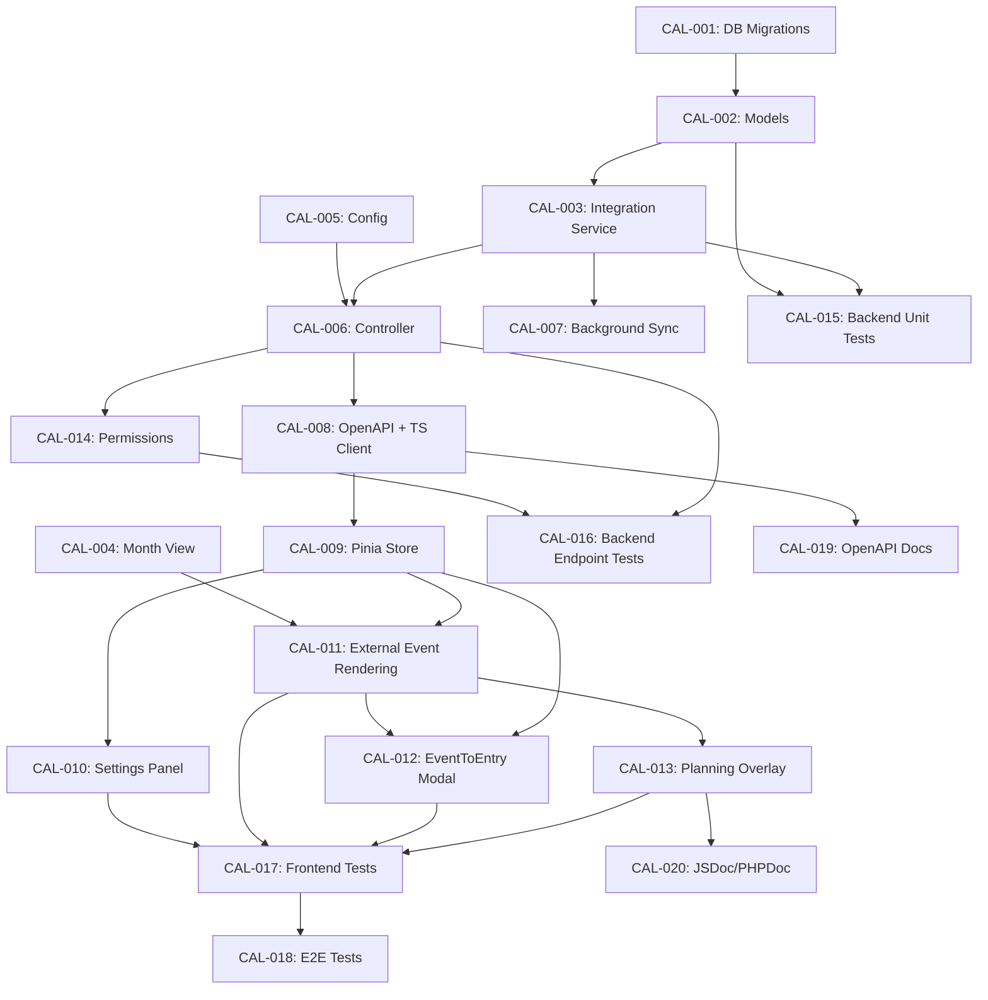

# Task Assignments: Enhanced Calendar View

Generated: 2026-02-06
PRD Reference: `/home/keven/Documents/solidtime-analysis/.features/05-calendar-enhanced/PRD.md`

## Task Assignment Table

| Task ID   | Description                                              | Type                 | Assigned Sub-Agent | Dependencies               | Effort   | Status |
|-----------|----------------------------------------------------------|----------------------|--------------------|-----------------------------|----------|--------|
| CAL-001  | Database Migrations for calendar_connections and calendar_events tables | Backend (Database)   | Backend Dev        | None                        | 4 hours  | To Do  |
| CAL-002  | Eloquent Models for CalendarConnection and CalendarEvent with factories | Backend (Models)     | Backend Dev        | CAL-001                    | 4 hours  | To Do  |
| CAL-003  | CalendarIntegrationService -- Core OAuth, sync, and conversion logic | Backend (Service)    | Backend Dev        | CAL-002                    | 16 hours | To Do  |
| CAL-004  | Month View Frontend Enhancement (dayGridMonth in FullCalendar) | Frontend (Vue)       | Frontend Dev       | None                        | 6 hours  | To Do  |
| CAL-005  | Calendar Integration Configuration (config/services.php, .env) | Backend (Config)     | Backend Dev        | None                        | 2 hours  | To Do  |
| CAL-006  | CalendarIntegrationController -- REST API endpoints       | Backend (Controller) | Backend Dev        | CAL-003, CAL-005          | 12 hours | To Do  |
| CAL-007  | Background Sync Job (SyncCalendarEventsJob + scheduled command) | Backend (Job/Queue)  | Backend Dev        | CAL-003                    | 6 hours  | To Do  |
| CAL-008  | OpenAPI Spec Update and TypeScript Client Regeneration    | Backend/Frontend     | Backend Dev        | CAL-006                    | 4 hours  | To Do  |
| CAL-009  | Pinia Store for Calendar Integrations (useCalendarIntegrations.ts) | Frontend (Store)     | Frontend Dev       | CAL-008                    | 6 hours  | To Do  |
| CAL-010  | CalendarSettingsPanel Component (connection management UI) | Frontend (Vue)       | Frontend Dev       | CAL-009                    | 8 hours  | To Do  |
| CAL-011  | External Event Rendering in FullCalendar (overlay events) | Frontend (Vue)       | Frontend Dev       | CAL-009, CAL-004          | 10 hours | To Do  |
| CAL-012  | EventToEntryModal Component (convert external event to time entry) | Frontend (Vue)       | Frontend Dev       | CAL-009, CAL-011          | 8 hours  | To Do  |
| CAL-013  | Planning vs Actual Overlay Mode (planned vs tracked comparison) | Frontend (Vue)       | Frontend Dev       | CAL-011                    | 12 hours | To Do  |
| CAL-014  | Calendar Integration Permissions (register + assign to roles) | Backend (Permissions)| Backend Dev        | CAL-006                    | 3 hours  | To Do  |
| CAL-015  | Backend Unit Tests -- Models and CalendarIntegrationService | QA (Backend)         | Backend Dev        | CAL-002, CAL-003          | 8 hours  | To Do  |
| CAL-016  | Backend Endpoint Tests -- CalendarIntegration and CalendarEvent | QA (Backend)         | Backend Dev        | CAL-006, CAL-014          | 10 hours | To Do  |
| CAL-017  | Frontend Component Tests (Vitest for all new Calendar components) | QA (Frontend)        | Frontend Dev       | CAL-010, CAL-011, CAL-012, CAL-013 | 8 hours  | To Do  |
| CAL-018  | E2E Tests (Playwright for month view, integration, conversion) | QA (E2E)             | Frontend Dev       | CAL-017                    | 8 hours  | To Do  |
| CAL-019  | Update OpenAPI Specification Documentation                | Documentation        | Backend Dev        | CAL-008                    | 3 hours  | To Do  |
| CAL-020  | JSDoc and PHPDoc Inline Documentation                     | Documentation        | Shared             | All implementation tasks    | 3 hours  | To Do  |
| CAL-021  | Calendar Events Cleanup Command (delete events older than 90 days, weekly cron in Kernel.php) | Backend (Console)    | Backend Dev        | CAL-002                    | 3 hours  | To Do  |

## Sprint Allocation

### Sprint 1 (Week 1) -- Foundation

| Task ID  | Assigned To  | Effort  | Status |
|----------|-------------|---------|--------|
| CAL-001 | Backend Dev  | 4 hours | To Do  |
| CAL-002 | Backend Dev  | 4 hours | To Do  |
| CAL-004 | Frontend Dev | 6 hours | To Do  |
| CAL-005 | Backend Dev  | 2 hours | To Do  |
| CAL-014 | Backend Dev  | 3 hours | To Do  |

**Sprint 1 Total**: 19 hours (10 SP)

### Sprint 2 (Week 2-3) -- API and Backend

| Task ID  | Assigned To  | Effort   | Status |
|----------|-------------|----------|--------|
| CAL-003 | Backend Dev  | 16 hours | To Do  |
| CAL-006 | Backend Dev  | 12 hours | To Do  |
| CAL-007 | Backend Dev  | 6 hours  | To Do  |
| CAL-008 | Backend Dev  | 4 hours  | To Do  |
| CAL-021 | Backend Dev  | 3 hours  | To Do  |

**Sprint 2 Total**: 41 hours (19 SP)

### Sprint 3 (Week 3-4) -- Frontend Integration

| Task ID  | Assigned To  | Effort   | Status |
|----------|-------------|----------|--------|
| CAL-009 | Frontend Dev | 6 hours  | To Do  |
| CAL-010 | Frontend Dev | 8 hours  | To Do  |
| CAL-011 | Frontend Dev | 10 hours | To Do  |
| CAL-012 | Frontend Dev | 8 hours  | To Do  |

**Sprint 3 Total**: 32 hours (18 SP)

### Sprint 4 (Week 5) -- Planning Overlay and Backend Tests

| Task ID  | Assigned To  | Effort   | Status |
|----------|-------------|----------|--------|
| CAL-013 | Frontend Dev | 12 hours | To Do  |
| CAL-015 | Backend Dev  | 8 hours  | To Do  |
| CAL-016 | Backend Dev  | 10 hours | To Do  |

**Sprint 4 Total**: 30 hours (18 SP)

### Sprint 5 (Week 6) -- Frontend Tests, E2E, and Documentation

| Task ID  | Assigned To  | Effort  | Status |
|----------|-------------|---------|--------|
| CAL-017 | Frontend Dev | 8 hours | To Do  |
| CAL-018 | Frontend Dev | 8 hours | To Do  |
| CAL-019 | Backend Dev  | 3 hours | To Do  |
| CAL-020 | Shared       | 3 hours | To Do  |

**Sprint 5 Total**: 22 hours (14 SP)

## Dependency Graph

## Critical Path

**CAL-001 -> CAL-002 -> CAL-003 -> CAL-006 -> CAL-008 -> CAL-009 -> CAL-011 -> CAL-013 -> CAL-017 -> CAL-018**

Total critical path duration: **84 hours** (approximately 10.5 working days)

## Parallelizable Work Streams

| Stream | Tasks | Duration |
|--------|-------|----------|
| Backend Foundation | CAL-001 -> CAL-002 -> CAL-003 -> CAL-006 -> CAL-007, CAL-008, CAL-014 | 42h |
| Frontend Foundation | CAL-004 (independent, no backend dependency) | 6h |
| Frontend Integration | CAL-009 -> CAL-010, CAL-011, CAL-012 -> CAL-013 | 44h (after CAL-008) |
| Backend Testing | CAL-015, CAL-016 (after CAL-003 and CAL-006) | 18h |
| Frontend Testing | CAL-017 -> CAL-018 (after all frontend impl) | 16h |
| Documentation | CAL-019, CAL-020 (after implementation complete) | 6h |

## Dependency Risk Assessment

| Risk | Affected Tasks | Mitigation |
|------|---------------|------------|
| CAL-003 (Integration Service) is the largest single task and blocks CAL-006, CAL-007, CAL-015 | CAL-006, CAL-007, CAL-015 | Break CAL-003 into sub-tasks (Google provider, Microsoft provider, core service) for parallel development; start with Google first |
| CAL-006 (Controller) blocks multiple downstream tasks (CAL-008, CAL-014, CAL-016) | CAL-008, CAL-014, CAL-016 | Prioritize CAL-006 completion; stub endpoints early to unblock CAL-008 |
| CAL-011 (External Event Rendering) depends on both CAL-009 (store) and CAL-004 (month view) | CAL-012, CAL-013, CAL-017 | CAL-004 is independent and can be completed in Sprint 1; ensure CAL-009 is started early in Sprint 3 |
| CAL-020 (Documentation) depends on all implementation tasks | CAL-020 | Write documentation incrementally as each task completes rather than batching at the end |

## Status Assignment Notes

All tasks are currently assigned **To Do** status because:

- No external constraints are blocking any initial tasks.
- CAL-001, CAL-004, and CAL-005 have no dependencies and can be started immediately.
- Dependent tasks (e.g., CAL-002 depends on CAL-001) are **To Do** (not Blocked) because their dependencies are also To Do and ready to be scheduled.
- No tasks are marked as **Blocked** since there are no external dependencies (such as third-party API credential provisioning) that are unresolved. Google and Microsoft OAuth credentials will be configured as part of CAL-005.

## Resource Allocation Summary

| Role | Tasks | Total Effort |
|------|-------|-------------|
| Backend Dev | CAL-001, CAL-002, CAL-003, CAL-005, CAL-006, CAL-007, CAL-008, CAL-014, CAL-015, CAL-016, CAL-019, CAL-021 | 75 hours |
| Frontend Dev | CAL-004, CAL-009, CAL-010, CAL-011, CAL-012, CAL-013, CAL-017, CAL-018 | 66 hours |
| Shared | CAL-020 | 3 hours |
| **Total** | **21 tasks** | **144 hours** |
