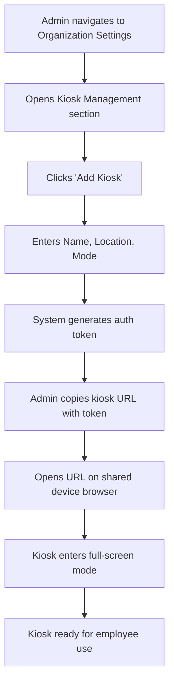
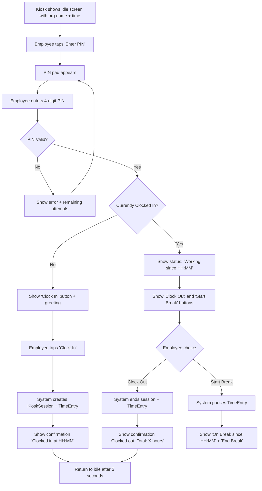
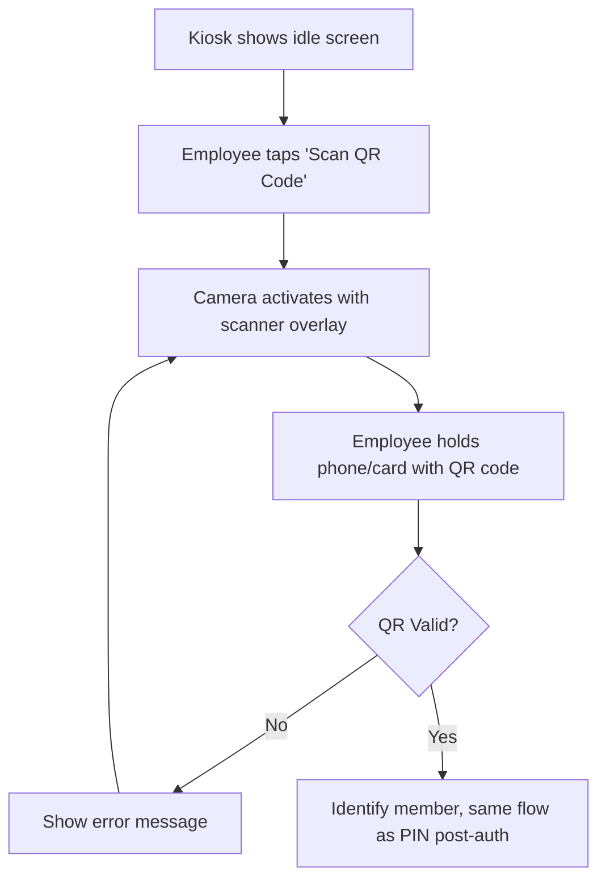
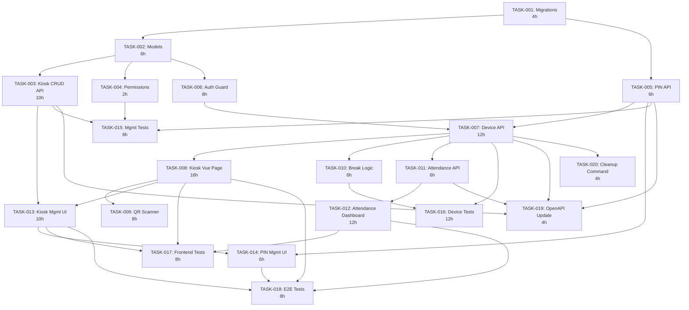

# PRD: Kiosk & Clock Mode for Solidtime

Generated: 2026-02-06
Version: 1.0

## Table of Contents

1. [Source Feature Reference](#1-source-feature-reference)
2. [Technical Interpretation](#2-technical-interpretation)
3. [Functional Specifications](#3-functional-specifications)
4. [Technical Requirements & Constraints](#4-technical-requirements--constraints)
5. [User Stories with Acceptance Criteria](#5-user-stories-with-acceptance-criteria)
6. [Task Breakdown Structure](#6-task-breakdown-structure)
7. [Dependencies & Integration Points](#7-dependencies--integration-points)
8. [Risk Assessment & Mitigation](#8-risk-assessment--mitigation)
9. [Testing & Validation Requirements](#9-testing--validation-requirements)
10. [Monitoring & Observability](#10-monitoring--observability)
11. [Success Metrics & Definition of Done](#11-success-metrics--definition-of-done)
12. [Technical Debt & Future Considerations](#12-technical-debt--future-considerations)
13. [Appendices](#13-appendices)

---

## Amendments (2026-02-06 Review)

> These amendments supersede conflicting content in the original PRD sections below.
> Reference: `.features/SHARED-FOUNDATIONS.md` and `.features/PRD-REVIEW-REPORT.md`

### AMD-01: Task ID Prefix
All task IDs in this PRD are now prefixed with `KIO-`. E.g., TASK-001 becomes KIO-001.

### AMD-02: Migration Timestamps (SF-03)
All migrations use date prefix `2026_03_06_`.

### AMD-03: Modular Permissions (SF-08)
Permissions are registered via `App\Permissions\KioskPermissions::register()` instead of directly modifying `JetstreamServiceProvider`.

### AMD-04: PIN Uniqueness Design Fix — CRITICAL
bcrypt produces non-deterministic hashes, making database-level uniqueness checking impossible with `pin_hash` alone.

**Solution**: Add a deterministic uniqueness-check column alongside the bcrypt hash:

```php
// members table migration addition
$table->string('kiosk_pin_check', 64)->nullable()->unique();  // SHA-256 for uniqueness
$table->string('kiosk_pin_hash')->nullable();                  // bcrypt for verification
```

**Workflow**:
1. When a member sets their PIN, compute `SHA-256(organization_id + ':' + pin_plaintext)` → store in `kiosk_pin_check`
2. Also compute `bcrypt(pin_plaintext)` → store in `kiosk_pin_hash`
3. The `kiosk_pin_check` column has a unique index — database prevents duplicate PINs within an org
4. During kiosk authentication, the PIN is verified using `Hash::check(pin, kiosk_pin_hash)` (bcrypt)
5. The `kiosk_pin_check` column is NEVER used for authentication, only for uniqueness enforcement

**Security note**: The SHA-256 hash is salted with `organization_id` to prevent cross-org PIN collision detection. While SHA-256 is not password-safe on its own, the PIN is also stored as bcrypt for actual verification, and the SHA-256 is only used for uniqueness (not auth).

### AMD-05: QR Code TTL Strategy
The 5-minute TTL is retained for **dynamic QR codes** (generated on-demand from the profile page for phone-based scanning). For **printed badge** scenarios:

**New: Badge QR Mode**
- Admin can generate a "badge QR" for a member with a configurable TTL (24h, 7d, 30d, or no expiry)
- Badge QR uses a separate `kiosk_badge_token` column on the `members` table
- Badge QR tokens are revocable by admin at any time
- The kiosk authentication endpoint accepts both dynamic QR tokens and badge tokens

**New task: KIO-021 — Badge QR Token Support**
- Add `kiosk_badge_token` and `kiosk_badge_token_expires_at` to members migration
- Add admin API endpoint for generating/revoking badge tokens
- Add badge QR generation in admin UI
- Effort: 6h / 3 SP
- Dependencies: KIO-001, KIO-004
- Sprint: 2

### AMD-06: Kiosk Delete Route Middleware Fix
The kiosk delete route `Route::delete('/kiosks/{kiosk}', ...)` MUST include `check-organization-blocked` middleware, per CLAUDE.md convention that all write endpoints use this middleware.

### AMD-07: Timezone Handling
The kiosk API endpoints accept and return timestamps in **UTC**. The kiosk frontend converts UTC to the organization's configured timezone for display. The `TimeEntry` created by clock-in stores `start` in UTC (matching existing time entry behavior). The kiosk full-screen page fetches the organization's timezone from the kiosk config and uses it for the displayed clock.

### AMD-08: Token-in-URL Mitigation
The kiosk URL token security concern is mitigated by:
1. HTTPS is **required** (enforce via middleware or environment check)
2. The kiosk token has a **configurable expiry** (default 30 days, admin-configurable)
3. Kiosk tokens are single-device: the URL should be opened once and the browser session maintained
4. Add `Cache-Control: no-store` and `X-Robots-Tag: noindex` headers to the kiosk page response
5. Admin can revoke/regenerate the kiosk token at any time from the admin panel
6. Future enhancement: consider a short-lived setup token that establishes a cookie-based session

### AMD-09: Split TASK-008 (Kiosk Full-Screen Page)
Formalize the PRD's own suggestion:
- **KIO-008a**: Kiosk idle screen + PIN entry + QR scanner (8h / 4 SP)
- **KIO-008b**: Clock status display + clock in/out + break buttons (8h / 4 SP)
KIO-008b depends on KIO-008a. Both are in Sprint 2.

### AMD-10: Split TASK-007 (Kiosk Device API)
Split by authentication vs. clock operations:
- **KIO-007a**: PIN authentication + QR authentication endpoints (6h / 4 SP)
- **KIO-007b**: Clock in/out + break start/end + status endpoints (6h / 4 SP)
KIO-007b depends on KIO-007a. Both are in Sprint 2.

### AMD-11: Frontend Dev Sprint 1 Utilization
Move TypeScript type definitions and kiosk layout scaffolding into Sprint 1:
- **KIO-022 — Create TypeScript types for kiosk models** (2h / 1 SP, Sprint 1, no dependencies)
- **KIO-023 — Scaffold kiosk standalone Vue SPA layout** (3h / 2 SP, Sprint 1, no dependencies)

### AMD-12: Testing Earlier
Move KIO-015 (KioskSessionService unit tests) to Sprint 3 alongside KIO-006 implementation, not Sprint 4. Unit tests should be written alongside implementation.

### AMD-13: `HasFactory` on KioskPinAttempt
The `KioskPinAttempt` model must include `HasFactory` trait for testing.

---

## 1. Source Feature Reference

### Feature Information

- **Feature ID**: 06-kiosk-clock-mode
- **Title**: Kiosk & Clock Mode
- **Feature Branch**: `feature/kiosk-clock-mode` (to be created from `main`)
- **Priority**: P1
- **Status**: PRD Development

### Feature Summary

Kiosk & Clock Mode enables organizations to deploy solidtime on shared devices (tablets, wall-mounted screens, reception terminals) where multiple employees can clock in and out using simplified authentication (4-digit PIN or QR code scan). The feature introduces a dedicated full-screen kiosk interface, independent from the normal authenticated SPA, with a token-based authentication model at the device level and per-punch member identification. An accompanying Attendance Dashboard provides real-time visibility into who is currently clocked in, on break, or off.

### Current System State

Solidtime currently provides:

- **Time entries** with `start`/`end` (supports timer-style tracking via the web SPA)
- **Members** tied to **Organizations** via the `members` pivot table (UUID PKs, `role` column)
- **Role-based access control**: Owner, Admin, Manager, Employee, Placeholder (defined in `App\Enums\Role`)
- **Web SPA** via Inertia.js (Vue 3 + TypeScript) with `auth:web` session-based auth for pages
- **API** via Laravel Passport (`auth:api`) for programmatic access
- **No kiosk functionality**, no PIN-based auth, no shared-device support, no QR code auth, no break tracking, no attendance dashboard

---

## 2. Technical Interpretation

### Business-to-Technical Translation

| Business Requirement | Technical Implementation |
|---|---|
| Admin registers a shared device as a kiosk terminal | New `Kiosk` model with token-based auth; admin management API under `/organizations/{organization}/kiosks` |
| Employees identify via 4-digit PIN on kiosk | `pin_hash` column on `members` table; PIN entry UI on the kiosk Vue page; validation endpoint |
| Employees identify via QR code scan | QR code contains a signed, rotating token tied to the member; camera-based scanner component on the kiosk UI |
| Clock in/out creates time entries | New `KioskSession` model tracking shift state; maps to `TimeEntry` records via `KioskService` |
| Break tracking within a shift | `KioskSession` has break state (`on_break_since`); break start/end creates break time entries or pauses the clock |
| Punch-only mode restricts interface | `Kiosk.mode` column: `full` or `punch_only`; kiosk UI conditionally hides non-punch features |
| Attendance dashboard shows who's in/out | New Vue page under `auth:web` routes; queries active `KioskSession` records for the organization |

### Architecture Overview

```
+-------------------+     +------------------+     +------------------+
|                   |     |                  |     |                  |
|  Kiosk Device     |     |  Web SPA         |     |  API Clients     |
|  (Full-screen     |     |  (AppLayout)     |     |  (Passport)      |
|   Vue page)       |     |                  |     |                  |
|                   |     |                  |     |                  |
+--------+----------+     +--------+---------+     +--------+---------+
         |                         |                         |
         | kiosk-token             | auth:web                | auth:api
         | (custom guard)          | (session)               | (Passport)
         |                         |                         |
+--------v---------+---------------v-------------------------v---------+
|                                                                      |
|                    Laravel Application                               |
|                                                                      |
|  +------------------+  +-------------------+  +-------------------+  |
|  | KioskController  |  | AttendanceCtrl    |  | TimeEntryCtrl     |  |
|  | (Api/V1/Kiosk/)  |  | (Web)             |  | (existing)        |  |
|  +--------+---------+  +---------+---------+  +---------+---------+  |
|           |                      |                       |           |
|  +--------v----------------------v-----------------------v--------+  |
|  |                      Service Layer                             |  |
|  |  KioskService  |  KioskSessionService  |  TimeEntryService     |  |
|  +----------------+----------------------++-----------------------+  |
|           |                      |                       |           |
|  +--------v----------------------v-----------------------v--------+  |
|  |                      Eloquent Models                           |  |
|  |  Kiosk  |  KioskSession  |  Member  |  TimeEntry               |  |
|  +---------+----------------+---------+---------------------------+  |
|                                                                      |
+----------------------------------------------------------------------+
         |
+--------v-------------------------------------------------------------+
|                         PostgreSQL                                    |
|  kiosks  |  kiosk_sessions  |  members (+ pin_hash)  |  time_entries |
+----------------------------------------------------------------------|
```

### Key Design Decisions

1. **Separate authentication guard for kiosks**: Kiosk devices authenticate via a long-lived, revocable bearer token (stored in the `kiosks` table), not via Passport or Jetstream sessions. This prevents shared-device sessions from conflicting with personal user sessions.

2. **PIN stored as bcrypt hash on `members` table**: Adding `pin_hash` (nullable) to the existing `members` table rather than creating a separate table. This keeps the member-PIN relationship clean and allows PIN to be set from the existing member management UI.

3. **KioskSession as the shift state machine**: A `KioskSession` model tracks an employee's clock-in/out lifecycle for a single shift. When the session ends, it finalizes the `TimeEntry` record. Breaks are tracked as sub-entries or via state on the session.

4. **Standalone Vue page, not Inertia**: The kiosk page is served as a standalone Vue SPA (not via Inertia's `AppLayout`) to avoid requiring a personal user session. It loads at `/kiosk/{token}` and communicates directly with the kiosk API endpoints.

5. **QR codes are signed JWTs**: Each member's QR code is a short-lived JWT signed with the application key, containing the `member_id` and `organization_id`. This avoids the need for a database lookup to validate the QR code and makes QR codes non-replayable beyond their TTL.

---

## 3. Functional Specifications

### 3.1 Core Requirements

#### REQ-001: Kiosk Registration & Management

- **Description**: Admins (Owner/Admin roles) can create, view, update, and delete kiosk terminals for their organization. Each kiosk has a name, optional location description, an authentication token, and a mode (`full` or `punch_only`).
- **Priority**: P0
- **Edge Cases**:
  - Creating a kiosk when organization is blocked (subscription issue) should be rejected via `check-organization-blocked` middleware
  - Token regeneration must invalidate the old token immediately
  - Deleting a kiosk with active sessions should end all active sessions first
- **Error Scenarios**:
  - Non-admin attempts kiosk management -> 403 Forbidden
  - Invalid organization ID -> 404 Not Found

#### REQ-002: PIN Authentication for Members

- **Description**: Organization members can have a 4-digit numeric PIN set on their profile. On the kiosk, they enter this PIN to identify themselves for clock-in/out actions.
- **Priority**: P0
- **Edge Cases**:
  - Member has no PIN set -> kiosk shows "No PIN configured" error
  - Multiple members in same org have unique PINs (enforced by validation)
  - PIN change while a kiosk session is active -> does not affect current session
  - PIN brute-force protection: 5 failed attempts per member per kiosk in 15 minutes triggers a 10-minute lockout
- **Error Scenarios**:
  - Wrong PIN -> "Invalid PIN" error with remaining attempts count
  - Locked out -> "Too many failed attempts. Please wait or use QR code."

#### REQ-003: QR Code Authentication for Members

- **Description**: Members can generate a personal QR code from their profile settings. Scanning this QR code on a kiosk identifies the member and triggers clock-in/out.
- **Priority**: P1
- **Edge Cases**:
  - QR code expired (older than 5 minutes) -> reject with "QR code expired, please regenerate"
  - QR code from a different organization -> reject with "Invalid QR code"
  - Camera not available on kiosk device -> gracefully hide QR option, show PIN-only mode
- **Error Scenarios**:
  - Invalid/corrupted QR data -> "Could not read QR code"
  - Member account deactivated since QR generation -> "Member not found"

#### REQ-004: Clock In/Out

- **Description**: Once identified, the kiosk shows the member's current status and a prominent action button: "Clock In" (if not clocked in) or "Clock Out" (if currently clocked in). Clocking in creates a `KioskSession` and a running `TimeEntry`. Clocking out ends both.
- **Priority**: P0
- **Edge Cases**:
  - Member already has a running time entry from the web SPA -> kiosk should detect this and offer to either adopt it as a kiosk session or start fresh (configurable per kiosk)
  - Clock out without clock in (stale session from previous day) -> auto-close the old session at midnight and treat current action as a new clock in
  - Multiple rapid clock-in taps -> debounce; reject second request within 5 seconds
- **Error Scenarios**:
  - Network failure during clock out -> local state shows pending, retry on reconnect
  - Organization is blocked -> reject clock in with "Organization is currently suspended"

#### REQ-005: Break Tracking

- **Description**: While clocked in, a member can start and end breaks. Starting a break pauses the active time entry (sets `end` on the current time entry) and records the break start time on the `KioskSession`. Ending a break creates a new `TimeEntry` to continue tracking work time.
- **Priority**: P1
- **Edge Cases**:
  - Member clocks out while on break -> end the break first, then clock out
  - Break longer than 4 hours -> auto-end break and send notification to admin
  - Multiple breaks in a single shift -> each creates a gap in time entries
- **Error Scenarios**:
  - Starting a break when not clocked in -> "You must clock in first"
  - Ending a break when not on break -> "You are not currently on break"

#### REQ-006: Punch-Only Mode

- **Description**: When a kiosk is configured in `punch_only` mode, the interface only shows clock in/out and break buttons. No project selection, no task assignment, no description fields. All time entries created in punch-only mode have `project_id = null`, `task_id = null`, and `description = ''`.
- **Priority**: P1
- **Edge Cases**:
  - Switching mode from `full` to `punch_only` while sessions are active -> existing sessions continue with their current data
  - Admin can assign a default project to a punch-only kiosk -> all entries get this project
- **Error Scenarios**:
  - None specific beyond general kiosk errors

#### REQ-007: Attendance Dashboard

- **Description**: A new page accessible to users with `time-entries:view:all` permission (Owner/Admin/Manager) that shows a real-time overview of all organization members' attendance status: clocked in, on break, clocked out, with timestamps.
- **Priority**: P1
- **Edge Cases**:
  - Organization with 500+ members -> paginated with search/filter
  - Member clocked in via web SPA (not kiosk) -> show as "Working (Web)" to distinguish
  - No kiosks configured yet -> show empty state with setup guidance
- **Error Scenarios**:
  - Permission denied for Employee role -> 403 redirect to dashboard

### 3.2 User Workflows

#### Kiosk Setup Flow



#### Employee Clock-In Flow (PIN)



#### Employee Clock-In Flow (QR Code)



### 3.3 Business Rules

#### PIN Validation Rules

- PIN must be exactly 4 numeric digits (0000-9999)
- PIN must be unique within the organization
- PIN is stored as a bcrypt hash on `members.pin_hash`
- PIN lockout: 5 failed attempts per member per kiosk within 15 minutes -> 10-minute lockout
- Lockout counter resets on successful authentication

#### Kiosk Token Rules

- Token is a 64-character cryptographically random hex string
- Token is stored as a SHA-256 hash in the database
- Token can be regenerated (old token invalidated immediately)
- Token must be included in every kiosk API request as `Authorization: Bearer {token}`

#### Session State Machine

```
                  clock_in
    IDLE --------------------------> CLOCKED_IN
                                        |
                          start_break   |   clock_out
                        +---------------+----------+
                        |                          |
                        v                          v
                    ON_BREAK                    CLOCKED_OUT
                        |
                  end_break |
                        |
                        v
                    CLOCKED_IN
```

#### Time Entry Creation Rules

- Clock In: Creates a `TimeEntry` with `start = now()`, `end = null` (running timer)
- Clock Out: Sets `end = now()` on the running `TimeEntry`
- Start Break: Sets `end = now()` on the current `TimeEntry` (ending that work segment)
- End Break: Creates a new `TimeEntry` with `start = now()`, `end = null` (new work segment)
- All kiosk-created time entries use the member's `user_id`, `member_id`, and `organization_id`
- Kiosk time entries get a special tag or description prefix for audit trails (configurable)

#### Access Control Matrix

| Action | Owner | Admin | Manager | Employee | Kiosk Token |
|---|---|---|---|---|---|
| Create Kiosk | Yes | Yes | No | No | No |
| Update Kiosk | Yes | Yes | No | No | No |
| Delete Kiosk | Yes | Yes | No | No | No |
| View Kiosks | Yes | Yes | Yes | No | No |
| Set Member PIN | Yes | Yes | Yes (own reports) | Yes (own only) | No |
| Generate QR Code | Yes | Yes | Yes (own) | Yes (own only) | No |
| Clock In/Out via Kiosk | No | No | No | No | Yes (member-identified) |
| View Attendance Dashboard | Yes | Yes | Yes | No | No |

---

## 4. Technical Requirements & Constraints

### 4.1 System Architecture

The kiosk feature introduces a new authentication path alongside the existing Passport (API) and Jetstream (Web) paths.

```
                                 Laravel Application
                                 ===================

  Existing Auth Paths:                          New Auth Path:
  +------------------+                          +-------------------+
  | auth:web         |                          | auth:kiosk        |
  | (Jetstream       |                          | (Custom Guard)    |
  |  sessions)       |                          |                   |
  +------------------+                          +-------------------+
  | auth:api         |                          |                   |
  | (Passport)       |                          | Token from kiosks |
  +------------------+                          | table, resolved   |
                                                | to Kiosk model    |
                                                +-------------------+
```

### 4.2 Data Models

#### New: Kiosk Model

```php
/**
 * @property string $id               UUID primary key
 * @property string $name             Human-readable name (e.g., "Reception Tablet")
 * @property string|null $location    Optional location description
 * @property string $token_hash       SHA-256 hash of the bearer token
 * @property string $mode             'full' | 'punch_only'
 * @property string|null $default_project_id  Optional default project for punch-only mode
 * @property string $organization_id  FK to organizations
 * @property bool $is_active          Whether the kiosk is enabled
 * @property Carbon|null $last_activity_at  Last API request timestamp
 * @property Carbon|null $created_at
 * @property Carbon|null $updated_at
 */
class Kiosk extends Model
{
    use HasUuids;
    use CustomAuditable;

    protected $casts = [
        'is_active' => 'boolean',
        'last_activity_at' => 'datetime',
    ];
}
```

#### New: KioskSession Model

```php
/**
 * @property string $id               UUID primary key
 * @property string $kiosk_id         FK to kiosks
 * @property string $member_id        FK to members
 * @property string $user_id          FK to users (denormalized from member)
 * @property string $organization_id  FK to organizations
 * @property string $status           'clocked_in' | 'on_break' | 'clocked_out'
 * @property Carbon $clock_in_at      When the shift started
 * @property Carbon|null $clock_out_at When the shift ended
 * @property Carbon|null $on_break_since  When the current break started
 * @property int $total_break_seconds    Accumulated break time in seconds
 * @property string|null $active_time_entry_id  FK to time_entries (current running entry)
 * @property Carbon|null $created_at
 * @property Carbon|null $updated_at
 */
class KioskSession extends Model
{
    use HasUuids;
    use CustomAuditable;

    protected $casts = [
        'clock_in_at' => 'datetime',
        'clock_out_at' => 'datetime',
        'on_break_since' => 'datetime',
        'total_break_seconds' => 'integer',
    ];
}
```

#### Modified: Member Model

```php
// Add to existing members table:
// pin_hash: string|null (bcrypt hash of 4-digit PIN)
// qr_secret: string|null (secret used to generate signed QR tokens)
```

#### New: KioskPinAttempt Model (for rate-limiting)

```php
/**
 * @property string $id
 * @property string $kiosk_id
 * @property string $member_id
 * @property bool $successful
 * @property Carbon $attempted_at
 */
class KioskPinAttempt extends Model
{
    use HasUuids;
}
```

### 4.3 Database Migrations

#### Migration 001: Create kiosks table

```sql
CREATE TABLE kiosks (
    id UUID PRIMARY KEY DEFAULT gen_random_uuid(),
    name VARCHAR(255) NOT NULL,
    location VARCHAR(500) NULL,
    token_hash VARCHAR(64) NOT NULL,           -- SHA-256 hex
    mode VARCHAR(20) NOT NULL DEFAULT 'full',  -- 'full' | 'punch_only'
    default_project_id UUID NULL REFERENCES projects(id) ON DELETE SET NULL,
    organization_id UUID NOT NULL REFERENCES organizations(id) ON DELETE CASCADE,
    is_active BOOLEAN NOT NULL DEFAULT true,
    last_activity_at TIMESTAMP NULL,
    created_at TIMESTAMP NULL,
    updated_at TIMESTAMP NULL
);

CREATE INDEX idx_kiosks_token_hash ON kiosks(token_hash);
CREATE INDEX idx_kiosks_organization_id ON kiosks(organization_id);
```

#### Migration 002: Create kiosk_sessions table

```sql
CREATE TABLE kiosk_sessions (
    id UUID PRIMARY KEY DEFAULT gen_random_uuid(),
    kiosk_id UUID NOT NULL REFERENCES kiosks(id) ON DELETE CASCADE,
    member_id UUID NOT NULL REFERENCES members(id) ON DELETE RESTRICT,
    user_id UUID NOT NULL REFERENCES users(id) ON DELETE RESTRICT,
    organization_id UUID NOT NULL REFERENCES organizations(id) ON DELETE CASCADE,
    status VARCHAR(20) NOT NULL DEFAULT 'clocked_in',  -- 'clocked_in' | 'on_break' | 'clocked_out'
    clock_in_at TIMESTAMP NOT NULL,
    clock_out_at TIMESTAMP NULL,
    on_break_since TIMESTAMP NULL,
    total_break_seconds INTEGER NOT NULL DEFAULT 0,
    active_time_entry_id UUID NULL REFERENCES time_entries(id) ON DELETE SET NULL,
    created_at TIMESTAMP NULL,
    updated_at TIMESTAMP NULL
);

CREATE INDEX idx_kiosk_sessions_kiosk_id ON kiosk_sessions(kiosk_id);
CREATE INDEX idx_kiosk_sessions_member_id ON kiosk_sessions(member_id);
CREATE INDEX idx_kiosk_sessions_organization_id ON kiosk_sessions(organization_id);
CREATE INDEX idx_kiosk_sessions_status ON kiosk_sessions(status);
CREATE INDEX idx_kiosk_sessions_active ON kiosk_sessions(organization_id, status) WHERE status != 'clocked_out';
```

#### Migration 003: Add PIN and QR fields to members table

```sql
ALTER TABLE members ADD COLUMN pin_hash VARCHAR(255) NULL;
ALTER TABLE members ADD COLUMN qr_secret VARCHAR(64) NULL;
```

#### Migration 004: Create kiosk_pin_attempts table

```sql
CREATE TABLE kiosk_pin_attempts (
    id UUID PRIMARY KEY DEFAULT gen_random_uuid(),
    kiosk_id UUID NOT NULL REFERENCES kiosks(id) ON DELETE CASCADE,
    member_id UUID NOT NULL,
    successful BOOLEAN NOT NULL DEFAULT false,
    attempted_at TIMESTAMP NOT NULL,
    created_at TIMESTAMP NULL
);

CREATE INDEX idx_kiosk_pin_attempts_lookup
    ON kiosk_pin_attempts(kiosk_id, member_id, attempted_at);
```

### 4.4 API Contracts

#### Kiosk Management API (Admin, auth:api)

```yaml
# Create kiosk
POST /api/v1/organizations/{organization}/kiosks
Auth: Bearer {passport_token}
Middleware: auth:api, verified, check-organization-blocked
Request:
  name: string (required, max:255)
  location: string|null (max:500)
  mode: 'full' | 'punch_only' (default: 'full')
  default_project_id: uuid|null
Response 201:
  data:
    id: uuid
    name: string
    location: string|null
    mode: string
    default_project_id: uuid|null
    is_active: boolean
    token: string            # Plaintext token, only returned on creation
    kiosk_url: string        # Full URL for the kiosk page
    created_at: string
    updated_at: string

# List kiosks
GET /api/v1/organizations/{organization}/kiosks
Auth: Bearer {passport_token}
Response 200:
  data: KioskResource[]

# Update kiosk
PUT /api/v1/organizations/{organization}/kiosks/{kiosk}
Auth: Bearer {passport_token}
Middleware: check-organization-blocked
Request:
  name: string
  location: string|null
  mode: 'full' | 'punch_only'
  default_project_id: uuid|null
  is_active: boolean
Response 200:
  data: KioskResource

# Regenerate kiosk token
POST /api/v1/organizations/{organization}/kiosks/{kiosk}/regenerate-token
Auth: Bearer {passport_token}
Middleware: check-organization-blocked
Response 200:
  data:
    token: string           # New plaintext token
    kiosk_url: string

# Delete kiosk
DELETE /api/v1/organizations/{organization}/kiosks/{kiosk}
Auth: Bearer {passport_token}
Response 204
```

#### Member PIN Management API (auth:api)

```yaml
# Set/update PIN for a member
PUT /api/v1/organizations/{organization}/members/{member}/pin
Auth: Bearer {passport_token}
Middleware: check-organization-blocked
Request:
  pin: string (required, regex:/^\d{4}$/)
Response 200:
  message: "PIN updated successfully"

# Remove PIN for a member
DELETE /api/v1/organizations/{organization}/members/{member}/pin
Auth: Bearer {passport_token}
Response 200:
  message: "PIN removed successfully"

# Generate QR code token for a member
POST /api/v1/organizations/{organization}/members/{member}/qr-token
Auth: Bearer {passport_token}
Response 200:
  data:
    qr_payload: string      # Signed JWT to encode as QR
    expires_at: string       # ISO 8601
```

#### Kiosk Device API (auth:kiosk - token-based)

```yaml
# Get kiosk status (health check + config)
GET /api/v1/kiosk/status
Auth: Bearer {kiosk_token}
Response 200:
  data:
    kiosk:
      id: uuid
      name: string
      mode: string
      organization_name: string
    server_time: string

# Authenticate member by PIN
POST /api/v1/kiosk/auth/pin
Auth: Bearer {kiosk_token}
Request:
  pin: string (required, regex:/^\d{4}$/)
Response 200:
  data:
    member:
      id: uuid
      name: string
      profile_photo_url: string|null
    session:                 # null if not currently clocked in
      id: uuid
      status: string
      clock_in_at: string
      on_break_since: string|null
      total_break_seconds: integer
Response 401:
  error: "invalid_pin"
  message: "Invalid PIN"
  remaining_attempts: integer
Response 429:
  error: "locked_out"
  message: "Too many failed attempts"
  locked_until: string

# Authenticate member by QR code
POST /api/v1/kiosk/auth/qr
Auth: Bearer {kiosk_token}
Request:
  qr_payload: string (required)
Response 200:
  # Same shape as PIN auth response
Response 401:
  error: "invalid_qr"

# Clock in
POST /api/v1/kiosk/clock-in
Auth: Bearer {kiosk_token}
Request:
  member_id: uuid (required)
  project_id: uuid|null         # Only in 'full' mode
  task_id: uuid|null            # Only in 'full' mode
  description: string|null      # Only in 'full' mode
Response 201:
  data:
    session:
      id: uuid
      status: 'clocked_in'
      clock_in_at: string
    time_entry:
      id: uuid
      start: string
Response 409:
  error: "already_clocked_in"
  message: "Member is already clocked in"

# Clock out
POST /api/v1/kiosk/clock-out
Auth: Bearer {kiosk_token}
Request:
  member_id: uuid (required)
Response 200:
  data:
    session:
      id: uuid
      status: 'clocked_out'
      clock_in_at: string
      clock_out_at: string
      total_break_seconds: integer
      total_work_seconds: integer
Response 409:
  error: "not_clocked_in"

# Start break
POST /api/v1/kiosk/break/start
Auth: Bearer {kiosk_token}
Request:
  member_id: uuid (required)
Response 200:
  data:
    session:
      id: uuid
      status: 'on_break'
      on_break_since: string
Response 409:
  error: "not_clocked_in" | "already_on_break"

# End break
POST /api/v1/kiosk/break/end
Auth: Bearer {kiosk_token}
Request:
  member_id: uuid (required)
Response 200:
  data:
    session:
      id: uuid
      status: 'clocked_in'
      total_break_seconds: integer
    time_entry:
      id: uuid
      start: string
Response 409:
  error: "not_on_break"

# Get active sessions for attendance display (kiosk-side)
GET /api/v1/kiosk/attendance
Auth: Bearer {kiosk_token}
Response 200:
  data:
    members:
      - id: uuid
        name: string
        status: 'clocked_in' | 'on_break' | 'clocked_out'
        clock_in_at: string|null
        on_break_since: string|null
```

#### Attendance Dashboard API (auth:api)

```yaml
# Get attendance overview for organization
GET /api/v1/organizations/{organization}/attendance
Auth: Bearer {passport_token}
Permission: time-entries:view:all
Query:
  date: string (Y-m-d, default: today)
  status: 'all' | 'clocked_in' | 'on_break' | 'clocked_out' (default: 'all')
Response 200:
  data:
    summary:
      total_members: integer
      clocked_in: integer
      on_break: integer
      clocked_out: integer
    members:
      - member_id: uuid
        name: string
        status: 'clocked_in' | 'on_break' | 'clocked_out' | 'not_tracked'
        clock_in_at: string|null
        clock_out_at: string|null
        on_break_since: string|null
        total_work_seconds: integer
        total_break_seconds: integer
        kiosk_name: string|null
        source: 'kiosk' | 'web' | 'api'
```

### 4.5 Performance Requirements

- **Kiosk API response time**: 95th percentile < 300ms (critical for tap-and-go UX)
- **PIN validation**: < 200ms including bcrypt verification
- **QR code validation**: < 150ms (JWT verification is fast)
- **Attendance dashboard load**: < 1s for organizations with up to 500 members
- **Concurrent kiosk sessions**: Support 100 simultaneous active kiosks per organization
- **Kiosk idle page**: < 50ms re-render on status refresh (every 30 seconds)

### 4.6 Security Requirements

- **Kiosk token**: 64-character cryptographically random hex, stored as SHA-256 hash
- **PIN storage**: bcrypt with cost factor 10 (consistent with Laravel's default)
- **PIN uniqueness**: Enforced at the database level per organization via a database trigger or application-level validation on `members` table
- **QR code JWT**: Signed with `APP_KEY` using HS256, 5-minute TTL, includes `member_id`, `organization_id`, `iat`, `exp`
- **Rate limiting**: 5 PIN attempts per member per kiosk per 15-minute window; 60 kiosk API requests per minute per kiosk token
- **No CSRF on kiosk routes**: Kiosk API is token-authenticated, not session-based
- **Audit logging**: All clock-in/out/break events logged via the existing `CustomAuditable` trait
- **Token transmission**: Kiosk URL should use HTTPS; the token is in the URL path, not query string, to avoid logging in server access logs

---

## 5. User Stories with Acceptance Criteria

### USR-001: Kiosk Registration

**As an** organization admin
**I want to** register a shared device as a kiosk terminal
**So that** employees can clock in/out from a shared device without personal logins

**Priority**: P0
**Effort**: 5 story points
**Sprint**: 1

**Acceptance Criteria**:

- [ ] Admin can navigate to Organization Settings and see a "Kiosks" section
- [ ] Admin can create a new kiosk with name, optional location, and mode selection
- [ ] System generates and displays a unique kiosk token (shown only once)
- [ ] System shows the full kiosk URL that can be copied
- [ ] Admin can view a list of all kiosks with their status
- [ ] Admin can update kiosk name, location, mode, and active status
- [ ] Admin can regenerate the kiosk token (old one invalidated)
- [ ] Admin can delete a kiosk (all active sessions are ended)
- [ ] Non-admin users (Employee role) cannot see the Kiosks section
- [ ] Manager role can view kiosks but cannot create/update/delete

**Dependencies**: TASK-001, TASK-002, TASK-003, TASK-004

---

### USR-002: PIN Setup

**As an** organization member
**I want to** set a 4-digit PIN on my profile
**So that** I can quickly identify myself on kiosk terminals

**Priority**: P0
**Effort**: 3 story points
**Sprint**: 1

**Acceptance Criteria**:

- [ ] Members can set a 4-digit PIN from their member settings
- [ ] PIN must be exactly 4 numeric digits
- [ ] PIN must be unique within the organization (error shown if duplicate)
- [ ] PIN is stored as a bcrypt hash (never in plaintext)
- [ ] Admins can set/reset PINs for any member
- [ ] Employees can only set their own PIN
- [ ] Member can remove their PIN
- [ ] PIN change takes effect immediately

**Dependencies**: TASK-001, TASK-005

---

### USR-003: PIN Clock In/Out

**As an** employee at a shared kiosk
**I want to** enter my 4-digit PIN to clock in or out
**So that** I can track my attendance without a personal device

**Priority**: P0
**Effort**: 8 story points
**Sprint**: 2

**Acceptance Criteria**:

- [ ] Kiosk displays an idle screen with organization name, current time, and "Enter PIN" / "Scan QR" options
- [ ] Entering a valid PIN shows the member's name and current status
- [ ] If not clocked in: shows prominent "Clock In" button
- [ ] Tapping "Clock In" creates a kiosk session and a running time entry
- [ ] Confirmation screen shows "Clocked in at HH:MM" with member's name
- [ ] If already clocked in: shows "Clock Out" and "Start Break" buttons
- [ ] Tapping "Clock Out" ends the session and time entry
- [ ] Confirmation screen shows "Clocked out. Total: X hours Y minutes"
- [ ] Screen returns to idle state after 5 seconds
- [ ] Wrong PIN shows error with remaining attempts count
- [ ] After 5 failed attempts, member is locked out for 10 minutes
- [ ] Lockout message shows remaining wait time

**Dependencies**: TASK-001, TASK-002, TASK-005, TASK-006, TASK-007, TASK-008

---

### USR-004: QR Code Clock In/Out

**As an** employee at a shared kiosk
**I want to** scan my personal QR code to clock in or out
**So that** I can authenticate faster than typing a PIN

**Priority**: P1
**Effort**: 5 story points
**Sprint**: 2

**Acceptance Criteria**:

- [ ] Member can generate a QR code from their profile settings page
- [ ] QR code is displayed as an image that can be saved or printed
- [ ] QR code contains a signed JWT with 5-minute expiry
- [ ] Kiosk has a "Scan QR Code" button that activates the camera
- [ ] Camera overlay shows a scanning frame
- [ ] Valid QR code immediately identifies the member (same flow as PIN)
- [ ] Expired QR code shows "QR code expired, please regenerate"
- [ ] Invalid QR code shows "Could not read QR code"
- [ ] QR code from wrong organization shows "Invalid QR code"
- [ ] Camera permission denied gracefully hides QR option

**Dependencies**: TASK-001, TASK-005, TASK-006, TASK-007, TASK-009

---

### USR-005: Break Tracking

**As an** employee at a shared kiosk
**I want to** start and end breaks during my shift
**So that** my work time is accurately tracked excluding break periods

**Priority**: P1
**Effort**: 5 story points
**Sprint**: 3

**Acceptance Criteria**:

- [ ] While clocked in, "Start Break" button is visible
- [ ] Starting a break sets session status to "on_break" and ends the current time entry
- [ ] While on break, screen shows "On break since HH:MM" and an "End Break" button
- [ ] Ending a break sets session status back to "clocked_in" and starts a new time entry
- [ ] Break duration is accumulated in `total_break_seconds`
- [ ] Clocking out while on break automatically ends the break first
- [ ] Multiple breaks per shift are supported
- [ ] Break time entries are distinguishable from work time entries

**Dependencies**: TASK-006, TASK-007, TASK-008, TASK-010

---

### USR-006: Punch-Only Mode

**As an** organization admin
**I want to** configure a kiosk in punch-only mode
**So that** employees can only clock in/out without needing to select projects or tasks

**Priority**: P1
**Effort**: 3 story points
**Sprint**: 2

**Acceptance Criteria**:

- [ ] Kiosk mode can be set to "punch_only" during creation or update
- [ ] In punch-only mode, kiosk UI only shows clock in/out and break buttons
- [ ] No project, task, or description fields are shown
- [ ] Time entries created in punch-only mode have null project/task and empty description
- [ ] If a default project is set on the kiosk, all entries use that project
- [ ] Full mode shows optional project/task selection during clock in

**Dependencies**: TASK-003, TASK-008

---

### USR-007: Attendance Dashboard

**As a** manager or admin
**I want to** see a real-time attendance dashboard
**So that** I know who is currently working, on break, or off

**Priority**: P1
**Effort**: 8 story points
**Sprint**: 3

**Acceptance Criteria**:

- [ ] New "Attendance" link appears in the sidebar for users with `time-entries:view:all` permission
- [ ] Dashboard shows summary cards: Total Members, Clocked In, On Break, Clocked Out
- [ ] Below summary, a table lists all members with their current status
- [ ] Table columns: Name, Status, Clock In Time, Current Duration, Break Time, Source (Kiosk/Web)
- [ ] Status badges are color-coded: green (working), yellow (on break), gray (off)
- [ ] Dashboard auto-refreshes every 30 seconds
- [ ] Can filter by status (All / Clocked In / On Break / Clocked Out)
- [ ] Can filter by date to see historical attendance
- [ ] Search by member name
- [ ] Empty state shown when no kiosks are configured, with link to setup
- [ ] Employee role users cannot access this page (redirected to dashboard)

**Dependencies**: TASK-006, TASK-011, TASK-012

---

## 6. Task Breakdown Structure

### Phase 1: Foundation (Sprint 1) -- Database, Models, Auth

---

#### TASK-001: Database Migrations for Kiosk Feature

**Type**: Backend / Database
**Effort Estimate**: 4 hours (2 SP)
**Dependencies**: None

**Description**:
Create all database migrations for the kiosk feature: `kiosks`, `kiosk_sessions`, `kiosk_pin_attempts` tables, and add `pin_hash`/`qr_secret` columns to `members`.

**Files to create**:
- `database/migrations/2026_02_07_000001_create_kiosks_table.php`
- `database/migrations/2026_02_07_000002_create_kiosk_sessions_table.php`
- `database/migrations/2026_02_07_000003_add_pin_and_qr_fields_to_members_table.php`
- `database/migrations/2026_02_07_000004_create_kiosk_pin_attempts_table.php`

**Technical Requirements**:
- All tables use UUID primary keys (consistent with `HasUuids` trait)
- Foreign key constraints match existing patterns (`ON DELETE CASCADE` for org, `RESTRICT` for member)
- Add appropriate indexes for performance (token lookup, active session queries)
- Include rollback logic in `down()` methods

**Acceptance Criteria**:
- [ ] All migrations run successfully on a clean database
- [ ] All migrations roll back cleanly
- [ ] Foreign key constraints are correctly applied
- [ ] Indexes are present for all query-critical columns

---

#### TASK-002: Eloquent Models for Kiosk and KioskSession

**Type**: Backend
**Effort Estimate**: 6 hours (3 SP)
**Dependencies**: [TASK-001]

**Description**:
Create `Kiosk`, `KioskSession`, and `KioskPinAttempt` Eloquent models following existing codebase patterns. Update `Member` model with new relationships.

**Files to create**:
- `app/Models/Kiosk.php`
- `app/Models/KioskSession.php`
- `app/Models/KioskPinAttempt.php`
- `app/Enums/KioskMode.php`
- `app/Enums/KioskSessionStatus.php`

**Files to modify**:
- `app/Models/Member.php` -- add `kioskSessions()`, `kioskPinAttempts()` relationships and `pin_hash`/`qr_secret` to casts
- `app/Models/Organization.php` -- add `kiosks()` relationship

**Technical Requirements**:
- Use `HasUuids` and `CustomAuditable` traits on `Kiosk` and `KioskSession`
- `KioskMode` enum: `Full = 'full'`, `PunchOnly = 'punch_only'`
- `KioskSessionStatus` enum: `ClockedIn = 'clocked_in'`, `OnBreak = 'on_break'`, `ClockedOut = 'clocked_out'`
- Cast `mode` to `KioskMode` enum, `status` to `KioskSessionStatus` enum
- All relationships follow existing naming conventions (camelCase method names, snake_case FK columns)

**Acceptance Criteria**:
- [ ] All models follow `declare(strict_types=1)` and namespace conventions
- [ ] PHPDoc `@property` annotations are complete for all models
- [ ] All relationships are defined and return correct types
- [ ] Enums are backed string enums consistent with `Role.php` pattern

---

#### TASK-003: Kiosk Management API (CRUD)

**Type**: Backend
**Effort Estimate**: 10 hours (5 SP)
**Dependencies**: [TASK-002]

**Description**:
Create the admin-facing API for managing kiosks: create, list, show, update, delete, and token regeneration.

**Files to create**:
- `app/Http/Controllers/Api/V1/KioskController.php`
- `app/Http/Requests/V1/Kiosk/KioskStoreRequest.php`
- `app/Http/Requests/V1/Kiosk/KioskUpdateRequest.php`
- `app/Http/Resources/V1/Kiosk/KioskResource.php`
- `app/Http/Resources/V1/Kiosk/KioskCollection.php`
- `app/Http/Resources/V1/Kiosk/KioskWithTokenResource.php`
- `app/Service/KioskService.php`

**Files to modify**:
- `routes/api.php` -- add kiosk CRUD routes under organization prefix

**Technical Requirements**:
- Controller extends `App\Http\Controllers\Api\V1\Controller`
- Permission checks: `kiosks:create`, `kiosks:update`, `kiosks:delete`, `kiosks:view` (new permissions to be added)
- Token generation: `bin2hex(random_bytes(32))` for 64-char hex token
- Token stored as `hash('sha256', $token)` in database
- Plaintext token only returned in `KioskWithTokenResource` (create and regenerate responses)
- `KioskService` handles token generation, session cleanup on kiosk deletion
- Route naming: `api.v1.kiosks.*`
- Write routes use `check-organization-blocked` middleware

**API Routes**:
```php
Route::name('kiosks.')->prefix('/organizations/{organization}')->group(static function (): void {
    Route::get('/kiosks', [KioskController::class, 'index'])->name('index');
    Route::get('/kiosks/{kiosk}', [KioskController::class, 'show'])->name('show');
    Route::post('/kiosks', [KioskController::class, 'store'])->name('store')->middleware('check-organization-blocked');
    Route::put('/kiosks/{kiosk}', [KioskController::class, 'update'])->name('update')->middleware('check-organization-blocked');
    Route::post('/kiosks/{kiosk}/regenerate-token', [KioskController::class, 'regenerateToken'])->name('regenerate-token')->middleware('check-organization-blocked');
    Route::delete('/kiosks/{kiosk}', [KioskController::class, 'destroy'])->name('destroy');
});
```

**Acceptance Criteria**:
- [ ] All CRUD operations work correctly
- [ ] Token is returned only on create and regenerate
- [ ] Token regeneration invalidates old token immediately
- [ ] Deleting a kiosk ends all active sessions
- [ ] Permission checks enforce admin-only access
- [ ] Organization binding ensures kiosk belongs to correct org

---

#### TASK-004: Kiosk Permissions Registration

**Type**: Backend
**Effort Estimate**: 2 hours (1 SP)
**Dependencies**: [TASK-002]

**Description**:
Register new kiosk-related permissions in the Jetstream role configuration.

**Files to modify**:
- `app/Providers/JetstreamServiceProvider.php` -- add kiosk permissions to Owner, Admin, Manager roles

**New Permissions**:
- `kiosks:view` -- Owner, Admin, Manager
- `kiosks:create` -- Owner, Admin
- `kiosks:update` -- Owner, Admin
- `kiosks:delete` -- Owner, Admin

**Acceptance Criteria**:
- [ ] Owner and Admin roles have full kiosk CRUD permissions
- [ ] Manager role has view-only kiosk permission
- [ ] Employee role has no kiosk permissions
- [ ] Permissions are named consistently with existing patterns

---

#### TASK-005: Member PIN Management API

**Type**: Backend
**Effort Estimate**: 6 hours (3 SP)
**Dependencies**: [TASK-001, TASK-004]

**Description**:
Create endpoints for setting, updating, and removing PINs on members. Create endpoint for generating QR code tokens.

**Files to create**:
- `app/Http/Controllers/Api/V1/MemberPinController.php`
- `app/Http/Requests/V1/Member/MemberPinUpdateRequest.php`
- `app/Service/MemberPinService.php`
- `app/Service/KioskQrService.php`

**Files to modify**:
- `routes/api.php` -- add PIN and QR routes
- `app/Http/Controllers/Api/V1/MemberController.php` -- optionally add PIN-related actions as sub-routes

**Technical Requirements**:
- PIN validation: exactly 4 digits, regex `/^\d{4}$/`
- PIN uniqueness within organization: query existing members to check for collisions (exclude current member)
- PIN stored via `Hash::make($pin)` (bcrypt)
- PIN verification via `Hash::check($pin, $member->pin_hash)`
- QR token: JWT created with `firebase/php-jwt` or Laravel's built-in signing
  - Payload: `{ member_id, organization_id, iat, exp }`
  - Expiry: 5 minutes
  - Signed with `config('app.key')`
- Employee can set own PIN; Admin/Owner can set any member's PIN
- Permission: reuse `members:update` for admin, `time-entries:create:own` for self-service PIN

**Acceptance Criteria**:
- [ ] PIN can be set, updated, and removed
- [ ] PIN uniqueness is enforced within the organization
- [ ] PIN is stored as bcrypt hash, never returned in API responses
- [ ] QR token is generated as a signed JWT with 5-minute expiry
- [ ] Self-service: employees can only manage their own PIN
- [ ] Admin/Owner can manage any member's PIN

---

### Phase 2: Kiosk Auth & Core Clock (Sprint 2) -- Custom Guard, Clock In/Out, Kiosk UI

---

#### TASK-006: Custom Kiosk Authentication Guard

**Type**: Backend
**Effort Estimate**: 8 hours (5 SP)
**Dependencies**: [TASK-002]

**Description**:
Implement a custom Laravel authentication guard for kiosk token authentication. This guard resolves a `Kiosk` model from the bearer token, independent of Passport or Jetstream.

**Files to create**:
- `app/Auth/KioskGuard.php`
- `app/Auth/KioskTokenProvider.php`
- `app/Http/Middleware/AuthenticateKiosk.php`

**Files to modify**:
- `config/auth.php` -- add `kiosk` guard and provider
- `app/Providers/AuthServiceProvider.php` -- register the custom guard

**Technical Requirements**:
- Guard reads `Authorization: Bearer {token}` from request
- Hashes token with SHA-256 and looks up in `kiosks.token_hash`
- Checks `kiosks.is_active = true`
- Sets `last_activity_at = now()` on successful auth (throttled to once per minute to avoid excessive writes)
- Returns 401 if token is invalid or kiosk is inactive
- Rate limit: 60 requests per minute per kiosk token using Laravel's built-in rate limiter
- Guard should expose `kiosk()` helper method on the request or via a service

**Acceptance Criteria**:
- [ ] Valid kiosk token authenticates successfully
- [ ] Invalid token returns 401
- [ ] Inactive kiosk returns 401
- [ ] `last_activity_at` is updated on successful requests
- [ ] Rate limiting prevents abuse
- [ ] Guard does not interfere with existing `auth:api` or `auth:web` guards

---

#### TASK-007: Kiosk Device API Endpoints (Clock In/Out/Break)

**Type**: Backend
**Effort Estimate**: 12 hours (8 SP)
**Dependencies**: [TASK-005, TASK-006]

**Description**:
Create the kiosk-facing API endpoints for member authentication (PIN/QR), clock in, clock out, start break, end break, and status.

**Files to create**:
- `app/Http/Controllers/Api/V1/Kiosk/KioskDeviceController.php`
- `app/Http/Requests/V1/Kiosk/KioskPinAuthRequest.php`
- `app/Http/Requests/V1/Kiosk/KioskQrAuthRequest.php`
- `app/Http/Requests/V1/Kiosk/KioskClockInRequest.php`
- `app/Http/Requests/V1/Kiosk/KioskClockOutRequest.php`
- `app/Http/Requests/V1/Kiosk/KioskBreakRequest.php`
- `app/Http/Resources/V1/Kiosk/KioskSessionResource.php`
- `app/Http/Resources/V1/Kiosk/KioskMemberResource.php`
- `app/Http/Resources/V1/Kiosk/KioskAttendanceResource.php`
- `app/Service/KioskSessionService.php`

**Files to modify**:
- `routes/api.php` -- add kiosk device routes with `auth:kiosk` middleware

**Technical Requirements**:
- All endpoints are under `/api/v1/kiosk/*` with `auth:kiosk` middleware
- PIN auth: verify `Hash::check()`, check rate-limiting via `KioskPinAttempt` records, return member info + current session status
- QR auth: decode and verify JWT, extract `member_id`, verify org match, return same data as PIN
- Clock in: create `KioskSession` + `TimeEntry` (via existing `TimeEntry` model), check for duplicate active session, respect `prevent_overlapping_time_entries` org setting
- Clock out: find active `KioskSession` for member, set `clock_out_at`, set `end` on active `TimeEntry`, update status
- Break start/end: transition session status, end/start time entries accordingly
- `KioskSessionService` encapsulates all state transition logic and time entry creation
- All actions within database transactions to prevent inconsistent state
- Debounce: reject duplicate clock-in/out within 5 seconds (compare against `KioskSession.clock_in_at`)

**API Routes**:
```php
Route::prefix('v1/kiosk')->name('v1.kiosk.')->middleware(['auth:kiosk'])->group(static function (): void {
    Route::get('/status', [KioskDeviceController::class, 'status'])->name('status');
    Route::post('/auth/pin', [KioskDeviceController::class, 'authPin'])->name('auth.pin');
    Route::post('/auth/qr', [KioskDeviceController::class, 'authQr'])->name('auth.qr');
    Route::post('/clock-in', [KioskDeviceController::class, 'clockIn'])->name('clock-in');
    Route::post('/clock-out', [KioskDeviceController::class, 'clockOut'])->name('clock-out');
    Route::post('/break/start', [KioskDeviceController::class, 'breakStart'])->name('break.start');
    Route::post('/break/end', [KioskDeviceController::class, 'breakEnd'])->name('break.end');
    Route::get('/attendance', [KioskDeviceController::class, 'attendance'])->name('attendance');
});
```

**Acceptance Criteria**:
- [ ] PIN authentication works with rate limiting
- [ ] QR authentication works with JWT verification
- [ ] Clock in creates session + time entry atomically
- [ ] Clock out ends session + time entry atomically
- [ ] Break start/end transitions work correctly
- [ ] Duplicate requests within 5 seconds are rejected
- [ ] All endpoints return correct error codes for invalid states
- [ ] Attendance endpoint returns all members' current status

---

#### TASK-008: Kiosk Full-Screen Vue Page

**Type**: Frontend
**Effort Estimate**: 16 hours (8 SP)
**Dependencies**: [TASK-007]

**Description**:
Create the standalone full-screen Vue application for the kiosk terminal. This is NOT an Inertia page; it is a separate Vue SPA served at `/kiosk/{token}` that communicates directly with the kiosk API.

**Files to create**:
- `resources/js/Pages/Kiosk/KioskApp.vue` -- Root component with state machine
- `resources/js/Pages/Kiosk/KioskIdleScreen.vue` -- Idle display with time and org name
- `resources/js/Pages/Kiosk/KioskPinPad.vue` -- 4-digit PIN entry with number pad
- `resources/js/Pages/Kiosk/KioskMemberStatus.vue` -- Shows member status + action buttons
- `resources/js/Pages/Kiosk/KioskConfirmation.vue` -- Post-action confirmation screen
- `resources/js/Pages/Kiosk/KioskBreakScreen.vue` -- On-break status display
- `resources/js/Pages/Kiosk/KioskErrorScreen.vue` -- Error/lockout display
- `resources/js/packages/ui/src/Kiosk/KioskClock.vue` -- Large clock display component
- `resources/js/packages/ui/src/Kiosk/KioskButton.vue` -- Large touch-friendly button
- `resources/js/packages/ui/src/Kiosk/KioskNumpad.vue` -- Numeric keypad component
- `resources/js/utils/useKiosk.ts` -- Kiosk Pinia store for state management
- `resources/js/types/kiosk.d.ts` -- TypeScript type definitions
- `resources/views/kiosk.blade.php` -- Blade template for standalone Vue mount

**Files to modify**:
- `routes/web.php` -- add `/kiosk/{token}` route serving the blade template
- `vite.config.js` -- add kiosk entry point if needed for separate bundle

**Technical Requirements**:
- Full-screen display (CSS `100vh`, no scroll, large touch targets min 48px)
- State machine: `idle` -> `authenticating` -> `member_status` -> `confirming` -> `idle`
- Clock display updates every second
- PIN pad: large buttons (min 64px), visual feedback on tap, auto-submit on 4th digit
- Confirmation screen auto-returns to idle after 5 seconds
- Responsive: works on tablet (768px+) and large screen (1024px+)
- Dark theme support (follows system preference)
- No Inertia dependency; uses direct `fetch()` calls to kiosk API
- Token extracted from URL path and stored in Pinia store
- Kiosk polls `/kiosk/status` every 30 seconds to verify connectivity
- Offline detection: if status check fails, show "Connection lost" overlay

**Acceptance Criteria**:
- [ ] Kiosk page loads at `/kiosk/{token}` without any user login
- [ ] PIN pad allows entering 4 digits with large touch-friendly buttons
- [ ] Successful PIN shows member name and status
- [ ] Clock in/out buttons are prominent and clearly labeled
- [ ] Confirmation screen displays with auto-return to idle
- [ ] Error states display clearly with guidance
- [ ] Screen is full-screen optimized with large fonts
- [ ] Works on tablets in landscape and portrait
- [ ] Clock updates in real-time on idle screen
- [ ] Connection loss is detected and displayed

---

#### TASK-009: QR Code Scanner Component

**Type**: Frontend
**Effort Estimate**: 8 hours (5 SP)
**Dependencies**: [TASK-008]

**Description**:
Add QR code scanning capability to the kiosk UI using the device camera, and add QR code generation to the member profile page.

**Files to create**:
- `resources/js/packages/ui/src/Kiosk/KioskQrScanner.vue` -- Camera-based QR scanner
- `resources/js/Components/Common/Member/MemberQrCodeModal.vue` -- QR generation/display modal

**Files to modify**:
- `resources/js/Pages/Kiosk/KioskApp.vue` -- integrate QR scanner as auth option
- `resources/js/Pages/Profile/Partials/` or member settings -- add QR code generation button

**Technical Requirements**:
- Use `html5-qrcode` npm package (or `@nicoding/qr-scanner`) for camera QR scanning
- Camera permission request with graceful fallback (hide QR option if denied)
- QR scanner overlay with scanning frame indicator
- On successful scan, extract JWT payload and call `/api/v1/kiosk/auth/qr`
- QR code generation: use `qrcode` npm package to render the JWT as a QR image
- Member can download/print the QR code
- QR code displayed with expiry countdown ("Valid for X minutes")
- Auto-refresh QR code when it expires (if modal is still open)

**Acceptance Criteria**:
- [ ] QR scanner activates camera with user permission
- [ ] Scanning a valid QR code identifies the member
- [ ] Camera permission denial hides the QR option gracefully
- [ ] Invalid QR codes show appropriate error messages
- [ ] QR code generation modal shows a readable QR code with expiry
- [ ] QR code can be downloaded as an image

---

### Phase 3: Attendance Dashboard & Polish (Sprint 3)

---

#### TASK-010: Break Tracking Logic & Time Entry Integration

**Type**: Backend
**Effort Estimate**: 6 hours (3 SP)
**Dependencies**: [TASK-007]

**Description**:
Implement the detailed break tracking logic in `KioskSessionService`, ensuring time entries are correctly split around breaks and total break time is accurately calculated.

**Files to modify**:
- `app/Service/KioskSessionService.php` -- add break logic
- `app/Models/KioskSession.php` -- add helper methods for break calculations

**Technical Requirements**:
- When a break starts: end the current `TimeEntry` (set `end = now()`)
- When a break ends: create a new `TimeEntry` (set `start = now()`, `end = null`)
- Accumulate break seconds: `total_break_seconds += now() - on_break_since`
- Clock out while on break: end break first (accumulate time), then clock out
- Break > 4 hours: log a warning (future: send notification)
- All operations within database transactions
- Handle edge case: break spanning midnight

**Acceptance Criteria**:
- [ ] Break start correctly ends the active time entry
- [ ] Break end correctly starts a new time entry
- [ ] Total break seconds are accurately accumulated
- [ ] Clock out during break works correctly
- [ ] Multiple breaks per shift are handled
- [ ] Time entries have no gaps or overlaps around breaks

---

#### TASK-011: Attendance Dashboard Backend API

**Type**: Backend
**Effort Estimate**: 6 hours (3 SP)
**Dependencies**: [TASK-007]

**Description**:
Create the backend API for the attendance dashboard, providing real-time attendance data for the organization.

**Files to create**:
- `app/Http/Controllers/Api/V1/AttendanceController.php`
- `app/Http/Requests/V1/Attendance/AttendanceIndexRequest.php`
- `app/Http/Resources/V1/Attendance/AttendanceResource.php`
- `app/Http/Resources/V1/Attendance/AttendanceSummaryResource.php`
- `app/Service/AttendanceService.php`

**Files to modify**:
- `routes/api.php` -- add attendance routes

**Technical Requirements**:
- Endpoint: `GET /api/v1/organizations/{organization}/attendance`
- Permission: `time-entries:view:all` (Owner/Admin/Manager only)
- Query active `KioskSession` records for the organization
- Also check for running `TimeEntry` records without a kiosk session (web/API users)
- Return summary counts + per-member status
- Support date filter (default: today) and status filter
- Optimize query to avoid N+1 (eager load member, user, kiosk relationships)
- Response includes source field ('kiosk' | 'web' | 'api') to distinguish tracking method

**Acceptance Criteria**:
- [ ] Endpoint returns correct summary counts
- [ ] Per-member status is accurate for kiosk sessions
- [ ] Web/API running time entries are included as "working" members
- [ ] Date filter works correctly
- [ ] Status filter works correctly
- [ ] Query performance is acceptable for 500+ members
- [ ] Permission check enforced

---

#### TASK-012: Attendance Dashboard Vue Page

**Type**: Frontend
**Effort Estimate**: 12 hours (5 SP)
**Dependencies**: [TASK-011]

**Description**:
Create the attendance dashboard Vue page within the main SPA (Inertia page with AppLayout).

**Files to create**:
- `resources/js/Pages/Attendance.vue` -- Main page component
- `resources/js/Components/Common/Attendance/AttendanceSummaryCards.vue`
- `resources/js/Components/Common/Attendance/AttendanceTable.vue`
- `resources/js/Components/Common/Attendance/AttendanceTableRow.vue`
- `resources/js/Components/Common/Attendance/AttendanceTableHeading.vue`
- `resources/js/Components/Common/Attendance/AttendanceStatusBadge.vue`
- `resources/js/Components/Common/Attendance/AttendanceFilterBar.vue`
- `resources/js/utils/useAttendance.ts` -- Pinia store for attendance data

**Files to modify**:
- `routes/web.php` -- add `/attendance` route
- `resources/js/Layouts/AppLayout.vue` -- add sidebar navigation item (ClockIcon)
- `resources/js/utils/permissions.ts` -- add `canViewAttendance` helper

**Technical Requirements**:
- Uses AppLayout (standard Inertia page pattern)
- Sidebar item visible only for users with `time-entries:view:all` permission
- Auto-refresh: use `@tanstack/vue-query` with `refetchInterval: 30000`
- Summary cards use existing `StatCard.vue` component pattern
- Table follows existing table patterns (`TableHeading.vue`, `TableRow.vue`)
- Status badges: green for clocked_in, yellow for on_break, gray for clocked_out/not_tracked
- Filter bar with status dropdown and date picker (reuse existing `DatePicker.vue`)
- Search input for member name filter
- Responsive: stack cards on mobile, horizontal on desktop
- Empty state component when no data

**Acceptance Criteria**:
- [ ] Page accessible at `/attendance`
- [ ] Sidebar navigation item appears for authorized users
- [ ] Summary cards show correct counts
- [ ] Table displays all members with correct statuses
- [ ] Auto-refresh updates data every 30 seconds
- [ ] Status filter works
- [ ] Date filter works
- [ ] Member search works
- [ ] Empty state shown when no kiosks configured
- [ ] Responsive design works on mobile and desktop

---

#### TASK-013: Kiosk Management Frontend (Admin Settings)

**Type**: Frontend
**Effort Estimate**: 10 hours (5 SP)
**Dependencies**: [TASK-003, TASK-008]

**Description**:
Create the admin UI for managing kiosks within the organization settings page.

**Files to create**:
- `resources/js/Components/Common/Kiosk/KioskTable.vue`
- `resources/js/Components/Common/Kiosk/KioskTableRow.vue`
- `resources/js/Components/Common/Kiosk/KioskTableHeading.vue`
- `resources/js/Components/Common/Kiosk/KioskCreateModal.vue`
- `resources/js/Components/Common/Kiosk/KioskEditModal.vue`
- `resources/js/Components/Common/Kiosk/KioskTokenModal.vue`
- `resources/js/Components/Common/Kiosk/KioskMoreOptionsDropdown.vue`
- `resources/js/utils/useKiosks.ts` -- Pinia store for kiosk management

**Files to modify**:
- `resources/js/Pages/Teams/Show.vue` or create a new settings sub-page
- `resources/js/Layouts/AppLayout.vue` -- potentially add kiosk management link for admins

**Technical Requirements**:
- Table shows kiosk name, location, mode, active status, last activity
- Create modal: name, location, mode selector, default project dropdown (for punch-only)
- After creation: display token in a modal with copy button and warning it won't be shown again
- Edit modal: update name, location, mode, active toggle
- "Regenerate Token" option in more-options dropdown with confirmation dialog
- "Delete" option with confirmation dialog
- Use existing UI component patterns (Modal, TextInput, SelectDropdown, etc.)
- `useKiosks.ts` store follows `useClients.ts` pattern with `@tanstack/vue-query`

**Acceptance Criteria**:
- [ ] Kiosk table displays all kiosks for the organization
- [ ] Create modal creates a kiosk and shows the token
- [ ] Edit modal updates kiosk settings
- [ ] Token regeneration works with confirmation
- [ ] Delete works with confirmation
- [ ] Mode selector shows "Full" and "Punch Only" options
- [ ] Active/inactive toggle works
- [ ] Last activity timestamp is displayed

---

#### TASK-014: Member PIN Management Frontend

**Type**: Frontend
**Effort Estimate**: 6 hours (3 SP)
**Dependencies**: [TASK-005, TASK-013]

**Description**:
Create the UI for managing member PINs in the member settings and profile pages.

**Files to create**:
- `resources/js/Components/Common/Member/MemberPinModal.vue`

**Files to modify**:
- `resources/js/Components/Common/Member/MemberEditModal.vue` -- add PIN set/change button
- `resources/js/Pages/Profile/Show.vue` -- add PIN section for self-service
- `resources/js/utils/useMembers.ts` -- add PIN-related mutations

**Technical Requirements**:
- PIN input: 4-digit numeric field with confirmation field
- Show "PIN is set" / "No PIN set" status indicator
- "Change PIN" and "Remove PIN" actions
- Self-service: employees see PIN management on their profile page
- Admin view: PIN management available in member edit modal
- Validation: 4 digits, must match confirmation
- Error display for duplicate PIN within organization

**Acceptance Criteria**:
- [ ] Members can set their own PIN from profile settings
- [ ] Admins can set/change PINs for any member
- [ ] PIN confirmation field prevents typos
- [ ] Duplicate PIN error is displayed
- [ ] PIN removal works
- [ ] PIN status indicator shows whether PIN is set

---

### Phase 4: Testing & Integration (Sprint 4)

---

#### TASK-015: Backend API Tests -- Kiosk Management

**Type**: Testing
**Effort Estimate**: 8 hours (5 SP)
**Dependencies**: [TASK-003, TASK-004, TASK-005]

**Description**:
Write comprehensive API endpoint tests for kiosk CRUD and member PIN management.

**Files to create**:
- `tests/Unit/Endpoint/Api/V1/KioskEndpointTest.php`
- `tests/Unit/Endpoint/Api/V1/MemberPinEndpointTest.php`
- `database/factories/KioskFactory.php`
- `database/factories/KioskSessionFactory.php`

**Technical Requirements**:
- Extend `ApiEndpointTestAbstract`
- Test CRUD operations with various roles (Owner, Admin, Manager, Employee)
- Test permission enforcement
- Test token generation and regeneration
- Test PIN uniqueness enforcement
- Test PIN CRUD for self-service and admin scenarios
- Test QR token generation and verification
- Test organization isolation (kiosk from org A not accessible from org B)
- Use `Passport::actingAs()` for authentication
- Use `createUserWithPermission()` pattern from existing tests

**Acceptance Criteria**:
- [ ] All CRUD operations tested with valid and invalid inputs
- [ ] Permission checks tested for each role
- [ ] Token generation and validation tested
- [ ] PIN uniqueness tested
- [ ] Organization isolation tested
- [ ] All tests pass

---

#### TASK-016: Backend API Tests -- Kiosk Device Endpoints

**Type**: Testing
**Effort Estimate**: 12 hours (8 SP)
**Dependencies**: [TASK-007, TASK-010]

**Description**:
Write comprehensive tests for kiosk device API endpoints (auth, clock in/out, break).

**Files to create**:
- `tests/Unit/Endpoint/Api/V1/KioskDeviceEndpointTest.php`
- `tests/Unit/Service/KioskSessionServiceTest.php`

**Technical Requirements**:
- Test PIN authentication with valid/invalid PINs
- Test PIN lockout after 5 failed attempts
- Test QR authentication with valid/invalid/expired JWTs
- Test clock in: creates session + time entry
- Test clock in when already clocked in: returns 409
- Test clock out: ends session + time entry
- Test clock out when not clocked in: returns 409
- Test break start/end state transitions
- Test clock out while on break
- Test rapid duplicate requests (debounce)
- Test invalid/inactive kiosk token
- Test concurrent requests for same member
- Test `KioskSessionService` unit tests for all state transitions

**Acceptance Criteria**:
- [ ] All authentication flows tested
- [ ] All state transitions tested
- [ ] Edge cases (duplicate, concurrent, cross-break clock-out) tested
- [ ] Rate limiting tested
- [ ] Service layer unit tested
- [ ] All tests pass

---

#### TASK-017: Frontend Component Tests

**Type**: Testing
**Effort Estimate**: 8 hours (5 SP)
**Dependencies**: [TASK-008, TASK-012, TASK-013]

**Description**:
Write Vitest component tests for the kiosk UI, attendance dashboard, and kiosk management components.

**Files to create**:
- `resources/js/Pages/Kiosk/__tests__/KioskPinPad.test.ts`
- `resources/js/Pages/Kiosk/__tests__/KioskMemberStatus.test.ts`
- `resources/js/Pages/Kiosk/__tests__/KioskIdleScreen.test.ts`
- `resources/js/Components/Common/Attendance/__tests__/AttendanceTable.test.ts`
- `resources/js/Components/Common/Kiosk/__tests__/KioskTable.test.ts`

**Technical Requirements**:
- Follow existing test patterns from `resources/js/packages/ui/src/Timesheet/__tests__/`
- Test PIN pad digit entry and auto-submit
- Test state transitions in kiosk UI
- Test confirmation screen auto-return
- Test attendance table rendering with various states
- Test kiosk management table and modals
- Mock API calls

**Acceptance Criteria**:
- [ ] PIN pad input handling tested
- [ ] State transitions tested
- [ ] Component rendering with various props tested
- [ ] Attendance dashboard data display tested
- [ ] All tests pass

---

#### TASK-018: E2E Playwright Tests

**Type**: Testing
**Effort Estimate**: 8 hours (5 SP)
**Dependencies**: [TASK-008, TASK-012, TASK-013, TASK-014]

**Description**:
Write end-to-end Playwright tests for critical kiosk workflows.

**Files to create**:
- `e2e/kiosk-clock-in-out.spec.ts`
- `e2e/kiosk-management.spec.ts`
- `e2e/attendance-dashboard.spec.ts`

**Technical Requirements**:
- Test kiosk creation by admin
- Test PIN setup by member
- Test full clock-in/out flow on kiosk page
- Test break flow on kiosk page
- Test attendance dashboard data visibility
- Test permission enforcement (employee cannot access kiosk mgmt)
- Seed test data using factories

**Acceptance Criteria**:
- [ ] Admin can create a kiosk and copy the URL
- [ ] Member can set a PIN
- [ ] Clock in/out flow works end-to-end
- [ ] Break flow works end-to-end
- [ ] Attendance dashboard displays correct data
- [ ] All E2E tests pass

---

#### TASK-019: OpenAPI Specification Update

**Type**: Backend / Documentation
**Effort Estimate**: 4 hours (2 SP)
**Dependencies**: [TASK-003, TASK-005, TASK-007, TASK-011]

**Description**:
Update the OpenAPI specification to include all new kiosk-related endpoints, and regenerate the TypeScript API client.

**Files to modify**:
- OpenAPI spec file (if manually maintained)
- `resources/js/packages/api/src/openapi.json.client.ts` (regenerated)

**Technical Requirements**:
- Add `@operationId` annotations to all new controller methods
- Run Scramble or the OpenAPI generation tool
- Regenerate the TypeScript client
- Verify all endpoint types are correct

**Acceptance Criteria**:
- [ ] All new endpoints documented in OpenAPI spec
- [ ] TypeScript client types match API contracts
- [ ] Client generation completes without errors

---

#### TASK-020: Stale Session Cleanup Command

**Type**: Backend
**Effort Estimate**: 4 hours (2 SP)
**Dependencies**: [TASK-007]

**Description**:
Create an artisan command to clean up stale kiosk sessions (e.g., sessions that were never clocked out, sessions spanning midnight).

**Files to create**:
- `app/Console/Commands/Kiosk/KioskCleanupStaleSessions.php`

**Files to modify**:
- `app/Console/Kernel.php` -- schedule the command to run every hour

**Technical Requirements**:
- Find sessions where `status != 'clocked_out'` and `clock_in_at` is more than 16 hours ago
- Auto-clock-out: set `clock_out_at` to the end of the day the session was started, end the time entry
- Log a warning for each auto-closed session
- Configurable max session duration via config (default: 16 hours)
- Idempotent: safe to run multiple times
- Clean up `kiosk_pin_attempts` older than 24 hours

**Acceptance Criteria**:
- [ ] Command identifies stale sessions correctly
- [ ] Auto-clock-out sets correct times
- [ ] Time entries are properly ended
- [ ] PIN attempt records are cleaned up
- [ ] Command is scheduled hourly
- [ ] Command is idempotent

---

### Complete Task List Summary

```
Total Tasks: 20
Total Effort: 152 hours (~76 SP)
Duration: 4 sprints (8 weeks at 2-week sprints)
Team Size Required: 2 developers (1 backend, 1 frontend) + QA

Backend Tasks: TASK-001 through TASK-007, TASK-010, TASK-011, TASK-015, TASK-016, TASK-019, TASK-020
Frontend Tasks: TASK-008, TASK-009, TASK-012, TASK-013, TASK-014, TASK-017, TASK-018
Mixed Tasks: TASK-004 (backend + config)
```

### Critical Path



**Critical Path**: TASK-001 -> TASK-002 -> TASK-006 -> TASK-007 -> TASK-008 -> TASK-018

**Critical Path Duration**: 4h + 6h + 8h + 12h + 16h + 8h = **54 hours minimum**

### Dependency Risk Assessment

| Risk | Impact | Mitigation |
|---|---|---|
| TASK-006 (Auth Guard) complexity delays TASK-007 | High -- blocks all kiosk device functionality | Start TASK-006 early in Sprint 2; it has no frontend dependency. Could use a simpler middleware-based approach as MVP. |
| TASK-008 (Kiosk Vue Page) is the largest single task | Medium -- any delay pushes QR, tests, and E2E | Split TASK-008 into sub-tasks: idle/PIN (8h) + status/clock (8h). PIN pad can be developed standalone. |
| Camera API for QR scanning (TASK-009) has device compatibility risks | Medium -- could fail on some tablets | QR is P1, not P0. If camera issues arise, PIN-only mode is fully functional. Research `html5-qrcode` compatibility early. |
| TASK-007 depends on both TASK-005 and TASK-006 | High -- both must complete before device API work | TASK-005 and TASK-006 can run in parallel. Assign to different developers. |

---

## 7. Dependencies & Integration Points

### 7.1 Internal Dependencies

| Component | Dependency Type | Description |
|---|---|---|
| `TimeEntry` model | Direct | Kiosk clock-in/out creates and ends `TimeEntry` records |
| `Member` model | Modified | Added `pin_hash` and `qr_secret` columns |
| `Organization` model | Extended | Added `kiosks()` relationship |
| `PermissionStore` | Used | Kiosk management permissions checked via existing system |
| `JetstreamServiceProvider` | Modified | New permissions registered for kiosk roles |
| `TimeEntryService` | Used | Kiosk respects `prevent_overlapping_time_entries` organization setting |
| `RecalculateSpentTimeForProject` job | Triggered | After kiosk clock-out, project spent time must be recalculated |
| `RecalculateSpentTimeForTask` job | Triggered | After kiosk clock-out, task spent time must be recalculated |

### 7.2 External Dependencies

| Dependency | Type | Usage |
|---|---|---|
| `firebase/php-jwt` or similar | PHP Package (new) | QR code JWT creation and verification |
| `html5-qrcode` | NPM Package (new) | Browser-based QR code scanning on kiosk |
| `qrcode` | NPM Package (new) | QR code image generation for member profile |
| Existing Passport auth | Unchanged | Admin kiosk management API still uses Passport tokens |
| Existing Jetstream sessions | Unchanged | Attendance dashboard page uses web sessions |

### 7.3 Integration Specifications

#### Time Entry Creation from Kiosk

```php
// app/Service/KioskSessionService.php
class KioskSessionService
{
    public function clockIn(Kiosk $kiosk, Member $member): KioskSession
    {
        return DB::transaction(function () use ($kiosk, $member): KioskSession {
            // 1. Check no active session exists
            $existingSession = KioskSession::query()
                ->where('member_id', $member->getKey())
                ->where('organization_id', $kiosk->organization_id)
                ->whereIn('status', [KioskSessionStatus::ClockedIn, KioskSessionStatus::OnBreak])
                ->first();

            if ($existingSession !== null) {
                throw new AlreadyClockedInApiException();
            }

            // 2. Create time entry (reuses existing TimeEntry model)
            $timeEntry = new TimeEntry();
            $timeEntry->start = Carbon::now();
            $timeEntry->end = null;
            $timeEntry->member_id = $member->getKey();
            $timeEntry->user_id = $member->user_id;
            $timeEntry->organization_id = $kiosk->organization_id;
            $timeEntry->project_id = $kiosk->default_project_id;
            $timeEntry->task_id = null;
            $timeEntry->description = '';
            $timeEntry->billable = false;
            $timeEntry->tags = [];
            $timeEntry->setComputedAttributeValue('billable_rate');
            $timeEntry->setComputedAttributeValue('client_id');
            $timeEntry->save();

            // 3. Create kiosk session
            $session = new KioskSession();
            $session->kiosk_id = $kiosk->getKey();
            $session->member_id = $member->getKey();
            $session->user_id = $member->user_id;
            $session->organization_id = $kiosk->organization_id;
            $session->status = KioskSessionStatus::ClockedIn;
            $session->clock_in_at = Carbon::now();
            $session->active_time_entry_id = $timeEntry->getKey();
            $session->total_break_seconds = 0;
            $session->save();

            return $session;
        });
    }
}
```

---

## 8. Risk Assessment & Mitigation

| Risk | Probability | Impact | Mitigation Strategy |
|---|---|---|---|
| Shared device security (token in URL bookmarked/exposed) | Medium | High | Use HTTPS only; document that tokens should be treated as secrets; add token regeneration capability; add IP allowlist feature in v2 |
| PIN brute-force despite rate limiting | Low | High | 5-attempt lockout per member per kiosk per 15 min; lockout logged as security event; admin notification on repeated lockouts |
| Camera compatibility for QR scanning on various tablets | Medium | Medium | QR is P1 (not blocking); PIN is always available as fallback; test on major tablet browsers (Chrome, Safari) |
| Stale sessions from devices losing power/network | High | Medium | Scheduled cleanup command (TASK-020) auto-closes sessions after configurable max duration (default 16h) |
| Concurrent clock-in requests causing duplicate sessions | Low | Medium | Database transaction + unique constraint on active sessions per member per organization; debounce on frontend |
| Kiosk token leaked via browser history/logs | Medium | Medium | Token is in URL path (not query string); document HTTPS requirement; admin can regenerate token; add optional token rotation schedule in v2 |
| Performance degradation with many concurrent kiosks | Low | Medium | Kiosk API is lightweight (single DB query per request); add Redis caching for frequent status checks if needed |

---

## 9. Testing & Validation Requirements

### 9.1 Test Strategy

| Test Type | Target Coverage | Tools |
|---|---|---|
| Unit Tests (PHP) | 90% for Service classes | PHPUnit |
| API Endpoint Tests (PHP) | 100% for all endpoints | PHPUnit + `ApiEndpointTestAbstract` |
| Frontend Component Tests | 80% for kiosk components | Vitest |
| E2E Tests | Critical flows | Playwright |
| Manual Testing | Device compatibility | Physical tablets + browser dev tools |

### 9.2 Key Test Scenarios

#### Backend Test Matrix

| Scenario | Expected Result | Priority |
|---|---|---|
| Create kiosk as Owner | 201, token returned | P0 |
| Create kiosk as Employee | 403 | P0 |
| PIN auth with valid PIN | 200, member data + session | P0 |
| PIN auth with invalid PIN (1st attempt) | 401, remaining_attempts: 4 | P0 |
| PIN auth after 5 failures | 429, locked_out | P0 |
| Clock in when not clocked in | 201, session + entry created | P0 |
| Clock in when already clocked in | 409 | P0 |
| Clock out when clocked in | 200, session + entry ended | P0 |
| Clock out when not clocked in | 409 | P0 |
| Break start when clocked in | 200, status: on_break | P0 |
| Break end when on break | 200, status: clocked_in | P0 |
| Clock out while on break | 200, break ended, then clocked out | P1 |
| QR auth with valid JWT | 200 | P1 |
| QR auth with expired JWT | 401 | P1 |
| Attendance API returns correct data | 200, accurate counts | P1 |

#### Frontend Test Matrix

| Scenario | Expected Result | Priority |
|---|---|---|
| PIN pad renders 0-9 buttons | All buttons visible and clickable | P0 |
| Entering 4 digits triggers auth | API called with PIN | P0 |
| Successful auth shows member status | Name + clock in/out buttons | P0 |
| Clock in button creates session | API called, confirmation shown | P0 |
| Confirmation auto-returns to idle | 5-second timeout | P1 |
| Error state displays correctly | Error message + guidance | P1 |
| Attendance table renders member rows | Correct status badges | P1 |

---

## 10. Monitoring & Observability

### 10.1 Metrics

| Metric | Type | Alert Threshold |
|---|---|---|
| Kiosk API response time (p95) | Performance | > 500ms for 5 min |
| PIN auth failure rate | Security | > 10 failures/min per org |
| Active kiosk sessions count | Business | Informational (dashboard) |
| Stale sessions auto-closed | Operations | > 5/hour (investigate) |
| Kiosk connectivity loss | Availability | Status check failure for > 5 min |

### 10.2 Logging Strategy

```php
// All kiosk actions should log structured events
Log::info('kiosk.clock_in', [
    'kiosk_id' => $kiosk->getKey(),
    'member_id' => $member->getKey(),
    'organization_id' => $kiosk->organization_id,
    'session_id' => $session->getKey(),
    'time_entry_id' => $timeEntry->getKey(),
]);

Log::warning('kiosk.pin_lockout', [
    'kiosk_id' => $kiosk->getKey(),
    'member_id' => $memberIdFromPin, // May be unknown
    'organization_id' => $kiosk->organization_id,
    'failed_attempts' => $failedCount,
]);

Log::info('kiosk.stale_session_closed', [
    'session_id' => $session->getKey(),
    'original_clock_in' => $session->clock_in_at->toIso8601String(),
    'auto_clock_out' => $clockOutTime->toIso8601String(),
]);
```

### 10.3 Audit Trail

All kiosk models use the existing `CustomAuditable` trait, which automatically records create/update/delete operations via `owen-it/laravel-auditing`. This provides:

- Who created/modified/deleted a kiosk
- When member PINs were changed
- Clock-in/out timestamps via `KioskSession` audit records
- Time entry modifications via existing `TimeEntry` audit records

---

## 11. Success Metrics & Definition of Done

### 11.1 Success Metrics

| Metric | Target | Measurement Period |
|---|---|---|
| Kiosk clock-in response time | < 300ms (p95) | First 30 days |
| PIN entry error rate | < 2% (valid users) | First 30 days |
| Stale session rate | < 1% of total sessions | Weekly |
| Feature adoption (orgs using kiosk) | 10% of active orgs | 90 days |
| Attendance dashboard usage | 50% of admins visit weekly | 90 days |

### 11.2 Definition of Done

- [ ] All code complete and peer reviewed
- [ ] Unit tests written and passing (>80% coverage for new code)
- [ ] API endpoint tests passing (100% of new endpoints)
- [ ] Frontend component tests passing
- [ ] E2E tests passing for critical flows
- [ ] Database migrations tested (up and down)
- [ ] OpenAPI spec updated and TypeScript client regenerated
- [ ] Security review completed (token handling, PIN storage, rate limiting)
- [ ] Performance benchmarks met (< 300ms kiosk API)
- [ ] Kiosk page tested on tablets (iPad, Android tablet) in landscape and portrait
- [ ] Audit logging verified for all kiosk actions
- [ ] Stale session cleanup command tested and scheduled
- [ ] `composer fix && composer analyse` passes
- [ ] `npm run lint:fix && npm run format` passes
- [ ] Documentation updated (API docs, feature docs)
- [ ] Feature flagged and ready for gradual rollout (if applicable)

---

## 12. Technical Debt & Future Considerations

### 12.1 Known Technical Debt (Accepted for V1)

| Item | Description | Priority for V2 |
|---|---|---|
| No IP allowlisting for kiosks | Token-only auth; could add IP restrictions | Medium |
| No push-based attendance updates | Dashboard uses polling (30s); WebSockets would be better | Medium |
| No photo capture on clock-in | Some kiosk systems capture photos for verification | Low |
| No geofencing | Kiosk token works from any location | Low |
| QR code printed on cards | Currently screen-only; badge printing integration would be useful | Low |

### 12.2 Future Enhancements (V2+)

1. **NFC/RFID Card Support**: Allow tap-to-clock with physical cards
2. **Facial Recognition**: Camera-based auto-identification (privacy considerations required)
3. **Geofencing**: Restrict kiosk API calls to specific IP ranges or GPS coordinates
4. **WebSocket Attendance**: Real-time updates to attendance dashboard via Laravel Broadcasting
5. **Shift Scheduling Integration**: Compare actual clock-in times against scheduled shifts
6. **Overtime Calculation**: Automatic overtime detection based on daily/weekly hours thresholds
7. **Kiosk Analytics Dashboard**: Device uptime, usage patterns, peak hours
8. **Multi-Language Kiosk UI**: i18n support for the kiosk interface (currently English only)
9. **Custom Kiosk Branding**: Organization logo, colors, and custom messages on the kiosk screen
10. **Offline Mode**: Service worker for kiosk page to queue clock events when offline

---

## 13. Appendices

### 13.1 Glossary

| Term | Definition |
|---|---|
| **Kiosk** | A registered shared device that serves the clock-in/out interface |
| **Kiosk Token** | A long-lived bearer token that authenticates the kiosk device |
| **Kiosk Session** | A single shift lifecycle from clock-in to clock-out for one member |
| **PIN** | A 4-digit numeric Personal Identification Number for kiosk authentication |
| **QR Code** | A scannable code containing a signed JWT for quick member identification |
| **Punch-Only Mode** | A kiosk configuration that restricts the interface to clock in/out only |
| **Attendance Dashboard** | A real-time overview of all organization members' work status |
| **Clock In** | The action of starting a work session, creating a `TimeEntry` |
| **Clock Out** | The action of ending a work session, closing the `TimeEntry` |
| **Break** | A period during a shift where work time is not tracked |

### 13.2 Related Codebase Files

| File | Relevance |
|---|---|
| `app/Models/TimeEntry.php` | Time entries created by kiosk clock-in/out |
| `app/Models/Member.php` | Modified to add PIN/QR fields |
| `app/Models/Organization.php` | Parent of kiosks |
| `app/Enums/Role.php` | Existing roles, referenced for permission mapping |
| `app/Service/PermissionStore.php` | Permission checking infrastructure |
| `app/Providers/JetstreamServiceProvider.php` | Permission registration, needs new kiosk permissions |
| `routes/api.php` | API route registration, new kiosk routes added |
| `routes/web.php` | Web route registration, kiosk page and attendance page added |
| `app/Http/Controllers/Api/V1/Controller.php` | Base controller for API endpoints |
| `app/Http/Middleware/CheckOrganizationBlocked.php` | Applied to kiosk write operations |
| `resources/js/Layouts/AppLayout.vue` | Sidebar navigation, attendance link added |
| `resources/js/utils/permissions.ts` | Frontend permission helpers |

### 13.3 Sprint Plan

| Sprint | Duration | Tasks | Focus |
|---|---|---|---|
| Sprint 1 (Weeks 1-2) | 2 weeks | TASK-001, TASK-002, TASK-003, TASK-004, TASK-005 | Foundation: migrations, models, admin API, permissions, PIN API |
| Sprint 2 (Weeks 3-4) | 2 weeks | TASK-006, TASK-007, TASK-008, TASK-009, TASK-013 | Core: auth guard, device API, kiosk page, QR scanner, admin UI |
| Sprint 3 (Weeks 5-6) | 2 weeks | TASK-010, TASK-011, TASK-012, TASK-014, TASK-020 | Features: break tracking, attendance dashboard, PIN UI, cleanup command |
| Sprint 4 (Weeks 7-8) | 2 weeks | TASK-015, TASK-016, TASK-017, TASK-018, TASK-019 | Quality: all tests, OpenAPI update, integration testing |

### 13.4 Change Log

| Version | Date | Author | Changes |
|---|---|---|---|
| 1.0 | 2026-02-06 | Tech Planning Agent | Initial comprehensive PRD |
