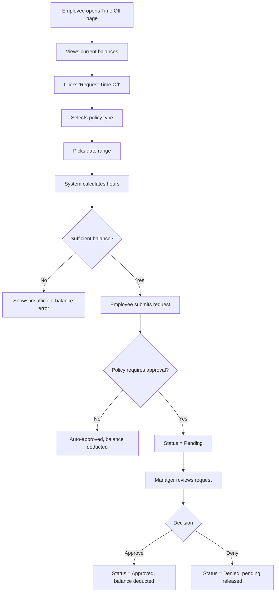
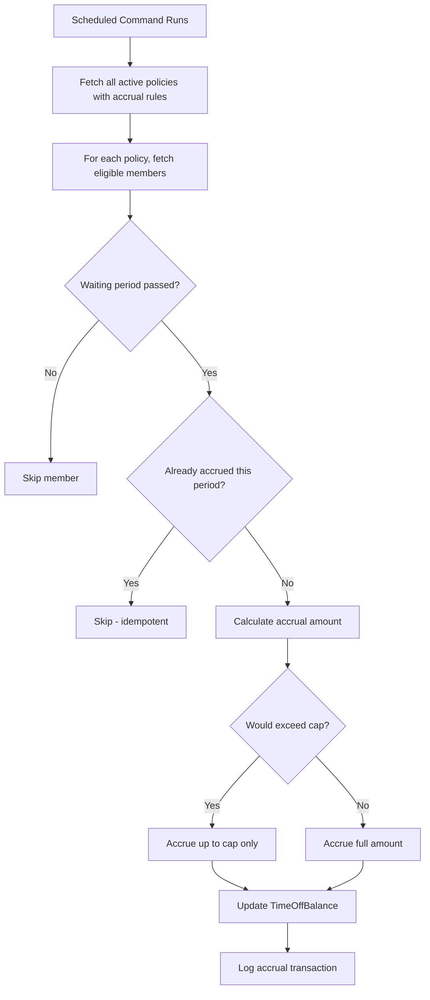
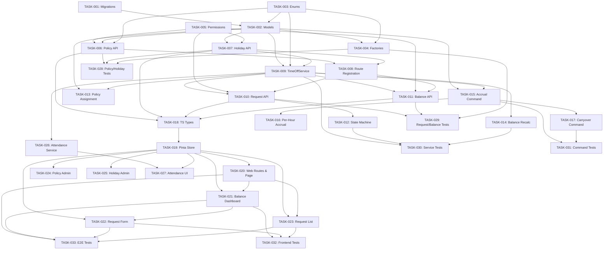

# PRD: PTO & Time Off Feature for Solidtime

Generated: 2026-02-06
Version: 1.0

## Table of Contents

1. [Source Context & Motivation](#1-source-context--motivation)
2. [Technical Interpretation](#2-technical-interpretation)
3. [Functional Specifications](#3-functional-specifications)
4. [Technical Requirements & Constraints](#4-technical-requirements--constraints)
5. [User Stories with Acceptance Criteria](#5-user-stories-with-acceptance-criteria)
6. [Task Breakdown Structure](#6-task-breakdown-structure)
7. [Dependencies & Integration Points](#7-dependencies--integration-points)
8. [Risk Assessment & Mitigation](#8-risk-assessment--mitigation)
9. [Testing & Validation Requirements](#9-testing--validation-requirements)
10. [Monitoring & Observability](#10-monitoring--observability)
11. [Success Metrics & Definition of Done](#11-success-metrics--definition-of-done)
12. [Technical Debt & Future Considerations](#12-technical-debt--future-considerations)
13. [Appendices](#13-appendices)

---

## Amendments (2026-02-06 Review)

> These amendments supersede conflicting content in the original PRD sections below.
> Reference: `.features/SHARED-FOUNDATIONS.md` and `.features/PRD-REVIEW-REPORT.md`

### AMD-01: Task ID Prefix
All task IDs in this PRD are now prefixed with `PTO-`. E.g., TASK-001 becomes PTO-001.

### AMD-02: Migration Timestamps (SF-03)
All migrations use date prefix `2026_03_07_`.

### AMD-03: Modular Permissions (SF-08)
Permissions are registered via `App\Permissions\TimeOffPermissions::register()` instead of directly modifying `JetstreamServiceProvider`.

### AMD-04: Notification Infrastructure (SF-04)
Time-off notifications use the shared infrastructure:
- `TimeOffRequestSubmittedNotification` — sent to approvers
- `TimeOffRequestApprovedNotification` — sent to requester
- `TimeOffRequestDeniedNotification` — sent to requester

**New dependency**: FOUND-001 through FOUND-005 (shared notification infrastructure).

### AMD-05: Shared Approval Pattern (SF-05)
Time-off requests use the shared `App\Enums\ApprovalStatus` enum with statuses: `submitted`, `approved`, `rejected`, `withdrawn`. Self-approval is NOT allowed. The `HasApprovalWorkflow` trait is applied to the `TimeOffRequest` model.

### AMD-06: Remove Unused OvertimeRuleType Enum
The `OvertimeRuleType` enum defined in PTO-003 is removed. It is defined but never referenced by any model or service. Overtime management is deferred to a future feature. Remove from PTO-003 task scope.

### AMD-07: Fiscal Year Configuration Gap
REQ-006 mentions "or fiscal year start if configured" for accrual calculations, but no configuration mechanism is defined. Resolution: add an optional `fiscal_year_start_month` (integer 1-12, nullable, default null = January) column to the `organizations` table in the shared foundations migration. When null, January is used as the fiscal year start.

**Shared migration addition to FOUND-006**:
```php
$table->unsignedTinyInteger('fiscal_year_start_month')->nullable()->after('default_weekly_capacity');
```

### AMD-08: Sprint 4 Rebalancing
Sprint 4 at 46 SP is overloaded (2x Sprint 1-2). Move the following to Sprint 3:
- PTO-028 (Frontend Component Tests, 8h/4SP) — can start once PTO-024 and PTO-025 are done
- PTO-027 (Reminder Command Tests, 4h/2SP) — can start once PTO-014 is done

Revised loads:
- Sprint 3: ~28 SP (was 22, absorbs 6 SP)
- Sprint 4: ~40 SP (was 46, sheds 6 SP) — still the heaviest but more manageable

### AMD-09: Soft Delete / Archive for Policies
REQ-001 mentions "archiving a policy" but the schema has no `deleted_at` or soft-delete mechanism. Resolution: the `is_active` flag handles the "archive" use case. Setting `is_active = false`:
- Prevents new requests against the policy
- Retains historical data (requests, balances)
- Does NOT delete the policy or cascade any changes
This is intentional and distinct from soft-delete. No `deleted_at` column needed.

### AMD-10: Cross-Feature Integration Notes
**Integration with Feature 08 (Resource Scheduling)**:
- When Feature 08 is implemented, approved time-off days should reduce the member's available capacity for scheduling
- The `TimeOffRequest` model should expose a method `getApprovedDaysInRange(Carbon $start, Carbon $end): float` that Feature 08's capacity calculation can consume
- This is a soft dependency — PTO works standalone, scheduling is enhanced by PTO data

**Integration with Feature 10 (Teams & Groups)**:
- When team scoping is enabled, managers should only see time-off requests from members in their teams
- The time-off request list endpoint should accept `team_ids` filter parameter
- This is a soft dependency — PTO works standalone

### AMD-11: Notification Hooks Stub
Status change notifications are mentioned as "future phase" in REQ-005. With the shared notification infrastructure (SF-04), this is now **included in scope**. Notifications are sent on every status transition via the standard `BaseNotification` pattern.

---

## 1. Source Context & Motivation

### 1.1 Background

Solidtime is an open-source time tracking application built with Laravel 11, Vue 3, TypeScript, Pinia, and Inertia.js. The application currently supports Organizations with Members (roles: Owner, Admin, Manager, Employee, Placeholder), Projects, Tasks, Clients, Tags, and TimeEntries. Members can track working hours, but there is no concept of paid time off (PTO), holidays, absence tracking, or overtime management.

### 1.2 Problem Statement

Organizations using Solidtime to track employee time have no way to:

- Define time-off policies (vacation, sick leave, personal days)
- Track organization-wide public holidays
- Accrue PTO balances automatically based on tenure or schedule
- Allow employees to request time off through the application
- Enable managers to approve or deny time-off requests
- View available, used, and pending balances per policy
- Track daily attendance against expected work hours or flag overtime

This forces organizations to maintain separate spreadsheets or external tools for leave management, creating fragmented workflows and data inconsistencies.

### 1.3 Feature Scope

| Module | Section | Description |
|--------|---------|-------------|
| Time Off Policies | 9.2 | Admin defines leave types with accrual rules |
| Holiday Calendars | 9.2.1 | Organization-wide public/company holidays |
| Accrual Rules | 9.2.2 | Automatic balance accumulation with caps and carryover |
| Time Off Requests | 9.2.3 | Member submits requests with dates and type |
| Approval Workflow | 9.2.4 | Manager/Admin approves or denies requests |
| Balance Tracking | 9.2.5 | Available/used/pending per policy per member |
| Attendance & Overtime | 9.3 | Daily attendance view and overtime rule engine |

### 1.4 Existing Codebase Patterns Applied

The following patterns were extracted from the Solidtime codebase and will be strictly followed:

- **Models**: UUID primary keys via `HasUuids` trait, `CustomAuditable` for audit trail, `organization_id` foreign key on all org-scoped models, `BelongsTo` for relationships
- **Controllers**: Extend `App\Http\Controllers\Api\V1\Controller`, use `$this->checkPermission()`, inject services via parameter type-hints
- **Routing**: `Route::name('v1.{feature}.')->prefix('/organizations/{organization}')` with `check-organization-blocked` middleware on writes
- **Request Validation**: Extend `BaseFormRequest`, use `ExistsEloquent` for relationship validation
- **Resources**: Extend `BaseResource` with `formatDateTime()` and `formatDate()` helpers
- **Pinia Stores**: `defineStore` with composition API, `@tanstack/vue-query` for fetching, `getCurrentOrganizationId()` for org context
- **Permissions**: Defined in `JetstreamServiceProvider::configurePermissions()`, checked via `PermissionStore`
- **Enums**: PHP 8.1 backed enums in `app/Enums/`
- **Scheduled Jobs**: Registered in `app/Console/Kernel.php`, use config flags for conditional scheduling
- **Testing**: `ApiEndpointTestAbstract` extends `TestCaseWithDatabase`, `Passport::actingAs()`, `createUserWithPermission()`
- **Factories**: Located in `database/factories/`, fluent builder pattern with `for{Relation}()` methods

---

## 2. Technical Interpretation

### 2.1 Business to Technical Translation

| Business Requirement | Technical Implementation |
|---------------------|-------------------------|
| Admin creates leave types | `TimeOffPolicy` model + CRUD API + admin UI page |
| Holiday calendar management | `Holiday` model + CRUD API + calendar widget |
| Automatic PTO accrual | `AccrualRule` (embedded in policy config) + `AccrueTimeOffBalances` scheduled command |
| Employee requests time off | `TimeOffRequest` model + create/cancel API + employee UI |
| Manager approves/denies | `TimeOffRequest` status transitions + approval API + manager UI |
| Balance dashboard | `TimeOffBalance` model + balance calculation service + balance widget |
| Attendance tracking | Computed from TimeEntry data vs. expected hours per day |
| Overtime detection | Rule-based comparison of actual vs. expected daily/weekly hours |

### 2.2 New Models Required

| Model | Purpose | Key Fields |
|-------|---------|------------|
| `TimeOffPolicy` | Defines a leave type for an organization | name, type (enum), color, accrual config, is_paid, requires_approval, is_active |
| `TimeOffRequest` | A member's request to take time off | member_id, policy_id, start_date, end_date, hours_requested, status (enum), reviewer_id, notes |
| `TimeOffBalance` | Current balance for a member under a policy | member_id, policy_id, accrued_hours, used_hours, pending_hours, carryover_hours, year |
| `Holiday` | Organization-wide holiday date | name, date, is_recurring, organization_id |

### 2.3 New Enums Required

| Enum | Values |
|------|--------|
| `TimeOffType` | `vacation`, `sick`, `personal`, `bereavement`, `parental`, `unpaid`, `other` |
| `TimeOffRequestStatus` | `pending`, `approved`, `denied`, `cancelled`, `expired` |
| `AccrualFrequency` | `none`, `monthly`, `biweekly`, `weekly`, `annually`, `per_hour_worked` |
| `OvertimeRuleType` | `daily_threshold`, `weekly_threshold` |

---

## 3. Functional Specifications

### 3.1 Core Requirements

#### REQ-001: Time Off Policy Management (P0)

**Description**: Organization admins can create, read, update, and archive time-off policies. Each policy defines a type of leave with optional accrual rules.

**Edge Cases**:
- Archiving a policy that has pending requests should not cancel those requests
- Deleting a policy is only allowed if no requests or balances reference it
- Policy name must be unique within an organization
- At least one policy type (vacation) should be seeded as a template suggestion

**Error Scenarios**:
- Attempting to delete a policy with existing balances returns 409 Conflict
- Creating a policy with accrual frequency but no accrual amount returns 422

#### REQ-002: Holiday Calendar Management (P1)

**Description**: Admins can manage organization-wide holidays. Holidays are dates where employees are not expected to work. Recurring holidays repeat annually.

**Edge Cases**:
- Recurring holidays must handle leap year (Feb 29) gracefully -- skip in non-leap years
- A holiday on a weekend should still be recorded (display purposes)
- Bulk import of common holiday sets (e.g., US Federal) as a future enhancement

**Error Scenarios**:
- Duplicate holiday date within same organization returns 409

#### REQ-003: Accrual Engine (P0)

**Description**: Balances accrue automatically based on policy configuration. A scheduled command runs monthly (configurable) and credits eligible members.

**Business Rules**:
- Accrual calculation: `accrual_amount` hours per `accrual_frequency` period
- **Cap**: Balance cannot exceed `max_balance` hours (if set); excess is forfeited
- **Carryover**: At year boundary, up to `max_carryover` hours carry to next year; excess expires
- **Waiting period**: New members do not accrue until after `waiting_period_days` from join date
- **Per-hour-worked**: If frequency is `per_hour_worked`, accrual is based on actual TimeEntry hours in the period

**Edge Cases**:
- Member joins mid-period: prorate first accrual
- Member is deactivated (Placeholder role): skip accrual
- Running the command multiple times in the same period must be idempotent

#### REQ-004: Time Off Requests (P0)

**Description**: Members submit requests specifying policy, date range, and optional notes. The system calculates hours based on the date range and the member's expected daily hours (default 8h, minus holidays).

**Business Rules**:
- Requested hours = (working days in range - holidays) * daily_expected_hours
- Cannot request more hours than available balance + pending_limit (if configured)
- Cannot request time off for past dates (configurable: `allow_retroactive`)
- Overlapping requests for the same member are rejected
- Cancelling an approved request returns hours to the balance

**Validation**:
- `start_date` must be <= `end_date`
- `start_date` must be in the future (unless retroactive allowed)
- Policy must be active
- Member must have a balance record for the policy

#### REQ-005: Approval Workflow (P0)

**Description**: Requests with `requires_approval` go to pending status. Managers and Admins can approve or deny. Requests without approval requirement are auto-approved.

**State Machine**:
```
                        +---> approved ---> (used hours deducted from balance)
                        |
pending ---> review ----|
                        |
                        +---> denied ----> (pending hours released)
    |
    +---> cancelled ---------> (pending hours released)
    |
    +---> expired -----------> (pending hours released, auto after 30 days)
```

**Business Rules**:
- Only users with `time-off-requests:approve` permission can approve/deny
- A member cannot approve their own request
- Denying a request requires a reason (optional but recommended)
- Notification hooks (email/in-app) for status changes -- future phase

#### REQ-006: Balance Tracking (P1)

**Description**: Each member has a balance per policy per year. The balance view shows accrued, used, pending, and available hours.

**Calculations**:
- `available_hours = accrued_hours + carryover_hours - used_hours - pending_hours`
- `used_hours` = sum of hours from approved requests in the year
- `pending_hours` = sum of hours from pending requests in the year

**Edge Cases**:
- Balance can go negative if admin force-approves beyond available
- Year rollover: carryover calculation runs on Jan 1 (or fiscal year start if configured)

#### REQ-007: Attendance & Overtime View (P2)

**Description**: A daily attendance view showing expected hours vs. actual hours (from TimeEntries). Overtime flags when actual exceeds threshold.

**Business Rules**:
- Default expected hours: 8h/day, 40h/week (configurable per organization)
- Overtime = actual - expected when actual > expected
- Holidays and approved time-off days reduce expected hours to 0
- View is read-only; no new models needed (computed from existing data)

### 3.2 User Workflows

#### Time Off Request Flow



#### Accrual Engine Flow



### 3.3 Access Control Matrix

| Action | Owner | Admin | Manager | Employee |
|--------|-------|-------|---------|----------|
| Create/Update/Delete Policy | Yes | Yes | No | No |
| Create/Update/Delete Holiday | Yes | Yes | No | No |
| View all policies | Yes | Yes | Yes | Yes (active only) |
| View all holidays | Yes | Yes | Yes | Yes |
| Request time off (own) | Yes | Yes | Yes | Yes |
| Cancel own request | Yes | Yes | Yes | Yes |
| Approve/Deny requests | Yes | Yes | Yes | No |
| View own balance | Yes | Yes | Yes | Yes |
| View all balances | Yes | Yes | Yes | No |
| View own attendance | Yes | Yes | Yes | Yes |
| View all attendance | Yes | Yes | Yes | No |
| Adjust balance manually | Yes | Yes | No | No |

---

## 4. Technical Requirements & Constraints

### 4.1 System Architecture

```
+-------------------+     +--------------------+     +-------------------+
|   Vue 3 Frontend  |     |   Laravel API      |     |   PostgreSQL      |
|   (Inertia.js)    |---->|   Controllers      |---->|   Database        |
|   Pinia Stores    |     |   Services         |     |                   |
|   UI Components   |     |   Scheduled Jobs   |     |   time_off_*      |
+-------------------+     +--------------------+     |   holidays        |
                                    |                 +-------------------+
                                    |
                          +--------------------+
                          |   Queue Worker     |
                          |   (Accrual Job)    |
                          +--------------------+
```

### 4.2 Data Models

#### TimeOffPolicy

```php
/**
 * @property string $id UUID
 * @property string $name
 * @property string $organization_id
 * @property TimeOffType $type
 * @property string $color  Hex color for UI display
 * @property bool $is_paid
 * @property bool $requires_approval
 * @property bool $is_active
 * @property bool $allow_retroactive
 * @property AccrualFrequency $accrual_frequency
 * @property float|null $accrual_amount  Hours per period
 * @property float|null $max_balance  Maximum accrued balance cap (hours)
 * @property float|null $max_carryover  Max hours carried over at year end
 * @property int|null $waiting_period_days  Days before accrual starts
 * @property float $default_allowance  Initial balance when policy assigned
 * @property float $daily_expected_hours  Used for request hour calculation (default 8)
 * @property Carbon|null $created_at
 * @property Carbon|null $updated_at
 * @property-read Organization $organization
 * @property-read Collection<TimeOffRequest> $requests
 * @property-read Collection<TimeOffBalance> $balances
 */
```

#### TimeOffRequest

```php
/**
 * @property string $id UUID
 * @property string $member_id
 * @property string $organization_id
 * @property string $policy_id  FK to time_off_policies
 * @property Carbon $start_date  First day of absence
 * @property Carbon $end_date  Last day of absence
 * @property float $hours_requested  Calculated working hours
 * @property TimeOffRequestStatus $status
 * @property string|null $reviewer_id  Member ID of approver/denier
 * @property Carbon|null $reviewed_at
 * @property string|null $notes  Employee notes
 * @property string|null $reviewer_notes  Approver notes/reason
 * @property Carbon|null $created_at
 * @property Carbon|null $updated_at
 * @property-read Member $member
 * @property-read Organization $organization
 * @property-read TimeOffPolicy $policy
 * @property-read Member|null $reviewer
 */
```

#### TimeOffBalance

```php
/**
 * @property string $id UUID
 * @property string $member_id
 * @property string $organization_id
 * @property string $policy_id
 * @property int $year  Calendar year this balance applies to
 * @property float $accrued_hours  Total accrued in this year
 * @property float $used_hours  Total used (approved requests) in this year
 * @property float $pending_hours  Total pending requests in this year
 * @property float $carryover_hours  Carried over from previous year
 * @property float $manual_adjustment  Admin manual adjustment (+/-)
 * @property Carbon|null $last_accrual_date  Prevents duplicate accruals
 * @property Carbon|null $created_at
 * @property Carbon|null $updated_at
 * @property-read Member $member
 * @property-read Organization $organization
 * @property-read TimeOffPolicy $policy
 */
```

#### Holiday

```php
/**
 * @property string $id UUID
 * @property string $name
 * @property string $organization_id
 * @property Carbon $date
 * @property bool $is_recurring  Repeats same month/day every year
 * @property Carbon|null $created_at
 * @property Carbon|null $updated_at
 * @property-read Organization $organization
 */
```

### 4.3 Database Schema (Migrations)

```sql
-- time_off_policies table
CREATE TABLE time_off_policies (
    id UUID PRIMARY KEY DEFAULT gen_random_uuid(),
    organization_id UUID NOT NULL REFERENCES organizations(id) ON DELETE CASCADE,
    name VARCHAR(255) NOT NULL,
    type VARCHAR(50) NOT NULL DEFAULT 'vacation',
    color VARCHAR(7) NOT NULL DEFAULT '#3B82F6',
    is_paid BOOLEAN NOT NULL DEFAULT true,
    requires_approval BOOLEAN NOT NULL DEFAULT true,
    is_active BOOLEAN NOT NULL DEFAULT true,
    allow_retroactive BOOLEAN NOT NULL DEFAULT false,
    accrual_frequency VARCHAR(50) NOT NULL DEFAULT 'none',
    accrual_amount DECIMAL(8,2) NULL,
    max_balance DECIMAL(8,2) NULL,
    max_carryover DECIMAL(8,2) NULL,
    waiting_period_days INTEGER NULL,
    default_allowance DECIMAL(8,2) NOT NULL DEFAULT 0,
    daily_expected_hours DECIMAL(4,2) NOT NULL DEFAULT 8.00,
    created_at TIMESTAMP NULL,
    updated_at TIMESTAMP NULL,
    UNIQUE(organization_id, name)
);
CREATE INDEX idx_time_off_policies_org ON time_off_policies(organization_id);

-- time_off_requests table
CREATE TABLE time_off_requests (
    id UUID PRIMARY KEY DEFAULT gen_random_uuid(),
    member_id UUID NOT NULL REFERENCES members(id) ON DELETE RESTRICT,
    organization_id UUID NOT NULL REFERENCES organizations(id) ON DELETE CASCADE,
    policy_id UUID NOT NULL REFERENCES time_off_policies(id) ON DELETE RESTRICT,
    start_date DATE NOT NULL,
    end_date DATE NOT NULL,
    hours_requested DECIMAL(8,2) NOT NULL,
    status VARCHAR(20) NOT NULL DEFAULT 'pending',
    reviewer_id UUID NULL REFERENCES members(id) ON DELETE SET NULL,
    reviewed_at TIMESTAMP NULL,
    notes TEXT NULL,
    reviewer_notes TEXT NULL,
    created_at TIMESTAMP NULL,
    updated_at TIMESTAMP NULL
);
CREATE INDEX idx_time_off_requests_member ON time_off_requests(member_id);
CREATE INDEX idx_time_off_requests_org ON time_off_requests(organization_id);
CREATE INDEX idx_time_off_requests_policy ON time_off_requests(policy_id);
CREATE INDEX idx_time_off_requests_status ON time_off_requests(status);
CREATE INDEX idx_time_off_requests_dates ON time_off_requests(start_date, end_date);

-- time_off_balances table
CREATE TABLE time_off_balances (
    id UUID PRIMARY KEY DEFAULT gen_random_uuid(),
    member_id UUID NOT NULL REFERENCES members(id) ON DELETE CASCADE,
    organization_id UUID NOT NULL REFERENCES organizations(id) ON DELETE CASCADE,
    policy_id UUID NOT NULL REFERENCES time_off_policies(id) ON DELETE CASCADE,
    year INTEGER NOT NULL,
    accrued_hours DECIMAL(8,2) NOT NULL DEFAULT 0,
    used_hours DECIMAL(8,2) NOT NULL DEFAULT 0,
    pending_hours DECIMAL(8,2) NOT NULL DEFAULT 0,
    carryover_hours DECIMAL(8,2) NOT NULL DEFAULT 0,
    manual_adjustment DECIMAL(8,2) NOT NULL DEFAULT 0,
    last_accrual_date TIMESTAMP NULL,
    created_at TIMESTAMP NULL,
    updated_at TIMESTAMP NULL,
    UNIQUE(member_id, policy_id, year)
);
CREATE INDEX idx_time_off_balances_member ON time_off_balances(member_id);
CREATE INDEX idx_time_off_balances_org ON time_off_balances(organization_id);

-- holidays table
CREATE TABLE holidays (
    id UUID PRIMARY KEY DEFAULT gen_random_uuid(),
    organization_id UUID NOT NULL REFERENCES organizations(id) ON DELETE CASCADE,
    name VARCHAR(255) NOT NULL,
    date DATE NOT NULL,
    is_recurring BOOLEAN NOT NULL DEFAULT false,
    created_at TIMESTAMP NULL,
    updated_at TIMESTAMP NULL,
    UNIQUE(organization_id, date)
);
CREATE INDEX idx_holidays_org_date ON holidays(organization_id, date);
```

### 4.4 API Contracts

#### Time Off Policies

```yaml
# List policies
GET /api/v1/organizations/{organization}/time-off-policies
Response 200:
  data: TimeOffPolicy[]

# Create policy (Admin/Owner only)
POST /api/v1/organizations/{organization}/time-off-policies
Request:
  name: string (required, max:255)
  type: TimeOffType (required)
  color: string (optional, hex format)
  is_paid: boolean (required)
  requires_approval: boolean (required)
  accrual_frequency: AccrualFrequency (required)
  accrual_amount: number|null (required if frequency != 'none')
  max_balance: number|null (optional)
  max_carryover: number|null (optional)
  waiting_period_days: integer|null (optional)
  default_allowance: number (optional, default 0)
  daily_expected_hours: number (optional, default 8)
  allow_retroactive: boolean (optional, default false)
Response 201: TimeOffPolicy

# Update policy
PUT /api/v1/organizations/{organization}/time-off-policies/{timeOffPolicy}
Request: (same as create, all optional)
Response 200: TimeOffPolicy

# Delete policy
DELETE /api/v1/organizations/{organization}/time-off-policies/{timeOffPolicy}
Response 204
Response 409: { error: "Policy has existing balances or requests" }
```

#### Holidays

```yaml
# List holidays
GET /api/v1/organizations/{organization}/holidays
Query: year (optional, integer)
Response 200:
  data: Holiday[]

# Create holiday
POST /api/v1/organizations/{organization}/holidays
Request:
  name: string (required, max:255)
  date: string (required, format: Y-m-d)
  is_recurring: boolean (optional, default false)
Response 201: Holiday

# Update holiday
PUT /api/v1/organizations/{organization}/holidays/{holiday}
Response 200: Holiday

# Delete holiday
DELETE /api/v1/organizations/{organization}/holidays/{holiday}
Response 204
```

#### Time Off Requests

```yaml
# List requests (filtered by member or all)
GET /api/v1/organizations/{organization}/time-off-requests
Query:
  member_id: uuid (optional, filter by member)
  status: string (optional, filter by status)
  start_date: date (optional)
  end_date: date (optional)
Response 200:
  data: TimeOffRequest[]

# Create request
POST /api/v1/organizations/{organization}/time-off-requests
Request:
  policy_id: uuid (required)
  start_date: string (required, format: Y-m-d)
  end_date: string (required, format: Y-m-d)
  notes: string|null (optional, max:5000)
Response 201: TimeOffRequest
Response 422: { error: "Insufficient balance" | "Overlapping request" | ... }

# Cancel own request (only if pending)
POST /api/v1/organizations/{organization}/time-off-requests/{timeOffRequest}/cancel
Response 200: TimeOffRequest

# Approve request (Manager/Admin/Owner)
POST /api/v1/organizations/{organization}/time-off-requests/{timeOffRequest}/approve
Request:
  reviewer_notes: string|null (optional)
Response 200: TimeOffRequest

# Deny request (Manager/Admin/Owner)
POST /api/v1/organizations/{organization}/time-off-requests/{timeOffRequest}/deny
Request:
  reviewer_notes: string|null (optional)
Response 200: TimeOffRequest
```

#### Balances

```yaml
# Get balances for current user
GET /api/v1/organizations/{organization}/time-off-balances/me
Query: year (optional, default current year)
Response 200:
  data: TimeOffBalanceWithPolicy[]

# Get balances for all members (Manager+)
GET /api/v1/organizations/{organization}/time-off-balances
Query:
  member_id: uuid (optional)
  policy_id: uuid (optional)
  year: integer (optional)
Response 200:
  data: TimeOffBalance[]

# Adjust balance manually (Admin/Owner)
POST /api/v1/organizations/{organization}/time-off-balances/{timeOffBalance}/adjust
Request:
  adjustment_hours: number (required, can be negative)
  reason: string (optional)
Response 200: TimeOffBalance
```

#### Attendance (Read-only, computed)

```yaml
# Get daily attendance for a member
GET /api/v1/organizations/{organization}/attendance
Query:
  member_id: uuid (required)
  start_date: date (required)
  end_date: date (required)
Response 200:
  data: AttendanceDay[]
  # where AttendanceDay = {
  #   date: string,
  #   expected_hours: number,
  #   actual_hours: number,
  #   overtime_hours: number,
  #   is_holiday: boolean,
  #   is_time_off: boolean,
  #   time_off_policy_name: string|null
  # }
```

### 4.5 Performance Requirements

- **Balance Queries**: < 100ms for individual member balance lookup
- **Request List**: < 200ms for paginated list (up to 100 items)
- **Accrual Job**: Must complete within 5 minutes for organizations with up to 1,000 members
- **Attendance Calculation**: < 500ms for 31-day range per member
- **Database Indexes**: All foreign keys and frequently filtered columns indexed (see schema above)

### 4.6 Security Requirements

- **Authentication**: All endpoints require `auth:api` + `verified` middleware (existing pattern)
- **Authorization**: New permissions checked via `PermissionStore` (see Access Control Matrix)
- **Data Isolation**: All queries scoped to `organization_id` via `whereBelongsTo($organization, 'organization')`
- **Self-Approval Prevention**: Reviewer cannot be the same member as the requester
- **Audit Trail**: All models use `CustomAuditable` trait for change tracking
- **Input Validation**: All inputs validated via `BaseFormRequest` subclasses with `ExistsEloquent` for FK validation

### 4.7 New Permissions

The following permissions will be added to `JetstreamServiceProvider::configurePermissions()`:

```php
// Time Off Policy permissions (Admin/Owner)
'time-off-policies:view'
'time-off-policies:create'
'time-off-policies:update'
'time-off-policies:delete'

// Holiday permissions (Admin/Owner)
'holidays:view'
'holidays:create'
'holidays:update'
'holidays:delete'

// Time Off Request permissions
'time-off-requests:view:own'
'time-off-requests:view:all'
'time-off-requests:create:own'
'time-off-requests:approve'

// Balance permissions
'time-off-balances:view:own'
'time-off-balances:view:all'
'time-off-balances:adjust'

// Attendance permissions
'attendance:view:own'
'attendance:view:all'
```

**Role Assignments**:

| Permission | Owner | Admin | Manager | Employee |
|-----------|-------|-------|---------|----------|
| `time-off-policies:view` | Y | Y | Y | Y |
| `time-off-policies:create` | Y | Y | N | N |
| `time-off-policies:update` | Y | Y | N | N |
| `time-off-policies:delete` | Y | Y | N | N |
| `holidays:view` | Y | Y | Y | Y |
| `holidays:create` | Y | Y | N | N |
| `holidays:update` | Y | Y | N | N |
| `holidays:delete` | Y | Y | N | N |
| `time-off-requests:view:own` | Y | Y | Y | Y |
| `time-off-requests:view:all` | Y | Y | Y | N |
| `time-off-requests:create:own` | Y | Y | Y | Y |
| `time-off-requests:approve` | Y | Y | Y | N |
| `time-off-balances:view:own` | Y | Y | Y | Y |
| `time-off-balances:view:all` | Y | Y | Y | N |
| `time-off-balances:adjust` | Y | Y | N | N |
| `attendance:view:own` | Y | Y | Y | Y |
| `attendance:view:all` | Y | Y | Y | N |

---

## 5. User Stories with Acceptance Criteria

### Story USR-001: Create Time Off Policy

**As an** organization admin
**I want to** create a time-off policy with accrual rules
**So that** employees can request leave under a defined structure

**Priority**: P0
**Effort**: 5 story points
**Sprint**: 1

**Acceptance Criteria**:
- [ ] Admin can access "Time Off Policies" settings page
- [ ] Form includes: name, type (dropdown), color picker, is_paid toggle, requires_approval toggle
- [ ] Accrual section: frequency dropdown, accrual amount, max balance cap, max carryover, waiting period
- [ ] Saving creates the policy and it appears in the policy list
- [ ] Duplicate name within the same organization returns validation error
- [ ] Employee role users cannot see the create/edit controls
- [ ] Policy appears as available option when creating time-off requests

**Dependencies**: TASK-001, TASK-002, TASK-003, TASK-005

---

### Story USR-002: Manage Organization Holidays

**As an** organization admin
**I want to** add public holidays to a shared calendar
**So that** time-off calculations exclude non-working days

**Priority**: P1
**Effort**: 3 story points
**Sprint**: 1

**Acceptance Criteria**:
- [ ] Admin can add a holiday with name, date, and recurring toggle
- [ ] Holiday list shows all holidays for the current year, sorted by date
- [ ] Recurring holidays appear automatically for the current and next year
- [ ] Holidays in a date range reduce expected hours in time-off request calculations
- [ ] Duplicate date within organization returns validation error
- [ ] Employee can view the holiday list but cannot edit

**Dependencies**: TASK-001, TASK-007, TASK-008

---

### Story USR-003: Request Time Off

**As an** employee
**I want to** submit a time-off request for specific dates
**So that** my manager can review and approve my absence

**Priority**: P0
**Effort**: 8 story points
**Sprint**: 2

**Acceptance Criteria**:
- [ ] Employee sees a "Time Off" page in the sidebar navigation
- [ ] Page displays current balances per active policy with available hours
- [ ] "New Request" button opens a form with policy selector, date range picker, notes field
- [ ] System auto-calculates hours based on working days (excluding holidays and weekends)
- [ ] Insufficient balance shows inline warning; form can still submit if admin allows negative
- [ ] Overlapping request dates for same member return validation error
- [ ] Request appears in "My Requests" list with status "Pending" (if approval required) or "Approved" (if not)
- [ ] Pending requests show "Cancel" button

**Dependencies**: TASK-001, TASK-009, TASK-010, TASK-011, TASK-013

---

### Story USR-004: Approve or Deny Time Off Requests

**As a** manager
**I want to** review and approve or deny pending time-off requests
**So that** I can manage team coverage

**Priority**: P0
**Effort**: 5 story points
**Sprint**: 2

**Acceptance Criteria**:
- [ ] Manager sees "Pending Requests" section on the Time Off page
- [ ] Each request shows: member name, policy name, dates, hours, notes
- [ ] Approve button moves status to "approved" and deducts hours from balance
- [ ] Deny button shows optional reason textarea, moves status to "denied", releases pending hours
- [ ] Manager cannot approve their own request
- [ ] Employee users do not see the pending requests section for others
- [ ] Approved/denied requests show reviewer name and timestamp

**Dependencies**: TASK-010, TASK-012

---

### Story USR-005: View Time Off Balances

**As an** employee
**I want to** see my current PTO balance per policy
**So that** I know how much time off I have available

**Priority**: P1
**Effort**: 3 story points
**Sprint**: 2

**Acceptance Criteria**:
- [ ] Balance card per policy shows: accrued, used, pending, carryover, manual adjustment, available
- [ ] Available = accrued + carryover + manual_adjustment - used - pending
- [ ] Year selector allows viewing past year balances
- [ ] Managers can view balances for their team members
- [ ] Admins can view and adjust any member's balance

**Dependencies**: TASK-009, TASK-014

---

### Story USR-006: Automatic Balance Accrual

**As an** admin
**I want** PTO balances to accrue automatically each month
**So that** I do not have to manually credit employee balances

**Priority**: P0
**Effort**: 5 story points
**Sprint**: 3

**Acceptance Criteria**:
- [ ] Scheduled command `time-off:accrue-balances` runs monthly (1st of month)
- [ ] Only active policies with accrual_frequency != 'none' are processed
- [ ] Members past their waiting period receive accrual credits
- [ ] Balance does not exceed max_balance cap
- [ ] Running the command again in the same month does not double-credit (idempotent)
- [ ] New members who join mid-period get prorated accrual on first run
- [ ] Placeholder members are skipped
- [ ] Command logs summary: "Processed X members, Y accruals credited"

**Dependencies**: TASK-001, TASK-015, TASK-016

---

### Story USR-007: Year-End Carryover

**As an** admin
**I want** unused PTO to carry over (up to a limit) at year end
**So that** employees retain partial balances into the new year

**Priority**: P1
**Effort**: 3 story points
**Sprint**: 3

**Acceptance Criteria**:
- [ ] At year boundary, a separate command `time-off:year-end-carryover` runs
- [ ] For each policy with max_carryover set, available hours up to the cap carry forward
- [ ] A new TimeOffBalance record is created for the new year with carryover_hours populated
- [ ] Hours exceeding max_carryover are forfeited (logged)
- [ ] If max_carryover is null, all remaining hours carry forward
- [ ] Command is idempotent for the same year transition

**Dependencies**: TASK-015, TASK-017

---

### Story USR-008: Attendance & Overtime View

**As a** manager
**I want to** see daily attendance for my team showing expected vs actual hours
**So that** I can identify overtime or under-reporting

**Priority**: P2
**Effort**: 5 story points
**Sprint**: 4

**Acceptance Criteria**:
- [ ] Attendance page shows a date-range grid for a selected member
- [ ] Each day shows: expected hours (8h default, 0h for holidays/time-off), actual hours (from TimeEntries)
- [ ] Overtime column = max(0, actual - expected)
- [ ] Holiday days are visually marked with policy color
- [ ] Time-off days are visually marked differently (e.g., with policy icon)
- [ ] Week totals and month totals are calculated
- [ ] Employee can view only their own attendance

**Dependencies**: TASK-018, TASK-019, TASK-020

---

## 6. Task Breakdown Structure

### Phase 1: Foundation -- Database & Backend Core (Sprint 1, Weeks 1-2)

---

#### TASK-001: Database Migrations for PTO Feature

**Type**: Backend / Database
**Effort Estimate**: 6 hours / 3 story points
**Dependencies**: None

**Description**: Create database migrations for all four new tables: `time_off_policies`, `time_off_requests`, `time_off_balances`, and `holidays`.

**Files to Create**:
- `database/migrations/2026_02_07_000001_create_time_off_policies_table.php`
- `database/migrations/2026_02_07_000002_create_holidays_table.php`
- `database/migrations/2026_02_07_000003_create_time_off_balances_table.php`
- `database/migrations/2026_02_07_000004_create_time_off_requests_table.php`

**Implementation Notes**:
- Follow existing migration patterns (see `2024_01_20_110439_create_projects_table.php`)
- Use `uuid` type for primary keys (existing pattern)
- Add foreign key constraints with appropriate ON DELETE behavior
- Add composite unique constraints and indexes as specified in section 4.3
- Use `decimal(8,2)` for hour fields to support half-hour precision

**Acceptance Criteria**:
- [ ] `php artisan migrate` runs without errors
- [ ] `php artisan migrate:rollback` cleanly reverses all changes
- [ ] All foreign keys, indexes, and unique constraints are in place
- [ ] Schema matches the specification in section 4.3

---

#### TASK-002: Eloquent Models for PTO Feature

**Type**: Backend
**Effort Estimate**: 8 hours / 4 story points
**Dependencies**: [TASK-001]

**Description**: Create four Eloquent models with relationships, casts, and PHPDoc annotations following existing patterns.

**Files to Create**:
- `app/Models/TimeOffPolicy.php`
- `app/Models/TimeOffRequest.php`
- `app/Models/TimeOffBalance.php`
- `app/Models/Holiday.php`

**Implementation Details**:

```php
// app/Models/TimeOffPolicy.php pattern
class TimeOffPolicy extends Model implements AuditableContract
{
    use CustomAuditable;
    use HasFactory;
    use HasUuids;

    protected $casts = [
        'type' => TimeOffType::class,
        'accrual_frequency' => AccrualFrequency::class,
        'is_paid' => 'bool',
        'requires_approval' => 'bool',
        'is_active' => 'bool',
        'allow_retroactive' => 'bool',
        'accrual_amount' => 'float',
        'max_balance' => 'float',
        'max_carryover' => 'float',
        'default_allowance' => 'float',
        'daily_expected_hours' => 'float',
        'waiting_period_days' => 'int',
    ];

    public function organization(): BelongsTo { ... }
    public function requests(): HasMany { ... }
    public function balances(): HasMany { ... }
}
```

- Each model must include `HasUuids`, `CustomAuditable`, `HasFactory` traits
- Add complete PHPDoc `@property` annotations matching the data model spec
- Define all relationships as per section 4.2
- TimeOffRequest needs `status` scopes: `scopePending`, `scopeApproved`, etc.

**Acceptance Criteria**:
- [ ] All four models created with correct namespaces
- [ ] All relationships defined and functional
- [ ] All casts defined for type safety
- [ ] PHPDoc annotations complete for IDE support
- [ ] `composer analyse` passes with no errors

---

#### TASK-003: PHP Enums for PTO Feature

**Type**: Backend
**Effort Estimate**: 2 hours / 1 story point
**Dependencies**: None

**Description**: Create backed enums for PTO-related types.

**Files to Create**:
- `app/Enums/TimeOffType.php`
- `app/Enums/TimeOffRequestStatus.php`
- `app/Enums/AccrualFrequency.php`
- `app/Enums/OvertimeRuleType.php`

**Implementation Pattern** (matching `app/Enums/Role.php`):

```php
<?php
declare(strict_types=1);

namespace App\Enums;

enum TimeOffType: string
{
    case Vacation = 'vacation';
    case Sick = 'sick';
    case Personal = 'personal';
    case Bereavement = 'bereavement';
    case Parental = 'parental';
    case Unpaid = 'unpaid';
    case Other = 'other';
}
```

**Acceptance Criteria**:
- [ ] All four enums created with correct values
- [ ] `declare(strict_types=1)` at top of each file
- [ ] Used as casts in models from TASK-002
- [ ] `composer analyse` passes

---

#### TASK-004: Model Factories for PTO Feature

**Type**: Backend / Testing
**Effort Estimate**: 4 hours / 2 story points
**Dependencies**: [TASK-002, TASK-003]

**Description**: Create factories for all new models following the `TimeEntryFactory` pattern.

**Files to Create**:
- `database/factories/TimeOffPolicyFactory.php`
- `database/factories/TimeOffRequestFactory.php`
- `database/factories/TimeOffBalanceFactory.php`
- `database/factories/HolidayFactory.php`

**Implementation Pattern**:

```php
class TimeOffPolicyFactory extends Factory
{
    public function definition(): array
    {
        return [
            'name' => $this->faker->unique()->words(2, true),
            'organization_id' => Organization::factory(),
            'type' => $this->faker->randomElement(TimeOffType::cases()),
            'color' => $this->faker->hexColor(),
            'is_paid' => true,
            'requires_approval' => true,
            'is_active' => true,
            // ...
        ];
    }

    public function forOrganization(Organization $organization): self { ... }
    public function vacation(): self { ... }
    public function sick(): self { ... }
    public function withAccrual(AccrualFrequency $frequency, float $amount): self { ... }
}
```

**Acceptance Criteria**:
- [ ] All four factories created with realistic default values
- [ ] Fluent builder methods for common states: `forOrganization()`, `forMember()`, `forPolicy()`
- [ ] Factories can create valid records that pass all DB constraints
- [ ] Used successfully in test setup

---

#### TASK-005: Permissions Registration for PTO Feature

**Type**: Backend
**Effort Estimate**: 3 hours / 2 story points
**Dependencies**: None

**Description**: Add new PTO-related permissions to all roles in `JetstreamServiceProvider::configurePermissions()`.

**Files to Modify**:
- `app/Providers/JetstreamServiceProvider.php`

**Implementation Details**:
- Add all permissions listed in section 4.7 to appropriate roles
- Owner and Admin get all PTO permissions
- Manager gets view:all, approve, create:own, but not policy/holiday management
- Employee gets only own-scoped permissions (view:own, create:own)

**Acceptance Criteria**:
- [ ] All 18 new permissions defined in the role configuration
- [ ] Permission assignments match the matrix in section 4.7
- [ ] Existing permissions unchanged
- [ ] `composer analyse` passes

---

#### TASK-006: TimeOffPolicy API -- Controller, Requests, Resources

**Type**: Backend
**Effort Estimate**: 10 hours / 5 story points
**Dependencies**: [TASK-002, TASK-003, TASK-005]

**Description**: Implement full CRUD API for time-off policies.

**Files to Create**:
- `app/Http/Controllers/Api/V1/TimeOffPolicyController.php`
- `app/Http/Requests/V1/TimeOffPolicy/TimeOffPolicyStoreRequest.php`
- `app/Http/Requests/V1/TimeOffPolicy/TimeOffPolicyUpdateRequest.php`
- `app/Http/Resources/V1/TimeOffPolicy/TimeOffPolicyResource.php`
- `app/Http/Resources/V1/TimeOffPolicy/TimeOffPolicyCollection.php`

**Implementation Pattern** (following `TagController.php`):

```php
class TimeOffPolicyController extends Controller
{
    protected function checkPermission(
        Organization $organization,
        string $permission,
        ?TimeOffPolicy $policy = null
    ): void {
        parent::checkPermission($organization, $permission);
        if ($policy !== null && $policy->organization_id !== $organization->getKey()) {
            throw new AuthorizationException('...');
        }
    }

    public function index(Organization $organization): TimeOffPolicyCollection { ... }
    public function store(Organization $organization, TimeOffPolicyStoreRequest $request): TimeOffPolicyResource { ... }
    public function update(Organization $organization, TimeOffPolicy $timeOffPolicy, TimeOffPolicyUpdateRequest $request): TimeOffPolicyResource { ... }
    public function destroy(Organization $organization, TimeOffPolicy $timeOffPolicy): JsonResponse { ... }
}
```

**Acceptance Criteria**:
- [ ] All four CRUD endpoints working
- [ ] Permission checks on every endpoint
- [ ] Organization scoping on all queries
- [ ] Delete blocked if requests/balances exist (409 response)
- [ ] Request validation includes all fields with correct rules
- [ ] Resource transforms datetime fields using `formatDateTime()`

---

#### TASK-007: Holiday API -- Controller, Requests, Resources

**Type**: Backend
**Effort Estimate**: 6 hours / 3 story points
**Dependencies**: [TASK-002, TASK-005]

**Description**: Implement CRUD API for organization holidays.

**Files to Create**:
- `app/Http/Controllers/Api/V1/HolidayController.php`
- `app/Http/Requests/V1/Holiday/HolidayStoreRequest.php`
- `app/Http/Requests/V1/Holiday/HolidayUpdateRequest.php`
- `app/Http/Resources/V1/Holiday/HolidayResource.php`
- `app/Http/Resources/V1/Holiday/HolidayCollection.php`

**Implementation Notes**:
- Index endpoint supports optional `year` query parameter to filter by year
- Recurring holidays: when listing for a year, include holidays where `is_recurring = true` and month/day match, regardless of stored year
- Duplicate date check must account for organization scope

**Acceptance Criteria**:
- [ ] CRUD endpoints for holidays
- [ ] Year-based filtering for the index endpoint
- [ ] Recurring holiday logic in queries
- [ ] Unique constraint on (organization_id, date) enforced at validation layer
- [ ] `check-organization-blocked` middleware on write endpoints

---

#### TASK-008: API Routes Registration for PTO Feature

**Type**: Backend
**Effort Estimate**: 2 hours / 1 story point
**Dependencies**: [TASK-006, TASK-007]

**Description**: Register all new API routes in `routes/api.php` following existing naming conventions.

**Files to Modify**:
- `routes/api.php`

**Implementation Pattern**:

```php
// Time Off Policy routes
Route::name('time-off-policies.')->prefix('/organizations/{organization}')->group(static function (): void {
    Route::get('/time-off-policies', [TimeOffPolicyController::class, 'index'])->name('index');
    Route::post('/time-off-policies', [TimeOffPolicyController::class, 'store'])->name('store')->middleware('check-organization-blocked');
    Route::put('/time-off-policies/{timeOffPolicy}', [TimeOffPolicyController::class, 'update'])->name('update')->middleware('check-organization-blocked');
    Route::delete('/time-off-policies/{timeOffPolicy}', [TimeOffPolicyController::class, 'destroy'])->name('destroy');
});

// Holiday routes
Route::name('holidays.')->prefix('/organizations/{organization}')->group(static function (): void {
    Route::get('/holidays', [HolidayController::class, 'index'])->name('index');
    Route::post('/holidays', [HolidayController::class, 'store'])->name('store')->middleware('check-organization-blocked');
    Route::put('/holidays/{holiday}', [HolidayController::class, 'update'])->name('update')->middleware('check-organization-blocked');
    Route::delete('/holidays/{holiday}', [HolidayController::class, 'destroy'])->name('destroy');
});

// Time Off Request routes
Route::name('time-off-requests.')->prefix('/organizations/{organization}')->group(static function (): void {
    Route::get('/time-off-requests', [TimeOffRequestController::class, 'index'])->name('index');
    Route::post('/time-off-requests', [TimeOffRequestController::class, 'store'])->name('store')->middleware('check-organization-blocked');
    Route::post('/time-off-requests/{timeOffRequest}/cancel', [TimeOffRequestController::class, 'cancel'])->name('cancel')->middleware('check-organization-blocked');
    Route::post('/time-off-requests/{timeOffRequest}/approve', [TimeOffRequestController::class, 'approve'])->name('approve')->middleware('check-organization-blocked');
    Route::post('/time-off-requests/{timeOffRequest}/deny', [TimeOffRequestController::class, 'deny'])->name('deny')->middleware('check-organization-blocked');
});

// Time Off Balance routes
Route::name('time-off-balances.')->prefix('/organizations/{organization}')->group(static function (): void {
    Route::get('/time-off-balances/me', [TimeOffBalanceController::class, 'me'])->name('me');
    Route::get('/time-off-balances', [TimeOffBalanceController::class, 'index'])->name('index');
    Route::post('/time-off-balances/{timeOffBalance}/adjust', [TimeOffBalanceController::class, 'adjust'])->name('adjust')->middleware('check-organization-blocked');
});

// Attendance routes
Route::name('attendance.')->prefix('/organizations/{organization}')->group(static function (): void {
    Route::get('/attendance', [AttendanceController::class, 'index'])->name('index');
});
```

**Acceptance Criteria**:
- [ ] All routes registered with correct names and prefixes
- [ ] Write endpoints have `check-organization-blocked` middleware
- [ ] Route names follow `v1.{feature}.{action}` convention
- [ ] `php artisan route:list` shows all new routes

---

### Phase 2: Business Logic & Requests/Approvals (Sprint 2, Weeks 3-4)

---

#### TASK-009: TimeOffService -- Core Business Logic

**Type**: Backend
**Effort Estimate**: 12 hours / 6 story points
**Dependencies**: [TASK-002, TASK-003, TASK-007]

**Description**: Create the stateless service class encapsulating all PTO business logic.

**Files to Create**:
- `app/Service/TimeOffService.php`

**Implementation Details**:

```php
class TimeOffService
{
    /**
     * Calculate working hours for a date range excluding weekends and holidays.
     */
    public function calculateRequestHours(
        Organization $organization,
        Carbon $startDate,
        Carbon $endDate,
        float $dailyExpectedHours
    ): float { ... }

    /**
     * Check if a member has sufficient balance for a request.
     */
    public function hasSufficientBalance(
        Member $member,
        TimeOffPolicy $policy,
        float $requestedHours,
        int $year
    ): bool { ... }

    /**
     * Check for overlapping requests for the same member.
     */
    public function hasOverlappingRequest(
        Member $member,
        Carbon $startDate,
        Carbon $endDate,
        ?TimeOffRequest $exclude = null
    ): bool { ... }

    /**
     * Get or create balance record for member/policy/year.
     */
    public function getOrCreateBalance(
        Member $member,
        TimeOffPolicy $policy,
        int $year
    ): TimeOffBalance { ... }

    /**
     * Apply approval: deduct from pending, add to used.
     */
    public function applyApproval(TimeOffRequest $request): void { ... }

    /**
     * Apply denial/cancellation: release pending hours.
     */
    public function releasePendingHours(TimeOffRequest $request): void { ... }

    /**
     * Process accrual for a single member under a policy.
     */
    public function processAccrual(
        Member $member,
        TimeOffPolicy $policy,
        Carbon $accrualDate
    ): float { ... }

    /**
     * Process year-end carryover for a policy.
     */
    public function processCarryover(
        Member $member,
        TimeOffPolicy $policy,
        int $fromYear,
        int $toYear
    ): float { ... }

    /**
     * Get holidays for an organization in a date range.
     */
    public function getHolidaysInRange(
        Organization $organization,
        Carbon $startDate,
        Carbon $endDate
    ): Collection { ... }
}
```

**Acceptance Criteria**:
- [ ] All methods implemented and unit tested
- [ ] `calculateRequestHours` correctly excludes weekends and holidays
- [ ] `processAccrual` respects caps, waiting periods, and is idempotent
- [ ] `processCarryover` respects max_carryover limits
- [ ] Service is stateless and injectable via type-hints

---

#### TASK-010: TimeOffRequest API -- Controller, Requests, Resources

**Type**: Backend
**Effort Estimate**: 12 hours / 6 story points
**Dependencies**: [TASK-002, TASK-005, TASK-008, TASK-009]

**Description**: Implement the request lifecycle API: create, cancel, approve, deny, list.

**Files to Create**:
- `app/Http/Controllers/Api/V1/TimeOffRequestController.php`
- `app/Http/Requests/V1/TimeOffRequest/TimeOffRequestStoreRequest.php`
- `app/Http/Requests/V1/TimeOffRequest/TimeOffRequestReviewRequest.php`
- `app/Http/Resources/V1/TimeOffRequest/TimeOffRequestResource.php`
- `app/Http/Resources/V1/TimeOffRequest/TimeOffRequestCollection.php`
- `app/Exceptions/Api/InsufficientTimeOffBalanceApiException.php`
- `app/Exceptions/Api/OverlappingTimeOffRequestApiException.php`
- `app/Exceptions/Api/InvalidTimeOffRequestStatusTransitionApiException.php`

**Key Logic**:

```php
public function store(Organization $organization, TimeOffRequestStoreRequest $request, TimeOffService $timeOffService): JsonResource
{
    $member = $this->member($organization);
    $this->checkPermission($organization, 'time-off-requests:create:own');

    $policy = TimeOffPolicy::query()
        ->whereBelongsTo($organization, 'organization')
        ->where('is_active', true)
        ->findOrFail($request->input('policy_id'));

    $startDate = Carbon::parse($request->input('start_date'));
    $endDate = Carbon::parse($request->input('end_date'));

    // Calculate hours
    $hours = $timeOffService->calculateRequestHours(
        $organization, $startDate, $endDate, $policy->daily_expected_hours
    );

    // Check overlap
    if ($timeOffService->hasOverlappingRequest($member, $startDate, $endDate)) {
        throw new OverlappingTimeOffRequestApiException;
    }

    // Check balance
    if (!$timeOffService->hasSufficientBalance($member, $policy, $hours, $startDate->year)) {
        throw new InsufficientTimeOffBalanceApiException;
    }

    // Create request
    $timeOffRequest = new TimeOffRequest;
    // ... fill and save

    // Auto-approve if policy doesn't require approval
    if (!$policy->requires_approval) {
        $timeOffRequest->status = TimeOffRequestStatus::Approved;
        $timeOffRequest->reviewed_at = now();
        $timeOffService->applyApproval($timeOffRequest);
    } else {
        // Add to pending balance
        $balance = $timeOffService->getOrCreateBalance($member, $policy, $startDate->year);
        $balance->pending_hours += $hours;
        $balance->save();
    }

    $timeOffRequest->save();
    return new TimeOffRequestResource($timeOffRequest);
}
```

**Acceptance Criteria**:
- [ ] Create endpoint calculates hours, checks balance, checks overlap
- [ ] Auto-approve works for policies without approval requirement
- [ ] Cancel only works on pending requests
- [ ] Approve deducts from pending, adds to used
- [ ] Deny releases pending hours
- [ ] Self-approval prevention enforced
- [ ] Proper exception classes with HTTP status codes

---

#### TASK-011: TimeOffBalance API -- Controller, Resources

**Type**: Backend
**Effort Estimate**: 6 hours / 3 story points
**Dependencies**: [TASK-002, TASK-005, TASK-008, TASK-009]

**Description**: Implement balance viewing and manual adjustment endpoints.

**Files to Create**:
- `app/Http/Controllers/Api/V1/TimeOffBalanceController.php`
- `app/Http/Requests/V1/TimeOffBalance/TimeOffBalanceAdjustRequest.php`
- `app/Http/Resources/V1/TimeOffBalance/TimeOffBalanceResource.php`
- `app/Http/Resources/V1/TimeOffBalance/TimeOffBalanceCollection.php`

**Key Endpoints**:
- `GET /time-off-balances/me` -- Returns authenticated member's balances, eagerly loading policy
- `GET /time-off-balances` -- Admin/Manager view of all member balances with filters
- `POST /time-off-balances/{timeOffBalance}/adjust` -- Admin manually adjusts a balance

**Acceptance Criteria**:
- [ ] `me` endpoint returns only the current member's balances with policy details
- [ ] `index` endpoint supports `member_id`, `policy_id`, `year` filters
- [ ] `adjust` endpoint adds/subtracts from `manual_adjustment` field
- [ ] Permission checks enforce own vs. all access
- [ ] Balance resource includes computed `available_hours` field

---

#### TASK-012: Approval Workflow State Machine

**Type**: Backend
**Effort Estimate**: 4 hours / 2 story points
**Dependencies**: [TASK-010]

**Description**: Implement explicit state machine logic for request status transitions with validation.

**Files to Create**:
- `app/Service/TimeOffRequestStateMachine.php`

**State Transitions**:
```php
class TimeOffRequestStateMachine
{
    private const ALLOWED_TRANSITIONS = [
        'pending' => ['approved', 'denied', 'cancelled'],
        'approved' => ['cancelled'], // Only within cancellation window
        'denied' => [],
        'cancelled' => [],
        'expired' => [],
    ];

    public function canTransition(TimeOffRequestStatus $from, TimeOffRequestStatus $to): bool { ... }
    public function assertTransition(TimeOffRequestStatus $from, TimeOffRequestStatus $to): void { ... }
}
```

**Acceptance Criteria**:
- [ ] All valid transitions enforced
- [ ] Invalid transitions throw `InvalidTimeOffRequestStatusTransitionApiException`
- [ ] Approved request cancellation only allowed if start_date is in the future
- [ ] Unit tests cover all transition combinations

---

### Phase 3: Scheduled Jobs & Accrual Engine (Sprint 3, Weeks 5-6)

---

#### TASK-013: Assign Policies to Members (Balance Initialization)

**Type**: Backend
**Effort Estimate**: 6 hours / 3 story points
**Dependencies**: [TASK-002, TASK-009]

**Description**: When a policy is created or a new member joins, balance records need to be initialized. Implement a service method and admin endpoint to assign/unassign policies to members.

**Files to Create/Modify**:
- `app/Http/Controllers/Api/V1/TimeOffPolicyController.php` (add `assignToMember`, `assignToAll` actions)
- `app/Http/Requests/V1/TimeOffPolicy/TimeOffPolicyAssignRequest.php`

**Key Logic**:
- `POST /time-off-policies/{timeOffPolicy}/assign` -- Assign policy to specific member(s) with default_allowance
- `POST /time-off-policies/{timeOffPolicy}/assign-all` -- Assign to all active members in organization
- Creates `TimeOffBalance` record with `accrued_hours = default_allowance` for current year

**Acceptance Criteria**:
- [ ] Admin can assign a policy to individual members or all at once
- [ ] Balance record created with default_allowance as initial accrued hours
- [ ] Duplicate assignment (member already has balance) is a no-op, not an error
- [ ] Placeholder members are excluded from assign-all

---

#### TASK-014: Balance Recalculation Service

**Type**: Backend
**Effort Estimate**: 4 hours / 2 story points
**Dependencies**: [TASK-009]

**Description**: A recalculation method that derives `used_hours` and `pending_hours` from actual request records, ensuring data consistency.

**Files to Modify**:
- `app/Service/TimeOffService.php` (add `recalculateBalance` method)

**Implementation**:

```php
public function recalculateBalance(TimeOffBalance $balance): void
{
    $balance->used_hours = TimeOffRequest::query()
        ->where('member_id', $balance->member_id)
        ->where('policy_id', $balance->policy_id)
        ->where('status', TimeOffRequestStatus::Approved->value)
        ->whereYear('start_date', $balance->year)
        ->sum('hours_requested');

    $balance->pending_hours = TimeOffRequest::query()
        ->where('member_id', $balance->member_id)
        ->where('policy_id', $balance->policy_id)
        ->where('status', TimeOffRequestStatus::Pending->value)
        ->whereYear('start_date', $balance->year)
        ->sum('hours_requested');

    $balance->save();
}
```

**Acceptance Criteria**:
- [ ] Recalculation matches actual request data
- [ ] Can be called as a consistency check / repair operation
- [ ] Artisan command to trigger recalculation for all balances

---

#### TASK-015: Accrual Scheduled Command

**Type**: Backend
**Effort Estimate**: 10 hours / 5 story points
**Dependencies**: [TASK-002, TASK-009]

**Description**: Create the scheduled artisan command that processes automatic balance accruals.

**Files to Create**:
- `app/Console/Commands/TimeOff/TimeOffAccrueBalancesCommand.php`

**Files to Modify**:
- `app/Console/Kernel.php` (register the command)

**Implementation Details**:

```php
class TimeOffAccrueBalancesCommand extends Command
{
    protected $signature = 'time-off:accrue-balances';
    protected $description = 'Process automatic time-off balance accruals for all organizations';

    public function handle(TimeOffService $timeOffService): int
    {
        $accrualDate = now();
        $processedCount = 0;
        $skippedCount = 0;

        $policies = TimeOffPolicy::query()
            ->where('is_active', true)
            ->where('accrual_frequency', '!=', AccrualFrequency::None->value)
            ->with('organization')
            ->cursor();

        foreach ($policies as $policy) {
            $members = Member::query()
                ->where('organization_id', $policy->organization_id)
                ->where('role', '!=', Role::Placeholder->value)
                ->cursor();

            foreach ($members as $member) {
                $accrued = $timeOffService->processAccrual($member, $policy, $accrualDate);
                if ($accrued > 0) {
                    $processedCount++;
                } else {
                    $skippedCount++;
                }
            }
        }

        $this->info("Accrual complete: {$processedCount} accrued, {$skippedCount} skipped");
        return self::SUCCESS;
    }
}
```

**Kernel Registration**:
```php
$schedule->command('time-off:accrue-balances')
    ->when(fn (): bool => config('scheduling.tasks.time_off_accrue_balances'))
    ->monthlyOn(1, '02:00');
```

**Acceptance Criteria**:
- [ ] Command processes all active policies with accrual rules
- [ ] Idempotent: running twice in the same period does not double-credit
- [ ] Respects waiting_period_days for new members
- [ ] Respects max_balance cap
- [ ] Prorates first accrual for mid-period joins
- [ ] Skips Placeholder members
- [ ] Logs summary output
- [ ] Config flag for scheduling enabled/disabled

---

#### TASK-016: Per-Hour-Worked Accrual Mode

**Type**: Backend
**Effort Estimate**: 4 hours / 2 story points
**Dependencies**: [TASK-015]

**Description**: Extend the accrual engine to support `per_hour_worked` frequency, where accrual is based on actual TimeEntry hours.

**Files to Modify**:
- `app/Service/TimeOffService.php` (extend `processAccrual`)

**Implementation**:
- Query TimeEntries for the member in the accrual period
- Calculate total hours worked
- Multiply by `accrual_amount` (e.g., 0.05 hours PTO per hour worked)
- Apply the same cap and idempotency rules

**Acceptance Criteria**:
- [ ] Accrual based on actual TimeEntry hours in the period
- [ ] Works alongside fixed-schedule accrual types
- [ ] Handles edge case: no time entries = zero accrual
- [ ] Unit test with mock TimeEntry data

---

#### TASK-017: Year-End Carryover Command

**Type**: Backend
**Effort Estimate**: 6 hours / 3 story points
**Dependencies**: [TASK-015]

**Description**: Create a scheduled command for year-end balance carryover.

**Files to Create**:
- `app/Console/Commands/TimeOff/TimeOffYearEndCarryoverCommand.php`

**Kernel Registration**:
```php
$schedule->command('time-off:year-end-carryover')
    ->when(fn (): bool => config('scheduling.tasks.time_off_year_end_carryover'))
    ->yearlyOn(1, 1, '00:30'); // Jan 1 at 00:30
```

**Logic**:
1. For each active policy with carryover rules
2. For each member with a balance for the previous year
3. Calculate available hours at year end
4. Carry over min(available, max_carryover) to new year's balance
5. Log any forfeited hours

**Acceptance Criteria**:
- [ ] Creates new year balance records with carryover_hours populated
- [ ] Respects max_carryover limit per policy
- [ ] Null max_carryover means unlimited carryover
- [ ] Idempotent for the same year transition
- [ ] Logs forfeited hours for audit

---

### Phase 4: Frontend -- Pages & Components (Sprint 3-4, Weeks 5-8)

---

#### TASK-018: TypeScript Types for PTO Feature

**Type**: Frontend
**Effort Estimate**: 3 hours / 1 story point
**Dependencies**: [TASK-006, TASK-007, TASK-010, TASK-011]

**Description**: Define TypeScript interfaces for all PTO API responses.

**Files to Create**:
- `resources/js/types/timeoff.d.ts`

**Implementation**:

```typescript
export type TimeOffType = 'vacation' | 'sick' | 'personal' | 'bereavement' | 'parental' | 'unpaid' | 'other';
export type TimeOffRequestStatus = 'pending' | 'approved' | 'denied' | 'cancelled' | 'expired';
export type AccrualFrequency = 'none' | 'monthly' | 'biweekly' | 'weekly' | 'annually' | 'per_hour_worked';

export interface TimeOffPolicy {
    id: string;
    name: string;
    organization_id: string;
    type: TimeOffType;
    color: string;
    is_paid: boolean;
    requires_approval: boolean;
    is_active: boolean;
    allow_retroactive: boolean;
    accrual_frequency: AccrualFrequency;
    accrual_amount: number | null;
    max_balance: number | null;
    max_carryover: number | null;
    waiting_period_days: number | null;
    default_allowance: number;
    daily_expected_hours: number;
    created_at: string;
    updated_at: string;
}

export interface TimeOffRequest {
    id: string;
    member_id: string;
    organization_id: string;
    policy_id: string;
    start_date: string;
    end_date: string;
    hours_requested: number;
    status: TimeOffRequestStatus;
    reviewer_id: string | null;
    reviewed_at: string | null;
    notes: string | null;
    reviewer_notes: string | null;
    created_at: string;
    updated_at: string;
    // Eager-loaded relations
    policy?: TimeOffPolicy;
    member?: { id: string; user: { name: string; email: string } };
    reviewer?: { id: string; user: { name: string } };
}

export interface TimeOffBalance {
    id: string;
    member_id: string;
    organization_id: string;
    policy_id: string;
    year: number;
    accrued_hours: number;
    used_hours: number;
    pending_hours: number;
    carryover_hours: number;
    manual_adjustment: number;
    available_hours: number; // Computed: accrued + carryover + manual_adjustment - used - pending
    policy?: TimeOffPolicy;
}

export interface Holiday {
    id: string;
    name: string;
    organization_id: string;
    date: string;
    is_recurring: boolean;
    created_at: string;
    updated_at: string;
}

export interface AttendanceDay {
    date: string;
    expected_hours: number;
    actual_hours: number;
    overtime_hours: number;
    is_holiday: boolean;
    is_time_off: boolean;
    time_off_policy_name: string | null;
}
```

**Acceptance Criteria**:
- [ ] All interfaces match API response shapes
- [ ] Types exported and usable in components and stores
- [ ] No `any` types used

---

#### TASK-019: Pinia Store -- useTimeOff.ts

**Type**: Frontend
**Effort Estimate**: 10 hours / 5 story points
**Dependencies**: [TASK-018]

**Description**: Create the Pinia store managing all PTO state, following the `useTimesheetStore` pattern.

**Files to Create**:
- `resources/js/utils/useTimeOff.ts`

**Implementation Pattern**:

```typescript
export const useTimeOffStore = defineStore('timeOff', () => {
    // State
    const policies = ref<TimeOffPolicy[]>([]);
    const myBalances = ref<TimeOffBalance[]>([]);
    const myRequests = ref<TimeOffRequest[]>([]);
    const pendingRequests = ref<TimeOffRequest[]>([]); // For managers
    const holidays = ref<Holiday[]>([]);
    const isLoading = ref(false);

    // Actions
    async function loadPolicies() { ... }
    async function loadMyBalances(year?: number) { ... }
    async function loadMyRequests() { ... }
    async function loadPendingRequests() { ... }
    async function loadHolidays(year?: number) { ... }
    async function createRequest(data: CreateTimeOffRequestPayload) { ... }
    async function cancelRequest(requestId: string) { ... }
    async function approveRequest(requestId: string, notes?: string) { ... }
    async function denyRequest(requestId: string, notes?: string) { ... }

    // Policy admin actions
    async function createPolicy(data: CreatePolicyPayload) { ... }
    async function updatePolicy(policyId: string, data: UpdatePolicyPayload) { ... }
    async function deletePolicy(policyId: string) { ... }

    // Holiday admin actions
    async function createHoliday(data: CreateHolidayPayload) { ... }
    async function updateHoliday(holidayId: string, data: UpdateHolidayPayload) { ... }
    async function deleteHoliday(holidayId: string) { ... }

    return { /* all state and actions */ };
});
```

**Acceptance Criteria**:
- [ ] Store follows composition API pattern with `defineStore`
- [ ] Uses `handleApiRequestNotifications` for API calls
- [ ] Uses `getCurrentOrganizationId()` for organization context
- [ ] Supports loading states per section (balances, requests, etc.)
- [ ] Optimistic updates for approve/deny where appropriate

---

#### TASK-020: Web Routes & Time Off Page

**Type**: Frontend
**Effort Estimate**: 4 hours / 2 story points
**Dependencies**: [TASK-019]

**Description**: Add the Time Off page route and Inertia page component.

**Files to Create**:
- `resources/js/Pages/TimeOff.vue`

**Files to Modify**:
- `routes/web.php` (add route)
- `resources/js/Layouts/AppLayout.vue` (add sidebar item)
- `resources/js/utils/permissions.ts` (add `canViewTimeOff()`)

**Implementation**:

```php
// routes/web.php
Route::get('/time-off', function () {
    return Inertia::render('TimeOff');
})->name('time-off');
```

```vue
<!-- Sidebar navigation item -->
<NavigationSidebarItem
    title="Time Off"
    :icon="CalendarDaysIcon"
    :current="route().current('time-off')"
    :href="route('time-off')"
/>
```

**Acceptance Criteria**:
- [ ] `/time-off` route renders the TimeOff page
- [ ] Sidebar navigation item visible to all authenticated users
- [ ] Page uses `AppLayout` wrapper
- [ ] Permission helper function created and used

---

#### TASK-021: Time Off Balance Dashboard Component

**Type**: Frontend
**Effort Estimate**: 8 hours / 4 story points
**Dependencies**: [TASK-019, TASK-020]

**Description**: Create the balance overview cards displayed at the top of the Time Off page.

**Files to Create**:
- `resources/js/packages/ui/src/TimeOff/TimeOffBalanceCard.vue`
- `resources/js/packages/ui/src/TimeOff/TimeOffBalanceDashboard.vue`

**Design**:
- Grid of cards, one per active policy
- Each card shows: policy name, color indicator, accrued, used, pending, available
- Progress bar showing used/total ratio
- Year selector dropdown

**Acceptance Criteria**:
- [ ] One card per active policy balance
- [ ] Shows accrued, used, pending, available hours
- [ ] Visual progress bar colored by policy color
- [ ] Year selector updates all cards
- [ ] Loading skeleton while data fetches
- [ ] Empty state when no policies assigned

---

#### TASK-022: Time Off Request Form Component

**Type**: Frontend
**Effort Estimate**: 10 hours / 5 story points
**Dependencies**: [TASK-019, TASK-021]

**Description**: Create the modal/form for submitting a new time-off request.

**Files to Create**:
- `resources/js/packages/ui/src/TimeOff/TimeOffRequestForm.vue`
- `resources/js/packages/ui/src/TimeOff/TimeOffRequestModal.vue`

**Design**:
- Modal triggered by "Request Time Off" button
- Policy selector (dropdown with color indicators)
- Date range picker (start date, end date)
- Auto-calculated hours display (updates on date change)
- Notes textarea
- Balance indicator showing remaining after request
- Submit / Cancel buttons

**Acceptance Criteria**:
- [ ] Policy dropdown shows only active policies
- [ ] Date range picker excludes past dates (unless policy allows retroactive)
- [ ] Hours auto-calculated, excluding weekends and holidays
- [ ] Inline validation for insufficient balance
- [ ] Successful submission closes modal and refreshes request list
- [ ] Loading state during submission
- [ ] Accessible form with proper labels and ARIA attributes

---

#### TASK-023: Time Off Request List Component

**Type**: Frontend
**Effort Estimate**: 8 hours / 4 story points
**Dependencies**: [TASK-019, TASK-020]

**Description**: Create the request list showing the member's own requests and (for managers) pending requests from team.

**Files to Create**:
- `resources/js/packages/ui/src/TimeOff/TimeOffRequestList.vue`
- `resources/js/packages/ui/src/TimeOff/TimeOffRequestRow.vue`
- `resources/js/packages/ui/src/TimeOff/TimeOffPendingReviewList.vue`

**Design**:
- Tabbed interface: "My Requests" / "Pending Approval" (managers only)
- Each row: policy color dot, policy name, dates, hours, status badge, actions
- Status badges: Pending (yellow), Approved (green), Denied (red), Cancelled (gray)
- Actions: Cancel (for pending own), Approve/Deny (for pending team requests as manager)
- Filters: status, date range

**Acceptance Criteria**:
- [ ] My Requests tab shows current user's requests sorted by date desc
- [ ] Pending Approval tab visible only to users with `time-off-requests:approve` permission
- [ ] Status badges with appropriate colors
- [ ] Cancel button only on own pending requests
- [ ] Approve/Deny buttons on team's pending requests
- [ ] Deny action shows optional reason input
- [ ] Empty state per tab

---

#### TASK-024: Policy Admin Page Component

**Type**: Frontend
**Effort Estimate**: 8 hours / 4 story points
**Dependencies**: [TASK-019]

**Description**: Create the admin settings page for managing time-off policies.

**Files to Create**:
- `resources/js/packages/ui/src/TimeOff/TimeOffPolicyList.vue`
- `resources/js/packages/ui/src/TimeOff/TimeOffPolicyForm.vue`
- `resources/js/packages/ui/src/TimeOff/TimeOffPolicyModal.vue`

**Design**:
- Accessible from organization settings or Time Off page (admin only)
- Table listing all policies with name, type, accrual info, active status
- Create/Edit modal with all policy fields organized in sections:
  - General: name, type, color, is_paid, requires_approval
  - Accrual: frequency, amount, cap, carryover, waiting period
  - Defaults: default_allowance, daily_expected_hours, allow_retroactive
- Delete with confirmation dialog

**Acceptance Criteria**:
- [ ] Only visible to users with `time-off-policies:create` permission
- [ ] CRUD operations with optimistic UI updates
- [ ] Form validation matching backend rules
- [ ] Accrual fields shown/hidden based on frequency selection
- [ ] Delete blocked if policy has active balances (error toast)
- [ ] Color picker for policy color

---

#### TASK-025: Holiday Management Component

**Type**: Frontend
**Effort Estimate**: 6 hours / 3 story points
**Dependencies**: [TASK-019]

**Description**: Create the holiday management interface accessible from admin settings.

**Files to Create**:
- `resources/js/packages/ui/src/TimeOff/HolidayList.vue`
- `resources/js/packages/ui/src/TimeOff/HolidayForm.vue`

**Design**:
- Calendar-style list of holidays for the selected year
- Add holiday form: name, date picker, recurring toggle
- Edit/delete inline actions
- Year navigation

**Acceptance Criteria**:
- [ ] Shows holidays sorted by date for selected year
- [ ] Recurring holidays show a "recurring" badge
- [ ] Admin can add, edit, delete holidays
- [ ] Employee view is read-only (no create/edit/delete controls)
- [ ] Duplicate date validation shown inline

---

### Phase 5: Attendance & Testing (Sprint 4, Weeks 7-8)

---

#### TASK-026: Attendance Service & Controller

**Type**: Backend
**Effort Estimate**: 8 hours / 4 story points
**Dependencies**: [TASK-009]

**Description**: Implement the attendance calculation service and API endpoint.

**Files to Create**:
- `app/Service/AttendanceService.php`
- `app/Http/Controllers/Api/V1/AttendanceController.php`
- `app/Http/Requests/V1/Attendance/AttendanceIndexRequest.php`

**Implementation**:

```php
class AttendanceService
{
    public function getAttendance(
        Organization $organization,
        Member $member,
        Carbon $startDate,
        Carbon $endDate,
        TimeOffService $timeOffService
    ): array {
        $holidays = $timeOffService->getHolidaysInRange($organization, $startDate, $endDate);
        $approvedTimeOff = TimeOffRequest::query()
            ->where('member_id', $member->getKey())
            ->where('status', TimeOffRequestStatus::Approved->value)
            ->where('start_date', '<=', $endDate)
            ->where('end_date', '>=', $startDate)
            ->with('policy')
            ->get();

        $timeEntries = TimeEntry::query()
            ->where('member_id', $member->getKey())
            ->where('organization_id', $organization->getKey())
            ->where('start', '>=', $startDate->startOfDay())
            ->where('start', '<=', $endDate->endOfDay())
            ->whereNotNull('end')
            ->get();

        $result = [];
        $current = $startDate->copy();
        while ($current <= $endDate) {
            $isWeekend = $current->isWeekend();
            $isHoliday = $holidays->contains('date', $current->format('Y-m-d'));
            $timeOff = $this->getTimeOffForDate($approvedTimeOff, $current);
            $actualHours = $this->getActualHoursForDate($timeEntries, $current);
            $expectedHours = ($isWeekend || $isHoliday || $timeOff) ? 0 : 8.0;
            $overtime = max(0, $actualHours - $expectedHours);

            $result[] = [
                'date' => $current->format('Y-m-d'),
                'expected_hours' => $expectedHours,
                'actual_hours' => round($actualHours, 2),
                'overtime_hours' => round($overtime, 2),
                'is_holiday' => $isHoliday,
                'is_time_off' => $timeOff !== null,
                'time_off_policy_name' => $timeOff?->policy?->name,
            ];
            $current->addDay();
        }
        return $result;
    }
}
```

**Acceptance Criteria**:
- [ ] Returns daily breakdown for date range
- [ ] Expected hours set to 0 for weekends, holidays, and approved time-off days
- [ ] Actual hours computed from TimeEntry durations
- [ ] Overtime correctly calculated
- [ ] Permission checks: own vs. all

---

#### TASK-027: Attendance Frontend Component

**Type**: Frontend
**Effort Estimate**: 8 hours / 4 story points
**Dependencies**: [TASK-026, TASK-019]

**Description**: Create the attendance view showing daily expected vs. actual hours.

**Files to Create**:
- `resources/js/Pages/Attendance.vue`
- `resources/js/packages/ui/src/Attendance/AttendanceGrid.vue`
- `resources/js/packages/ui/src/Attendance/AttendanceDayCell.vue`
- `resources/js/utils/useAttendance.ts`

**Files to Modify**:
- `routes/web.php` (add route)
- `resources/js/Layouts/AppLayout.vue` (add sidebar item)

**Design**:
- Date range selector (default: current month)
- Member selector (for managers, defaults to self)
- Grid with columns: Date, Day, Expected, Actual, Overtime, Status
- Color coding: green (met/exceeded), yellow (under), red (overtime > threshold)
- Week and month summary rows
- Holiday rows highlighted with holiday name

**Acceptance Criteria**:
- [ ] Grid displays daily attendance data
- [ ] Color coding for visual status indicators
- [ ] Overtime cells highlighted
- [ ] Holiday and time-off days visually distinct
- [ ] Week/month totals calculated client-side
- [ ] Manager can switch between team members
- [ ] Employee sees only own data

---

#### TASK-028: Backend API Tests -- Policy & Holiday Endpoints

**Type**: Testing
**Effort Estimate**: 10 hours / 5 story points
**Dependencies**: [TASK-006, TASK-007, TASK-004]

**Description**: Comprehensive API tests for policy and holiday CRUD endpoints.

**Files to Create**:
- `tests/Unit/Endpoint/Api/V1/TimeOffPolicyEndpointTest.php`
- `tests/Unit/Endpoint/Api/V1/HolidayEndpointTest.php`

**Test Cases (Policy)**:
```php
public function test_index_returns_policies_for_organization(): void { ... }
public function test_store_creates_policy_as_admin(): void { ... }
public function test_store_fails_with_duplicate_name(): void { ... }
public function test_store_fails_for_employee_role(): void { ... }
public function test_update_modifies_policy(): void { ... }
public function test_destroy_deletes_policy_without_references(): void { ... }
public function test_destroy_fails_when_balances_exist(): void { ... }
public function test_accrual_validation_requires_amount_when_frequency_set(): void { ... }
```

**Pattern** (matching `TagEndpointTest.php`):
```php
class TimeOffPolicyEndpointTest extends ApiEndpointTestAbstract
{
    public function test_index_returns_policies_for_organization(): void
    {
        $data = $this->createUserWithPermission(['time-off-policies:view']);
        Passport::actingAs($data->user);

        $policy = TimeOffPolicy::factory()
            ->forOrganization($data->organization)
            ->create();

        $response = $this->getJson(
            route('api.v1.time-off-policies.index', ['organization' => $data->organization->getKey()])
        );

        $this->assertResponseCode($response, 200);
        $response->assertJsonCount(1, 'data');
    }
}
```

**Acceptance Criteria**:
- [ ] Full CRUD coverage for policies and holidays
- [ ] Permission tests for each role
- [ ] Validation error tests for all constraint violations
- [ ] Organization scoping tests (cross-org data not visible)
- [ ] All tests pass with `php artisan test`

---

#### TASK-029: Backend API Tests -- Request & Balance Endpoints

**Type**: Testing
**Effort Estimate**: 12 hours / 6 story points
**Dependencies**: [TASK-010, TASK-011, TASK-004]

**Description**: Comprehensive API tests for request lifecycle and balance endpoints.

**Files to Create**:
- `tests/Unit/Endpoint/Api/V1/TimeOffRequestEndpointTest.php`
- `tests/Unit/Endpoint/Api/V1/TimeOffBalanceEndpointTest.php`

**Test Cases (Request)**:
```php
public function test_store_creates_request_and_calculates_hours(): void { ... }
public function test_store_fails_with_insufficient_balance(): void { ... }
public function test_store_fails_with_overlapping_dates(): void { ... }
public function test_store_auto_approves_when_no_approval_required(): void { ... }
public function test_cancel_releases_pending_hours(): void { ... }
public function test_approve_deducts_from_balance(): void { ... }
public function test_approve_fails_for_self_approval(): void { ... }
public function test_deny_releases_pending_hours(): void { ... }
public function test_deny_requires_approve_permission(): void { ... }
public function test_employee_cannot_see_others_requests(): void { ... }
```

**Acceptance Criteria**:
- [ ] Full lifecycle coverage: create -> approve/deny/cancel
- [ ] Balance adjustment tests
- [ ] Permission enforcement tests
- [ ] Edge cases: overlapping, insufficient balance, self-approval
- [ ] All tests pass

---

#### TASK-030: Service Unit Tests

**Type**: Testing
**Effort Estimate**: 8 hours / 4 story points
**Dependencies**: [TASK-009, TASK-012, TASK-014]

**Description**: Unit tests for `TimeOffService`, `TimeOffRequestStateMachine`, and `AttendanceService`.

**Files to Create**:
- `tests/Unit/Service/TimeOffServiceTest.php`
- `tests/Unit/Service/TimeOffRequestStateMachineTest.php`
- `tests/Unit/Service/AttendanceServiceTest.php`

**Test Cases (TimeOffService)**:
```php
public function test_calculate_request_hours_excludes_weekends(): void { ... }
public function test_calculate_request_hours_excludes_holidays(): void { ... }
public function test_calculate_request_hours_single_day(): void { ... }
public function test_has_sufficient_balance_returns_true_when_enough(): void { ... }
public function test_has_sufficient_balance_returns_false_when_insufficient(): void { ... }
public function test_process_accrual_respects_cap(): void { ... }
public function test_process_accrual_is_idempotent(): void { ... }
public function test_process_accrual_skips_waiting_period(): void { ... }
public function test_process_carryover_respects_max(): void { ... }
public function test_process_carryover_unlimited_when_null_max(): void { ... }
```

**Test Cases (StateMachine)**:
```php
public function test_pending_can_transition_to_approved(): void { ... }
public function test_pending_can_transition_to_denied(): void { ... }
public function test_pending_can_transition_to_cancelled(): void { ... }
public function test_denied_cannot_transition_to_approved(): void { ... }
public function test_approved_can_transition_to_cancelled_if_future(): void { ... }
```

**Acceptance Criteria**:
- [ ] All service methods have unit tests
- [ ] Edge cases covered (empty ranges, zero balances, boundary dates)
- [ ] State machine transitions exhaustively tested
- [ ] All tests pass

---

#### TASK-031: Scheduled Command Tests

**Type**: Testing
**Effort Estimate**: 6 hours / 3 story points
**Dependencies**: [TASK-015, TASK-017]

**Description**: Integration tests for the accrual and carryover scheduled commands.

**Files to Create**:
- `tests/Unit/Console/Commands/TimeOff/TimeOffAccrueBalancesCommandTest.php`
- `tests/Unit/Console/Commands/TimeOff/TimeOffYearEndCarryoverCommandTest.php`

**Test Cases**:
```php
public function test_accrue_balances_credits_eligible_members(): void { ... }
public function test_accrue_balances_skips_placeholder_members(): void { ... }
public function test_accrue_balances_respects_waiting_period(): void { ... }
public function test_accrue_balances_caps_at_max_balance(): void { ... }
public function test_accrue_balances_is_idempotent(): void { ... }
public function test_year_end_carryover_creates_new_year_balance(): void { ... }
public function test_year_end_carryover_respects_max_carryover(): void { ... }
public function test_year_end_carryover_carries_all_when_no_max(): void { ... }
```

**Acceptance Criteria**:
- [ ] Commands tested with realistic data scenarios
- [ ] Idempotency verified by running command twice
- [ ] Edge cases: no eligible members, all members skipped, cap hit
- [ ] All tests pass

---

#### TASK-032: Frontend Component Tests

**Type**: Frontend / Testing
**Effort Estimate**: 8 hours / 4 story points
**Dependencies**: [TASK-021, TASK-022, TASK-023]

**Description**: Vitest component tests for key PTO UI components.

**Files to Create**:
- `resources/js/packages/ui/src/TimeOff/__tests__/TimeOffBalanceCard.test.ts`
- `resources/js/packages/ui/src/TimeOff/__tests__/TimeOffRequestForm.test.ts`
- `resources/js/packages/ui/src/TimeOff/__tests__/TimeOffRequestList.test.ts`

**Test Cases**:
```typescript
describe('TimeOffBalanceCard', () => {
    it('displays policy name and color', () => { ... });
    it('calculates available hours correctly', () => { ... });
    it('shows progress bar with correct ratio', () => { ... });
});

describe('TimeOffRequestForm', () => {
    it('calculates hours when dates change', () => { ... });
    it('shows insufficient balance warning', () => { ... });
    it('disables submit when validation fails', () => { ... });
});
```

**Acceptance Criteria**:
- [ ] Key components have unit tests
- [ ] Props and computed values tested
- [ ] User interactions (click, input) tested
- [ ] Tests pass with `npm run test`

---

#### TASK-033: E2E Tests for Time Off Flow

**Type**: Testing / E2E
**Effort Estimate**: 8 hours / 4 story points
**Dependencies**: [TASK-020, TASK-021, TASK-022, TASK-023]

**Description**: Playwright E2E tests covering the primary user flows.

**Files to Create**:
- `e2e/time-off.spec.ts`

**Test Scenarios**:
1. Admin creates a time-off policy
2. Employee views their balance dashboard
3. Employee submits a time-off request
4. Manager approves a pending request
5. Employee cancels a pending request
6. Manager denies a request with reason

**Acceptance Criteria**:
- [ ] All six scenarios pass end-to-end
- [ ] Tests create their own data (no dependency on seed data)
- [ ] Tests clean up after themselves
- [ ] Tests run in CI pipeline

---

## 7. Dependencies & Integration Points

### 7.1 Internal Dependencies

| Dependency | Description | Impact |
|-----------|-------------|--------|
| `TimeEntry` model | Attendance calculation queries TimeEntry data | Read-only; no modifications |
| `Member` model | All PTO entities reference member_id | FK constraint; ON DELETE behavior |
| `Organization` model | All entities scoped to organization | FK constraint |
| `PermissionStore` | Checks new PTO permissions | Modified to include new permissions |
| `JetstreamServiceProvider` | Role-permission definitions | Modified to add new permissions |
| `Console Kernel` | Scheduled command registration | Modified to add new commands |
| `routes/api.php` | API route registration | Modified to add new route groups |
| `routes/web.php` | Web route for Time Off page | Modified to add new route |
| `AppLayout.vue` | Sidebar navigation | Modified to add new nav item |

### 7.2 External Dependencies

| Dependency | Purpose | Status |
|-----------|---------|--------|
| PostgreSQL | Database for new tables | Existing |
| Laravel Scheduler | Runs accrual/carryover commands | Existing |
| Queue Worker | Async job processing (optional) | Existing |
| Heroicons | Icons for sidebar and UI | Existing (`@heroicons/vue/20/solid`) |

### 7.3 No New External Packages Required

This feature can be implemented entirely with existing dependencies. No new Composer or NPM packages are needed.

---

## 8. Risk Assessment & Mitigation

| # | Risk | Probability | Impact | Mitigation Strategy |
|---|------|------------|--------|-------------------|
| R1 | Accrual calculation errors leading to incorrect balances | Medium | High | Comprehensive unit tests; recalculation service for repair; manual adjustment endpoint for admin corrections |
| R2 | Race condition on concurrent request creation (double-booking balance) | Low | Medium | Database-level unique constraints on (member, overlapping dates); pessimistic locking on balance updates |
| R3 | Year-end carryover runs at wrong time (timezone issues) | Low | High | Use UTC throughout; run carryover at a safe hour (00:30 UTC); add retry logic; idempotent design |
| R4 | Permission model complexity confusing for admins | Medium | Low | Clear documentation; sensible defaults; permission names follow existing convention |
| R5 | Performance degradation with large organizations (1000+ members) | Low | Medium | Cursor-based iteration in scheduled commands; database indexes on all FK and filter columns; paginated API responses |
| R6 | Stale balance data shown to users due to eventual consistency | Medium | Low | Recalculate balance on request create/approve/deny; add cache invalidation; show "last updated" timestamp |
| R7 | Weekend definition varies by locale (some countries have Fri-Sat weekend) | Low | Medium | Initially hardcode Sat-Sun; document as known limitation; plan configurable work-week as future enhancement |

---

## 9. Testing & Validation Requirements

### 9.1 Test Strategy

| Layer | Tool | Coverage Target | Files |
|-------|------|----------------|-------|
| Unit Tests (PHP Services) | PHPUnit | 90%+ for service classes | `tests/Unit/Service/TimeOff*.php` |
| API Endpoint Tests | PHPUnit | 100% of endpoints | `tests/Unit/Endpoint/Api/V1/TimeOff*.php` |
| Scheduled Command Tests | PHPUnit | 100% of commands | `tests/Unit/Console/Commands/TimeOff/*.php` |
| Frontend Component Tests | Vitest | Key components | `resources/js/packages/ui/src/TimeOff/__tests__/*.ts` |
| E2E Tests | Playwright | Critical user flows | `e2e/time-off.spec.ts` |

### 9.2 Key Test Scenarios

**Balance Accuracy Verification**:
```
Given: Member has policy with default_allowance=80h
When: 3 monthly accruals of 10h each occur
And: 1 approved request for 16h exists
And: 1 pending request for 8h exists
Then: Balance shows accrued=110h, used=16h, pending=8h, available=86h
```

**Overlap Detection**:
```
Given: Member has approved request Jan 10-15
When: Member submits request Jan 13-20
Then: System returns 422 with overlap error
```

**Idempotent Accrual**:
```
Given: Accrual command ran on Feb 1
When: Command runs again on Feb 1
Then: No additional accrual credited
And: last_accrual_date unchanged
```

**Self-Approval Prevention**:
```
Given: Manager submits own time-off request
When: Same manager tries to approve it
Then: System returns 403 Forbidden
```

---

## 10. Monitoring & Observability

### 10.1 Logging Strategy

```php
// Accrual command logging
Log::info('time-off:accrue-balances started', [
    'run_date' => now()->toIso8601String(),
]);

Log::info('Accrual processed', [
    'member_id' => $member->getKey(),
    'policy_id' => $policy->getKey(),
    'accrued_hours' => $accrued,
    'new_balance' => $balance->accrued_hours,
    'capped' => $wasCapped,
]);

Log::warning('Carryover forfeited', [
    'member_id' => $member->getKey(),
    'policy_id' => $policy->getKey(),
    'forfeited_hours' => $forfeited,
]);
```

### 10.2 Audit Trail

All four new models use the `CustomAuditable` trait, automatically recording:
- Created/Updated/Deleted events
- Field-level change tracking
- Authenticated user context
- Timestamps

### 10.3 Health Checks

| Check | Trigger | Alert |
|-------|---------|-------|
| Accrual command last run | Daily | Alert if last run > 35 days ago |
| Pending request count | Daily | Alert if any request pending > 30 days (auto-expire) |
| Balance consistency | Weekly | Alert if calculated != stored balances |

---

## 11. Success Metrics & Definition of Done

### 11.1 Success Metrics

| Metric | Target | Measurement |
|--------|--------|-------------|
| API Response Time (P95) | < 200ms for CRUD, < 500ms for attendance | Application Performance Monitoring |
| Accrual Accuracy | 100% match between calculated and stored | Consistency check command |
| Test Coverage | > 85% for new PHP code | PHPUnit coverage report |
| Zero Data Leakage | No cross-organization data access | Security test suite |

### 11.2 Definition of Done

- [ ] All 33 tasks completed and reviewed
- [ ] All database migrations tested (up and down)
- [ ] All API endpoints documented with OpenAPI annotations (`@operationId`)
- [ ] All PHP code passes `composer fix && composer analyse`
- [ ] All JS/TS code passes `npm run lint:fix && npm run format`
- [ ] Unit tests written and passing (85%+ coverage for new code)
- [ ] API endpoint tests cover all endpoints and permissions
- [ ] E2E tests cover critical user flows
- [ ] Sidebar navigation item added and functional
- [ ] Time Off page renders and is usable
- [ ] Accrual command registers and runs on schedule
- [ ] Carryover command registers and runs on schedule
- [ ] Audit trail active on all new models
- [ ] No regressions in existing test suite

---

## 12. Technical Debt & Future Considerations

### 12.1 Known Limitations (Ship With)

| Limitation | Rationale | Future Solution |
|-----------|-----------|-----------------|
| Weekend = Sat/Sun only | Covers 95% of use cases | Configurable work-week per org |
| No email notifications on status change | Keeps scope manageable | Notification system integration |
| No half-day requests | Simplifies hour calculation | Add `half_day_start` / `half_day_end` flags |
| Fixed fiscal year = calendar year | Most common case | Configurable fiscal year start |
| No team-level policy assignment | Policies are org-wide | Add team/department scoping |
| No approval delegation | Manager is the only approver | Add delegation/backup approver |

### 12.2 Future Enhancements (Backlog)

1. **Email/In-App Notifications**: Notify requesters on approval/denial; notify managers on new requests
2. **Calendar Integration**: Show time-off days on the Calendar page alongside time entries
3. **Bulk Holiday Import**: Import common holiday sets (US Federal, UK Bank, etc.)
4. **Dashboard Widget**: PTO balance summary card on the main Dashboard
5. **API Webhooks**: Fire webhook events on request status changes
6. **Custom Work Schedules**: Per-member work schedules (part-time, shift work)
7. **Reporting Integration**: PTO usage in the Reporting module with charts
8. **Mobile Support**: Responsive design for mobile time-off requests
9. **Slack/Teams Integration**: Request and approve via chat
10. **Export**: Export PTO data for payroll integration (CSV/PDF)

---

## 13. Appendices

### 13.1 Glossary

| Term | Definition |
|------|-----------|
| **PTO** | Paid Time Off -- general term for compensated absence |
| **Accrual** | The automatic accumulation of PTO balance over time |
| **Carryover** | Unused PTO balance transferred from one year to the next |
| **Cap** | Maximum balance that can be accumulated |
| **Waiting Period** | Days after joining before accrual begins |
| **Proration** | Partial accrual for incomplete periods |
| **Idempotent** | Operation that produces the same result when executed multiple times |

### 13.2 File Location Summary

**Backend (PHP)**:
```
app/
  Enums/
    TimeOffType.php
    TimeOffRequestStatus.php
    AccrualFrequency.php
    OvertimeRuleType.php
  Models/
    TimeOffPolicy.php
    TimeOffRequest.php
    TimeOffBalance.php
    Holiday.php
  Http/
    Controllers/Api/V1/
      TimeOffPolicyController.php
      HolidayController.php
      TimeOffRequestController.php
      TimeOffBalanceController.php
      AttendanceController.php
    Requests/V1/
      TimeOffPolicy/
        TimeOffPolicyStoreRequest.php
        TimeOffPolicyUpdateRequest.php
        TimeOffPolicyAssignRequest.php
      Holiday/
        HolidayStoreRequest.php
        HolidayUpdateRequest.php
      TimeOffRequest/
        TimeOffRequestStoreRequest.php
        TimeOffRequestReviewRequest.php
      TimeOffBalance/
        TimeOffBalanceAdjustRequest.php
      Attendance/
        AttendanceIndexRequest.php
    Resources/V1/
      TimeOffPolicy/
        TimeOffPolicyResource.php
        TimeOffPolicyCollection.php
      Holiday/
        HolidayResource.php
        HolidayCollection.php
      TimeOffRequest/
        TimeOffRequestResource.php
        TimeOffRequestCollection.php
      TimeOffBalance/
        TimeOffBalanceResource.php
        TimeOffBalanceCollection.php
  Service/
    TimeOffService.php
    TimeOffRequestStateMachine.php
    AttendanceService.php
  Console/Commands/TimeOff/
    TimeOffAccrueBalancesCommand.php
    TimeOffYearEndCarryoverCommand.php
  Exceptions/Api/
    InsufficientTimeOffBalanceApiException.php
    OverlappingTimeOffRequestApiException.php
    InvalidTimeOffRequestStatusTransitionApiException.php
  Providers/
    JetstreamServiceProvider.php (modified)
database/
  migrations/
    2026_02_07_000001_create_time_off_policies_table.php
    2026_02_07_000002_create_holidays_table.php
    2026_02_07_000003_create_time_off_balances_table.php
    2026_02_07_000004_create_time_off_requests_table.php
  factories/
    TimeOffPolicyFactory.php
    TimeOffRequestFactory.php
    TimeOffBalanceFactory.php
    HolidayFactory.php
routes/
  api.php (modified)
  web.php (modified)
```

**Frontend (Vue/TypeScript)**:
```
resources/js/
  types/
    timeoff.d.ts
  utils/
    useTimeOff.ts
    useAttendance.ts
    permissions.ts (modified)
  Pages/
    TimeOff.vue
    Attendance.vue
  Layouts/
    AppLayout.vue (modified)
  packages/ui/src/
    TimeOff/
      TimeOffBalanceCard.vue
      TimeOffBalanceDashboard.vue
      TimeOffRequestForm.vue
      TimeOffRequestModal.vue
      TimeOffRequestList.vue
      TimeOffRequestRow.vue
      TimeOffPendingReviewList.vue
      TimeOffPolicyList.vue
      TimeOffPolicyForm.vue
      TimeOffPolicyModal.vue
      HolidayList.vue
      HolidayForm.vue
      __tests__/
        TimeOffBalanceCard.test.ts
        TimeOffRequestForm.test.ts
        TimeOffRequestList.test.ts
    Attendance/
      AttendanceGrid.vue
      AttendanceDayCell.vue
```

**Tests**:
```
tests/Unit/
  Endpoint/Api/V1/
    TimeOffPolicyEndpointTest.php
    HolidayEndpointTest.php
    TimeOffRequestEndpointTest.php
    TimeOffBalanceEndpointTest.php
  Service/
    TimeOffServiceTest.php
    TimeOffRequestStateMachineTest.php
    AttendanceServiceTest.php
  Console/Commands/TimeOff/
    TimeOffAccrueBalancesCommandTest.php
    TimeOffYearEndCarryoverCommandTest.php
e2e/
  time-off.spec.ts
```

### 13.3 Sprint Plan

| Sprint | Weeks | Focus | Tasks | Story Points |
|--------|-------|-------|-------|-------------|
| Sprint 1 | 1-2 | Foundation: DB, Models, Enums, Permissions, Policy & Holiday API | TASK-001 through TASK-008 | 22 |
| Sprint 2 | 3-4 | Business Logic: Service, Request API, Balance API, Approvals | TASK-009 through TASK-014 | 22 |
| Sprint 3 | 5-6 | Accrual Engine + Frontend Core: Commands, Types, Store, Pages | TASK-015 through TASK-022 | 27 |
| Sprint 4 | 7-8 | Frontend Completion + Testing: Components, Attendance, All Tests | TASK-023 through TASK-033 | 46 |

**Totals**:
- **Tasks**: 33
- **Story Points**: 117
- **Duration**: 8 weeks (4 sprints)
- **Estimated Hours**: ~230 hours

### 13.4 Dependency Graph



### 13.5 Critical Path

The longest dependency chain determining minimum project duration:

```
TASK-001 (6h) -> TASK-002 (8h) -> TASK-009 (12h) -> TASK-010 (12h) -> TASK-018 (3h)
-> TASK-019 (10h) -> TASK-020 (4h) -> TASK-022 (10h) -> TASK-033 (8h)

Critical path total: 73 hours
```

Secondary critical path (accrual engine):
```
TASK-001 (6h) -> TASK-002 (8h) -> TASK-009 (12h) -> TASK-015 (10h) -> TASK-017 (6h)
-> TASK-031 (6h)

Accrual path total: 48 hours
```

These paths can be parallelized since the frontend path (TASK-018 onward) and the accrual path (TASK-015 onward) branch from TASK-009.

### 13.6 Change Log

| Version | Date | Author | Changes |
|---------|------|--------|---------|
| 1.0 | 2026-02-06 | Tech Planning Agent | Initial PRD |
