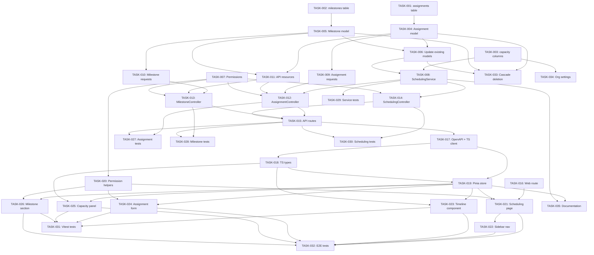

# PRD: Resource Scheduling Feature for Solidtime

Generated: 2026-02-06
Version: 1.0

---

## Table of Contents

1. [Source & Context](#1-source--context)
2. [Technical Interpretation](#2-technical-interpretation)
3. [Functional Specifications](#3-functional-specifications)
4. [Technical Requirements & Constraints](#4-technical-requirements--constraints)
5. [User Stories with Acceptance Criteria](#5-user-stories-with-acceptance-criteria)
6. [Task Breakdown Structure](#6-task-breakdown-structure)
7. [Dependencies & Integration Points](#7-dependencies--integration-points)
8. [Risk Assessment & Mitigation](#8-risk-assessment--mitigation)
9. [Testing & Validation Requirements](#9-testing--validation-requirements)
10. [Monitoring & Observability](#10-monitoring--observability)
11. [Success Metrics & Definition of Done](#11-success-metrics--definition-of-done)
12. [Technical Debt & Future Considerations](#12-technical-debt--future-considerations)
13. [Appendices](#13-appendices)

---

## Amendments (2026-02-06 Review)

> These amendments supersede conflicting content in the original PRD sections below.
> Reference: `.features/SHARED-FOUNDATIONS.md` and `.features/PRD-REVIEW-REPORT.md`

### AMD-01: Task ID Prefix
All task IDs in this PRD are now prefixed with `SCHED-`. E.g., TASK-001 becomes SCHED-001.

### AMD-02: Migration Timestamps (SF-03)
All migrations use date prefix `2026_03_08_`.

### AMD-03: Modular Permissions (SF-08)
Permissions are registered via `App\Permissions\SchedulingPermissions::register()` instead of directly modifying `JetstreamServiceProvider`.

### AMD-04: Shared weekly_capacity (SF-06) — CRITICAL
Remove the `weekly_capacity` column addition from SCHED-003. This column is now owned by the shared foundation migration FOUND-006 (`2026_02_28_000001_add_weekly_capacity_to_members.php`).

**SCHED-003 revised scope**: Create `assignments` and `milestones` tables only. Remove `weekly_capacity` from the migration. Add dependency on FOUND-006.

### AMD-05: Milestone API Route Consistency
Milestone routes should be consistently nested under projects:
- `GET /organizations/{org}/projects/{project}/milestones` — index
- `POST /organizations/{org}/projects/{project}/milestones` — store
- `PUT /organizations/{org}/projects/{project}/milestones/{milestone}` — update
- `DELETE /organizations/{org}/projects/{project}/milestones/{milestone}` — delete

This maintains the project context in all routes and is consistent with how tasks are routed in the existing codebase. The milestone controller should verify that the milestone belongs to the specified project.

### AMD-06: Placeholder Member Validation
Add explicit validation in SCHED-009 (AssignmentStoreRequest form request) to reject assignments where the member has `role = 'placeholder'`. The validation rule:
```php
'member_id' => [
    'required',
    new ExistsEloquent(Member::class, null, function ($query) {
        $query->where('organization_id', $this->organization->id)
              ->where('role', '!=', Role::PLACEHOLDER->value);
    }),
],
```

### AMD-07: Timeline Component Library
The Gantt/timeline component (SCHED-023, 20h) should use a lightweight library rather than building from scratch. Recommended options to evaluate during Architecture phase:
- `vue-gantt` — Vue 3 native, lightweight
- Custom implementation using `<canvas>` or SVG with horizontal scrolling

The 20h estimate is retained but the Architecture phase must validate this after library selection.

### AMD-08: Cross-Feature Integration Notes
**Integration with Feature 07 (PTO & Time Off)**:
- When PTO is implemented, the capacity calculation should account for approved time-off
- `CapacityService::getWeeklyCapacity($member, $week)` should subtract approved PTO hours
- If PTO is not deployed, the capacity defaults to the member's `weekly_capacity` value

**Integration with Feature 10 (Teams & Groups)**:
- Scheduling views should support `team_ids` filtering
- The assignments list and timeline endpoints should accept `team_ids` as an optional parameter

### AMD-09: Sprint Plan Addition
The task assignments document uses wave-based ordering but lacks sprint allocation. During the Architecture phase, the 10 waves should be mapped to 5 two-week sprints with capacity validation per sprint.

### AMD-10: OpenAPI Update Incremental Approach
SCHED-017 (OpenAPI update) should not be a single bottleneck task. Instead, each API endpoint task (SCHED-007, SCHED-010, SCHED-012) should include an incremental OpenAPI spec update as part of its definition of done.

---

## 1. Source & Context

### Feature Overview

Solidtime is an open-source time tracking application. While it currently supports project time tracking with `estimated_time` on Projects and Tasks, it has **no resource scheduling, capacity planning, or workload balancing** capabilities. Users track time after the fact but cannot plan future work allocation.

This PRD defines a **Resource Scheduling** feature that introduces forward-looking resource management: assigning members to projects with planned hours, creating project milestones, visualizing schedules on a timeline, and comparing planned vs. actual tracked time.

### Current State of the Codebase

- **Models**: `Organization`, `Member`, `User`, `Project`, `ProjectMember`, `Task`, `TimeEntry`, `Client`, `Tag`
- **Existing Estimation**: `Project.estimated_time` (integer, seconds, nullable) and `Task.estimated_time` (integer, seconds, nullable) already exist
- **Existing Aggregation**: `TimeEntryAggregationService` provides grouped time entry aggregation with support for grouping by user, project, task, day, week, month
- **Existing Spent Time**: `Project.spent_time` and `Task.spent_time` are computed attributes (sum of time entry durations)
- **Roles**: Owner, Admin, Manager, Employee, Placeholder -- permissions defined in `JetstreamServiceProvider`
- **API Pattern**: REST under `/api/v1/organizations/{organization}/...` with Passport auth, `check-organization-blocked` middleware on write endpoints
- **Frontend Pattern**: Vue 3 + TypeScript + Pinia stores + Inertia.js pages + Tailwind CSS + Heroicons
- **Database**: PostgreSQL with UUID primary keys (`HasUuids` trait)

### What Is Missing

1. No way to assign members to projects with planned hours per week/period
2. No milestone tracking with target dates
3. No visual timeline/Gantt view of resource allocation
4. No capacity calculation (available hours - assigned hours)
5. No scheduled-vs-tracked comparison
6. No workload visibility across team members

---

## 2. Technical Interpretation

### Business to Technical Translation

| Business Requirement | Technical Implementation |
|---|---|
| Assign members to projects with planned hours | New `Assignment` model linking `Member` to `Project` with `planned_seconds`, `start_date`, `end_date` |
| Track milestones with dates | New `Milestone` model belonging to `Project` with `name`, `due_date`, `completed_at` |
| Visual timeline of assignments | New `Scheduling.vue` Inertia page with Gantt-like horizontal bar chart component |
| Available capacity per member | `SchedulingService` computing `daily_capacity - sum(assigned_hours)` per member per period |
| Planned vs actual comparison | Query `Assignment.planned_seconds` vs `TimeEntryAggregationService` actual seconds, grouped by project/member/period |
| Over/under-allocation identification | Capacity utilization percentage with visual indicators (red >100%, yellow >80%, green <=80%) |

### Relationship to Existing Models

```
Organization
  |-- Member (user within org, has role)
  |     |-- Assignment (NEW: member assigned to project with planned hours)
  |     |-- TimeEntry (actual tracked time)
  |
  |-- Project
  |     |-- ProjectMember (existing: membership linkage with billable_rate)
  |     |-- Assignment (NEW: planned allocations)
  |     |-- Milestone (NEW: project milestones)
  |     |-- Task
  |     |-- TimeEntry
```

The `Assignment` model is intentionally **separate from `ProjectMember`**. `ProjectMember` controls access and billable rates. `Assignment` controls scheduling and planned allocation. A member can be a `ProjectMember` without having an `Assignment` (they have access but no planned hours), and an `Assignment` requires that the member is already a `ProjectMember`.

---

## 3. Functional Specifications

### 3.1 Core Requirements

#### REQ-001: Resource Assignments
- **Priority**: P0
- **Description**: Users with appropriate permissions (Owner, Admin, Manager) can create assignments that allocate a member to a project for a date range with planned hours per week.
- **Edge Cases**:
  - Assignment date ranges can overlap for the same member on different projects (deliberate overallocation)
  - Assignment cannot be created for a member who is not a `ProjectMember` of the target project
  - Assignment `planned_seconds` must be > 0
  - Archived projects cannot receive new assignments
  - Placeholder members cannot receive assignments
- **Error Scenarios**:
  - 422 if member is not a project member
  - 422 if project is archived
  - 403 if user lacks `assignments:create` permission
  - 404 if member or project not found within organization

#### REQ-002: Milestones
- **Priority**: P1
- **Description**: Users can create, update, and delete milestones on projects. Milestones have a name, due date, optional description, and can be marked complete.
- **Edge Cases**:
  - Multiple milestones can share the same due date on a project
  - Milestones on archived projects can be viewed but not created/updated
  - Completing a milestone sets `completed_at` to current timestamp
  - Reopening a milestone clears `completed_at`
- **Error Scenarios**:
  - 422 if `due_date` is not a valid date
  - 403 if user lacks `milestones:create` permission

#### REQ-003: Schedule View (Timeline)
- **Priority**: P0
- **Description**: A dedicated "Scheduling" page accessible from the sidebar shows a Gantt-like timeline. The horizontal axis represents weeks, the vertical axis represents members. Colored bars show assignments per project. Milestones appear as diamond markers on the timeline.
- **Edge Cases**:
  - Members with no assignments appear in the list but with empty rows
  - Very long assignments (>6 months) should still render correctly with horizontal scrolling
  - Timeline must respect the user's configured `week_start` day
- **Display Requirements**:
  - Default view: 4 weeks centered on today
  - Navigation: previous/next buttons to shift the window
  - Zoom levels: 1 week, 2 weeks, 4 weeks (default), 8 weeks, 12 weeks
  - Bars colored by project color (from `Project.color`)
  - Capacity utilization percentage shown per member per week

#### REQ-004: Capacity Planning
- **Priority**: P1
- **Description**: For each member, the system calculates available capacity as `weekly_capacity_seconds - sum(assigned_seconds_this_week)`. Weekly capacity defaults to the organization setting (default: 40 hours/week = 144000 seconds) but can be overridden per member.
- **Edge Cases**:
  - Part-time members have reduced weekly capacity
  - Capacity can be 0 (e.g., member on leave -- represented by zero capacity override for a date range)
  - Future capacity changes (e.g., member going part-time next month) should be supported via per-member capacity overrides with date ranges
- **Calculation**:
  - `remaining_capacity = weekly_capacity - sum(planned_seconds for all assignments overlapping this week)`
  - Negative remaining capacity indicates overallocation

#### REQ-005: Scheduled vs. Tracked Comparison
- **Priority**: P1
- **Description**: For any assignment (or aggregate by member/project), show planned hours alongside actual tracked hours from `TimeEntry` records. Displayed as a side-by-side or progress-bar comparison.
- **Data Source**: Reuse `TimeEntryAggregationService` to compute actual seconds grouped by user + project + time period, then join with `Assignment.planned_seconds`.
- **Edge Cases**:
  - Time entries may exist outside assignment date ranges (tracked before assignment started or after it ended)
  - Time tracked without an assignment still counts toward actual hours

#### REQ-006: Workload Balancing
- **Priority**: P2
- **Description**: A summary view showing each member's utilization percentage across a selected time range. Visual indicators highlight overallocated (>100%), high-load (80-100%), normal (50-80%), and underutilized (<50%) members.
- **Edge Cases**:
  - Members with zero capacity show as "N/A" rather than infinite utilization
  - Filtering by project shows only allocations for that project

### 3.2 User Workflows

#### Primary Workflow: Creating a Schedule

```
Manager opens Scheduling page
  -> Sees timeline view with all active members
  -> Clicks "Add Assignment" on a member row
  -> Selects project (from projects the member belongs to)
  -> Sets start date, end date, planned hours/week
  -> Saves assignment
  -> Timeline bar appears on the member's row
  -> Capacity indicators update in real-time
```

#### Secondary Workflow: Reviewing Scheduled vs. Actual

```
Manager opens Scheduling page
  -> Selects a specific member
  -> Views member detail panel (side panel or modal)
  -> Sees list of assignments with:
     - Planned hours per week
     - Actual tracked hours (from TimeEntry)
     - Variance (over/under)
     - Progress bar visualization
```

#### Milestone Workflow

```
Manager navigates to Project Show page (existing page)
  -> Sees new "Milestones" section
  -> Creates milestone with name and due date
  -> Milestone appears on project detail AND on the Scheduling timeline
  -> When milestone is completed, it is visually marked on the timeline
```

### 3.3 Business Rules

- **Assignment Validation**: `start_date` must be <= `end_date`; `planned_seconds` must be > 0; member must be a `ProjectMember`
- **Capacity Defaults**: Organization-level default weekly capacity is 40h (144000s); stored in `organizations.default_weekly_capacity`
- **Permission Model**: Assignments and milestones follow the same Owner/Admin/Manager pattern as projects -- Employees can view their own assignments but cannot create/modify any
- **Cascade Deletion**: Deleting a project deletes its assignments and milestones; deleting a `ProjectMember` deletes related assignments for that member on that project; deleting a `Member` deletes all their assignments
- **Audit Trail**: All assignment and milestone CRUD operations are auditable (using existing `CustomAuditable` trait)

---

## 4. Technical Requirements & Constraints

### 4.1 System Architecture

```
Frontend (Vue 3 + Inertia.js)               API (Laravel 11)                 Database (PostgreSQL)
+----------------------------+    HTTP/JSON    +---------------------------+    +----------------------+
| Scheduling.vue             |<-------------->| AssignmentController      |<-->| assignments          |
| ScheduleTimeline.vue       |                | MilestoneController       |<-->| milestones           |
| CapacityPanel.vue          |                | SchedulingService         |    | organizations        |
| AssignmentForm.vue         |                | TimeEntryAggregation-     |    |   (+ new columns)    |
| MilestoneSection.vue       |                |   Service (existing)      |    | members              |
| useScheduling.ts (store)   |                +---------------------------+    |   (+ new columns)    |
+----------------------------+                                                 +----------------------+
```

### 4.2 Data Models

#### New Model: `Assignment`

```php
/**
 * @property string $id UUID
 * @property string $organization_id
 * @property string $project_id
 * @property string $member_id
 * @property int $planned_seconds  Planned seconds per week
 * @property Carbon $start_date
 * @property Carbon $end_date
 * @property string|null $note  Optional note/description
 * @property Carbon|null $created_at
 * @property Carbon|null $updated_at
 */
class Assignment extends Model implements AuditableContract
{
    use CustomAuditable, HasFactory, HasUuids;

    protected $casts = [
        'planned_seconds' => 'integer',
        'start_date' => 'date',
        'end_date' => 'date',
    ];

    // Relationships: organization(), project(), member()
    // Scope: scopeWhereBelongsToOrganization(), scopeOverlapping()
}
```

#### New Model: `Milestone`

```php
/**
 * @property string $id UUID
 * @property string $name
 * @property string|null $description
 * @property string $project_id
 * @property string $organization_id
 * @property Carbon $due_date
 * @property Carbon|null $completed_at
 * @property-read bool $is_completed
 * @property Carbon|null $created_at
 * @property Carbon|null $updated_at
 */
class Milestone extends Model implements AuditableContract
{
    use CustomAuditable, HasFactory, HasUuids;

    protected $casts = [
        'due_date' => 'date',
        'completed_at' => 'datetime',
    ];

    // Relationships: project(), organization()
    // Accessor: isCompleted()
}
```

#### Modified Model: `Organization` (new column)

```php
// Add to organizations table:
'default_weekly_capacity' => 'integer', // seconds, default 144000 (40h)
```

#### Modified Model: `Member` (new column)

```php
// Add to members table:
'weekly_capacity' => 'integer', // nullable, seconds; null = use org default
```

### 4.3 API Contracts

#### Assignments API

```yaml
# List assignments for organization (with filters)
GET /api/v1/organizations/{organization}/assignments
  Query Parameters:
    member_id: string (optional) - filter by member
    project_id: string (optional) - filter by project
    start: string (optional) - ISO date, filter assignments overlapping this start
    end: string (optional) - ISO date, filter assignments overlapping this end
  Response 200:
    data: Assignment[]
    links: PaginationLinks

# Create assignment
POST /api/v1/organizations/{organization}/assignments
  Body:
    member_id: string (required, UUID)
    project_id: string (required, UUID)
    planned_seconds: integer (required, >0)
    start_date: string (required, Y-m-d)
    end_date: string (required, Y-m-d, >= start_date)
    note: string|null (optional)
  Response 201: { data: Assignment }
  Response 422: ValidationError (member not a ProjectMember, project archived, etc.)

# Update assignment
PUT /api/v1/organizations/{organization}/assignments/{assignment}
  Body:
    planned_seconds: integer (required, >0)
    start_date: string (required, Y-m-d)
    end_date: string (required, Y-m-d)
    note: string|null (optional)
  Response 200: { data: Assignment }

# Delete assignment
DELETE /api/v1/organizations/{organization}/assignments/{assignment}
  Response 204: No Content
```

#### Milestones API

```yaml
# List milestones for a project
GET /api/v1/organizations/{organization}/projects/{project}/milestones
  Query Parameters:
    completed: boolean (optional) - filter by completion status
  Response 200:
    data: Milestone[]

# Create milestone
POST /api/v1/organizations/{organization}/projects/{project}/milestones
  Body:
    name: string (required, max:255)
    description: string|null (optional, max:1000)
    due_date: string (required, Y-m-d)
  Response 201: { data: Milestone }

# Update milestone
PUT /api/v1/organizations/{organization}/milestones/{milestone}
  Body:
    name: string (required)
    description: string|null (optional)
    due_date: string (required, Y-m-d)
    is_completed: boolean (optional)
  Response 200: { data: Milestone }

# Delete milestone
DELETE /api/v1/organizations/{organization}/milestones/{milestone}
  Response 204: No Content
```

#### Scheduling (Aggregated View) API

```yaml
# Get schedule timeline data
GET /api/v1/organizations/{organization}/scheduling/timeline
  Query Parameters:
    start: string (required, Y-m-d) - start of visible window
    end: string (required, Y-m-d) - end of visible window
    member_ids[]: string[] (optional) - filter to specific members
    project_ids[]: string[] (optional) - filter to specific projects
  Response 200:
    data:
      members: MemberSchedule[]  # one per member
      milestones: MilestoneMarker[]  # milestones in the window

# MemberSchedule:
#   member: { id, name }
#   weekly_capacity: integer (seconds)
#   assignments: AssignmentBar[]  # bars on the timeline
#   weekly_utilization: { [week_start: string]: number }  # percentage per week

# AssignmentBar:
#   id: string
#   project: { id, name, color }
#   start_date: string
#   end_date: string
#   planned_seconds: integer

# Get capacity summary
GET /api/v1/organizations/{organization}/scheduling/capacity
  Query Parameters:
    start: string (required, Y-m-d)
    end: string (required, Y-m-d)
    member_ids[]: string[] (optional)
  Response 200:
    data:
      members: CapacitySummary[]

# CapacitySummary:
#   member: { id, name }
#   weekly_capacity: integer
#   total_planned: integer (sum of planned_seconds in range)
#   total_tracked: integer (actual seconds from TimeEntry)
#   utilization_percentage: number
#   status: 'overallocated' | 'high' | 'normal' | 'underutilized'
```

### 4.4 Performance Requirements

- **Timeline API**: Response time < 500ms for organizations with up to 50 members and 200 active assignments
- **Capacity API**: Response time < 300ms; this is a read-heavy aggregation endpoint
- **Assignment CRUD**: Standard response time < 200ms for single-record operations
- **Database Indexes**: Composite indexes on `assignments(organization_id, member_id, start_date, end_date)` and `milestones(project_id, due_date)` for efficient range queries

### 4.5 Security Requirements

- **Permission-Based Access**: New permissions `assignments:view`, `assignments:view:own`, `assignments:create`, `assignments:update`, `assignments:delete`, `milestones:view`, `milestones:create`, `milestones:update`, `milestones:delete`, `scheduling:view`, `scheduling:view:all`
- **Employee Visibility**: Employees can view their own assignments (`assignments:view:own`) and milestones of projects they belong to, but cannot create or modify assignments or milestones
- **Organization Scoping**: All queries must be scoped to `organization_id` to prevent cross-organization data leakage (following existing pattern of `whereBelongsTo($organization, 'organization')`)
- **Audit Logging**: All write operations on assignments and milestones are auditable

### 4.6 New Permissions Matrix

| Permission | Owner | Admin | Manager | Employee |
|---|:---:|:---:|:---:|:---:|
| `assignments:view` | Y | Y | Y | - |
| `assignments:view:own` | Y | Y | Y | Y |
| `assignments:create` | Y | Y | Y | - |
| `assignments:update` | Y | Y | Y | - |
| `assignments:delete` | Y | Y | Y | - |
| `milestones:view` | Y | Y | Y | Y |
| `milestones:create` | Y | Y | Y | - |
| `milestones:update` | Y | Y | Y | - |
| `milestones:delete` | Y | Y | Y | - |
| `scheduling:view` | Y | Y | Y | - |
| `scheduling:view:all` | Y | Y | Y | - |

---

## 5. User Stories with Acceptance Criteria

### US-001: Create Resource Assignment

**As a** Manager
**I want to** assign a team member to a project with planned weekly hours and a date range
**So that** I can plan how my team's time will be allocated across projects

**Priority**: P0
**Effort**: 8 story points
**Sprint**: 1-2

**Acceptance Criteria**:
- [ ] Manager can select a member from a dropdown (filtered to active members of the organization)
- [ ] Manager can select a project from a dropdown (filtered to projects the selected member belongs to via `ProjectMember`)
- [ ] Manager can set planned hours per week (converted to `planned_seconds` on save)
- [ ] Manager can set start date and end date (end date must be >= start date)
- [ ] Manager can optionally add a note
- [ ] Assignment is persisted and appears on the scheduling timeline
- [ ] API returns 422 if member is not a `ProjectMember` of the selected project
- [ ] API returns 422 if project is archived
- [ ] Employees cannot create assignments (403)
- [ ] Assignment creation is audit-logged

### US-002: View Schedule Timeline

**As a** Manager
**I want to** see a visual timeline showing all team members' project assignments
**So that** I can understand how resources are allocated across time

**Priority**: P0
**Effort**: 13 story points
**Sprint**: 2-3

**Acceptance Criteria**:
- [ ] Scheduling page is accessible from the sidebar navigation
- [ ] Timeline shows weeks on the horizontal axis
- [ ] Each member has a row on the vertical axis
- [ ] Assignment bars are colored by project color (`Project.color`)
- [ ] Hovering over a bar shows assignment details (project name, planned hours, dates)
- [ ] Today is highlighted with a vertical line
- [ ] Navigation buttons allow shifting the time window forward/backward
- [ ] Zoom controls allow changing from 1-week to 12-week views
- [ ] Milestones appear as diamond markers on the timeline
- [ ] Loading spinner shown while data is being fetched

### US-003: View Capacity Utilization

**As a** Manager
**I want to** see each team member's capacity utilization as a percentage
**So that** I can identify overallocated and underutilized team members

**Priority**: P1
**Effort**: 8 story points
**Sprint**: 3

**Acceptance Criteria**:
- [ ] Each member row on the timeline shows a utilization indicator
- [ ] Utilization = (sum of planned_seconds for the week) / weekly_capacity * 100
- [ ] Visual indicator colors: red (>100%), yellow (80-100%), green (<80%)
- [ ] Members with zero capacity show "N/A" indicator
- [ ] Capacity summary panel shows aggregate stats for the visible time window
- [ ] Organization default weekly capacity can be configured in organization settings
- [ ] Per-member weekly capacity can be overridden in member settings

### US-004: Compare Scheduled vs. Tracked Time

**As a** Manager
**I want to** see planned hours alongside actual tracked hours for each assignment
**So that** I can assess whether the team is on track with their planned workload

**Priority**: P1
**Effort**: 8 story points
**Sprint**: 3-4

**Acceptance Criteria**:
- [ ] Clicking on an assignment bar opens a detail panel
- [ ] Detail panel shows: planned hours (from assignment), actual hours (from TimeEntry aggregation), variance
- [ ] Variance is displayed as both absolute hours and percentage
- [ ] A progress bar shows actual vs. planned with visual overflow indicator when actual > planned
- [ ] Aggregation reuses `TimeEntryAggregationService` filtered by member + project + date range
- [ ] Summary view available that shows per-member totals across all assignments

### US-005: Manage Project Milestones

**As a** Manager
**I want to** create milestones on projects with target dates
**So that** I can track key deliverables and deadlines on the timeline

**Priority**: P1
**Effort**: 5 story points
**Sprint**: 2

**Acceptance Criteria**:
- [ ] Milestones section appears on the ProjectShow page
- [ ] Manager can create a milestone with name, due date, and optional description
- [ ] Manager can mark a milestone as complete/incomplete (toggles `completed_at`)
- [ ] Manager can edit milestone name, description, and due date
- [ ] Manager can delete a milestone
- [ ] Completed milestones are visually distinguished (strikethrough or checkmark)
- [ ] Milestones appear on the scheduling timeline as diamond markers
- [ ] Employees can view milestones on projects they belong to but cannot create/edit/delete

### US-006: Identify Workload Imbalance

**As a** Manager
**I want to** see a workload overview highlighting overallocated and underutilized members
**So that** I can redistribute work more effectively

**Priority**: P2
**Effort**: 5 story points
**Sprint**: 4

**Acceptance Criteria**:
- [ ] A "Capacity" tab or section on the scheduling page shows a summary table
- [ ] Table columns: Member Name, Weekly Capacity, Total Planned, Total Tracked, Utilization %, Status
- [ ] Status labels: Overallocated (>100%), High Load (80-100%), Normal (50-80%), Underutilized (<50%)
- [ ] Table is sortable by any column
- [ ] Filtering by project shows only allocations for that project
- [ ] Date range picker allows selecting the analysis window

### US-007: Employee Views Own Schedule

**As an** Employee
**I want to** see my own assignments and milestones on projects I belong to
**So that** I can understand what is expected of me

**Priority**: P1
**Effort**: 3 story points
**Sprint**: 4

**Acceptance Criteria**:
- [ ] Employee sees a simplified scheduling view showing only their own assignments
- [ ] Employee can see milestones on projects they are a member of
- [ ] Employee cannot see other members' assignments or capacity data
- [ ] Employee cannot create, edit, or delete assignments or milestones

---

## 6. Task Breakdown Structure

### Phase 1: Database & Models (Sprint 1)

---

#### TASK-001: Database Migration -- Create `assignments` Table

**Type**: Backend / Database
**Effort**: 3 story points (4h)
**Dependencies**: None

**Description**:
Create a new migration to add the `assignments` table.

**Files to create**:
- `database/migrations/2026_02_07_000001_create_assignments_table.php`

**Schema**:
```sql
CREATE TABLE assignments (
    id UUID PRIMARY KEY DEFAULT gen_random_uuid(),
    organization_id UUID NOT NULL REFERENCES organizations(id) ON DELETE CASCADE,
    project_id UUID NOT NULL REFERENCES projects(id) ON DELETE CASCADE,
    member_id UUID NOT NULL REFERENCES members(id) ON DELETE CASCADE,
    planned_seconds INTEGER NOT NULL CHECK (planned_seconds > 0),
    start_date DATE NOT NULL,
    end_date DATE NOT NULL CHECK (end_date >= start_date),
    note TEXT NULL,
    created_at TIMESTAMP NULL,
    updated_at TIMESTAMP NULL
);

CREATE INDEX idx_assignments_org_member ON assignments(organization_id, member_id);
CREATE INDEX idx_assignments_org_project ON assignments(organization_id, project_id);
CREATE INDEX idx_assignments_date_range ON assignments(start_date, end_date);
CREATE INDEX idx_assignments_member_dates ON assignments(member_id, start_date, end_date);
```

**Acceptance Criteria**:
- [ ] Migration runs without errors (`php artisan migrate`)
- [ ] Migration rollback works (`php artisan migrate:rollback`)
- [ ] All indexes are created
- [ ] Foreign key constraints are in place with CASCADE on delete

---

#### TASK-002: Database Migration -- Create `milestones` Table

**Type**: Backend / Database
**Effort**: 2 story points (3h)
**Dependencies**: None

**Description**:
Create a new migration to add the `milestones` table.

**Files to create**:
- `database/migrations/2026_02_07_000002_create_milestones_table.php`

**Schema**:
```sql
CREATE TABLE milestones (
    id UUID PRIMARY KEY DEFAULT gen_random_uuid(),
    name VARCHAR(255) NOT NULL,
    description TEXT NULL,
    project_id UUID NOT NULL REFERENCES projects(id) ON DELETE CASCADE,
    organization_id UUID NOT NULL REFERENCES organizations(id) ON DELETE CASCADE,
    due_date DATE NOT NULL,
    completed_at TIMESTAMP NULL,
    created_at TIMESTAMP NULL,
    updated_at TIMESTAMP NULL
);

CREATE INDEX idx_milestones_project_date ON milestones(project_id, due_date);
CREATE INDEX idx_milestones_org ON milestones(organization_id);
```

**Acceptance Criteria**:
- [ ] Migration runs without errors
- [ ] Migration rollback works
- [ ] Indexes created

---

#### TASK-003: Database Migration -- Add Capacity Columns

**Type**: Backend / Database
**Effort**: 2 story points (2h)
**Dependencies**: None

**Description**:
Add `default_weekly_capacity` to `organizations` and `weekly_capacity` to `members`.

**Files to create**:
- `database/migrations/2026_02_07_000003_add_capacity_columns.php`

**Schema Changes**:
```sql
ALTER TABLE organizations ADD COLUMN default_weekly_capacity INTEGER NOT NULL DEFAULT 144000;
ALTER TABLE members ADD COLUMN weekly_capacity INTEGER NULL;
```

**Acceptance Criteria**:
- [ ] Migration runs; existing organizations get default 144000 (40h in seconds)
- [ ] `members.weekly_capacity` is nullable (null means use org default)
- [ ] Migration rollback drops both columns

---

#### TASK-004: Eloquent Model -- `Assignment`

**Type**: Backend
**Effort**: 3 story points (4h)
**Dependencies**: [TASK-001]

**Description**:
Create the `Assignment` Eloquent model with relationships, scopes, and factory.

**Files to create**:
- `app/Models/Assignment.php`
- `database/factories/AssignmentFactory.php`

**Implementation Details**:
```php
// app/Models/Assignment.php
class Assignment extends Model implements AuditableContract
{
    use CustomAuditable, HasFactory, HasUuids;

    protected $casts = [
        'planned_seconds' => 'integer',
        'start_date' => 'date',
        'end_date' => 'date',
        'note' => 'string',
    ];

    public function organization(): BelongsTo { /* ... */ }
    public function project(): BelongsTo { /* ... */ }
    public function member(): BelongsTo { /* ... */ }

    // Scope to find assignments overlapping a date range
    public function scopeOverlapping(Builder $builder, Carbon $start, Carbon $end): void
    {
        $builder->where('start_date', '<=', $end)
                ->where('end_date', '>=', $start);
    }

    // Scope for organization scoping
    public function scopeWhereBelongsToOrganization(Builder $builder, Organization $organization): void
    {
        $builder->whereBelongsTo($organization, 'organization');
    }
}
```

**Acceptance Criteria**:
- [ ] Model follows existing patterns (`declare(strict_types=1)`, `HasUuids`, `CustomAuditable`)
- [ ] All three relationships defined and tested
- [ ] `scopeOverlapping` correctly filters by date range overlap
- [ ] Factory produces valid records

---

#### TASK-005: Eloquent Model -- `Milestone`

**Type**: Backend
**Effort**: 2 story points (3h)
**Dependencies**: [TASK-002]

**Description**:
Create the `Milestone` Eloquent model with relationships, `isCompleted` accessor, and factory.

**Files to create**:
- `app/Models/Milestone.php`
- `database/factories/MilestoneFactory.php`

**Implementation Details**:
```php
// app/Models/Milestone.php
class Milestone extends Model implements AuditableContract
{
    use CustomAuditable, HasFactory, HasUuids;

    protected $casts = [
        'name' => 'string',
        'due_date' => 'date',
        'completed_at' => 'datetime',
    ];

    public function project(): BelongsTo { /* ... */ }
    public function organization(): BelongsTo { /* ... */ }

    protected function isCompleted(): Attribute
    {
        return Attribute::make(
            get: fn (mixed $value, array $attributes) => isset($attributes['completed_at']),
        );
    }
}
```

**Acceptance Criteria**:
- [ ] Model follows existing patterns
- [ ] `is_completed` accessor works correctly
- [ ] Factory produces valid records

---

#### TASK-006: Update Existing Models with New Relationships

**Type**: Backend
**Effort**: 2 story points (2h)
**Dependencies**: [TASK-004, TASK-005]

**Description**:
Add `assignments()` and `milestones()` relationships to `Project`, `Member`, and `Organization` models. Update `Organization` model casts for `default_weekly_capacity`. Update `Member` model casts for `weekly_capacity`.

**Files to modify**:
- `app/Models/Project.php` -- add `assignments(): HasMany`, `milestones(): HasMany`
- `app/Models/Member.php` -- add `assignments(): HasMany`, cast `weekly_capacity`
- `app/Models/Organization.php` -- cast `default_weekly_capacity`

**Acceptance Criteria**:
- [ ] `$project->assignments` returns related assignments
- [ ] `$project->milestones` returns related milestones
- [ ] `$member->assignments` returns related assignments
- [ ] `$organization->default_weekly_capacity` returns integer
- [ ] `$member->weekly_capacity` returns integer or null

---

#### TASK-007: Register New Permissions

**Type**: Backend
**Effort**: 2 story points (2h)
**Dependencies**: None

**Description**:
Add new permissions to `JetstreamServiceProvider::configurePermissions()` for assignments, milestones, and scheduling.

**Files to modify**:
- `app/Providers/JetstreamServiceProvider.php`

**Permissions to add**:
- Owner/Admin/Manager: `assignments:view`, `assignments:create`, `assignments:update`, `assignments:delete`, `milestones:view`, `milestones:create`, `milestones:update`, `milestones:delete`, `scheduling:view`, `scheduling:view:all`
- Employee: `assignments:view:own`, `milestones:view`

**Acceptance Criteria**:
- [ ] All new permissions added to appropriate roles
- [ ] Employee has `assignments:view:own` and `milestones:view` only
- [ ] Placeholder role has no new permissions

---

### Phase 2: Backend Services & API (Sprint 2)

---

#### TASK-008: `SchedulingService` -- Core Business Logic

**Type**: Backend
**Effort**: 8 story points (12h)
**Dependencies**: [TASK-004, TASK-005, TASK-006, TASK-003]

**Description**:
Create `SchedulingService` containing the core business logic for capacity calculation, timeline data assembly, and scheduled-vs-tracked comparison.

**Files to create**:
- `app/Service/SchedulingService.php`

**Key Methods**:
```php
class SchedulingService
{
    public function __construct(
        private TimeEntryAggregationService $aggregationService
    ) {}

    /**
     * Get effective weekly capacity for a member (member override or org default).
     */
    public function getMemberWeeklyCapacity(Member $member, Organization $organization): int

    /**
     * Get timeline data: member rows with assignment bars and weekly utilization.
     */
    public function getTimelineData(
        Organization $organization,
        Carbon $start,
        Carbon $end,
        ?array $memberIds = null,
        ?array $projectIds = null
    ): array

    /**
     * Get capacity summary for members in a date range.
     * Returns planned seconds, tracked seconds, utilization percentage.
     */
    public function getCapacitySummary(
        Organization $organization,
        Carbon $start,
        Carbon $end,
        ?array $memberIds = null
    ): array

    /**
     * Get scheduled vs tracked comparison for a specific assignment.
     */
    public function getAssignmentComparison(Assignment $assignment): array

    /**
     * Calculate weekly utilization for a member across a date range.
     * Returns map of week_start => utilization_percentage.
     */
    private function calculateWeeklyUtilization(
        Member $member,
        Organization $organization,
        Carbon $start,
        Carbon $end
    ): array

    /**
     * Count the number of weeks an assignment spans.
     */
    private function getAssignmentWeekCount(Assignment $assignment): int
}
```

**Acceptance Criteria**:
- [ ] `getMemberWeeklyCapacity` returns member override if set, otherwise org default
- [ ] `getTimelineData` returns correctly structured data for frontend rendering
- [ ] `getCapacitySummary` correctly aggregates planned and tracked time
- [ ] Tracked time is sourced from `TimeEntry` records via the existing aggregation service
- [ ] Utilization correctly handles zero-capacity edge case (returns null/NaN rather than division by zero)

---

#### TASK-009: Form Requests -- Assignment Validation

**Type**: Backend
**Effort**: 3 story points (4h)
**Dependencies**: [TASK-004]

**Description**:
Create form request classes for assignment CRUD with validation rules.

**Files to create**:
- `app/Http/Requests/V1/Assignment/AssignmentStoreRequest.php`
- `app/Http/Requests/V1/Assignment/AssignmentUpdateRequest.php`
- `app/Http/Requests/V1/Assignment/AssignmentIndexRequest.php`

**Validation Rules (Store)**:
```php
public function rules(): array
{
    return [
        'member_id' => ['required', 'uuid', new ExistsEloquent(Member::class, null, function ($query) {
            $query->where('organization_id', $this->organization->id);
        })],
        'project_id' => ['required', 'uuid', new ExistsEloquent(Project::class, null, function ($query) {
            $query->where('organization_id', $this->organization->id);
        })],
        'planned_seconds' => ['required', 'integer', 'min:1'],
        'start_date' => ['required', 'date', 'date_format:Y-m-d'],
        'end_date' => ['required', 'date', 'date_format:Y-m-d', 'after_or_equal:start_date'],
        'note' => ['nullable', 'string', 'max:1000'],
    ];
}
```

**Custom Validation** (in controller or request `withValidator`):
- Member must be a `ProjectMember` of the specified project
- Project must not be archived

**Acceptance Criteria**:
- [ ] Store request validates all required fields
- [ ] Update request validates same fields except `member_id` and `project_id` (immutable after creation)
- [ ] Index request validates optional filter parameters
- [ ] Custom validation rejects non-ProjectMember assignments
- [ ] Custom validation rejects archived project assignments

---

#### TASK-010: Form Requests -- Milestone Validation

**Type**: Backend
**Effort**: 2 story points (3h)
**Dependencies**: [TASK-005]

**Description**:
Create form request classes for milestone CRUD.

**Files to create**:
- `app/Http/Requests/V1/Milestone/MilestoneStoreRequest.php`
- `app/Http/Requests/V1/Milestone/MilestoneUpdateRequest.php`

**Validation Rules (Store)**:
```php
public function rules(): array
{
    return [
        'name' => ['required', 'string', 'max:255'],
        'description' => ['nullable', 'string', 'max:1000'],
        'due_date' => ['required', 'date', 'date_format:Y-m-d'],
    ];
}
```

**Update** adds:
```php
'is_completed' => ['sometimes', 'boolean'],
```

**Acceptance Criteria**:
- [ ] Store request validates name and due_date
- [ ] Update request allows toggling `is_completed`

---

#### TASK-011: API Resources -- Assignment & Milestone

**Type**: Backend
**Effort**: 3 story points (4h)
**Dependencies**: [TASK-004, TASK-005]

**Description**:
Create API resource classes for JSON serialization.

**Files to create**:
- `app/Http/Resources/V1/Assignment/AssignmentResource.php`
- `app/Http/Resources/V1/Assignment/AssignmentCollection.php`
- `app/Http/Resources/V1/Milestone/MilestoneResource.php`
- `app/Http/Resources/V1/Milestone/MilestoneCollection.php`

**AssignmentResource output**:
```json
{
    "id": "uuid",
    "organization_id": "uuid",
    "project_id": "uuid",
    "member_id": "uuid",
    "planned_seconds": 28800,
    "start_date": "2026-02-10",
    "end_date": "2026-03-10",
    "note": "Sprint 1 allocation",
    "project": { "id": "...", "name": "...", "color": "..." },
    "member": { "id": "...", "user": { "id": "...", "name": "..." } },
    "created_at": "2026-02-06T12:00:00Z",
    "updated_at": "2026-02-06T12:00:00Z"
}
```

**MilestoneResource output**:
```json
{
    "id": "uuid",
    "name": "Beta Release",
    "description": "Feature complete for beta testing",
    "project_id": "uuid",
    "due_date": "2026-03-15",
    "is_completed": false,
    "completed_at": null,
    "created_at": "2026-02-06T12:00:00Z",
    "updated_at": "2026-02-06T12:00:00Z"
}
```

**Acceptance Criteria**:
- [ ] Resources extend `BaseResource`
- [ ] Date formatting uses `formatDate()` and `formatDateTime()` from `BaseResource`
- [ ] Assignment resource includes nested project info (id, name, color)
- [ ] Assignment resource includes nested member/user info (id, name)

---

#### TASK-012: `AssignmentController` -- CRUD Endpoints

**Type**: Backend
**Effort**: 5 story points (8h)
**Dependencies**: [TASK-008, TASK-009, TASK-011, TASK-007]

**Description**:
Create the Assignment API controller with CRUD operations.

**Files to create**:
- `app/Http/Controllers/Api/V1/AssignmentController.php`

**Implementation Pattern** (following `ProjectMemberController`):
```php
class AssignmentController extends Controller
{
    protected function checkPermission(
        Organization $organization,
        string $permission,
        ?Assignment $assignment = null
    ): void {
        parent::checkPermission($organization, $permission);
        if ($assignment !== null && $assignment->organization_id !== $organization->id) {
            throw new AuthorizationException('Assignment does not belong to organization');
        }
    }

    public function index(Organization $organization, AssignmentIndexRequest $request): AssignmentCollection
    public function store(Organization $organization, AssignmentStoreRequest $request): JsonResource
    public function update(Organization $organization, Assignment $assignment, AssignmentUpdateRequest $request): JsonResource
    public function destroy(Organization $organization, Assignment $assignment): JsonResponse
}
```

**Business Rules in `store()`**:
1. Check `assignments:create` permission
2. Verify member is a `ProjectMember` of the target project (422 if not)
3. Verify project is not archived (422 if archived)
4. Verify member is not a Placeholder (422)
5. Create assignment and return resource

**Acceptance Criteria**:
- [ ] All four CRUD endpoints functional
- [ ] `index` supports filtering by `member_id`, `project_id`, and date range
- [ ] `store` validates ProjectMember relationship
- [ ] `store` rejects archived projects
- [ ] `update` does not allow changing `member_id` or `project_id`
- [ ] `destroy` returns 204
- [ ] All endpoints check appropriate permissions
- [ ] `check-organization-blocked` middleware on write endpoints

---

#### TASK-013: `MilestoneController` -- CRUD Endpoints

**Type**: Backend
**Effort**: 5 story points (8h)
**Dependencies**: [TASK-010, TASK-011, TASK-007]

**Description**:
Create the Milestone API controller with CRUD operations.

**Files to create**:
- `app/Http/Controllers/Api/V1/MilestoneController.php`

**Implementation**:
```php
class MilestoneController extends Controller
{
    public function index(Organization $organization, Project $project): MilestoneCollection
    public function store(Organization $organization, Project $project, MilestoneStoreRequest $request): JsonResource
    public function update(Organization $organization, Milestone $milestone, MilestoneUpdateRequest $request): JsonResource
    public function destroy(Organization $organization, Milestone $milestone): JsonResponse
}
```

**Key behavior in `update()`**: If `is_completed` is `true` and `completed_at` is null, set `completed_at` to `Carbon::now()`. If `is_completed` is `false`, set `completed_at` to `null`.

**Acceptance Criteria**:
- [ ] All CRUD endpoints functional
- [ ] `index` scoped to project within organization
- [ ] `update` handles completion toggling
- [ ] Archived project check on `store` (cannot create milestones on archived projects)
- [ ] Proper permission checks

---

#### TASK-014: `SchedulingController` -- Timeline & Capacity Endpoints

**Type**: Backend
**Effort**: 5 story points (8h)
**Dependencies**: [TASK-008, TASK-007]

**Description**:
Create the Scheduling API controller for timeline and capacity aggregation endpoints.

**Files to create**:
- `app/Http/Controllers/Api/V1/SchedulingController.php`
- `app/Http/Requests/V1/Scheduling/SchedulingTimelineRequest.php`
- `app/Http/Requests/V1/Scheduling/SchedulingCapacityRequest.php`

**Endpoints**:
```php
class SchedulingController extends Controller
{
    public function timeline(
        Organization $organization,
        SchedulingTimelineRequest $request,
        SchedulingService $schedulingService,
        TimezoneService $timezoneService
    ): JsonResponse

    public function capacity(
        Organization $organization,
        SchedulingCapacityRequest $request,
        SchedulingService $schedulingService,
        TimezoneService $timezoneService
    ): JsonResponse
}
```

**Acceptance Criteria**:
- [ ] Timeline endpoint returns members with assignment bars and utilization data
- [ ] Capacity endpoint returns per-member summary with planned, tracked, utilization
- [ ] Both endpoints require `scheduling:view` or `scheduling:view:all` permission
- [ ] Results scoped to organization
- [ ] Date range parameters validated

---

#### TASK-015: Register API Routes

**Type**: Backend
**Effort**: 2 story points (2h)
**Dependencies**: [TASK-012, TASK-013, TASK-014]

**Description**:
Register all new API routes in `routes/api.php`.

**Files to modify**:
- `routes/api.php`

**Routes to add**:
```php
// Assignment routes
Route::name('assignments.')->prefix('/organizations/{organization}')->group(static function (): void {
    Route::get('/assignments', [AssignmentController::class, 'index'])->name('index');
    Route::post('/assignments', [AssignmentController::class, 'store'])->name('store')->middleware('check-organization-blocked');
    Route::put('/assignments/{assignment}', [AssignmentController::class, 'update'])->name('update')->middleware('check-organization-blocked');
    Route::delete('/assignments/{assignment}', [AssignmentController::class, 'destroy'])->name('destroy');
});

// Milestone routes
Route::name('milestones.')->prefix('/organizations/{organization}')->group(static function (): void {
    Route::get('/projects/{project}/milestones', [MilestoneController::class, 'index'])->name('index');
    Route::post('/projects/{project}/milestones', [MilestoneController::class, 'store'])->name('store')->middleware('check-organization-blocked');
    Route::put('/milestones/{milestone}', [MilestoneController::class, 'update'])->name('update')->middleware('check-organization-blocked');
    Route::delete('/milestones/{milestone}', [MilestoneController::class, 'destroy'])->name('destroy');
});

// Scheduling routes
Route::name('scheduling.')->prefix('/organizations/{organization}/scheduling')->group(static function (): void {
    Route::get('/timeline', [SchedulingController::class, 'timeline'])->name('timeline');
    Route::get('/capacity', [SchedulingController::class, 'capacity'])->name('capacity');
});
```

**Acceptance Criteria**:
- [ ] All routes registered and accessible
- [ ] `check-organization-blocked` middleware on write endpoints
- [ ] Route names follow convention: `api.v1.{feature}.{action}`

---

#### TASK-016: Register Web Route for Scheduling Page

**Type**: Backend
**Effort**: 1 story point (1h)
**Dependencies**: None

**Description**:
Add the Inertia web route for the Scheduling page.

**Files to modify**:
- `routes/web.php`

**Route to add**:
```php
Route::get('/scheduling', function () {
    return Inertia::render('Scheduling');
})->name('scheduling');
```

**Acceptance Criteria**:
- [ ] Route registered within the `auth:web` middleware group
- [ ] Route name is `scheduling`

---

#### TASK-017: Update OpenAPI Spec and Regenerate TypeScript Client

**Type**: Backend / Frontend
**Effort**: 3 story points (4h)
**Dependencies**: [TASK-015]

**Description**:
Update `openapi.json` with the new Assignment, Milestone, and Scheduling endpoints. Regenerate the TypeScript API client.

**Files to modify**:
- `openapi.json`
- `resources/js/packages/api/src/openapi.json.client.ts` (regenerated)

**Acceptance Criteria**:
- [ ] All new endpoints documented in OpenAPI spec
- [ ] TypeScript client includes typed methods for all new endpoints
- [ ] Existing endpoints unaffected

---

### Phase 3: Frontend -- Types, Store, and Core Components (Sprint 3)

---

#### TASK-018: TypeScript Type Definitions

**Type**: Frontend
**Effort**: 2 story points (3h)
**Dependencies**: [TASK-017]

**Description**:
Create TypeScript type definitions for the scheduling feature.

**Files to create**:
- `resources/js/types/scheduling.d.ts`

**Types**:
```typescript
export interface Assignment {
    id: string;
    organization_id: string;
    project_id: string;
    member_id: string;
    planned_seconds: number;
    start_date: string; // Y-m-d
    end_date: string;
    note: string | null;
    project: { id: string; name: string; color: string };
    member: { id: string; user: { id: string; name: string } };
    created_at: string;
    updated_at: string;
}

export interface Milestone {
    id: string;
    name: string;
    description: string | null;
    project_id: string;
    due_date: string;
    is_completed: boolean;
    completed_at: string | null;
    created_at: string;
    updated_at: string;
}

export interface MemberSchedule {
    member: { id: string; name: string };
    weekly_capacity: number;
    assignments: AssignmentBar[];
    weekly_utilization: Record<string, number>; // week_start -> percentage
}

export interface AssignmentBar {
    id: string;
    project: { id: string; name: string; color: string };
    start_date: string;
    end_date: string;
    planned_seconds: number;
}

export interface MilestoneMarker {
    id: string;
    name: string;
    project: { id: string; name: string; color: string };
    due_date: string;
    is_completed: boolean;
}

export interface CapacitySummary {
    member: { id: string; name: string };
    weekly_capacity: number;
    total_planned: number;
    total_tracked: number;
    utilization_percentage: number;
    status: 'overallocated' | 'high' | 'normal' | 'underutilized';
}

export type ZoomLevel = '1w' | '2w' | '4w' | '8w' | '12w';
```

**Acceptance Criteria**:
- [ ] All API response shapes have corresponding TypeScript interfaces
- [ ] Types are exported and importable by stores and components

---

#### TASK-019: Pinia Store -- `useSchedulingStore`

**Type**: Frontend
**Effort**: 8 story points (12h)
**Dependencies**: [TASK-017, TASK-018]

**Description**:
Create the Pinia store for managing scheduling state, API calls, and data caching.

**Files to create**:
- `resources/js/utils/useScheduling.ts`

**Store Shape**:
```typescript
export const useSchedulingStore = defineStore('scheduling', () => {
    // State
    const timelineData = ref<MemberSchedule[]>([]);
    const milestoneMarkers = ref<MilestoneMarker[]>([]);
    const capacityData = ref<CapacitySummary[]>([]);
    const viewStart = ref<string>(/* 2 weeks ago */);
    const viewEnd = ref<string>(/* 2 weeks from now */);
    const zoomLevel = ref<ZoomLevel>('4w');
    const isLoading = ref(false);
    const selectedMemberId = ref<string | null>(null);
    const selectedProjectId = ref<string | null>(null);
    const error = ref<string | null>(null);

    // Actions
    async function loadTimeline(): Promise<void>
    async function loadCapacity(): Promise<void>
    function navigateForward(): void
    function navigateBackward(): void
    function setZoomLevel(level: ZoomLevel): void
    function setMemberFilter(memberId: string | null): void
    function setProjectFilter(projectId: string | null): void

    // Assignment CRUD
    async function createAssignment(data: AssignmentCreatePayload): Promise<void>
    async function updateAssignment(id: string, data: AssignmentUpdatePayload): Promise<void>
    async function deleteAssignment(id: string): Promise<void>

    // Milestone CRUD
    async function createMilestone(projectId: string, data: MilestoneCreatePayload): Promise<void>
    async function updateMilestone(id: string, data: MilestoneUpdatePayload): Promise<void>
    async function deleteMilestone(id: string): Promise<void>
});
```

**Acceptance Criteria**:
- [ ] Store loads timeline data from API and caches in reactive state
- [ ] Navigation updates `viewStart`/`viewEnd` and reloads data
- [ ] Zoom level changes recalculate the view window and reload
- [ ] Assignment CRUD methods call API and refresh timeline data
- [ ] Error handling uses `useNotificationsStore` (following `useTimesheetStore` pattern)
- [ ] `getCurrentOrganizationId()` used for all API calls

---

#### TASK-020: Permissions Helpers -- Frontend

**Type**: Frontend
**Effort**: 1 story point (1h)
**Dependencies**: [TASK-007]

**Description**:
Add permission helper functions for the new scheduling permissions.

**Files to modify**:
- `resources/js/utils/permissions.ts`

**Functions to add**:
```typescript
export function canViewAssignments() {
    return currentUserHasPermission('assignments:view');
}
export function canViewOwnAssignments() {
    return currentUserHasPermission('assignments:view:own');
}
export function canCreateAssignments() {
    return currentUserHasPermission('assignments:create');
}
export function canUpdateAssignments() {
    return currentUserHasPermission('assignments:update');
}
export function canDeleteAssignments() {
    return currentUserHasPermission('assignments:delete');
}
export function canViewMilestones() {
    return currentUserHasPermission('milestones:view');
}
export function canCreateMilestones() {
    return currentUserHasPermission('milestones:create');
}
export function canUpdateMilestones() {
    return currentUserHasPermission('milestones:update');
}
export function canDeleteMilestones() {
    return currentUserHasPermission('milestones:delete');
}
export function canViewScheduling() {
    return currentUserHasPermission('scheduling:view');
}
```

**Acceptance Criteria**:
- [ ] All permission helpers added and exported
- [ ] Follow existing naming convention

---

### Phase 4: Frontend -- UI Components (Sprint 3-4)

---

#### TASK-021: Scheduling Page -- `Scheduling.vue`

**Type**: Frontend
**Effort**: 5 story points (8h)
**Dependencies**: [TASK-016, TASK-019, TASK-020]

**Description**:
Create the main Scheduling Inertia page with layout, navigation, and component composition.

**Files to create**:
- `resources/js/Pages/Scheduling.vue`

**Structure**:
```vue
<script setup lang="ts">
import AppLayout from '@/Layouts/AppLayout.vue';
import MainContainer from '@/packages/ui/src/MainContainer.vue';
import ScheduleTimeline from '@/packages/ui/src/Scheduling/ScheduleTimeline.vue';
import CapacityPanel from '@/packages/ui/src/Scheduling/CapacityPanel.vue';
import { useSchedulingStore } from '@/utils/useScheduling';
// ...
</script>

<template>
    <AppLayout title="Scheduling" data-testid="scheduling_view">
        <MainContainer>
            <!-- Header with title, zoom controls, navigation -->
            <!-- Tab bar: Timeline | Capacity -->
            <!-- ScheduleTimeline or CapacityPanel based on active tab -->
        </MainContainer>
    </AppLayout>
</template>
```

**Acceptance Criteria**:
- [ ] Page renders within `AppLayout`
- [ ] Header shows title with `CalendarDaysIcon` from heroicons
- [ ] Zoom controls allow changing between 1w/2w/4w/8w/12w
- [ ] Navigation arrows shift the time window
- [ ] Tab switching between Timeline and Capacity views
- [ ] Loading state shown while data loads

---

#### TASK-022: Add Scheduling to Sidebar Navigation

**Type**: Frontend
**Effort**: 1 story point (1h)
**Dependencies**: [TASK-021, TASK-020]

**Description**:
Add the Scheduling page link to the sidebar navigation in `AppLayout.vue`.

**Files to modify**:
- `resources/js/Layouts/AppLayout.vue`

**Implementation**: Add a new `NavigationSidebarItem` after the Reporting entry, using `CalendarDaysIcon` from `@heroicons/vue/20/solid`, gated behind `canViewScheduling()`.

**Acceptance Criteria**:
- [ ] "Scheduling" appears in the sidebar between "Reporting" and "Manage" section
- [ ] Only visible to users with `scheduling:view` permission
- [ ] Active state works when on `/scheduling` route
- [ ] Icon is consistent with sidebar design

---

#### TASK-023: Timeline Component -- `ScheduleTimeline.vue`

**Type**: Frontend
**Effort**: 13 story points (20h)
**Dependencies**: [TASK-019, TASK-018]

**Description**:
Create the core Gantt-like timeline visualization component. This is the most complex frontend component.

**Files to create**:
- `resources/js/packages/ui/src/Scheduling/ScheduleTimeline.vue`
- `resources/js/packages/ui/src/Scheduling/TimelineHeader.vue`
- `resources/js/packages/ui/src/Scheduling/TimelineMemberRow.vue`
- `resources/js/packages/ui/src/Scheduling/AssignmentBar.vue`
- `resources/js/packages/ui/src/Scheduling/MilestoneMarker.vue`
- `resources/js/packages/ui/src/Scheduling/TodayLine.vue`

**Layout**:
```
+------------------+------+------+------+------+------+------+
| Member Name      | W1   | W2   | W3   | W4   | W5   | W6   |
+------------------+------+------+------+------+------+------+
| Alice (80%)      | ████████████████████ Project A           |
|                  |      | ██████████ Project B               |
+------------------+------+------+------+------+------+------+
| Bob (120%)       | ████████████████████████████████████████ |
+------------------+------+------+------+------+------+------+
```

**Key Implementation Details**:
- Week columns calculated from `viewStart` to `viewEnd`
- Assignment bar positioning: `left` and `width` calculated as percentages based on date range overlap with visible window
- Bars clipped at viewport edges if assignment extends beyond visible range
- Bars use `Project.color` as background color with appropriate text contrast
- Today line is a vertical red line positioned at today's date percentage
- Milestone markers are diamond SVG shapes at the `due_date` position
- Utilization percentage shown next to member name with color coding
- Horizontal scrolling enabled for narrow viewports

**Acceptance Criteria**:
- [ ] Timeline renders correctly for all zoom levels
- [ ] Assignment bars position accurately based on dates
- [ ] Bars colored by project color
- [ ] Hover tooltip shows assignment details
- [ ] Today line positioned correctly
- [ ] Milestone diamonds rendered at correct positions
- [ ] Utilization percentage shown with color coding per member
- [ ] Responsive layout with horizontal scrolling
- [ ] Empty state shown when no assignments exist

---

#### TASK-024: Assignment Form -- `AssignmentForm.vue`

**Type**: Frontend
**Effort**: 5 story points (8h)
**Dependencies**: [TASK-019, TASK-020]

**Description**:
Create a modal form for creating and editing assignments.

**Files to create**:
- `resources/js/packages/ui/src/Scheduling/AssignmentForm.vue`

**Form Fields**:
- Member dropdown (searchable, filtered to org members excluding placeholders)
- Project dropdown (searchable, filtered to projects the selected member belongs to)
- Planned hours per week (number input, converts to/from `planned_seconds`)
- Start date (date picker)
- End date (date picker)
- Note (textarea, optional)

**Acceptance Criteria**:
- [ ] Form opens as a modal (`DialogModal.vue` pattern)
- [ ] Project dropdown dynamically filters based on selected member's ProjectMember records
- [ ] Hours input converts to seconds for API and back for display
- [ ] Date validation prevents end_date < start_date client-side
- [ ] Loading state while saving
- [ ] Error display for API validation errors (e.g., member not a ProjectMember)
- [ ] Form resets on successful save
- [ ] Works for both create and edit modes

---

#### TASK-025: Capacity Panel -- `CapacityPanel.vue`

**Type**: Frontend
**Effort**: 5 story points (8h)
**Dependencies**: [TASK-019, TASK-018]

**Description**:
Create the capacity summary panel showing member utilization in a table format.

**Files to create**:
- `resources/js/packages/ui/src/Scheduling/CapacityPanel.vue`
- `resources/js/packages/ui/src/Scheduling/UtilizationBadge.vue`

**Table Columns**:
- Member Name
- Weekly Capacity (hours)
- Total Planned (hours)
- Total Tracked (hours)
- Variance (planned - tracked)
- Utilization %
- Status badge (Overallocated/High/Normal/Underutilized)

**Acceptance Criteria**:
- [ ] Table renders all members with their capacity data
- [ ] Sortable by any column
- [ ] Status badge color-coded (red/yellow/green/blue)
- [ ] Hours displayed in human-readable format (e.g., "32h", "40h")
- [ ] Zero-capacity members show "N/A"
- [ ] Date range matches the timeline view window

---

#### TASK-026: Milestone Section for ProjectShow Page

**Type**: Frontend
**Effort**: 5 story points (8h)
**Dependencies**: [TASK-019, TASK-020]

**Description**:
Add a milestones section to the existing `ProjectShow.vue` page.

**Files to create**:
- `resources/js/packages/ui/src/Scheduling/MilestoneSection.vue`
- `resources/js/packages/ui/src/Scheduling/MilestoneRow.vue`
- `resources/js/packages/ui/src/Scheduling/MilestoneForm.vue`

**Files to modify**:
- `resources/js/Pages/ProjectShow.vue`

**Layout**:
```
## Milestones

[+ Add Milestone]  (visible to Manager+)

| Name           | Due Date   | Status      | Actions     |
|----------------|------------|-------------|-------------|
| Beta Release   | 2026-03-15 | [ ] Pending | Edit Delete |
| MVP Launch     | 2026-02-28 | [x] Done    | Edit Delete |
```

**Acceptance Criteria**:
- [ ] Milestones section appears on ProjectShow page below existing content
- [ ] List shows all milestones for the project, sorted by due_date
- [ ] "Add Milestone" button opens a form modal (Manager+ only)
- [ ] Checkbox toggles completion status inline
- [ ] Edit/Delete actions available (Manager+ only)
- [ ] Employees can view but not modify milestones
- [ ] Overdue milestones (past due_date, not completed) visually highlighted

---

### Phase 5: Testing (Sprint 4-5)

---

#### TASK-027: Backend Unit Tests -- Assignment Endpoint

**Type**: QA / Backend
**Effort**: 5 story points (8h)
**Dependencies**: [TASK-012, TASK-015]

**Description**:
Create comprehensive endpoint tests for the Assignment API.

**Files to create**:
- `tests/Unit/Endpoint/Api/V1/AssignmentEndpointTest.php`

**Test Cases**:
```php
class AssignmentEndpointTest extends ApiEndpointTestAbstract
{
    // Index
    public function test_index_returns_assignments_for_organization()
    public function test_index_filters_by_member_id()
    public function test_index_filters_by_project_id()
    public function test_index_filters_by_date_range()
    public function test_index_employee_can_only_see_own_assignments()
    public function test_index_requires_permission()

    // Store
    public function test_store_creates_assignment()
    public function test_store_fails_if_member_not_project_member()
    public function test_store_fails_if_project_archived()
    public function test_store_fails_if_placeholder_member()
    public function test_store_requires_permission()
    public function test_store_validates_date_range()
    public function test_store_validates_planned_seconds_positive()

    // Update
    public function test_update_modifies_assignment()
    public function test_update_cannot_change_member_id()
    public function test_update_cannot_change_project_id()
    public function test_update_requires_permission()

    // Destroy
    public function test_destroy_deletes_assignment()
    public function test_destroy_requires_permission()
    public function test_destroy_returns_404_for_other_organization()
}
```

**Acceptance Criteria**:
- [ ] All test cases pass
- [ ] Tests follow existing patterns (`Passport::actingAs`, `createUserWithPermission`)
- [ ] Tests verify organization scoping (cross-org access denied)
- [ ] Tests verify permission enforcement for all roles

---

#### TASK-028: Backend Unit Tests -- Milestone Endpoint

**Type**: QA / Backend
**Effort**: 3 story points (5h)
**Dependencies**: [TASK-013, TASK-015]

**Description**:
Create endpoint tests for the Milestone API.

**Files to create**:
- `tests/Unit/Endpoint/Api/V1/MilestoneEndpointTest.php`

**Test Cases**:
```php
class MilestoneEndpointTest extends ApiEndpointTestAbstract
{
    public function test_index_returns_milestones_for_project()
    public function test_index_filters_by_completion_status()
    public function test_store_creates_milestone()
    public function test_store_fails_for_archived_project()
    public function test_update_modifies_milestone()
    public function test_update_completes_milestone()
    public function test_update_reopens_milestone()
    public function test_destroy_deletes_milestone()
    public function test_employee_can_view_milestones()
    public function test_employee_cannot_create_milestones()
}
```

**Acceptance Criteria**:
- [ ] All test cases pass
- [ ] Completion toggle tested (sets/clears `completed_at`)

---

#### TASK-029: Backend Unit Tests -- SchedulingService

**Type**: QA / Backend
**Effort**: 5 story points (8h)
**Dependencies**: [TASK-008]

**Description**:
Create unit tests for the `SchedulingService`.

**Files to create**:
- `tests/Unit/Service/SchedulingServiceTest.php`

**Test Cases**:
```php
class SchedulingServiceTest extends TestCaseWithDatabase
{
    public function test_get_member_weekly_capacity_returns_member_override()
    public function test_get_member_weekly_capacity_returns_org_default_when_no_override()
    public function test_get_timeline_data_returns_correct_structure()
    public function test_get_timeline_data_filters_by_member()
    public function test_get_timeline_data_filters_by_project()
    public function test_get_capacity_summary_calculates_utilization()
    public function test_get_capacity_summary_handles_zero_capacity()
    public function test_get_assignment_comparison_returns_planned_vs_tracked()
    public function test_weekly_utilization_calculates_correctly_for_overlapping_assignments()
}
```

**Acceptance Criteria**:
- [ ] All test cases pass
- [ ] Edge cases covered (zero capacity, overlapping assignments, no time entries)
- [ ] Integration with `TimeEntryAggregationService` verified

---

#### TASK-030: Backend Unit Tests -- Scheduling Endpoint

**Type**: QA / Backend
**Effort**: 3 story points (5h)
**Dependencies**: [TASK-014, TASK-015]

**Description**:
Create endpoint tests for the Scheduling aggregation API.

**Files to create**:
- `tests/Unit/Endpoint/Api/V1/SchedulingEndpointTest.php`

**Test Cases**:
```php
class SchedulingEndpointTest extends ApiEndpointTestAbstract
{
    public function test_timeline_returns_member_schedules()
    public function test_timeline_requires_permission()
    public function test_timeline_validates_date_params()
    public function test_capacity_returns_utilization_data()
    public function test_capacity_requires_permission()
}
```

**Acceptance Criteria**:
- [ ] All test cases pass
- [ ] Response structure validated

---

#### TASK-031: Frontend Component Tests -- Vitest

**Type**: QA / Frontend
**Effort**: 5 story points (8h)
**Dependencies**: [TASK-023, TASK-024, TASK-025, TASK-026]

**Description**:
Create Vitest unit tests for key scheduling UI components.

**Files to create**:
- `resources/js/packages/ui/src/Scheduling/__tests__/ScheduleTimeline.test.ts`
- `resources/js/packages/ui/src/Scheduling/__tests__/AssignmentBar.test.ts`
- `resources/js/packages/ui/src/Scheduling/__tests__/CapacityPanel.test.ts`
- `resources/js/packages/ui/src/Scheduling/__tests__/MilestoneSection.test.ts`
- `resources/js/packages/ui/src/Scheduling/__tests__/UtilizationBadge.test.ts`

**Test Focus**:
- Timeline renders correct number of week columns for each zoom level
- Assignment bar `left`/`width` CSS calculations are correct
- Capacity panel sorts by column correctly
- Utilization badge displays correct color for each status
- Milestone section shows/hides edit controls based on permissions

**Acceptance Criteria**:
- [ ] All component tests pass
- [ ] Timeline position calculations verified with edge cases
- [ ] Permission-based rendering tested

---

#### TASK-032: E2E Tests -- Playwright

**Type**: QA / E2E
**Effort**: 5 story points (8h)
**Dependencies**: [TASK-021, TASK-022, TASK-023, TASK-024, TASK-025, TASK-026]

**Description**:
Create Playwright E2E tests for the scheduling feature.

**Files to create**:
- `e2e/scheduling.spec.ts`

**Test Scenarios**:
```typescript
test.describe('Scheduling', () => {
    test('manager can view scheduling page')
    test('manager can create assignment via form')
    test('assignment appears on timeline after creation')
    test('manager can edit assignment')
    test('manager can delete assignment')
    test('capacity panel shows utilization data')
    test('zoom controls change timeline view')
    test('navigation shifts time window')
    test('employee cannot see scheduling page')
    test('milestones appear on project page')
    test('manager can create and complete milestone')
})
```

**Acceptance Criteria**:
- [ ] All E2E tests pass
- [ ] Tests cover the happy path for all major workflows
- [ ] Permission-based access verified for Employee role

---

### Phase 6: Integration & Polish (Sprint 5)

---

#### TASK-033: Cascade Deletion Logic

**Type**: Backend
**Effort**: 2 story points (3h)
**Dependencies**: [TASK-004, TASK-005, TASK-006]

**Description**:
Update the `ProjectController::destroy()` method and ensure cascade deletion of assignments and milestones when a project is deleted. Also ensure that deleting a `ProjectMember` removes related assignments for that member on that project.

**Files to modify**:
- `app/Http/Controllers/Api/V1/ProjectController.php` -- add check for assignments in destroy, or allow cascade (database-level CASCADE handles this)
- `app/Http/Controllers/Api/V1/ProjectMemberController.php` -- delete assignments when ProjectMember is removed

**Implementation Note**: Since the database migration defines `ON DELETE CASCADE` on both `assignments.project_id` and `assignments.member_id`, PostgreSQL handles project and member deletion automatically. However, we need to handle `ProjectMember` deletion explicitly because removing a `ProjectMember` does not delete the `Member` itself -- we need application-level logic to delete assignments where `member_id = X AND project_id = Y`.

**Acceptance Criteria**:
- [ ] Deleting a project cascades deletion of its assignments and milestones (via DB CASCADE)
- [ ] Deleting a member cascades deletion of its assignments (via DB CASCADE)
- [ ] Deleting a `ProjectMember` deletes assignments for that member on that project (application logic)
- [ ] Tests verify cascade behavior

---

#### TASK-034: Organization Settings -- Default Weekly Capacity

**Type**: Backend + Frontend
**Effort**: 3 story points (5h)
**Dependencies**: [TASK-003]

**Description**:
Allow Owner/Admin to configure the organization's default weekly capacity in organization settings. Also allow per-member weekly capacity override in member settings.

**Files to modify**:
- `app/Http/Controllers/Api/V1/OrganizationController.php` -- accept `default_weekly_capacity` in update
- `app/Http/Requests/V1/Organization/OrganizationUpdateRequest.php` -- add validation
- `app/Http/Resources/V1/Organization/OrganizationResource.php` -- include field in response
- `app/Http/Controllers/Api/V1/MemberController.php` -- accept `weekly_capacity` in update
- Organization settings UI (existing page, add field)
- Member settings UI (existing page, add field)

**Acceptance Criteria**:
- [ ] Organization update API accepts `default_weekly_capacity` (integer, seconds, >0)
- [ ] Member update API accepts `weekly_capacity` (integer, nullable, if set must be >0)
- [ ] Organization settings page shows weekly capacity field (displayed as hours, stored as seconds)
- [ ] Member edit shows optional weekly capacity override

---

#### TASK-035: Documentation -- JSDoc Comments & README Update

**Type**: Documentation
**Effort**: 2 story points (3h)
**Dependencies**: [TASK-019, TASK-008]

**Description**:
Add JSDoc comments to the Pinia store, SchedulingService, and key components. Update CLAUDE.md with scheduling-related patterns.

**Files to modify**:
- `resources/js/utils/useScheduling.ts` -- JSDoc on all public methods
- `app/Service/SchedulingService.php` -- PHPDoc on all public methods
- `CLAUDE.md` -- add scheduling section under Models and Patterns

**Acceptance Criteria**:
- [ ] All public methods have JSDoc/PHPDoc comments
- [ ] CLAUDE.md updated with new model info

---

### Complete Task List Summary

```
Total Tasks: 35
Total Story Points: ~148
Total Estimated Effort: ~225 hours
Duration: 5 sprints (10 weeks at 2-week sprints)
Team Size Required: 2-3 developers (1 backend, 1 frontend, 1 full-stack/QA)

Backend Tasks: TASK-001 through TASK-017, TASK-027 through TASK-030, TASK-033, TASK-034
Frontend Tasks: TASK-018 through TASK-026, TASK-031, TASK-032, TASK-034
Documentation: TASK-035
```

### Critical Path

```
TASK-001 -> TASK-004 -> TASK-006 -> TASK-008 -> TASK-012 -> TASK-015 -> TASK-017 -> TASK-019 -> TASK-023
                                                 TASK-009 ---^
                                                 TASK-011 ---^
```

The critical path runs through: Database migrations -> Models -> Service layer -> Controller -> Routes -> TypeScript client -> Pinia store -> Timeline component. This sequence represents approximately **80 hours** of serial work and is the minimum elapsed time for the feature.

### Dependency Graph



---

## 7. Dependencies & Integration Points

### 7.1 Internal Dependencies

| Dependency | Description | Risk |
|---|---|---|
| `TimeEntryAggregationService` | Used by `SchedulingService` to compute actual tracked hours grouped by member + project + date range | Low -- service is mature and well-tested |
| `ProjectMember` model | Assignment validation requires checking ProjectMember existence | Low -- stable model |
| `PermissionStore` | New permissions integrate into existing permission system | Low -- follow established pattern |
| `TimezoneService` | Timeline dates must respect user timezone for display | Low -- reuse existing service |
| `BillingContract` | Scheduling could be a premium feature (gated by `canAccessPremiumFeatures`) | Medium -- decision needed on premium gating |

### 7.2 External Dependencies

| Dependency | Description |
|---|---|
| PostgreSQL | Required for date range queries, `gen_random_uuid()`, `CHECK` constraints |
| Vue 3 + TypeScript | Frontend framework |
| Tailwind CSS | Styling for timeline components |
| Heroicons | Icons for sidebar and UI elements |
| `@tanstack/vue-query` | Data fetching pattern used in some existing stores (optional for scheduling) |

### 7.3 Integration with Existing Features

- **Project Show Page**: Milestone section integrates into existing page (TASK-026)
- **Sidebar Navigation**: New entry integrates into existing `AppLayout.vue` (TASK-022)
- **Organization Settings**: New capacity field integrates into existing settings (TASK-034)
- **Member Management**: Weekly capacity override integrates into existing member edit (TASK-034)
- **Reporting**: Future integration potential -- scheduling data could enhance reports (out of scope for v1)

---

## 8. Risk Assessment & Mitigation

| Risk | Probability | Impact | Mitigation Strategy |
|---|---|---|---|
| Timeline component complexity exceeds estimate | High | Medium | Start timeline development early; consider a simplified v1 (table-based) if Gantt proves too complex; spike TASK-023 first |
| Performance degradation on large orgs (50+ members, 200+ assignments) | Medium | High | Add database indexes (covered in TASK-001/002); use pagination for timeline; cache capacity calculations; load data on demand |
| Permission system integration issues | Low | High | Follow exact existing patterns from `JetstreamServiceProvider`; comprehensive permission tests (TASK-027/028/030) |
| TimeEntryAggregationService query conflicts | Low | Medium | Use separate query builder instances; test integration thoroughly (TASK-029) |
| Timezone handling errors in date range queries | Medium | Medium | Reuse `TimezoneService` patterns from `TimesheetService`; comprehensive date edge case tests |
| Scope creep (drag-and-drop, real-time updates) | Medium | Low | Explicitly define v1 scope in PRD; defer drag-and-drop to v2; keep interactions simple (form-based CRUD) |
| Premium feature gating decision delayed | Medium | Low | Build feature without gating; add gate check as final step (single `if` in controller) |

---

## 9. Testing & Validation Requirements

### 9.1 Test Strategy

| Test Type | Coverage Target | Location |
|---|---|---|
| Unit Tests (PHP) | Service: 90%, Controllers: 80% | `tests/Unit/Service/`, `tests/Unit/Endpoint/Api/V1/` |
| Component Tests (Vitest) | Key components: 80% | `resources/js/packages/ui/src/Scheduling/__tests__/` |
| E2E Tests (Playwright) | Critical paths: 100% | `e2e/scheduling.spec.ts` |
| Integration Tests | API + DB: all CRUD flows | Covered by endpoint tests |

### 9.2 Key Test Scenarios

#### Assignment CRUD
- Create assignment for valid member+project -> 201
- Create assignment for non-ProjectMember -> 422
- Create assignment for archived project -> 422
- Create assignment with end_date < start_date -> 422
- Update assignment planned_seconds -> 200
- Delete assignment -> 204
- Employee cannot create assignment -> 403
- Cross-organization access denied -> 404

#### Capacity Calculation
- Member with 2 assignments overlapping: utilization = (sum of planned) / capacity * 100
- Member with zero capacity: utilization = null
- Member with no assignments: utilization = 0%
- Overlapping date ranges correctly sum only within the query window

#### Timeline Rendering
- Assignment bar spanning 3 weeks renders with correct width percentage
- Assignment extending beyond visible window clips at edges
- Today line positioned at correct date
- Zoom level changes recalculate all positions
- Empty state when no assignments

#### Milestone Lifecycle
- Create milestone -> appears on project page
- Complete milestone -> `completed_at` set
- Reopen milestone -> `completed_at` cleared
- Milestone appears on timeline at `due_date`

---

## 10. Monitoring & Observability

### 10.1 Logging

Following existing patterns with structured logging:

```php
// SchedulingService.php
Log::info('Assignment created', [
    'assignment_id' => $assignment->id,
    'organization_id' => $organization->id,
    'member_id' => $member->id,
    'project_id' => $project->id,
    'planned_seconds' => $assignment->planned_seconds,
]);
```

### 10.2 Metrics to Track

- **API Response Times**: `scheduling/timeline` and `scheduling/capacity` endpoints (target: <500ms)
- **Assignment CRUD Volume**: Number of assignments created/updated/deleted per day
- **Feature Adoption**: Number of organizations using scheduling (at least 1 assignment)
- **Page Views**: Scheduling page visits

### 10.3 Audit Trail

All Assignment and Milestone models use `CustomAuditable`, so all changes are automatically logged in the `audits` table.

---

## 11. Success Metrics & Definition of Done

### 11.1 Success Metrics

| Metric | Target | Measurement |
|---|---|---|
| API Response Time (timeline) | 95th percentile < 500ms | Application monitoring |
| API Response Time (CRUD) | 95th percentile < 200ms | Application monitoring |
| Test Coverage (PHP) | > 80% for new code | PHPUnit coverage report |
| Test Coverage (Frontend) | > 70% for new components | Vitest coverage report |
| Zero Critical Bugs | 0 P0 bugs at launch | QA sign-off |
| Feature Adoption | 10% of active orgs within 30 days | Database query |

### 11.2 Definition of Done

- [ ] All 35 tasks completed and peer reviewed
- [ ] All PHP tests passing (`composer test`)
- [ ] All frontend tests passing (`npm run test`)
- [ ] All E2E tests passing (`npx playwright test`)
- [ ] PHPStan analysis clean (`composer analyse`)
- [ ] ESLint + Prettier clean (`npm run lint:fix && npm run format`)
- [ ] Database migrations run cleanly on fresh database
- [ ] Database migrations rollback cleanly
- [ ] OpenAPI spec updated and TypeScript client regenerated
- [ ] CLAUDE.md updated with new models and patterns
- [ ] Feature accessible from sidebar navigation
- [ ] Permission-based access verified for all roles (Owner, Admin, Manager, Employee)
- [ ] Cross-organization data isolation verified
- [ ] Audit logging verified for all write operations

---

## 12. Technical Debt & Future Considerations

### 12.1 Known Limitations in v1

- **No drag-and-drop**: Assignments are managed via forms, not by dragging bars on the timeline. Drag-and-drop is deferred to v2.
- **No real-time updates**: Timeline does not auto-refresh. Users must manually reload or navigate to see changes from other users.
- **No recurring assignments**: Each assignment has a fixed date range. Recurring weekly allocations are not supported.
- **No task-level assignments**: Assignments are at the project level only, not the task level.
- **No capacity overrides by date range**: Member capacity is a single value, not a time-varying schedule (e.g., cannot set "part-time July-August").
- **No export**: Scheduling data cannot be exported to CSV/PDF in v1.

### 12.2 Future Enhancements (v2+)

1. **Drag-and-drop timeline editing**: Move and resize assignment bars directly on the timeline
2. **Real-time collaboration**: WebSocket-based live updates when other users modify assignments
3. **Recurring assignments**: Templates for weekly/monthly repeating allocations
4. **Task-level assignments**: Assign members to specific tasks within a project
5. **Date-ranged capacity overrides**: Support variable capacity (vacations, part-time periods)
6. **Scheduling reports**: Export and share scheduling data, integrate with Reporting module
7. **Resource forecasting**: Predictive capacity based on historical tracking data
8. **Third-party integrations**: Sync assignments with external PM tools (Jira, Asana)
9. **Mobile-responsive timeline**: Optimized touch interaction for mobile devices
10. **Notifications**: Alert members when they are assigned to projects or when milestones approach

### 12.3 Technical Debt Notes

- The `Assignment` model uses `planned_seconds` as a per-week value. If the assignment spans partial weeks at the start/end, the `SchedulingService` must pro-rate. This logic should be well-tested and may need refinement based on user feedback.
- The timeline component (TASK-023) is the highest-risk frontend piece. If it proves too complex as a pure Vue component, consider evaluating a lightweight timeline library (e.g., `vue-ganttastic`) and wrapping it.

---

## 13. Appendices

### 13.1 Glossary

| Term | Definition |
|---|---|
| **Assignment** | A planned allocation of a member to a project for a date range with specified weekly hours |
| **Milestone** | A project deliverable or checkpoint with a target due date |
| **Capacity** | The total available work hours for a member per week (default: 40 hours) |
| **Utilization** | The percentage of capacity allocated to assignments: `(planned / capacity) * 100` |
| **Overallocated** | A member whose utilization exceeds 100% for a given period |
| **ProjectMember** | An existing model representing a member's access to a project (with optional billable rate) |
| **TimeEntry** | An existing model representing actual tracked time |

### 13.2 File Structure Summary

```
app/
  Models/
    Assignment.php                    (NEW)
    Milestone.php                     (NEW)
    Project.php                       (MODIFIED - add relationships)
    Member.php                        (MODIFIED - add relationships, cast)
    Organization.php                  (MODIFIED - add cast)
  Service/
    SchedulingService.php             (NEW)
  Http/
    Controllers/Api/V1/
      AssignmentController.php        (NEW)
      MilestoneController.php         (NEW)
      SchedulingController.php        (NEW)
      ProjectController.php           (MODIFIED - cascade awareness)
      ProjectMemberController.php     (MODIFIED - cascade assignments)
    Requests/V1/
      Assignment/
        AssignmentStoreRequest.php    (NEW)
        AssignmentUpdateRequest.php   (NEW)
        AssignmentIndexRequest.php    (NEW)
      Milestone/
        MilestoneStoreRequest.php     (NEW)
        MilestoneUpdateRequest.php    (NEW)
      Scheduling/
        SchedulingTimelineRequest.php (NEW)
        SchedulingCapacityRequest.php (NEW)
    Resources/V1/
      Assignment/
        AssignmentResource.php        (NEW)
        AssignmentCollection.php      (NEW)
      Milestone/
        MilestoneResource.php         (NEW)
        MilestoneCollection.php       (NEW)
  Providers/
    JetstreamServiceProvider.php      (MODIFIED - add permissions)
database/
  migrations/
    2026_02_07_000001_create_assignments_table.php    (NEW)
    2026_02_07_000002_create_milestones_table.php     (NEW)
    2026_02_07_000003_add_capacity_columns.php        (NEW)
  factories/
    AssignmentFactory.php             (NEW)
    MilestoneFactory.php              (NEW)
routes/
  api.php                             (MODIFIED - add routes)
  web.php                             (MODIFIED - add route)
resources/js/
  Pages/
    Scheduling.vue                    (NEW)
    ProjectShow.vue                   (MODIFIED - add milestone section)
  Layouts/
    AppLayout.vue                     (MODIFIED - add sidebar item)
  utils/
    useScheduling.ts                  (NEW)
    permissions.ts                    (MODIFIED - add helpers)
  types/
    scheduling.d.ts                   (NEW)
  packages/ui/src/
    Scheduling/
      ScheduleTimeline.vue            (NEW)
      TimelineHeader.vue              (NEW)
      TimelineMemberRow.vue           (NEW)
      AssignmentBar.vue               (NEW)
      MilestoneMarker.vue             (NEW)
      TodayLine.vue                   (NEW)
      AssignmentForm.vue              (NEW)
      CapacityPanel.vue               (NEW)
      UtilizationBadge.vue            (NEW)
      MilestoneSection.vue            (NEW)
      MilestoneRow.vue                (NEW)
      MilestoneForm.vue               (NEW)
      __tests__/                      (NEW - test files)
  packages/api/src/
    openapi.json.client.ts            (REGENERATED)
tests/
  Unit/
    Endpoint/Api/V1/
      AssignmentEndpointTest.php      (NEW)
      MilestoneEndpointTest.php       (NEW)
      SchedulingEndpointTest.php      (NEW)
    Service/
      SchedulingServiceTest.php       (NEW)
e2e/
  scheduling.spec.ts                  (NEW)
openapi.json                          (MODIFIED)
CLAUDE.md                             (MODIFIED)
```

### 13.3 Sprint Plan

| Sprint | Duration | Tasks | Focus |
|---|---|---|---|
| Sprint 1 | 2 weeks | TASK-001 through TASK-007 | Database, Models, Permissions |
| Sprint 2 | 2 weeks | TASK-008 through TASK-017 | Services, Controllers, Routes, OpenAPI |
| Sprint 3 | 2 weeks | TASK-018 through TASK-025 | Frontend types, store, page, components |
| Sprint 4 | 2 weeks | TASK-026 through TASK-032 | Milestone UI, all testing |
| Sprint 5 | 2 weeks | TASK-033 through TASK-035 | Integration, settings, polish, documentation |

### 13.4 Change Log

| Version | Date | Author | Changes |
|---|---|---|---|
| 1.0 | 2026-02-06 | Tech Planning Agent | Initial PRD |
