# PRD: Advanced Reporting for Solidtime

Generated: 2026-02-06
Version: 1.0

---

## Table of Contents

1. [Source & Context](#1-source--context)
2. [Technical Interpretation](#2-technical-interpretation)
3. [Functional Specifications](#3-functional-specifications)
4. [Technical Requirements and Constraints](#4-technical-requirements-and-constraints)
5. [User Stories with Acceptance Criteria](#5-user-stories-with-acceptance-criteria)
6. [Task Breakdown Structure](#6-task-breakdown-structure)
7. [Dependencies and Integration Points](#7-dependencies-and-integration-points)
8. [Risk Assessment and Mitigation](#8-risk-assessment-and-mitigation)
9. [Testing and Validation Requirements](#9-testing-and-validation-requirements)
10. [Monitoring and Observability](#10-monitoring-and-observability)
11. [Success Metrics and Definition of Done](#11-success-metrics-and-definition-of-done)
12. [Technical Debt and Future Considerations](#12-technical-debt-and-future-considerations)
13. [Appendices](#13-appendices)

---

## Amendments (2026-02-06 Review)

> These amendments supersede conflicting content in the original PRD sections below.
> Reference: `.features/SHARED-FOUNDATIONS.md` and `.features/PRD-REVIEW-REPORT.md`

### AMD-01: Task ID Prefix
All task IDs in this PRD are now prefixed with `RPT-`. E.g., TASK-001 becomes RPT-001.

### AMD-02: Migration Timestamps (SF-03)
All migrations use date prefix `2026_03_09_`.

### AMD-03: Modular Permissions (SF-08)
Permissions are registered via `App\Permissions\ReportingPermissions::register()` instead of directly modifying `JetstreamServiceProvider`.

### AMD-04: Shared weekly_capacity (SF-06) — CRITICAL
Remove the `weekly_capacity` column addition from RPT-001. This column is now owned by the shared foundation migration FOUND-006 (`2026_02_28_000001_add_weekly_capacity_to_members.php`).

**RPT-001 revised scope**: Add `cost_rate` column to `time_entries` and `default_cost_rate` to `organizations`. Remove `weekly_capacity` from the migration. Add dependency on FOUND-006.

### AMD-05: Feature Split into Two Phases — HIGH PRIORITY
This PRD is split into two delivery phases to manage scope risk:

**Phase A — Core Analytics (Sprints 1-3, ~140h)**:
- RPT-001 through RPT-015: Cost rates, CostRateService, ProfitabilityService, UtilizationService, API endpoints, frontend pages
- Delivers: Profitability reports, Utilization reports, Cost rate management

**Phase B — Extended Reporting (Sprints 4-6, ~170h)**:
- RPT-016 through RPT-039: Scheduled reports, templates, expense reports, budget reports, enhanced export
- Delivers: Scheduled email reports, report templates, expense/budget integration, enhanced CSV/Excel/PDF export

Phase B can be developed as a separate sprint cycle and has its own internal dependency chain. Phase A is independently valuable and can ship without Phase B.

### AMD-06: cost_rate Trigger Mechanism
The `cost_rate` column on `time_entries` is populated using the same pattern as `billable_rate`:
- **On time entry creation**: `CostRateService::getCostRate($timeEntry)` is called to compute the rate from the hierarchy (ProjectMember > Member > Organization) and stored on the entry
- **On time entry update** (if project or member changes): cost_rate is recalculated
- **NOT a background job** — computed synchronously like `billable_rate`
- The `CostRateService` mirrors `BillableRateService` exactly in structure and cascade logic

### AMD-07: Backfill Command Moved to Sprint 2
RPT-035 (Backfill cost_rate command) is moved from Sprint 6 to **Sprint 2**. This ensures cost rate data is available for testing profitability reports in Sprint 2-3.

Revised sprint allocation:
- Sprint 2: absorbs RPT-035 (4h / 2 SP)
- Sprint 6: loses RPT-035, gains slack

### AMD-08: ReportTemplate Deletion Behavior
Change `ReportTemplate.organization_id` foreign key from `RESTRICT` to `CASCADE` on delete. This matches codebase conventions where organization deletion cascades to all owned entities. Report templates are not precious enough to block organization deletion.

### AMD-09: Expense Permissions Visibility
Expense-related permissions (`expenses:view:own`, `expenses:create`, etc.) must be documented in the top-level "New Permissions" section of this PRD, not buried inside RPT-023's task description. These permissions are defined in Feature 02 (Expense Management) and reused here.

### AMD-10: Frontend Bottleneck Mitigation
9 frontend tasks (RPT-025 through RPT-033) totaling ~92h are compressed into Sprints 4-5. To mitigate:
- Phase A frontend (profitability page, utilization page) starts in Sprint 3 (not Sprint 4)
- Phase B frontend starts in Sprint 5 after Phase A frontend is complete
- The backend developer assists with simpler frontend tasks (data table rendering) in Sprint 5

### AMD-11: Rate Limiting Implementation
The "max 10 profitability/utilization report requests per minute per organization" limit is implemented via Laravel's built-in `ThrottleRequests` middleware with a custom key:
```php
Route::middleware(['throttle:10,1,profitability-' . $organization->id])
```

### AMD-12: Cross-Feature Integration Notes
**Integration with Feature 02 (Expenses)**:
- Expense reports (Phase B) depend on the Expense model from Feature 02
- If Feature 02 is not deployed, expense report endpoints return empty datasets with a message indicating the feature is not available

**Integration with Feature 03 (Budgets)**:
- Budget reports (Phase B) depend on budget columns from Feature 03
- If Feature 03 is not deployed, budget report endpoints return empty datasets

**Integration with Feature 10 (Teams)**:
- All report endpoints should accept `team_ids` filter parameter
- When team scoping is enabled, reports are automatically filtered by the user's team membership

### AMD-13: Utilization vs. Scheduling Utilization Disambiguation
PRD 09's utilization = `actual_hours / weekly_capacity` (backward-looking metric).
PRD 08's scheduling utilization = `planned_hours / weekly_capacity` (forward-looking metric).
Both use the same `weekly_capacity` column but represent different measurements. The UI should clearly label:
- "Utilization" = actual time tracked vs. capacity (this PRD)
- "Planned Utilization" = scheduled assignments vs. capacity (PRD 08)

---

## 1. Source & Context

### Current State of Reporting in Solidtime

Solidtime currently provides a foundational reporting system consisting of:

- **Report Model** (`app/Models/Report.php`): Stores saved report configurations with name, description, public sharing (share_secret), and a `properties` JSONB column cast via `ReportPropertiesDto`.
- **ReportService** (`app/Service/ReportService.php`): A minimal service that only generates share secrets (`Str::random(40)`).
- **TimeEntryAggregationService** (`app/Service/TimeEntryAggregationService.php`): The core aggregation engine. Supports two-level grouping (`group1`, `group2`) across 11 dimensions (Day, Week, Month, Year, User, Project, Task, Client, Billable, Description, Tag). Returns `seconds` and `cost` (billable_rate * hours) per group. Includes time-gap filling and tag cross-join logic.
- **DashboardService** (`app/Service/DashboardService.php`): Provides personal dashboard widgets: daily tracked hours, weekly history, weekly billable amount, weekly project overview, latest team activity, and last-seven-days sparklines.
- **Export** (`app/Service/Export/ExportService.php`): Full organization data export to CSV inside ZIP (organizations, members, time entries, clients, projects, tasks, tags). Uses `League\Csv` and `ZipArchive`. Report-specific export uses `Maatwebsite\Excel` via `ExportFormat` enum (CSV, PDF, XLSX, ODS).
- **Frontend Pages**: `Reporting.vue` (overview with charts), `ReportingDetailed.vue` (filterable time-entry table with pagination, export, rounding), `ReportingShared.vue` (saved report management), `SharedReport.vue` (public link viewer).
- **Permissions**: `reports:view`, `reports:create`, `reports:update`, `reports:delete` granted to Owner, Admin, and Manager roles. Employees have no report access.

### What Is Missing

1. **Profitability Analysis**: No revenue vs. cost calculations. `billable_rate` exists on time entries but there is no concept of internal cost rate, so margin calculation is impossible.
2. **Capacity/Utilization**: No planned capacity per member. `estimated_time` exists on Projects and Tasks but there is no member-level capacity or utilization percentage.
3. **Scheduled Report Delivery**: No automated email delivery. The scheduler in `Console/Kernel.php` runs other tasks but has no report jobs.
4. **Enhanced Export**: Current export supports grouping only via the aggregation service. No custom column selection, no multi-level grouped export.
5. **Report Templates**: No way to save and reuse report configurations independently of saved reports.
6. **Expense Tracking/Reports**: No expense model exists in the codebase.
7. **Budget Reports**: `estimated_time` on Project/Task provides a time budget, but there is no monetary budget and no budget-vs-actual reporting surface.

### Feature Scope IDs

| ID   | Feature                     | Priority |
|------|-----------------------------|----------|
| 8.3  | Profitability Reports       | P1       |
| 8.4  | Capacity/Utilization Reports| P1       |
| 8.5  | Scheduled Report Delivery   | P1       |
| 8.6  | Enhanced Export              | P2       |
| 8.7  | Report Templates            | P2       |
| 8.8  | Expense Reports             | P2       |
| 8.9  | Budget Reports              | P2       |

---

## 2. Technical Interpretation

### Business-to-Technical Translation

| Business Requirement | Technical Implementation |
|---|---|
| "See profit margin per client/project" | New `cost_rate` field on Member (internal hourly cost). New `ProfitabilityReportService` computing `revenue = SUM(billable_rate * hours)`, `cost = SUM(cost_rate * hours)`, `margin = revenue - cost`, grouped by client/project/member. |
| "See utilization % per team member" | New `weekly_capacity` field on Member (planned hours/week). `UtilizationReportService` computing `utilization = actual_hours / capacity_hours * 100`, grouped by member, with period rollup. |
| "Auto-email reports on a schedule" | New `ReportSchedule` model (cron expression, recipients, format). Laravel scheduled command `report:send-scheduled` runs every hour, finds due schedules, generates report, mails via `ScheduledReportMail`. |
| "Export with more grouping and custom columns" | Extend `TimeEntryAggregationService` response to include additional fields. New `ReportExportService` with configurable column set, multi-level grouped sheet generation via `Maatwebsite\Excel`. |
| "Save report configurations as templates" | New `ReportTemplate` model storing `ReportPropertiesDto` without data/schedule. CRUD API for templates. Frontend template picker in report builder. |
| "Track and report expenses" | New `Expense` model (`amount`, `currency`, `category`, `date`, `project_id`, `member_id`, `receipt_path`, `billable`, `organization_id`). CRUD API. Integration into profitability and export. |
| "Budget vs actual reporting" | New `budget_amount` field on Project. `BudgetReportService` computing spent (time cost + expenses) vs budget, with percentage and forecast. |

---

## 3. Functional Specifications

### 3.1 Profitability Reports (8.3)

#### REQ-PROF-001: Internal Cost Rate

- **Description**: Organization administrators can set an internal cost rate (cents/hour) per Member. This represents the actual cost of a team member's time. The cost rate follows the same hierarchical override pattern as `billable_rate`: Organization > Member > ProjectMember.
- **Priority**: P0
- **Edge Cases**:
  - Member with no cost rate set: use organization default; if none, cost is 0 (treat as volunteer).
  - Cost rate changes mid-period: apply the rate that was in effect when the time entry was recorded (snapshot on entry, similar to `billable_rate`).
  - Non-billable entries: still have cost (people cost money regardless of billability).
- **Error Scenarios**:
  - Cost rate set to negative value: reject with validation error.
  - Cost rate exceeds billable rate: allow but flag in profitability report as negative margin.

#### REQ-PROF-002: Profitability Calculation Engine

- **Description**: A new `ProfitabilityReportService` calculates revenue, cost, and margin for any combination of filters and groupings supported by the existing report system.
- **Priority**: P0
- **Formula**:
  ```
  revenue = SUM(billable_rate_cents / 100 * duration_hours)  -- only billable entries
  cost    = SUM(cost_rate_cents / 100 * duration_hours)       -- all entries
  margin  = revenue - cost
  margin_percent = (margin / revenue) * 100                   -- when revenue > 0
  ```
- **Grouping**: Supports grouping by Client, Project, Member, Month, Week, Day (reuses `TimeEntryAggregationType`).
- **Edge Cases**:
  - Zero revenue: margin_percent shown as "N/A" or null.
  - Entries without `end` (running): excluded from profitability unless explicitly included.

#### REQ-PROF-003: Profitability Report UI

- **Description**: New "Profitability" tab in the Reporting section. Displays a table with rows per group (client/project/member) showing: Total Hours, Revenue, Cost, Margin, Margin %. Includes a stacked bar chart (revenue vs cost) and a margin trend line chart.
- **Priority**: P1

### 3.2 Capacity/Utilization Reports (8.4)

#### REQ-CAP-001: Member Capacity Configuration

- **Description**: Organization administrators can set a `weekly_capacity` (in seconds) per Member, representing their expected working hours per week. Defaults to 144000 (40 hours).
- **Priority**: P0
- **Edge Cases**:
  - Part-time members: capacity can be any positive integer.
  - Capacity changed mid-week: use the capacity that was active at the start of the period.
  - Placeholder members: capacity is 0.

#### REQ-CAP-002: Utilization Calculation Engine

- **Description**: A new `UtilizationReportService` calculates utilization metrics.
- **Priority**: P0
- **Formula**:
  ```
  capacity_seconds = weekly_capacity * weeks_in_period
  actual_seconds   = SUM(time_entry_duration) for the member in period
  utilization_pct  = (actual_seconds / capacity_seconds) * 100
  billable_utilization_pct = (billable_seconds / capacity_seconds) * 100
  ```
- **Grouping**: By Member (primary), with sub-grouping by Project, Client, or time period.
- **Edge Cases**:
  - Zero capacity: utilization shown as "N/A".
  - Utilization > 100%: valid (overtime), display accordingly.
  - Period not aligned to full weeks: pro-rate capacity by days.

#### REQ-CAP-003: Utilization Report UI

- **Description**: New "Utilization" tab in the Reporting section. Displays a table with rows per member showing: Capacity, Actual Hours, Billable Hours, Utilization %, Billable Utilization %. Includes a horizontal bar chart and heatmap calendar view.
- **Priority**: P1

### 3.3 Scheduled Report Delivery (8.5)

#### REQ-SCHED-001: Report Schedule Configuration

- **Description**: Users with `reports:create` permission can create schedules for any saved report. A schedule defines: frequency (daily, weekly, monthly), day of week/month for weekly/monthly, time of day (in user timezone), export format (PDF, XLSX, CSV), and list of recipient email addresses.
- **Priority**: P0
- **Edge Cases**:
  - Recipient not in organization: allowed (external stakeholders).
  - Monthly schedule on day 31: fallback to last day of month.
  - Report deleted: cascade-delete associated schedules.
  - Schedule owner leaves organization: schedule becomes inactive, admin notified.

#### REQ-SCHED-002: Scheduled Execution Engine

- **Description**: A Laravel artisan command `report:send-scheduled` runs hourly via the scheduler. It queries `ReportSchedule` records where `next_run_at <= now()`, generates the report export, sends via email, and updates `next_run_at` and `last_run_at`.
- **Priority**: P0
- **Error Scenarios**:
  - Email delivery failure: retry up to 3 times with exponential backoff, then mark schedule as `failed` and notify owner.
  - Report generation timeout (>60 seconds): abort, log error, notify owner.
  - Concurrent execution: use database lock (`withoutOverlapping`).

#### REQ-SCHED-003: Schedule Management UI

- **Description**: In the saved reports list, each report shows a "Schedule" action. Clicking opens a modal to create/edit/delete schedules for that report. Shows last delivery status and next scheduled run.
- **Priority**: P1

### 3.4 Enhanced Export (8.6)

#### REQ-EXPRT-001: Custom Column Selection

- **Description**: When exporting a detailed report, users can select which columns to include: Date, Start Time, End Time, Duration, Description, Project, Client, Task, Tags, Member, Billable, Billable Rate, Billable Amount, Cost Rate, Cost Amount.
- **Priority**: P1

#### REQ-EXPRT-002: Multi-Level Grouped Export

- **Description**: When exporting a grouped report, the export file reflects the grouping hierarchy with subtotals per group and a grand total row.
- **Priority**: P1

#### REQ-EXPRT-003: PDF Report Styling

- **Description**: PDF exports include the organization name, report name, date range, and are styled with proper headers, alternating row colors, and page numbers.
- **Priority**: P2

### 3.5 Report Templates (8.7)

#### REQ-TPL-001: Template CRUD

- **Description**: Users can save the current report configuration (filters, groupings, date range type, columns) as a named template. Templates are organization-scoped. Users can list, apply, update, and delete templates.
- **Priority**: P1
- **Edge Cases**:
  - Template references deleted project/client: filters gracefully ignore missing entities.
  - Template with relative date range ("Last 30 days"): store as relative, resolve at apply time.

#### REQ-TPL-002: Template Application

- **Description**: In the report builder UI, a "Load Template" dropdown lists available templates. Selecting one populates all report configuration fields. The user can then modify and either run the report or save as a new template.
- **Priority**: P1

### 3.6 Expense Reports (8.8)

#### REQ-EXP-E-001: Expense Model and CRUD

- **Description**: New `Expense` entity with: amount (integer, cents), currency (string, defaults to organization currency), category (enum: Travel, Meals, Software, Hardware, Office, Other), date, description, project_id (nullable FK), member_id (FK), organization_id (FK), billable (boolean), receipt_path (nullable, file path in private storage).
- **Priority**: P1
- **Edge Cases**:
  - Multi-currency: store in original currency with exchange rate to organization currency.
  - Receipt upload: max 10MB, formats: PDF, PNG, JPG.
  - Expense without project: allowed (overhead).

#### REQ-EXP-E-002: Expense Report Integration

- **Description**: Expenses are included in profitability reports as additional cost. Budget reports include expenses in "spent" calculations. A dedicated "Expenses" report view shows expenses grouped by category, project, member, or time period.
- **Priority**: P1

### 3.7 Budget Reports (8.9)

#### REQ-BUD-001: Project Budget Configuration

- **Description**: Projects gain a `budget_amount` field (integer, cents) representing the monetary budget. This complements the existing `estimated_time` (time budget in seconds).
- **Priority**: P1
- **Edge Cases**:
  - Budget not set: report shows "No budget" instead of 0%.
  - Budget exceeded: display with warning color/indicator.

#### REQ-BUD-002: Budget vs Actual Reporting

- **Description**: New "Budget" tab in Reporting. Shows a table per project with: Time Budget (estimated_time), Time Spent (spent_time), Time Remaining, Time %, Money Budget (budget_amount), Money Spent (billable cost + expenses), Money Remaining, Money %. Includes a progress bar visualization.
- **Priority**: P1
- **Formula**:
  ```
  time_spent_pct    = (spent_time / estimated_time) * 100
  money_spent       = SUM(cost_rate * hours) + SUM(expenses)
  money_spent_pct   = (money_spent / budget_amount) * 100
  ```

---

## 4. Technical Requirements and Constraints

### 4.1 System Architecture

```
                       Existing                              New
                   +----------------+                 +-------------------+
   Browser ------> | Inertia/Vue 3  | <-- extends --> | New Report Pages  |
                   +----------------+                 | & Components      |
                          |                           +-------------------+
                          v                                    |
                   +----------------+                          v
                   | Laravel 11 API | <-- extends --> +-------------------+
                   | Controllers    |                 | New Controllers   |
                   +----------------+                 | & Services        |
                          |                           +-------------------+
                          v                                    |
                   +----------------+                          v
                   | PostgreSQL     | <-- new tables  +-------------------+
                   | (existing)     |   & columns --> | report_templates  |
                   +----------------+                 | report_schedules  |
                                                      | expenses          |
                                                      | + member columns  |
                                                      | + project columns |
                                                      +-------------------+
                                                               |
                                                               v
                                                      +-------------------+
                                                      | Laravel Scheduler |
                                                      | (hourly command)  |
                                                      +-------------------+
                                                               |
                                                               v
                                                      +-------------------+
                                                      | Mail (SMTP)       |
                                                      +-------------------+
```

### 4.2 Data Models

#### New Model: ReportTemplate

```php
// app/Models/ReportTemplate.php
/**
 * @property string $id                    UUID primary key
 * @property string $name                  Template name
 * @property string|null $description      Optional description
 * @property string $organization_id       FK to organizations
 * @property string $created_by_user_id    FK to users (creator)
 * @property ReportPropertiesDto $properties  Reuses existing DTO
 * @property array|null $custom_columns    JSON array of selected column keys
 * @property Carbon|null $created_at
 * @property Carbon|null $updated_at
 */
```

#### New Model: ReportSchedule

```php
// app/Models/ReportSchedule.php
/**
 * @property string $id                    UUID primary key
 * @property string $report_id             FK to reports (cascade delete)
 * @property string $organization_id       FK to organizations
 * @property string $created_by_user_id    FK to users
 * @property string $frequency             Enum: daily, weekly, monthly
 * @property int|null $day_of_week         0-6 for weekly (0=Sunday)
 * @property int|null $day_of_month        1-31 for monthly
 * @property string $time_of_day           HH:MM format (in user timezone)
 * @property string $timezone              IANA timezone string
 * @property string $export_format         Enum value from ExportFormat
 * @property array $recipients             JSON array of email addresses
 * @property Carbon|null $next_run_at      UTC timestamp of next execution
 * @property Carbon|null $last_run_at      UTC timestamp of last execution
 * @property string $status                Enum: active, paused, failed
 * @property int $failure_count            Number of consecutive failures
 * @property Carbon|null $created_at
 * @property Carbon|null $updated_at
 */
```

#### New Model: Expense

```php
// app/Models/Expense.php
/**
 * @property string $id                    UUID primary key
 * @property int $amount                   Amount in cents
 * @property string $currency              ISO 4217 currency code
 * @property string $category              Enum: travel, meals, software, hardware, office, other
 * @property Carbon $date                  Expense date
 * @property string $description           Description
 * @property string|null $project_id       FK to projects (nullable)
 * @property string $member_id             FK to members
 * @property string $user_id              FK to users
 * @property string $organization_id       FK to organizations
 * @property bool $billable                Whether this is billable to client
 * @property string|null $receipt_path     File path in private storage
 * @property Carbon|null $created_at
 * @property Carbon|null $updated_at
 */
```

#### Schema Modifications to Existing Models

**Members table** -- add columns:
```sql
ALTER TABLE members ADD COLUMN cost_rate INTEGER UNSIGNED NULLABLE;
ALTER TABLE members ADD COLUMN weekly_capacity INTEGER UNSIGNED NOT NULL DEFAULT 144000;
```

**Project members table** -- add column:
```sql
ALTER TABLE project_members ADD COLUMN cost_rate INTEGER UNSIGNED NULLABLE;
```

**Organizations table** -- add column:
```sql
ALTER TABLE organizations ADD COLUMN default_cost_rate INTEGER UNSIGNED NULLABLE;
```

**Projects table** -- add column:
```sql
ALTER TABLE projects ADD COLUMN budget_amount BIGINT UNSIGNED NULLABLE;
```

**Time entries table** -- add computed column:
```sql
ALTER TABLE time_entries ADD COLUMN cost_rate INTEGER UNSIGNED NULLABLE;
```

### 4.3 API Contracts

#### Profitability Report

```yaml
GET /api/v1/organizations/{organization}/reports/profitability
Query Parameters:
  start: string (required, Y-m-d\TH:i:s\Z)
  end: string (required, Y-m-d\TH:i:s\Z)
  group: string (required, enum: client|project|member|month|week|day)
  sub_group: string (nullable, enum: same as group)
  member_ids: array<string> (nullable)
  client_ids: array<string> (nullable)
  project_ids: array<string> (nullable)
  billable: boolean (nullable)
Response 200:
  {
    "data": {
      "grouped_type": "project",
      "grouped_data": [
        {
          "key": "uuid",
          "description": "Project Name",
          "color": "#ff0000",
          "total_seconds": 36000,
          "revenue": 50000,
          "cost": 30000,
          "margin": 20000,
          "margin_percent": 40.0,
          "grouped_type": null,
          "grouped_data": null
        }
      ],
      "total_seconds": 36000,
      "revenue": 50000,
      "cost": 30000,
      "margin": 20000,
      "margin_percent": 40.0
    },
    "currency": "USD"
  }
Permissions: reports:view
```

#### Utilization Report

```yaml
GET /api/v1/organizations/{organization}/reports/utilization
Query Parameters:
  start: string (required)
  end: string (required)
  member_ids: array<string> (nullable)
  project_ids: array<string> (nullable)
Response 200:
  {
    "data": [
      {
        "member_id": "uuid",
        "member_name": "John Doe",
        "capacity_seconds": 288000,
        "actual_seconds": 230400,
        "billable_seconds": 180000,
        "utilization_percent": 80.0,
        "billable_utilization_percent": 62.5,
        "daily_breakdown": [
          { "date": "2026-02-01", "actual_seconds": 28800, "capacity_seconds": 28800 }
        ]
      }
    ],
    "period": { "start": "...", "end": "...", "weeks": 2 }
  }
Permissions: reports:view
```

#### Report Templates CRUD

```yaml
GET    /api/v1/organizations/{organization}/report-templates
POST   /api/v1/organizations/{organization}/report-templates
GET    /api/v1/organizations/{organization}/report-templates/{template}
PUT    /api/v1/organizations/{organization}/report-templates/{template}
DELETE /api/v1/organizations/{organization}/report-templates/{template}

POST Body:
  name: string (required, max:255)
  description: string (nullable)
  properties: object (required, same as report properties)
  custom_columns: array<string> (nullable)

Permissions: reports:create (create), reports:view (read), reports:update (update), reports:delete (delete)
```

#### Report Schedules CRUD

```yaml
GET    /api/v1/organizations/{organization}/reports/{report}/schedules
POST   /api/v1/organizations/{organization}/reports/{report}/schedules
PUT    /api/v1/organizations/{organization}/reports/{report}/schedules/{schedule}
DELETE /api/v1/organizations/{organization}/reports/{report}/schedules/{schedule}

POST Body:
  frequency: string (required, enum: daily|weekly|monthly)
  day_of_week: integer (nullable, 0-6, required if weekly)
  day_of_month: integer (nullable, 1-31, required if monthly)
  time_of_day: string (required, HH:MM)
  timezone: string (required, IANA timezone)
  export_format: string (required, enum: csv|pdf|xlsx|ods)
  recipients: array<string> (required, min:1, each: email)

Permissions: reports:create
```

#### Expenses CRUD

```yaml
GET    /api/v1/organizations/{organization}/expenses
POST   /api/v1/organizations/{organization}/expenses
GET    /api/v1/organizations/{organization}/expenses/{expense}
PUT    /api/v1/organizations/{organization}/expenses/{expense}
DELETE /api/v1/organizations/{organization}/expenses/{expense}

POST Body:
  amount: integer (required, min:1, cents)
  currency: string (nullable, defaults to org currency)
  category: string (required, enum: travel|meals|software|hardware|office|other)
  date: string (required, Y-m-d)
  description: string (required, max:500)
  project_id: string (nullable, uuid)
  billable: boolean (required)
  receipt: file (nullable, max:10240, mimes:pdf,png,jpg,jpeg)

Permissions: expenses:create (new permission)
```

### 4.4 Performance Requirements

- **Profitability Report**: 95th percentile < 500ms for organizations with up to 100K time entries.
- **Utilization Report**: 95th percentile < 300ms for organizations with up to 500 members.
- **Scheduled Report Generation**: Complete within 60 seconds per report.
- **Export Generation**: Complete within 30 seconds for reports with up to 50K rows.
- **Database Queries**: All aggregation queries must use appropriate indexes. No N+1 queries.

### 4.5 Security Requirements

- Cost rate data visible only to Owner, Admin, and Manager roles.
- Employee role cannot see cost rates or profitability data.
- Expense receipts stored in private storage, served via signed temporary URLs.
- Scheduled report email recipients validated but not required to be organization members (external stakeholders allowed).
- Rate limiting on report generation: max 10 profitability/utilization report requests per minute per organization.
- All new API endpoints require Passport authentication and organization membership.

---

## 5. User Stories with Acceptance Criteria

### USR-001: Set Internal Cost Rates

**As an** organization admin
**I want to** set internal cost rates per member
**So that** I can calculate profitability based on actual costs

**Priority**: P0
**Effort**: 5 story points
**Sprint**: 1

**Acceptance Criteria**:
- [ ] Admin can set `default_cost_rate` on the organization (cents/hour)
- [ ] Admin can set `cost_rate` on individual members (overrides org default)
- [ ] Admin can set `cost_rate` on project members (overrides member default)
- [ ] Cost rate follows the same hierarchy as billable rate: ProjectMember > Member > Organization
- [ ] Cost rate is stored on time entries as a computed attribute (similar to `billable_rate`)
- [ ] Employee role cannot view cost rate fields
- [ ] Validation rejects negative values
- [ ] Existing time entries can have their cost_rate backfilled via artisan command

### USR-002: View Profitability Report

**As a** manager
**I want to** view revenue, cost, and margin by client and project
**So that** I can identify profitable and unprofitable work

**Priority**: P0
**Effort**: 8 story points
**Sprint**: 2

**Acceptance Criteria**:
- [ ] "Profitability" tab appears in Reporting navigation
- [ ] Report shows: Total Hours, Revenue, Cost, Margin, Margin % per group
- [ ] Supports grouping by Client, Project, Member, Month
- [ ] Supports sub-grouping (e.g., Client > Project)
- [ ] Stacked bar chart shows revenue vs cost per group
- [ ] Margin trend line chart shows margin over time periods
- [ ] Negative margins highlighted in red
- [ ] Filters: date range, members, clients, projects, billable status
- [ ] Currency displayed using organization's currency settings
- [ ] Empty state shown when no data matches filters

### USR-003: View Utilization Report

**As a** manager
**I want to** see how utilized each team member is against their capacity
**So that** I can balance workload and identify under/over-utilization

**Priority**: P0
**Effort**: 8 story points
**Sprint**: 2

**Acceptance Criteria**:
- [ ] "Utilization" tab appears in Reporting navigation
- [ ] Table shows per member: Capacity, Actual Hours, Billable Hours, Utilization %, Billable Utilization %
- [ ] Horizontal bar chart per member with capacity as baseline
- [ ] Over-utilized members (>100%) shown with distinct indicator
- [ ] Supports date range filter
- [ ] Supports member filter
- [ ] Daily/weekly breakdown available per member
- [ ] Pro-rates capacity for partial weeks in date range
- [ ] Members with zero capacity show "N/A" for utilization

### USR-004: Schedule Report Delivery

**As a** report creator
**I want to** set up automatic email delivery of reports
**So that** stakeholders receive regular updates without manual effort

**Priority**: P1
**Effort**: 8 story points
**Sprint**: 3

**Acceptance Criteria**:
- [ ] "Schedule" button available on each saved report
- [ ] Modal allows setting: frequency (daily/weekly/monthly), delivery time, format (PDF/XLSX/CSV), recipients
- [ ] For weekly: select day of week
- [ ] For monthly: select day of month (with fallback for short months)
- [ ] Schedule runs at the specified time in the user's timezone
- [ ] Report attached to email as the selected format
- [ ] Email includes report name, date range, and organization name
- [ ] Schedule can be paused and resumed
- [ ] Failed deliveries show error status and retry count
- [ ] Deleting a report deletes all associated schedules
- [ ] Max 5 schedules per report
- [ ] Max 10 recipients per schedule

### USR-005: Save and Apply Report Templates

**As a** report user
**I want to** save my report configuration as a reusable template
**So that** I can quickly generate the same type of report without reconfiguring

**Priority**: P1
**Effort**: 5 story points
**Sprint**: 3

**Acceptance Criteria**:
- [ ] "Save as Template" button in the report builder
- [ ] Template saves: groupings, filters, date range type (relative or absolute), custom columns
- [ ] "Load Template" dropdown in the report builder lists all organization templates
- [ ] Applying a template populates all report configuration fields
- [ ] Templates can be renamed, updated, and deleted
- [ ] Template references to deleted entities (projects, clients) are gracefully handled
- [ ] Relative date ranges (e.g., "Last 30 days") resolve at apply time

### USR-006: Track Expenses

**As a** team member
**I want to** log expenses against projects
**So that** they can be included in profitability and budget reports

**Priority**: P1
**Effort**: 8 story points
**Sprint**: 4

**Acceptance Criteria**:
- [ ] New "Expenses" section in the application navigation
- [ ] CRUD interface for expenses: amount, category, date, description, project, billable flag
- [ ] Receipt upload (PDF, PNG, JPG, max 10MB)
- [ ] Expense list with filtering by date range, project, category, member
- [ ] Expenses integrated into profitability calculations as additional cost
- [ ] Expenses integrated into budget calculations
- [ ] Export expenses as CSV/XLSX
- [ ] Permissions: all roles can create own expenses; managers+ can view all expenses

### USR-007: View Budget Reports

**As a** project manager
**I want to** see budget vs actual spending per project
**So that** I can monitor project health and prevent budget overruns

**Priority**: P1
**Effort**: 5 story points
**Sprint**: 4

**Acceptance Criteria**:
- [ ] "Budget" tab in Reporting navigation
- [ ] Table per project: Time Budget, Time Spent, Time Remaining, Time %, Money Budget, Money Spent, Money Remaining, Money %
- [ ] Progress bar visualization for each project
- [ ] Projects exceeding budget shown with warning indicators
- [ ] "Money Spent" includes time cost (hours * cost_rate) + expenses
- [ ] Only projects with budget_amount or estimated_time set are shown
- [ ] Filter by client, project status (active/archived)
- [ ] Forecast column: estimated completion date/cost based on burn rate

### USR-008: Enhanced Export with Custom Columns

**As a** report user
**I want to** customize which columns appear in my report exports
**So that** I can share clean, relevant data with stakeholders

**Priority**: P2
**Effort**: 5 story points
**Sprint**: 5

**Acceptance Criteria**:
- [ ] Export modal shows checkboxes for all available columns
- [ ] Column selection persisted in session storage
- [ ] Column selection can be saved as part of a report template
- [ ] Grouped exports include subtotal rows per group
- [ ] PDF exports have styled headers, alternating row colors, page numbers
- [ ] Organization name and report metadata in PDF header
- [ ] Export respects the user's number/date/currency format preferences

---

## 6. Task Breakdown Structure

### Phase 1: Database Foundation (Sprint 1, Week 1-2)

---

#### TASK-001: Migration -- Add cost_rate and weekly_capacity to members table

**Type**: Backend / Database
**Effort**: 3 story points (4h)
**Dependencies**: None

**Description**: Create a Laravel migration to add `cost_rate` (integer, unsigned, nullable) and `weekly_capacity` (integer, unsigned, default 144000) columns to the `members` table.

**Files to create**:
- `database/migrations/YYYY_MM_DD_HHMMSS_add_cost_rate_and_capacity_to_members_table.php`

**SQL Schema**:
```sql
ALTER TABLE members
  ADD COLUMN cost_rate INTEGER UNSIGNED NULLABLE,
  ADD COLUMN weekly_capacity INTEGER UNSIGNED NOT NULL DEFAULT 144000;
```

**Acceptance Criteria**:
- [ ] Migration runs without error on existing database
- [ ] Rollback drops the columns
- [ ] Existing members get `weekly_capacity = 144000` and `cost_rate = NULL`
- [ ] `composer analyse` passes

---

#### TASK-002: Migration -- Add cost_rate to project_members table

**Type**: Backend / Database
**Effort**: 2 story points (2h)
**Dependencies**: None

**Description**: Create a migration to add `cost_rate` (integer, unsigned, nullable) to the `project_members` table.

**Files to create**:
- `database/migrations/YYYY_MM_DD_HHMMSS_add_cost_rate_to_project_members_table.php`

**Acceptance Criteria**:
- [ ] Migration runs and rolls back cleanly
- [ ] `composer analyse` passes

---

#### TASK-003: Migration -- Add default_cost_rate to organizations table

**Type**: Backend / Database
**Effort**: 2 story points (2h)
**Dependencies**: None

**Description**: Create a migration to add `default_cost_rate` (integer, unsigned, nullable) to the `organizations` table.

**Files to create**:
- `database/migrations/YYYY_MM_DD_HHMMSS_add_default_cost_rate_to_organizations_table.php`

**Acceptance Criteria**:
- [ ] Migration runs and rolls back cleanly
- [ ] `composer analyse` passes

---

#### TASK-004: Migration -- Add cost_rate to time_entries table

**Type**: Backend / Database
**Effort**: 2 story points (2h)
**Dependencies**: None

**Description**: Create a migration to add `cost_rate` (integer, unsigned, nullable) to the `time_entries` table. This is a computed/cached column similar to `billable_rate`.

**Files to create**:
- `database/migrations/YYYY_MM_DD_HHMMSS_add_cost_rate_to_time_entries_table.php`

**Acceptance Criteria**:
- [ ] Migration runs and rolls back cleanly
- [ ] Index added on `cost_rate` for aggregation queries
- [ ] `composer analyse` passes

---

#### TASK-005: Migration -- Add budget_amount to projects table

**Type**: Backend / Database
**Effort**: 2 story points (2h)
**Dependencies**: None

**Description**: Create a migration to add `budget_amount` (bigint, unsigned, nullable) to the `projects` table.

**Files to create**:
- `database/migrations/YYYY_MM_DD_HHMMSS_add_budget_amount_to_projects_table.php`

**Acceptance Criteria**:
- [ ] Migration runs and rolls back cleanly
- [ ] `composer analyse` passes

---

#### TASK-006: Migration -- Create report_templates table

**Type**: Backend / Database
**Effort**: 3 story points (4h)
**Dependencies**: None

**Description**: Create the `report_templates` table.

**Files to create**:
- `database/migrations/YYYY_MM_DD_HHMMSS_create_report_templates_table.php`

**SQL Schema**:
```sql
CREATE TABLE report_templates (
    id UUID PRIMARY KEY,
    name VARCHAR(255) NOT NULL,
    description TEXT NULLABLE,
    organization_id UUID NOT NULL REFERENCES organizations(id) ON DELETE RESTRICT ON UPDATE CASCADE,
    created_by_user_id UUID NOT NULL REFERENCES users(id) ON DELETE RESTRICT ON UPDATE CASCADE,
    properties JSONB NOT NULL,
    custom_columns JSONB NULLABLE,
    created_at TIMESTAMP NULLABLE,
    updated_at TIMESTAMP NULLABLE
);
CREATE INDEX idx_report_templates_org ON report_templates(organization_id);
```

**Acceptance Criteria**:
- [ ] Migration runs and rolls back cleanly
- [ ] Foreign key constraints enforced
- [ ] `composer analyse` passes

---

#### TASK-007: Migration -- Create report_schedules table

**Type**: Backend / Database
**Effort**: 3 story points (4h)
**Dependencies**: None

**Description**: Create the `report_schedules` table.

**Files to create**:
- `database/migrations/YYYY_MM_DD_HHMMSS_create_report_schedules_table.php`

**SQL Schema**:
```sql
CREATE TABLE report_schedules (
    id UUID PRIMARY KEY,
    report_id UUID NOT NULL REFERENCES reports(id) ON DELETE CASCADE ON UPDATE CASCADE,
    organization_id UUID NOT NULL REFERENCES organizations(id) ON DELETE RESTRICT ON UPDATE CASCADE,
    created_by_user_id UUID NOT NULL REFERENCES users(id) ON DELETE RESTRICT ON UPDATE CASCADE,
    frequency VARCHAR(20) NOT NULL,
    day_of_week SMALLINT NULLABLE,
    day_of_month SMALLINT NULLABLE,
    time_of_day VARCHAR(5) NOT NULL,
    timezone VARCHAR(100) NOT NULL,
    export_format VARCHAR(10) NOT NULL,
    recipients JSONB NOT NULL,
    next_run_at TIMESTAMP NULLABLE,
    last_run_at TIMESTAMP NULLABLE,
    status VARCHAR(20) NOT NULL DEFAULT 'active',
    failure_count INTEGER NOT NULL DEFAULT 0,
    created_at TIMESTAMP NULLABLE,
    updated_at TIMESTAMP NULLABLE
);
CREATE INDEX idx_report_schedules_next_run ON report_schedules(next_run_at) WHERE status = 'active';
CREATE INDEX idx_report_schedules_report ON report_schedules(report_id);
```

**Acceptance Criteria**:
- [ ] Migration runs and rolls back cleanly
- [ ] Cascade delete from reports works
- [ ] `composer analyse` passes

---

#### TASK-008: Migration -- Create expenses table

**Type**: Backend / Database
**Effort**: 3 story points (4h)
**Dependencies**: None

**Description**: Create the `expenses` table.

**Files to create**:
- `database/migrations/YYYY_MM_DD_HHMMSS_create_expenses_table.php`

**SQL Schema**:
```sql
CREATE TABLE expenses (
    id UUID PRIMARY KEY,
    amount INTEGER NOT NULL,
    currency VARCHAR(3) NOT NULL,
    category VARCHAR(50) NOT NULL,
    date DATE NOT NULL,
    description VARCHAR(500) NOT NULL,
    project_id UUID NULLABLE REFERENCES projects(id) ON DELETE SET NULL ON UPDATE CASCADE,
    member_id UUID NOT NULL REFERENCES members(id) ON DELETE RESTRICT ON UPDATE CASCADE,
    user_id UUID NOT NULL REFERENCES users(id) ON DELETE RESTRICT ON UPDATE CASCADE,
    organization_id UUID NOT NULL REFERENCES organizations(id) ON DELETE RESTRICT ON UPDATE CASCADE,
    billable BOOLEAN NOT NULL DEFAULT FALSE,
    receipt_path VARCHAR(500) NULLABLE,
    created_at TIMESTAMP NULLABLE,
    updated_at TIMESTAMP NULLABLE
);
CREATE INDEX idx_expenses_org ON expenses(organization_id);
CREATE INDEX idx_expenses_project ON expenses(project_id);
CREATE INDEX idx_expenses_member ON expenses(member_id);
CREATE INDEX idx_expenses_date ON expenses(date);
```

**Acceptance Criteria**:
- [ ] Migration runs and rolls back cleanly
- [ ] All foreign key constraints working
- [ ] `composer analyse` passes

---

#### TASK-009: Update Eloquent models for new columns

**Type**: Backend
**Effort**: 5 story points (8h)
**Dependencies**: [TASK-001, TASK-002, TASK-003, TASK-004, TASK-005]

**Description**: Update existing models to include new columns in `$casts`, PHPDoc properties, and computed attribute logic.

**Files to modify**:
- `app/Models/Member.php` -- add `cost_rate` (int, nullable), `weekly_capacity` (int) properties and casts
- `app/Models/ProjectMember.php` -- add `cost_rate` (int, nullable) property and cast
- `app/Models/Organization.php` -- add `default_cost_rate` (int, nullable) property and cast
- `app/Models/TimeEntry.php` -- add `cost_rate` (int, nullable) property, cast, and computed attribute
- `app/Models/Project.php` -- add `budget_amount` (int, nullable) property and cast

**Acceptance Criteria**:
- [ ] All PHPDoc `@property` annotations updated
- [ ] `$casts` arrays updated
- [ ] TimeEntry `$computed` array includes `cost_rate`
- [ ] `getCostRateComputed()` method follows same pattern as `getBillableRateComputed()`
- [ ] `composer analyse` passes

---

#### TASK-010: Create new Eloquent models (ReportTemplate, ReportSchedule, Expense)

**Type**: Backend
**Effort**: 5 story points (8h)
**Dependencies**: [TASK-006, TASK-007, TASK-008]

**Description**: Create the three new Eloquent models with relationships, casts, and factories.

**Files to create**:
- `app/Models/ReportTemplate.php`
- `app/Models/ReportSchedule.php`
- `app/Models/Expense.php`
- `database/factories/ReportTemplateFactory.php`
- `database/factories/ReportScheduleFactory.php`
- `database/factories/ExpenseFactory.php`

**Implementation Notes**:
- `ReportTemplate`: uses `HasUuids`, `HasFactory`. Cast `properties` as `ReportPropertiesDto`, `custom_columns` as `array`. Relationships: `belongsTo(Organization)`, `belongsTo(User, 'created_by_user_id')`.
- `ReportSchedule`: uses `HasUuids`, `HasFactory`. Cast `recipients` as `array`, `next_run_at`/`last_run_at` as `datetime`. Relationships: `belongsTo(Report)`, `belongsTo(Organization)`, `belongsTo(User, 'created_by_user_id')`.
- `Expense`: uses `HasUuids`, `HasFactory`, `CustomAuditable`. Cast `amount` as `int`, `billable` as `bool`, `date` as `date`. Relationships: `belongsTo(Organization)`, `belongsTo(Member)`, `belongsTo(User)`, `belongsTo(Project)`.

**Acceptance Criteria**:
- [ ] All models have proper PHPDoc, casts, and relationships
- [ ] Factories create valid instances
- [ ] `composer analyse` passes

---

#### TASK-011: Create CostRateService

**Type**: Backend
**Effort**: 5 story points (8h)
**Dependencies**: [TASK-009]

**Description**: Create `CostRateService` mirroring `BillableRateService` but for cost rates.

**Files to create**:
- `app/Service/CostRateService.php`
- `tests/Unit/Service/CostRateServiceTest.php`

**Implementation**:
```php
class CostRateService
{
    // Hierarchy: ProjectMember.cost_rate > Member.cost_rate > Organization.default_cost_rate
    public function getCostRateForTimeEntry(TimeEntry $timeEntry): ?int;
    public function getCostRateForTimeEntryWithGivenRelations(...): ?int;
    public function updateTimeEntriesCostRateForProjectMember(ProjectMember $pm): void;
    public function updateTimeEntriesCostRateForMember(Member $member): void;
    public function updateTimeEntriesCostRateForOrganization(Organization $org): void;
}
```

**Acceptance Criteria**:
- [ ] Hierarchy correctly resolved: ProjectMember > Member > Organization
- [ ] All entries updated when rate changes
- [ ] Returns null for entries with no cost rate in any level
- [ ] Unit tests cover all hierarchy levels and edge cases
- [ ] `composer analyse` passes

---

#### TASK-012: Create ExpenseCategory enum

**Type**: Backend
**Effort**: 1 story point (1h)
**Dependencies**: None

**Description**: Create the `ExpenseCategory` enum.

**Files to create**:
- `app/Enums/ExpenseCategory.php`

```php
enum ExpenseCategory: string
{
    use LaravelEnumHelper;
    case Travel = 'travel';
    case Meals = 'meals';
    case Software = 'software';
    case Hardware = 'hardware';
    case Office = 'office';
    case Other = 'other';
}
```

**Acceptance Criteria**:
- [ ] Enum created with all cases
- [ ] `composer analyse` passes

---

#### TASK-013: Create ReportScheduleFrequency and ReportScheduleStatus enums

**Type**: Backend
**Effort**: 1 story point (1h)
**Dependencies**: None

**Description**: Create enums for schedule frequency and status.

**Files to create**:
- `app/Enums/ReportScheduleFrequency.php`
- `app/Enums/ReportScheduleStatus.php`

**Acceptance Criteria**:
- [ ] `ReportScheduleFrequency`: Daily, Weekly, Monthly
- [ ] `ReportScheduleStatus`: Active, Paused, Failed
- [ ] `composer analyse` passes

---

### Phase 2: Core Services (Sprint 2, Week 3-4)

---

#### TASK-014: Create ProfitabilityReportService

**Type**: Backend
**Effort**: 8 story points (16h)
**Dependencies**: [TASK-011, TASK-009]

**Description**: Service to compute profitability metrics. Leverages the existing `TimeEntryAggregationService` pattern for grouping but extends the aggregation to include cost calculations.

**Files to create**:
- `app/Service/ProfitabilityReportService.php`
- `tests/Unit/Service/ProfitabilityReportServiceTest.php`

**Core Logic**:
```php
class ProfitabilityReportService
{
    public function getProfitabilityReport(
        Builder $timeEntriesQuery,
        ?TimeEntryAggregationType $groupType,
        ?TimeEntryAggregationType $subGroupType,
        string $timezone,
        Weekday $startOfWeek,
        ?Carbon $start,
        ?Carbon $end,
        bool $includeExpenses = false
    ): array;
}
```

The service performs a raw SQL aggregation:
```sql
SELECT
    {group_by_column} as group_key,
    round(sum(extract(epoch from ("end" - start)))) as total_seconds,
    round(sum(extract(epoch from ("end" - start)) * (coalesce(billable_rate, 0)::float/3600))) as revenue,
    round(sum(extract(epoch from ("end" - start)) * (coalesce(cost_rate, 0)::float/3600))) as cost
FROM time_entries
WHERE ...
GROUP BY group_key
```

**Acceptance Criteria**:
- [ ] Returns `total_seconds`, `revenue`, `cost`, `margin`, `margin_percent` per group
- [ ] Supports all `TimeEntryAggregationType` groupings
- [ ] Handles two-level grouping (group + sub-group)
- [ ] Revenue only calculated from billable entries; cost from all entries
- [ ] Handles zero revenue (margin_percent = null)
- [ ] Optional expense integration (adds to cost when `includeExpenses=true`)
- [ ] Performance: <500ms for 100K entries with 2 grouping levels
- [ ] Unit tests with at least 10 scenarios
- [ ] `composer analyse` passes

---

#### TASK-015: Create UtilizationReportService

**Type**: Backend
**Effort**: 8 story points (16h)
**Dependencies**: [TASK-009]

**Description**: Service to compute utilization metrics per member.

**Files to create**:
- `app/Service/UtilizationReportService.php`
- `tests/Unit/Service/UtilizationReportServiceTest.php`

**Core Logic**:
```php
class UtilizationReportService
{
    public function getUtilizationReport(
        Organization $organization,
        Carbon $start,
        Carbon $end,
        string $timezone,
        Weekday $startOfWeek,
        ?Collection $memberIds = null,
        ?Collection $projectIds = null
    ): array;
}
```

**Acceptance Criteria**:
- [ ] Returns per member: `capacity_seconds`, `actual_seconds`, `billable_seconds`, `utilization_percent`, `billable_utilization_percent`
- [ ] Capacity pro-rated for partial weeks (by number of workdays in range)
- [ ] Zero capacity members return null for utilization percentages
- [ ] Placeholder members excluded
- [ ] Supports optional daily breakdown
- [ ] Performance: <300ms for 500 members
- [ ] Unit tests cover: full week, partial week, zero capacity, overtime, multiple projects
- [ ] `composer analyse` passes

---

#### TASK-016: Create ReportScheduleService

**Type**: Backend
**Effort**: 8 story points (16h)
**Dependencies**: [TASK-010, TASK-013]

**Description**: Service to manage schedule lifecycle and compute next-run timestamps.

**Files to create**:
- `app/Service/ReportScheduleService.php`
- `tests/Unit/Service/ReportScheduleServiceTest.php`

**Implementation**:
```php
class ReportScheduleService
{
    public function calculateNextRunAt(ReportSchedule $schedule): Carbon;
    public function getDueSchedules(): Collection;
    public function markAsCompleted(ReportSchedule $schedule): void;
    public function markAsFailed(ReportSchedule $schedule, string $reason): void;
    public function pause(ReportSchedule $schedule): void;
    public function resume(ReportSchedule $schedule): void;
}
```

**Acceptance Criteria**:
- [ ] `calculateNextRunAt` correctly handles all frequencies (daily, weekly, monthly)
- [ ] Weekly schedule on day X at time Y in timezone Z produces correct UTC timestamps
- [ ] Monthly schedule on day 31 falls back to last day of short months
- [ ] `getDueSchedules` returns only active schedules where `next_run_at <= now()`
- [ ] Failed schedules paused after 3 consecutive failures
- [ ] Unit tests for all frequency types, timezone edge cases, month-end fallback
- [ ] `composer analyse` passes

---

#### TASK-017: Create SendScheduledReportsCommand

**Type**: Backend
**Effort**: 5 story points (8h)
**Dependencies**: [TASK-016, TASK-014]

**Description**: Artisan command executed hourly by the Laravel scheduler.

**Files to create**:
- `app/Console/Commands/SendScheduledReportsCommand.php`
- `app/Mail/ScheduledReportMail.php`
- `resources/views/emails/scheduled-report.blade.php`
- `tests/Unit/Console/SendScheduledReportsCommandTest.php`

**Implementation**:
```php
class SendScheduledReportsCommand extends Command
{
    protected $signature = 'report:send-scheduled';
    protected $description = 'Send all due scheduled reports via email';

    public function handle(
        ReportScheduleService $scheduleService,
        ReportExportService $exportService
    ): int;
}
```

**Acceptance Criteria**:
- [ ] Registered in `Console/Kernel.php` to run hourly
- [ ] Uses database lock via `withoutOverlapping()` to prevent concurrent execution
- [ ] Generates report export in the specified format
- [ ] Sends email with attachment to all recipients
- [ ] Updates `last_run_at` and `next_run_at` on success
- [ ] Increments `failure_count` and logs errors on failure
- [ ] Pauses schedule after 3 consecutive failures
- [ ] Configurable via `config('scheduling.tasks.report_send_scheduled')`
- [ ] `composer analyse` passes

---

#### TASK-018: Create ReportExportService (Enhanced Export)

**Type**: Backend
**Effort**: 8 story points (16h)
**Dependencies**: [TASK-014, TASK-015]

**Description**: A unified service for generating report exports with custom columns, grouping, and styled output.

**Files to create**:
- `app/Service/ReportExportService.php`
- `app/Service/Export/ProfitabilityReportExport.php`
- `app/Service/Export/UtilizationReportExport.php`
- `app/Service/Export/DetailedReportExport.php`
- `tests/Unit/Service/ReportExportServiceTest.php`

**Implementation Notes**:
Each export class implements `Maatwebsite\Excel\Concerns\FromCollection`, `WithHeadings`, `WithStyles`, `WithColumnWidths`, `ShouldAutoSize`. PDF exports additionally use `WithTitle` and custom header/footer via mPDF.

**Acceptance Criteria**:
- [ ] Supports custom column selection (array of column keys)
- [ ] Grouped exports include subtotal rows per group level
- [ ] Grand total row at end of export
- [ ] PDF exports styled with organization header, page numbers, alternating row colors
- [ ] All export formats (CSV, XLSX, PDF, ODS) working
- [ ] Export completes within 30 seconds for 50K rows
- [ ] `composer analyse` passes

---

### Phase 3: API Layer (Sprint 3, Week 5-6)

---

#### TASK-019: Profitability Report API endpoint

**Type**: Backend
**Effort**: 5 story points (8h)
**Dependencies**: [TASK-014]

**Description**: Create API endpoint for profitability reporting.

**Files to create/modify**:
- `app/Http/Controllers/Api/V1/ProfitabilityReportController.php`
- `app/Http/Requests/V1/Report/ProfitabilityReportRequest.php`
- `app/Http/Resources/V1/Report/ProfitabilityReportResource.php`
- `routes/api.php` (add route)
- `tests/Unit/Endpoint/Api/V1/ProfitabilityReportEndpointTest.php`

**Route Registration**:
```php
Route::name('reports.profitability.')->prefix('/organizations/{organization}/reports/profitability')->group(static function (): void {
    Route::get('/', [ProfitabilityReportController::class, 'index'])->name('index');
});
```

**Acceptance Criteria**:
- [ ] Requires `reports:view` permission
- [ ] Validates all query parameters
- [ ] Returns profitability data grouped as requested
- [ ] Hides cost data from Employee role (returns null for cost/margin)
- [ ] Rate limited to 10 requests/minute per organization
- [ ] Test coverage: permission denied, valid request, empty result, various groupings
- [ ] `composer analyse` passes

---

#### TASK-020: Utilization Report API endpoint

**Type**: Backend
**Effort**: 5 story points (8h)
**Dependencies**: [TASK-015]

**Description**: Create API endpoint for utilization reporting.

**Files to create/modify**:
- `app/Http/Controllers/Api/V1/UtilizationReportController.php`
- `app/Http/Requests/V1/Report/UtilizationReportRequest.php`
- `app/Http/Resources/V1/Report/UtilizationReportResource.php`
- `routes/api.php` (add route)
- `tests/Unit/Endpoint/Api/V1/UtilizationReportEndpointTest.php`

**Acceptance Criteria**:
- [ ] Requires `reports:view` permission
- [ ] Returns utilization data per member
- [ ] Hides cost-related fields from Employee role
- [ ] Rate limited to 10 requests/minute per organization
- [ ] Test coverage: permission denied, valid request, zero capacity, overtime
- [ ] `composer analyse` passes

---

#### TASK-021: Report Templates CRUD API

**Type**: Backend
**Effort**: 5 story points (8h)
**Dependencies**: [TASK-010]

**Description**: Full CRUD API for report templates.

**Files to create/modify**:
- `app/Http/Controllers/Api/V1/ReportTemplateController.php`
- `app/Http/Requests/V1/ReportTemplate/ReportTemplateStoreRequest.php`
- `app/Http/Requests/V1/ReportTemplate/ReportTemplateUpdateRequest.php`
- `app/Http/Resources/V1/ReportTemplate/ReportTemplateResource.php`
- `app/Http/Resources/V1/ReportTemplate/ReportTemplateCollection.php`
- `routes/api.php` (add routes)
- `tests/Unit/Endpoint/Api/V1/ReportTemplateEndpointTest.php`

**Acceptance Criteria**:
- [ ] CRUD operations working with proper permissions
- [ ] Organization scoping enforced
- [ ] Pagination on index
- [ ] Validates properties using same rules as report creation
- [ ] Test coverage: all CRUD operations, permission checks, validation errors
- [ ] `composer analyse` passes

---

#### TASK-022: Report Schedules CRUD API

**Type**: Backend
**Effort**: 5 story points (8h)
**Dependencies**: [TASK-016]

**Description**: CRUD API for report schedules, nested under reports.

**Files to create/modify**:
- `app/Http/Controllers/Api/V1/ReportScheduleController.php`
- `app/Http/Requests/V1/ReportSchedule/ReportScheduleStoreRequest.php`
- `app/Http/Requests/V1/ReportSchedule/ReportScheduleUpdateRequest.php`
- `app/Http/Resources/V1/ReportSchedule/ReportScheduleResource.php`
- `routes/api.php` (add routes)
- `tests/Unit/Endpoint/Api/V1/ReportScheduleEndpointTest.php`

**Acceptance Criteria**:
- [ ] Requires `reports:create` permission for create; `reports:view` for read
- [ ] Max 5 schedules per report enforced
- [ ] Max 10 recipients per schedule enforced
- [ ] `next_run_at` automatically calculated on create/update
- [ ] Email format validated for all recipients
- [ ] Test coverage: all operations, limits, validation, cascade delete
- [ ] `composer analyse` passes

---

#### TASK-023: Expenses CRUD API

**Type**: Backend
**Effort**: 8 story points (12h)
**Dependencies**: [TASK-010, TASK-012]

**Description**: Full CRUD API for expenses, including receipt file upload.

**Files to create/modify**:
- `app/Http/Controllers/Api/V1/ExpenseController.php`
- `app/Http/Requests/V1/Expense/ExpenseStoreRequest.php`
- `app/Http/Requests/V1/Expense/ExpenseUpdateRequest.php`
- `app/Http/Resources/V1/Expense/ExpenseResource.php`
- `app/Http/Resources/V1/Expense/ExpenseCollection.php`
- `routes/api.php` (add routes)
- `tests/Unit/Endpoint/Api/V1/ExpenseEndpointTest.php`

**New Permissions** (add to `JetstreamServiceProvider.php`):
- `expenses:view:own` -- Employee, Manager, Admin, Owner
- `expenses:view:all` -- Manager, Admin, Owner
- `expenses:create` -- Employee, Manager, Admin, Owner
- `expenses:update:own` -- Employee, Manager, Admin, Owner
- `expenses:update:all` -- Manager, Admin, Owner
- `expenses:delete:own` -- Employee, Manager, Admin, Owner
- `expenses:delete:all` -- Manager, Admin, Owner

**Acceptance Criteria**:
- [ ] Employees can create and manage their own expenses
- [ ] Managers+ can view and manage all expenses
- [ ] Receipt upload stored in private storage
- [ ] Receipt download via signed temporary URL
- [ ] Pagination, filtering by date range, project, category, member
- [ ] Currency defaults to organization currency
- [ ] Test coverage: all CRUD, permissions, file upload, filtering
- [ ] `composer analyse` passes

---

#### TASK-024: Budget Report API endpoint

**Type**: Backend
**Effort**: 5 story points (8h)
**Dependencies**: [TASK-014, TASK-005, TASK-023]

**Description**: API endpoint for budget vs actual reporting.

**Files to create/modify**:
- `app/Http/Controllers/Api/V1/BudgetReportController.php`
- `app/Http/Requests/V1/Report/BudgetReportRequest.php`
- `app/Http/Resources/V1/Report/BudgetReportResource.php`
- `app/Service/BudgetReportService.php`
- `tests/Unit/Service/BudgetReportServiceTest.php`
- `tests/Unit/Endpoint/Api/V1/BudgetReportEndpointTest.php`
- `routes/api.php` (add route)

**Acceptance Criteria**:
- [ ] Returns per project: time_budget, time_spent, time_remaining, time_pct, money_budget, money_spent, money_remaining, money_pct
- [ ] Money spent = SUM(cost_rate * hours) + SUM(expenses)
- [ ] Only projects with budget_amount or estimated_time shown
- [ ] Requires `reports:view` permission
- [ ] Forecast based on burn rate: `days_remaining = budget_remaining / daily_burn_rate`
- [ ] Test coverage: with/without budget, over budget, no entries
- [ ] `composer analyse` passes

---

#### TASK-025: Update Organization/Member/Project API endpoints for new fields

**Type**: Backend
**Effort**: 5 story points (8h)
**Dependencies**: [TASK-009]

**Description**: Update existing CRUD endpoints to expose and accept the new fields.

**Files to modify**:
- `app/Http/Controllers/Api/V1/OrganizationController.php` -- expose/accept `default_cost_rate`
- `app/Http/Controllers/Api/V1/MemberController.php` -- expose/accept `cost_rate`, `weekly_capacity`
- `app/Http/Controllers/Api/V1/ProjectMemberController.php` -- expose/accept `cost_rate`
- `app/Http/Controllers/Api/V1/ProjectController.php` -- expose/accept `budget_amount`
- Corresponding request validation classes
- Corresponding resource classes
- Corresponding tests

**Acceptance Criteria**:
- [ ] New fields accepted in create/update requests with proper validation
- [ ] New fields returned in API responses
- [ ] Cost rate fields hidden from Employee role in responses
- [ ] `budget_amount` visible to all roles with `projects:view`
- [ ] Existing tests still pass
- [ ] New tests for new field validation
- [ ] `composer analyse` passes

---

### Phase 4: Frontend -- New Report Pages (Sprint 4, Week 7-8)

---

#### TASK-026: Frontend -- Reporting navigation and tab updates

**Type**: Frontend
**Effort**: 3 story points (4h)
**Dependencies**: [TASK-019, TASK-020, TASK-024]

**Description**: Update the reporting section navigation to include new tabs.

**Files to modify/create**:
- `resources/js/Components/Common/Reporting/ReportingTabNavbar.vue` -- add Profitability, Utilization, Budget tabs
- `routes/web.php` -- add new Inertia routes
- `resources/js/Pages/ReportingProfitability.vue` (new)
- `resources/js/Pages/ReportingUtilization.vue` (new)
- `resources/js/Pages/ReportingBudget.vue` (new)

**Acceptance Criteria**:
- [ ] Tab navigation shows: Overview, Detailed, Profitability, Utilization, Budget, Shared
- [ ] Each tab routes to the correct Inertia page
- [ ] Active tab highlighted
- [ ] Tabs hidden for users without `reports:view` permission

---

#### TASK-027: Frontend -- Profitability Report page

**Type**: Frontend
**Effort**: 8 story points (16h)
**Dependencies**: [TASK-026, TASK-019]

**Description**: Build the Profitability Report page with data table and charts.

**Files to create**:
- `resources/js/Pages/ReportingProfitability.vue`
- `resources/js/Components/Common/Reporting/ProfitabilityTable.vue`
- `resources/js/Components/Common/Reporting/ProfitabilityChart.vue`
- `resources/js/Components/Common/Reporting/MarginTrendChart.vue`
- `resources/js/utils/useProfitabilityReport.ts` (Pinia store)

**Acceptance Criteria**:
- [ ] Date range picker, group-by selector, filters (members, clients, projects)
- [ ] Data table with columns: Name, Hours, Revenue, Cost, Margin, Margin %
- [ ] Sortable by any column
- [ ] Stacked bar chart (revenue vs cost per group)
- [ ] Margin trend line chart over time
- [ ] Negative margins shown in red
- [ ] Loading and empty states
- [ ] Uses `@tanstack/vue-query` for data fetching
- [ ] Currency formatting matches organization settings

---

#### TASK-028: Frontend -- Utilization Report page

**Type**: Frontend
**Effort**: 8 story points (16h)
**Dependencies**: [TASK-026, TASK-020]

**Description**: Build the Utilization Report page with table and visualizations.

**Files to create**:
- `resources/js/Pages/ReportingUtilization.vue`
- `resources/js/Components/Common/Reporting/UtilizationTable.vue`
- `resources/js/Components/Common/Reporting/UtilizationBarChart.vue`
- `resources/js/utils/useUtilizationReport.ts` (Pinia store)

**Acceptance Criteria**:
- [ ] Date range picker, member filter
- [ ] Table: Member Name, Capacity, Actual Hours, Billable Hours, Utilization %, Billable Utilization %
- [ ] Horizontal bar chart per member
- [ ] Over-utilization (>100%) visually distinct
- [ ] "N/A" shown for zero-capacity members
- [ ] Loading and empty states
- [ ] Uses `@tanstack/vue-query` for data fetching

---

#### TASK-029: Frontend -- Budget Report page

**Type**: Frontend
**Effort**: 5 story points (8h)
**Dependencies**: [TASK-026, TASK-024]

**Description**: Build the Budget Report page.

**Files to create**:
- `resources/js/Pages/ReportingBudget.vue`
- `resources/js/Components/Common/Reporting/BudgetTable.vue`
- `resources/js/Components/Common/Reporting/BudgetProgressBar.vue`
- `resources/js/utils/useBudgetReport.ts` (Pinia store)

**Acceptance Criteria**:
- [ ] Table per project: Time Budget, Time Spent, Time Remaining, Time %, Money Budget, Money Spent, Money Remaining, Money %, Forecast
- [ ] Progress bars for time and money usage
- [ ] Warning indicators for projects exceeding budget
- [ ] Filter by client, project status
- [ ] Loading and empty states

---

#### TASK-030: Frontend -- Report Templates UI

**Type**: Frontend
**Effort**: 5 story points (8h)
**Dependencies**: [TASK-021]

**Description**: Add template save/load functionality to the report builder.

**Files to create/modify**:
- `resources/js/Components/Common/Reporting/ReportTemplateDropdown.vue`
- `resources/js/Components/Common/Reporting/SaveTemplateModal.vue`
- `resources/js/utils/useReportTemplates.ts` (Pinia store)
- Modify `ReportingOverview.vue` and `ReportingDetailed.vue` to integrate template controls

**Acceptance Criteria**:
- [ ] "Save as Template" button in report builder toolbar
- [ ] "Load Template" dropdown listing organization templates
- [ ] Save modal with name and description fields
- [ ] Applying template populates all configuration fields
- [ ] Template management (rename, delete) in dropdown
- [ ] Graceful handling of templates referencing deleted entities

---

#### TASK-031: Frontend -- Report Schedule Management UI

**Type**: Frontend
**Effort**: 5 story points (8h)
**Dependencies**: [TASK-022]

**Description**: Add schedule management to the saved reports interface.

**Files to create/modify**:
- `resources/js/Components/Common/Reporting/ReportScheduleModal.vue`
- `resources/js/Components/Common/Reporting/ScheduleStatusBadge.vue`
- `resources/js/utils/useReportSchedules.ts` (Pinia store)
- Modify `ReportingShared.vue` to show schedule actions and status

**Acceptance Criteria**:
- [ ] "Schedule" action button per saved report
- [ ] Modal with: frequency picker, day/time selector, format dropdown, recipients input
- [ ] Shows next scheduled run and last delivery status
- [ ] Pause/resume toggle
- [ ] Delete confirmation
- [ ] Validation: max 5 schedules/report, max 10 recipients, valid email format

---

### Phase 5: Expenses Frontend and Enhanced Export (Sprint 5, Week 9-10)

---

#### TASK-032: Frontend -- Expenses page and CRUD

**Type**: Frontend
**Effort**: 8 story points (16h)
**Dependencies**: [TASK-023]

**Description**: Build the Expenses section in the application.

**Files to create**:
- `resources/js/Pages/Expenses.vue`
- `resources/js/Components/Common/Expense/ExpenseList.vue`
- `resources/js/Components/Common/Expense/ExpenseForm.vue`
- `resources/js/Components/Common/Expense/ExpenseRow.vue`
- `resources/js/Components/Common/Expense/ExpenseCategoryBadge.vue`
- `resources/js/utils/useExpenses.ts` (Pinia store)
- `routes/web.php` (add Inertia route)
- `resources/js/Layouts/AppLayout.vue` (add navigation item)

**Acceptance Criteria**:
- [ ] "Expenses" item in sidebar navigation (with `BanknotesIcon` from heroicons)
- [ ] List view with filtering by date range, project, category, member
- [ ] Create/edit form: amount, category, date, description, project, billable, receipt upload
- [ ] Receipt preview and download
- [ ] Delete confirmation
- [ ] Pagination
- [ ] Employee sees only own expenses; Manager+ sees all

---

#### TASK-033: Frontend -- Enhanced Export Modal

**Type**: Frontend
**Effort**: 5 story points (8h)
**Dependencies**: [TASK-018]

**Description**: Upgrade the export modal to support custom column selection and multi-level grouping.

**Files to modify**:
- `resources/js/Components/Common/Reporting/ReportingExportModal.vue`

**Acceptance Criteria**:
- [ ] Column selection checkboxes
- [ ] Column order drag-and-drop (optional, can be P2)
- [ ] Grouped export option with subtotals toggle
- [ ] Format selection (CSV, XLSX, PDF, ODS)
- [ ] Column selection saved to session storage
- [ ] Column selection saveable as part of template

---

#### TASK-034: Frontend -- Cost rate management on Member/Project settings

**Type**: Frontend
**Effort**: 5 story points (8h)
**Dependencies**: [TASK-025]

**Description**: Add cost rate and capacity fields to the member and project settings UIs.

**Files to modify**:
- Member settings components (add `cost_rate` and `weekly_capacity` fields)
- Project member settings components (add `cost_rate` field)
- Organization settings (add `default_cost_rate` field)
- Project settings (add `budget_amount` field)

**Acceptance Criteria**:
- [ ] Cost rate fields visible only to Owner/Admin/Manager roles
- [ ] Weekly capacity field with presets (40h, 32h, 20h, custom)
- [ ] Budget amount field on project settings
- [ ] Organization default cost rate in organization settings
- [ ] Input validation (non-negative integers)
- [ ] Currency formatting consistent with organization settings

---

### Phase 6: Integration, Testing, and Polish (Sprint 6, Week 11-12)

---

#### TASK-035: Backfill command for cost_rate on existing time entries

**Type**: Backend
**Effort**: 3 story points (4h)
**Dependencies**: [TASK-011]

**Description**: Artisan command to compute and persist `cost_rate` for all existing time entries.

**Files to create**:
- `app/Console/Commands/BackfillCostRateCommand.php`
- `tests/Unit/Console/BackfillCostRateCommandTest.php`

**Acceptance Criteria**:
- [ ] Processes entries in batches of 1000
- [ ] Uses `CostRateService::getCostRateForTimeEntry()` for each entry
- [ ] Outputs progress (count processed)
- [ ] Idempotent (can be run multiple times safely)
- [ ] `composer analyse` passes

---

#### TASK-036: OpenAPI specification update

**Type**: Backend / Documentation
**Effort**: 3 story points (6h)
**Dependencies**: [TASK-019, TASK-020, TASK-021, TASK-022, TASK-023, TASK-024, TASK-025]

**Description**: Update the OpenAPI specification to include all new endpoints and regenerate the TypeScript client.

**Files to modify**:
- OpenAPI spec file
- Regenerate TypeScript API client

**Acceptance Criteria**:
- [ ] All new endpoints documented with request/response schemas
- [ ] TypeScript client regenerated and compiles without errors
- [ ] Frontend code uses generated types for new API calls

---

#### TASK-037: E2E tests for reporting pages

**Type**: QA / Frontend
**Effort**: 8 story points (16h)
**Dependencies**: [TASK-027, TASK-028, TASK-029, TASK-030, TASK-031, TASK-032]

**Description**: Playwright E2E tests for all new reporting pages.

**Files to create**:
- `e2e/profitability-report.spec.ts`
- `e2e/utilization-report.spec.ts`
- `e2e/budget-report.spec.ts`
- `e2e/report-templates.spec.ts`
- `e2e/report-schedules.spec.ts`
- `e2e/expenses.spec.ts`

**Acceptance Criteria**:
- [ ] Tests cover: page load, filter application, data display, empty states
- [ ] Tests cover: template save/load, schedule create/delete, expense CRUD
- [ ] Tests run against seeded test database
- [ ] All tests pass in CI

---

#### TASK-038: Frontend component tests (Vitest)

**Type**: QA / Frontend
**Effort**: 5 story points (8h)
**Dependencies**: [TASK-027, TASK-028, TASK-029]

**Description**: Vitest unit tests for new Vue components.

**Files to create**:
- `resources/js/Components/Common/Reporting/__tests__/ProfitabilityTable.test.ts`
- `resources/js/Components/Common/Reporting/__tests__/UtilizationTable.test.ts`
- `resources/js/Components/Common/Reporting/__tests__/BudgetTable.test.ts`
- `resources/js/Components/Common/Reporting/__tests__/BudgetProgressBar.test.ts`

**Acceptance Criteria**:
- [ ] Tests cover rendering, props, computed values, edge cases
- [ ] Tests for currency/number formatting
- [ ] Tests for zero/null/overflow values
- [ ] All tests pass with `npm run test`

---

#### TASK-039: Performance optimization and query indexing

**Type**: Backend / Database
**Effort**: 3 story points (6h)
**Dependencies**: [TASK-014, TASK-015, TASK-024]

**Description**: Profile queries from new services and add any missing indexes for optimal performance.

**Files to create/modify**:
- New migration for additional indexes if needed
- Query optimization in services

**Acceptance Criteria**:
- [ ] All profitability queries use index scans (verified via EXPLAIN ANALYZE)
- [ ] No N+1 queries in report generation
- [ ] Performance benchmarks met (from Section 4.4)
- [ ] Load test with 100K entries, 200 members, 50 projects completes within SLAs

---

### Complete Task List Summary

```
Total Tasks: 39
Total Story Points: ~195
Total Effort: ~310 hours
Duration: 12 weeks (6 sprints x 2 weeks)
Team Size Required: 2 (1 backend, 1 frontend) with partial QA support

Backend Tasks:  TASK-001 through TASK-025, TASK-035, TASK-036, TASK-039
Frontend Tasks: TASK-026 through TASK-034
QA Tasks:       TASK-037, TASK-038
```

### Sprint Plan

| Sprint | Weeks | Focus | Tasks | Story Points |
|--------|-------|-------|-------|-------------|
| 1 | 1-2 | Database Foundation & Models | TASK-001 through TASK-013 | 32 |
| 2 | 3-4 | Core Services | TASK-014, TASK-015, TASK-016, TASK-017, TASK-018 | 37 |
| 3 | 5-6 | API Layer | TASK-019 through TASK-025 | 38 |
| 4 | 7-8 | Frontend Report Pages | TASK-026 through TASK-031 | 34 |
| 5 | 9-10 | Expenses & Enhanced Export | TASK-032, TASK-033, TASK-034 | 18 |
| 6 | 11-12 | Integration & Testing | TASK-035 through TASK-039 | 22 |

### Critical Path and Dependency Graph

```mermaid
graph TD
    TASK-001[TASK-001: members cost_rate migration]
    TASK-002[TASK-002: project_members cost_rate migration]
    TASK-003[TASK-003: organizations cost_rate migration]
    TASK-004[TASK-004: time_entries cost_rate migration]
    TASK-005[TASK-005: projects budget_amount migration]
    TASK-006[TASK-006: report_templates migration]
    TASK-007[TASK-007: report_schedules migration]
    TASK-008[TASK-008: expenses migration]
    TASK-009[TASK-009: Update existing models]
    TASK-010[TASK-010: New models]
    TASK-011[TASK-011: CostRateService]
    TASK-012[TASK-012: ExpenseCategory enum]
    TASK-013[TASK-013: Schedule enums]
    TASK-014[TASK-014: ProfitabilityReportService]
    TASK-015[TASK-015: UtilizationReportService]
    TASK-016[TASK-016: ReportScheduleService]
    TASK-017[TASK-017: SendScheduledReportsCommand]
    TASK-018[TASK-018: ReportExportService]
    TASK-019[TASK-019: Profitability API]
    TASK-020[TASK-020: Utilization API]
    TASK-021[TASK-021: Templates API]
    TASK-022[TASK-022: Schedules API]
    TASK-023[TASK-023: Expenses API]
    TASK-024[TASK-024: Budget API]
    TASK-025[TASK-025: Update existing APIs]
    TASK-026[TASK-026: Frontend nav]
    TASK-027[TASK-027: Profitability page]
    TASK-028[TASK-028: Utilization page]
    TASK-029[TASK-029: Budget page]
    TASK-030[TASK-030: Templates UI]
    TASK-031[TASK-031: Schedules UI]
    TASK-032[TASK-032: Expenses page]
    TASK-033[TASK-033: Enhanced export modal]
    TASK-034[TASK-034: Cost rate UI]
    TASK-035[TASK-035: Backfill command]
    TASK-036[TASK-036: OpenAPI update]
    TASK-037[TASK-037: E2E tests]
    TASK-038[TASK-038: Component tests]
    TASK-039[TASK-039: Performance tuning]

    TASK-001 --> TASK-009
    TASK-002 --> TASK-009
    TASK-003 --> TASK-009
    TASK-004 --> TASK-009
    TASK-005 --> TASK-009
    TASK-006 --> TASK-010
    TASK-007 --> TASK-010
    TASK-008 --> TASK-010

    TASK-009 --> TASK-011
    TASK-009 --> TASK-014
    TASK-009 --> TASK-015
    TASK-009 --> TASK-025

    TASK-011 --> TASK-014
    TASK-011 --> TASK-035

    TASK-010 --> TASK-016
    TASK-013 --> TASK-016
    TASK-010 --> TASK-021
    TASK-012 --> TASK-023
    TASK-010 --> TASK-023

    TASK-014 --> TASK-018
    TASK-015 --> TASK-018
    TASK-016 --> TASK-017
    TASK-014 --> TASK-017

    TASK-014 --> TASK-019
    TASK-015 --> TASK-020
    TASK-016 --> TASK-022
    TASK-014 --> TASK-024
    TASK-005 --> TASK-024
    TASK-023 --> TASK-024

    TASK-019 --> TASK-026
    TASK-020 --> TASK-026
    TASK-024 --> TASK-026

    TASK-026 --> TASK-027
    TASK-019 --> TASK-027
    TASK-026 --> TASK-028
    TASK-020 --> TASK-028
    TASK-026 --> TASK-029
    TASK-024 --> TASK-029

    TASK-021 --> TASK-030
    TASK-022 --> TASK-031
    TASK-023 --> TASK-032
    TASK-018 --> TASK-033
    TASK-025 --> TASK-034

    TASK-019 --> TASK-036
    TASK-020 --> TASK-036
    TASK-021 --> TASK-036
    TASK-022 --> TASK-036
    TASK-023 --> TASK-036
    TASK-024 --> TASK-036
    TASK-025 --> TASK-036

    TASK-027 --> TASK-037
    TASK-028 --> TASK-037
    TASK-029 --> TASK-037
    TASK-030 --> TASK-037
    TASK-031 --> TASK-037
    TASK-032 --> TASK-037

    TASK-027 --> TASK-038
    TASK-028 --> TASK-038
    TASK-029 --> TASK-038

    TASK-014 --> TASK-039
    TASK-015 --> TASK-039
    TASK-024 --> TASK-039
```



**Critical Path** (longest dependency chain):

```
TASK-001 --> TASK-009 --> TASK-011 --> TASK-014 --> TASK-019 --> TASK-026 --> TASK-027 --> TASK-037
  (4h)        (8h)         (8h)        (16h)        (8h)         (4h)        (16h)       (16h)
                                                                              Total: 80h
```

This critical path flows: database migration --> model updates --> cost rate service --> profitability service --> profitability API --> frontend navigation --> profitability page --> E2E tests. Total 80 hours of sequential work.

**Parallelizable Streams**:
- All 8 migrations (TASK-001 through TASK-008) can run in parallel.
- TASK-012, TASK-013 (enums) have no dependencies and can run in parallel with anything.
- TASK-014 and TASK-015 can run in parallel after TASK-009 and TASK-011.
- TASK-021, TASK-022, TASK-023, TASK-025 can largely run in parallel in Sprint 3.
- All frontend pages (TASK-027, TASK-028, TASK-029, TASK-030, TASK-031) can run in parallel once their API dependencies are met.

---

## 7. Dependencies and Integration Points

### 7.1 Internal Dependencies

| Service | Dependency | Direction |
|---------|-----------|-----------|
| ProfitabilityReportService | TimeEntryAggregationService | Extends patterns from |
| ProfitabilityReportService | CostRateService | Gets cost rates from |
| UtilizationReportService | TimezoneService | Timezone conversion |
| BudgetReportService | ProfitabilityReportService | Cost calculation |
| BudgetReportService | Expense model | Expense totals |
| ReportExportService | ProfitabilityReportService | Report data |
| ReportExportService | UtilizationReportService | Report data |
| SendScheduledReportsCommand | ReportExportService | Generates exports |
| SendScheduledReportsCommand | ReportScheduleService | Schedule management |
| CostRateService | BillableRateService | Mirrors pattern |

### 7.2 External Dependencies

| Dependency | Usage | Existing? |
|-----------|-------|-----------|
| `Maatwebsite\Excel` | Export generation (XLSX, CSV, ODS, PDF) | Yes |
| `League\Csv` | CSV generation for org export | Yes |
| `mPDF` | PDF rendering via Maatwebsite\Excel | Yes (via ExportFormat::PDF) |
| Laravel Mail / SMTP | Scheduled report delivery | Yes (used for existing mails) |
| Private Storage (S3/local) | Expense receipt storage | Yes (used for exports) |
| Chart.js / ApexCharts | Frontend charts | Need to verify (existing charts in Reporting) |

### 7.3 Integration Specifications

**CostRateService Integration with TimeEntry**:
```php
// app/Models/TimeEntry.php - New computed attribute
public function getCostRateComputed(): ?int
{
    return app(CostRateService::class)->getCostRateForTimeEntry($this);
}

// TimeEntry::$computed = ['billable_rate', 'client_id', 'cost_rate'];
```

**Scheduled Report Execution Flow**:
```php
// app/Console/Commands/SendScheduledReportsCommand.php
public function handle(ReportScheduleService $scheduleService, ReportExportService $exportService): int
{
    $dueSchedules = $scheduleService->getDueSchedules();

    foreach ($dueSchedules as $schedule) {
        try {
            $report = $schedule->report;
            $filePath = $exportService->generateReportExport($report, $schedule->export_format);

            Mail::to($schedule->recipients)
                ->send(new ScheduledReportMail($report, $filePath));

            $scheduleService->markAsCompleted($schedule);
        } catch (\Throwable $e) {
            $scheduleService->markAsFailed($schedule, $e->getMessage());
            Log::error('Scheduled report delivery failed', [
                'schedule_id' => $schedule->id,
                'error' => $e->getMessage(),
            ]);
        }
    }

    return self::SUCCESS;
}
```

---

## 8. Risk Assessment and Mitigation

| ID | Risk | Probability | Impact | Mitigation Strategy |
|----|------|------------|--------|-------------------|
| R-001 | Performance degradation on profitability queries with large datasets | Medium | High | Use raw SQL aggregation with proper indexes. Benchmark with 100K entries early. Add query result caching (5-minute TTL) for unchanged data. |
| R-002 | cost_rate backfill takes too long on large databases | Medium | Medium | Process in batches of 1000. Run as queued job, not synchronous. Add progress output. Can be run during maintenance window. |
| R-003 | Scheduled report email delivery failures at scale | Low | Medium | Retry with exponential backoff (3 attempts). Auto-pause after consecutive failures. Monitor delivery rate via logging. |
| R-004 | Data model changes break existing time entry computed attributes | Low | High | Add new `cost_rate` to `$computed` array alongside existing `billable_rate` and `client_id`. Test existing computed attribute regeneration still works. |
| R-005 | Expense receipt storage exhausts disk space | Low | Medium | Enforce 10MB limit per receipt. Add monitoring alert for storage usage. Consider retention policy (archive after N months). |
| R-006 | Currency conversion complexity for multi-currency expenses | Medium | Medium | Phase 1: store in organization currency only. Phase 2: add exchange rate support. This simplifies initial implementation significantly. |
| R-007 | Migration conflicts with other feature branches | Low | Medium | All migrations use timestamp-based ordering. Coordinate naming with team. Test full migration chain in CI. |
| R-008 | Monthly scheduled reports with day 29-31 fail on short months | Low | Low | Already mitigated in design: fallback to last day of month. Test with February 28/29. |

---

## 9. Testing and Validation Requirements

### 9.1 Test Strategy

| Layer | Coverage Target | Tool |
|-------|----------------|------|
| Unit (PHP Services) | 90% | PHPUnit |
| API Endpoint | 85% | PHPUnit + ApiEndpointTestAbstract |
| Frontend Components | 80% | Vitest |
| E2E | Critical paths | Playwright |
| Performance | SLA compliance | Manual profiling + pg EXPLAIN |

### 9.2 Backend Test Scenarios

**ProfitabilityReportService Tests**:
```php
// tests/Unit/Service/ProfitabilityReportServiceTest.php
public function test_calculates_margin_correctly_with_mixed_billable_entries(): void;
public function test_groups_by_client_with_sub_group_project(): void;
public function test_handles_zero_revenue_with_null_margin_percent(): void;
public function test_includes_expenses_in_cost_when_flag_enabled(): void;
public function test_excludes_running_entries_without_end(): void;
public function test_returns_empty_grouped_data_for_no_matching_entries(): void;
public function test_performance_under_100k_entries(): void;
```

**UtilizationReportService Tests**:
```php
public function test_calculates_utilization_for_full_week(): void;
public function test_pro_rates_capacity_for_partial_week(): void;
public function test_handles_zero_capacity_member(): void;
public function test_shows_over_utilization_above_100_percent(): void;
public function test_excludes_placeholder_members(): void;
public function test_daily_breakdown_matches_total(): void;
```

**ReportScheduleService Tests**:
```php
public function test_calculates_next_run_for_daily_schedule(): void;
public function test_calculates_next_run_for_weekly_schedule_in_different_timezone(): void;
public function test_monthly_schedule_falls_back_on_short_month(): void;
public function test_pauses_schedule_after_three_failures(): void;
public function test_get_due_schedules_returns_only_active_past_due(): void;
```

### 9.3 API Endpoint Test Patterns

Follow existing `ReportEndpointTest` patterns:
```php
// For each new endpoint, test:
public function test_endpoint_fails_if_user_does_not_have_permission(): void;
public function test_endpoint_returns_correct_data_structure(): void;
public function test_endpoint_validates_required_parameters(): void;
public function test_endpoint_respects_organization_scope(): void;
public function test_endpoint_hides_cost_data_from_employee_role(): void;
```

### 9.4 Frontend Component Test Scenarios

```typescript
// ProfitabilityTable.test.ts
describe('ProfitabilityTable', () => {
  it('renders revenue, cost, and margin columns', () => {});
  it('highlights negative margins in red', () => {});
  it('formats currency according to organization settings', () => {});
  it('shows empty state when no data', () => {});
  it('sorts by column when header clicked', () => {});
});
```

---

## 10. Monitoring and Observability

### 10.1 Metrics

| Category | Metric | Alert Threshold |
|----------|--------|----------------|
| Business | Report generation count by type | N/A (tracking) |
| Business | Scheduled report delivery success rate | < 95% over 1 hour |
| Business | Expense creation rate | N/A (tracking) |
| Performance | Profitability report API p95 latency | > 500ms for 5 minutes |
| Performance | Utilization report API p95 latency | > 300ms for 5 minutes |
| Performance | Report export generation time | > 30 seconds per export |
| Error | Scheduled report failure count | > 5 failures in 1 hour |
| Error | Report API 5xx error rate | > 1% for 10 minutes |
| Infrastructure | Receipt storage disk usage | > 80% capacity |

### 10.2 Logging Strategy

```php
// Structured logging for scheduled reports
Log::info('Scheduled report sent', [
    'event' => 'report.scheduled.sent',
    'schedule_id' => $schedule->id,
    'report_id' => $schedule->report_id,
    'organization_id' => $schedule->organization_id,
    'format' => $schedule->export_format,
    'recipient_count' => count($schedule->recipients),
    'generation_time_ms' => $generationTime,
]);

Log::error('Scheduled report failed', [
    'event' => 'report.scheduled.failed',
    'schedule_id' => $schedule->id,
    'failure_count' => $schedule->failure_count,
    'error' => $e->getMessage(),
]);
```

### 10.3 Alerting Rules

- Scheduled report command fails to run for 2 consecutive hours: alert ops
- Report API error rate > 1% for 10 minutes: alert engineering
- Profitability report query time > 2 seconds: alert engineering
- Receipt storage > 80% capacity: alert ops
- Schedule auto-paused due to failures: email schedule owner

---

## 11. Success Metrics and Definition of Done

### 11.1 Success Metrics

| Metric | Target | Measurement Method |
|--------|--------|-------------------|
| Profitability report adoption | 50% of orgs with billable rates use within 30 days | Database query |
| Utilization report adoption | 40% of orgs with >5 members use within 30 days | Database query |
| Scheduled report creation | 20% of saved reports have schedules within 60 days | Database query |
| Template adoption | 30% of report users create a template within 60 days | Database query |
| Expense tracking adoption | 25% of orgs log expenses within 60 days | Database query |
| API performance SLA | p95 < 500ms for all report endpoints | APM monitoring |
| Zero critical bugs | No P0 bugs in first 30 days | Bug tracker |

### 11.2 Definition of Done (per task)

- [ ] Code complete and follows project code style (PHP: `declare(strict_types=1)`, 4-space indent; JS/TS: ESLint + Prettier)
- [ ] `composer fix && composer analyse` passes
- [ ] `npm run lint:fix && npm run format` passes
- [ ] Unit tests written and passing (coverage target met)
- [ ] API endpoint tests written and passing
- [ ] PHPDoc and TSDoc comments on all public methods
- [ ] API endpoints documented in OpenAPI spec
- [ ] Code reviewed by peer
- [ ] No regressions in existing test suite
- [ ] Performance benchmarks verified for data-intensive operations

### 11.3 Definition of Done (feature complete)

- [ ] All 39 tasks completed per individual DoD above
- [ ] E2E tests written and passing for all new pages
- [ ] TypeScript client regenerated from updated OpenAPI spec
- [ ] Database migrations tested with rollback
- [ ] Cost rate backfill command tested on staging data
- [ ] Scheduled report delivery tested end-to-end (staging SMTP)
- [ ] Performance benchmarks met (Section 4.4)
- [ ] All new permissions added to JetstreamServiceProvider
- [ ] Navigation and routing working for all new pages
- [ ] Stakeholder demo and acceptance

---

## 12. Technical Debt and Future Considerations

### 12.1 Known Technical Debt Created

| Item | Description | Remediation |
|------|-------------|-------------|
| `cost_rate` on TimeEntry is a cached/computed column | Same pattern as `billable_rate` -- must be regenerated when rates change | Existing `computed-attributes:generate` artisan command handles this, but adds a column to maintain |
| No exchange rate support for expenses | Phase 1 stores expenses only in organization currency | Add `exchange_rate` and `original_amount` columns in Phase 2 |
| ReportPropertiesDto growth | Adding template support may require extending the DTO or creating a parallel `TemplatePropertiesDto` | Consider splitting into composable property DTOs |
| Scheduled report email rendering | Using simple blade template; no rich HTML email design | Could upgrade to MJML or dedicated email template system |

### 12.2 Future Enhancements

| Enhancement | Description | Dependencies |
|-------------|-------------|-------------|
| Real-time Dashboard Widgets | Live profitability and utilization widgets on the dashboard | Dashboard websocket infrastructure |
| Custom Report Builder | Drag-and-drop report builder with arbitrary dimensions | Significant frontend effort |
| Report Drill-Down | Click on any report row to see underlying time entries | Frontend navigation and state management |
| Expense Approval Workflow | Submit/approve/reject expense workflow | Notification system, state machine |
| Multi-Currency Expense Support | Track expenses in different currencies with exchange rates | Currency conversion service |
| Historical Rate Tracking | Track cost/billable rate changes over time for accurate historical reporting | Rate history table |
| Report Sharing Improvements | Share specific report views (profitability, utilization) via public links | Extend existing public report infrastructure |
| API Rate Limiting per Report Type | Different rate limits for different report types based on computational cost | Middleware configuration |

---

## 13. Appendices

### 13.1 Glossary

| Term | Definition |
|------|-----------|
| **Billable Rate** | The rate (cents/hour) charged to the client for time worked. Stored on time entries, resolved via hierarchy: ProjectMember > Project > Member > Organization. |
| **Cost Rate** | The internal rate (cents/hour) representing the actual cost of a team member's time. Follows the same hierarchy as billable rate. |
| **Capacity** | The planned working hours per week for a team member, stored as `weekly_capacity` in seconds (default: 144000 = 40 hours). |
| **Utilization** | The percentage of actual hours worked vs. planned capacity. `utilization_pct = actual_seconds / capacity_seconds * 100`. |
| **Margin** | The difference between revenue (billable hours * billable rate) and cost (all hours * cost rate). |
| **Budget Amount** | The monetary budget for a project, in cents. |
| **Estimated Time** | The time budget for a project, in seconds. Already exists in the codebase. |
| **Spent Time** | Total time spent on a project, in seconds. Already exists as a computed column on the Project model. |

### 13.2 Existing Codebase Reference Points

| Pattern | File | Notes |
|---------|------|-------|
| Service pattern | `app/Service/BillableRateService.php` | Mirror this for CostRateService |
| Aggregation pattern | `app/Service/TimeEntryAggregationService.php` | Extend for profitability |
| Model factory | `database/factories/ReportFactory.php` | Template for new factories |
| API controller | `app/Http/Controllers/Api/V1/ReportController.php` | Pattern for new controllers |
| Request validation | `app/Http/Requests/V1/Report/ReportStoreRequest.php` | Pattern for new requests |
| Endpoint tests | `tests/Unit/Endpoint/Api/V1/ReportEndpointTest.php` | Pattern for new tests |
| DTO cast | `app/Service/Dto/ReportPropertiesDto.php` | Reuse for template properties |
| Permission setup | `app/Providers/JetstreamServiceProvider.php` | Add new expense permissions |
| Scheduler | `app/Console/Kernel.php` | Add report send command |
| Mail | `app/Mail/TimeEntryStillRunningMail.php` | Pattern for scheduled report mail |
| Enum | `app/Enums/ExportFormat.php` | Pattern for new enums |

### 13.3 Change Log

| Version | Date | Author | Changes |
|---------|------|--------|---------|
| 1.0 | 2026-02-06 | Tech Planning Agent (Claude Opus 4.6) | Initial draft -- comprehensive PRD covering all 7 feature areas |
