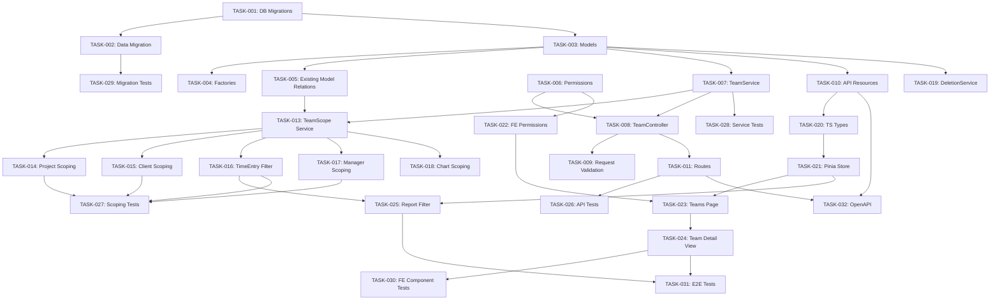

# PRD: Teams & Groups Feature for Solidtime

Generated: 2026-02-06
Version: 1.0

---

## Table of Contents

1. [Source & Context](#1-source--context)
2. [Technical Interpretation](#2-technical-interpretation)
3. [Functional Specifications](#3-functional-specifications)
4. [Technical Requirements & Constraints](#4-technical-requirements--constraints)
5. [User Stories with Acceptance Criteria](#5-user-stories-with-acceptance-criteria)
6. [Task Breakdown Structure](#6-task-breakdown-structure)
7. [Dependencies & Integration Points](#7-dependencies--integration-points)
8. [Risk Assessment & Mitigation](#8-risk-assessment--mitigation)
9. [Testing & Validation Requirements](#9-testing--validation-requirements)
10. [Monitoring & Observability](#10-monitoring--observability)
11. [Success Metrics & Definition of Done](#11-success-metrics--definition-of-done)
12. [Technical Debt & Future Considerations](#12-technical-debt--future-considerations)
13. [Appendices](#13-appendices)

---

## Amendments (2026-02-06 Review)

> These amendments supersede conflicting content in the original PRD sections below.
> Reference: `.features/SHARED-FOUNDATIONS.md` and `.features/PRD-REVIEW-REPORT.md`

### AMD-01: Task ID Prefix
All task IDs in this PRD are now prefixed with `TEAM-`. E.g., TASK-001 becomes TEAM-001.

### AMD-02: Permission Naming (SF-02)
Permissions updated to match shared convention:
- `teams:update-members` → `teams:update:members`
- `teams:update-projects` → `teams:update:projects`
- `teams:update-clients` → `teams:update:clients`

### AMD-03: Migration Timestamps (SF-03)
All migrations use date prefix `2026_03_10_`.

### AMD-04: Modular Permissions (SF-08)
Permissions are registered via `App\Permissions\TeamPermissions::register()` instead of directly modifying `JetstreamServiceProvider`.

### AMD-05: Feature Flag (SF-07) — CRITICAL
Team scoping is controlled by `organizations.enable_team_scoping` boolean (default `false`). See SF-07 in SHARED-FOUNDATIONS.md.

When `enable_team_scoping = false`:
- Teams can be created and members/projects/clients assigned (setup mode)
- Query scoping is NOT applied — all data visible as today
- This allows gradual configuration before enforcement

When `enable_team_scoping = true`:
- `TeamScopeService` applies WHERE clauses to project, client, and time entry queries
- Members only see data for their assigned teams
- Admin/Owner roles see all data regardless

A toggle is added to Organization Settings to enable/disable team scoping.

### AMD-06: New Member Auto-Assignment — CRITICAL
Resolves the conflict between "new members are NOT auto-assigned" and "must belong to at least one team":

**Resolution**: When a new member is invited to an organization:
- If `enable_team_scoping = false`: member is not assigned to any team (no constraint enforced)
- If `enable_team_scoping = true`: member is **automatically assigned to the organization's "Default" team**
- The Default team is created during the data migration (one per organization) and cannot be deleted
- Admins can reassign members to other teams after onboarding

The constraint "must belong to at least one team" is only enforced when `enable_team_scoping = true`.

### AMD-07: Task Scoping Through Projects
Tasks inherit team scoping through their parent Project. When a project is assigned to teams, all tasks within that project are visible to those teams. No separate `team_tasks` pivot table is needed.

This should be explicitly stated in the Visibility Matrix section: "Tasks are team-scoped implicitly via their parent project's team assignments."

### AMD-08: Manager Visibility Design Note
Managers only receive `teams:view` (not `teams:view:all`) by design. This is intentional to maintain information boundaries between teams. A manager who needs cross-team visibility should be promoted to Admin or assigned to multiple teams. This prevents "manager creep" where managers gradually gain org-wide visibility.

### AMD-09: Query Performance Strategy
Every team-scoped query adds a JOIN through `team_members` + `team_projects`/`team_clients`. Performance mitigation:
- Composite indexes on all pivot tables: `(team_id, member_id)`, `(team_id, project_id)`, `(team_id, client_id)`
- The `TeamScopeService` caches the current user's team IDs for the duration of the request (per-request cache, not persistent cache)
- For the `<10% additional latency` target, the Architecture phase must benchmark queries with 100+ teams, 1000+ projects

### AMD-10: TimeEntryFilter Modification Detail
TEAM-016 adds `team_ids` to `TimeEntryFilter`. The existing `TimeEntryFilter` class at `app/Service/TimeEntryFilter.php` uses a builder pattern. The modification:
```php
// Add to TimeEntryFilter
protected ?array $teamIds = null;

public function setTeamIds(?array $teamIds): self
{
    $this->teamIds = $teamIds;
    return $this;
}
```

The filter applies a subquery: entries where the entry's `project_id` is in a project assigned to any of the specified teams.

### AMD-11: TEAM-013 Effort Reassessment
TEAM-013 (TeamScopeService, 5 SP / 8h) modifies query behavior across `ProjectController`, `ClientController`, `TimeEntryController`, and chart endpoints. Given the cross-cutting nature, this should be re-estimated during Architecture phase. Likely 10-12h is more realistic.

### AMD-12: Cross-Feature Integration Notes
**Integration with Feature 07 (PTO)**:
- When team scoping is enabled, managers should only see time-off requests from their team members
- PTO list endpoints should accept `team_ids` filter

**Integration with Feature 08 (Scheduling)**:
- Scheduling views should support team-based filtering
- Assignment lists should be filterable by team

**Integration with Feature 09 (Reporting)**:
- All report endpoints should accept `team_ids` filter
- Profitability and utilization reports should support team-level aggregation

### AMD-13: Jetstream Team Naming Note
The model is named `Team` despite the Jetstream collision (where Jetstream's `Team` maps to `Organization`). This is acceptable because:
- Jetstream's Team model is imported via `Laravel\Jetstream\Jetstream::teamModel()`, not directly
- The application's `Team` model lives in `App\Models\Team` and is clearly distinct
- The Architecture phase should add an alias or use full namespace references to prevent IDE confusion
- Consider a migration note in the code: `// Note: This is solidtime's Team (sub-org group), not Jetstream's Team (which maps to Organization)`

---

## 1. Source & Context

- **Feature ID**: 10-teams-groups
- **Title**: Teams & Groups -- Sub-organizational team scoping
- **Branch**: `feature/teams-groups` (to be created from `main`)
- **Status**: PRD Development
- **Priority**: P1

### Original Feature Request

Solidtime currently has Organizations (which extend Jetstream's `Team` model), Members with roles (`Owner`, `Admin`, `Manager`, `Employee`, `Placeholder`), a `ProjectMember` pivot, and a role-based `PermissionStore`. There is **no** concept of sub-teams, departments, or team-level scoping. All members within an organization see the same data (filtered only by role-level permissions).

The "Teams & Groups" feature adds a department/team layer **within** an organization, enabling:
1. Team creation and management by admins
2. Member assignment to one or more teams
3. Client and project scoping to specific teams
4. Visibility boundaries so members see only their team's data
5. Manager scoping so managers approve/report on their team only
6. Team-based filtering in reports and dashboards

---

## 2. Technical Interpretation

### Business to Technical Translation

| Business Requirement | Technical Implementation |
|---|---|
| "Create teams within an organization" | New `Team` model with `organization_id` FK, CRUD API under `/organizations/{organization}/teams` |
| "Assign members to teams" | New `TeamMember` pivot model (team_id, member_id), API endpoints for assignment |
| "Scope clients to teams" | New `TeamClient` pivot model (team_id, client_id), modify `Client` queries |
| "Scope projects to teams" | New `TeamProject` pivot model (team_id, project_id), modify `Project.visibleByEmployee` scope |
| "Members see only their team's data" | Modify `TimeEntryFilter`, project/client list queries to apply team-scope when user role is `Employee` or `Manager` |
| "Managers approve/report on their team" | Modify `PermissionStore` to add team-scoped permission checks; filter time entries by team in manager views |
| "Filter reports by team" | Add `team_ids` filter to `TimeEntryFilter`, `TimeEntryAggregationService`, and report/chart endpoints |
| "Existing orgs get default 'All' team" | Data migration that creates a default team per organization and assigns all existing members, projects, clients |

### Key Naming Decision: "Team" vs Jetstream's "Team"

Solidtime already uses Jetstream's `Team` concept renamed to `Organization`. The new "Team" feature is an **intra-organizational** grouping concept. To avoid namespace collisions:

- **Database table**: `teams` (Jetstream uses `organizations` table already)
- **Model class**: `App\Models\Team` (no collision; Jetstream's team model is `Organization`)
- **Route prefix**: `/organizations/{organization}/teams`
- **Permission prefix**: `teams:`

This is safe because Jetstream's `Team` model is aliased to `Organization` throughout the codebase via `Jetstream::useTeamModel(Organization::class)`.

---

## 3. Functional Specifications

### 3.1 Core Requirements

#### REQ-001: Team CRUD (P0)
- **Description**: Admins and Owners can create, read, update, and delete teams within an organization.
- **Rules**:
  - Team names must be unique within an organization.
  - Teams have a name and optional color (for UI badging).
  - The "Default" team created during migration cannot be deleted if it has assigned members/projects/clients. It can be renamed.
  - Deleting a team requires first unassigning all members, projects, and clients (or reassigning them).
- **Edge Cases**:
  - Attempting to create a team with a duplicate name returns 422.
  - Deleting the last team in an organization is blocked (minimum 1 team).
  - Organization deletion cascades to delete all teams.
- **Error Scenarios**:
  - 403 if non-admin attempts CRUD.
  - 422 for validation failures (missing name, duplicate name).
  - 409 if team still has assignments when deleting.

#### REQ-002: Team Member Assignment (P0)
- **Description**: Admins assign members to teams. Members can belong to multiple teams.
- **Rules**:
  - A member must belong to at least one team (enforced at team removal time, not creation).
  - The same member cannot be added to the same team twice (unique constraint).
  - When a new member is invited to the org, they are NOT auto-assigned to any team; admin must assign explicitly.
  - When the migration runs for existing orgs, ALL existing members are assigned to the "Default" team.
- **Edge Cases**:
  - Removing a member from their last team is blocked with a 422 error.
  - Placeholder members can be assigned to teams.
  - Deleting a member cascades to remove their team assignments.

#### REQ-003: Team Client Assignment (P0)
- **Description**: Admins assign clients to teams. Clients can belong to multiple teams.
- **Rules**:
  - A client assigned to a team is visible only to members of that team (unless user has `clients:view:all` permission).
  - Clients not assigned to any team are visible to all members (backward-compatible default).
  - When migration runs, all existing clients are assigned to the "Default" team.
- **Edge Cases**:
  - Archiving a client does not affect team assignments.
  - Deleting a client cascades to remove team assignments.

#### REQ-004: Team Project Assignment (P0)
- **Description**: Admins assign projects to teams. Projects can belong to multiple teams.
- **Rules**:
  - Project visibility for employees is the intersection of: (a) `is_public` or `ProjectMember` assignment AND (b) project is assigned to one of the employee's teams.
  - Projects not assigned to any team are visible to all members (backward-compatible default).
  - When migration runs, all existing projects are assigned to the "Default" team.
- **Edge Cases**:
  - A project can be assigned to multiple teams (shared projects).
  - Changing a project's team assignment does not affect existing time entries on that project.

#### REQ-005: Team-Scoped Visibility (P1)
- **Description**: Employees and Managers see only data belonging to their teams.
- **Rules**:
  - **Employees**: See projects, clients, tasks, tags from their team(s) only. See only their own time entries (no change from current behavior).
  - **Managers**: See all time entries, projects, clients for their team(s). Can view/edit time entries of team members.
  - **Admins and Owners**: See everything (no team scoping applied). This is the current behavior.
  - Team scoping is applied as a query-level filter, not a permission check.
- **Edge Cases**:
  - A member in multiple teams sees the union of all their teams' data.
  - If team scoping is disabled for the org (feature flag), behavior reverts to current (no filtering).

#### REQ-006: Team-Based Report Filtering (P1)
- **Description**: Reports and charts can be filtered by team.
- **Rules**:
  - Add `team_ids` filter parameter to time entry index, aggregate, and chart endpoints.
  - When `team_ids` is provided, only time entries from members of those teams are included.
  - Managers can only filter by their own teams. Admins/Owners can filter by any team.
  - Report export includes team information.

### 3.2 User Workflows

```
Admin creates team
        |
        v
Admin assigns members -----> Admin assigns projects -----> Admin assigns clients
        |                           |                              |
        v                           v                              v
Members see scoped data      Projects visible to team       Clients visible to team
        |
        v
Manager sees team reports
        |
        v
Reports filterable by team
```

### 3.3 Business Rules

#### Visibility Matrix

| Entity | Owner/Admin | Manager | Employee |
|--------|------------|---------|----------|
| Teams list | All teams in org | Own teams only | Own teams only |
| Projects | All projects | Team-scoped projects | Team-scoped + (is_public OR ProjectMember) |
| Clients | All clients | Team-scoped clients | Team-scoped + via visible projects |
| Time Entries | All | Team members' entries | Own only (unchanged) |
| Members | All | Team members | N/A (unchanged) |
| Reports | All teams filter | Own teams filter | Own data only (unchanged) |

#### State Transitions for Team

```
Created --> Active --> Archived (future) --> Deleted
```

For v1, teams are either active or deleted. Archival is a future consideration.

---

## 4. Technical Requirements & Constraints

### 4.1 System Architecture

The feature adds a new domain layer (Teams) that cross-cuts the existing Organization domain. The architecture inserts team-scoping into the query pipeline:

```
Request
  |
  v
Controller (permission check via PermissionStore)
  |
  v
Team Scope Resolution (determine user's teams)
  |
  v
Query Builder (apply team-based WHERE clauses)
  |
  v
Service Layer (business logic)
  |
  v
Response (API Resource serialization)
```

### 4.2 Data Models

#### New Models

```php
/**
 * @property string $id
 * @property string $name
 * @property string $color
 * @property string $organization_id
 * @property Carbon|null $created_at
 * @property Carbon|null $updated_at
 * @property-read Organization $organization
 * @property-read Collection<int, TeamMember> $teamMembers
 * @property-read Collection<int, TeamProject> $teamProjects
 * @property-read Collection<int, TeamClient> $teamClients
 */
class Team extends Model implements AuditableContract
{
    // UUID primary key via HasUuids trait
    // Belongs to Organization
    // Has many TeamMember, TeamProject, TeamClient
}

/**
 * Pivot: teams <-> members
 * @property string $id
 * @property string $team_id
 * @property string $member_id
 * @property Carbon|null $created_at
 * @property Carbon|null $updated_at
 */
class TeamMember extends Model implements AuditableContract
{
    // UUID primary key
    // Unique constraint on [team_id, member_id]
}

/**
 * Pivot: teams <-> projects
 * @property string $id
 * @property string $team_id
 * @property string $project_id
 * @property Carbon|null $created_at
 * @property Carbon|null $updated_at
 */
class TeamProject extends Model implements AuditableContract
{
    // UUID primary key
    // Unique constraint on [team_id, project_id]
}

/**
 * Pivot: teams <-> clients
 * @property string $id
 * @property string $team_id
 * @property string $client_id
 * @property Carbon|null $created_at
 * @property Carbon|null $updated_at
 */
class TeamClient extends Model implements AuditableContract
{
    // UUID primary key
    // Unique constraint on [team_id, client_id]
}
```

#### Relationship Additions to Existing Models

```php
// Organization model additions:
public function teams(): HasMany { ... }

// Member model additions:
public function teamMembers(): HasMany { ... }
public function teams(): BelongsToMany { ... }  // via team_members pivot

// Project model additions:
public function teamProjects(): HasMany { ... }
public function teams(): BelongsToMany { ... }  // via team_projects pivot

// Client model additions:
public function teamClients(): HasMany { ... }
public function teams(): BelongsToMany { ... }  // via team_clients pivot
```

### 4.3 Database Schema

```sql
-- Teams table
CREATE TABLE teams (
    id UUID PRIMARY KEY DEFAULT gen_random_uuid(),
    name VARCHAR(255) NOT NULL,
    color VARCHAR(16) NOT NULL DEFAULT '#3B82F6',
    organization_id UUID NOT NULL REFERENCES organizations(id)
        ON UPDATE CASCADE ON DELETE CASCADE,
    created_at TIMESTAMP DEFAULT CURRENT_TIMESTAMP,
    updated_at TIMESTAMP DEFAULT CURRENT_TIMESTAMP,
    UNIQUE (organization_id, name)
);
CREATE INDEX idx_teams_organization_id ON teams(organization_id);

-- Team Members pivot
CREATE TABLE team_members (
    id UUID PRIMARY KEY DEFAULT gen_random_uuid(),
    team_id UUID NOT NULL REFERENCES teams(id)
        ON UPDATE CASCADE ON DELETE CASCADE,
    member_id UUID NOT NULL REFERENCES members(id)
        ON UPDATE CASCADE ON DELETE CASCADE,
    created_at TIMESTAMP DEFAULT CURRENT_TIMESTAMP,
    updated_at TIMESTAMP DEFAULT CURRENT_TIMESTAMP,
    UNIQUE (team_id, member_id)
);
CREATE INDEX idx_team_members_team_id ON team_members(team_id);
CREATE INDEX idx_team_members_member_id ON team_members(member_id);

-- Team Projects pivot
CREATE TABLE team_projects (
    id UUID PRIMARY KEY DEFAULT gen_random_uuid(),
    team_id UUID NOT NULL REFERENCES teams(id)
        ON UPDATE CASCADE ON DELETE CASCADE,
    project_id UUID NOT NULL REFERENCES projects(id)
        ON UPDATE CASCADE ON DELETE CASCADE,
    created_at TIMESTAMP DEFAULT CURRENT_TIMESTAMP,
    updated_at TIMESTAMP DEFAULT CURRENT_TIMESTAMP,
    UNIQUE (team_id, project_id)
);
CREATE INDEX idx_team_projects_team_id ON team_projects(team_id);
CREATE INDEX idx_team_projects_project_id ON team_projects(project_id);

-- Team Clients pivot
CREATE TABLE team_clients (
    id UUID PRIMARY KEY DEFAULT gen_random_uuid(),
    team_id UUID NOT NULL REFERENCES teams(id)
        ON UPDATE CASCADE ON DELETE CASCADE,
    client_id UUID NOT NULL REFERENCES clients(id)
        ON UPDATE CASCADE ON DELETE CASCADE,
    created_at TIMESTAMP DEFAULT CURRENT_TIMESTAMP,
    updated_at TIMESTAMP DEFAULT CURRENT_TIMESTAMP,
    UNIQUE (team_id, client_id)
);
CREATE INDEX idx_team_clients_team_id ON team_clients(team_id);
CREATE INDEX idx_team_clients_client_id ON team_clients(client_id);
```

### 4.4 API Contracts

#### Team CRUD

```yaml
GET /api/v1/organizations/{organization}/teams
  Description: List teams in organization
  Permission: teams:view
  Response 200:
    data:
      - id: string (UUID)
        name: string
        color: string
        members_count: integer
        projects_count: integer
        clients_count: integer
    links: PaginationLinks
    meta: PaginationMeta

POST /api/v1/organizations/{organization}/teams
  Description: Create a team
  Permission: teams:create
  Middleware: check-organization-blocked
  Request:
    name: string (required, max:255, unique per org)
    color: string (optional, max:16, default:#3B82F6)
  Response 201:
    data: TeamResource

GET /api/v1/organizations/{organization}/teams/{team}
  Description: Get a single team with details
  Permission: teams:view
  Response 200:
    data: TeamResource (with members, projects, clients)

PUT /api/v1/organizations/{organization}/teams/{team}
  Description: Update a team
  Permission: teams:update
  Middleware: check-organization-blocked
  Request:
    name: string (required, max:255, unique per org)
    color: string (optional, max:16)
  Response 200:
    data: TeamResource

DELETE /api/v1/organizations/{organization}/teams/{team}
  Description: Delete a team
  Permission: teams:delete
  Response 204: (empty)
  Response 409:
    error: EntityStillInUseApiException (if team has assignments)
```

#### Team Member Assignment

```yaml
GET /api/v1/organizations/{organization}/teams/{team}/members
  Description: List members of a team
  Permission: teams:view
  Response 200:
    data: MemberResource[]

POST /api/v1/organizations/{organization}/teams/{team}/members
  Description: Add member(s) to a team
  Permission: teams:update-members
  Middleware: check-organization-blocked
  Request:
    member_ids: string[] (required, array of member UUIDs)
  Response 204: (empty)

DELETE /api/v1/organizations/{organization}/teams/{team}/members/{member}
  Description: Remove a member from a team
  Permission: teams:update-members
  Response 204: (empty)
  Response 422: (if member would have zero teams)
```

#### Team Project Assignment

```yaml
POST /api/v1/organizations/{organization}/teams/{team}/projects
  Description: Add project(s) to a team
  Permission: teams:update-projects
  Middleware: check-organization-blocked
  Request:
    project_ids: string[] (required, array of project UUIDs)
  Response 204: (empty)

DELETE /api/v1/organizations/{organization}/teams/{team}/projects/{project}
  Description: Remove a project from a team
  Permission: teams:update-projects
  Response 204: (empty)
```

#### Team Client Assignment

```yaml
POST /api/v1/organizations/{organization}/teams/{team}/clients
  Description: Add client(s) to a team
  Permission: teams:update-clients
  Middleware: check-organization-blocked
  Request:
    client_ids: string[] (required, array of client UUIDs)
  Response 204: (empty)

DELETE /api/v1/organizations/{organization}/teams/{team}/clients/{client}
  Description: Remove a client from a team
  Permission: teams:update-clients
  Response 204: (empty)
```

#### Modified Existing Endpoints

```yaml
# Add team_ids filter to time entry endpoints
GET /api/v1/organizations/{organization}/time-entries
  Added Query Parameters:
    team_ids: string[] (optional, filter by team)

GET /api/v1/organizations/{organization}/time-entries/aggregate
  Added Query Parameters:
    team_ids: string[] (optional, filter by team)

# Add team_ids filter to chart endpoints
GET /api/v1/organizations/{organization}/charts/*
  Added Query Parameters:
    team_ids: string[] (optional, filter by team)
```

### 4.5 Performance Requirements

- **Team list endpoint**: < 50ms for organizations with up to 100 teams
- **Team-scoped queries**: < 10% additional latency compared to current non-scoped queries
- **Data migration**: Must complete within 5 minutes for organizations with 10,000+ members
- **Pivot table indexes**: Must support O(1) lookups for team membership checks

### 4.6 Security Requirements

- Team CRUD requires `teams:create`, `teams:update`, `teams:delete` permissions (Owner, Admin roles).
- Team member/project/client assignment requires `teams:update-members`, `teams:update-projects`, `teams:update-clients` permissions.
- `teams:view` is required to list teams; Employees can view their own teams.
- Managers cannot escalate visibility beyond their assigned teams.
- All team operations are auditable via the existing `CustomAuditable` trait.
- Team IDs in API filters are validated against organization ownership (no cross-org leakage).

---

## 5. User Stories with Acceptance Criteria

### USR-001: Admin Creates a Team

**As an** organization admin
**I want to** create teams within my organization
**So that** I can organize members into departments or working groups

**Priority**: P0
**Effort**: 3 story points
**Sprint**: 1

**Acceptance Criteria**:
- [ ] Admin can create a team with a unique name and optional color
- [ ] Duplicate team names within the same org return 422
- [ ] Team appears in the teams list immediately after creation
- [ ] Non-admin roles (Employee, Manager) receive 403 when attempting to create
- [ ] Audit log records team creation

### USR-002: Admin Assigns Members to a Team

**As an** organization admin
**I want to** assign members to teams
**So that** they can access team-scoped data

**Priority**: P0
**Effort**: 3 story points
**Sprint**: 1

**Acceptance Criteria**:
- [ ] Admin can add one or more members to a team in a single request
- [ ] Duplicate member assignment is idempotent (no error, no duplicate)
- [ ] Admin can remove a member from a team
- [ ] Removing a member from their last team returns 422 with clear message
- [ ] Member's team assignments are visible on the member detail view
- [ ] Placeholder members can be assigned to teams

### USR-003: Admin Assigns Projects to a Team

**As an** organization admin
**I want to** assign projects to teams
**So that** only team members can see and track time on those projects

**Priority**: P0
**Effort**: 2 story points
**Sprint**: 1

**Acceptance Criteria**:
- [ ] Admin can add one or more projects to a team
- [ ] Projects can be assigned to multiple teams (shared projects)
- [ ] Removing a project from a team does not affect existing time entries
- [ ] Employee can see project only if it is in their team AND (is_public OR they are a ProjectMember)

### USR-004: Admin Assigns Clients to a Team

**As an** organization admin
**I want to** assign clients to teams
**So that** client visibility is scoped to relevant teams

**Priority**: P0
**Effort**: 2 story points
**Sprint**: 1

**Acceptance Criteria**:
- [ ] Admin can add one or more clients to a team
- [ ] Clients can be assigned to multiple teams
- [ ] Employee sees clients only from their team (+ via visible projects, unchanged)
- [ ] Client archival does not affect team assignment

### USR-005: Employee Sees Team-Scoped Data

**As an** employee
**I want to** see only the projects, clients, and tasks relevant to my team
**So that** I am not overwhelmed by irrelevant data

**Priority**: P1
**Effort**: 5 story points
**Sprint**: 2

**Acceptance Criteria**:
- [ ] Employee sees only projects assigned to their team(s)
- [ ] Employee in multiple teams sees the union of all teams' projects
- [ ] Employee sees clients only from their team(s)
- [ ] Employee's time entry creation is limited to team-scoped projects
- [ ] Tags remain org-wide (not team-scoped)
- [ ] Admins and Owners see all data regardless of team assignment

### USR-006: Manager Sees Team Reports

**As a** manager
**I want to** view reports filtered to my team
**So that** I can monitor my team's time tracking and productivity

**Priority**: P1
**Effort**: 5 story points
**Sprint**: 2

**Acceptance Criteria**:
- [ ] Manager can see time entries of all members in their team(s)
- [ ] Manager can filter reports by team
- [ ] Manager cannot see time entries of members outside their team(s)
- [ ] Dashboard charts reflect team-scoped data for managers
- [ ] Export includes team filter capabilities

### USR-007: Admin Manages Teams via Web UI

**As an** admin
**I want to** manage teams through a dedicated Teams page in the app
**So that** I can easily create, edit, and manage team assignments

**Priority**: P1
**Effort**: 8 story points
**Sprint**: 3

**Acceptance Criteria**:
- [ ] "Teams" appears in the sidebar navigation under "Manage" section
- [ ] Teams page shows a list of all teams with member/project/client counts
- [ ] Clicking a team shows team detail with member, project, and client tabs
- [ ] Admin can create/edit/delete teams from the UI
- [ ] Admin can add/remove members, projects, clients from the team detail view
- [ ] Appropriate loading states, empty states, and error messages

### USR-008: Report Filtering by Team

**As an** admin or manager
**I want to** filter time entry reports by team
**So that** I can analyze time usage per department

**Priority**: P1
**Effort**: 3 story points
**Sprint**: 3

**Acceptance Criteria**:
- [ ] Time entry list endpoint accepts `team_ids` filter parameter
- [ ] Time entry aggregate endpoint accepts `team_ids` filter parameter
- [ ] Chart endpoints accept `team_ids` filter parameter
- [ ] Manager's `team_ids` filter is restricted to their own teams
- [ ] Admin can filter by any team
- [ ] Report export respects team filter

### USR-009: Data Migration for Existing Organizations

**As the** system
**I need to** create a default "Default" team for all existing organizations
**So that** the feature is backward-compatible and existing data is accessible

**Priority**: P0
**Effort**: 3 story points
**Sprint**: 1

**Acceptance Criteria**:
- [ ] Migration creates one "Default" team per existing organization
- [ ] All existing members are assigned to the "Default" team
- [ ] All existing projects are assigned to the "Default" team
- [ ] All existing clients are assigned to the "Default" team
- [ ] Migration is idempotent (safe to re-run)
- [ ] Migration completes within 5 minutes for large datasets

---

## 6. Task Breakdown Structure

### Phase 1: Foundation -- Database & Models (Sprint 1, Week 1-2)

---

#### TASK-001: Database Migrations -- Create Team Tables
**Type**: Backend / Database
**Effort**: 5h (2 SP)
**Dependencies**: None

**Description**: Create the four new database tables (`teams`, `team_members`, `team_projects`, `team_clients`) with proper indexes, foreign keys, and constraints.

**Files to create**:
- `database/migrations/2026_02_07_000001_create_teams_table.php`
- `database/migrations/2026_02_07_000002_create_team_members_table.php`
- `database/migrations/2026_02_07_000003_create_team_projects_table.php`
- `database/migrations/2026_02_07_000004_create_team_clients_table.php`

**Implementation Details**:

```php
// 2026_02_07_000001_create_teams_table.php
Schema::create('teams', function (Blueprint $table): void {
    $table->uuid('id')->primary();
    $table->string('name', 255);
    $table->string('color', 16)->default('#3B82F6');
    $table->uuid('organization_id');
    $table->foreign('organization_id')
        ->references('id')
        ->on('organizations')
        ->cascadeOnUpdate()
        ->cascadeOnDelete();
    $table->timestamps();
    $table->unique(['organization_id', 'name']);
    $table->index('organization_id');
});
```

**Acceptance Criteria**:
- [ ] All four tables created with correct column types
- [ ] UUID primary keys on all tables
- [ ] Foreign keys with CASCADE on delete for team pivots, CASCADE on delete for teams -> organizations
- [ ] Unique constraints on (organization_id, name) for teams, (team_id, member_id), (team_id, project_id), (team_id, client_id) for pivots
- [ ] Indexes on all foreign key columns
- [ ] Migration rollback works cleanly
- [ ] `php artisan migrate` runs without errors on fresh database

---

#### TASK-002: Data Migration -- Default Team for Existing Organizations
**Type**: Backend / Database
**Effort**: 4h (2 SP)
**Dependencies**: [TASK-001]

**Description**: Create a data migration that provisions a "Default" team for every existing organization and assigns all current members, projects, and clients to it.

**Files to create**:
- `database/migrations/2026_02_07_100001_seed_default_teams_for_existing_organizations.php`

**Implementation Details**:

```php
// Use chunked queries for large datasets
Organization::query()->chunkById(100, function ($organizations) {
    foreach ($organizations as $organization) {
        $teamId = Str::uuid()->toString();
        DB::table('teams')->insert([
            'id' => $teamId,
            'name' => 'Default',
            'color' => '#3B82F6',
            'organization_id' => $organization->id,
            'created_at' => now(),
            'updated_at' => now(),
        ]);

        // Assign all members
        $members = DB::table('members')
            ->where('organization_id', $organization->id)
            ->pluck('id');
        $teamMembers = $members->map(fn ($memberId) => [
            'id' => Str::uuid()->toString(),
            'team_id' => $teamId,
            'member_id' => $memberId,
            'created_at' => now(),
            'updated_at' => now(),
        ])->toArray();
        DB::table('team_members')->insert($teamMembers);

        // Similar for projects and clients...
    }
});
```

**Acceptance Criteria**:
- [ ] Every existing organization gets exactly one "Default" team
- [ ] All existing members assigned to their org's Default team
- [ ] All existing projects assigned to their org's Default team
- [ ] All existing clients assigned to their org's Default team
- [ ] Migration is idempotent (skip orgs that already have a team named "Default")
- [ ] Handles organizations with 0 members/projects/clients gracefully
- [ ] Runs in under 5 minutes for 1000+ organizations

---

#### TASK-003: Eloquent Models -- Team, TeamMember, TeamProject, TeamClient
**Type**: Backend
**Effort**: 4h (2 SP)
**Dependencies**: [TASK-001]

**Description**: Create the four new Eloquent models following existing codebase conventions (HasUuids, CustomAuditable, PHPDoc annotations, proper relationships).

**Files to create**:
- `app/Models/Team.php`
- `app/Models/TeamMember.php`
- `app/Models/TeamProject.php`
- `app/Models/TeamClient.php`

**Implementation Details** (Team model example):

```php
<?php

declare(strict_types=1);

namespace App\Models;

use App\Models\Concerns\CustomAuditable;
use App\Models\Concerns\HasUuids;
use Database\Factories\TeamFactory;
use Illuminate\Database\Eloquent\Collection;
use Illuminate\Database\Eloquent\Factories\HasFactory;
use Illuminate\Database\Eloquent\Model;
use Illuminate\Database\Eloquent\Relations\BelongsTo;
use Illuminate\Database\Eloquent\Relations\BelongsToMany;
use Illuminate\Database\Eloquent\Relations\HasMany;
use Illuminate\Support\Carbon;
use OwenIt\Auditing\Contracts\Auditable as AuditableContract;

/**
 * @property string $id
 * @property string $name
 * @property string $color
 * @property string $organization_id
 * @property Carbon|null $created_at
 * @property Carbon|null $updated_at
 * @property-read Organization $organization
 * @property-read Collection<int, TeamMember> $teamMembers
 * @property-read Collection<int, Member> $members
 * @property-read Collection<int, TeamProject> $teamProjects
 * @property-read Collection<int, Project> $projects
 * @property-read Collection<int, TeamClient> $teamClients
 * @property-read Collection<int, Client> $clients
 *
 * @method static TeamFactory factory()
 */
class Team extends Model implements AuditableContract
{
    use CustomAuditable;
    /** @use HasFactory<TeamFactory> */
    use HasFactory;
    use HasUuids;

    protected $casts = [
        'name' => 'string',
        'color' => 'string',
    ];

    public function organization(): BelongsTo { ... }
    public function teamMembers(): HasMany { ... }
    public function members(): BelongsToMany { ... }
    public function teamProjects(): HasMany { ... }
    public function projects(): BelongsToMany { ... }
    public function teamClients(): HasMany { ... }
    public function clients(): BelongsToMany { ... }
}
```

**Acceptance Criteria**:
- [ ] All four models follow `declare(strict_types=1)` convention
- [ ] All models use `HasUuids` and `CustomAuditable` traits
- [ ] PHPDoc property annotations match database columns
- [ ] All relationships are properly defined with type hints
- [ ] `Team` has scopes: `scopeWhereBelongsToOrganization`

---

#### TASK-004: Model Factories for Testing
**Type**: Backend / Testing
**Effort**: 3h (1 SP)
**Dependencies**: [TASK-003]

**Description**: Create model factories for all four new models, following existing factory patterns.

**Files to create**:
- `database/factories/TeamFactory.php`
- `database/factories/TeamMemberFactory.php`
- `database/factories/TeamProjectFactory.php`
- `database/factories/TeamClientFactory.php`

**Implementation Details**:

```php
class TeamFactory extends Factory
{
    protected $model = Team::class;

    public function definition(): array
    {
        return [
            'name' => fake()->unique()->words(2, true),
            'color' => fake()->hexColor(),
            'organization_id' => Organization::factory(),
        ];
    }

    public function forOrganization(Organization $organization): self
    {
        return $this->state(['organization_id' => $organization->id]);
    }
}
```

**Acceptance Criteria**:
- [ ] All factories produce valid model instances
- [ ] `forOrganization`, `forTeam`, `forMember`, `forProject`, `forClient` state methods
- [ ] Factories work with `createMany` for bulk test data
- [ ] No unique constraint violations when using factories in tests

---

#### TASK-005: Add Relationships to Existing Models
**Type**: Backend
**Effort**: 3h (1 SP)
**Dependencies**: [TASK-003]

**Description**: Add `teams()` and related relationships to `Organization`, `Member`, `Project`, and `Client` models.

**Files to modify**:
- `app/Models/Organization.php` -- add `teams(): HasMany`
- `app/Models/Member.php` -- add `teamMembers(): HasMany`, `teams(): BelongsToMany`
- `app/Models/Project.php` -- add `teamProjects(): HasMany`, `teams(): BelongsToMany`
- `app/Models/Client.php` -- add `teamClients(): HasMany`, `teams(): BelongsToMany`

**Implementation Details**:

```php
// Member.php addition
/**
 * @return HasMany<TeamMember, $this>
 */
public function teamMembers(): HasMany
{
    return $this->hasMany(TeamMember::class, 'member_id');
}

/**
 * @return BelongsToMany<Team, $this>
 */
public function teams(): BelongsToMany
{
    return $this->belongsToMany(Team::class, 'team_members', 'member_id', 'team_id')
        ->withTimestamps();
}
```

**Acceptance Criteria**:
- [ ] All new relationships have proper PHPDoc type annotations
- [ ] PHPDoc `@property-read` annotations added to class headers
- [ ] Existing tests still pass after modification
- [ ] `phpstan analyse` passes

---

### Phase 2: API Layer (Sprint 1-2, Week 2-3)

---

#### TASK-006: Permissions -- Register Team Permissions in Jetstream Roles
**Type**: Backend
**Effort**: 3h (1 SP)
**Dependencies**: [TASK-003]

**Description**: Add new team-related permissions to the Jetstream role definitions in `JetstreamServiceProvider`.

**Files to modify**:
- `app/Providers/JetstreamServiceProvider.php`

**New Permissions**:
```
teams:view
teams:view:all    (see all teams in org, not just own)
teams:create
teams:update
teams:delete
teams:update-members
teams:update-projects
teams:update-clients
```

**Role Assignment**:

| Permission | Owner | Admin | Manager | Employee |
|---|---|---|---|---|
| `teams:view` | Y | Y | Y | Y |
| `teams:view:all` | Y | Y | N | N |
| `teams:create` | Y | Y | N | N |
| `teams:update` | Y | Y | N | N |
| `teams:delete` | Y | Y | N | N |
| `teams:update-members` | Y | Y | N | N |
| `teams:update-projects` | Y | Y | N | N |
| `teams:update-clients` | Y | Y | N | N |

**Acceptance Criteria**:
- [ ] All 8 new permissions registered
- [ ] Owner and Admin have all team permissions
- [ ] Manager has `teams:view` only
- [ ] Employee has `teams:view` only
- [ ] Existing permissions unchanged
- [ ] `phpstan analyse` passes

---

#### TASK-007: TeamService -- Business Logic
**Type**: Backend
**Effort**: 6h (3 SP)
**Dependencies**: [TASK-003, TASK-005]

**Description**: Create a stateless `TeamService` class encapsulating team business logic (creation, member/project/client assignment, validation, deletion).

**Files to create**:
- `app/Service/TeamService.php`

**Implementation Details**:

```php
<?php

declare(strict_types=1);

namespace App\Service;

use App\Exceptions\Api\EntityStillInUseApiException;
use App\Models\Client;
use App\Models\Member;
use App\Models\Organization;
use App\Models\Project;
use App\Models\Team;

class TeamService
{
    public function createTeam(Organization $organization, string $name, string $color): Team { ... }

    public function updateTeam(Team $team, string $name, string $color): Team { ... }

    public function deleteTeam(Team $team): void
    {
        if ($team->teamMembers()->exists() || $team->teamProjects()->exists() || $team->teamClients()->exists()) {
            throw new EntityStillInUseApiException('team', 'team_member/team_project/team_client');
        }
        $team->delete();
    }

    /**
     * @param array<string> $memberIds
     */
    public function addMembers(Team $team, array $memberIds): void { ... }

    public function removeMember(Team $team, Member $member): void
    {
        // Check: member must belong to at least one other team
        $otherTeamCount = $member->teamMembers()
            ->where('team_id', '!=', $team->id)
            ->count();
        if ($otherTeamCount === 0) {
            throw new MemberMustBelongToAtLeastOneTeamException();
        }
        $team->teamMembers()->where('member_id', $member->id)->delete();
    }

    /**
     * @param array<string> $projectIds
     */
    public function addProjects(Team $team, array $projectIds): void { ... }

    public function removeProject(Team $team, Project $project): void { ... }

    /**
     * @param array<string> $clientIds
     */
    public function addClients(Team $team, array $clientIds): void { ... }

    public function removeClient(Team $team, Client $client): void { ... }

    /**
     * Get team IDs for a given member (for query scoping).
     * @return array<string>
     */
    public function getTeamIdsForMember(Member $member): array { ... }
}
```

**Acceptance Criteria**:
- [ ] All CRUD methods implemented and throw appropriate exceptions
- [ ] `removeMember` validates minimum-one-team constraint
- [ ] `deleteTeam` validates no remaining assignments
- [ ] `addMembers`/`addProjects`/`addClients` are idempotent (duplicates ignored via `insertOrIgnore`)
- [ ] All methods validate that entities belong to the same organization as the team

---

#### TASK-008: TeamController -- API Endpoints
**Type**: Backend
**Effort**: 8h (3 SP)
**Dependencies**: [TASK-006, TASK-007]

**Description**: Create the `TeamController` with all CRUD and assignment endpoints, following existing controller patterns.

**Files to create**:
- `app/Http/Controllers/Api/V1/TeamController.php`

**Implementation Details**:

```php
class TeamController extends Controller
{
    protected function checkPermission(
        Organization $organization,
        string $permission,
        ?Team $team = null
    ): void {
        parent::checkPermission($organization, $permission);
        if ($team !== null && $team->organization_id !== $organization->id) {
            throw new AuthorizationException('Team does not belong to organization');
        }
    }

    // index, show, store, update, destroy
    // addMembers, removeMember
    // addProjects, removeProject
    // addClients, removeClient
}
```

**Acceptance Criteria**:
- [ ] All endpoints check permissions before processing
- [ ] Team CRUD follows existing controller patterns exactly
- [ ] Organization route model binding is validated
- [ ] Assignment endpoints handle bulk operations
- [ ] Proper HTTP status codes (201 create, 200 update, 204 delete, 422 validation, 409 in-use)
- [ ] All controller methods have `@operationId` PHPDoc for OpenAPI generation

---

#### TASK-009: Request Validation Classes
**Type**: Backend
**Effort**: 4h (2 SP)
**Dependencies**: [TASK-008]

**Description**: Create form request classes for all team endpoints, extending `BaseFormRequest`.

**Files to create**:
- `app/Http/Requests/V1/Team/TeamIndexRequest.php`
- `app/Http/Requests/V1/Team/TeamStoreRequest.php`
- `app/Http/Requests/V1/Team/TeamUpdateRequest.php`
- `app/Http/Requests/V1/Team/TeamAddMembersRequest.php`
- `app/Http/Requests/V1/Team/TeamAddProjectsRequest.php`
- `app/Http/Requests/V1/Team/TeamAddClientsRequest.php`

**Implementation Details**:

```php
class TeamStoreRequest extends BaseFormRequest
{
    public function rules(): array
    {
        return [
            'name' => [
                'required',
                'string',
                'max:255',
                Rule::unique('teams')
                    ->where('organization_id', $this->organization->id),
            ],
            'color' => ['sometimes', 'string', 'max:16'],
        ];
    }
}

class TeamAddMembersRequest extends BaseFormRequest
{
    public function rules(): array
    {
        return [
            'member_ids' => ['required', 'array', 'min:1'],
            'member_ids.*' => [
                'required',
                'uuid',
                new ExistsEloquent(Member::class, null, function ($builder) {
                    return $builder->where('organization_id', $this->organization->id);
                }),
            ],
        ];
    }
}
```

**Acceptance Criteria**:
- [ ] All request classes extend `BaseFormRequest`
- [ ] `ExistsEloquent` used for relationship validation (matching codebase pattern)
- [ ] Team name uniqueness scoped to organization
- [ ] Array validation for bulk assignment endpoints
- [ ] Proper error messages for all validation rules

---

#### TASK-010: API Resources -- TeamResource, TeamCollection
**Type**: Backend
**Effort**: 3h (1 SP)
**Dependencies**: [TASK-003]

**Description**: Create API resource classes for serializing team data.

**Files to create**:
- `app/Http/Resources/V1/Team/TeamResource.php`
- `app/Http/Resources/V1/Team/TeamCollection.php`

**Implementation Details**:

```php
class TeamResource extends BaseResource
{
    public function toArray(Request $request): array
    {
        return [
            /** @var string $id ID of team */
            'id' => $this->resource->id,
            /** @var string $name Name of team */
            'name' => $this->resource->name,
            /** @var string $color Color of team (hex) */
            'color' => $this->resource->color,
            /** @var int $members_count Number of members */
            'members_count' => $this->resource->teamMembers()->count(),
            /** @var int $projects_count Number of projects */
            'projects_count' => $this->resource->teamProjects()->count(),
            /** @var int $clients_count Number of clients */
            'clients_count' => $this->resource->teamClients()->count(),
        ];
    }
}
```

**Acceptance Criteria**:
- [ ] Resource extends `BaseResource` (existing pattern)
- [ ] All fields have PHPDoc type annotations for OpenAPI
- [ ] Counts are loaded efficiently (avoid N+1)
- [ ] Collection handles pagination

---

#### TASK-011: API Routes Registration
**Type**: Backend
**Effort**: 2h (1 SP)
**Dependencies**: [TASK-008]

**Description**: Register all team routes in `routes/api.php` following existing naming conventions.

**Files to modify**:
- `routes/api.php`

**Implementation Details**:

```php
// Team routes
Route::name('teams.')->prefix('/organizations/{organization}')->group(static function (): void {
    Route::get('/teams', [TeamController::class, 'index'])->name('index');
    Route::get('/teams/{team}', [TeamController::class, 'show'])->name('show');
    Route::post('/teams', [TeamController::class, 'store'])->name('store')
        ->middleware('check-organization-blocked');
    Route::put('/teams/{team}', [TeamController::class, 'update'])->name('update')
        ->middleware('check-organization-blocked');
    Route::delete('/teams/{team}', [TeamController::class, 'destroy'])->name('destroy');

    // Team member assignments
    Route::get('/teams/{team}/members', [TeamController::class, 'members'])->name('members');
    Route::post('/teams/{team}/members', [TeamController::class, 'addMembers'])->name('add-members')
        ->middleware('check-organization-blocked');
    Route::delete('/teams/{team}/members/{member}', [TeamController::class, 'removeMember'])
        ->name('remove-member');

    // Team project assignments
    Route::post('/teams/{team}/projects', [TeamController::class, 'addProjects'])->name('add-projects')
        ->middleware('check-organization-blocked');
    Route::delete('/teams/{team}/projects/{project}', [TeamController::class, 'removeProject'])
        ->name('remove-project');

    // Team client assignments
    Route::post('/teams/{team}/clients', [TeamController::class, 'addClients'])->name('add-clients')
        ->middleware('check-organization-blocked');
    Route::delete('/teams/{team}/clients/{client}', [TeamController::class, 'removeClient'])
        ->name('remove-client');
});
```

**Acceptance Criteria**:
- [ ] Route names follow `api.v1.teams.{action}` convention
- [ ] Write endpoints use `check-organization-blocked` middleware
- [ ] Routes are inside `auth:api` + `verified` middleware group
- [ ] All routes resolve correctly (no conflicts with existing routes)

---

#### TASK-012: Custom Exception Classes
**Type**: Backend
**Effort**: 1h (1 SP)
**Dependencies**: None

**Description**: Create exception classes specific to team operations.

**Files to create**:
- `app/Exceptions/Api/MemberMustBelongToAtLeastOneTeamException.php`
- `app/Exceptions/Api/OrganizationMustHaveAtLeastOneTeamException.php`

**Implementation Details**: Follow existing exception patterns in `app/Exceptions/Api/` (extend `ApiException` with proper HTTP status codes and messages).

**Acceptance Criteria**:
- [ ] Exceptions return appropriate HTTP status codes (422)
- [ ] Clear error messages for API consumers
- [ ] Follow existing exception class patterns

---

### Phase 3: Query Scoping & Visibility (Sprint 2, Week 3-4)

---

#### TASK-013: TeamScope Service -- Query-Level Team Filtering
**Type**: Backend
**Effort**: 8h (5 SP)
**Dependencies**: [TASK-005, TASK-007]

**Description**: Create a `TeamScope` service that can be applied to query builders to filter results by the current user's team memberships. This is the core cross-cutting concern.

**Files to create**:
- `app/Service/TeamScope.php`

**Implementation Details**:

```php
<?php

declare(strict_types=1);

namespace App\Service;

use App\Enums\Role;
use App\Models\Member;
use App\Models\Organization;
use App\Models\User;
use Illuminate\Database\Eloquent\Builder;

class TeamScope
{
    /**
     * Determine if team scoping should be applied for this user/org.
     * Admins and Owners are exempt.
     */
    public function shouldApplyTeamScope(Organization $organization, Member $member): bool
    {
        return in_array($member->role, [
            Role::Employee->value,
            Role::Manager->value,
        ], true);
    }

    /**
     * Get team IDs for a member.
     * @return array<string>
     */
    public function getTeamIds(Member $member): array
    {
        return $member->teamMembers()->pluck('team_id')->toArray();
    }

    /**
     * Apply team scope to a Project query.
     * @param Builder<\App\Models\Project> $query
     */
    public function scopeProjects(Builder $query, Member $member): void
    {
        $teamIds = $this->getTeamIds($member);
        $query->where(function (Builder $q) use ($teamIds) {
            $q->whereHas('teamProjects', function (Builder $subQ) use ($teamIds) {
                $subQ->whereIn('team_id', $teamIds);
            })
            // Also include projects with NO team assignment (backward compat)
            ->orWhereDoesntHave('teamProjects');
        });
    }

    /**
     * Apply team scope to a Client query.
     * @param Builder<\App\Models\Client> $query
     */
    public function scopeClients(Builder $query, Member $member): void
    {
        $teamIds = $this->getTeamIds($member);
        $query->where(function (Builder $q) use ($teamIds) {
            $q->whereHas('teamClients', function (Builder $subQ) use ($teamIds) {
                $subQ->whereIn('team_id', $teamIds);
            })
            ->orWhereDoesntHave('teamClients');
        });
    }

    /**
     * Apply team scope to a TimeEntry query (via member's team membership).
     * @param Builder<\App\Models\TimeEntry> $query
     */
    public function scopeTimeEntries(Builder $query, Member $member): void
    {
        $teamIds = $this->getTeamIds($member);
        $query->whereHas('member', function (Builder $memberQuery) use ($teamIds) {
            $memberQuery->whereHas('teamMembers', function (Builder $tmQuery) use ($teamIds) {
                $tmQuery->whereIn('team_id', $teamIds);
            });
        });
    }

    /**
     * Filter by explicit team_ids parameter (for report filtering).
     * @param Builder<\App\Models\TimeEntry> $query
     * @param array<string> $teamIds
     */
    public function filterTimeEntriesByTeamIds(Builder $query, array $teamIds): void
    {
        $query->whereHas('member', function (Builder $memberQuery) use ($teamIds) {
            $memberQuery->whereHas('teamMembers', function (Builder $tmQuery) use ($teamIds) {
                $tmQuery->whereIn('team_id', $teamIds);
            });
        });
    }
}
```

**Acceptance Criteria**:
- [ ] Admins/Owners bypass all team scoping
- [ ] Employees see only team-scoped projects/clients
- [ ] Managers see team-scoped time entries (all members in their teams)
- [ ] Projects/Clients with no team assignment remain visible (backward compatibility)
- [ ] Members in multiple teams see the union of all teams' data
- [ ] Query performance is acceptable (proper index usage verified)

---

#### TASK-014: Modify ProjectController for Team Scoping
**Type**: Backend
**Effort**: 4h (2 SP)
**Dependencies**: [TASK-013]

**Description**: Modify `ProjectController::index` to apply team-scoped filtering for employees and managers.

**Files to modify**:
- `app/Http/Controllers/Api/V1/ProjectController.php`

**Implementation Details**:

```php
// In ProjectController::index, after the existing visibleByEmployee check:
if (! $canViewAllProjects) {
    $projectsQuery->visibleByEmployee($user);
}

// Add team scoping
$teamScope = app(TeamScope::class);
$member = $this->member($organization);
if ($teamScope->shouldApplyTeamScope($organization, $member)) {
    $teamScope->scopeProjects($projectsQuery, $member);
}
```

**Acceptance Criteria**:
- [ ] Employee project list is filtered by team assignment
- [ ] Manager project list is filtered by team assignment
- [ ] Admin/Owner project list is unaffected
- [ ] Existing `visibleByEmployee` scope still applies (intersection of both)
- [ ] Projects with no team assignment remain visible
- [ ] Existing tests pass without modification

---

#### TASK-015: Modify ClientController for Team Scoping
**Type**: Backend
**Effort**: 3h (2 SP)
**Dependencies**: [TASK-013]

**Description**: Modify `ClientController::index` to apply team-scoped filtering.

**Files to modify**:
- `app/Http/Controllers/Api/V1/ClientController.php`

**Acceptance Criteria**:
- [ ] Employee client list is filtered by team assignment
- [ ] Manager client list is filtered by team assignment
- [ ] Admin/Owner client list is unaffected
- [ ] Existing `visibleByEmployee` scope still applies
- [ ] Existing tests pass

---

#### TASK-016: Add team_ids Filter to TimeEntryFilter
**Type**: Backend
**Effort**: 4h (2 SP)
**Dependencies**: [TASK-013]

**Description**: Add `addTeamIdsFilter` method to `TimeEntryFilter` and wire it into `TimeEntryController`.

**Files to modify**:
- `app/Service/TimeEntryFilter.php`
- `app/Http/Controllers/Api/V1/TimeEntryController.php`
- `app/Http/Requests/V1/TimeEntry/TimeEntryIndexRequest.php`
- `app/Http/Requests/V1/TimeEntry/TimeEntryAggregateRequest.php`

**Implementation Details**:

```php
// TimeEntryFilter.php addition:
/**
 * @param array<string>|null $teamIds
 */
public function addTeamIdsFilter(?array $teamIds): self
{
    if ($teamIds === null) {
        return $this;
    }
    $this->builder->whereHas('member', function (Builder $memberQuery) use ($teamIds) {
        $memberQuery->whereHas('teamMembers', function (Builder $tmQuery) use ($teamIds) {
            $tmQuery->whereIn('team_id', $teamIds);
        });
    });
    return $this;
}
```

```php
// TimeEntryController, in getTimeEntriesQuery and getTimeEntriesAggregateQuery:
$filter->addTeamIdsFilter($request->input('team_ids'));
```

**Acceptance Criteria**:
- [ ] `team_ids` query parameter accepted on time entry index, aggregate, and export endpoints
- [ ] Filter correctly restricts time entries to those from members in specified teams
- [ ] Manager's team_ids filter is validated to only include their own teams
- [ ] Admin can filter by any team
- [ ] Null/missing `team_ids` parameter has no effect (backward compatible)

---

#### TASK-017: Apply Team Scoping to Manager Time Entry Views
**Type**: Backend
**Effort**: 4h (2 SP)
**Dependencies**: [TASK-013, TASK-016]

**Description**: When a Manager queries time entries with `time-entries:view:all`, automatically scope to their team members.

**Files to modify**:
- `app/Http/Controllers/Api/V1/TimeEntryController.php`

**Implementation Details**:

In the `index` method, after permission checking for `time-entries:view:all`, determine if the user is a Manager. If so, automatically apply team scoping unless explicit `team_ids` filter overrides.

```php
$member = $this->member($organization);
$teamScope = app(TeamScope::class);
if ($teamScope->shouldApplyTeamScope($organization, $member)
    && $member->role === Role::Manager->value) {
    // Manager: auto-scope to their teams
    $teamScope->scopeTimeEntries($timeEntriesQuery, $member);
}
```

**Acceptance Criteria**:
- [ ] Manager sees time entries only from their team members
- [ ] Manager with explicit `team_ids` filter is restricted to their own teams
- [ ] Admin/Owner time entry queries are unaffected
- [ ] Employee time entry queries are unaffected (they only see own)

---

#### TASK-018: Apply Team Scoping to Chart Endpoints
**Type**: Backend
**Effort**: 3h (2 SP)
**Dependencies**: [TASK-013]

**Description**: Add team_ids filter and auto-scoping to chart/dashboard endpoints.

**Files to modify**:
- `app/Http/Controllers/Api/V1/ChartController.php`

**Acceptance Criteria**:
- [ ] Chart endpoints accept `team_ids` filter
- [ ] Manager dashboard shows team-scoped data
- [ ] Admin/Owner dashboard is unaffected

---

#### TASK-019: Modify DeletionService for Teams
**Type**: Backend
**Effort**: 2h (1 SP)
**Dependencies**: [TASK-003]

**Description**: Update `DeletionService::deleteOrganization` to delete teams and their pivot records during org deletion.

**Files to modify**:
- `app/Service/DeletionService.php`

**Implementation Details**:

Add team cleanup before member deletion:

```php
// Delete all team assignments
TeamClient::query()->whereHas('team', function (Builder $q) use ($organization) {
    $q->where('organization_id', $organization->getKey());
})->delete();
TeamProject::query()->whereHas('team', function (Builder $q) use ($organization) {
    $q->where('organization_id', $organization->getKey());
})->delete();
TeamMember::query()->whereHas('team', function (Builder $q) use ($organization) {
    $q->where('organization_id', $organization->getKey());
})->delete();
// Delete all teams
Team::query()->where('organization_id', $organization->getKey())->delete();
```

**Acceptance Criteria**:
- [ ] Organization deletion cleans up all team data
- [ ] No orphan team records after org deletion
- [ ] No FK constraint violations during deletion
- [ ] Existing deletion tests still pass

---

### Phase 4: Frontend (Sprint 2-3, Week 3-5)

---

#### TASK-020: TypeScript Types for Team Models
**Type**: Frontend
**Effort**: 2h (1 SP)
**Dependencies**: [TASK-010]

**Description**: Add TypeScript type definitions for Team, TeamMember, TeamProject, TeamClient, and API responses.

**Files to modify/create**:
- `resources/js/types/models.ts` (or equivalent)
- Regenerate OpenAPI client types if using code generation

**Implementation Details**:

```typescript
export interface Team {
    id: string;
    name: string;
    color: string;
    members_count: number;
    projects_count: number;
    clients_count: number;
}

export interface TeamIndexResponse {
    data: Team[];
    links: PaginationLinks;
    meta: PaginationMeta;
}

export interface TeamStoreBody {
    name: string;
    color?: string;
}

export interface TeamUpdateBody {
    name: string;
    color?: string;
}

export interface TeamAddMembersBody {
    member_ids: string[];
}

export interface TeamAddProjectsBody {
    project_ids: string[];
}

export interface TeamAddClientsBody {
    client_ids: string[];
}
```

**Acceptance Criteria**:
- [ ] All API request/response types defined
- [ ] Types match API contract exactly
- [ ] No TypeScript compilation errors

---

#### TASK-021: Pinia Store -- useTeams.ts
**Type**: Frontend
**Effort**: 5h (3 SP)
**Dependencies**: [TASK-020]

**Description**: Create a Pinia store for team state management, following existing store patterns (`useMembers.ts`).

**Files to create**:
- `resources/js/utils/useTeams.ts`

**Implementation Details**:

```typescript
import { defineStore } from 'pinia';
import { api } from '@/packages/api/src';
import { computed, ref } from 'vue';
import type { Team, TeamIndexResponse } from '@/packages/api/src';
import { getCurrentOrganizationId } from '@/utils/useUser';
import { useNotificationsStore } from '@/utils/notification';

export const useTeamsStore = defineStore('teams', () => {
    const teamsResponse = ref<TeamIndexResponse | null>(null);
    const { handleApiRequestNotifications } = useNotificationsStore();

    async function fetchTeams() { ... }
    async function createTeam(name: string, color?: string) { ... }
    async function updateTeam(teamId: string, name: string, color?: string) { ... }
    async function deleteTeam(teamId: string) { ... }
    async function addMembers(teamId: string, memberIds: string[]) { ... }
    async function removeMember(teamId: string, memberId: string) { ... }
    async function addProjects(teamId: string, projectIds: string[]) { ... }
    async function removeProject(teamId: string, projectId: string) { ... }
    async function addClients(teamId: string, clientIds: string[]) { ... }
    async function removeClient(teamId: string, clientId: string) { ... }

    const teams = computed<Team[]>(() => teamsResponse.value?.data || []);

    return {
        teams,
        fetchTeams,
        createTeam, updateTeam, deleteTeam,
        addMembers, removeMember,
        addProjects, removeProject,
        addClients, removeClient,
    };
});
```

**Acceptance Criteria**:
- [ ] Store follows existing Pinia store patterns
- [ ] All CRUD and assignment operations implemented
- [ ] Proper notification handling for success/error
- [ ] Store refreshes after mutations
- [ ] `getCurrentOrganizationId()` used for org context

---

#### TASK-022: Frontend Permissions for Teams
**Type**: Frontend
**Effort**: 1h (1 SP)
**Dependencies**: [TASK-006]

**Description**: Add team permission check functions to the frontend permissions utility.

**Files to modify**:
- `resources/js/utils/permissions.ts`

**Implementation Details**:

```typescript
export function canViewTeams() {
    return currentUserHasPermission('teams:view');
}
export function canCreateTeams() {
    return currentUserHasPermission('teams:create');
}
export function canUpdateTeams() {
    return currentUserHasPermission('teams:update');
}
export function canDeleteTeams() {
    return currentUserHasPermission('teams:delete');
}
export function canUpdateTeamMembers() {
    return currentUserHasPermission('teams:update-members');
}
```

**Acceptance Criteria**:
- [ ] All team permission functions exported
- [ ] Functions follow existing naming convention
- [ ] Used in navigation and UI components for conditional rendering

---

#### TASK-023: Teams Page (Vue + Inertia)
**Type**: Frontend
**Effort**: 8h (5 SP)
**Dependencies**: [TASK-021, TASK-022]

**Description**: Create the Teams management page accessible from the sidebar.

**Files to create**:
- `resources/js/Pages/Teams.vue`

**Files to modify**:
- `routes/web.php` -- add `/teams` route
- `resources/js/Layouts/AppLayout.vue` -- add "Teams" navigation item

**Implementation Details**:

The page will follow the existing patterns from `Members.vue`, `Projects.vue`, and `Clients.vue`:
- Header with "Teams" title and "Create Team" button (if admin)
- Table listing all teams with columns: Name, Color badge, Members count, Projects count, Clients count, Actions
- Empty state when no teams exist
- Actions dropdown: Edit, Delete (admin only)

Navigation sidebar addition (in AppLayout.vue, under "Manage" section):
```vue
<NavigationSidebarItem
    v-if="canViewTeams()"
    title="Teams"
    :icon="UserGroupIcon"
    :current="route().current('teams')"
    :href="route('teams')" />
```

Note: `UserGroupIcon` is already imported in AppLayout.vue. We may need a different icon to distinguish from "Members". Consider `BuildingOffice2Icon` or `RectangleGroupIcon` from `@heroicons/vue/20/solid`.

**Acceptance Criteria**:
- [ ] Teams page renders a paginated list of teams
- [ ] Create/Edit/Delete actions work correctly
- [ ] Page is accessible via sidebar navigation
- [ ] Navigation item visible only to users with `teams:view` permission
- [ ] Responsive layout matching existing pages
- [ ] Loading states and empty states

---

#### TASK-024: Team Detail View Components
**Type**: Frontend
**Effort**: 10h (5 SP)
**Dependencies**: [TASK-023]

**Description**: Create the team detail view with tabs for Members, Projects, and Clients assignment management.

**Files to create**:
- `resources/js/Pages/TeamShow.vue`
- `resources/js/packages/ui/src/Team/TeamCreateModal.vue`
- `resources/js/packages/ui/src/Team/TeamEditModal.vue`
- `resources/js/packages/ui/src/Team/TeamMemberTab.vue`
- `resources/js/packages/ui/src/Team/TeamProjectTab.vue`
- `resources/js/packages/ui/src/Team/TeamClientTab.vue`
- `resources/js/packages/ui/src/Team/TeamBadge.vue`

**Files to modify**:
- `routes/web.php` -- add `/teams/{team}` route

**Implementation Details**:

Team detail page layout:
- Header: Team name with color badge, Edit/Delete buttons
- Tab navigation: Members | Projects | Clients
- Each tab shows a list with Add/Remove functionality
- "Add Members" opens a modal/dropdown selecting from org members not yet in team
- "Add Projects" similar for projects
- "Add Clients" similar for clients

**Acceptance Criteria**:
- [ ] Team detail page shows team info and tabbed content
- [ ] Members tab lists team members with remove action
- [ ] Projects tab lists team projects with remove action
- [ ] Clients tab lists team clients with remove action
- [ ] Add modals allow multi-select from unassigned entities
- [ ] Create/Edit modals work correctly
- [ ] Proper error handling (e.g., cannot remove last team from member)
- [ ] TeamBadge component displays team name with color

---

#### TASK-025: Team Filter in Reports UI
**Type**: Frontend
**Effort**: 5h (3 SP)
**Dependencies**: [TASK-021, TASK-016]

**Description**: Add a team filter dropdown to the reporting pages and time entry list.

**Files to create**:
- `resources/js/packages/ui/src/Team/TeamDropdown.vue`
- `resources/js/packages/ui/src/Team/TeamDropdownItem.vue`

**Files to modify**:
- `resources/js/Pages/Time.vue` (add team filter)
- `resources/js/Pages/Reporting.vue` (add team filter)
- `resources/js/Pages/ReportingDetailed.vue` (add team filter)
- `resources/js/utils/useTimeEntries.ts` (pass team_ids to API)
- `resources/js/utils/useReporting.ts` (pass team_ids to API)

**Acceptance Criteria**:
- [ ] Team filter dropdown appears on Time, Reporting, and Detailed Reporting pages
- [ ] Multi-select: user can filter by one or more teams
- [ ] Manager can only select from their own teams
- [ ] Admin can select from all teams
- [ ] Filter is applied to API requests
- [ ] Filter state is preserved during page navigation

---

### Phase 5: Testing (Sprint 3, Week 5-6)

---

#### TASK-026: API Endpoint Tests -- TeamEndpointTest
**Type**: Backend / Testing
**Effort**: 10h (5 SP)
**Dependencies**: [TASK-008, TASK-011]

**Description**: Comprehensive PHPUnit tests for all team API endpoints.

**Files to create**:
- `tests/Unit/Endpoint/Api/V1/TeamEndpointTest.php`

**Test Cases**:
```
- test_index_fails_without_permission
- test_index_returns_all_teams_for_admin
- test_index_returns_only_own_teams_for_employee
- test_index_returns_only_own_teams_for_manager
- test_store_creates_team_for_admin
- test_store_fails_for_employee
- test_store_fails_with_duplicate_name
- test_show_returns_team_with_counts
- test_update_changes_team_name
- test_update_fails_with_duplicate_name
- test_destroy_deletes_team
- test_destroy_fails_when_team_has_members
- test_add_members_assigns_members_to_team
- test_add_members_is_idempotent
- test_remove_member_removes_assignment
- test_remove_member_fails_when_last_team
- test_add_projects_assigns_projects_to_team
- test_remove_project_removes_assignment
- test_add_clients_assigns_clients_to_team
- test_remove_client_removes_assignment
- test_team_does_not_belong_to_organization_returns_403
```

**Acceptance Criteria**:
- [ ] All CRUD operations tested for all roles
- [ ] Permission checks verified
- [ ] Edge cases covered (duplicate names, last team, cross-org)
- [ ] Assignment endpoints tested for idempotency
- [ ] Minimum-one-team constraint tested
- [ ] All tests pass in CI

---

#### TASK-027: Team Scoping Integration Tests
**Type**: Backend / Testing
**Effort**: 8h (3 SP)
**Dependencies**: [TASK-014, TASK-015, TASK-016, TASK-017]

**Description**: Integration tests verifying that team scoping works correctly across project, client, and time entry queries.

**Files to create**:
- `tests/Unit/Endpoint/Api/V1/TeamScopingIntegrationTest.php`

**Test Cases**:
```
- test_employee_sees_only_projects_from_their_teams
- test_employee_in_multiple_teams_sees_union
- test_manager_sees_time_entries_from_team_members_only
- test_admin_sees_all_projects_regardless_of_teams
- test_projects_with_no_team_are_visible_to_all
- test_team_ids_filter_restricts_time_entries
- test_manager_cannot_filter_by_other_teams
- test_chart_endpoints_respect_team_scoping
```

**Acceptance Criteria**:
- [ ] Visibility boundaries verified for all role types
- [ ] Multi-team membership tested
- [ ] Backward compatibility tested (no team = visible to all)
- [ ] Filter parameter tests

---

#### TASK-028: TeamService Unit Tests
**Type**: Backend / Testing
**Effort**: 4h (2 SP)
**Dependencies**: [TASK-007]

**Description**: Unit tests for `TeamService` business logic.

**Files to create**:
- `tests/Unit/Service/TeamServiceTest.php`

**Acceptance Criteria**:
- [ ] All service methods tested
- [ ] Exception cases tested
- [ ] Idempotency of add operations tested
- [ ] Cross-organization validation tested

---

#### TASK-029: Data Migration Test
**Type**: Backend / Testing
**Effort**: 3h (1 SP)
**Dependencies**: [TASK-002]

**Description**: Test that the data migration correctly creates default teams and assigns all existing entities.

**Files to create**:
- `tests/Unit/Migration/DefaultTeamMigrationTest.php`

**Acceptance Criteria**:
- [ ] Migration creates one Default team per org
- [ ] All members assigned
- [ ] All projects assigned
- [ ] All clients assigned
- [ ] Idempotency tested

---

#### TASK-030: Frontend Component Tests (Vitest)
**Type**: Frontend / Testing
**Effort**: 6h (3 SP)
**Dependencies**: [TASK-023, TASK-024]

**Description**: Vitest component tests for team UI components.

**Files to create**:
- `resources/js/packages/ui/src/Team/__tests__/TeamCreateModal.test.ts`
- `resources/js/packages/ui/src/Team/__tests__/TeamMemberTab.test.ts`
- `resources/js/packages/ui/src/Team/__tests__/TeamBadge.test.ts`

**Acceptance Criteria**:
- [ ] Modal form validation tested
- [ ] Tab content rendering tested
- [ ] Badge color display tested
- [ ] Permission-based UI rendering tested

---

#### TASK-031: E2E Tests (Playwright)
**Type**: Frontend / Testing
**Effort**: 6h (3 SP)
**Dependencies**: [TASK-023, TASK-024, TASK-025]

**Description**: End-to-end tests for team management workflows.

**Files to create**:
- `e2e/teams.spec.ts`

**Test Scenarios**:
```
- Admin creates a team
- Admin adds members to team
- Admin adds projects to team
- Employee can only see team-scoped projects
- Manager sees team-scoped time entries
- Team filter works in reporting
- Delete team workflow
```

**Acceptance Criteria**:
- [ ] Full CRUD workflow tested
- [ ] Assignment workflow tested
- [ ] Visibility scoping verified
- [ ] Report filtering verified

---

### Phase 6: OpenAPI Spec & Documentation (Sprint 3, Week 6)

---

#### TASK-032: Update OpenAPI Spec and Regenerate TypeScript Client
**Type**: Backend + Frontend
**Effort**: 3h (1 SP)
**Dependencies**: [TASK-008, TASK-010, TASK-011]

**Description**: Update `openapi.json` with new team endpoints and regenerate the TypeScript API client.

**Files to modify**:
- `openapi.json`
- Regenerated TypeScript client files

**Acceptance Criteria**:
- [ ] All team endpoints documented in OpenAPI spec
- [ ] Request/response schemas defined
- [ ] TypeScript client includes team API methods
- [ ] Generated types match API contract

---

### Complete Task Summary

```
Total Tasks:         32
Total Story Points:  76 SP
Total Effort:        ~152 hours

Backend Tasks:       TASK-001 through TASK-019, TASK-026 through TASK-029, TASK-032 (24 tasks)
Frontend Tasks:      TASK-020 through TASK-025, TASK-030, TASK-031, TASK-032 (9 tasks)

Phase 1 (Foundation):     TASK-001 to TASK-005 (8 SP)
Phase 2 (API Layer):      TASK-006 to TASK-012 (12 SP)
Phase 3 (Query Scoping):  TASK-013 to TASK-019 (16 SP)
Phase 4 (Frontend):       TASK-020 to TASK-025 (18 SP)
Phase 5 (Testing):        TASK-026 to TASK-031 (17 SP)
Phase 6 (OpenAPI/Docs):   TASK-032 (1 SP)
```

### Critical Path

```
TASK-001 --> TASK-002 (migration + data seeding)
TASK-001 --> TASK-003 --> TASK-005 --> TASK-013 --> TASK-014/015/016/017/018
TASK-003 --> TASK-004 (factories)
TASK-003 --> TASK-007 --> TASK-008 --> TASK-011 --> TASK-026
TASK-006 --> TASK-008
TASK-010 --> TASK-020 --> TASK-021 --> TASK-023 --> TASK-024/025
```

### Dependency Graph



---

## 7. Dependencies & Integration Points

### 7.1 Internal Dependencies

| System | Integration | Impact |
|--------|-----------|--------|
| **PermissionStore** | Add 8 new permissions, modify `getPermissionsByUser` if team-scoped permissions needed | Medium |
| **JetstreamServiceProvider** | Register new permissions in all role definitions | Low |
| **ProjectController** | Add team scoping to `index` query | Medium |
| **ClientController** | Add team scoping to `index` query | Medium |
| **TimeEntryController** | Add `team_ids` filter, auto-scope for managers | High |
| **ChartController** | Add `team_ids` filter, auto-scope for managers | Medium |
| **TimeEntryFilter** | Add `addTeamIdsFilter` method | Low |
| **DeletionService** | Add team cleanup in org deletion | Low |
| **AppLayout.vue** | Add Teams navigation item | Low |
| **permissions.ts** | Add team permission functions | Low |

### 7.2 External Dependencies

None. This feature is entirely self-contained within the existing technology stack.

### 7.3 Backward Compatibility

The data migration (TASK-002) ensures that existing organizations have a "Default" team with all entities assigned. This means:

- Existing API consumers see no behavior change (all data still accessible).
- Existing frontend behavior is unchanged until team management is explicitly used.
- Projects/Clients with no team assignment remain visible to all (handled by `orWhereDoesntHave('teamProjects')` clause in TeamScope).

---

## 8. Risk Assessment & Mitigation

| Risk | Probability | Impact | Mitigation Strategy |
|------|------------|--------|---------------------|
| **Naming collision with Jetstream's "Team" concept** | Low | High | Solidtime already maps Jetstream Team to Organization. New Team model uses separate table. Verified no namespace collision. |
| **Performance degradation from join-heavy team scoping** | Medium | Medium | Use proper indexes on all pivot tables. Cache team IDs per member per request. Benchmark queries with realistic dataset (10k members, 100 teams). |
| **Data migration failure on large orgs** | Low | High | Use chunked queries with batch inserts. Add idempotency checks. Test with 10k+ member orgs. Add progress logging. |
| **Breaking existing project/client visibility** | Medium | High | `orWhereDoesntHave('teamProjects')` clause ensures unassigned entities remain visible. Comprehensive integration tests (TASK-027). |
| **Frontend state complexity with team context** | Medium | Medium | Team filter state managed centrally in Pinia store. Clear separation of team-aware vs team-unaware components. |
| **Manager scope escalation** | Low | Critical | Validate `team_ids` filter against manager's actual teams on server side. Never trust client-provided team IDs without verification. |
| **Migration irreversibility** | Low | Medium | Default team data is additive. Down migration drops tables but preserves original data. No column modifications to existing tables. |

---

## 9. Testing & Validation Requirements

### 9.1 Test Strategy

| Test Type | Coverage Target | Key Focus |
|-----------|----------------|-----------|
| **Unit Tests (PHPUnit)** | 90%+ code coverage on new code | TeamService, TeamScope, models |
| **API Endpoint Tests** | All endpoints, all roles | Permission checks, validation, edge cases |
| **Integration Tests** | Cross-cutting scoping | Visibility boundaries, filter combinations |
| **Frontend Component Tests (Vitest)** | Key components | Modals, tabs, permission-gated UI |
| **E2E Tests (Playwright)** | Critical workflows | CRUD, assignment, scoping, filtering |

### 9.2 Key Test Scenarios

#### Permission Matrix Tests
```
For each endpoint x each role:
  Owner   -> Expected result (200/201/204)
  Admin   -> Expected result (200/201/204)
  Manager -> Expected result (200 for view, 403 for mutate)
  Employee -> Expected result (200 for own teams, 403 for mutate)
  No auth  -> 401
```

#### Visibility Boundary Tests
```
Setup: Org with Team-A (Employee-A, Project-X) and Team-B (Employee-B, Project-Y)

Employee-A GET /projects -> sees Project-X only
Employee-B GET /projects -> sees Project-Y only
Manager-A GET /time-entries -> sees entries from Employee-A only
Admin GET /projects -> sees all projects
Admin GET /time-entries?team_ids=[Team-A] -> sees Team-A entries only
```

#### Data Migration Tests
```
Setup: Org with 3 members, 5 projects, 2 clients, no teams
Run migration
Assert: 1 "Default" team exists
Assert: 3 team_members rows
Assert: 5 team_projects rows
Assert: 2 team_clients rows
```

---

## 10. Monitoring & Observability

### 10.1 Metrics

- **Business**: Teams created per org, avg team size, avg projects per team
- **Performance**: Team-scoped query latency (p95), team filter query latency
- **Error**: Team CRUD error rates, permission denial rates for team operations

### 10.2 Logging

```php
// Team operations should be logged
Log::info('Team created', [
    'team_id' => $team->id,
    'organization_id' => $organization->id,
    'user_id' => Auth::id(),
]);

Log::info('Team member added', [
    'team_id' => $team->id,
    'member_id' => $member->id,
    'added_by' => Auth::id(),
]);
```

### 10.3 Audit Trail

All team models use `CustomAuditable`, so all changes are automatically tracked in the audits table. This provides:
- Who created/modified/deleted each team
- When members/projects/clients were added/removed
- Historical team composition

---

## 11. Success Metrics & Definition of Done

### 11.1 Success Metrics

- **Adoption**: 50% of multi-member organizations create at least one custom team within 90 days
- **Performance**: Team-scoped queries add < 10% latency vs. baseline
- **Quality**: < 3 bugs reported in first 30 days post-launch
- **Backward Compatibility**: Zero regressions in existing functionality

### 11.2 Definition of Done

- [ ] All 32 tasks completed and code reviewed
- [ ] All PHPUnit tests passing (> 90% coverage on new code)
- [ ] All Vitest component tests passing
- [ ] All Playwright E2E tests passing
- [ ] `composer fix && composer analyse` passes
- [ ] `npm run lint:fix && npm run format` passes
- [ ] OpenAPI spec updated and TypeScript client regenerated
- [ ] Data migration tested on staging with production-like data
- [ ] Performance benchmarks met (< 10% additional latency)
- [ ] Audit logging verified
- [ ] DeletionService cleanup verified
- [ ] Backward compatibility verified (existing orgs unaffected)
- [ ] Feature flag (if applicable) ready for gradual rollout

---

## 12. Technical Debt & Future Considerations

### 12.1 Known Decisions / Tradeoffs

- **Tags are NOT team-scoped**: Tags remain org-wide for simplicity. If team-scoped tags are needed, a `TeamTag` pivot can be added later following the same pattern.
- **Tasks are NOT directly team-scoped**: Tasks inherit team scoping from their parent project. This keeps the model simpler.
- **No "Team Admin" role**: Team management is admin-only. A future "Team Lead" role could be added.
- **No team hierarchy**: Teams are flat (no nesting). If departments with sub-teams are needed, this requires a self-referential `parent_team_id` column.

### 12.2 Future Enhancements

1. **Team Archival**: Add `archived_at` column to teams table for soft archival.
2. **Auto-assignment rules**: When a new member is invited, auto-assign to specific teams based on rules.
3. **Team-scoped billing rates**: Override billable rates at the team level.
4. **Team dashboards**: Dedicated dashboard views per team.
5. **Team lead role**: Allow managers to manage their own team's membership.
6. **Cross-team reports**: Compare metrics across teams.
7. **Team-based notifications**: Notify team leads of missing timesheets.
8. **API v2**: Consider a cleaner team-centric API structure if v2 is planned.

---

## 13. Appendices

### 13.1 Glossary

| Term | Definition |
|------|-----------|
| **Organization** | Top-level entity in Solidtime (maps to Jetstream Team). Contains members, projects, clients, etc. |
| **Team** | A sub-group within an Organization for scoping visibility and reporting. |
| **Member** | A user's membership in an organization (pivot between User and Organization). |
| **TeamMember** | Pivot associating a Member with a Team. |
| **TeamProject** | Pivot associating a Project with a Team. |
| **TeamClient** | Pivot associating a Client with a Team. |
| **Team Scoping** | Query-level filtering that restricts data visibility based on team membership. |
| **Default Team** | The automatically-created team for existing organizations during migration. |

### 13.2 Existing Codebase Reference Points

| Pattern | Example File | Relevance |
|---------|-------------|-----------|
| Model with UUID, Auditable | `app/Models/Project.php` | Pattern for Team model |
| Pivot model | `app/Models/ProjectMember.php` | Pattern for TeamMember |
| Controller with org binding | `app/Http/Controllers/Api/V1/ProjectController.php` | Pattern for TeamController |
| Form Request with ExistsEloquent | `app/Http/Requests/V1/` | Pattern for team requests |
| API Resource | `app/Http/Resources/V1/Project/ProjectResource.php` | Pattern for TeamResource |
| Pinia Store | `resources/js/utils/useMembers.ts` | Pattern for useTeams store |
| Permission checks | `app/Service/PermissionStore.php` | Where team scoping logic connects |
| Query filtering | `app/Service/TimeEntryFilter.php` | Pattern for team_ids filter |
| Deletion cleanup | `app/Service/DeletionService.php` | Must add team cleanup |
| Migration | `database/migrations/2024_01_20_110439_create_projects_table.php` | Schema pattern |
| Factory | `database/factories/ProjectFactory.php` | Factory pattern |
| API Tests | `tests/Unit/Endpoint/Api/V1/ProjectEndpointTest.php` | Test pattern |

### 13.3 Sprint Plan

#### Sprint 1 (Week 1-2): Foundation + API

| Task | SP | Assignee Type | Parallel Track |
|------|-----|--------------|----------------|
| TASK-001: DB Migrations | 2 | Backend | Track A |
| TASK-012: Exceptions | 1 | Backend | Track A (parallel) |
| TASK-003: Models | 2 | Backend | Track A (after TASK-001) |
| TASK-004: Factories | 1 | Backend | Track A (after TASK-003) |
| TASK-005: Existing Model Relations | 1 | Backend | Track A (after TASK-003) |
| TASK-002: Data Migration | 2 | Backend | Track A (after TASK-001) |
| TASK-006: Permissions | 1 | Backend | Track B (parallel) |
| TASK-007: TeamService | 3 | Backend | Track A (after TASK-003, TASK-005) |
| TASK-010: API Resources | 1 | Backend | Track B (after TASK-003) |
| TASK-008: TeamController | 3 | Backend | Track A (after TASK-006, TASK-007) |
| TASK-009: Request Validation | 2 | Backend | Track A (after TASK-008) |
| TASK-011: Routes | 1 | Backend | Track A (after TASK-008) |
| **Sprint 1 Total** | **20 SP** | | |

#### Sprint 2 (Week 3-4): Scoping + Frontend Start

| Task | SP | Assignee Type | Parallel Track |
|------|-----|--------------|----------------|
| TASK-013: TeamScope Service | 5 | Backend | Track A |
| TASK-014: Project Scoping | 2 | Backend | Track A (after TASK-013) |
| TASK-015: Client Scoping | 2 | Backend | Track A (after TASK-013) |
| TASK-016: TimeEntry Filter | 2 | Backend | Track A (after TASK-013) |
| TASK-017: Manager Scoping | 2 | Backend | Track A (after TASK-013, TASK-016) |
| TASK-018: Chart Scoping | 2 | Backend | Track A (after TASK-013) |
| TASK-019: DeletionService | 1 | Backend | Track B |
| TASK-020: TS Types | 1 | Frontend | Track C |
| TASK-021: Pinia Store | 3 | Frontend | Track C (after TASK-020) |
| TASK-022: FE Permissions | 1 | Frontend | Track C |
| **Sprint 2 Total** | **21 SP** | | |

#### Sprint 3 (Week 5-6): Frontend + Testing

| Task | SP | Assignee Type | Parallel Track |
|------|-----|--------------|----------------|
| TASK-023: Teams Page | 5 | Frontend | Track C |
| TASK-024: Team Detail View | 5 | Frontend | Track C (after TASK-023) |
| TASK-025: Report Filter | 3 | Frontend | Track C (after TASK-021) |
| TASK-026: API Tests | 5 | Backend | Track A |
| TASK-027: Scoping Integration Tests | 3 | Backend | Track A |
| TASK-028: Service Unit Tests | 2 | Backend | Track A |
| TASK-029: Migration Tests | 1 | Backend | Track A |
| TASK-030: FE Component Tests | 3 | Frontend | Track C (after TASK-024) |
| TASK-031: E2E Tests | 3 | Frontend | Track C (after TASK-024, TASK-025) |
| TASK-032: OpenAPI | 1 | Backend | Track B |
| **Sprint 3 Total** | **31 SP** | | |

**Total across sprints: 72 SP** (buffer of 4 SP from 76 total for sprint overhead)

### 13.4 Change Log

| Version | Date | Author | Changes |
|---------|------|--------|---------|
| 1.0 | 2026-02-06 | Tech Planning Agent | Initial PRD |
