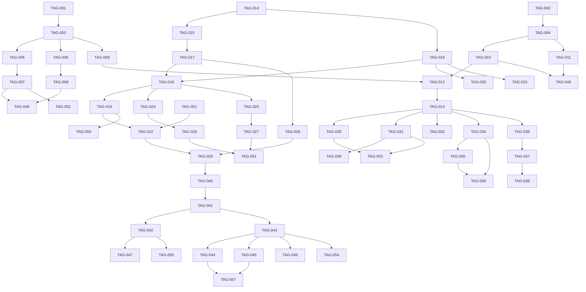

# PRD: Tags and Custom Fields

Generated: 2026-02-09
Version: 1.0
Feature Branch: `feature/tags-custom-fields` (from `main`)

---

## Table of Contents

1. [Source & Context](#1-source--context)
2. [Technical Interpretation](#2-technical-interpretation)
3. [Functional Specifications](#3-functional-specifications)
4. [Technical Requirements & Constraints](#4-technical-requirements--constraints)
5. [User Stories with Acceptance Criteria](#5-user-stories-with-acceptance-criteria)
6. [Task Breakdown Structure](#6-task-breakdown-structure)
7. [Dependencies & Integration Points](#7-dependencies--integration-points)
8. [Risk Assessment & Mitigation](#8-risk-assessment--mitigation)
9. [Testing & Validation Requirements](#9-testing--validation-requirements)
10. [Monitoring & Observability](#10-monitoring--observability)
11. [Success Metrics & Definition of Done](#11-success-metrics--definition-of-done)
12. [Technical Debt & Future Considerations](#12-technical-debt--future-considerations)
13. [Appendices](#13-appendices)

---

## 1. Source & Context

### 1.1 Problem Statement

Solidtime already has a `tags` table and a JSONB `tags` column on the `time_entries` table that stores an array of tag UUIDs. A basic `TagController` provides CRUD endpoints (`GET /tags`, `POST /tags`, `PUT /tags/{tag}`, `DELETE /tags/{tag}`), and the existing frontend has a Tags management page (`resources/js/Pages/Tags.vue`), a `TagDropdown` component, and a `TagBadge` component. The reporting system already supports grouping and filtering by tag via `TimeEntryAggregationType::Tag` and `TimeEntryFilter::addTagIdsFilter()`.

However, the current implementation has significant gaps that prevent tags from being a truly useful organizational tool:

1. **No tag management UI beyond basic CRUD** -- There is no way to assign colors, descriptions, or categories to tags. The tag management page is a plain table with create/delete actions. There is no bulk operations or search/filter capability on the management page itself.

2. **No mandatory tags policy** -- Organizations cannot require that time entries have at least one tag (or a tag from a specific category). This means tags are optional and easily forgotten, reducing the quality of tag-based reporting.

3. **No custom fields** -- There is no mechanism for organizations to define arbitrary key-value metadata on time entries, projects, or tasks. Tags provide a flat taxonomy, but custom fields (dropdown, text, number, checkbox) would enable structured data collection (e.g., cost center, location, department, ticket number).

4. **Limited tag-based filtering in reports** -- While the aggregation service supports grouping by tag, there is no dedicated UI for tag-based report filtering or breakdown in the reporting page. The `tag_ids` filter exists on the time entry index endpoint, but the report UI does not expose it prominently.

5. **No tag colors or visual differentiation** -- All tags look identical in the UI. Competing platforms use colored tags for visual scanning and grouping.

Without these capabilities:
- Organizations cannot enforce consistent categorization of time entries
- Multi-dimensional reporting (by cost center, department, location) requires workarounds
- Tag adoption is low because they are invisible and optional
- Solidtime falls behind competitors like TimeCamp (mandatory tags, tag tiers) and Clockify (tag colors, tag filters in reports)

### 1.2 Competitive Analysis

From **features.txt** Section 2.3 -- "Tags and custom fields":

> **What**: Additional classification for entries (e.g., billable type, location, cost center).
> **Why important**: Enables multi-dimensional reporting without exploding task lists.
> **User flow**:
> 1. Admin defines tag list and rules (optional mandatory tags).
> 2. Member applies tags during time entry.
> 3. Reports filter/break down by tags.
>
> (TimeCamp includes tags/mandatory tags by tier.)

Platforms offering tag-related features:

| Platform | Tag CRUD | Tag Colors | Mandatory Tags | Tag Filtering in Reports | Custom Fields |
|----------|:--------:|:----------:|:--------------:|:------------------------:|:-------------:|
| TimeCamp | Yes | Yes | Yes (by tier) | Yes | No |
| Clockify | Yes | Yes | No | Yes | Yes (paid) |
| Toggl Track | Yes | No | No | Yes | No |
| Harvest | No (categories) | No | No | Yes | No |
| Everhour | Yes | No | No | Yes | No |
| **Solidtime (current)** | **Yes (basic)** | **No** | **No** | **Partial** | **No** |
| **Solidtime (this PRD)** | **Yes (enhanced)** | **Yes** | **Yes** | **Yes** | **Yes** |

### 1.3 Current System State

**Existing infrastructure on `main`:**

**Backend:**
- `Tag` model (`app/Models/Tag.php`): `id`, `name`, `organization_id`, `created_at`, `updated_at`
- `tags` table migration (`2024_01_20_110452_create_tags_table.php`): UUID primary key, `name` VARCHAR(255), `organization_id` FK, `created_at` index
- `TimeEntry.tags` column: JSONB array of tag UUIDs, with `belongsToJson(Tag::class, 'tags')` relationship via `staudenmeir/eloquent-json-relations`
- `TagController` (`app/Http/Controllers/Api/V1/TagController.php`): index, store, update, destroy -- basic CRUD
- `TagStoreRequest` / `TagUpdateRequest` (`app/Http/Requests/V1/Tag/`): validates `name` with uniqueness per organization
- `TagResource` / `TagCollection` (`app/Http/Resources/V1/Tag/`): returns `id`, `name`, `created_at`, `updated_at`
- `TimeEntryFilter::addTagIdsFilter()`: filters time entries by tag IDs via `whereJsonContains`
- `TimeEntryAggregationService`: supports `TimeEntryAggregationType::Tag` for group/sub-group aggregation using `jsonb_array_elements_text()`
- Permissions: `tags:view`, `tags:create`, `tags:update`, `tags:delete` -- granted to Owner, Admin, Manager; Employee has `tags:view` only

**Frontend:**
- `Tags.vue` page (`resources/js/Pages/Tags.vue`): basic tag management page with create button and table
- `useTagsStore` (`resources/js/utils/useTags.ts`): Pinia store with `fetchTags()`, `createTag()`, `deleteTag()`
- `TagDropdown.vue` (`resources/js/packages/ui/src/Tag/TagDropdown.vue`): multiselect dropdown for tag selection on time entries
- `TagBadge.vue`, `TagCreateModal.vue`, `TagTable.vue`, `TagTableRow.vue`, `TagMoreOptionsDropdown.vue`: existing UI components
- `ReportingGroupBySelect.vue`: includes tag as a grouping option in reports

**API Routes (existing):**
```
GET    /api/v1/organizations/{organization}/tags           (tags.index)
POST   /api/v1/organizations/{organization}/tags           (tags.store)
PUT    /api/v1/organizations/{organization}/tags/{tag}     (tags.update)
DELETE /api/v1/organizations/{organization}/tags/{tag}     (tags.destroy)
```

---

## 2. Technical Interpretation

### Business to Technical Translation

| Business Requirement | Technical Implementation |
|---------------------|-------------------------|
| Tag colors for visual differentiation | Add `color` column to `tags` table; update `TagResource` to include color; update `TagBadge` to render with color |
| Tag descriptions/notes | Add `description` column to `tags` table; optional metadata for admin context |
| Mandatory tags policy per organization | Add `mandatory_tags` boolean to `organizations` table; enforce in `TimeEntryStoreRequest` and `TimeEntryUpdateRequest` validation; add UI toggle in org settings |
| Custom fields on time entries | New `custom_fields` table for field definitions; new `custom_field_values` table (or JSONB column on time entries) for values; new `CustomFieldController` and service |
| Custom fields on projects | Extend `custom_field_values` to support `entity_type` polymorphism (time_entry, project, task) |
| Tag-based report filtering UI | Enhance `ReportingOverview.vue` with prominent tag filter; leverage existing `tag_ids` filter on time entry endpoints |
| Tag categories/groups | Add optional `category` column to `tags` table for logical grouping; or create a `tag_groups` table for hierarchical organization |
| Bulk tag operations | Add `PUT /tags/bulk` endpoint for batch update/delete; frontend multi-select on tag management page |

### Phased Approach

This PRD is scoped into two phases to manage complexity:

**Phase A (Core -- this PRD):**
- Tag enhancements: colors, descriptions, mandatory tags policy
- Tag-based report filtering UI improvements
- Tag management UI enhancements (search, bulk operations)
- Custom field definitions and values on time entries

**Phase B (Future -- not in this PRD):**
- Custom fields on projects and tasks
- Tag hierarchies / nested tag groups
- Custom field types beyond dropdown/text/number/checkbox
- Cross-entity custom field reporting

### No-Change Boundary

This feature does **NOT**:
- Change the existing JSONB storage pattern for tags on time entries (maintains backward compatibility)
- Remove or rename any existing API endpoints or response fields
- Modify existing permission names (only adds new ones for custom fields)
- Affect the running timer, weekly timesheet grid, or calendar view (except adding tag selection where appropriate)
- Require new third-party PHP or JS dependencies beyond what is already in the project

---

## 3. Functional Specifications

### 3.1 Core Requirements

#### REQ-001: Tag Colors
- **Description**: Each tag can have an optional hex color assigned by admins. Colors are displayed in tag badges throughout the UI (time entry rows, dropdowns, reports, management page).
- **Priority**: P0
- **Edge Cases**:
  - Tag created without a color (use a default neutral color, e.g., `#6B7280`)
  - Invalid hex color submitted (reject with validation error)
  - Color contrast accessibility (badge text color auto-selects white or black based on background luminance)
- **Error Scenarios**:
  - API validation rejects non-hex strings for color field
  - Frontend color picker fallback for browsers without native `<input type="color">` support

#### REQ-002: Tag Descriptions
- **Description**: Each tag can have an optional description (max 500 characters) visible to admins/managers on the tag management page. Descriptions are not shown in tag badges but appear as tooltips and in the tag detail view.
- **Priority**: P1
- **Edge Cases**:
  - Description is empty/null (perfectly valid, no tooltip shown)
  - Description with special characters or HTML (sanitize on output, store raw)
- **Error Scenarios**:
  - Description exceeding 500 characters rejected by validation

#### REQ-003: Mandatory Tags Policy
- **Description**: Organization-level setting that requires at least one tag on every time entry. When enabled, time entries cannot be created or updated without at least one tag.
- **Priority**: P0
- **Behavior**:
  1. Admin enables "Require tags on time entries" in organization settings
  2. When creating a time entry, the `tags` field must contain at least one valid tag ID
  3. When updating a time entry, the `tags` field (if provided) must contain at least one valid tag ID
  4. Running timers are exempt from mandatory tags until they are stopped (end is set)
  5. Existing time entries without tags are NOT retroactively invalidated
  6. The weekly timesheet grid cell update skips mandatory tag validation (cells create entries with empty tags, which must be edited after)
- **Edge Cases**:
  - Bulk update removes all tags from an entry when mandatory is enabled (reject the update)
  - Import of time entries without tags when mandatory is enabled (allow import with warning, do not block)
  - Mandatory tags enabled but no tags exist in organization (show warning to admin, do not block time entry creation)
- **Error Scenarios**:
  - API returns `422 Unprocessable Entity` with message "At least one tag is required" when validation fails
  - Frontend shows inline error on time entry form when no tags are selected and mandatory policy is active

#### REQ-004: Custom Field Definitions
- **Description**: Admins can define custom fields for time entries. Each custom field has a name, type (text, number, dropdown, checkbox), and optional configuration (e.g., dropdown options, required flag).
- **Priority**: P0
- **Field Types**:
  - **Text**: Free-form string input (max 255 characters)
  - **Number**: Numeric input (integer or decimal, optional min/max)
  - **Dropdown**: Single-select from admin-defined options
  - **Checkbox**: Boolean true/false
- **Behavior**:
  1. Admin creates a custom field definition specifying name, type, and config
  2. Custom field appears in time entry create/edit forms
  3. Values are stored per time entry
  4. Custom fields can be marked as required (validation enforced on create/update)
  5. Custom fields can be archived (hidden from forms, values preserved)
  6. Maximum 20 custom fields per organization (to prevent UI bloat)
- **Edge Cases**:
  - Deleting a custom field definition: soft-delete (archive), values remain queryable
  - Changing a custom field type after values exist (disallowed -- must archive and create new)
  - Dropdown option removed while entries reference it (keep value, mark as "legacy" in UI)
- **Error Scenarios**:
  - Exceeding 20 custom field limit returns `422` with "Maximum custom field limit reached"
  - Required custom field missing on time entry create returns `422` with field-specific message

#### REQ-005: Custom Field Values on Time Entries
- **Description**: Time entries store values for organization-defined custom fields. Values are included in time entry API responses and can be set during create/update.
- **Priority**: P0
- **Storage Approach**: Dedicated `custom_field_values` table with `custom_field_id`, `entity_type`, `entity_id`, `value` (JSON) to support polymorphic entity types in the future.
- **Behavior**:
  1. When creating a time entry, `custom_fields` object can be included in the request body
  2. Each key is a custom field ID, each value is the field value
  3. Values are validated against field type and config (min/max, required, dropdown options)
  4. Values are returned in time entry API responses under `custom_fields` key
  5. Values can be filtered/queried in time entry list endpoints
- **Edge Cases**:
  - Custom field value for a field that does not exist (ignore silently)
  - Custom field value type mismatch (reject with validation error)
  - Time entry response includes only active (non-archived) custom field values

#### REQ-006: Enhanced Tag Management UI
- **Description**: Improve the existing Tags management page with search, color editing, bulk operations, and usage statistics.
- **Priority**: P1
- **Features**:
  1. Search/filter tags by name on the management page
  2. Inline color picker for each tag
  3. Edit tag description in a modal or inline
  4. Show usage count (number of time entries) per tag
  5. Bulk delete tags (with confirmation)
  6. Sort tags by name, usage count, or created date
- **Edge Cases**:
  - Tag with many time entries shows exact count (not approximation)
  - Bulk delete blocked if any tag is still in use (show which ones)

#### REQ-007: Tag-Based Report Filtering UI
- **Description**: Add prominent tag filter controls to the reporting pages so users can filter and break down reports by tag.
- **Priority**: P1
- **Features**:
  1. Tag multiselect filter in report filter bar (leverages existing `tag_ids` query parameter)
  2. "Group by Tag" option visible and functional in report group-by selector (already exists in backend)
  3. Tag badges with colors shown in report breakdown rows
  4. Export includes tag names (already supported in CSV/PDF exports via `tagsRelation`)
- **Edge Cases**:
  - Report filtered by tags that have no time entries (show empty state)
  - Multiple tags on a single time entry with "group by tag" (entry appears in each tag group -- existing behavior via `jsonb_array_elements_text`)

### 3.2 User Workflows

```
Admin configures tags
    -> Opens Tags page (existing)
    -> Creates tags with name, color, and optional description
    -> Enables "Require tags on time entries" in Organization Settings
    -> Creates custom field definitions (e.g., "Cost Center" dropdown, "Ticket #" text)

Member tracks time with tags
    -> Opens Time page or starts timer
    -> Selects project/task
    -> Selects tags from TagDropdown (now with colored badges)
    -> If mandatory tags enabled and no tag selected: form shows error, prevents save
    -> Fills in custom field values (Cost Center, Ticket #)
    -> Saves time entry

Manager runs reports by tag
    -> Opens Reports page
    -> Adds tag filter in filter bar (selects specific tags)
    -> Sets "Group by" to "Tag"
    -> Views breakdown of hours per tag with colored badges
    -> Exports report as CSV/PDF (includes tag names and custom field values)

Admin manages custom fields
    -> Opens new Custom Fields settings page
    -> Creates "Cost Center" dropdown with options: "Engineering", "Marketing", "Sales"
    -> Marks it as required
    -> Creates "Ticket Number" text field (optional)
    -> Archives old "Location" field (no longer needed)
```

### 3.3 Business Rules

#### Tag Colors
1. Colors are stored as 7-character hex strings (`#RRGGBB`)
2. Default color is `#808080` (neutral gray) when none is specified
3. Color is displayed as background of tag badge with auto-contrasted text

#### Mandatory Tags Policy
1. Controlled by `organizations.mandatory_tags` boolean column (default: `false`)
2. Enforced at the API validation layer in `TimeEntryStoreRequest` and `TimeEntryUpdateRequest`
3. Running timers (`end IS NULL`) are exempt from mandatory tag validation on create
4. When a running timer is stopped (updated with `end` value), tags are validated
5. The weekly timesheet grid `PUT /timesheet/cell` endpoint is exempt (creates entries without tags)
6. Bulk time entry update (`PUT /time-entries/bulk`) validates tags if the `tags` field is being changed
7. Import operations are exempt from mandatory tags (allow import of historical data)

#### Custom Fields
1. Field definitions are organization-scoped
2. Maximum 20 active (non-archived) custom fields per organization
3. Field types are immutable after creation (cannot change text to dropdown)
4. Dropdown options can be added but not removed if in use (soft-archive option)
5. Required custom fields are enforced on create and update (when field is provided)
6. Custom field values are stored as JSON to support multiple types in a single column
7. Archived custom fields: values preserved, field hidden from create/edit forms, values still visible in existing entries and reports

#### Tag Deletion
1. Existing behavior: cannot delete a tag that is in use by time entries (`EntityStillInUseApiException`)
2. New behavior for bulk operations: show which tags are in use, allow force-delete option that removes tag ID from all time entries' JSONB arrays

---

## 4. Technical Requirements & Constraints

### 4.1 System Architecture

```
+---------------------------------------------------------------------+
|                        Frontend (Vue.js 3)                           |
+---------------------------------------------------------------------+
|  +----------------+  +--------------------+  +--------------------+  |
|  | Tags.vue       |  | OrgSettings.vue    |  | CustomFields.vue   |  |
|  | (Enhanced page)|  | (Mandatory toggle) |  | (New settings page)|  |
|  +----------------+  +--------------------+  +--------------------+  |
|                                                                      |
|  +--------------------+  +--------------------+                      |
|  | TimeEntryRow.vue   |  | ReportingOverview  |                      |
|  | (Colored tag       |  | (Tag filter bar)   |                      |
|  |  badges, CF values)|  |                    |                      |
|  +--------------------+  +--------------------+                      |
|                                                                      |
|  +---------------------------------------------+                    |
|  | useTagsStore.ts (enhanced)                   |                    |
|  | - tags with colors/descriptions              |                    |
|  | - updateTag() (color, description)           |                    |
|  | - bulkDeleteTags()                           |                    |
|  +---------------------------------------------+                    |
|  +---------------------------------------------+                    |
|  | useCustomFieldsStore.ts (new)                |                    |
|  | - customFields: CustomFieldDefinition[]      |                    |
|  | - fetchCustomFields() / createField()        |                    |
|  | - updateField() / archiveField()             |                    |
|  +---------------------------------------------+                    |
|                    | HTTP/JSON                                       |
+--------------------|-------------------------------------------------+
                     v
+---------------------------------------------------------------------+
|                        Backend (Laravel 11)                          |
+---------------------------------------------------------------------+
|  +-------------------------------+                                   |
|  | TagController.php (enhanced)  |                                   |
|  | - index (+ usage counts)      |                                   |
|  | - store (+ color, description)|                                   |
|  | - update (+ color, description)|                                  |
|  | - destroy (existing)          |                                   |
|  | - bulkDestroy (new)           |                                   |
|  +-------------------------------+                                   |
|                                                                      |
|  +-------------------------------+                                   |
|  | CustomFieldController.php     |    NEW                            |
|  | - index / store / update      |                                   |
|  | - archive / destroy           |                                   |
|  +-------------------------------+                                   |
|                                                                      |
|  +-------------------------------+                                   |
|  | TagService.php                |    NEW                            |
|  | - getTagsWithUsageCounts()    |                                   |
|  | - bulkDeleteTags()            |                                   |
|  | - removeTagFromAllEntries()   |                                   |
|  +-------------------------------+                                   |
|                                                                      |
|  +-------------------------------+                                   |
|  | CustomFieldService.php        |    NEW                            |
|  | - validateCustomFieldValues() |                                   |
|  | - storeValues()               |                                   |
|  | - getValuesForEntity()        |                                   |
|  +-------------------------------+                                   |
|                                                                      |
|  +-------------------------------+  +-----------------------------+  |
|  | Tag Model (enhanced)          |  | CustomField Model (new)     |  |
|  | + color, description columns  |  | + CustomFieldValue Model    |  |
|  +-------------------------------+  +-----------------------------+  |
|                                                                      |
|  +-------------------------------+                                   |
|  | Organization Model (enhanced) |                                   |
|  | + mandatory_tags column        |                                   |
|  +-------------------------------+                                   |
+---------------------------------------------------------------------+
```

### 4.2 Data Models

#### Database Schema Changes

**Migration 1: Add columns to `tags` table**
```sql
ALTER TABLE tags
    ADD COLUMN color VARCHAR(7) DEFAULT '#808080',
    ADD COLUMN description VARCHAR(500) NULL;
```

**Migration 2: Add `mandatory_tags` to `organizations` table**
```sql
ALTER TABLE organizations
    ADD COLUMN mandatory_tags BOOLEAN NOT NULL DEFAULT FALSE;
```

**Migration 3: Create `custom_fields` table**
```sql
CREATE TABLE custom_fields (
    id UUID PRIMARY KEY DEFAULT gen_random_uuid(),
    organization_id UUID NOT NULL REFERENCES organizations(id)
        ON UPDATE CASCADE ON DELETE RESTRICT,
    name VARCHAR(255) NOT NULL,
    type VARCHAR(20) NOT NULL,          -- 'text', 'number', 'dropdown', 'checkbox'
    config JSONB DEFAULT '{}',          -- {options: [...], min: N, max: N}
    is_required BOOLEAN NOT NULL DEFAULT FALSE,
    is_archived BOOLEAN NOT NULL DEFAULT FALSE,
    sort_order INTEGER NOT NULL DEFAULT 0,
    created_at TIMESTAMP DEFAULT CURRENT_TIMESTAMP,
    updated_at TIMESTAMP DEFAULT CURRENT_TIMESTAMP,

    CONSTRAINT uq_custom_fields_org_name UNIQUE (organization_id, name)
);

CREATE INDEX idx_custom_fields_organization ON custom_fields(organization_id);
CREATE INDEX idx_custom_fields_created_at ON custom_fields(created_at);
```

**Migration 4: Create `custom_field_values` table**
```sql
CREATE TABLE custom_field_values (
    id UUID PRIMARY KEY DEFAULT gen_random_uuid(),
    custom_field_id UUID NOT NULL REFERENCES custom_fields(id)
        ON UPDATE CASCADE ON DELETE CASCADE,
    entity_type VARCHAR(50) NOT NULL,   -- 'time_entry' (future: 'project', 'task')
    entity_id UUID NOT NULL,
    value JSONB NOT NULL,               -- stores typed value as JSON
    created_at TIMESTAMP DEFAULT CURRENT_TIMESTAMP,
    updated_at TIMESTAMP DEFAULT CURRENT_TIMESTAMP,

    CONSTRAINT uq_custom_field_value_entity
        UNIQUE (custom_field_id, entity_type, entity_id)
);

CREATE INDEX idx_cfv_entity ON custom_field_values(entity_type, entity_id);
CREATE INDEX idx_cfv_custom_field ON custom_field_values(custom_field_id);
```

#### Backend Models (PHP)

```php
// Updated Tag model additions
/**
 * @property string $color        Hex color code (#RRGGBB)
 * @property string|null $description  Optional description
 */

// New CustomField model
/**
 * @property string $id
 * @property string $name
 * @property string $type             'text'|'number'|'dropdown'|'checkbox'
 * @property array $config            {options?: string[], min?: float, max?: float}
 * @property bool $is_required
 * @property bool $is_archived
 * @property int $sort_order
 * @property string $organization_id
 * @property Carbon|null $created_at
 * @property Carbon|null $updated_at
 */

// New CustomFieldValue model
/**
 * @property string $id
 * @property string $custom_field_id
 * @property string $entity_type
 * @property string $entity_id
 * @property mixed $value
 * @property Carbon|null $created_at
 * @property Carbon|null $updated_at
 */
```

#### Frontend Types (TypeScript)

```typescript
// Enhanced Tag type (extends existing)
interface Tag {
    id: string;
    name: string;
    color: string;           // NEW: hex color '#RRGGBB'
    description: string | null; // NEW: optional description
    created_at: string;
    updated_at: string;
}

// New: Tag with usage statistics (for management page)
interface TagWithUsage extends Tag {
    time_entry_count: number;
}

// New: Custom field definition
interface CustomFieldDefinition {
    id: string;
    name: string;
    type: 'text' | 'number' | 'dropdown' | 'checkbox';
    config: CustomFieldConfig;
    is_required: boolean;
    is_archived: boolean;
    sort_order: number;
    created_at: string;
    updated_at: string;
}

interface CustomFieldConfig {
    options?: string[];       // For dropdown type
    min?: number;             // For number type
    max?: number;             // For number type
    placeholder?: string;     // For text/number types
}

// Custom field value for a time entry
interface CustomFieldValue {
    custom_field_id: string;
    value: string | number | boolean | null;
}

// Used in time entry create/update payloads
interface TimeEntryCustomFields {
    [customFieldId: string]: string | number | boolean | null;
}

// Organization settings extension
interface OrganizationSettings {
    // ... existing fields
    mandatory_tags: boolean;  // NEW
}
```

### 4.3 API Contracts

#### Enhanced Tag Endpoints

##### PUT /api/v1/organizations/{organization}/tags/{tag}
Update tag (enhanced with color and description).

```yaml
Parameters:
  organization: string (path, required)
  tag: string (path, required)
Request Body:
  name: string (required, min:1, max:255, unique per org)
  color: string (optional, regex: /^#[0-9A-Fa-f]{6}$/)
  description: string|null (optional, max:500)
Request Headers:
  Authorization: Bearer {token}
Response 200:
  data: {
    id: string,
    name: string,
    color: string,
    description: string|null,
    created_at: string,
    updated_at: string
  }
Response 422: Validation errors
Permission: tags:update
```

##### POST /api/v1/organizations/{organization}/tags
Create tag (enhanced with color and description).

```yaml
Parameters:
  organization: string (path, required)
Request Body:
  name: string (required, min:1, max:255, unique per org)
  color: string (optional, default: '#808080', regex: /^#[0-9A-Fa-f]{6}$/)
  description: string|null (optional, max:500)
Request Headers:
  Authorization: Bearer {token}
Response 201:
  data: {
    id: string,
    name: string,
    color: string,
    description: string|null,
    created_at: string,
    updated_at: string
  }
Middleware: check-organization-blocked
Permission: tags:create
```

##### GET /api/v1/organizations/{organization}/tags
Get tags (enhanced with usage counts).

```yaml
Parameters:
  organization: string (path, required)
  with_usage_counts: boolean (query, optional, default: false)
Request Headers:
  Authorization: Bearer {token}
Response 200:
  data: Array<{
    id: string,
    name: string,
    color: string,
    description: string|null,
    time_entry_count: int|null,     # Only when with_usage_counts=true
    created_at: string,
    updated_at: string
  }>
Permission: tags:view
```

##### DELETE /api/v1/organizations/{organization}/tags/bulk
Bulk delete tags.

```yaml
Parameters:
  organization: string (path, required)
Request Body:
  ids: string[] (required, min:1, max:50)
  force: boolean (optional, default: false)
Request Headers:
  Authorization: Bearer {token}
Response 200:
  data: {
    deleted: string[],
    failed: Array<{ id: string, reason: string }>
  }
Response 422: Validation errors
Middleware: check-organization-blocked
Permission: tags:delete
```

When `force` is `false`, tags that are in use by time entries will fail with reason `"tag_in_use"`. When `force` is `true`, the tag ID is removed from all time entries' `tags` JSONB arrays before deletion.

#### Custom Field Endpoints

##### GET /api/v1/organizations/{organization}/custom-fields
Get custom field definitions.

```yaml
Parameters:
  organization: string (path, required)
  include_archived: boolean (query, optional, default: false)
Request Headers:
  Authorization: Bearer {token}
Response 200:
  data: Array<{
    id: string,
    name: string,
    type: string,
    config: object,
    is_required: boolean,
    is_archived: boolean,
    sort_order: int,
    created_at: string,
    updated_at: string
  }>
Permission: custom-fields:view
```

##### POST /api/v1/organizations/{organization}/custom-fields
Create custom field definition.

```yaml
Parameters:
  organization: string (path, required)
Request Body:
  name: string (required, min:1, max:255, unique per org)
  type: string (required, in: text|number|dropdown|checkbox)
  config: object (optional)
    options: string[] (required for dropdown, min:1, max:50 items, each max:255 chars)
    min: float (optional, for number)
    max: float (optional, for number)
    placeholder: string (optional, max:255)
  is_required: boolean (optional, default: false)
  sort_order: int (optional, default: 0)
Request Headers:
  Authorization: Bearer {token}
Response 201:
  data: { id, name, type, config, is_required, is_archived, sort_order, created_at, updated_at }
Response 422:
  error: "Maximum custom field limit reached" (when 20 active fields exist)
Middleware: check-organization-blocked
Permission: custom-fields:create
```

##### PUT /api/v1/organizations/{organization}/custom-fields/{customField}
Update custom field definition. Type cannot be changed.

```yaml
Parameters:
  organization: string (path, required)
  customField: string (path, required)
Request Body:
  name: string (optional, min:1, max:255, unique per org)
  config: object (optional, validated per type)
    options: string[] (for dropdown, can add new options, cannot remove in-use options)
    min: float (optional, for number)
    max: float (optional, for number)
    placeholder: string (optional, max:255)
  is_required: boolean (optional)
  sort_order: int (optional)
Request Headers:
  Authorization: Bearer {token}
Response 200:
  data: { id, name, type, config, is_required, is_archived, sort_order, created_at, updated_at }
Middleware: check-organization-blocked
Permission: custom-fields:update
```

##### PUT /api/v1/organizations/{organization}/custom-fields/{customField}/archive
Archive a custom field (soft-delete).

```yaml
Parameters:
  organization: string (path, required)
  customField: string (path, required)
Request Headers:
  Authorization: Bearer {token}
Response 200:
  data: { id, name, type, config, is_required, is_archived: true, ... }
Middleware: check-organization-blocked
Permission: custom-fields:update
```

##### DELETE /api/v1/organizations/{organization}/custom-fields/{customField}
Permanently delete a custom field and all its values. Only allowed for archived fields with no values.

```yaml
Parameters:
  organization: string (path, required)
  customField: string (path, required)
Request Headers:
  Authorization: Bearer {token}
Response 204: No Content
Response 422: "Custom field must be archived before deletion" or "Custom field has existing values"
Middleware: check-organization-blocked
Permission: custom-fields:delete
```

#### Organization Settings Enhancement

##### PUT /api/v1/organizations/{organization}
Update organization (add `mandatory_tags` field).

```yaml
Additional Request Body Fields:
  mandatory_tags: boolean (optional)
Response 200:
  data: { ... existing fields ..., mandatory_tags: boolean }
Permission: organizations:update
```

#### Time Entry Endpoint Enhancements

The existing `POST /time-entries` and `PUT /time-entries/{timeEntry}` endpoints are enhanced:

```yaml
Additional Request Body Fields:
  custom_fields: object (optional)
    {custom_field_id}: string|number|boolean|null

Additional Response Fields (in TimeEntryResource):
  custom_fields: Array<{
    custom_field_id: string,
    custom_field_name: string,
    custom_field_type: string,
    value: string|number|boolean|null
  }>
```

### 4.4 Performance Requirements

| Metric | Target | Measurement |
|--------|--------|-------------|
| Tag list with usage counts | < 500ms | API response for org with up to 200 tags |
| Custom field definitions fetch | < 200ms | API response (max 20 fields) |
| Time entry create with custom fields | < 500ms | API response including CF value writes |
| Tag filter in reports | < 2s | Report generation with tag filter on 100k entries |
| Tag JSONB removal (force delete) | < 5s | Bulk update of tag removal across all entries |
| Tag management page load | < 1s | Page render with 200 tags and usage counts |

### 4.5 Security Requirements

1. **Authorization**: Custom field management restricted to Owner/Admin/Manager. Employees can view custom field definitions and set values on their own time entries.
2. **Input Validation**: All custom field values validated against field type and config. Hex color codes validated with regex. JSONB injection prevented by parameterized queries.
3. **Organization Scoping**: All queries scoped to current organization. Custom fields from other organizations are not accessible.
4. **Write Protection**: All mutation endpoints use `check-organization-blocked` middleware.
5. **Audit Logging**: Tag and custom field changes logged via `CustomAuditable` trait.
6. **Rate Limiting**: Bulk delete limited to 50 tags per request to prevent abuse.

---

## 5. User Stories with Acceptance Criteria

### USR-001: Add Color to Tags
**As an** Admin/Manager
**I want to** assign colors to tags
**So that** tags are visually distinguishable throughout the application

**Priority**: P0 | **Effort**: 5 SP | **Sprint**: 1

**Acceptance Criteria**:
- [ ] Tag create form includes color picker input
- [ ] Tag edit form includes color picker input
- [ ] Color stored as 7-character hex string in database
- [ ] Default color `#808080` applied when none specified
- [ ] `TagBadge` component renders with tag's background color
- [ ] Badge text color auto-selects white or black based on luminance
- [ ] `TagDropdown` items show color dot next to tag name
- [ ] API validation rejects invalid hex color values
- [ ] Existing tags default to `#808080` after migration

### USR-002: Add Description to Tags
**As an** Admin/Manager
**I want to** add descriptions to tags
**So that** team members understand the purpose of each tag

**Priority**: P1 | **Effort**: 3 SP | **Sprint**: 1

**Acceptance Criteria**:
- [ ] Tag create form includes optional description textarea
- [ ] Tag edit form includes optional description textarea
- [ ] Description limited to 500 characters with counter
- [ ] Description visible on tag management page (expandable row or tooltip)
- [ ] Description NOT shown in `TagBadge` or `TagDropdown` (too verbose)
- [ ] API returns `description` field in `TagResource`
- [ ] Null/empty descriptions handled gracefully

### USR-003: Enable Mandatory Tags Policy
**As an** Admin
**I want to** require tags on all time entries
**So that** our reporting data is consistently categorized

**Priority**: P0 | **Effort**: 5 SP | **Sprint**: 1-2

**Acceptance Criteria**:
- [ ] Organization settings page has "Require tags on time entries" toggle
- [ ] When enabled, time entry creation without tags returns `422` error
- [ ] When enabled, time entry update that removes all tags returns `422` error
- [ ] Running timers (no `end`) are exempt from mandatory tag validation
- [ ] When a running timer is stopped, tags are validated
- [ ] Weekly timesheet grid cell updates are exempt from mandatory tags
- [ ] Import operations are exempt from mandatory tags
- [ ] Existing entries without tags are NOT retroactively invalidated
- [ ] Frontend time entry form shows "Tags required" indicator when policy is active
- [ ] If mandatory is enabled but no tags exist, admin sees a warning message

### USR-004: Create Custom Field Definitions
**As an** Admin
**I want to** define custom fields for time entries
**So that** my organization can capture structured metadata specific to our workflow

**Priority**: P0 | **Effort**: 8 SP | **Sprint**: 2

**Acceptance Criteria**:
- [ ] New "Custom Fields" page accessible from organization settings
- [ ] Admin can create a custom field with name, type, and config
- [ ] Supported types: text, number, dropdown, checkbox
- [ ] Dropdown type requires at least one option
- [ ] Number type supports optional min/max bounds
- [ ] Fields can be marked as required
- [ ] Fields are ordered by `sort_order` (drag-to-reorder in UI)
- [ ] Maximum 20 active fields enforced with clear error message
- [ ] Field names unique per organization
- [ ] Field type cannot be changed after creation

### USR-005: Fill Custom Field Values on Time Entries
**As a** Member
**I want to** fill in custom field values when logging time
**So that** my time entries have the metadata my organization requires

**Priority**: P0 | **Effort**: 8 SP | **Sprint**: 2-3

**Acceptance Criteria**:
- [ ] Time entry create modal shows custom fields below standard fields
- [ ] Time entry edit modal shows custom fields with current values
- [ ] Text fields render as text input
- [ ] Number fields render as number input (with min/max)
- [ ] Dropdown fields render as select/combobox
- [ ] Checkbox fields render as toggle switch
- [ ] Required fields show asterisk and validation error if empty
- [ ] Custom field values saved via time entry create/update API
- [ ] Time entry list/detail shows custom field values
- [ ] API response includes `custom_fields` array with field metadata and values

### USR-006: Manage Tags with Enhanced UI
**As an** Admin
**I want to** search, sort, and bulk-manage tags
**So that** I can efficiently maintain our tag taxonomy

**Priority**: P1 | **Effort**: 5 SP | **Sprint**: 3

**Acceptance Criteria**:
- [ ] Tag management page has search/filter input
- [ ] Tags can be sorted by name, usage count, or created date
- [ ] Each tag row shows usage count (number of time entries)
- [ ] Multi-select checkboxes on tag rows
- [ ] "Delete Selected" button for bulk deletion
- [ ] Confirmation dialog shows which tags are in use
- [ ] Force delete option removes tag from all time entries
- [ ] Success/failure feedback for each tag in bulk operation

### USR-007: Filter Reports by Tag
**As a** Manager
**I want to** filter reports by specific tags
**So that** I can analyze time spent on particular categories

**Priority**: P1 | **Effort**: 5 SP | **Sprint**: 3

**Acceptance Criteria**:
- [ ] Report filter bar includes tag multiselect dropdown
- [ ] Selected tags filter time entries in report data
- [ ] Tag filter works with all existing group-by options
- [ ] "Group by Tag" shows colored tag badges in breakdown rows
- [ ] Report export (CSV/PDF) includes applied tag filter
- [ ] Empty state shown when no entries match selected tags
- [ ] Tag filter is clearable

### USR-008: Archive Custom Fields
**As an** Admin
**I want to** archive custom fields that are no longer needed
**So that** they stop appearing in forms but historical data is preserved

**Priority**: P1 | **Effort**: 3 SP | **Sprint**: 3

**Acceptance Criteria**:
- [ ] Custom field list shows archive button per field
- [ ] Archived fields disappear from time entry create/edit forms
- [ ] Archived fields' values still visible on existing time entries
- [ ] Archived fields visible in custom field management with "Archived" badge
- [ ] Archived fields can be restored (un-archived)
- [ ] Only archived fields with no values can be permanently deleted

---

## 6. Task Breakdown Structure

See `task_assignments_20260209.md` for the full task table.

### Phase 1: Tag Enhancements (Sprint 1)

| Task ID | Description | Type | Effort | Dependencies |
|---------|-------------|------|--------|--------------|
| TAG-001 | Migration: add `color` and `description` columns to `tags` table | Backend | 2h | None |
| TAG-002 | Migration: add `mandatory_tags` column to `organizations` table | Backend | 1h | None |
| TAG-003 | Update `Tag` model with new casts and properties | Backend | 2h | TAG-001 |
| TAG-004 | Update `Organization` model with `mandatory_tags` cast | Backend | 1h | TAG-002 |
| TAG-005 | Update `TagStoreRequest` with `color` and `description` validation rules | Backend | 2h | TAG-003 |
| TAG-006 | Update `TagUpdateRequest` with `color` and `description` validation rules | Backend | 2h | TAG-003 |
| TAG-007 | Update `TagController::store()` to handle `color` and `description` | Backend | 2h | TAG-005 |
| TAG-008 | Update `TagController::update()` to handle `color` and `description` | Backend | 2h | TAG-006 |
| TAG-009 | Update `TagResource` to include `color` and `description` in response | Backend | 1h | TAG-003 |
| TAG-010 | Add mandatory tags validation to `TimeEntryStoreRequest` | Backend | 4h | TAG-004 |
| TAG-011 | Add mandatory tags validation to `TimeEntryUpdateRequest` | Backend | 4h | TAG-004 |
| TAG-012 | Update OpenAPI spec with enhanced tag and organization fields | Backend | 3h | TAG-009, TAG-010 |
| TAG-013 | Regenerate TypeScript API client from updated OpenAPI spec | Frontend | 1h | TAG-012 |

### Phase 2: Custom Fields Backend (Sprint 2)

| Task ID | Description | Type | Effort | Dependencies |
|---------|-------------|------|--------|--------------|
| TAG-014 | Migration: create `custom_fields` table | Backend | 2h | None |
| TAG-015 | Migration: create `custom_field_values` table | Backend | 2h | TAG-014 |
| TAG-016 | Create `CustomField` model with relationships and casts | Backend | 3h | TAG-014 |
| TAG-017 | Create `CustomFieldValue` model with relationships | Backend | 2h | TAG-015, TAG-016 |
| TAG-018 | Create `CustomFieldService` with validation and CRUD logic | Backend | 8h | TAG-016, TAG-017 |
| TAG-019 | Create `CustomFieldController` with all endpoints | Backend | 6h | TAG-018 |
| TAG-020 | Create request validation classes for custom fields | Backend | 4h | TAG-016 |
| TAG-021 | Register custom field permissions in `CorePermissions` | Backend | 2h | None |
| TAG-022 | Register custom field API routes in `routes/api.php` | Backend | 2h | TAG-019, TAG-021 |
| TAG-023 | Add `CustomFieldResource` and `CustomFieldCollection` | Backend | 2h | TAG-016 |
| TAG-024 | Enhance `TimeEntryStoreRequest` to validate custom field values | Backend | 4h | TAG-018 |
| TAG-025 | Enhance `TimeEntryUpdateRequest` to validate custom field values | Backend | 3h | TAG-018 |
| TAG-026 | Enhance `TimeEntryController::store()` to save custom field values | Backend | 3h | TAG-024, TAG-018 |
| TAG-027 | Enhance `TimeEntryController::update()` to save custom field values | Backend | 3h | TAG-025, TAG-018 |
| TAG-028 | Enhance `TimeEntryResource` to include custom field values in response | Backend | 3h | TAG-017 |
| TAG-029 | Update OpenAPI spec with custom field endpoints and time entry CF fields | Backend | 4h | TAG-022, TAG-028 |

### Phase 3: Tag Enhancements Frontend (Sprint 2-3)

| Task ID | Description | Type | Effort | Dependencies |
|---------|-------------|------|--------|--------------|
| TAG-030 | Update `TagBadge.vue` to render with tag color | Frontend | 3h | TAG-013 |
| TAG-031 | Update `TagDropdown.vue` to show color dots | Frontend | 2h | TAG-013 |
| TAG-032 | Update `TagCreateModal.vue` with color picker and description | Frontend | 4h | TAG-013 |
| TAG-033 | Create tag edit modal or inline editing on tag table | Frontend | 4h | TAG-013 |
| TAG-034 | Add mandatory tags toggle to organization settings page | Frontend | 4h | TAG-013 |
| TAG-035 | Update time entry forms to show "Tags required" indicator | Frontend | 3h | TAG-034 |
| TAG-036 | Create `TagService.ts` for bulk operations and usage counts | Frontend | 3h | TAG-013 |
| TAG-037 | Enhance Tags management page with search, sort, and usage counts | Frontend | 6h | TAG-036 |
| TAG-038 | Add bulk select and bulk delete to Tags management page | Frontend | 4h | TAG-037 |
| TAG-039 | Add tag filter to reporting filter bar | Frontend | 4h | TAG-031 |

### Phase 4: Custom Fields Frontend (Sprint 3)

| Task ID | Description | Type | Effort | Dependencies |
|---------|-------------|------|--------|--------------|
| TAG-040 | Regenerate TypeScript API client with custom field endpoints | Frontend | 1h | TAG-029 |
| TAG-041 | Create `useCustomFieldsStore.ts` Pinia store | Frontend | 4h | TAG-040 |
| TAG-042 | Create Custom Fields settings page (`CustomFields.vue`) | Frontend | 8h | TAG-041 |
| TAG-043 | Create `CustomFieldFormRenderer.vue` component (renders field by type) | Frontend | 6h | TAG-041 |
| TAG-044 | Integrate custom fields into `TimeEntryCreateModal.vue` | Frontend | 4h | TAG-043 |
| TAG-045 | Integrate custom fields into `TimeEntryEditModal.vue` | Frontend | 4h | TAG-043 |
| TAG-046 | Show custom field values in `TimeEntryRow.vue` | Frontend | 3h | TAG-043 |
| TAG-047 | Add navigation for Custom Fields settings page | Frontend | 2h | TAG-042 |

### Phase 5: Testing (Sprint 3-4)

| Task ID | Description | Type | Effort | Dependencies |
|---------|-------------|------|--------|--------------|
| TAG-048 | Backend tests: tag color/description on CRUD endpoints | Testing | 4h | TAG-007, TAG-008 |
| TAG-049 | Backend tests: mandatory tags validation on time entries | Testing | 6h | TAG-010, TAG-011 |
| TAG-050 | Backend tests: custom field CRUD endpoints | Testing | 8h | TAG-019 |
| TAG-051 | Backend tests: custom field values on time entry CRUD | Testing | 6h | TAG-026, TAG-027 |
| TAG-052 | Backend tests: tag bulk delete endpoint | Testing | 4h | TAG-007 |
| TAG-053 | Frontend component tests: TagBadge, TagDropdown with colors | Testing | 4h | TAG-030, TAG-031 |
| TAG-054 | Frontend component tests: CustomFieldFormRenderer | Testing | 4h | TAG-043 |
| TAG-055 | Frontend component tests: Custom Fields settings page | Testing | 4h | TAG-042 |
| TAG-056 | E2E tests: tag creation with color, mandatory tags policy | Testing | 6h | TAG-034, TAG-035 |
| TAG-057 | E2E tests: custom field creation and value entry on time entries | Testing | 6h | TAG-044, TAG-045 |

**Total Effort**: ~232 hours (~155 SP across 4 sprints)

### Critical Path

```
TAG-001 -> TAG-003 -> TAG-005 -> TAG-007 -> TAG-012 -> TAG-013 -> TAG-030 -> TAG-053
                                                    |
TAG-002 -> TAG-004 -> TAG-010 -> TAG-012            |-> TAG-032 -> TAG-056
                                                    |
TAG-014 -> TAG-016 -> TAG-018 -> TAG-019 -> TAG-022 -> TAG-029 -> TAG-040 -> TAG-041
       |-> TAG-015 -> TAG-017                                              |-> TAG-042 -> TAG-055
                                                                           |-> TAG-043 -> TAG-044 -> TAG-057
```

### Dependency Graph



---

## 7. Dependencies & Integration Points

### 7.1 Internal Dependencies

| Dependency | Description | Impact |
|------------|-------------|--------|
| `Tag` Model | Existing model, enhanced with new columns | Read + Write (schema change) |
| `TimeEntry` Model | Existing model, enhanced with custom field values | Read + Write (no schema change on time_entries table) |
| `Organization` Model | Enhanced with `mandatory_tags` column | Read + Write (schema change) |
| `TagController` | Existing controller, enhanced with color/description handling | Modified |
| `TimeEntryController` | Existing controller, enhanced with CF value handling | Modified |
| `TimeEntryStoreRequest` | Existing validation, enhanced with mandatory tags + CF validation | Modified |
| `TimeEntryUpdateRequest` | Existing validation, enhanced with mandatory tags + CF validation | Modified |
| `TagResource` | Existing resource, enhanced with new fields | Modified |
| `TimeEntryResource` | Existing resource, enhanced with CF values | Modified |
| `TimeEntryFilter` | Existing filter, no changes needed (tag_ids filter already works) | Read-only |
| `TimeEntryAggregationService` | Existing service, no changes needed (tag grouping already works) | Read-only |
| `CorePermissions` | Existing permission registry, add custom-field permissions | Modified |
| `PermissionStore` | Existing cache, used for CF permission checks | Read-only |
| `Member` Model | Used for permission scoping on time entries | Read-only |

### 7.2 External Dependencies

| Dependency | Version | Purpose |
|------------|---------|---------|
| `staudenmeir/eloquent-json-relations` | existing | JSONB tag relationships (already in project) |
| `korridor/laravel-model-validation-rules` | existing | `UniqueEloquent` / `ExistsEloquent` for validation |
| `@heroicons/vue` | ^2.x | Icons for UI (already in project) |
| `pinia` | ^2.x | State management (already in project) |
| TailwindCSS | ^3.x | Styling (already in project) |

No new dependencies required.

### 7.3 Cross-Feature Interactions

| Feature | Interaction | Direction |
|---------|-------------|-----------|
| Feature 00 (Weekly Timesheet Grid) | Timesheet cell updates are exempt from mandatory tags | This feature reads organization setting |
| Feature 01 (Timesheet Approvals) | Approval workflow may enforce tag policy on submission | Future consumer |
| Feature 09 (Advanced Reporting) | Report filtering by tag, grouping by tag, custom field in exports | Bidirectional |
| Feature 13 (Audit Trail) | Tag and custom field changes logged via `CustomAuditable` | This feature provides audit data |

### 7.4 Migration Ordering

Migrations must run in this order:
1. `TAG-001`: Add `color` and `description` to `tags` (no data dependency)
2. `TAG-002`: Add `mandatory_tags` to `organizations` (no data dependency)
3. `TAG-014`: Create `custom_fields` table (depends on `organizations` table)
4. `TAG-015`: Create `custom_field_values` table (depends on `custom_fields` table)

All four migrations are independent of existing data and can be rolled back safely.

---

## 8. Risk Assessment & Mitigation

| Risk | Probability | Impact | Mitigation |
|------|-------------|--------|------------|
| JSONB tag removal on force-delete is slow for large datasets | Medium | High | Use batched `UPDATE` with `jsonb_remove_element` in chunks of 1000; add progress feedback to API response; run as background job if > 5000 entries affected |
| Mandatory tags breaks existing workflows (timer, imports) | Medium | High | Exempt running timers and imports from validation; clear documentation; admin warning when enabling; gradual rollout with feature flag |
| Custom field JSONB value storage makes SQL filtering complex | Medium | Medium | Use GIN index on `custom_field_values.value` column; for Phase A, filtering is limited to exact-match queries; full-text and range queries deferred to Phase B |
| Custom field limit (20) too restrictive for some orgs | Low | Low | 20 is a soft limit enforced in application code; can be adjusted per-org via config without migration |
| Tag color accessibility issues | Medium | Low | Auto-contrast text color algorithm (WCAG 2.0 luminance calculation); provide predefined color palette in picker alongside custom hex input |
| Breaking change in `TagResource` response shape | Low | High | New fields (`color`, `description`) are additive only; no existing fields removed or renamed; API consumers that ignore unknown fields are unaffected |
| Performance impact of usage count queries | Medium | Medium | Usage count is opt-in via `with_usage_counts=true` query param; uses `COUNT(*)` with JSONB containment which is indexed; cache counts for 5 minutes on high-traffic orgs |
| Custom field type immutability frustrates users | Medium | Low | Clear UX messaging: "Field type cannot be changed. Archive this field and create a new one with the desired type." |

---

## 9. Testing & Validation Requirements

### 9.1 Test Strategy

| Type | Coverage Target | Tools |
|------|-----------------|-------|
| Backend Unit Tests | All service methods | PHPUnit |
| API Endpoint Tests | All new/modified endpoints | PHPUnit (ApiEndpointTestAbstract) |
| Frontend Component Tests | Core new components | Vitest + @vue/test-utils |
| E2E Tests | Critical user paths | Playwright |

### 9.2 Key Test Scenarios

**Backend -- Tag Enhancements:**
- Create tag with valid color and description
- Create tag with invalid color format (expect 422)
- Create tag without color (expect default `#808080`)
- Update tag color and description
- Tag index returns color and description fields
- Tag index with `with_usage_counts=true` returns correct counts
- Tag index without `with_usage_counts` does not include count field
- Bulk delete tags with no entries (success)
- Bulk delete tags in use without `force` (expect failure per tag)
- Bulk delete tags in use with `force` (removes tag from entries, then deletes)
- Bulk delete with mixed in-use and free tags (partial success)
- Permission checks: Employee cannot create/update/delete tags

**Backend -- Mandatory Tags:**
- Create time entry without tags when mandatory is OFF (success)
- Create time entry without tags when mandatory is ON (expect 422)
- Create time entry with tags when mandatory is ON (success)
- Create running timer without tags when mandatory is ON (success -- exempt)
- Stop running timer without tags when mandatory is ON (expect 422)
- Update time entry to remove all tags when mandatory is ON (expect 422)
- Bulk update time entries: removing tags when mandatory is ON (expect 422)
- Import time entries without tags when mandatory is ON (success -- exempt)
- Timesheet cell update without tags when mandatory is ON (success -- exempt)
- Enable mandatory tags on org with no tags (success with warning)

**Backend -- Custom Fields:**
- Create custom field of each type (text, number, dropdown, checkbox)
- Create dropdown field without options (expect 422)
- Create field exceeding 20-field limit (expect 422)
- Create field with duplicate name in same org (expect 422)
- Create field with same name in different org (success)
- Update custom field name and config
- Attempt to change custom field type (expect 422)
- Archive custom field
- Restore archived custom field
- Delete archived field with no values (success)
- Delete archived field with values (expect 422)
- Delete non-archived field (expect 422)

**Backend -- Custom Field Values:**
- Create time entry with custom field values
- Create time entry with required custom field missing (expect 422)
- Create time entry with wrong value type for field (expect 422)
- Create time entry with dropdown value not in options (expect 422)
- Create time entry with number value outside min/max (expect 422)
- Update time entry custom field values
- Time entry response includes custom field values with metadata
- Custom field values for archived fields still returned on existing entries
- Custom field values for non-existent field IDs silently ignored

**Frontend:**
- `TagBadge` renders with background color and contrasting text
- `TagDropdown` shows color dots next to tag names
- `TagCreateModal` includes color picker and description fields
- Tag management page search filters tags
- Tag management page sort works for all columns
- Bulk selection and delete with confirmation dialog
- Organization settings toggle for mandatory tags
- Time entry form shows "required" indicator for tags when mandatory
- Time entry form blocks save when tags are required and empty
- Custom field settings page renders field list
- Custom field create form validates all field types
- Custom field form renderer renders each field type correctly
- Time entry modal shows custom fields and validates required fields
- Custom field archive/restore works from settings page

**E2E:**
- Admin creates tag with color, verifies color displays in tag badge
- Admin enables mandatory tags, member attempts to save entry without tags (blocked)
- Admin creates custom field (dropdown), member fills value on time entry
- Admin archives custom field, verifies it disappears from entry form
- Manager filters report by tag, verifies filtered results
- Admin bulk deletes tags, verifies removal from time entries

---

## 10. Monitoring & Observability

### 10.1 Metrics to Track

| Metric | Type | Alert Threshold |
|--------|------|-----------------|
| Tag API response time (P95) | Performance | > 500ms |
| Custom field API response time (P95) | Performance | > 500ms |
| Mandatory tags validation rejection rate | Business | > 10% (indicates UX issue) |
| Custom field adoption (% of entries with CF values) | Business | -- |
| Tag usage distribution (entries per tag) | Business | -- |
| Bulk delete execution time | Performance | > 10s |
| Custom field value write failures | Error | > 1% |

### 10.2 Logging

All tag and custom field mutations are automatically logged by the `CustomAuditable` trait on the respective models. Specific additional log points:

```php
// Log when mandatory tags blocks a time entry save
Log::info('Mandatory tags validation rejected time entry creation', [
    'organization_id' => $organization->getKey(),
    'user_id' => Auth::id(),
]);

// Log bulk tag delete operations
Log::info('Bulk tag delete executed', [
    'organization_id' => $organization->getKey(),
    'deleted_count' => count($deletedIds),
    'failed_count' => count($failedIds),
    'force' => $force,
]);

// Log custom field value validation failures
Log::debug('Custom field validation failed', [
    'custom_field_id' => $field->id,
    'expected_type' => $field->type,
    'provided_value' => $value,
]);
```

---

## 11. Success Metrics & Definition of Done

### 11.1 Success Metrics

| Metric | Target | Measurement |
|--------|--------|-------------|
| Tag color adoption | 50% of tags have non-default colors within 30 days | Database query |
| Mandatory tags adoption | 20% of organizations enable within 60 days | Database query |
| Custom field adoption | 15% of organizations create at least one field within 60 days | Database query |
| Tag-based report usage | 25% increase in tag-filtered report views within 30 days | Analytics |
| Time entry tag completeness | 30% increase in entries with tags (orgs using mandatory) | Database query |

### 11.2 Definition of Done

- [ ] All 8 user stories (USR-001 through USR-008) implemented
- [ ] 4 database migrations created and tested (up and down)
- [ ] Enhanced tag CRUD endpoints working with color and description
- [ ] Mandatory tags validation enforced on time entry create/update
- [ ] Custom field CRUD endpoints working with all 4 field types
- [ ] Custom field values integrated into time entry create/update/read
- [ ] New permissions registered for custom fields (view, create, update, delete)
- [ ] `TagBadge` renders with colors throughout the application
- [ ] Tag management page enhanced with search, sort, usage counts, bulk delete
- [ ] Organization settings page has mandatory tags toggle
- [ ] Custom Fields settings page functional with create/edit/archive/delete
- [ ] Time entry forms show custom fields and validate required fields
- [ ] Report filter bar includes tag filter dropdown
- [ ] Backend endpoint tests passing for all new/modified endpoints
- [ ] Frontend component tests passing for core new components
- [ ] E2E tests passing for critical user paths
- [ ] `composer fix && composer analyse` passes
- [ ] `npm run lint:fix && npm run format` passes
- [ ] OpenAPI spec updated and TypeScript client regenerated

---

## 12. Technical Debt & Future Considerations

### 12.1 Known Simplifications

1. **Custom fields only on time entries (Phase A)**: This PRD limits custom fields to time entries only. Extending to projects and tasks requires additional polymorphic entity handling in the `custom_field_values` table (the schema already supports it via `entity_type`).

2. **No custom field filtering in reports**: Phase A adds tag filtering to reports but does not add custom field filtering/grouping to the aggregation service. This requires extending `TimeEntryAggregationType` and the aggregation SQL.

3. **Tag force-delete is synchronous**: For organizations with many time entries, removing a tag from all entries synchronously could be slow. A future enhancement would dispatch this as a background job with progress tracking.

4. **No tag categories/groups**: Tags are flat (no hierarchy). A `tag_groups` table could be added in the future for organizing tags into categories (e.g., "Department", "Location", "Cost Center").

5. **Custom field dropdown options are strings**: Complex dropdown options (with IDs, descriptions, or sub-options) are deferred. Phase A uses simple string arrays.

6. **No custom field import/export**: Bulk importing custom field values (e.g., via CSV) is not included. The CSV import flow would need to map column headers to custom field IDs.

### 12.2 Future Enhancements

| Enhancement | Priority | Description |
|-------------|----------|-------------|
| Custom fields on projects and tasks | P1 | Extend `entity_type` to `project` and `task` |
| Custom field filtering in reports | P1 | Add custom field as aggregation type for report grouping |
| Tag categories/groups | P2 | Hierarchical tag organization for structured taxonomies |
| Custom field conditional logic | P2 | Show/hide fields based on other field values |
| Tag-based automation rules | P3 | Auto-apply tags based on project/task/client |
| Custom field types: date, URL, multi-select | P3 | Additional field types beyond text/number/dropdown/checkbox |
| Custom field templates | P3 | Pre-defined field sets for common use cases (IT, consulting, etc.) |
| Tag merge | P3 | Merge two tags into one, updating all time entries |
| Custom field API filtering | P2 | Filter time entries by custom field values in API |
| Bulk import custom field values | P3 | CSV upload to populate custom field values across entries |

---

## 13. Appendices

### 13.1 File Structure Summary

```
solidtime/
+-- app/
|   +-- Enums/
|   |   +-- CustomFieldType.php                          # NEW
|   +-- Http/
|   |   +-- Controllers/Api/V1/
|   |   |   +-- TagController.php                        # MODIFIED (bulk delete, usage counts)
|   |   |   +-- CustomFieldController.php                # NEW
|   |   |   +-- TimeEntryController.php                  # MODIFIED (CF values)
|   |   +-- Requests/V1/
|   |   |   +-- Tag/
|   |   |   |   +-- TagStoreRequest.php                  # MODIFIED (color, description rules)
|   |   |   |   +-- TagUpdateRequest.php                 # MODIFIED (color, description rules)
|   |   |   |   +-- TagBulkDeleteRequest.php             # NEW
|   |   |   +-- CustomField/
|   |   |   |   +-- CustomFieldStoreRequest.php          # NEW
|   |   |   |   +-- CustomFieldUpdateRequest.php         # NEW
|   |   |   +-- TimeEntry/
|   |   |       +-- TimeEntryStoreRequest.php            # MODIFIED (mandatory tags, CF validation)
|   |   |       +-- TimeEntryUpdateRequest.php           # MODIFIED (mandatory tags, CF validation)
|   |   +-- Resources/V1/
|   |       +-- Tag/
|   |       |   +-- TagResource.php                      # MODIFIED (color, description, count)
|   |       |   +-- TagCollection.php                    # EXISTING (no changes)
|   |       +-- CustomField/
|   |       |   +-- CustomFieldResource.php              # NEW
|   |       |   +-- CustomFieldCollection.php            # NEW
|   |       +-- TimeEntry/
|   |           +-- TimeEntryResource.php                # MODIFIED (custom_fields)
|   +-- Models/
|   |   +-- Tag.php                                      # MODIFIED (color, description properties)
|   |   +-- Organization.php                             # MODIFIED (mandatory_tags cast)
|   |   +-- CustomField.php                              # NEW
|   |   +-- CustomFieldValue.php                         # NEW
|   +-- Permissions/
|   |   +-- CorePermissions.php                          # MODIFIED (add custom-field permissions)
|   +-- Service/
|       +-- TagService.php                               # NEW
|       +-- CustomFieldService.php                       # NEW
+-- database/
|   +-- migrations/
|   |   +-- 2026_xx_xx_000001_add_color_description_to_tags_table.php         # NEW
|   |   +-- 2026_xx_xx_000002_add_mandatory_tags_to_organizations_table.php   # NEW
|   |   +-- 2026_xx_xx_000003_create_custom_fields_table.php                  # NEW
|   |   +-- 2026_xx_xx_000004_create_custom_field_values_table.php            # NEW
|   +-- factories/
|       +-- CustomFieldFactory.php                       # NEW
|       +-- CustomFieldValueFactory.php                  # NEW
+-- routes/
|   +-- api.php                                          # MODIFIED (add custom-field routes, tag bulk route)
+-- resources/js/
|   +-- Pages/
|   |   +-- Tags.vue                                     # MODIFIED (enhanced management UI)
|   |   +-- CustomFields.vue                             # NEW (settings page)
|   +-- packages/ui/src/
|   |   +-- Tag/
|   |   |   +-- TagBadge.vue                             # MODIFIED (color rendering)
|   |   |   +-- TagCreateModal.vue                       # MODIFIED (color picker, description)
|   |   |   +-- TagDropdown.vue                          # MODIFIED (color dots)
|   |   |   +-- TagEditModal.vue                         # NEW
|   |   +-- CustomField/
|   |   |   +-- CustomFieldFormRenderer.vue              # NEW (renders field by type)
|   |   |   +-- CustomFieldCreateModal.vue               # NEW
|   |   |   +-- CustomFieldEditModal.vue                 # NEW
|   |   |   +-- CustomFieldListItem.vue                  # NEW
|   |   |   +-- __tests__/
|   |   |       +-- CustomFieldFormRenderer.test.ts      # NEW
|   |   +-- TimeEntry/
|   |       +-- TimeEntryCreateModal.vue                 # MODIFIED (custom fields section)
|   |       +-- TimeEntryEditModal.vue                   # MODIFIED (custom fields section)
|   |       +-- TimeEntryRow.vue                         # MODIFIED (CF values display)
|   +-- utils/
|   |   +-- useTags.ts                                   # MODIFIED (update, bulk delete, usage counts)
|   |   +-- useCustomFields.ts                           # NEW (Pinia store)
|   +-- types/
|   |   +-- customFields.d.ts                            # NEW (TypeScript types)
|   +-- Components/Common/
|       +-- Tag/
|       |   +-- TagTable.vue                             # MODIFIED (search, sort, bulk select)
|       |   +-- TagTableRow.vue                          # MODIFIED (color, description, usage count)
|       |   +-- TagMoreOptionsDropdown.vue               # MODIFIED (edit option)
|       +-- Reporting/
|           +-- ReportingOverview.vue                    # MODIFIED (tag filter)
+-- tests/
|   +-- Unit/Endpoint/Api/V1/
|   |   +-- TagEndpointTest.php                          # MODIFIED (new test cases)
|   |   +-- CustomFieldEndpointTest.php                  # NEW
|   +-- Unit/Service/
|       +-- TagServiceTest.php                           # NEW
|       +-- CustomFieldServiceTest.php                   # NEW
+-- e2e/
    +-- tags-custom-fields.spec.ts                       # NEW
```

### 13.2 API Endpoint Summary

| Method | Endpoint | Description | Status |
|--------|----------|-------------|--------|
| GET | `/api/v1/organizations/{org}/tags` | Get tags (enhanced with color, description, usage counts) | MODIFIED |
| POST | `/api/v1/organizations/{org}/tags` | Create tag (enhanced with color, description) | MODIFIED |
| PUT | `/api/v1/organizations/{org}/tags/{tag}` | Update tag (enhanced with color, description) | MODIFIED |
| DELETE | `/api/v1/organizations/{org}/tags/{tag}` | Delete tag (existing) | EXISTING |
| DELETE | `/api/v1/organizations/{org}/tags/bulk` | Bulk delete tags with optional force | NEW |
| GET | `/api/v1/organizations/{org}/custom-fields` | Get custom field definitions | NEW |
| POST | `/api/v1/organizations/{org}/custom-fields` | Create custom field definition | NEW |
| PUT | `/api/v1/organizations/{org}/custom-fields/{cf}` | Update custom field definition | NEW |
| PUT | `/api/v1/organizations/{org}/custom-fields/{cf}/archive` | Archive custom field | NEW |
| DELETE | `/api/v1/organizations/{org}/custom-fields/{cf}` | Delete custom field (archived only) | NEW |

### 13.3 Permission Matrix

| Permission | Owner | Admin | Manager | Employee |
|------------|:-----:|:-----:|:-------:|:--------:|
| `tags:view` | Yes | Yes | Yes | Yes |
| `tags:create` | Yes | Yes | Yes | No |
| `tags:update` | Yes | Yes | Yes | No |
| `tags:delete` | Yes | Yes | Yes | No |
| `custom-fields:view` | Yes | Yes | Yes | Yes |
| `custom-fields:create` | Yes | Yes | No | No |
| `custom-fields:update` | Yes | Yes | No | No |
| `custom-fields:delete` | Yes | Yes | No | No |

Note: Custom field creation and management is restricted to Owner and Admin roles because field definitions affect the entire organization's data structure. Managers can view definitions and set values on time entries they have access to. Employees can view definitions and set values on their own time entries.

### 13.4 Custom Field Type Specifications

| Type | Storage | Validation | UI Component |
|------|---------|------------|--------------|
| `text` | `"string value"` (JSON string) | Max 255 chars, optional `placeholder` | `<input type="text">` |
| `number` | `42.5` (JSON number) | Optional `min`/`max`, integer or float | `<input type="number">` |
| `dropdown` | `"selected option"` (JSON string) | Must be one of `config.options` | `<select>` or custom combobox |
| `checkbox` | `true`/`false` (JSON boolean) | Must be boolean | `<input type="checkbox">` or toggle |

### 13.5 Color Contrast Algorithm

For auto-selecting badge text color (white or black) based on tag background color:

```typescript
function getContrastTextColor(hexColor: string): '#FFFFFF' | '#000000' {
    const r = parseInt(hexColor.slice(1, 3), 16);
    const g = parseInt(hexColor.slice(3, 5), 16);
    const b = parseInt(hexColor.slice(5, 7), 16);
    // WCAG 2.0 relative luminance formula
    const luminance = (0.299 * r + 0.587 * g + 0.114 * b) / 255;
    return luminance > 0.5 ? '#000000' : '#FFFFFF';
}
```

### 13.6 Competitive Feature Matrix (Section 2.3 context)

| Platform | Tag CRUD | Tag Colors | Mandatory Tags | Tag Reporting | Custom Fields | CF on Time Entries | CF on Projects |
|----------|:--------:|:----------:|:--------------:|:-------------:|:-------------:|:-----------------:|:--------------:|
| TimeCamp | Yes | Yes | Yes | Yes | No | No | No |
| Clockify | Yes | Yes | No | Yes | Yes (paid) | Yes | Yes |
| Toggl Track | Yes | No | No | Yes | No | No | No |
| Harvest | Categories | No | No | Yes | No | No | No |
| Kimai | Yes | Yes | No | Yes | Yes (plugin) | Yes | Yes |
| **Solidtime (this PRD)** | **Yes** | **Yes** | **Yes** | **Yes** | **Yes** | **Yes** | **Future** |

### 13.7 Glossary

- **JSONB**: PostgreSQL binary JSON type used for storing tag ID arrays on time entries
- **Custom Field**: Organization-defined metadata field attached to time entries
- **Mandatory Tags**: Organization policy requiring at least one tag on every time entry
- **Force Delete**: Bulk tag deletion that removes tag references from all time entries before deleting the tag
- **Archive**: Soft-delete for custom fields that preserves values but hides the field from forms
- **GIN Index**: Generalized Inverted Index, used by PostgreSQL for efficient JSONB queries

### 13.8 Change Log

| Version | Date | Author | Changes |
|---------|------|--------|---------|
| 1.0 | 2026-02-09 | Tech Planning Agent | Initial draft |
