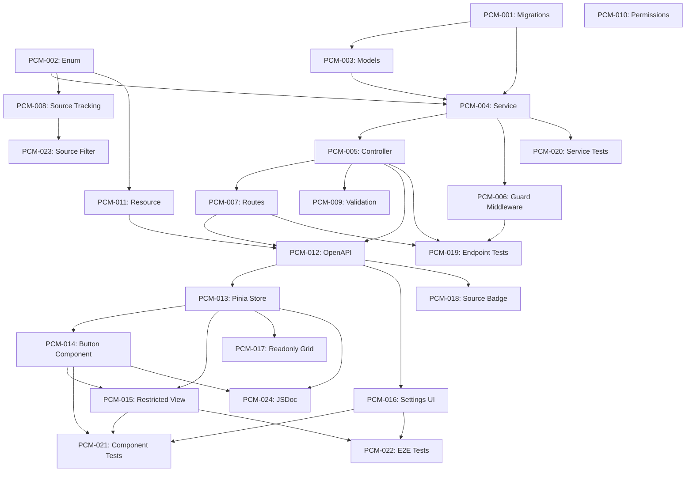

# PRD: Punch-Only / Time-Clock Mode

Generated: 2026-02-09
Version: 1.0
Feature Branch: `feature/punch-clock-mode`

---

## Table of Contents

1. [Source & Context](#1-source--context)
2. [Technical Interpretation](#2-technical-interpretation)
3. [Functional Specifications](#3-functional-specifications)
4. [Technical Requirements & Constraints](#4-technical-requirements--constraints)
5. [User Stories with Acceptance Criteria](#5-user-stories-with-acceptance-criteria)
6. [Task Breakdown Structure](#6-task-breakdown-structure)
7. [Dependencies & Integration Points](#7-dependencies--integration-points)
8. [Risk Assessment & Mitigation](#8-risk-assessment--mitigation)
9. [Testing & Validation Requirements](#9-testing--validation-requirements)
10. [Monitoring & Observability](#10-monitoring--observability)
11. [Success Metrics & Definition of Done](#11-success-metrics--definition-of-done)
12. [Technical Debt & Future Considerations](#12-technical-debt--future-considerations)
13. [Appendices](#13-appendices)

---

## 1. Source & Context

### 1.1 Problem Statement

Solidtime currently supports two primary time capture methods: a start/stop timer and manual time entry with full editing capabilities. It also has a planned Kiosk & Clock Mode feature (Feature 06) for shared-device clock-in via PIN/QR. However, there is no mode that restricts **individual users logged into their own accounts** to a simple punch-in/punch-out workflow without the ability to create arbitrary time entries, edit start/end times, or delete entries.

Many organizations -- particularly those in compliance-sensitive industries (healthcare, manufacturing, shift-based retail, government contracting) -- require a time-tracking mode where employees can **only** clock in and clock out. They must not be able to:
- Manually create backdated time entries
- Edit the start or end times of existing entries
- Delete time entries
- Use the weekly timesheet grid to enter hours retroactively

Without a punch-only mode:
- Organizations cannot enforce strict attendance capture policies through the application itself
- Admins must rely on manual auditing to detect retroactive time edits
- Solidtime cannot serve compliance-heavy industries that mandate tamper-proof time capture
- The platform falls behind Kimai (which offers a built-in "time-clock mode") and Clockify (which offers kiosk + restricted time entry modes)

### 1.2 Competitive Analysis

From **features.txt** Section 3.7 -- "Punch-only / time-clock mode":

> **What**: Restricts entries to clock-in/clock-out (no arbitrary edits).
> **Why important**: Compliance and simplified attendance capture.
> **User flow**:
> 1. Admin enables time-clock mode for a team.
> 2. User can only punch in/out.
> 3. Manager reviews time-clock entries in timesheets/reports.
>
> (Kimai "time-clock mode" described.)

Platforms offering related features:

| Platform | Punch/Clock Mode | Restriction Level | Admin Toggle |
|----------|:----------------:|:-----------------:|:------------:|
| Kimai | Yes | Per-user (role-based) | Yes |
| Clockify | Yes (Kiosk) | Per-device/team | Yes |
| Hubstaff | Yes | Per-team (attendance) | Yes |
| TimeCamp | Yes | Per-tier (time clock kiosk) | Yes |
| QuickBooks Time | Yes | GPS + clock-in | Yes |
| **Solidtime (Feature 06)** | Kiosk only | Per-device (PIN/QR) | Yes |
| **Solidtime (this PRD)** | **Yes** | **Per-member** | **Yes** |

### 1.3 Distinction from Feature 06 (Kiosk & Clock Mode)

Feature 06 (Kiosk) and Feature 12 (Punch-Clock Mode) serve different use cases:

| Aspect | Feature 06: Kiosk | Feature 12: Punch-Clock Mode |
|--------|:-----------------:|:----------------------------:|
| **Device** | Shared device (tablet/terminal) | User's own device/browser |
| **Authentication** | PIN or QR code on kiosk screen | Normal login (Passport/Jetstream) |
| **Scope** | Per-kiosk-device | Per-member within organization |
| **UI** | Dedicated full-screen kiosk page | Restricted standard UI |
| **User identity** | Identified via PIN/QR | Already authenticated |
| **Primary use case** | Factory floor, reception desk | Remote employee compliance |

Punch-Clock Mode restricts what a normally-authenticated user can do within the standard Solidtime interface. Kiosk Mode provides a separate, anonymous-start interface for shared devices.

### 1.4 Current System State

**Existing infrastructure on `main` (relevant to this feature):**

- `TimeEntry` model with `start`, `end`, `project_id`, `task_id`, `member_id`, `user_id`, `organization_id`, `billable`, `description`, `tags`
- `TimeEntryController` with full CRUD: `store`, `update`, `updateMultiple`, `destroy`, `destroyMultiple`
- `TimesheetController` with `weeks`, `index`, `updateCell`, `recentTasks` (from Feature 00)
- `Organization` model with org-level boolean settings (`employees_can_see_billable_rates`, `employees_can_manage_tasks`, `prevent_overlapping_time_entries`)
- `Member` model with `role` column (enum: `owner`, `admin`, `manager`, `employee`, `placeholder`)
- Existing permission system using `{entity}:{action}:{scope}` pattern via `CorePermissions`
- Role-based permissions: Owner/Admin/Manager get `time-entries:*:all` + `time-entries:*:own`; Employee gets only `time-entries:*:own`
- `Weekday` enum and `User.week_start`, `User.timezone` properties
- `UserTimeEntryController` with `myActive` (get currently running timer)

**Schema changes required:**
- New boolean column on `organizations` table: `punch_clock_mode_enabled`
- New boolean column on `members` table: `is_punch_clock_restricted`
- New `time_entry_source` column on `time_entries` table to distinguish punch-clock entries from manual entries

---

## 2. Technical Interpretation

### Business to Technical Translation

| Business Requirement | Technical Implementation |
|---------------------|-------------------------|
| Admin enables punch-clock mode for org | New `punch_clock_mode_enabled` boolean on `organizations` table |
| Admin restricts specific members | New `is_punch_clock_restricted` boolean on `members` table |
| User can only punch in/out | New `PunchClockController` with `punchIn` / `punchOut` endpoints |
| No manual time entry creation | Middleware/service guard on `TimeEntryController::store` for restricted members |
| No time entry editing | Middleware/service guard on `TimeEntryController::update`, `updateMultiple` for restricted members |
| No time entry deletion | Middleware/service guard on `TimeEntryController::destroy`, `destroyMultiple` for restricted members |
| No timesheet grid editing | Guard on `TimesheetController::updateCell` for restricted members |
| Manager reviews entries | Existing `time-entries:view:all` permission and reports unchanged |
| Track entry origin | New `time_entry_source` enum column (`manual`, `timer`, `punch_clock`, `kiosk`, `timesheet_grid`) |
| Simplified UI for restricted users | Conditional UI rendering: hide manual entry, show punch button |

### No-Change Boundary

This feature does **NOT**:
- Modify the Kiosk & Clock Mode (Feature 06) in any way
- Change the behavior of unrestricted users
- Alter the existing permission system for viewing time entries or reports
- Affect the dashboard, reporting, or export functionality
- Change how running timers work for non-restricted users
- Require any new third-party dependencies

### Change Boundary

This feature **DOES**:
- Add 3 new database columns across 2 migrations
- Add 1 new enum (`TimeEntrySource`)
- Add 1 new controller (`PunchClockController`) with 3 endpoints
- Add 1 new service (`PunchClockService`)
- Add enforcement guards on existing `TimeEntryController` and `TimesheetController`
- Add new organization settings UI for enabling punch-clock mode
- Add new member management UI for toggling punch-clock restriction
- Add a punch-in/punch-out frontend component for restricted users
- Add new permissions: `punch-clock:configure`, `punch-clock:view:all`

---

## 3. Functional Specifications

### 3.1 Core Requirements

#### REQ-001: Organization-Level Punch-Clock Mode Toggle
- **Description**: Admin/Owner can enable or disable punch-clock mode at the organization level. When disabled, no member can be set to punch-clock restricted, and the restriction has no effect.
- **Priority**: P0
- **Edge Cases**:
  - Disabling punch-clock mode while restricted members have active (running) punch-clock entries: the running entry continues; the member regains full editing capabilities for future actions
  - Re-enabling after disable: previously restricted members retain their `is_punch_clock_restricted` flag and become restricted again immediately
- **Error Scenarios**:
  - Non-admin attempting to toggle: return 403 Forbidden

#### REQ-002: Per-Member Punch-Clock Restriction
- **Description**: When punch-clock mode is enabled for the organization, Admin/Owner/Manager can mark individual members as punch-clock restricted. Restricted members can only use the punch-in/punch-out interface.
- **Priority**: P0
- **Edge Cases**:
  - Restricting a member who currently has a running timer: the running timer is treated as a punch-clock entry and can only be stopped (punched out), not edited
  - Restricting an Owner or Admin: not permitted (only `employee` and `manager` roles can be restricted; Owner/Admin roles are exempt)
  - Removing restriction from a member: they immediately regain full time entry capabilities
- **Error Scenarios**:
  - Attempting to restrict a member when org-level punch-clock mode is disabled: return 422 with descriptive error
  - Attempting to restrict an Owner/Admin: return 422

#### REQ-003: Punch-In Endpoint
- **Description**: Restricted members can punch in, which creates a new `TimeEntry` with `start = now()`, `end = null`, and `time_entry_source = punch_clock`.
- **Priority**: P0
- **Behavior**:
  - Only one active (running) entry allowed per member at a time (existing behavior)
  - Optionally associate a project and/or task at punch-in time
  - `description` defaults to empty string
  - `billable` inherits from project default (`is_billable`) if project is set
  - `tags` defaults to empty array
- **Edge Cases**:
  - Punching in while already punched in: return 409 Conflict with `time_entry_id` of the active entry
  - Punching in with a project the member has no access to: return 422

#### REQ-004: Punch-Out Endpoint
- **Description**: Restricted members can punch out, which sets `end = now()` on their currently running entry.
- **Priority**: P0
- **Behavior**:
  - Sets `end` to current timestamp in UTC
  - Recalculates `billable_rate` on save
  - Dispatches `RecalculateSpentTimeForProject` and `RecalculateSpentTimeForTask` jobs if applicable
- **Edge Cases**:
  - Punching out with no active entry: return 404 with descriptive message
  - Entry has been running for more than 24 hours: allow punch-out but flag for manager review via a `long_duration_flagged` attribute (future enhancement; for V1, allow punch-out without flagging)

#### REQ-005: Punch-Clock Status Endpoint
- **Description**: Returns the current punch status for the authenticated member -- whether they are currently punched in, the active time entry details, and their restriction status.
- **Priority**: P0
- **Response**: `{ is_restricted: bool, is_punched_in: bool, active_entry: TimeEntryResource | null }`

#### REQ-006: Time Entry Modification Guards
- **Description**: When a member is punch-clock restricted and the organization has punch-clock mode enabled, the following actions are blocked with a 403 response:
  - `POST /time-entries` (manual creation) -- **blocked**
  - `PUT /time-entries/{id}` (edit) -- **blocked for all entries**, including the active one
  - `PATCH /time-entries` (bulk update) -- **blocked**
  - `DELETE /time-entries/{id}` (delete) -- **blocked**
  - `DELETE /time-entries` (bulk delete) -- **blocked**
  - `PUT /timesheet/cell` (timesheet grid cell update) -- **blocked**
- **Priority**: P0
- **Edge Cases**:
  - Manager with `time-entries:update:all` editing a restricted member's entries: **allowed** (the restriction only applies to the restricted member themselves)
  - API token usage by a restricted member: same restrictions apply (enforcement is server-side, not UI-only)
- **Error Scenarios**:
  - Return a specific error code/type (`punch_clock_restricted`) so the frontend can display an appropriate message

#### REQ-007: Restricted UI Mode
- **Description**: When a member is punch-clock restricted, the frontend adapts:
  - The Time page shows a large, centered punch-in/punch-out button instead of the standard timer and manual entry form
  - The timesheet grid (if Feature 00 is present) displays in read-only mode
  - The "New Time Entry" button and manual entry form are hidden
  - The existing time entry list remains visible in read-only mode (no edit/delete actions)
  - Dashboard and reports remain fully accessible (read-only data)
- **Priority**: P0
- **Edge Cases**:
  - Page load while punched in: show punch-out button with running duration
  - Page load while punched out: show punch-in button with project/task selector

#### REQ-008: Organization Settings UI
- **Description**: Add a new section to the organization settings page for punch-clock mode configuration.
- **Priority**: P0
- **UI Elements**:
  - Toggle switch: "Enable Punch-Clock Mode"
  - Description text explaining the feature
  - When enabled, show a list of members with toggle switches for individual restriction
  - Only `employee` and `manager` roles shown in the member restriction list (Owner/Admin excluded)

#### REQ-009: Time Entry Source Tracking
- **Description**: Track how each time entry was created by adding a `time_entry_source` column.
- **Priority**: P1
- **Values**: `manual`, `timer`, `punch_clock`, `kiosk`, `timesheet_grid`
- **Behavior**:
  - All new time entries from `TimeEntryController::store` set `source = manual` (or `timer` if `end` is null)
  - All entries from `TimesheetController::updateCell` set `source = timesheet_grid`
  - All entries from `PunchClockController::punchIn` set `source = punch_clock`
  - Future Feature 06 entries will set `source = kiosk`
  - Existing entries (created before migration) get `source = null` (nullable column)
  - Source is visible in time entry detail views and filterable in reports
- **Edge Cases**:
  - Migration must be backward-compatible: existing entries retain `null` source

### 3.2 User Workflows

```
Admin enables punch-clock mode
    -> Navigate to Organization Settings
    -> Toggle "Enable Punch-Clock Mode" ON
    -> API: PUT /organizations/{org} with { punch_clock_mode_enabled: true }
    -> Success: toggle turns green, member restriction section appears

Admin restricts a member
    -> In the punch-clock settings section, find member in list
    -> Toggle restriction ON for that member
    -> API: PUT /members/{member} with { is_punch_clock_restricted: true }
    -> Success: member's next login shows restricted UI

Restricted member punches in
    -> Opens Solidtime (Time page or Dashboard)
    -> Sees large "Punch In" button (optionally with project/task selector)
    -> Clicks "Punch In"
    -> API: POST /punch-clock/in with optional { project_id, task_id }
    -> Success: button changes to "Punch Out" with running timer
    -> Time entry created with start = now, end = null, source = punch_clock

Restricted member punches out
    -> Sees "Punch Out" button with running duration
    -> Clicks "Punch Out"
    -> API: POST /punch-clock/out
    -> Success: button changes back to "Punch In"
    -> Duration shown briefly, then resets
    -> Time entry updated with end = now

Restricted member attempts manual entry
    -> Manual entry UI elements are hidden
    -> If API is called directly: POST /time-entries returns 403 with error type punch_clock_restricted
    -> Timesheet grid cells are non-editable

Manager reviews restricted member's entries
    -> Opens Reports or Time Entries with member filter
    -> Sees all entries including punch-clock entries
    -> Can filter by source = punch_clock
    -> Can edit or delete entries (manager has time-entries:update:all)
```

### 3.3 Business Rules

#### Restriction Enforcement
1. A member is considered "punch-clock restricted" when ALL of the following are true:
   - `organization.punch_clock_mode_enabled = true`
   - `member.is_punch_clock_restricted = true`
   - `member.role` is NOT `owner` or `admin` (Owner/Admin are never restricted regardless of flag)
2. Restriction is enforced server-side on all write endpoints (not just UI)
3. Read endpoints are never restricted (restricted members can still view their entries, reports, dashboards)

#### Punch-In Creation
1. Punch-in creates a `TimeEntry` with:
   - `start` = `Carbon::now()` (UTC)
   - `end` = `null` (running)
   - `time_entry_source` = `punch_clock`
   - `project_id` = from request (optional)
   - `task_id` = from request (optional, requires `project_id`)
   - `billable` = inherited from project `is_billable` (or `false` if no project)
   - `description` = empty string
   - `tags` = empty array
   - `member_id` = authenticated member's ID
   - `user_id` = authenticated user's ID
   - `organization_id` = from route binding
   - `client_id` = from project's client (computed)
   - `billable_rate` = computed via `BillableRateService`
2. Reject if member already has a running entry (`end IS NULL`)

#### Punch-Out Update
1. Find the member's active entry (`end IS NULL`)
2. Set `end` = `Carbon::now()` (UTC)
3. Recompute `billable_rate`
4. Dispatch `RecalculateSpentTimeForProject` / `RecalculateSpentTimeForTask` if applicable
5. Reject if no active entry exists

#### Overlap Prevention
1. If `organization.prevent_overlapping_time_entries` is `true`, punch-in must check for overlapping entries using the same logic as `TimeEntryController::assertNoOverlap`
2. Since punch-in always creates an open-ended entry (`end = null`), it only needs to check that `start` does not fall within an existing entry's `start..end` range

---

## 4. Technical Requirements & Constraints

### 4.1 System Architecture

```
+---------------------------------------------------------------------+
|                        Frontend (Vue.js 3)                           |
+---------------------------------------------------------------------+
|  +------------------+  +-------------------+  +-------------------+  |
|  | Time.vue (Page)  |  | OrgSettings.vue   |  | MemberList.vue    |  |
|  | - Conditional:   |  | (Existing page)   |  | (Existing comp.)  |  |
|  |   Normal timer   |  | - New section:    |  | - New column:     |  |
|  |   OR Punch UI    |  |   Punch-Clock     |  |   Punch-Clock     |  |
|  |                  |  |   Mode toggle     |  |   restriction     |  |
|  +--------+---------+  +-------------------+  +-------------------+  |
|           |                                                          |
|           v                                                          |
|  +----------------------------------------------+                   |
|  | usePunchClockStore.ts (Pinia)                |                   |
|  | - isPunchClockRestricted: boolean            |                   |
|  | - isPunchedIn: boolean                       |                   |
|  | - activeEntry: TimeEntry | null              |                   |
|  | - punchIn(projectId?, taskId?) / punchOut()  |                   |
|  | - fetchStatus()                              |                   |
|  +---------------------+------------------------+                   |
|                        | HTTP/JSON                                   |
+------------------------+---------------------------------------------+
                         v
+---------------------------------------------------------------------+
|                        Backend (Laravel 11)                          |
+---------------------------------------------------------------------+
|  +--------------------------------------+                            |
|  | PunchClockController.php             |                            |
|  | - punchIn()   POST /punch-clock/in   |                            |
|  | - punchOut()  POST /punch-clock/out  |                            |
|  | - status()    GET  /punch-clock      |                            |
|  +--------------------------------------+                            |
|                   |                                                  |
|                   v                                                  |
|  +--------------------------------------+                            |
|  | PunchClockService.php                |                            |
|  | - punchIn()                          |                            |
|  | - punchOut()                         |                            |
|  | - getStatus()                        |                            |
|  | - isRestricted(member, org)          |                            |
|  +--------------------------------------+                            |
|                   |                                                  |
|  +--------------------------------------+                            |
|  | PunchClockGuard.php (Middleware)      |                            |
|  | - Applied to TimeEntry write routes  |                            |
|  | - Applied to Timesheet write routes  |                            |
|  | - Returns 403 if member restricted   |                            |
|  +--------------------------------------+                            |
|                   |                                                  |
|                   v                                                  |
|  +--------------------------------------+                            |
|  | TimeEntry Model (existing)           |                            |
|  | + time_entry_source column (new)     |                            |
|  +--------------------------------------+                            |
+---------------------------------------------------------------------+
```

### 4.2 Data Models

#### Database Migrations

**Migration 1: `2026_03_12_000001_add_punch_clock_mode_to_organizations_table.php`**

```sql
ALTER TABLE organizations
    ADD COLUMN punch_clock_mode_enabled BOOLEAN NOT NULL DEFAULT FALSE;
```

**Migration 2: `2026_03_12_000002_add_punch_clock_restriction_to_members_table.php`**

```sql
ALTER TABLE members
    ADD COLUMN is_punch_clock_restricted BOOLEAN NOT NULL DEFAULT FALSE;
```

**Migration 3: `2026_03_12_000003_add_source_to_time_entries_table.php`**

```sql
ALTER TABLE time_entries
    ADD COLUMN time_entry_source VARCHAR(20) NULL;

CREATE INDEX idx_time_entries_source ON time_entries(time_entry_source);
```

#### Backend Enum

```php
// app/Enums/TimeEntrySource.php
enum TimeEntrySource: string
{
    case Manual = 'manual';
    case Timer = 'timer';
    case PunchClock = 'punch_clock';
    case Kiosk = 'kiosk';
    case TimesheetGrid = 'timesheet_grid';
}
```

#### Frontend Types (TypeScript)

```typescript
// resources/js/types/punch-clock.d.ts

type TimeEntrySource = 'manual' | 'timer' | 'punch_clock' | 'kiosk' | 'timesheet_grid';

interface PunchClockStatus {
    is_restricted: boolean;
    is_punched_in: boolean;
    active_entry: TimeEntryResource | null;
}

interface PunchInRequest {
    project_id?: string | null;
    task_id?: string | null;
}

interface PunchClockOrganizationSettings {
    punch_clock_mode_enabled: boolean;
}

interface PunchClockMemberSettings {
    is_punch_clock_restricted: boolean;
}
```

#### Model Updates

**Organization model** -- add to `$casts`:
```php
'punch_clock_mode_enabled' => 'boolean',
```

**Member model** -- add to `$casts`:
```php
'is_punch_clock_restricted' => 'boolean',
```

**TimeEntry model** -- add to `$casts` and `SELECT_COLUMNS`:
```php
'time_entry_source' => TimeEntrySource::class,
```

### 4.3 API Contracts

#### POST /api/v1/organizations/{organization}/punch-clock/in
Punch in (create a running time entry).

```yaml
Parameters:
  organization: string (path, required)
Request Body:
  project_id: string|null (optional)
  task_id: string|null (optional, requires project_id)
Request Headers:
  Authorization: Bearer {token}
Response 201:
  data: TimeEntryResource
Response 403:
  error:
    type: "not_punch_clock_restricted"
    message: "This endpoint is only available for punch-clock restricted members"
Response 409:
  error:
    type: "already_punched_in"
    message: "Member already has an active time entry"
    time_entry_id: string
Response 422:
  error:
    type: "validation_error"
    message: string
Middleware: check-organization-blocked
Permission: time-entries:create:own (existing)
Additional Guard: Member must be punch-clock restricted
```

#### POST /api/v1/organizations/{organization}/punch-clock/out
Punch out (close the running time entry).

```yaml
Parameters:
  organization: string (path, required)
Request Headers:
  Authorization: Bearer {token}
Response 200:
  data: TimeEntryResource
Response 403:
  error:
    type: "not_punch_clock_restricted"
    message: "This endpoint is only available for punch-clock restricted members"
Response 404:
  error:
    type: "not_punched_in"
    message: "No active time entry found"
Middleware: check-organization-blocked
Permission: time-entries:update:own (existing)
Additional Guard: Member must be punch-clock restricted
```

#### GET /api/v1/organizations/{organization}/punch-clock
Get current punch-clock status for the authenticated member.

```yaml
Parameters:
  organization: string (path, required)
Request Headers:
  Authorization: Bearer {token}
Response 200:
  data: {
    is_restricted: boolean,
    is_punched_in: boolean,
    active_entry: TimeEntryResource | null
  }
Permission: time-entries:view:own (existing)
```

#### PUT /api/v1/organizations/{organization} (existing, modified)
Updated to accept `punch_clock_mode_enabled`.

```yaml
Additional Request Body Fields:
  punch_clock_mode_enabled: boolean (optional)
Permission: organizations:update (existing)
```

#### PUT /api/v1/organizations/{organization}/members/{member} (existing, modified)
Updated to accept `is_punch_clock_restricted`.

```yaml
Additional Request Body Fields:
  is_punch_clock_restricted: boolean (optional)
Validation:
  - Organization must have punch_clock_mode_enabled = true
  - Member role must NOT be 'owner' or 'admin'
Permission: members:update (existing)
```

### 4.4 Performance Requirements

| Metric | Target | Measurement |
|--------|--------|-------------|
| Punch-in response | < 200ms | API response time |
| Punch-out response | < 200ms | API response time |
| Status check | < 100ms | API response time |
| Guard middleware overhead | < 5ms | Added latency on existing endpoints |
| UI mode detection | < 50ms | Time to determine restricted state on page load |

### 4.5 Security Requirements

1. **Server-Side Enforcement**: All restrictions are enforced at the API layer, not just UI. A restricted member cannot bypass restrictions using the API directly or via third-party integrations.
2. **Role Protection**: Owner and Admin roles can never be punch-clock restricted, regardless of the database flag.
3. **Organization Scoping**: All queries scoped to the current organization via route model binding.
4. **Write Protection**: Punch-in and punch-out endpoints use `check-organization-blocked` middleware.
5. **Audit Logging**: All time entry mutations (create on punch-in, update on punch-out) are logged via the existing `CustomAuditable` trait.
6. **No Escalation Path**: A restricted member cannot modify their own restriction flag (only Admin/Owner/Manager with `members:update` permission can).

---

## 5. User Stories with Acceptance Criteria

### USR-001: Enable Punch-Clock Mode for Organization
**As an** organization admin
**I want to** enable punch-clock mode for my organization
**So that** I can restrict certain members to clock-in/clock-out only

**Priority**: P0 | **Effort**: 3 SP | **Sprint**: 1

**Acceptance Criteria**:
- [ ] Organization settings page has a "Punch-Clock Mode" section
- [ ] Toggle switch enables/disables punch-clock mode
- [ ] When enabled, a member restriction panel appears below the toggle
- [ ] When disabled, the restriction panel is hidden
- [ ] API validates that only users with `organizations:update` permission can toggle
- [ ] Toggle state persists across page reloads
- [ ] Enabling/disabling does not affect existing time entries

### USR-002: Restrict a Member to Punch-Clock Only
**As an** organization admin
**I want to** restrict specific members to punch-clock mode
**So that** they can only clock in and out without manual time entry

**Priority**: P0 | **Effort**: 3 SP | **Sprint**: 1

**Acceptance Criteria**:
- [ ] Member restriction list shows only `employee` and `manager` role members
- [ ] Each member has a toggle to enable/disable punch-clock restriction
- [ ] Owner and Admin roles are not shown in the list (cannot be restricted)
- [ ] Toggling restriction calls `PUT /members/{member}` with `is_punch_clock_restricted`
- [ ] Cannot restrict a member when organization punch-clock mode is disabled (toggle disabled with tooltip)
- [ ] Changes take effect immediately (no page reload required for the restricted member's session)

### USR-003: Punch In
**As a** punch-clock restricted member
**I want to** punch in when I start working
**So that** my work hours are accurately recorded

**Priority**: P0 | **Effort**: 5 SP | **Sprint**: 2

**Acceptance Criteria**:
- [ ] Time page shows a large, prominent "Punch In" button
- [ ] Optional project/task selector available before punching in
- [ ] Clicking "Punch In" creates a new time entry with `start = now`, `end = null`
- [ ] Entry has `time_entry_source = punch_clock`
- [ ] After punch-in, button changes to "Punch Out" with running duration display
- [ ] Cannot punch in if already punched in (button disabled, active entry shown)
- [ ] Error toast shown if API call fails
- [ ] Works correctly across different timezones

### USR-004: Punch Out
**As a** punch-clock restricted member
**I want to** punch out when I stop working
**So that** my work session is properly closed

**Priority**: P0 | **Effort**: 3 SP | **Sprint**: 2

**Acceptance Criteria**:
- [ ] "Punch Out" button visible when currently punched in
- [ ] Running duration displayed on the button or nearby
- [ ] Clicking "Punch Out" sets `end = now` on the active entry
- [ ] After punch-out, button returns to "Punch In" state
- [ ] Completed entry duration briefly displayed as confirmation
- [ ] Project and task info shown on the active entry display
- [ ] Error toast shown if API call fails

### USR-005: View Time Entries as Restricted Member
**As a** punch-clock restricted member
**I want to** see my completed time entries
**So that** I can verify my recorded hours

**Priority**: P0 | **Effort**: 2 SP | **Sprint**: 2

**Acceptance Criteria**:
- [ ] Time entry list is visible below the punch button area
- [ ] Entries shown in descending order (most recent first)
- [ ] Each entry shows: date, project, task, start time, end time, duration
- [ ] No edit or delete buttons on entries
- [ ] Timesheet grid (if visible) is in read-only mode
- [ ] Dashboard widgets display normally (read-only data)

### USR-006: Blocked Action Feedback
**As a** punch-clock restricted member
**I want to** understand why I cannot edit time entries
**So that** I know my organization has enabled this restriction

**Priority**: P1 | **Effort**: 2 SP | **Sprint**: 2

**Acceptance Criteria**:
- [ ] A banner or info message displayed on the Time page explaining the restriction
- [ ] Message text: "Your organization has restricted your account to punch-in/punch-out time tracking. Contact your manager if you need to modify a time entry."
- [ ] If member attempts to access a direct URL for editing (e.g., via browser history), they see the restricted view
- [ ] API error responses include `error.type = punch_clock_restricted` for programmatic detection

### USR-007: Manager Manages Restricted Member's Entries
**As a** manager
**I want to** edit or delete punch-clock entries for a restricted member
**So that** I can correct errors on their behalf

**Priority**: P0 | **Effort**: 2 SP | **Sprint**: 2

**Acceptance Criteria**:
- [ ] Managers with `time-entries:update:all` can edit restricted members' entries normally
- [ ] Managers with `time-entries:delete:all` can delete restricted members' entries normally
- [ ] Entries show a "Punch Clock" badge/icon indicating the source
- [ ] Edited entries retain `time_entry_source = punch_clock` (source is immutable after creation)
- [ ] Audit trail reflects the manager's edits

### USR-008: Filter Entries by Source
**As a** manager
**I want to** filter time entries by their source (punch-clock, manual, timer, etc.)
**So that** I can review how time was captured

**Priority**: P1 | **Effort**: 3 SP | **Sprint**: 3

**Acceptance Criteria**:
- [ ] Time entry list and report filters include a "Source" filter
- [ ] Filter options: All, Manual, Timer, Punch Clock, Timesheet Grid
- [ ] API `GET /time-entries` accepts `source` query parameter
- [ ] Existing entries with `null` source show as "Legacy" or are included in "All"

---

## 6. Task Breakdown Structure

See `task_assignments_20260209.md` for the full task table.

### Phase 1: Backend Foundation (Sprint 1)

#### PCM-001: Database Migrations
**Type**: Backend
**Effort**: 4h
**Dependencies**: None

**Implementation Details**:

Files to create:
- `database/migrations/2026_03_12_000001_add_punch_clock_mode_to_organizations_table.php`
- `database/migrations/2026_03_12_000002_add_punch_clock_restriction_to_members_table.php`
- `database/migrations/2026_03_12_000003_add_source_to_time_entries_table.php`

```php
// Migration 1: Organizations
Schema::table('organizations', function (Blueprint $table): void {
    $table->boolean('punch_clock_mode_enabled')->default(false);
});

// Migration 2: Members
Schema::table('members', function (Blueprint $table): void {
    $table->boolean('is_punch_clock_restricted')->default(false);
});

// Migration 3: Time Entries
Schema::table('time_entries', function (Blueprint $table): void {
    $table->string('time_entry_source', 20)->nullable();
    $table->index('time_entry_source');
});
```

**Acceptance Criteria**:
- [ ] Migrations run without errors on fresh and existing databases
- [ ] Rollback works correctly
- [ ] Existing data is not affected
- [ ] All new columns have correct defaults

---

#### PCM-002: TimeEntrySource Enum
**Type**: Backend
**Effort**: 2h
**Dependencies**: None

**Implementation Details**:

Files to create:
- `app/Enums/TimeEntrySource.php`

Files to modify:
- `app/Models/TimeEntry.php` (add to `$casts` and `SELECT_COLUMNS`)

```php
// app/Enums/TimeEntrySource.php
<?php

declare(strict_types=1);

namespace App\Enums;

enum TimeEntrySource: string
{
    case Manual = 'manual';
    case Timer = 'timer';
    case PunchClock = 'punch_clock';
    case Kiosk = 'kiosk';
    case TimesheetGrid = 'timesheet_grid';
}
```

**Acceptance Criteria**:
- [ ] Enum class created with all 5 values
- [ ] TimeEntry model casts `time_entry_source` to the enum
- [ ] `time_entry_source` added to `SELECT_COLUMNS`
- [ ] Existing entries with `null` source do not cause errors

---

#### PCM-003: Update Organization and Member Models
**Type**: Backend
**Effort**: 2h
**Dependencies**: PCM-001

**Implementation Details**:

Files to modify:
- `app/Models/Organization.php` (add `punch_clock_mode_enabled` to `$casts`)
- `app/Models/Member.php` (add `is_punch_clock_restricted` to `$casts`)

**Acceptance Criteria**:
- [ ] `Organization::$casts` includes `'punch_clock_mode_enabled' => 'boolean'`
- [ ] `Member::$casts` includes `'is_punch_clock_restricted' => 'boolean'`
- [ ] Organization factory updated to include `punch_clock_mode_enabled`
- [ ] Member factory updated to include `is_punch_clock_restricted`

---

#### PCM-004: PunchClockService
**Type**: Backend
**Effort**: 8h
**Dependencies**: PCM-001, PCM-002, PCM-003

**Implementation Details**:

Files to create:
- `app/Service/PunchClockService.php`

```php
class PunchClockService
{
    /**
     * Determine if a member is punch-clock restricted.
     */
    public function isRestricted(Member $member, Organization $organization): bool
    {
        // Must have org-level enabled AND member-level flag AND role is not Owner/Admin
    }

    /**
     * Punch in: create a running time entry.
     */
    public function punchIn(
        Organization $organization,
        Member $member,
        ?string $projectId,
        ?string $taskId
    ): TimeEntry {
        // 1. Verify no active entry exists
        // 2. Check overlap if org has prevent_overlapping_time_entries
        // 3. Create TimeEntry with source = punch_clock
    }

    /**
     * Punch out: close the active time entry.
     */
    public function punchOut(Organization $organization, Member $member): TimeEntry
    {
        // 1. Find active entry (end IS NULL)
        // 2. Set end = now
        // 3. Recompute billable_rate
        // 4. Dispatch recalculation jobs
    }

    /**
     * Get current punch-clock status for a member.
     */
    public function getStatus(Organization $organization, Member $member): array
    {
        // Return { is_restricted, is_punched_in, active_entry }
    }
}
```

**Acceptance Criteria**:
- [ ] `isRestricted()` returns `true` only when all conditions are met
- [ ] `isRestricted()` returns `false` for Owner and Admin roles regardless of flags
- [ ] `punchIn()` creates a correct TimeEntry with source = punch_clock
- [ ] `punchIn()` throws if member already has active entry
- [ ] `punchIn()` respects overlap prevention setting
- [ ] `punchOut()` correctly closes the active entry
- [ ] `punchOut()` throws if no active entry exists
- [ ] `punchOut()` dispatches recalculation jobs
- [ ] `getStatus()` returns accurate restriction and punch state

---

#### PCM-005: PunchClockController
**Type**: Backend
**Effort**: 6h
**Dependencies**: PCM-004

**Implementation Details**:

Files to create:
- `app/Http/Controllers/Api/V1/PunchClockController.php`
- `app/Http/Requests/V1/PunchClock/PunchInRequest.php`

```php
class PunchClockController extends Controller
{
    public function punchIn(
        Organization $organization,
        PunchInRequest $request,
        PunchClockService $punchClockService
    ): JsonResource {
        $this->checkPermission($organization, 'time-entries:create:own');
        $member = $this->member($organization);
        // Verify member is restricted
        // Call service
    }

    public function punchOut(
        Organization $organization,
        PunchClockService $punchClockService
    ): JsonResource {
        $this->checkPermission($organization, 'time-entries:update:own');
        $member = $this->member($organization);
        // Verify member is restricted
        // Call service
    }

    public function status(
        Organization $organization,
        PunchClockService $punchClockService
    ): JsonResponse {
        $this->checkPermission($organization, 'time-entries:view:own');
        $member = $this->member($organization);
        // Return status
    }
}
```

**Acceptance Criteria**:
- [ ] Three endpoints: `punchIn`, `punchOut`, `status`
- [ ] Proper permission checks on each endpoint
- [ ] Returns correct HTTP status codes (201 for punch-in, 200 for punch-out and status)
- [ ] Returns `TimeEntryResource` for punch-in and punch-out
- [ ] Returns structured status response for status endpoint
- [ ] Descriptive error responses for edge cases (409, 404, 403)

---

#### PCM-006: Punch-Clock Guard Middleware
**Type**: Backend
**Effort**: 6h
**Dependencies**: PCM-004

**Implementation Details**:

Files to create:
- `app/Http/Middleware/PunchClockGuard.php`

Files to modify:
- `app/Http/Kernel.php` (register middleware alias)
- `routes/api.php` (apply to existing write routes)

```php
class PunchClockGuard
{
    public function handle(Request $request, Closure $next): Response
    {
        $organization = $request->route('organization');
        $member = // resolve current member

        if ($this->punchClockService->isRestricted($member, $organization)) {
            return response()->json([
                'error' => [
                    'type' => 'punch_clock_restricted',
                    'message' => 'Time entry modification is not permitted in punch-clock mode.',
                ],
            ], 403);
        }

        return $next($request);
    }
}
```

Routes to apply middleware:
- `POST /time-entries` (`TimeEntryController::store`)
- `PUT /time-entries/{timeEntry}` (`TimeEntryController::update`)
- `PATCH /time-entries` (`TimeEntryController::updateMultiple`)
- `DELETE /time-entries/{timeEntry}` (`TimeEntryController::destroy`)
- `DELETE /time-entries` (`TimeEntryController::destroyMultiple`)
- `PUT /timesheet/cell` (`TimesheetController::updateCell`)

**Acceptance Criteria**:
- [ ] Middleware correctly identifies restricted members
- [ ] Returns 403 with `punch_clock_restricted` error type for restricted members
- [ ] Does NOT block unrestricted members
- [ ] Does NOT block managers editing restricted members' entries (check: the acting user, not the entry owner)
- [ ] Minimal performance overhead (< 5ms)
- [ ] Applied to all 6 relevant routes

---

#### PCM-007: Register API Routes
**Type**: Backend
**Effort**: 2h
**Dependencies**: PCM-005

**Implementation Details**:

Files to modify:
- `routes/api.php`

```php
// Punch-clock routes
Route::name('punch-clock.')->prefix('/organizations/{organization}')->group(static function (): void {
    Route::post('/punch-clock/in', [PunchClockController::class, 'punchIn'])
        ->name('in')
        ->middleware('check-organization-blocked');
    Route::post('/punch-clock/out', [PunchClockController::class, 'punchOut'])
        ->name('out')
        ->middleware('check-organization-blocked');
    Route::get('/punch-clock', [PunchClockController::class, 'status'])
        ->name('status');
});
```

**Acceptance Criteria**:
- [ ] Three routes registered with correct names
- [ ] Write routes include `check-organization-blocked` middleware
- [ ] Routes are within the `auth:api` middleware group
- [ ] Route names follow pattern: `api.v1.punch-clock.{action}`

---

#### PCM-008: Update Existing Controllers for Source Tracking
**Type**: Backend
**Effort**: 4h
**Dependencies**: PCM-002

**Implementation Details**:

Files to modify:
- `app/Http/Controllers/Api/V1/TimeEntryController.php` (set `time_entry_source` in `store`)
- `app/Service/TimesheetService.php` (set `time_entry_source` in `updateCell`)

In `TimeEntryController::store`:
```php
$timeEntry->time_entry_source = $request->input('end') === null
    ? TimeEntrySource::Timer
    : TimeEntrySource::Manual;
```

In `TimesheetService::updateCell` (new entry creation):
```php
$timeEntry->time_entry_source = TimeEntrySource::TimesheetGrid;
```

**Acceptance Criteria**:
- [ ] New entries via `TimeEntryController::store` get correct source (timer vs manual)
- [ ] New entries via `TimesheetService::updateCell` get `timesheet_grid` source
- [ ] Existing entries not affected (source remains `null`)
- [ ] Source is included in `TimeEntryResource` response

---

#### PCM-009: Request Validation Classes
**Type**: Backend
**Effort**: 3h
**Dependencies**: PCM-005

**Implementation Details**:

Files to create:
- `app/Http/Requests/V1/PunchClock/PunchInRequest.php`

```php
class PunchInRequest extends BaseFormRequest
{
    public function rules(): array
    {
        return [
            'project_id' => [
                'nullable',
                'string',
                new ExistsEloquent(Project::class, null, function (Builder $builder): Builder {
                    return $builder->whereBelongsTo($this->organization, 'organization');
                }),
            ],
            'task_id' => [
                'nullable',
                'string',
                'required_with:project_id',
                // ... validate task belongs to project
            ],
        ];
    }
}
```

Files to modify:
- `app/Http/Requests/V1/Organization/OrganizationUpdateRequest.php` (add `punch_clock_mode_enabled` rule)
- `app/Http/Requests/V1/Member/MemberUpdateRequest.php` (add `is_punch_clock_restricted` rule with validation)

**Acceptance Criteria**:
- [ ] `PunchInRequest` validates `project_id` and `task_id` correctly
- [ ] `task_id` requires `project_id` to be present
- [ ] Organization update request accepts `punch_clock_mode_enabled` boolean
- [ ] Member update request accepts `is_punch_clock_restricted` boolean
- [ ] Member restriction validates: org must have punch-clock enabled, role must not be owner/admin

---

#### PCM-010: Punch-Clock Permissions
**Type**: Backend
**Effort**: 2h
**Dependencies**: None

**Implementation Details**:

Files to create:
- `app/Permissions/PunchClockPermissions.php`

Files to modify:
- `app/Providers/JetstreamServiceProvider.php` or the permissions registration boot

```php
class PunchClockPermissions
{
    public static function register(): void
    {
        // Add punch-clock:configure to Owner, Admin
        // Add punch-clock:view:all to Owner, Admin, Manager
        // These are additive permissions on top of existing role definitions
    }
}
```

New permissions:
- `punch-clock:configure` -- toggle org-level mode, restrict members (Owner, Admin)
- `punch-clock:view:all` -- view all members' restriction status (Owner, Admin, Manager)

**Acceptance Criteria**:
- [ ] `PunchClockPermissions` class follows the modular pattern from SF-08
- [ ] Owner and Admin get `punch-clock:configure`
- [ ] Owner, Admin, and Manager get `punch-clock:view:all`
- [ ] Permissions registered via `PunchClockPermissions::register()` in service provider

---

#### PCM-011: Update TimeEntryResource
**Type**: Backend
**Effort**: 2h
**Dependencies**: PCM-002

**Implementation Details**:

Files to modify:
- `app/Http/Resources/V1/TimeEntry/TimeEntryResource.php`

Add `time_entry_source` to the resource output.

**Acceptance Criteria**:
- [ ] `TimeEntryResource` includes `time_entry_source` field
- [ ] Field is nullable (existing entries may have `null`)
- [ ] OpenAPI spec updated to document the new field

---

#### PCM-012: Update OpenAPI Spec
**Type**: Backend
**Effort**: 4h
**Dependencies**: PCM-005, PCM-007, PCM-011

**Implementation Details**:

Files to modify:
- `openapi.json` (add punch-clock endpoints, update TimeEntry schema)

Files to regenerate:
- `resources/js/packages/api/src/openapi.json.client.ts`

**Acceptance Criteria**:
- [ ] Three new endpoints documented in OpenAPI spec
- [ ] `TimeEntry` schema updated with `time_entry_source` field
- [ ] Organization schema updated with `punch_clock_mode_enabled`
- [ ] Member schema updated with `is_punch_clock_restricted`
- [ ] TypeScript client regenerated
- [ ] All types compile without errors

---

### Phase 2: Frontend Implementation (Sprint 2)

#### PCM-013: Punch-Clock Pinia Store
**Type**: Frontend
**Effort**: 6h
**Dependencies**: PCM-012

**Implementation Details**:

Files to create:
- `resources/js/utils/usePunchClock.ts`
- `resources/js/types/punch-clock.d.ts`

```typescript
export const usePunchClockStore = defineStore('punchClock', () => {
    const isRestricted = ref(false);
    const isPunchedIn = ref(false);
    const activeEntry = ref<TimeEntryResource | null>(null);
    const isLoading = ref(false);
    const error = ref<string | null>(null);

    async function fetchStatus() { /* GET /punch-clock */ }
    async function punchIn(projectId?: string, taskId?: string) { /* POST /punch-clock/in */ }
    async function punchOut() { /* POST /punch-clock/out */ }

    return {
        isRestricted,
        isPunchedIn,
        activeEntry,
        isLoading,
        error,
        fetchStatus,
        punchIn,
        punchOut,
    };
});
```

**Acceptance Criteria**:
- [ ] Store exposes reactive state: `isRestricted`, `isPunchedIn`, `activeEntry`
- [ ] `fetchStatus()` calls `GET /punch-clock` and updates state
- [ ] `punchIn()` calls `POST /punch-clock/in` and updates state on success
- [ ] `punchOut()` calls `POST /punch-clock/out` and updates state on success
- [ ] Error handling with `error` ref
- [ ] Loading state tracked with `isLoading` ref

---

#### PCM-014: PunchClockButton Component
**Type**: Frontend
**Effort**: 8h
**Dependencies**: PCM-013

**Implementation Details**:

Files to create:
- `resources/js/packages/ui/src/PunchClock/PunchClockButton.vue`
- `resources/js/packages/ui/src/PunchClock/PunchClockDuration.vue`
- `resources/js/packages/ui/src/PunchClock/PunchClockProjectSelector.vue`

```
PunchClockButton.vue
  - Large, centered button
  - Two states: "Punch In" (green) / "Punch Out" (red)
  - When punched in: shows running duration via PunchClockDuration
  - Before punch-in: optional PunchClockProjectSelector
  - Loading spinner during API call
  - Error toast on failure

PunchClockDuration.vue
  - Real-time running clock (updates every second via setInterval)
  - Shows HH:MM:SS format
  - Shows project/task name if set

PunchClockProjectSelector.vue
  - Dropdown with recent projects/tasks
  - Uses existing project/task API
  - Optional (can punch in without project)
```

**Acceptance Criteria**:
- [ ] Button renders in two distinct states (in/out)
- [ ] Running duration updates in real-time
- [ ] Project/task selector works with existing project data
- [ ] Loading state shown during API calls
- [ ] Error toast on failure
- [ ] Keyboard accessible (Enter/Space to punch in/out)
- [ ] ARIA attributes for screen reader support

---

#### PCM-015: Restricted Time Page View
**Type**: Frontend
**Effort**: 6h
**Dependencies**: PCM-013, PCM-014

**Implementation Details**:

Files to modify:
- `resources/js/Pages/Time.vue` (or equivalent time tracking page)

Add conditional rendering:
```vue
<template>
  <!-- Check if user is punch-clock restricted -->
  <PunchClockRestrictedView v-if="punchClockStore.isRestricted" />
  <NormalTimeTrackingView v-else />
</template>
```

Files to create:
- `resources/js/packages/ui/src/PunchClock/PunchClockRestrictedView.vue`

Components:
- Info banner explaining the restriction
- PunchClockButton (centered, prominent)
- Read-only time entry list (recent entries, no edit/delete actions)

**Acceptance Criteria**:
- [ ] Restricted members see PunchClockRestrictedView instead of normal timer
- [ ] Info banner explains the restriction with clear messaging
- [ ] PunchClockButton is centered and prominent
- [ ] Time entry list shows completed entries in read-only mode
- [ ] No edit/delete buttons or links on entries
- [ ] Manual entry form is completely hidden
- [ ] Non-restricted members see the normal Time page

---

#### PCM-016: Organization Settings UI for Punch-Clock
**Type**: Frontend
**Effort**: 6h
**Dependencies**: PCM-012

**Implementation Details**:

Files to modify:
- Organization settings page (existing)

Files to create:
- `resources/js/packages/ui/src/PunchClock/PunchClockSettings.vue`
- `resources/js/packages/ui/src/PunchClock/PunchClockMemberList.vue`

```
PunchClockSettings.vue
  - Section header: "Punch-Clock Mode"
  - Description text
  - Toggle switch for punch_clock_mode_enabled
  - When enabled: PunchClockMemberList appears

PunchClockMemberList.vue
  - Table of eligible members (employees and managers only)
  - Columns: Name, Email, Role, Restricted (toggle)
  - Toggle calls PUT /members/{member} with is_punch_clock_restricted
  - Visual indicator for currently restricted members
```

**Acceptance Criteria**:
- [ ] Settings section renders within organization settings page
- [ ] Toggle enables/disables punch-clock mode at org level
- [ ] Member list appears when mode is enabled
- [ ] Only employee and manager roles are listed
- [ ] Individual restriction toggles work correctly
- [ ] Changes persist via API calls
- [ ] Loading states shown during API calls

---

#### PCM-017: Readonly Timesheet Grid for Restricted Members
**Type**: Frontend
**Effort**: 4h
**Dependencies**: PCM-013

**Implementation Details**:

Files to modify:
- `resources/js/packages/ui/src/Timesheet/TimesheetCell.vue` (add `readonly` prop)
- `resources/js/packages/ui/src/Timesheet/TimesheetGrid.vue` (pass `readonly` from store)
- `resources/js/packages/ui/src/Timesheet/TimesheetAddTask.vue` (hide when readonly)

If `punchClockStore.isRestricted` is `true`:
- All cells render as non-editable (no click-to-edit)
- "Add Task" button hidden
- "Add Last Week's Tasks" button hidden
- Grid is purely informational

**Acceptance Criteria**:
- [ ] Timesheet grid cells are non-editable for restricted members
- [ ] No cursor change or hover effects on cells
- [ ] "Add Task" and "Add Last Week's Tasks" buttons hidden
- [ ] Grid still shows data correctly (read-only view)
- [ ] Non-restricted members unaffected

---

#### PCM-018: Source Badge on Time Entry List
**Type**: Frontend
**Effort**: 3h
**Dependencies**: PCM-012

**Implementation Details**:

Files to create:
- `resources/js/packages/ui/src/PunchClock/TimeEntrySourceBadge.vue`

Files to modify:
- Time entry list component (add source badge)

```vue
<!-- TimeEntrySourceBadge.vue -->
<template>
  <span v-if="source" :class="badgeClasses">
    {{ label }}
  </span>
</template>
```

Badge styles:
- `punch_clock` -- blue badge with clock icon
- `manual` -- gray badge
- `timer` -- green badge
- `timesheet_grid` -- purple badge
- `null` / `kiosk` -- no badge (legacy / future)

**Acceptance Criteria**:
- [ ] Badge component renders for each source type
- [ ] Distinct colors per source type
- [ ] No badge for `null` source (legacy entries)
- [ ] Badge visible in time entry list items
- [ ] Badge visible in time entry detail views

---

### Phase 3: Testing & Polish (Sprint 3)

#### PCM-019: Backend Endpoint Tests
**Type**: Testing
**Effort**: 10h
**Dependencies**: PCM-005, PCM-006, PCM-007

**Implementation Details**:

Files to create:
- `tests/Unit/Endpoint/Api/V1/PunchClockEndpointTest.php`

Test scenarios:
```php
// Punch-in tests
- test_punch_in_creates_entry_with_correct_source
- test_punch_in_with_project_and_task
- test_punch_in_without_project
- test_punch_in_fails_when_already_punched_in (409)
- test_punch_in_fails_when_not_restricted (403)
- test_punch_in_respects_overlap_prevention
- test_punch_in_unauthorized_without_permission (403)

// Punch-out tests
- test_punch_out_closes_active_entry
- test_punch_out_fails_when_not_punched_in (404)
- test_punch_out_fails_when_not_restricted (403)
- test_punch_out_recalculates_project_spent_time

// Status tests
- test_status_returns_restricted_and_punched_in
- test_status_returns_restricted_and_not_punched_in
- test_status_returns_not_restricted

// Guard middleware tests
- test_restricted_member_cannot_create_time_entry (403)
- test_restricted_member_cannot_update_time_entry (403)
- test_restricted_member_cannot_delete_time_entry (403)
- test_restricted_member_cannot_update_timesheet_cell (403)
- test_unrestricted_member_can_create_time_entry (200/201)
- test_manager_can_edit_restricted_members_entry (200)
- test_owner_is_never_restricted
- test_admin_is_never_restricted

// Organization settings tests
- test_admin_can_enable_punch_clock_mode
- test_employee_cannot_enable_punch_clock_mode
- test_can_restrict_member_when_mode_enabled
- test_cannot_restrict_member_when_mode_disabled
- test_cannot_restrict_owner
- test_cannot_restrict_admin
```

**Acceptance Criteria**:
- [ ] All test scenarios implemented and passing
- [ ] Tests use `ApiEndpointTestAbstract` pattern
- [ ] Tests use `createUserWithPermission()` and `Passport::actingAs()`
- [ ] Edge cases covered (overlap, role protection, disabled mode)

---

#### PCM-020: PunchClockService Unit Tests
**Type**: Testing
**Effort**: 6h
**Dependencies**: PCM-004

**Implementation Details**:

Files to create:
- `tests/Unit/Service/PunchClockServiceTest.php`

Test scenarios:
```php
- test_is_restricted_returns_true_when_all_conditions_met
- test_is_restricted_returns_false_when_org_mode_disabled
- test_is_restricted_returns_false_when_member_not_restricted
- test_is_restricted_returns_false_for_owner_role
- test_is_restricted_returns_false_for_admin_role
- test_is_restricted_returns_true_for_restricted_employee
- test_is_restricted_returns_true_for_restricted_manager
- test_punch_in_creates_entry_with_correct_fields
- test_punch_in_sets_billable_from_project
- test_punch_in_throws_when_already_active
- test_punch_out_sets_end_time
- test_punch_out_dispatches_recalculation_jobs
- test_punch_out_throws_when_no_active_entry
- test_get_status_reflects_current_state
```

**Acceptance Criteria**:
- [ ] All service methods have comprehensive unit tests
- [ ] Tests cover all edge cases from REQ-002, REQ-003, REQ-004
- [ ] Tests are isolated (no cross-test state leakage)

---

#### PCM-021: Frontend Component Tests
**Type**: Testing
**Effort**: 6h
**Dependencies**: PCM-014, PCM-015, PCM-016

**Implementation Details**:

Files to create:
- `resources/js/packages/ui/src/PunchClock/__tests__/PunchClockButton.test.ts`
- `resources/js/packages/ui/src/PunchClock/__tests__/PunchClockRestrictedView.test.ts`
- `resources/js/packages/ui/src/PunchClock/__tests__/PunchClockSettings.test.ts`

Test scenarios:
```typescript
// PunchClockButton.test.ts
- renders "Punch In" button when not punched in
- renders "Punch Out" button when punched in
- shows running duration when punched in
- calls punchIn on click when not punched in
- calls punchOut on click when punched in
- shows loading state during API call
- shows error on API failure
- project selector visible before punch-in

// PunchClockRestrictedView.test.ts
- renders info banner with restriction message
- renders PunchClockButton
- renders read-only time entry list
- does not render edit/delete buttons on entries

// PunchClockSettings.test.ts
- renders toggle for punch-clock mode
- shows member list when mode enabled
- hides member list when mode disabled
- only shows employee and manager roles
```

**Acceptance Criteria**:
- [ ] All component tests pass with Vitest + @vue/test-utils
- [ ] Tests mock API calls via Pinia store mocking
- [ ] Tests cover both states (restricted/unrestricted, punched-in/out)

---

#### PCM-022: E2E Playwright Tests
**Type**: Testing
**Effort**: 8h
**Dependencies**: PCM-015, PCM-016

**Implementation Details**:

Files to create:
- `e2e/punch-clock.spec.ts`

Test scenarios:
```typescript
// Admin flow
- admin enables punch-clock mode in org settings
- admin restricts a member
- admin unrestricts a member

// Restricted member flow
- restricted member sees punch UI instead of normal timer
- restricted member punches in
- restricted member sees running duration
- restricted member punches out
- restricted member cannot edit time entries
- restricted member cannot delete time entries
- restricted member sees read-only timesheet grid

// Manager flow
- manager can edit restricted member's entries
- manager can delete restricted member's entries
```

**Acceptance Criteria**:
- [ ] All E2E scenarios pass against a running Solidtime instance
- [ ] Tests cover the full admin-to-member workflow
- [ ] Tests verify both UI restrictions and API enforcement

---

#### PCM-023: Add Source Filter to Time Entry API
**Type**: Backend
**Effort**: 4h
**Dependencies**: PCM-002, PCM-008

**Implementation Details**:

Files to modify:
- `app/Service/TimeEntryFilter.php` (add `addSourceFilter` method)
- `app/Http/Requests/V1/TimeEntry/TimeEntryIndexRequest.php` (add `source` parameter)
- `app/Http/Controllers/Api/V1/TimeEntryController.php` (wire up source filter)

```php
// In TimeEntryFilter
public function addSourceFilter(?string $source): void
{
    if ($source !== null) {
        $this->builder->where('time_entry_source', $source);
    }
}
```

**Acceptance Criteria**:
- [ ] `GET /time-entries?source=punch_clock` returns only punch-clock entries
- [ ] Filter accepts all valid `TimeEntrySource` values
- [ ] `null` source entries included in unfiltered results
- [ ] OpenAPI spec updated with the new query parameter

---

#### PCM-024: JSDoc Comments and Documentation
**Type**: Documentation
**Effort**: 3h
**Dependencies**: PCM-013, PCM-014

**Implementation Details**:

Files to modify:
- `resources/js/utils/usePunchClock.ts` (add JSDoc to all store methods)
- `resources/js/types/punch-clock.d.ts` (add JSDoc to all types)

**Acceptance Criteria**:
- [ ] All public store methods have JSDoc comments
- [ ] All TypeScript interfaces have JSDoc comments
- [ ] Comments describe parameters, return types, and side effects

---

### Task Summary

| Task ID | Description | Type | Effort | Dependencies | Sprint |
|---------|-------------|------|--------|--------------|--------|
| PCM-001 | Database migrations | Backend | 4h | None | 1 |
| PCM-002 | TimeEntrySource enum | Backend | 2h | None | 1 |
| PCM-003 | Update Organization/Member models | Backend | 2h | PCM-001 | 1 |
| PCM-004 | PunchClockService | Backend | 8h | PCM-001, PCM-002, PCM-003 | 1 |
| PCM-005 | PunchClockController | Backend | 6h | PCM-004 | 1 |
| PCM-006 | Punch-Clock Guard middleware | Backend | 6h | PCM-004 | 1 |
| PCM-007 | Register API routes | Backend | 2h | PCM-005 | 1 |
| PCM-008 | Update existing controllers for source tracking | Backend | 4h | PCM-002 | 1 |
| PCM-009 | Request validation classes | Backend | 3h | PCM-005 | 1 |
| PCM-010 | Punch-Clock permissions | Backend | 2h | None | 1 |
| PCM-011 | Update TimeEntryResource | Backend | 2h | PCM-002 | 1 |
| PCM-012 | Update OpenAPI spec + regenerate client | Backend | 4h | PCM-005, PCM-007, PCM-011 | 1 |
| PCM-013 | Punch-Clock Pinia store | Frontend | 6h | PCM-012 | 2 |
| PCM-014 | PunchClockButton component | Frontend | 8h | PCM-013 | 2 |
| PCM-015 | Restricted Time page view | Frontend | 6h | PCM-013, PCM-014 | 2 |
| PCM-016 | Organization settings UI | Frontend | 6h | PCM-012 | 2 |
| PCM-017 | Readonly timesheet grid | Frontend | 4h | PCM-013 | 2 |
| PCM-018 | Source badge on time entry list | Frontend | 3h | PCM-012 | 2 |
| PCM-019 | Backend endpoint tests | Testing | 10h | PCM-005, PCM-006, PCM-007 | 3 |
| PCM-020 | PunchClockService unit tests | Testing | 6h | PCM-004 | 3 |
| PCM-021 | Frontend component tests | Testing | 6h | PCM-014, PCM-015, PCM-016 | 3 |
| PCM-022 | E2E Playwright tests | Testing | 8h | PCM-015, PCM-016 | 3 |
| PCM-023 | Add source filter to time entry API | Backend | 4h | PCM-002, PCM-008 | 3 |
| PCM-024 | JSDoc comments and documentation | Docs | 3h | PCM-013, PCM-014 | 3 |

**Total Effort**: 119 hours (~79 SP across 3 sprints)

### Dependency Graph



### Critical Path

```
PCM-001 -> PCM-003 -> PCM-004 -> PCM-005 -> PCM-007 -> PCM-012 -> PCM-013 -> PCM-014 -> PCM-015 -> PCM-022
  (4h)      (2h)       (8h)       (6h)       (2h)       (4h)       (6h)       (8h)       (6h)       (8h)
```

**Critical path duration**: 54 hours

### Parallelizable Work

Sprint 1 (can run in parallel once dependencies are met):
- PCM-002, PCM-010 -- no dependencies, can start immediately alongside PCM-001
- PCM-008, PCM-011 -- depend only on PCM-002, can run in parallel with PCM-004
- PCM-006, PCM-009 -- depend on PCM-004/PCM-005, can run in parallel after those complete

Sprint 2 (can run in parallel):
- PCM-016, PCM-018 -- depend only on PCM-012, can run in parallel with PCM-013/PCM-014
- PCM-017 -- depends only on PCM-013, can run in parallel with PCM-014

Sprint 3 (can run in parallel):
- PCM-019, PCM-020, PCM-021, PCM-022, PCM-023, PCM-024 -- largely independent of each other

---

## 7. Dependencies & Integration Points

### 7.1 Internal Dependencies

| Dependency | Description | Impact |
|------------|-------------|--------|
| `TimeEntry` Model | Core model for time tracking | Read + Write (add `time_entry_source` column) |
| `Organization` Model | Org-level settings | Write (add `punch_clock_mode_enabled` column) |
| `Member` Model | Member restriction flag | Write (add `is_punch_clock_restricted` column) |
| `TimeEntryController` | Existing CRUD endpoints | Modify (add guard middleware, add source tracking) |
| `TimesheetController` | Weekly grid endpoints (Feature 00) | Modify (add guard middleware) |
| `TimesheetService` | Weekly grid business logic (Feature 00) | Modify (add source tracking on cell creation) |
| `TimeEntryResource` | API response format | Modify (add `time_entry_source` field) |
| `TimeEntryFilter` | Query filter service | Modify (add `source` filter) |
| `BillableRateService` | Computed billable rates | Read-only (used during punch-in entry creation) |
| `PermissionStore` | Permission checking | Read-only (existing permissions) |
| `CorePermissions` | Role-based permission definitions | Read-only (existing `time-entries:*` permissions) |

### 7.2 External Dependencies

| Dependency | Version | Purpose |
|------------|---------|---------|
| dayjs | ^1.11.x | Duration formatting in punch-clock UI (already in project) |
| @heroicons/vue | ^2.x | Clock icon for punch button (already in project) |
| pinia | ^2.x | State management (already in project) |
| TailwindCSS | ^3.x | Styling (already in project) |

No new dependencies required.

### 7.3 Feature Dependencies

| Feature | Relationship | Detail |
|---------|-------------|--------|
| Feature 00 (Weekly Timesheet Grid) | Soft dependency | Readonly grid mode for restricted members; requires TimesheetController to exist for guard middleware. If Feature 00 is not present, the guard on `PUT /timesheet/cell` is simply not applied. |
| Feature 01 (Timesheet Approvals) | Compatible | Punch-clock entries flow through the same approval pipeline as other entries. No special handling needed. |
| Feature 06 (Kiosk & Clock Mode) | Independent | Kiosk and Punch-Clock are separate features. Both create `TimeEntry` records. The `time_entry_source` enum supports both (`punch_clock` and `kiosk` values). |
| Feature 13 (Audit Trail) | Compatible | Punch-clock entries are audited via the existing `CustomAuditable` trait. The `time_entry_source` field provides additional audit context. |
| Feature 15 (Attendance & Overtime) | Prerequisite | Punch-clock entries are the primary data source for attendance tracking. The `time_entry_source = punch_clock` filter enables attendance reports. |

### 7.4 Downstream Consumers

This feature provides foundational data for:
- **Attendance Reports**: Filter by `time_entry_source = punch_clock` to see clock-in/clock-out data
- **Overtime Calculations**: Punch-clock entries provide precise start/end times for overtime computation
- **Compliance Exports**: Source-tagged entries support auditable compliance reports

---

## 8. Risk Assessment & Mitigation

| Risk | Probability | Impact | Mitigation |
|------|-------------|--------|------------|
| Guard middleware breaks existing API integrations | Medium | High | Thorough endpoint testing with both restricted and unrestricted users; guard checks the *acting user*, not the entry owner; feature flag via org-level toggle |
| Member confusion when restriction is applied | Medium | Medium | Clear info banner on the restricted UI; email notification when restriction is toggled (future enhancement); immediate visual feedback |
| Performance overhead of guard middleware on every write request | Low | Medium | Guard performs a single DB query (cached member + org); benchmark confirms < 5ms overhead |
| Running timer edge case when restriction is applied mid-session | Medium | Medium | If a member has a running timer when restricted, the timer becomes a punch-clock entry; they can only stop it (punch out), not edit it |
| Source tracking migration on large time_entries tables | Low | High | Column is nullable with no default transformation; migration runs as ALTER TABLE ADD COLUMN which is fast; index created separately |
| Restricted member bypasses UI via API tokens | Low | High | All enforcement is server-side via middleware; API tokens carry the same member identity and restrictions |
| Feature 06 (Kiosk) and Feature 12 (Punch-Clock) creating conflicting entries | Low | Medium | Both create standard `TimeEntry` records; `time_entry_source` distinguishes them; overlap prevention applies to both |

---

## 9. Testing & Validation Requirements

### 9.1 Test Strategy

| Type | Coverage Target | Tools |
|------|-----------------|-------|
| Backend Unit Tests | All PunchClockService methods | PHPUnit |
| API Endpoint Tests | All 3 new endpoints + 6 guarded endpoints | PHPUnit (ApiEndpointTestAbstract) |
| Frontend Component Tests | PunchClockButton, RestrictedView, Settings | Vitest + @vue/test-utils |
| E2E Tests | Admin setup + member punch workflow | Playwright |

### 9.2 Key Test Scenarios

**Backend**:
- Punch-in creates entry with correct source, project, task, billable
- Punch-in fails when already punched in (409)
- Punch-in fails when not restricted (403)
- Punch-in respects overlap prevention
- Punch-out closes entry and dispatches recalculation jobs
- Punch-out fails when no active entry (404)
- Guard blocks restricted member on all 6 write endpoints
- Guard allows unrestricted members
- Guard allows managers editing restricted members' entries
- Owner/Admin never restricted regardless of flags
- Cannot restrict member when org mode disabled
- Cannot restrict Owner or Admin
- Source tracking on TimeEntry and Timesheet creates
- Source filter on time entry index endpoint

**Frontend**:
- PunchClockButton renders correct state (in/out)
- Running duration updates in real-time
- Project selector works correctly
- Restricted view hides manual entry UI
- Restricted view shows read-only entry list
- Settings page shows toggle and member list
- Settings page filters by eligible roles
- Timesheet grid is readonly for restricted members
- Source badge renders for each source type

**E2E**:
- Admin enables punch-clock mode
- Admin restricts a member
- Restricted member sees punch UI
- Restricted member punches in
- Restricted member punches out
- Restricted member cannot edit entries
- Manager can edit restricted member's entries
- Admin disables punch-clock mode (restriction lifted)

---

## 10. Monitoring & Observability

### 10.1 Metrics to Track

| Metric | Type | Alert Threshold |
|--------|------|-----------------|
| Punch-in API response time (P95) | Performance | > 500ms |
| Punch-out API response time (P95) | Performance | > 500ms |
| Guard middleware response time (P95) | Performance | > 10ms |
| Punch-clock API error rate | Error | > 2% |
| Number of restricted members per org | Business | -- |
| Daily punch-in count | Business | -- |
| Average punch-clock session duration | Business | -- |

### 10.2 Logging

All time entry mutations via punch-in/punch-out are automatically logged by the existing `CustomAuditable` trait on the `TimeEntry` model. Additionally:

```php
// In PunchClockService::punchIn()
Log::info('Punch clock: member punched in', [
    'member_id' => $member->getKey(),
    'organization_id' => $organization->getKey(),
    'project_id' => $projectId,
    'task_id' => $taskId,
    'time_entry_id' => $timeEntry->getKey(),
]);

// In PunchClockService::punchOut()
Log::info('Punch clock: member punched out', [
    'member_id' => $member->getKey(),
    'organization_id' => $organization->getKey(),
    'time_entry_id' => $timeEntry->getKey(),
    'duration_seconds' => $timeEntry->end->diffInSeconds($timeEntry->start),
]);
```

### 10.3 Alerting Rules

- Guard middleware latency > 10ms sustained for 5 minutes
- Punch-clock API error rate > 2% for 10 minutes
- Unusual number of punch-in failures (> 50/hour) suggesting possible abuse or configuration issue

---

## 11. Success Metrics & Definition of Done

### 11.1 Success Metrics

| Metric | Target | Measurement |
|--------|--------|-------------|
| Feature adoption (orgs enabling mode) | 10% of orgs with >5 members within 60 days | DB query |
| Restricted member compliance | 95% of entries for restricted members are punch-clock source | DB query on `time_entry_source` |
| Guard enforcement accuracy | 0 bypass incidents | Audit log review |
| Punch-in/out reliability | 99.9% success rate | API metrics |

### 11.2 Definition of Done

- [ ] All 9 core requirements (REQ-001 through REQ-009) implemented
- [ ] 3 new API endpoints working with proper validation and permissions
- [ ] Guard middleware applied to all 6 existing write endpoints
- [ ] Organization settings UI for enabling punch-clock mode
- [ ] Member restriction management UI
- [ ] Punch-in/punch-out frontend component with real-time duration
- [ ] Restricted view for Time page
- [ ] Readonly timesheet grid for restricted members
- [ ] Source tracking on all new time entry creation paths
- [ ] Backend endpoint tests passing
- [ ] Backend service unit tests passing
- [ ] Frontend component tests passing
- [ ] E2E tests passing for critical paths
- [ ] `composer fix && composer analyse` passes
- [ ] `npm run lint:fix && npm run format` passes
- [ ] OpenAPI spec updated and TS client regenerated
- [ ] Source badge visible on time entry list
- [ ] JSDoc comments on store and types

---

## 12. Technical Debt & Future Considerations

### 12.1 Known Simplifications

1. **No email notification on restriction change**: When an admin restricts or unrestricts a member, the member is not notified via email. The change takes effect immediately, and the member sees the restricted UI on their next page load. Future enhancement: send an email/in-app notification explaining the change.

2. **No break support in punch-clock mode**: The punch-in/punch-out flow does not support breaks (Feature 06 Kiosk has break support). A restricted member who needs a break must punch out and punch back in. Future enhancement: add `POST /punch-clock/break-start` and `POST /punch-clock/break-end` endpoints.

3. **No long-duration flagging**: If a member forgets to punch out and the entry runs for 24+ hours, it is not automatically flagged. Future enhancement: add a scheduled job that flags entries exceeding a configurable duration threshold.

4. **No team-level restriction**: Restriction is per-member, not per-team. Future enhancement (depends on Feature 10, Teams & Groups): add a team-level `is_punch_clock_restricted` flag that applies to all team members.

5. **Source column is nullable**: Existing entries created before the migration will have `null` source. Future migration could backfill based on heuristics (entries with `end = null` at creation time were likely timers, etc.), but this is not included in V1.

### 12.2 Future Enhancements

| Enhancement | Priority | Description | Depends On |
|-------------|----------|-------------|------------|
| Break support in punch-clock | P2 | Start/end break during punch session | This feature |
| Long-duration entry flagging | P2 | Auto-flag entries > configurable hours | This feature |
| Team-level restriction | P2 | Restrict all members of a team at once | Feature 10 (Teams & Groups) |
| Email notification on restriction change | P3 | Notify members when restricted/unrestricted | Shared notification infrastructure |
| Geofencing for punch-clock | P3 | Require GPS location within configured radius for punch-in | Feature 06 (Kiosk geofencing) |
| Scheduled auto-punch-out | P3 | Auto close entries at end of business day | This feature |
| Source backfill migration | P3 | Backfill `time_entry_source` for historical entries | This feature |
| Punch-clock reports dashboard | P2 | Dedicated attendance/punch-clock analytics view | Feature 09 (Advanced Reporting) |

---

## 13. Appendices

### 13.1 File Structure Summary

```
solidtime/
+-- app/
|   +-- Enums/
|   |   +-- TimeEntrySource.php                                        # NEW
|   +-- Http/
|   |   +-- Controllers/Api/V1/
|   |   |   +-- PunchClockController.php                               # NEW
|   |   |   +-- TimeEntryController.php                                # MODIFIED (source tracking)
|   |   +-- Middleware/
|   |   |   +-- PunchClockGuard.php                                    # NEW
|   |   +-- Requests/V1/
|   |   |   +-- PunchClock/
|   |   |   |   +-- PunchInRequest.php                                 # NEW
|   |   |   +-- Organization/
|   |   |   |   +-- OrganizationUpdateRequest.php                      # MODIFIED
|   |   |   +-- Member/
|   |   |       +-- MemberUpdateRequest.php                            # MODIFIED
|   |   +-- Resources/V1/TimeEntry/
|   |       +-- TimeEntryResource.php                                  # MODIFIED
|   +-- Models/
|   |   +-- Organization.php                                           # MODIFIED (add cast)
|   |   +-- Member.php                                                 # MODIFIED (add cast)
|   |   +-- TimeEntry.php                                              # MODIFIED (add cast, SELECT_COLUMNS)
|   +-- Permissions/
|   |   +-- PunchClockPermissions.php                                  # NEW
|   +-- Service/
|       +-- PunchClockService.php                                      # NEW
|       +-- TimesheetService.php                                       # MODIFIED (source tracking)
|       +-- TimeEntryFilter.php                                        # MODIFIED (source filter)
+-- database/
|   +-- migrations/
|       +-- 2026_03_12_000001_add_punch_clock_mode_to_organizations_table.php   # NEW
|       +-- 2026_03_12_000002_add_punch_clock_restriction_to_members_table.php  # NEW
|       +-- 2026_03_12_000003_add_source_to_time_entries_table.php              # NEW
+-- routes/
|   +-- api.php                                                        # MODIFIED (add punch-clock routes, guard middleware)
+-- resources/js/
|   +-- packages/ui/src/PunchClock/
|   |   +-- PunchClockButton.vue                                       # NEW
|   |   +-- PunchClockDuration.vue                                     # NEW
|   |   +-- PunchClockProjectSelector.vue                              # NEW
|   |   +-- PunchClockRestrictedView.vue                               # NEW
|   |   +-- PunchClockSettings.vue                                     # NEW
|   |   +-- PunchClockMemberList.vue                                   # NEW
|   |   +-- TimeEntrySourceBadge.vue                                   # NEW
|   |   +-- __tests__/
|   |       +-- PunchClockButton.test.ts                               # NEW
|   |       +-- PunchClockRestrictedView.test.ts                       # NEW
|   |       +-- PunchClockSettings.test.ts                             # NEW
|   +-- packages/ui/src/Timesheet/
|   |   +-- TimesheetCell.vue                                          # MODIFIED (readonly prop)
|   |   +-- TimesheetGrid.vue                                          # MODIFIED (pass readonly)
|   |   +-- TimesheetAddTask.vue                                       # MODIFIED (hide when readonly)
|   +-- utils/
|   |   +-- usePunchClock.ts                                           # NEW
|   +-- types/
|   |   +-- punch-clock.d.ts                                           # NEW
|   +-- Pages/
|       +-- Time.vue                                                   # MODIFIED (conditional rendering)
+-- tests/
|   +-- Unit/
|   |   +-- Endpoint/Api/V1/
|   |   |   +-- PunchClockEndpointTest.php                             # NEW
|   |   +-- Service/
|   |       +-- PunchClockServiceTest.php                              # NEW
+-- e2e/
    +-- punch-clock.spec.ts                                            # NEW
```

### 13.2 API Endpoint Summary

| Method | Endpoint | Description |
|--------|----------|-------------|
| POST | `/api/v1/organizations/{org}/punch-clock/in` | Punch in (create running entry) |
| POST | `/api/v1/organizations/{org}/punch-clock/out` | Punch out (close running entry) |
| GET | `/api/v1/organizations/{org}/punch-clock` | Get punch-clock status |

### 13.3 Modified Endpoints (Guard Middleware Added)

| Method | Endpoint | Guard Effect |
|--------|----------|-------------|
| POST | `/api/v1/organizations/{org}/time-entries` | Blocked for restricted members |
| PUT | `/api/v1/organizations/{org}/time-entries/{id}` | Blocked for restricted members |
| PATCH | `/api/v1/organizations/{org}/time-entries` | Blocked for restricted members |
| DELETE | `/api/v1/organizations/{org}/time-entries/{id}` | Blocked for restricted members |
| DELETE | `/api/v1/organizations/{org}/time-entries` | Blocked for restricted members |
| PUT | `/api/v1/organizations/{org}/timesheet/cell` | Blocked for restricted members |

### 13.4 Permission Matrix

| Permission | Owner | Admin | Manager | Employee |
|------------|:-----:|:-----:|:-------:|:--------:|
| `punch-clock:configure` | Yes | Yes | No | No |
| `punch-clock:view:all` | Yes | Yes | Yes | No |
| Can be punch-clock restricted | No | No | Yes | Yes |
| `time-entries:create:own` (for punch-in) | Yes | Yes | Yes | Yes |
| `time-entries:update:own` (for punch-out) | Yes | Yes | Yes | Yes |
| `time-entries:update:all` (edit restricted member's entries) | Yes | Yes | Yes | No |

### 13.5 Competitive Feature Matrix (Section 3.7 context)

| Platform | Punch-Clock Mode | Per-Member Toggle | Source Tracking | Break Support | Admin Override |
|----------|:----------------:|:-----------------:|:---------------:|:-------------:|:--------------:|
| Kimai | Yes | Yes (role-based) | No | No | Yes |
| Clockify | Kiosk only | Per-device | No | Yes (kiosk) | Yes |
| Hubstaff | Attendance mode | Per-team | No | No | Yes |
| TimeCamp | Time clock kiosk | Per-tier | No | No | Yes |
| **Solidtime (this PRD)** | **Yes** | **Yes** | **Yes** | **No (V2)** | **Yes** |

### 13.6 Glossary

- **Punch-clock restricted**: A member whose time entry capabilities are limited to punch-in/punch-out only
- **Punch in**: Create a new time entry with `start = now` and `end = null`
- **Punch out**: Set `end = now` on the currently running time entry
- **Guard middleware**: Server-side middleware that blocks write operations for restricted members
- **Time entry source**: Metadata indicating how a time entry was created (manual, timer, punch_clock, kiosk, timesheet_grid)

### 13.7 Change Log

| Version | Date | Author | Changes |
|---------|------|--------|---------|
| 1.0 | 2026-02-09 | Tech Planning Agent | Initial draft |
