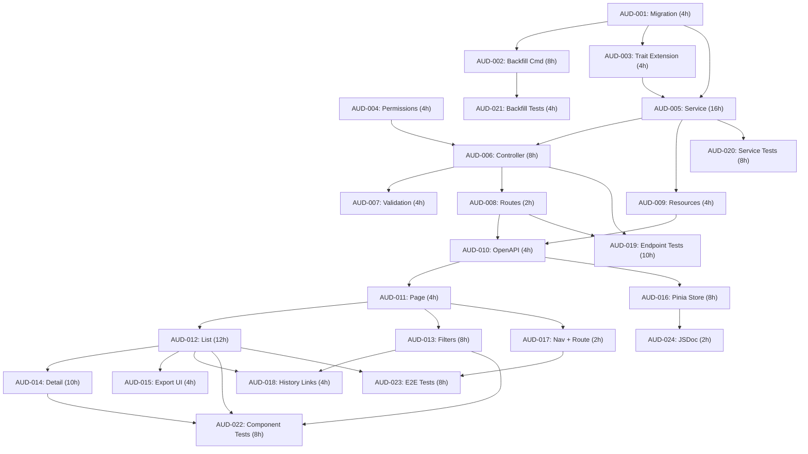

# Sprint Plan: Audit Trail / Activity Log

**Date**: 2026-02-09
**Feature**: 13 - Audit Trail / Activity Log
**Branch**: `feature/audit-trail` (from `main`)
**Task Prefix**: `AUD-`
**PRD Reference**: `.features/13-audit-trail/PRD.md`
**Architecture Reference**: `.features/13-audit-trail/ARCHITECTURE.md`

---

## 1. Executive Summary

The Audit Trail feature exposes Solidtime's existing audit data -- already captured by the `owen-it/laravel-auditing` package across all 10 core models -- through a dedicated, organization-scoped UI. The feature adds an `organization_id` column to the `audits` table (with backfill), extends the `CustomAuditable` trait, creates 3 API endpoints (list, detail, export), and builds a full-featured frontend with filtering, slide-over diff views, cursor-based pagination, and CSV/JSON export.

**Total effort estimate**: 140 hours

**Total story points**: ~70 SP

**Number of sprints**: **3 sprints** (6 weeks)

**Team size assumptions**:
- 1 Backend Developer (senior, ~30 productive hours/sprint)
- 1 Frontend Developer (senior, ~30 productive hours/sprint)
- Concurrent work where dependency graph allows

**Key constraints**:
- One schema change: add `organization_id` to existing `audits` table (AUD-001)
- Backfill command (AUD-002) must handle large existing datasets efficiently
- `CustomAuditable` trait modification (AUD-003) affects all 10 models -- requires careful testing
- Two new permissions: `audit-logs:view`, `audit-logs:export`
- Backend must be completed before frontend can consume APIs (AUD-010 is the bridge)
- `AUDITING_ENABLED=true` must be set in environment for audit data to exist

---

## 2. Sprint Overview Table

| Sprint | Name | Duration | Story Points | Key Deliverables |
|--------|------|----------|:------------:|------------------|
| **1** | Backend Foundation | 2 weeks | ~29 SP | Migration, Backfill Command, Trait Extension, Permissions, Service, Controller, Validation, Routes, API Resources, OpenAPI, Backend Tests |
| **2** | Frontend Implementation | 2 weeks | ~26 SP | Audit Log page, List, Filters, Detail Slide-over, Export, Pinia Store, Navigation, Entity History Links |
| **3** | Testing & Documentation | 2 weeks | ~15 SP | Endpoint Tests, Service Tests, Backfill Tests, Component Tests, E2E Tests, JSDoc |

**Total**: ~70 SP across 6 weeks

---

## 3. Dependency Map

### 3.1 Task Dependencies

```
Wave 1 (No dependencies -- Sprint 1 start):
    AUD-001 (Migration, 4h)
    AUD-004 (Permissions, 4h)

Wave 2 (after AUD-001):
    AUD-002 (Backfill command, 8h)         <-- AUD-001
    AUD-003 (Extend CustomAuditable, 4h)   <-- AUD-001

Wave 3 (after Wave 2):
    AUD-005 (AuditLogService, 16h)         <-- AUD-001, AUD-003
    AUD-021 (Backfill tests, 4h)           <-- AUD-002

Wave 4 (after Wave 3):
    AUD-006 (AuditLogController, 8h)       <-- AUD-005, AUD-004
    AUD-009 (API Resources, 4h)            <-- AUD-005
    AUD-020 (Service tests, 8h)            <-- AUD-005

Wave 5 (after Wave 4):
    AUD-007 (Validation classes, 4h)       <-- AUD-006
    AUD-008 (API routes, 2h)               <-- AUD-006

Wave 6 (after Wave 5 -- Sprint 2 bridge):
    AUD-010 (OpenAPI + TS client, 4h)      <-- AUD-008, AUD-009
    AUD-019 (Endpoint tests, 10h)          <-- AUD-006, AUD-008

Wave 7 (after AUD-010 -- Sprint 2 start):
    AUD-011 (AuditLog.vue page, 4h)        <-- AUD-010
    AUD-016 (Pinia store + types, 8h)      <-- AUD-010

Wave 8 (after Wave 7):
    AUD-012 (AuditLogList, 12h)            <-- AUD-011
    AUD-013 (AuditLogFilters, 8h)          <-- AUD-011
    AUD-017 (Web route + sidebar, 2h)      <-- AUD-011
    AUD-024 (JSDoc, 2h)                    <-- AUD-016

Wave 9 (after Wave 8):
    AUD-014 (AuditLogDetail, 10h)          <-- AUD-012
    AUD-015 (AuditLogExport, 4h)           <-- AUD-012
    AUD-018 (Entity history links, 4h)     <-- AUD-012, AUD-013

Wave 10 (after Wave 9 -- Sprint 3):
    AUD-022 (Component tests, 8h)          <-- AUD-012, AUD-013, AUD-014
    AUD-023 (E2E tests, 8h)               <-- AUD-017, AUD-012
```

### 3.2 Critical Path

```
AUD-001 (4h) -> AUD-003 (4h) -> AUD-005 (16h) -> AUD-006 (8h) -> AUD-008 (2h) -> AUD-010 (4h) -> AUD-011 (4h) -> AUD-012 (12h) -> AUD-014 (10h)
```

**Critical path duration**: 64 hours of sequential work

### 3.3 Parallelism Opportunities

| Wave | Backend | Frontend | Can run in parallel? |
|------|---------|----------|:--------------------:|
| 1 | AUD-001, AUD-004 | -- | Yes (AUD-001 and AUD-004 in parallel) |
| 2 | AUD-002, AUD-003 | -- | Yes (both depend only on AUD-001) |
| 3 | AUD-005 | -- | -- |
| 4 | AUD-006, AUD-009 | -- | Yes (both depend on AUD-005) |
| 5 | AUD-007, AUD-008 | -- | Yes (both depend on AUD-006) |
| 6 | AUD-010, AUD-019 | -- | Yes (OpenAPI + endpoint tests in parallel) |
| 7 | -- | AUD-011, AUD-016 | Yes (page + store in parallel) |
| 8 | -- | AUD-012, AUD-013, AUD-017 | Yes (all depend only on AUD-011) |
| 9 | -- | AUD-014, AUD-015, AUD-018 | Yes (detail + export + history links in parallel) |
| 10 | AUD-020, AUD-021 | AUD-022, AUD-023 | Yes (backend + frontend tests in parallel) |

### 3.4 Dependency Graph (Mermaid)



---

## 4. Sprint Details

### Sprint 1 (Weeks 1-2): Backend Foundation

**Goal**: Database migration applied, backfill command functional, trait extended, all 3 API endpoints fully functional with validation and permissions, OpenAPI spec updated, TypeScript client regenerated. Backend service and endpoint tests started.

| Task ID | Description | Assignee | SP | Dependencies | Day |
|---------|-------------|----------|:--:|--------------|:---:|
| AUD-001 | Migration: add `organization_id` to `audits` | Backend | 2 | None | 1 |
| AUD-004 | Register `audit-logs:view` and `audit-logs:export` permissions | Backend | 2 | None | 1 |
| AUD-002 | Artisan command: backfill `organization_id` | Backend | 5 | AUD-001 | 2-3 |
| AUD-003 | Extend `CustomAuditable` trait | Backend | 2 | AUD-001 | 2 |
| AUD-005 | Create `AuditLogService` | Backend | 8 | AUD-001, AUD-003 | 3-5 |
| AUD-009 | Create API resource classes | Backend | 2 | AUD-005 | 6 |
| AUD-006 | Create `AuditLogController` | Backend | 5 | AUD-005, AUD-004 | 6-7 |
| AUD-007 | Create request validation classes | Backend | 2 | AUD-006 | 7 |
| AUD-008 | Register API routes | Backend | 1 | AUD-006 | 7 |
| AUD-010 | Update OpenAPI spec + regenerate TS client | Backend | 2 | AUD-008, AUD-009 | 8 |
| AUD-020 | Service layer unit tests (start) | Backend QA | 5 | AUD-005 | 8-10 |
| AUD-021 | Backfill command tests | Backend QA | 2 | AUD-002 | 4-5 |

**Sprint 1 Total**: ~38 SP (includes test tasks that overlap into Sprint 2 for the backend developer)

**Note**: AUD-019 (endpoint tests, 10h) and AUD-020 (service tests, 8h) span Sprints 1-2. The backend developer starts these during Sprint 1 days 8-10 and completes them in early Sprint 2 while the frontend developer begins frontend work.

**Deliverables**:
- [ ] `organization_id` column added to `audits` table with 3 composite indexes
- [ ] `BackfillAuditOrganizationIds` command functional with `--dry-run` support
- [ ] `CustomAuditable` trait populates `organization_id` on new audit records
- [ ] `audit-logs:view` and `audit-logs:export` permissions registered
- [ ] `AuditLogService` with query, detail, and export logic
- [ ] `AuditLogController` with 3 endpoints (index, show, export)
- [ ] Request validation classes for index and export
- [ ] Routes registered in `api.php`
- [ ] API resource classes for list, detail, and collection
- [ ] OpenAPI spec updated, TypeScript client regenerated
- [ ] Backfill command tests passing
- [ ] Service unit tests started

**QA Gate**:
```bash
./vendor/bin/sail exec laravel.test composer fix
./vendor/bin/sail exec laravel.test composer analyse
./vendor/bin/sail exec laravel.test php artisan test --filter=BackfillAuditOrganizationIds
./vendor/bin/sail exec laravel.test php artisan test --filter=AuditLogService
```

---

### Sprint 2 (Weeks 3-4): Frontend Implementation

**Goal**: Fully functional audit log page with list, filters, detail slide-over, export, pagination, navigation, and entity history links. Backend tests completed.

| Task ID | Description | Assignee | SP | Dependencies | Day |
|---------|-------------|----------|:--:|--------------|:---:|
| AUD-019 | Backend endpoint tests (complete) | Backend QA | 5 | AUD-006, AUD-008 | 1-3 |
| AUD-020 | Service layer unit tests (complete) | Backend QA | 3 | AUD-005 | 1-2 |
| AUD-011 | Create `AuditLog.vue` Inertia page | Frontend | 2 | AUD-010 | 1 |
| AUD-016 | Create Pinia store + TypeScript types | Frontend | 5 | AUD-010 | 1-2 |
| AUD-012 | Create `AuditLogList.vue` (table + pagination) | Frontend | 8 | AUD-011 | 2-4 |
| AUD-013 | Create `AuditLogFilters.vue` (filter bar) | Frontend | 5 | AUD-011 | 2-3 |
| AUD-017 | Add web route + sidebar navigation | Frontend | 1 | AUD-011 | 2 |
| AUD-014 | Create `AuditLogDetail.vue` slide-over | Frontend | 5 | AUD-012 | 5-6 |
| AUD-015 | Create `AuditLogExport.vue` | Frontend | 2 | AUD-012 | 5 |
| AUD-018 | Add "View History" links to entity pages | Frontend | 2 | AUD-012, AUD-013 | 7 |
| AUD-024 | JSDoc comments on store and components | Frontend | 1 | AUD-016 | 7 |

**Sprint 2 Total**: ~39 SP (includes completing backend tests)

**Deliverables**:
- [ ] `AuditLog.vue` page with AppLayout
- [ ] 7 UI components (List, Row, EventBadge, Filters, Detail, DiffTable, Export)
- [ ] `useAuditLogStore` Pinia store with all actions and getters
- [ ] TypeScript type definitions
- [ ] Web route at `/audit-log`
- [ ] Sidebar navigation item (permission-gated)
- [ ] "View History" links on entity detail pages
- [ ] Cursor-based pagination ("Load More")
- [ ] Filter state synced to URL query parameters
- [ ] Export dropdown (CSV/JSON)
- [ ] JSDoc documentation on store
- [ ] All backend endpoint tests passing
- [ ] All service unit tests passing

**QA Gate**:
```bash
npm run lint:fix && npm run format
npm run build  # Verify no build errors
./vendor/bin/sail exec laravel.test php artisan test --filter=AuditLogEndpointTest
./vendor/bin/sail exec laravel.test php artisan test --filter=AuditLogServiceTest
```

**Manual Testing**:
- Navigate to `/audit-log` via sidebar
- Verify audit records load with correct event badges, entity names, user info
- Apply filters: entity type, event type, user, date range
- Verify active filter chips display and are removable
- Click a record to open detail slide-over
- Verify diff table shows old/new values with highlighting
- Close detail panel with Escape key and click-outside
- Click "Load More" for next page
- Click "Export" to download CSV and JSON
- Navigate from entity "View History" link to pre-filtered audit log
- Verify sidebar item hidden for Employee role

---

### Sprint 3 (Weeks 5-6): Testing & Documentation

**Goal**: Comprehensive test coverage for frontend components and E2E user flows. All quality gates pass.

| Task ID | Description | Assignee | SP | Dependencies | Day |
|---------|-------------|----------|:--:|--------------|:---:|
| AUD-022 | Frontend component tests (Vitest) | Frontend QA | 5 | AUD-012, AUD-013, AUD-014 | 1-3 |
| AUD-023 | E2E Playwright tests | QA | 5 | AUD-017, AUD-012 | 3-5 |

**Sprint 3 Total**: ~10 SP

**Note**: Sprint 3 is lighter than Sprints 1-2 because backend testing was completed in Sprints 1-2. The frontend developer focuses on component tests and E2E tests. Any bug fixes from Sprint 2 manual testing are addressed here.

**Deliverables**:
- [ ] Component tests for AuditLogList, AuditLogFilters, AuditLogDetail, AuditLogEventBadge
- [ ] E2E tests covering: navigation, list display, filtering, detail panel, export, permission restriction
- [ ] All quality gates pass

**QA Gate**:
```bash
npm run lint:fix && npm run format
npx vitest run
npx playwright test
./vendor/bin/sail exec laravel.test composer fix
./vendor/bin/sail exec laravel.test composer analyse
./vendor/bin/sail exec laravel.test php artisan test
```

---

## 5. Risk Register

| Risk | Sprint | Probability | Impact | Mitigation |
|------|--------|:-----------:|:------:|------------|
| `CustomAuditable` trait modification breaks existing audit behavior | 1 | Low | High | `transformAudit()` only adds data, does not modify existing fields. Test all 10 models after modification. The method returns `null` for edge cases (column is nullable). |
| Large `audits` table causes slow queries | 1-2 | High | High | Composite indexes on `(organization_id, created_at DESC)` and `(organization_id, auditable_type, created_at DESC)`. Cursor-based pagination instead of offset. Lazy entity name resolution with request-scoped caching. |
| Backfill command performance on large datasets | 1 | Medium | Medium | Process in chunks of 1,000 records per auditable type. Use raw SQL UPDATE with JOIN. Progress bar. `--dry-run` for previewing. Designed for maintenance window. |
| Organization scoping for User model audits is ambiguous | 1 | Medium | Medium | Users can belong to multiple organizations. For backfill: resolve via membership (first org). For new records: resolve from request context (organization in URL). Document edge cases. |
| `AUDITING_ENABLED=false` in production means no data | 2 | Medium | High | Display warning banner on audit log page when auditing is disabled. Document in deployment guide. |
| Entity name resolution for deleted entities fails | 1-2 | Medium | Low | `resolveEntityName()` returns `null`. UI displays "[Deleted] {type} ({id truncated})". No joins on potentially missing rows. |
| Export of very large datasets (100K+ records) | 2 | Low | Medium | Hard limit of 10,000 records. If exceeded, return 422 with message to narrow filters. |
| AUD-010 OpenAPI regeneration blocks frontend | 1-2 | Low | High | AUD-010 is scheduled at end of Sprint 1. If delayed, frontend cannot start. Buffer 0.5 day. |
| Morph class names may change between Laravel versions | 1 | Low | High | Use constant map (`AUDITABLE_TYPE_MAP`) in service to decouple from internal morph names. |
| Slide-over component complexity (animations, transitions) | 2 | Medium | Low | Use HeadlessUI Dialog/Transition pattern. Fall back to simpler modal if slide-over proves complex. |
| E2E test flakiness for filtered audit log | 3 | Medium | Low | Seed predictable audit data in test fixtures. Use explicit waits for API responses. |

---

## 6. Definition of Done (Feature Complete)

- [ ] All 24 tasks (AUD-001 through AUD-024) completed
- [ ] `organization_id` column added to `audits` table with 3 composite indexes
- [ ] Backfill command works for all 10 model types with `--dry-run` support
- [ ] `CustomAuditable` trait auto-populates `organization_id` on new records
- [ ] `audit-logs:view` and `audit-logs:export` permissions registered for correct roles
- [ ] All 3 API endpoints working with proper validation and permissions
- [ ] OpenAPI spec includes all 3 audit log endpoints
- [ ] TypeScript client regenerated
- [ ] Audit log page renders with list, filters, detail, and export
- [ ] Cursor-based pagination ("Load More") works
- [ ] Filter state synced to URL query parameters
- [ ] Detail slide-over shows diff view with resolved UUIDs
- [ ] Export generates valid CSV and JSON files
- [ ] Sidebar navigation item visible only to authorized roles
- [ ] "View History" links on entity detail pages
- [ ] Backend endpoint tests passing (AUD-019)
- [ ] Service layer unit tests passing (AUD-020)
- [ ] Backfill command tests passing (AUD-021)
- [ ] Frontend component tests passing (AUD-022)
- [ ] E2E tests passing (AUD-023)
- [ ] JSDoc documentation on store (AUD-024)
- [ ] `composer fix && composer analyse` passes with 0 new errors
- [ ] `npm run lint:fix && npm run format` passes
- [ ] `npm run build` succeeds
- [ ] Feature ready for merge to `main`

---

## 7. Post-Sprint: Merge Strategy

After all 3 sprints complete and QA passes:

1. Rebase `feature/audit-trail` on latest `main`
2. Run full test suite (PHP + JS + E2E)
3. Run `composer fix && composer analyse`
4. Run `npm run lint:fix && npm run format`
5. Run `php artisan audit:backfill-organization-ids --dry-run` to verify backfill logic
6. Create PR targeting `main`
7. After merge: run `php artisan migrate` and `php artisan audit:backfill-organization-ids` on staging/production
8. Verify `AUDITING_ENABLED=true` is set in the deployment environment

**Post-merge deployment steps**:
```bash
# 1. Run migration to add organization_id column
php artisan migrate

# 2. Backfill existing audit records (run during low-traffic period)
php artisan audit:backfill-organization-ids --dry-run   # Preview first
php artisan audit:backfill-organization-ids              # Execute backfill

# 3. Verify AUDITING_ENABLED is set
# .env: AUDITING_ENABLED=true
```
