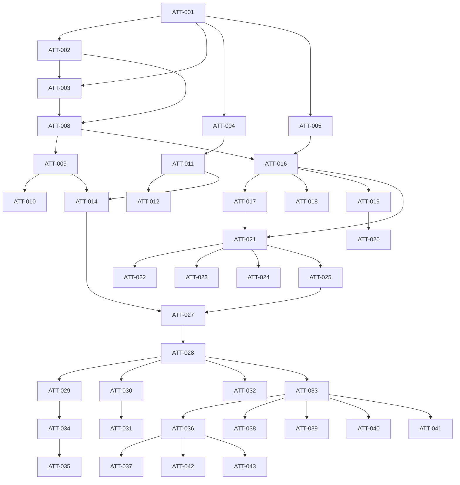

# PRD: Attendance & Overtime Tracking

Generated: 2026-02-09
Version: 1.0
Feature Branch: `feature/attendance-overtime` (from `main`)

---

## Table of Contents

1. [Source & Context](#1-source--context)
2. [Technical Interpretation](#2-technical-interpretation)
3. [Functional Specifications](#3-functional-specifications)
4. [Technical Requirements & Constraints](#4-technical-requirements--constraints)
5. [User Stories with Acceptance Criteria](#5-user-stories-with-acceptance-criteria)
6. [Task Breakdown Structure](#6-task-breakdown-structure)
7. [Dependencies & Integration Points](#7-dependencies--integration-points)
8. [Risk Assessment & Mitigation](#8-risk-assessment--mitigation)
9. [Testing & Validation Requirements](#9-testing--validation-requirements)
10. [Monitoring & Observability](#10-monitoring--observability)
11. [Success Metrics & Definition of Done](#11-success-metrics--definition-of-done)
12. [Technical Debt & Future Considerations](#12-technical-debt--future-considerations)
13. [Appendices](#13-appendices)

---

## 1. Source & Context

### 1.1 Problem Statement

Solidtime currently tracks time entries (start/end per project/task) and has foundational support for weekly capacity (`members.weekly_capacity`, default 40h = 144,000 seconds). However, it has **no concept of daily expected work hours, attendance status, break compliance, or overtime computation**. Organizations that need payroll-grade attendance records, labor-law overtime calculations, or daily present/absent status must use external tools or spreadsheets. This gap becomes especially significant for organizations already using (or planning to use) the Kiosk Clock Mode (Feature 06) for shift-based clock-in/clock-out.

Without attendance and overtime tracking:
- Managers cannot determine whether a member was present or absent on a given day
- There is no automatic detection of overtime (daily or weekly thresholds)
- Break compliance (minimum break durations required by labor law) cannot be enforced or reported
- Payroll teams lack exportable attendance summaries with regular/overtime/break hours
- Organizations in regulated industries cannot demonstrate work-hour compliance
- The value proposition of the Kiosk feature is diminished without downstream attendance reporting

### 1.2 Competitive Analysis

From **features.txt** Section 9.3 -- "Attendance and overtime":

> **What**: Track daily attendance and compute overtime.
> **Why important**: Payroll accuracy and labor compliance.
> **User flow**:
> 1. Admin enables attendance rules (work hours, breaks, overtime thresholds).
> 2. Members clock in/out (or kiosk/GPS).
> 3. System computes attendance and overtime reports.

Platforms offering attendance/overtime features:

| Platform | Attendance | Overtime Computation | Break Tracking | Kiosk Integration |
|----------|:----------:|:--------------------:|:--------------:|:-----------------:|
| Clockify | Yes | Yes (reports) | Yes (kiosk breaks) | Yes |
| TimeCamp | Yes | Yes (by tier) | Implicit | Yes (time clock kiosk) |
| Hubstaff | Yes | Via scheduling | Via scheduling | Yes |
| QuickBooks Time | Yes | Yes | Yes | Yes |
| Replicon | Yes | Yes | Yes | No |
| **Solidtime (this PRD)** | **Yes** | **Yes** | **Yes** | **Yes** |

### 1.3 Related Features

This feature has explicit integration points with:

- **Feature 06 (Kiosk & Clock Mode)**: Clock-in/clock-out events from kiosks feed directly into attendance computation. Kiosk break tracking maps to attendance break records.
- **Feature 07 (PTO & Time Off)**: Approved time-off days should mark the member as "On Leave" rather than "Absent" in attendance records. Holiday calendars affect expected work days.
- **Feature 00 (Weekly Timesheet Grid)**: The existing `weekly_capacity` on `members` and `default_weekly_capacity` on `organizations` (shared foundation SF-06) provides the baseline expected hours.
- **Feature 08 (Resource Scheduling)**: Scheduled shifts/assignments can optionally define per-day expected hours, overriding the default work schedule.

### 1.4 Current System State

**Existing infrastructure on `main`:**
- `TimeEntry` model with `start`, `end`, `project_id`, `task_id`, `member_id`, `user_id`, `organization_id`, `billable`, `description`, `tags`
- `Member` model with `weekly_capacity` (unsigned integer, seconds, default 144,000 = 40h)
- `Organization` model with `default_weekly_capacity` (unsigned integer, seconds, default 144,000)
- Existing permission system: `time-entries:view:own`, `time-entries:view:all`, `time-entries:create:own`, `time-entries:create:all`
- `Weekday` enum with `carbonWeekDay()` helper for week start configuration
- `Role` enum: Owner, Admin, Manager, Employee, Placeholder
- Frontend: Vue 3 + TypeScript + Pinia + Inertia.js + TailwindCSS
- API: Laravel Passport authentication, JSON API at `/api/v1/`
- Shared foundation: `ApprovalStatus` enum, `HasApprovalWorkflow` trait, notification infrastructure (FOUND-001 through FOUND-005)
- Shared foundation: Modular permissions pattern (SF-08, FOUND-007)

---

## 2. Technical Interpretation

### Business to Technical Translation

| Business Requirement | Technical Implementation |
|---------------------|-------------------------|
| Admin configures work schedules (expected hours per day) | `WorkSchedulePolicy` model with per-weekday hour definitions, assigned to org or member |
| Daily attendance status (present/absent/late/on leave) | `AttendanceRecord` model computed daily from `TimeEntry` data + PTO + holidays |
| Overtime rules (daily threshold, weekly threshold) | `OvertimeRule` model with configurable thresholds; `AttendanceService` computes overtime |
| Break tracking and compliance | `BreakRule` on `WorkSchedulePolicy`; computed from gaps between time entries or kiosk break events |
| Attendance reports (daily, weekly, monthly) | New API endpoints returning aggregated attendance data with filters |
| Overtime reports (per member, per period) | New API endpoints with overtime hours breakdown |
| Admin dashboard for attendance overview | New Vue page showing daily team attendance grid |
| Integration with PTO/holidays | Query `TimeOffRequest` (approved) and `Holiday` models to determine non-work days |

### No-Change Boundary

This feature does **NOT**:
- Modify the existing `TimeEntry` model schema or behavior
- Change how the running timer, Time page, or Timesheet Grid work
- Replace or duplicate Kiosk clock-in/clock-out functionality (it consumes kiosk data)
- Modify PTO/Time Off models (it reads PTO data via service integration)
- Introduce geofencing or GPS tracking (that belongs to Feature 06)
- Handle payroll calculations or salary computation (out of scope)
- Create approval workflows for attendance corrections (deferred to future enhancement)

---

## 3. Functional Specifications

### 3.1 Core Requirements

#### REQ-001: Work Schedule Policy Management
- **Description**: Organization admins can create and manage work schedule policies that define expected daily work hours per weekday, rest days, and optional break requirements. Policies can be assigned at the organization level (default) or overridden per member.
- **Priority**: P0
- **Details**:
  - A work schedule policy defines expected hours for each of the 7 weekdays (Monday through Sunday)
  - Rest days (weekends) are indicated by 0 expected hours for that weekday
  - Each policy has a name, description, and active/inactive status
  - One policy per organization is marked as the default
  - Members can be assigned a specific policy that overrides the org default
  - Policies support effective date ranges for historical accuracy (e.g., a member moved from full-time to part-time)
- **Edge Cases**:
  - Organization has no work schedule policy configured (use 8h/day Mon-Fri as system default)
  - Member is assigned a policy that is later deactivated (fall back to org default)
  - Policy is modified after attendance records have been computed (historical records are immutable; only future days affected)
  - Member has multiple policy assignments with overlapping date ranges (most recent assignment wins)
- **Error Scenarios**:
  - Attempting to delete a policy that is the org default returns 409 Conflict
  - Creating a policy with negative hours for any weekday returns 422
  - Assigning a policy from a different organization returns 403

#### REQ-002: Daily Attendance Computation
- **Description**: The system automatically computes daily attendance records for each member based on their time entries, work schedule, PTO status, and holiday calendar.
- **Priority**: P0
- **Computation Logic**:
  1. For each member and each calendar day, determine the **expected status**:
     - If the day is a holiday (from `Holiday` model, Feature 07): status = `holiday`
     - If the day is a rest day per the member's work schedule: status = `rest_day`
     - If the member has an approved time-off request covering this day: status = `on_leave`
     - Otherwise: the member is expected to work
  2. For expected work days, compute **actual hours** from completed `TimeEntry` records (where `end IS NOT NULL`) whose `start` date falls on that day
  3. Determine **attendance status**:
     - `present`: actual hours > 0 on an expected work day
     - `absent`: actual hours = 0 on an expected work day
     - `late`: first time entry starts after the configured grace period (optional)
     - `half_day`: actual hours < 50% of expected hours (configurable threshold)
     - `on_leave`: approved PTO covers this day
     - `holiday`: organization holiday
     - `rest_day`: non-working day per schedule
  4. Compute **overtime**, **undertime**, and **break duration** for the day
- **Edge Cases**:
  - Time entries crossing midnight are assigned to the day of their `start` timestamp (consistent with timesheet behavior)
  - Running timers (`end IS NULL`) are excluded from attendance computation
  - Member has no time entries for a future date (no attendance record generated)
  - Member joins the organization mid-month (attendance only computed from join date)
- **Error Scenarios**:
  - Attendance computation for a locked/approved timesheet period should use cached records, not recompute

#### REQ-003: Overtime Rules Configuration
- **Description**: Admins configure overtime rules that define thresholds for daily and weekly overtime computation.
- **Priority**: P0
- **Rule Types**:
  - **Daily threshold**: Hours worked beyond X hours/day count as overtime (e.g., 8h threshold: 9h worked = 1h overtime)
  - **Weekly threshold**: Hours worked beyond Y hours/week count as overtime (e.g., 40h threshold: 45h worked = 5h weekly overtime)
  - **Daily double-time threshold**: Optional second tier (e.g., beyond 12h/day = double-time rate)
  - **Rest day work**: Any hours worked on a rest day count as overtime at a configurable multiplier
  - **Holiday work**: Any hours worked on a holiday count as overtime at a configurable multiplier
- **Configuration**:
  - Overtime rules are defined at the organization level
  - Multiple rules can be active simultaneously (e.g., both daily and weekly thresholds)
  - Each rule has a multiplier (e.g., 1.5x for overtime, 2.0x for double-time)
  - Rules have an effective date for historical accuracy
- **Edge Cases**:
  - Both daily and weekly thresholds apply: daily overtime is computed first, then weekly overtime excludes hours already counted as daily overtime
  - Member works on a holiday that is also a rest day: highest applicable multiplier applies (not cumulative)
  - Zero threshold means overtime is disabled for that rule type
  - Organization has no overtime rules configured (overtime computation returns 0)
- **Error Scenarios**:
  - Double-time threshold lower than regular overtime threshold returns 422
  - Negative multiplier returns 422
  - Multiplier of 0 returns 422 (use deactivation instead)

#### REQ-004: Break Tracking and Compliance
- **Description**: The system tracks break time within a work day and can enforce minimum break requirements per work schedule policy.
- **Priority**: P1
- **Computation**:
  - Break time is computed as gaps between consecutive time entries within the same day for the same member
  - Gaps shorter than a configurable minimum (e.g., 5 minutes) are ignored (not counted as breaks)
  - Gaps longer than a configurable maximum (e.g., 3 hours) are flagged as potential missing time entries, not breaks
  - Kiosk break events (Feature 06) are treated as explicit breaks regardless of gap analysis
- **Compliance Rules** (per work schedule policy):
  - `min_break_minutes`: Minimum total break time required per day (e.g., 30 minutes for shifts > 6h)
  - `break_required_after_hours`: After how many continuous work hours a break is required (e.g., after 6h)
  - Compliance status: `compliant`, `non_compliant`, `not_applicable`
- **Edge Cases**:
  - Member has only one time entry for the day (no gaps = no detected breaks; check against explicit kiosk breaks)
  - Member has a gap at the start of the day (before first entry) -- not counted as a break
  - Member has a gap at the end of the day (after last entry) -- not counted as a break
  - Break compliance is not applicable on rest days, holidays, or leave days
- **Error Scenarios**:
  - `min_break_minutes` exceeds total expected daily work hours returns 422

#### REQ-005: Attendance Reports
- **Description**: Managers and admins can view and export attendance reports showing daily presence/absence for team members over a date range.
- **Priority**: P0
- **Report Types**:
  - **Daily attendance summary**: For a specific date, show all members with their status, actual hours, expected hours, overtime, and break time
  - **Member attendance detail**: For a specific member over a date range, show day-by-day attendance with totals
  - **Monthly attendance sheet**: Spreadsheet-like grid with members as rows, days as columns, status as cell values
- **Filters**:
  - Date range (required)
  - Member IDs (optional, defaults to all accessible members)
  - Status filter (e.g., show only absent days)
  - Department/team filter (when Feature 10 Teams is available)
- **Export**:
  - CSV export with configurable columns
  - PDF export (via Gotenberg, consistent with existing report export)
- **Edge Cases**:
  - Date range spans a work schedule policy change (use the policy effective on each specific day)
  - Member has no attendance records for part of the range (show "N/A" for dates before they joined)
  - Large organizations with hundreds of members (paginate API responses)

#### REQ-006: Overtime Reports
- **Description**: Managers and admins can view and export overtime reports showing computed overtime hours per member over a date range.
- **Priority**: P0
- **Report Columns**:
  - Member name
  - Date range
  - Regular hours (up to threshold)
  - Daily overtime hours (threshold 1)
  - Daily double-time hours (threshold 2, if configured)
  - Weekly overtime hours
  - Rest day overtime hours
  - Holiday overtime hours
  - Total overtime hours
  - Overtime cost (overtime hours x multiplier x member's billable rate, if available)
- **Aggregation Levels**:
  - Per day per member
  - Per week per member
  - Per month per member
  - Organization totals
- **Export**:
  - CSV export
  - PDF export
- **Edge Cases**:
  - Overtime rules change mid-period (apply the rule effective on each specific day)
  - Member has no overtime (show 0, not missing row)
  - Billable rate is null (show overtime hours without cost)

### 3.2 User Workflows

```
Admin configures attendance system
    -> Navigate to Organization Settings > Attendance
    -> Create work schedule policy (e.g., "Standard Full-Time": 8h Mon-Fri)
    -> Set as organization default
    -> Optionally create additional policies (e.g., "Part-Time": 4h Mon-Fri)
    -> Assign specific members to non-default policies
    -> Configure overtime rules (e.g., daily > 8h = 1.5x, weekly > 40h = 1.5x)
    -> Configure break requirements (e.g., 30 min break required after 6h)

System computes attendance daily
    -> Scheduled command runs at end of each day (configurable time, e.g., 02:00 UTC)
    -> For each member in each organization:
       -> Determine expected status (holiday / rest day / on leave / work day)
       -> Sum completed time entries for that day
       -> Compute attendance status
       -> Compute overtime (daily threshold)
       -> Compute break time and compliance
       -> Create or update AttendanceRecord

Manager reviews attendance
    -> Navigate to Attendance page
    -> View daily attendance grid (members x days)
    -> See at-a-glance status (color-coded: green=present, red=absent, blue=leave, gray=rest)
    -> Click a member to see detail view
    -> Filter by date range, status, member
    -> Export attendance report as CSV/PDF

Manager reviews overtime
    -> Navigate to Attendance > Overtime tab
    -> View overtime summary for date range
    -> See breakdown: regular vs overtime vs double-time per member
    -> Export overtime report for payroll

Member views own attendance
    -> Navigate to "My Attendance" in sidebar
    -> See personal attendance calendar for current month
    -> See daily breakdown: expected hours, actual hours, overtime, breaks
    -> See attendance statistics (days present, absent, late, on leave)
```

### 3.3 Business Rules

#### Attendance Computation Rules
1. Attendance records are computed for dates up to and including yesterday (not today, since the day is not yet complete)
2. A manual "recompute" action is available for admins to force recomputation of a specific date range
3. Attendance records are immutable once the corresponding timesheet period is approved (Feature 01 integration)
4. When a time entry is created, updated, or deleted, the attendance record for the affected date(s) is marked as stale and recomputed on next scheduled run or on-demand
5. The scheduled computation command is idempotent: running it multiple times for the same day produces the same result

#### Overtime Calculation Rules
1. Daily overtime is calculated first: `daily_overtime = max(0, actual_hours - daily_threshold)`
2. Weekly overtime is calculated after excluding daily overtime: `weekly_overtime = max(0, (weekly_actual - weekly_daily_overtime_total) - weekly_threshold)`
3. This prevents double-counting hours as both daily and weekly overtime
4. Rest day and holiday overtime use the full actual hours worked on those days (since expected = 0)
5. When multiple multiplier levels apply, the highest multiplier wins (not cumulative)

#### Break Computation Rules
1. Breaks are detected as gaps between consecutive `TimeEntry` records within the same calendar day for the same member
2. Only gaps between `min_break_gap_minutes` (default 5) and `max_break_gap_minutes` (default 180) are counted
3. Explicit kiosk break events (from Feature 06's `KioskSession.on_break_since`) always count as breaks, regardless of gap analysis
4. Break compliance is only checked on work days where actual hours exceed `break_required_after_hours`

---

## 4. Technical Requirements & Constraints

### 4.1 System Architecture

```
+------------------------------------------------------------------------+
|                        Frontend (Vue.js 3)                              |
+------------------------------------------------------------------------+
|  +------------------+  +---------------------+  +-------------------+  |
|  | Attendance.vue   |  | AttendanceGrid.vue  |  | OvertimeReport.vue|  |
|  | (Page)           |  | (Daily grid)        |  | (Report view)     |  |
|  | - Tab navigation |  | - Member rows       |  | - Overtime table  |  |
|  | - Date picker    |  | - Day columns       |  | - Export buttons  |  |
|  +--------+---------+  | - Status badges     |  +-------------------+  |
|           |             | - Click to detail   |                         |
|           |             +---------------------+                         |
|           |                                                             |
|           |  +--------------------------------------------------+      |
|           +->| AttendanceMemberDetail.vue                       |      |
|              | - Day-by-day breakdown                            |      |
|              | - Time entry list per day                         |      |
|              | - Overtime breakdown                              |      |
|              | - Break time display                              |      |
|              +--------------------------------------------------+      |
|                                                                         |
|  +-------------------------------------------------------------------+ |
|  | WorkScheduleSettings.vue (in Organization Settings)               | |
|  | - Policy CRUD                                                      | |
|  | - Member assignment                                                | |
|  | - Overtime rules                                                   | |
|  | - Break requirements                                               | |
|  +-------------------------------------------------------------------+ |
|                                                                         |
|  +-------------------------------------------------------------------+ |
|  | useAttendanceStore.ts (Pinia)                                     | |
|  | - attendanceRecords: Map<string, AttendanceRecord[]>              | |
|  | - workSchedulePolicies: WorkSchedulePolicy[]                      | |
|  | - overtimeRules: OvertimeRule[]                                    | |
|  | - loadAttendance() / loadOvertimeReport()                         | |
|  | - exportAttendance() / exportOvertime()                           | |
|  +-------------------------------------------------------------------+ |
|                 | HTTP/JSON                                             |
+-----------------+-------------------------------------------------------+
                  v
+------------------------------------------------------------------------+
|                        Backend (Laravel 11)                             |
+------------------------------------------------------------------------+
|  +------------------------------------------+                          |
|  | AttendanceController.php                  |                          |
|  | - dailySummary()   GET /attendance        |                          |
|  | - memberDetail()   GET /attendance/{m}    |                          |
|  | - overtimeReport() GET /attendance/overtime|                         |
|  | - export()         GET /attendance/export  |                         |
|  +------------------------------------------+                          |
|                                                                         |
|  +------------------------------------------+                          |
|  | WorkScheduleController.php                |                          |
|  | - index()    GET  /work-schedules         |                          |
|  | - store()    POST /work-schedules         |                          |
|  | - show()     GET  /work-schedules/{ws}    |                          |
|  | - update()   PUT  /work-schedules/{ws}    |                          |
|  | - destroy()  DEL  /work-schedules/{ws}    |                          |
|  | - assign()   POST /work-schedules/assign  |                          |
|  +------------------------------------------+                          |
|                                                                         |
|  +------------------------------------------+                          |
|  | OvertimeRuleController.php                |                          |
|  | - index()    GET  /overtime-rules         |                          |
|  | - store()    POST /overtime-rules         |                          |
|  | - update()   PUT  /overtime-rules/{rule}  |                          |
|  | - destroy()  DEL  /overtime-rules/{rule}  |                          |
|  +------------------------------------------+                          |
|                                                                         |
|  +------------------------------------------+                          |
|  | AttendanceService.php                     |                          |
|  | - computeAttendance()                     |                          |
|  | - computeOvertime()                       |                          |
|  | - computeBreaks()                         |                          |
|  | - getDailySummary()                       |                          |
|  | - getMemberDetail()                       |                          |
|  | - getOvertimeReport()                     |                          |
|  +------------------------------------------+                          |
|                                                                         |
|  +------------------------------------------+                          |
|  | WorkScheduleService.php                   |                          |
|  | - getEffectivePolicy()                    |                          |
|  | - getExpectedHoursForDate()               |                          |
|  | - isWorkDay()                             |                          |
|  | - isRestDay()                             |                          |
|  +------------------------------------------+                          |
|                                                                         |
|  +------------------------------------------+                          |
|  | ComputeAttendanceCommand.php              |                          |
|  | (Artisan: attendance:compute)             |                          |
|  | - Runs daily via scheduler                |                          |
|  | - Computes records for previous day       |                          |
|  | - Supports --date and --member flags      |                          |
|  +------------------------------------------+                          |
|                                                                         |
|  Models:                                                                |
|  +-------------------+ +-------------------+ +---------------------+   |
|  | WorkSchedulePolicy| | OvertimeRule      | | AttendanceRecord    |   |
|  | (NEW)             | | (NEW)             | | (NEW)               |   |
|  +-------------------+ +-------------------+ +---------------------+   |
|  +-------------------+                                                  |
|  | MemberWorkSchedule|                                                  |
|  | (NEW pivot)       |                                                  |
|  +-------------------+                                                  |
|                                                                         |
|  Existing models (read-only):                                           |
|  TimeEntry, Member, Organization, Holiday*, TimeOffRequest*             |
|  (* from Feature 07, soft dependency)                                   |
+------------------------------------------------------------------------+
                  |
                  v
+------------------------------------------------------------------------+
|                        PostgreSQL                                       |
| work_schedule_policies | overtime_rules | attendance_records           |
| member_work_schedules  | (existing tables read-only)                    |
+------------------------------------------------------------------------+
```

### 4.2 Data Models

#### Database Schema (New Tables)

```sql
-- Work Schedule Policies
CREATE TABLE work_schedule_policies (
    id UUID PRIMARY KEY DEFAULT gen_random_uuid(),
    organization_id UUID NOT NULL REFERENCES organizations(id) ON DELETE CASCADE,
    name VARCHAR(255) NOT NULL,
    description TEXT DEFAULT '',
    is_default BOOLEAN DEFAULT FALSE,
    is_active BOOLEAN DEFAULT TRUE,
    monday_seconds INTEGER NOT NULL DEFAULT 28800,    -- 8h
    tuesday_seconds INTEGER NOT NULL DEFAULT 28800,
    wednesday_seconds INTEGER NOT NULL DEFAULT 28800,
    thursday_seconds INTEGER NOT NULL DEFAULT 28800,
    friday_seconds INTEGER NOT NULL DEFAULT 28800,
    saturday_seconds INTEGER NOT NULL DEFAULT 0,      -- rest day
    sunday_seconds INTEGER NOT NULL DEFAULT 0,        -- rest day
    min_break_minutes INTEGER DEFAULT NULL,           -- NULL = no requirement
    break_required_after_hours DECIMAL(4,2) DEFAULT NULL,
    min_break_gap_minutes INTEGER DEFAULT 5,          -- gaps shorter than this are not breaks
    max_break_gap_minutes INTEGER DEFAULT 180,        -- gaps longer than this are flagged
    timezone VARCHAR(64) NOT NULL DEFAULT 'UTC',
    created_at TIMESTAMP DEFAULT CURRENT_TIMESTAMP,
    updated_at TIMESTAMP DEFAULT CURRENT_TIMESTAMP,

    CONSTRAINT uq_org_default_policy UNIQUE (organization_id, is_default) WHERE is_default = TRUE,
    INDEX idx_wsp_org (organization_id)
);

-- Member Work Schedule assignments (pivot)
CREATE TABLE member_work_schedules (
    id UUID PRIMARY KEY DEFAULT gen_random_uuid(),
    member_id UUID NOT NULL REFERENCES members(id) ON DELETE CASCADE,
    work_schedule_policy_id UUID NOT NULL REFERENCES work_schedule_policies(id) ON DELETE CASCADE,
    effective_from DATE NOT NULL,
    effective_until DATE DEFAULT NULL,  -- NULL = indefinite
    created_at TIMESTAMP DEFAULT CURRENT_TIMESTAMP,
    updated_at TIMESTAMP DEFAULT CURRENT_TIMESTAMP,

    INDEX idx_mws_member (member_id),
    INDEX idx_mws_policy (work_schedule_policy_id),
    INDEX idx_mws_effective (member_id, effective_from, effective_until)
);

-- Overtime Rules
CREATE TABLE overtime_rules (
    id UUID PRIMARY KEY DEFAULT gen_random_uuid(),
    organization_id UUID NOT NULL REFERENCES organizations(id) ON DELETE CASCADE,
    name VARCHAR(255) NOT NULL,
    rule_type VARCHAR(50) NOT NULL,       -- 'daily_threshold', 'weekly_threshold', 'daily_double_time', 'rest_day_work', 'holiday_work'
    threshold_seconds INTEGER DEFAULT NULL, -- NULL for rest_day_work/holiday_work (entire day is overtime)
    multiplier DECIMAL(4,2) NOT NULL DEFAULT 1.50,
    is_active BOOLEAN DEFAULT TRUE,
    effective_from DATE NOT NULL,
    effective_until DATE DEFAULT NULL,
    created_at TIMESTAMP DEFAULT CURRENT_TIMESTAMP,
    updated_at TIMESTAMP DEFAULT CURRENT_TIMESTAMP,

    INDEX idx_or_org (organization_id),
    INDEX idx_or_effective (organization_id, effective_from, effective_until)
);

-- Attendance Records (computed, one per member per day)
CREATE TABLE attendance_records (
    id UUID PRIMARY KEY DEFAULT gen_random_uuid(),
    member_id UUID NOT NULL REFERENCES members(id) ON DELETE CASCADE,
    organization_id UUID NOT NULL REFERENCES organizations(id) ON DELETE CASCADE,
    date DATE NOT NULL,
    status VARCHAR(20) NOT NULL,          -- 'present', 'absent', 'late', 'half_day', 'on_leave', 'holiday', 'rest_day'
    expected_seconds INTEGER NOT NULL DEFAULT 0,
    actual_seconds INTEGER NOT NULL DEFAULT 0,
    overtime_seconds INTEGER NOT NULL DEFAULT 0,
    double_time_seconds INTEGER NOT NULL DEFAULT 0,
    undertime_seconds INTEGER NOT NULL DEFAULT 0,
    break_seconds INTEGER NOT NULL DEFAULT 0,
    break_compliant BOOLEAN DEFAULT NULL, -- NULL = not applicable
    first_entry_at TIMESTAMP DEFAULT NULL,
    last_entry_at TIMESTAMP DEFAULT NULL,
    time_entry_count INTEGER NOT NULL DEFAULT 0,
    work_schedule_policy_id UUID DEFAULT NULL REFERENCES work_schedule_policies(id) ON DELETE SET NULL,
    is_stale BOOLEAN DEFAULT FALSE,       -- marked when time entries change; recomputed on next run
    computed_at TIMESTAMP DEFAULT NULL,
    created_at TIMESTAMP DEFAULT CURRENT_TIMESTAMP,
    updated_at TIMESTAMP DEFAULT CURRENT_TIMESTAMP,

    CONSTRAINT uq_attendance_member_date UNIQUE (member_id, date),
    INDEX idx_ar_org_date (organization_id, date),
    INDEX idx_ar_member_date (member_id, date),
    INDEX idx_ar_stale (organization_id, is_stale) WHERE is_stale = TRUE
);
```

#### Frontend Types (TypeScript)

```typescript
// resources/js/types/attendance.d.ts

type AttendanceStatus =
    | 'present'
    | 'absent'
    | 'late'
    | 'half_day'
    | 'on_leave'
    | 'holiday'
    | 'rest_day';

type OvertimeRuleType =
    | 'daily_threshold'
    | 'weekly_threshold'
    | 'daily_double_time'
    | 'rest_day_work'
    | 'holiday_work';

interface WorkSchedulePolicy {
    id: string;
    organization_id: string;
    name: string;
    description: string;
    is_default: boolean;
    is_active: boolean;
    monday_seconds: number;
    tuesday_seconds: number;
    wednesday_seconds: number;
    thursday_seconds: number;
    friday_seconds: number;
    saturday_seconds: number;
    sunday_seconds: number;
    min_break_minutes: number | null;
    break_required_after_hours: number | null;
    timezone: string;
    created_at: string;
    updated_at: string;
}

interface MemberWorkScheduleAssignment {
    id: string;
    member_id: string;
    work_schedule_policy_id: string;
    policy_name: string;
    effective_from: string;       // YYYY-MM-DD
    effective_until: string | null;
}

interface OvertimeRule {
    id: string;
    organization_id: string;
    name: string;
    rule_type: OvertimeRuleType;
    threshold_seconds: number | null;
    multiplier: number;
    is_active: boolean;
    effective_from: string;
    effective_until: string | null;
    created_at: string;
    updated_at: string;
}

interface AttendanceRecord {
    id: string;
    member_id: string;
    date: string;                  // YYYY-MM-DD
    status: AttendanceStatus;
    expected_seconds: number;
    actual_seconds: number;
    overtime_seconds: number;
    double_time_seconds: number;
    undertime_seconds: number;
    break_seconds: number;
    break_compliant: boolean | null;
    first_entry_at: string | null;
    last_entry_at: string | null;
    time_entry_count: number;
    work_schedule_policy_id: string | null;
}

interface AttendanceDailySummary {
    date: string;
    members: Array<{
        member_id: string;
        member_name: string;
        status: AttendanceStatus;
        expected_seconds: number;
        actual_seconds: number;
        overtime_seconds: number;
        break_seconds: number;
        break_compliant: boolean | null;
    }>;
    totals: {
        present: number;
        absent: number;
        late: number;
        on_leave: number;
        holiday: number;
    };
}

interface AttendanceMemberDetail {
    member_id: string;
    member_name: string;
    date_from: string;
    date_to: string;
    records: AttendanceRecord[];
    totals: {
        total_expected_seconds: number;
        total_actual_seconds: number;
        total_overtime_seconds: number;
        total_double_time_seconds: number;
        total_undertime_seconds: number;
        total_break_seconds: number;
        days_present: number;
        days_absent: number;
        days_late: number;
        days_on_leave: number;
        days_holiday: number;
        days_rest: number;
    };
}

interface OvertimeReportEntry {
    member_id: string;
    member_name: string;
    period_start: string;
    period_end: string;
    regular_seconds: number;
    daily_overtime_seconds: number;
    daily_double_time_seconds: number;
    weekly_overtime_seconds: number;
    rest_day_overtime_seconds: number;
    holiday_overtime_seconds: number;
    total_overtime_seconds: number;
    overtime_cost: number | null;   // null if no billable rate
}
```

### 4.3 API Contracts

#### Work Schedule Policy CRUD

##### GET /api/v1/organizations/{organization}/work-schedules
List all work schedule policies for the organization.

```yaml
Parameters:
  organization: string (path, required)
Request Headers:
  Authorization: Bearer {token}
Response 200:
  data: Array<WorkSchedulePolicy>
Permission: attendance:view OR attendance:configure
```

##### POST /api/v1/organizations/{organization}/work-schedules
Create a new work schedule policy.

```yaml
Parameters:
  organization: string (path, required)
Request Body:
  name: string (required, max: 255)
  description: string (optional)
  is_default: boolean (optional, default: false)
  monday_seconds: integer (required, 0-86400)
  tuesday_seconds: integer (required, 0-86400)
  wednesday_seconds: integer (required, 0-86400)
  thursday_seconds: integer (required, 0-86400)
  friday_seconds: integer (required, 0-86400)
  saturday_seconds: integer (required, 0-86400)
  sunday_seconds: integer (required, 0-86400)
  min_break_minutes: integer|null (optional, 0-480)
  break_required_after_hours: number|null (optional, 0-24)
  timezone: string (optional, default: org timezone)
Response 201:
  data: WorkSchedulePolicy
Response 422:
  error: ValidationError
Middleware: check-organization-blocked
Permission: attendance:configure
```

##### PUT /api/v1/organizations/{organization}/work-schedules/{workSchedule}
Update an existing work schedule policy.

```yaml
Parameters:
  organization: string (path, required)
  workSchedule: string (path, required)
Request Body:
  (same fields as POST, all optional)
Response 200:
  data: WorkSchedulePolicy
Response 404:
  error: NotFoundError
Response 422:
  error: ValidationError
Middleware: check-organization-blocked
Permission: attendance:configure
```

##### DELETE /api/v1/organizations/{organization}/work-schedules/{workSchedule}
Delete a work schedule policy.

```yaml
Parameters:
  organization: string (path, required)
  workSchedule: string (path, required)
Response 204: No Content
Response 409:
  error: { message: "Cannot delete the default policy" }
Middleware: check-organization-blocked
Permission: attendance:configure
```

##### POST /api/v1/organizations/{organization}/work-schedules/assign
Assign a work schedule policy to a member.

```yaml
Parameters:
  organization: string (path, required)
Request Body:
  member_id: string (required, UUID)
  work_schedule_policy_id: string (required, UUID)
  effective_from: string (required, YYYY-MM-DD)
  effective_until: string|null (optional, YYYY-MM-DD)
Response 201:
  data: MemberWorkScheduleAssignment
Response 422:
  error: ValidationError
Middleware: check-organization-blocked
Permission: attendance:configure
```

#### Overtime Rule CRUD

##### GET /api/v1/organizations/{organization}/overtime-rules
List all overtime rules.

```yaml
Parameters:
  organization: string (path, required)
Response 200:
  data: Array<OvertimeRule>
Permission: attendance:view OR attendance:configure
```

##### POST /api/v1/organizations/{organization}/overtime-rules
Create an overtime rule.

```yaml
Parameters:
  organization: string (path, required)
Request Body:
  name: string (required, max: 255)
  rule_type: string (required, one of: daily_threshold, weekly_threshold, daily_double_time, rest_day_work, holiday_work)
  threshold_seconds: integer|null (required for threshold types, 0-86400)
  multiplier: number (required, 0.01-10.00)
  is_active: boolean (optional, default: true)
  effective_from: string (required, YYYY-MM-DD)
  effective_until: string|null (optional, YYYY-MM-DD)
Response 201:
  data: OvertimeRule
Response 422:
  error: ValidationError
Middleware: check-organization-blocked
Permission: attendance:configure
```

##### PUT /api/v1/organizations/{organization}/overtime-rules/{overtimeRule}
Update an overtime rule.

```yaml
Parameters:
  organization: string (path, required)
  overtimeRule: string (path, required)
Request Body:
  (same fields as POST, all optional)
Response 200:
  data: OvertimeRule
Middleware: check-organization-blocked
Permission: attendance:configure
```

##### DELETE /api/v1/organizations/{organization}/overtime-rules/{overtimeRule}
Delete an overtime rule.

```yaml
Parameters:
  organization: string (path, required)
  overtimeRule: string (path, required)
Response 204: No Content
Middleware: check-organization-blocked
Permission: attendance:configure
```

#### Attendance Reporting

##### GET /api/v1/organizations/{organization}/attendance
Get daily attendance summary.

```yaml
Parameters:
  organization: string (path, required)
  date: string (query, required, YYYY-MM-DD)
  member_ids[]: string[] (query, optional, filter to specific members)
  status[]: string[] (query, optional, filter by attendance status)
Request Headers:
  Authorization: Bearer {token}
Response 200:
  data: AttendanceDailySummary
Permission: attendance:view:all (for all members) OR attendance:view:own (own record only)
```

##### GET /api/v1/organizations/{organization}/attendance/member/{member}
Get detailed attendance for a specific member over a date range.

```yaml
Parameters:
  organization: string (path, required)
  member: string (path, required)
  date_from: string (query, required, YYYY-MM-DD)
  date_to: string (query, required, YYYY-MM-DD)
Response 200:
  data: AttendanceMemberDetail
Permission: attendance:view:all OR attendance:view:own (if member is self)
```

##### GET /api/v1/organizations/{organization}/attendance/overtime
Get overtime report.

```yaml
Parameters:
  organization: string (path, required)
  date_from: string (query, required, YYYY-MM-DD)
  date_to: string (query, required, YYYY-MM-DD)
  member_ids[]: string[] (query, optional)
  aggregation: string (query, optional, one of: daily, weekly, monthly; default: daily)
Response 200:
  data: Array<OvertimeReportEntry>
Permission: attendance:view:all
```

##### GET /api/v1/organizations/{organization}/attendance/export
Export attendance or overtime data.

```yaml
Parameters:
  organization: string (path, required)
  type: string (query, required, one of: attendance, overtime)
  format: string (query, required, one of: csv, pdf)
  date_from: string (query, required, YYYY-MM-DD)
  date_to: string (query, required, YYYY-MM-DD)
  member_ids[]: string[] (query, optional)
Response 200:
  Content-Type: text/csv OR application/pdf
  Content-Disposition: attachment; filename="attendance_2026-02.csv"
Permission: attendance:view:all
```

##### POST /api/v1/organizations/{organization}/attendance/recompute
Force recomputation of attendance records for a date range.

```yaml
Parameters:
  organization: string (path, required)
Request Body:
  date_from: string (required, YYYY-MM-DD)
  date_to: string (required, YYYY-MM-DD)
  member_ids[]: string[] (optional, defaults to all)
Response 202:
  data: { message: "Recomputation queued", dates_affected: int, members_affected: int }
Middleware: check-organization-blocked
Permission: attendance:configure
```

### 4.4 Performance Requirements

| Metric | Target | Measurement |
|--------|--------|-------------|
| Attendance page load | < 1s | Time to render daily summary grid |
| Attendance computation (per member per day) | < 100ms | Service method execution time |
| Batch daily computation (100 members) | < 30s | Scheduled command execution time |
| Overtime report generation | < 2s | API response time for 1-month range |
| Attendance export (CSV, 100 members, 1 month) | < 5s | API response time |
| Attendance export (PDF, 100 members, 1 month) | < 15s | API response time (includes Gotenberg) |

### 4.5 Security Requirements

1. **Authorization**: Members can only view their own attendance unless they have `attendance:view:all`. Only roles with `attendance:configure` can manage work schedules and overtime rules.
2. **Input Validation**: All date inputs validated as YYYY-MM-DD format. Seconds values validated as 0-86400. Multipliers validated as positive decimals.
3. **Organization Scoping**: All queries scoped to the current organization via route model binding.
4. **Write Protection**: All create/update/delete endpoints use `check-organization-blocked` middleware.
5. **Audit Logging**: All `WorkSchedulePolicy`, `OvertimeRule`, and manual `AttendanceRecord` modifications logged via `CustomAuditable` trait.
6. **Data Integrity**: `AttendanceRecord` has a unique constraint on `(member_id, date)` to prevent duplicate records.

---

## 5. User Stories with Acceptance Criteria

### USR-001: Configure Work Schedule Policy
**As an** organization admin
**I want to** define work schedule policies with expected daily hours
**So that** the system can determine when members are expected to work

**Priority**: P0 | **Effort**: 8 SP | **Sprint**: 1

**Acceptance Criteria**:
- [ ] Admin can create a work schedule policy with a name and per-weekday expected hours
- [ ] Each weekday accepts 0-24 hours (0 = rest day)
- [ ] One policy per organization can be marked as default
- [ ] Setting a new policy as default automatically unmarks the previous default
- [ ] Admin can deactivate a policy (cannot be assigned to new members)
- [ ] Admin can delete a policy only if it is not the default and has no active member assignments
- [ ] Validation errors shown for invalid inputs (negative hours, duplicate names)
- [ ] Break requirements (min break minutes, break required after hours) are configurable per policy

### USR-002: Assign Work Schedule to Members
**As an** organization admin
**I want to** assign specific work schedule policies to individual members
**So that** part-time, shift, or special schedule members are tracked correctly

**Priority**: P0 | **Effort**: 5 SP | **Sprint**: 1

**Acceptance Criteria**:
- [ ] Admin can assign a policy to a member with an effective start date
- [ ] Admin can set an optional end date for temporary assignments
- [ ] Members without an explicit assignment use the organization's default policy
- [ ] Assignment history is preserved (previous assignments remain as records)
- [ ] The most recent active assignment for a given date is used for computation
- [ ] Assignment dropdown shows only active policies from the same organization

### USR-003: Configure Overtime Rules
**As an** organization admin
**I want to** define overtime thresholds and multipliers
**So that** overtime hours are calculated correctly per our labor regulations

**Priority**: P0 | **Effort**: 5 SP | **Sprint**: 1

**Acceptance Criteria**:
- [ ] Admin can create overtime rules: daily threshold, weekly threshold, daily double-time, rest day work, holiday work
- [ ] Each rule has a threshold (where applicable) and a multiplier
- [ ] Multiple rules can be active simultaneously
- [ ] Rules have an effective date for historical accuracy
- [ ] Admin can deactivate or delete rules
- [ ] Validation prevents double-time threshold from being lower than daily threshold
- [ ] Validation prevents multipliers of 0 or negative values

### USR-004: View Daily Attendance Summary
**As a** manager
**I want to** see a daily overview of my team's attendance status
**So that** I can quickly identify who is present, absent, or on leave

**Priority**: P0 | **Effort**: 8 SP | **Sprint**: 2

**Acceptance Criteria**:
- [ ] Attendance page shows a grid with members as rows and days as columns
- [ ] Each cell displays a color-coded status badge (green=present, red=absent, yellow=late, blue=on leave, gray=rest day, purple=holiday)
- [ ] Date picker allows selecting the view date range (default: current week)
- [ ] Summary bar at top shows counts: X present, Y absent, Z on leave
- [ ] Clicking a member name navigates to their detail view
- [ ] Clicking a cell shows a tooltip with hours worked, expected, and overtime
- [ ] Empty state shown when no attendance data exists (prompt to configure work schedule)
- [ ] Loading skeleton shown while data loads

### USR-005: View Personal Attendance
**As a** member/employee
**I want to** see my own attendance history and statistics
**So that** I can track my work hours and overtime

**Priority**: P0 | **Effort**: 5 SP | **Sprint**: 2

**Acceptance Criteria**:
- [ ] "My Attendance" section accessible from sidebar navigation
- [ ] Shows a monthly calendar view with status indicators per day
- [ ] Below the calendar, shows summary statistics: days present, absent, late, on leave, total overtime
- [ ] Day detail panel shows: expected hours, actual hours, overtime, break time, time entry list
- [ ] Date navigation to browse previous months
- [ ] Only the member's own data is visible (no access to other members' records)

### USR-006: View Overtime Report
**As a** manager or admin
**I want to** see overtime hours broken down by member and period
**So that** I can ensure labor compliance and provide data to payroll

**Priority**: P0 | **Effort**: 5 SP | **Sprint**: 3

**Acceptance Criteria**:
- [ ] Overtime report page shows a table with members and overtime breakdown columns
- [ ] Columns include: regular hours, daily OT, double-time, weekly OT, rest day OT, holiday OT, total OT
- [ ] Optional overtime cost column (overtime hours x multiplier x billable rate)
- [ ] Date range picker for report period
- [ ] Aggregation toggle: daily / weekly / monthly
- [ ] Member filter for focusing on specific team members
- [ ] Totals row at the bottom
- [ ] Export buttons: CSV and PDF

### USR-007: Export Attendance Data
**As a** manager or admin
**I want to** export attendance and overtime data to CSV or PDF
**So that** I can share it with payroll and HR departments

**Priority**: P1 | **Effort**: 5 SP | **Sprint**: 3

**Acceptance Criteria**:
- [ ] Export button on attendance page generates CSV or PDF
- [ ] CSV includes all attendance fields per member per day
- [ ] PDF renders a formatted table using Gotenberg (consistent with existing report exports)
- [ ] Export respects current filter settings (date range, member filter, status filter)
- [ ] File downloads with descriptive filename (e.g., `attendance_2026-02.csv`)
- [ ] Large exports (>1000 rows) are handled without timeout

### USR-008: Automatic Daily Attendance Computation
**As a** system administrator
**I want** attendance records to be computed automatically each day
**So that** the attendance data is always up to date without manual intervention

**Priority**: P0 | **Effort**: 5 SP | **Sprint**: 2

**Acceptance Criteria**:
- [ ] Artisan command `attendance:compute` computes attendance for the previous day
- [ ] Command is scheduled to run daily at a configurable time (default: 02:00 UTC)
- [ ] Command supports `--date=YYYY-MM-DD` flag to compute a specific date
- [ ] Command supports `--member=UUID` flag to compute for a specific member
- [ ] Command supports `--recompute` flag to force recomputation of stale records
- [ ] Command is idempotent (running twice produces the same result)
- [ ] Command logs summary: "Computed attendance for X members, Y records created/updated"
- [ ] Stale attendance records are automatically recomputed

---

## 6. Task Breakdown Structure

See `task_assignments_20260209.md` for the full task table.

### Phase 1: Foundation -- Data Models & Configuration (Sprint 1)

| Task ID | Description | Type | Effort | Dependencies |
|---------|-------------|------|--------|--------------|
| ATT-001 | Create database migrations for all 4 new tables | Backend | 6h | None |
| ATT-002 | Create WorkSchedulePolicy model with relationships | Backend | 4h | ATT-001 |
| ATT-003 | Create MemberWorkSchedule pivot model | Backend | 2h | ATT-001, ATT-002 |
| ATT-004 | Create OvertimeRule model | Backend | 3h | ATT-001 |
| ATT-005 | Create AttendanceRecord model | Backend | 3h | ATT-001 |
| ATT-006 | Create AttendanceStatus enum | Backend | 1h | None |
| ATT-007 | Create OvertimeRuleType enum | Backend | 1h | None |
| ATT-008 | Create WorkScheduleService with policy resolution logic | Backend | 8h | ATT-002, ATT-003 |
| ATT-009 | Create WorkScheduleController (CRUD endpoints) | Backend | 8h | ATT-002, ATT-008 |
| ATT-010 | Create WorkSchedule request validation classes | Backend | 4h | ATT-009 |
| ATT-011 | Create OvertimeRuleController (CRUD endpoints) | Backend | 6h | ATT-004 |
| ATT-012 | Create OvertimeRule request validation classes | Backend | 3h | ATT-011 |
| ATT-013 | Register attendance permissions in modular pattern | Backend | 3h | FOUND-007 |
| ATT-014 | Register API routes for work schedules and overtime rules | Backend | 2h | ATT-009, ATT-011 |
| ATT-015 | Create TypeScript type definitions (attendance.d.ts) | Frontend | 3h | None |

### Phase 2: Core Computation & Reporting APIs (Sprint 2)

| Task ID | Description | Type | Effort | Dependencies |
|---------|-------------|------|--------|--------------|
| ATT-016 | Create AttendanceService with computation logic | Backend | 16h | ATT-005, ATT-008 |
| ATT-017 | Implement overtime computation in AttendanceService | Backend | 12h | ATT-016, ATT-004 |
| ATT-018 | Implement break detection and compliance in AttendanceService | Backend | 8h | ATT-016, ATT-002 |
| ATT-019 | Create ComputeAttendanceCommand (artisan command) | Backend | 6h | ATT-016 |
| ATT-020 | Register scheduled command in Kernel.php | Backend | 1h | ATT-019 |
| ATT-021 | Create AttendanceController with reporting endpoints | Backend | 8h | ATT-016, ATT-017 |
| ATT-022 | Create attendance reporting request validation classes | Backend | 4h | ATT-021 |
| ATT-023 | Implement attendance export (CSV) | Backend | 4h | ATT-021 |
| ATT-024 | Implement attendance export (PDF via Gotenberg) | Backend | 6h | ATT-021 |
| ATT-025 | Register API routes for attendance and export | Backend | 2h | ATT-021 |
| ATT-026 | Implement stale record marking on TimeEntry create/update/delete | Backend | 4h | ATT-005 |
| ATT-027 | Update OpenAPI spec with all attendance endpoints | Backend | 4h | ATT-014, ATT-025 |
| ATT-028 | Regenerate TypeScript API client from OpenAPI spec | Backend | 2h | ATT-027 |

### Phase 3: Frontend -- Configuration UI (Sprint 3)

| Task ID | Description | Type | Effort | Dependencies |
|---------|-------------|------|--------|--------------|
| ATT-029 | Create Attendance.vue Inertia page with tab navigation | Frontend | 4h | ATT-028 |
| ATT-030 | Create WorkScheduleSettings.vue (policy CRUD form) | Frontend | 8h | ATT-028, ATT-029 |
| ATT-031 | Create MemberScheduleAssignment.vue (assign policy to members) | Frontend | 6h | ATT-030 |
| ATT-032 | Create OvertimeRuleSettings.vue (rule CRUD form) | Frontend | 6h | ATT-028, ATT-029 |
| ATT-033 | Create useAttendanceStore.ts (Pinia store) | Frontend | 8h | ATT-028, ATT-015 |
| ATT-034 | Add web route for Attendance page | Frontend | 1h | ATT-029 |
| ATT-035 | Add sidebar navigation item for Attendance | Frontend | 1h | ATT-034 |

### Phase 4: Frontend -- Attendance & Overtime Views (Sprint 4)

| Task ID | Description | Type | Effort | Dependencies |
|---------|-------------|------|--------|--------------|
| ATT-036 | Create AttendanceGrid.vue (daily summary grid) | Frontend | 12h | ATT-033 |
| ATT-037 | Create AttendanceStatusBadge.vue (color-coded status) | Frontend | 2h | ATT-015 |
| ATT-038 | Create AttendanceMemberDetail.vue (member day-by-day view) | Frontend | 8h | ATT-033 |
| ATT-039 | Create AttendanceCalendar.vue (personal monthly view) | Frontend | 8h | ATT-033 |
| ATT-040 | Create OvertimeReport.vue (overtime table) | Frontend | 8h | ATT-033 |
| ATT-041 | Create AttendanceExportButton.vue (CSV/PDF export UI) | Frontend | 3h | ATT-033 |
| ATT-042 | Create AttendanceSummaryBar.vue (top-level counters) | Frontend | 3h | ATT-033 |
| ATT-043 | Create AttendanceDayTooltip.vue (cell tooltip with details) | Frontend | 3h | ATT-036 |

### Phase 5: Testing & Polish (Sprint 5)

| Task ID | Description | Type | Effort | Dependencies |
|---------|-------------|------|--------|--------------|
| ATT-044 | Backend endpoint tests for WorkScheduleController | Testing | 8h | ATT-009, ATT-014 |
| ATT-045 | Backend endpoint tests for OvertimeRuleController | Testing | 6h | ATT-011, ATT-014 |
| ATT-046 | Backend endpoint tests for AttendanceController | Testing | 8h | ATT-021, ATT-025 |
| ATT-047 | Unit tests for AttendanceService (computation logic) | Testing | 12h | ATT-016, ATT-017, ATT-018 |
| ATT-048 | Unit tests for WorkScheduleService (policy resolution) | Testing | 6h | ATT-008 |
| ATT-049 | Unit tests for ComputeAttendanceCommand | Testing | 4h | ATT-019 |
| ATT-050 | Frontend component tests (Vitest) for attendance components | Testing | 8h | ATT-036 through ATT-043 |
| ATT-051 | E2E Playwright tests for attendance configuration workflow | Testing | 6h | ATT-029 through ATT-035 |
| ATT-052 | E2E Playwright tests for attendance viewing workflow | Testing | 6h | ATT-036 through ATT-043 |
| ATT-053 | JSDoc comments on Pinia store and services | Docs | 3h | ATT-033 |
| ATT-054 | Database index optimization for attendance queries | Backend | 2h | ATT-001 |

**Total Effort**: 305 hours (~153 SP across 5 sprints)

### Dependency Graph



### Critical Path

```
ATT-001 -> ATT-002 -> ATT-008 -> ATT-016 -> ATT-017 -> ATT-021 -> ATT-025 -> ATT-027 -> ATT-028 -> ATT-033 -> ATT-036
  6h        4h         8h         16h         12h         8h          2h         4h          2h        8h         12h
                                                                                                              = 82h
```

The critical path runs approximately 82 hours (41 SP), indicating a minimum of ~4 sprints of sequential work on the backend-to-frontend pipeline.

---

## 7. Dependencies & Integration Points

### 7.1 Internal Dependencies

| Dependency | Description | Impact |
|------------|-------------|--------|
| `TimeEntry` Model | Source data for attendance computation | Read-only (no schema changes) |
| `Member` Model | Members whose attendance is tracked, includes `weekly_capacity` | Read-only |
| `Organization` Model | Scoping, `default_weekly_capacity` | Read-only |
| `PermissionStore` | Existing permission cache in base Controller | Read-only |
| `Weekday` Enum | Used for mapping schedule days to Carbon days | Read-only |

### 7.2 External Dependencies

| Dependency | Version | Purpose |
|------------|---------|---------|
| dayjs | ^1.11.x | Date manipulation in frontend (already in project) |
| @heroicons/vue | ^2.x | Icons for status badges (already in project) |
| pinia | ^2.x | State management (already in project) |
| TailwindCSS | ^3.x | Styling (already in project) |
| Gotenberg | External | PDF export (existing infrastructure, via `GOTENBERG_URL` env) |

No new npm or Composer dependencies required.

### 7.3 Soft Dependencies (Cross-Feature Integration)

| Feature | Integration Type | Behavior When Feature Absent |
|---------|-----------------|------------------------------|
| Feature 06 (Kiosk) | Kiosk break events feed into break detection | Break detection falls back to gap-based analysis only |
| Feature 07 (PTO) | Approved PTO marks days as "on leave"; Holiday calendar determines holiday days | All work days treated as expected work days; no holiday detection |
| Feature 08 (Scheduling) | Scheduled shifts can override expected hours per day | Expected hours come from work schedule policy only |
| Feature 10 (Teams) | Team-scoped attendance views for managers | Managers see all members they have permission for |

### 7.4 Integration Implementation

The `AttendanceService` uses interface-based integration with PTO and Kiosk features to maintain loose coupling:

```php
// Strategy: check if PTO models exist before querying
class AttendanceService
{
    public function isOnLeave(string $memberId, Carbon $date): bool
    {
        // Check if TimeOffRequest model exists (Feature 07)
        if (!class_exists(\App\Models\TimeOffRequest::class)) {
            return false;
        }
        return \App\Models\TimeOffRequest::query()
            ->where('member_id', $memberId)
            ->where('status', 'approved')
            ->where('start_date', '<=', $date)
            ->where('end_date', '>=', $date)
            ->exists();
    }

    public function isHoliday(string $organizationId, Carbon $date): bool
    {
        // Check if Holiday model exists (Feature 07)
        if (!class_exists(\App\Models\Holiday::class)) {
            return false;
        }
        return \App\Models\Holiday::query()
            ->where('organization_id', $organizationId)
            ->where(function ($q) use ($date) {
                $q->where('date', $date->toDateString())
                  ->orWhere(function ($q2) use ($date) {
                      $q2->where('is_recurring', true)
                         ->whereMonth('date', $date->month)
                         ->whereDay('date', $date->day);
                  });
            })
            ->exists();
    }
}
```

### 7.5 Shared Foundation Dependencies

| Foundation Task | Description | Required By |
|----------------|-------------|-------------|
| FOUND-007 | Modular permissions infrastructure | ATT-013 (Sprint 1) |
| SF-06 | `weekly_capacity` on members | Used as fallback when no work schedule policy is configured |

### 7.6 Downstream Features

This feature provides data for:
- **Feature 09 (Advanced Reporting)**: Attendance and overtime data can be included in custom reports
- **Feature 04 (Invoicing)**: Overtime cost calculations can feed into invoice line items

---

## 8. Risk Assessment & Mitigation

| Risk | Probability | Impact | Mitigation |
|------|-------------|--------|------------|
| Performance of daily batch computation for large orgs (1000+ members) | Medium | High | Process members in chunks (50 per batch); use database-level aggregation queries instead of loading all time entries into memory; add `attendance_records` indexes for efficient upsert |
| Timezone complexity in attendance computation | High | High | Store all times in UTC; use the work schedule policy's `timezone` field to determine calendar day boundaries; document timezone handling explicitly in service code |
| PTO/Kiosk features not yet implemented when attendance ships | Medium | Medium | Loose coupling via `class_exists()` checks; gracefully degrade: no holidays = all work days, no PTO = no leave status, no kiosk = gap-based breaks only |
| Overtime calculation double-counting between daily and weekly thresholds | Medium | High | Clear algorithm: compute daily overtime first, subtract from weekly total before applying weekly threshold; comprehensive unit tests with edge cases |
| Historical accuracy when policies/rules change | Medium | Medium | All policies and rules have `effective_from`/`effective_until` dates; attendance computation uses the policy effective on each specific date; computed records store the `work_schedule_policy_id` used |
| Stale attendance records after time entry modifications | Medium | Medium | Event-based staleness marking: when a time entry is created/updated/deleted, mark the corresponding attendance record as `is_stale`; scheduled command recomputes stale records |
| Break detection heuristics produce incorrect results | Medium | Low | Conservative defaults (5-min min gap, 3-hour max gap); allow admins to tune thresholds per policy; explicit kiosk breaks always override heuristic detection |
| Migration complexity with 4 new tables | Low | Medium | Tables have no foreign keys to Feature 06/07 tables; only FK to existing `members` and `organizations` tables; staged migration with separate files per table |

---

## 9. Testing & Validation Requirements

### 9.1 Test Strategy

| Type | Coverage Target | Tools |
|------|-----------------|-------|
| Backend Unit Tests | All service methods, comprehensive edge cases | PHPUnit |
| API Endpoint Tests | All controller endpoints (CRUD + reporting) | PHPUnit (ApiEndpointTestAbstract) |
| Artisan Command Tests | Compute command with various scenarios | PHPUnit |
| Frontend Component Tests | Core UI components | Vitest + @vue/test-utils |
| E2E Tests | Critical user workflows | Playwright |

### 9.2 Key Test Scenarios

**Backend -- AttendanceService**:
- Compute attendance for a member with standard 8h/5-day schedule: 8h worked = present, 0h = absent
- Compute attendance for rest day (Saturday/Sunday) with no time entries: status = rest_day
- Compute attendance for rest day with 4h worked: status = rest_day, overtime = 4h (if rest_day_work rule active)
- Compute attendance for holiday with approved PTO: status = on_leave (PTO takes precedence over holiday display)
- Compute attendance when PTO feature is not installed: all expected work days treated as work days
- Detect late arrival: first time entry starts after expected start + grace period
- Detect half_day: actual hours < 50% of expected
- Handle midnight-crossing time entries: assign to start date
- Exclude running timers (end IS NULL) from computation
- Recompute stale records correctly after time entry update

**Backend -- Overtime Computation**:
- Daily threshold: 9h worked with 8h threshold = 1h overtime at 1.5x
- Daily double-time: 13h worked with 8h OT threshold and 12h DT threshold = 4h OT + 1h DT
- Weekly threshold: 45h worked with 40h weekly threshold = 5h weekly overtime
- Combined daily + weekly: daily overtime deducted before weekly calculation
- Rest day work: 6h on Saturday = 6h overtime at configured multiplier
- Holiday work: 4h on holiday = 4h overtime at configured multiplier
- No overtime rules configured: overtime = 0 for all records
- Rule with future effective date: not applied to current computation

**Backend -- Break Detection**:
- Two time entries with 30-min gap: detected as 30-min break
- Two time entries with 3-min gap: ignored (below min threshold)
- Two time entries with 4-hour gap: flagged but not counted as break (above max threshold)
- Single time entry for the day: break = 0 (no gaps to detect)
- Break compliance: 6.5h worked with 30-min required break and 25-min actual break = non_compliant
- Break compliance: 4h worked with break required after 6h = not_applicable

**Backend -- WorkScheduleService**:
- Member with explicit assignment: use assigned policy
- Member without assignment: use organization default policy
- Member with expired assignment: fall back to default
- Member with overlapping assignments: most recent effective_from wins
- Organization with no policy: use system default (8h Mon-Fri)
- Date falls on a different policy period: use the policy effective on that date

**Backend -- Endpoint Tests**:
- Permission checks enforced on all endpoints (403 for unauthorized)
- Work schedule CRUD operations: create, list, update, delete
- Cannot delete default policy (409)
- Overtime rule CRUD operations with validation
- Attendance daily summary returns correct data structure
- Attendance member detail returns day-by-day records
- Overtime report aggregation (daily, weekly, monthly)
- Export endpoints return correct Content-Type headers
- Organization scoping prevents cross-org data access

**Frontend -- Component Tests**:
- AttendanceGrid renders correct number of rows and columns
- Status badges display correct colors for each status
- Date picker updates displayed data
- Summary bar shows accurate counts
- Member detail view shows day-by-day breakdown
- Overtime report table displays correct column values
- Export button triggers download
- Loading and error states display correctly
- Empty state displayed when no attendance data

**E2E Tests**:
- Admin configures work schedule policy (create, set as default)
- Admin configures overtime rules
- Admin assigns policy to a specific member
- Manager navigates to attendance page and views daily summary
- Manager clicks a member to see detail view
- Manager exports attendance as CSV
- Employee views personal attendance page
- Manager navigates to overtime report and views data

### 9.3 Test Data Setup

```php
// Factory helpers for test data
WorkSchedulePolicy::factory()->fullTime();     // 8h Mon-Fri
WorkSchedulePolicy::factory()->partTime();     // 4h Mon-Fri
WorkSchedulePolicy::factory()->shift();        // 12h Mon-Thu

OvertimeRule::factory()->dailyThreshold(28800);  // 8h daily
OvertimeRule::factory()->weeklyThreshold(144000); // 40h weekly
OvertimeRule::factory()->restDayWork(1.5);
OvertimeRule::factory()->holidayWork(2.0);

AttendanceRecord::factory()->present();
AttendanceRecord::factory()->absent();
AttendanceRecord::factory()->onLeave();
AttendanceRecord::factory()->withOvertime(3600); // 1h overtime
```

---

## 10. Monitoring & Observability

### 10.1 Metrics to Track

| Metric | Type | Alert Threshold |
|--------|------|-----------------|
| `attendance:compute:duration` | Performance | > 120s for scheduled run |
| `attendance:compute:members_processed` | Business | 0 (no members processed = misconfiguration) |
| `attendance:compute:errors` | Error | > 0 |
| `attendance:stale_records_count` | Business | > 100 stale records unprocessed for > 24h |
| `attendance:api:latency:p95` | Performance | > 2s |
| `attendance:api:error_rate` | Error | > 1% |
| `attendance:page:daily_active_users` | Business | -- (baseline tracking) |

### 10.2 Logging

```php
// Structured logging in ComputeAttendanceCommand
Log::info('attendance.compute.started', [
    'date' => $date->toDateString(),
    'organization_count' => $orgCount,
]);

Log::info('attendance.compute.member', [
    'member_id' => $member->id,
    'date' => $date->toDateString(),
    'status' => $record->status,
    'actual_seconds' => $record->actual_seconds,
    'overtime_seconds' => $record->overtime_seconds,
    'duration_ms' => $elapsed,
]);

Log::info('attendance.compute.completed', [
    'date' => $date->toDateString(),
    'records_created' => $created,
    'records_updated' => $updated,
    'duration_seconds' => $totalElapsed,
]);

Log::warning('attendance.compute.stale_records', [
    'organization_id' => $orgId,
    'stale_count' => $staleCount,
]);
```

### 10.3 Alerting Rules

- Scheduled command fails to run for > 24h: **critical** (attendance data stops updating)
- Computation time exceeds 120s: **warning** (may need optimization for large orgs)
- API error rate > 1% for 10 minutes: **warning**
- Stale records count > 100 for > 24h: **warning** (recomputation may be failing)

All `AttendanceRecord`, `WorkSchedulePolicy`, `OvertimeRule`, and `MemberWorkSchedule` modifications are automatically logged by the existing `CustomAuditable` trait.

---

## 11. Success Metrics & Definition of Done

### 11.1 Success Metrics

| Metric | Target | Measurement |
|--------|--------|-------------|
| Feature adoption | 20% of organizations with >5 members enable attendance within 60 days | Config flag / policy creation count |
| Computation accuracy | 99.9% of attendance records match manual verification | Spot-check audits |
| Report generation time | 95th percentile < 3s for monthly reports | API response time tracking |
| Export usage | 50+ exports per month across all organizations | Export endpoint call count |
| User satisfaction | Positive feedback from 3+ pilot organizations | Qualitative feedback |

### 11.2 Definition of Done

- [ ] All 6 core requirements (REQ-001 through REQ-006) implemented
- [ ] All API endpoints working with proper validation and permissions
- [ ] 4 new database tables created with proper indexes and constraints
- [ ] `attendance:compute` command running successfully on schedule
- [ ] Stale record detection and recomputation working
- [ ] Backend endpoint tests passing for all 3 controllers
- [ ] Unit tests passing for AttendanceService and WorkScheduleService
- [ ] Frontend components for configuration, attendance grid, and overtime report
- [ ] E2E tests passing for critical paths
- [ ] `composer fix && composer analyse` passes
- [ ] `npm run lint:fix && npm run format` passes
- [ ] OpenAPI spec updated and TS client regenerated
- [ ] Sidebar navigation item added
- [ ] Export (CSV and PDF) functional
- [ ] PTO/Kiosk integration gracefully degrades when those features are absent
- [ ] Loading and error states handled in all frontend views

---

## 12. Technical Debt & Future Considerations

### 12.1 Known Simplifications

1. **No attendance correction workflow**: Managers cannot manually override attendance status (e.g., mark an absent day as present due to offsite work). Future enhancement: add manual correction with audit trail.

2. **No real-time attendance dashboard**: Attendance is computed in batch (scheduled command), not in real-time. Future enhancement: event-driven computation on time entry save for today's data.

3. **No geofencing integration**: Attendance does not consider location data. Future enhancement: integrate with Feature 06 kiosk GPS data to verify on-site presence.

4. **No per-team work schedules**: Work schedules are assigned per member, not per team/department. Future enhancement: when Feature 10 Teams is available, allow team-level schedule assignment.

5. **No multi-timezone team support**: Each work schedule policy has a single timezone. Organizations with teams across timezones need separate policies. Future enhancement: timezone inheritance from member profile.

6. **Break detection is heuristic-based**: Gap analysis between time entries is imperfect. Organizations needing precise break tracking should use the Kiosk feature with explicit break buttons.

### 12.2 Future Enhancements

| Enhancement | Priority | Description |
|-------------|----------|-------------|
| Manual attendance correction | P1 | Allow managers to override computed attendance with reason/comment |
| Real-time attendance for today | P2 | Compute partial attendance for current day based on live time entries |
| Attendance notifications | P2 | Notify managers of absent members; remind members to log missing hours |
| Comp-time / time-in-lieu | P2 | Allow overtime to accrue as compensatory time off instead of pay |
| Shift scheduling integration | P2 | When Feature 08 ships, allow shifts to define expected hours per day |
| Custom attendance status types | P3 | Allow organizations to define custom status types beyond the built-in set |
| Attendance approval workflow | P3 | Require manager approval for computed attendance records before payroll export |
| Historical import | P3 | Import attendance records from external systems (CSV/API) |

---

## 13. Appendices

### 13.1 File Structure Summary

```
solidtime/
+-- app/
|   +-- Enums/
|   |   +-- AttendanceStatus.php                        # NEW
|   |   +-- OvertimeRuleType.php                        # NEW
|   +-- Http/
|   |   +-- Controllers/Api/V1/
|   |   |   +-- AttendanceController.php                # NEW
|   |   |   +-- WorkScheduleController.php              # NEW
|   |   |   +-- OvertimeRuleController.php              # NEW
|   |   +-- Requests/V1/Attendance/
|   |   |   +-- AttendanceDailySummaryRequest.php       # NEW
|   |   |   +-- AttendanceMemberDetailRequest.php       # NEW
|   |   |   +-- AttendanceOvertimeReportRequest.php     # NEW
|   |   |   +-- AttendanceExportRequest.php             # NEW
|   |   |   +-- AttendanceRecomputeRequest.php          # NEW
|   |   +-- Requests/V1/WorkSchedule/
|   |   |   +-- WorkScheduleStoreRequest.php            # NEW
|   |   |   +-- WorkScheduleUpdateRequest.php           # NEW
|   |   |   +-- WorkScheduleAssignRequest.php           # NEW
|   |   +-- Requests/V1/OvertimeRule/
|   |       +-- OvertimeRuleStoreRequest.php            # NEW
|   |       +-- OvertimeRuleUpdateRequest.php           # NEW
|   +-- Models/
|   |   +-- WorkSchedulePolicy.php                      # NEW
|   |   +-- MemberWorkSchedule.php                      # NEW
|   |   +-- OvertimeRule.php                            # NEW
|   |   +-- AttendanceRecord.php                        # NEW
|   +-- Permissions/
|   |   +-- AttendancePermissions.php                   # NEW
|   +-- Service/
|   |   +-- AttendanceService.php                       # NEW
|   |   +-- WorkScheduleService.php                     # NEW
|   +-- Console/Commands/
|       +-- ComputeAttendanceCommand.php                # NEW
+-- database/
|   +-- factories/
|   |   +-- WorkSchedulePolicyFactory.php               # NEW
|   |   +-- OvertimeRuleFactory.php                     # NEW
|   |   +-- AttendanceRecordFactory.php                 # NEW
|   |   +-- MemberWorkScheduleFactory.php               # NEW
|   +-- migrations/
|       +-- 2026_03_15_000001_create_work_schedule_policies_table.php  # NEW
|       +-- 2026_03_15_000002_create_member_work_schedules_table.php   # NEW
|       +-- 2026_03_15_000003_create_overtime_rules_table.php          # NEW
|       +-- 2026_03_15_000004_create_attendance_records_table.php      # NEW
+-- resources/js/
|   +-- Pages/
|   |   +-- Attendance.vue                              # NEW
|   +-- packages/ui/src/Attendance/
|   |   +-- AttendanceGrid.vue                          # NEW
|   |   +-- AttendanceStatusBadge.vue                   # NEW
|   |   +-- AttendanceMemberDetail.vue                  # NEW
|   |   +-- AttendanceCalendar.vue                      # NEW
|   |   +-- AttendanceSummaryBar.vue                    # NEW
|   |   +-- AttendanceDayTooltip.vue                    # NEW
|   |   +-- AttendanceExportButton.vue                  # NEW
|   |   +-- OvertimeReport.vue                          # NEW
|   |   +-- WorkScheduleSettings.vue                    # NEW
|   |   +-- MemberScheduleAssignment.vue                # NEW
|   |   +-- OvertimeRuleSettings.vue                    # NEW
|   |   +-- __tests__/
|   |       +-- AttendanceGrid.test.ts                  # NEW
|   |       +-- AttendanceStatusBadge.test.ts           # NEW
|   |       +-- OvertimeReport.test.ts                  # NEW
|   +-- utils/
|   |   +-- useAttendance.ts                            # NEW
|   +-- types/
|   |   +-- attendance.d.ts                             # NEW
|   +-- Layouts/
|       +-- AppLayout.vue                               # MODIFIED (add sidebar nav item)
+-- routes/
|   +-- api.php                                         # MODIFIED (add attendance routes)
|   +-- web.php                                         # MODIFIED (add Inertia route)
+-- tests/
|   +-- Unit/
|   |   +-- Endpoint/Api/V1/
|   |   |   +-- AttendanceEndpointTest.php              # NEW
|   |   |   +-- WorkScheduleEndpointTest.php            # NEW
|   |   |   +-- OvertimeRuleEndpointTest.php            # NEW
|   |   +-- Service/
|   |       +-- AttendanceServiceTest.php               # NEW
|   |       +-- WorkScheduleServiceTest.php             # NEW
|   +-- Feature/
|       +-- ComputeAttendanceCommandTest.php            # NEW
+-- e2e/
    +-- attendance-config.spec.ts                       # NEW
    +-- attendance-view.spec.ts                         # NEW
```

### 13.2 API Endpoint Summary

| Method | Endpoint | Description |
|--------|----------|-------------|
| GET | `/api/v1/organizations/{org}/work-schedules` | List work schedule policies |
| POST | `/api/v1/organizations/{org}/work-schedules` | Create work schedule policy |
| GET | `/api/v1/organizations/{org}/work-schedules/{ws}` | Get single policy |
| PUT | `/api/v1/organizations/{org}/work-schedules/{ws}` | Update policy |
| DELETE | `/api/v1/organizations/{org}/work-schedules/{ws}` | Delete policy |
| POST | `/api/v1/organizations/{org}/work-schedules/assign` | Assign policy to member |
| GET | `/api/v1/organizations/{org}/overtime-rules` | List overtime rules |
| POST | `/api/v1/organizations/{org}/overtime-rules` | Create overtime rule |
| PUT | `/api/v1/organizations/{org}/overtime-rules/{rule}` | Update overtime rule |
| DELETE | `/api/v1/organizations/{org}/overtime-rules/{rule}` | Delete overtime rule |
| GET | `/api/v1/organizations/{org}/attendance` | Daily attendance summary |
| GET | `/api/v1/organizations/{org}/attendance/member/{member}` | Member attendance detail |
| GET | `/api/v1/organizations/{org}/attendance/overtime` | Overtime report |
| GET | `/api/v1/organizations/{org}/attendance/export` | Export attendance/overtime |
| POST | `/api/v1/organizations/{org}/attendance/recompute` | Force recomputation |

### 13.3 Permission Matrix

| Permission | Owner | Admin | Manager | Employee |
|------------|:-----:|:-----:|:-------:|:--------:|
| `attendance:configure` | Yes | Yes | No | No |
| `attendance:view:all` | Yes | Yes | Yes | No |
| `attendance:view:own` | Yes | Yes | Yes | Yes |
| `attendance:export` | Yes | Yes | Yes | No |
| `attendance:recompute` | Yes | Yes | No | No |

### 13.4 Enum Definitions

```php
// App\Enums\AttendanceStatus
enum AttendanceStatus: string
{
    case Present = 'present';
    case Absent = 'absent';
    case Late = 'late';
    case HalfDay = 'half_day';
    case OnLeave = 'on_leave';
    case Holiday = 'holiday';
    case RestDay = 'rest_day';
}

// App\Enums\OvertimeRuleType
enum OvertimeRuleType: string
{
    case DailyThreshold = 'daily_threshold';
    case WeeklyThreshold = 'weekly_threshold';
    case DailyDoubleTime = 'daily_double_time';
    case RestDayWork = 'rest_day_work';
    case HolidayWork = 'holiday_work';
}
```

### 13.5 Migration Timestamp Allocation

Per SHARED-FOUNDATIONS.md SF-03 convention, Feature 15 uses date prefix `2026_03_15_`:

| Migration | Filename |
|-----------|----------|
| Work schedule policies table | `2026_03_15_000001_create_work_schedule_policies_table.php` |
| Member work schedules pivot | `2026_03_15_000002_create_member_work_schedules_table.php` |
| Overtime rules table | `2026_03_15_000003_create_overtime_rules_table.php` |
| Attendance records table | `2026_03_15_000004_create_attendance_records_table.php` |

### 13.6 Competitive Feature Matrix (Section 9.3 context)

| Platform | Daily Attendance | Overtime Computation | Break Compliance | Export | Work Schedule Policies | Kiosk Integration |
|----------|:---------------:|:-------------------:|:----------------:|:------:|:---------------------:|:-----------------:|
| Clockify | Yes | Yes | Yes (breaks) | CSV/PDF | No (implicit) | Yes |
| TimeCamp | Yes | Yes | Implicit | CSV | No | Yes |
| Hubstaff | Yes | Via scheduling | Via scheduling | CSV | Yes (shifts) | Yes |
| QuickBooks Time | Yes | Yes | Yes | CSV/PDF | Yes | Yes |
| Replicon | Yes | Yes | Yes | CSV/PDF/XLSX | Yes | No |
| **Solidtime (this PRD)** | **Yes** | **Yes** | **Yes** | **CSV/PDF** | **Yes** | **Yes** |

### 13.7 Glossary

- **Attendance Record**: A computed snapshot of a member's work status for a single calendar day
- **Work Schedule Policy**: A reusable template defining expected work hours per weekday
- **Overtime Threshold**: The number of work hours per day/week beyond which additional hours count as overtime
- **Multiplier**: The rate factor applied to overtime hours (e.g., 1.5x = time-and-a-half)
- **Double Time**: A second overtime tier with a higher multiplier, triggered at a higher threshold
- **Break Compliance**: Whether the total break time for a day meets the minimum required break duration
- **Stale Record**: An attendance record marked for recomputation because underlying time entries have changed
- **Grace Period**: An optional time buffer after expected start time before marking a member as "late"
- **Undertime**: Hours short of expected work hours for the day (expected - actual, when actual < expected)

### 13.8 Change Log

| Version | Date | Author | Changes |
|---------|------|--------|---------|
| 1.0 | 2026-02-09 | Tech Planning Agent | Initial draft |
